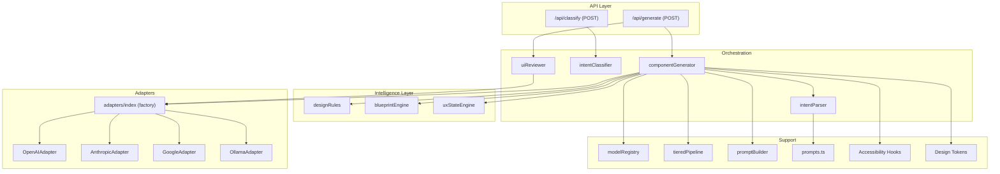
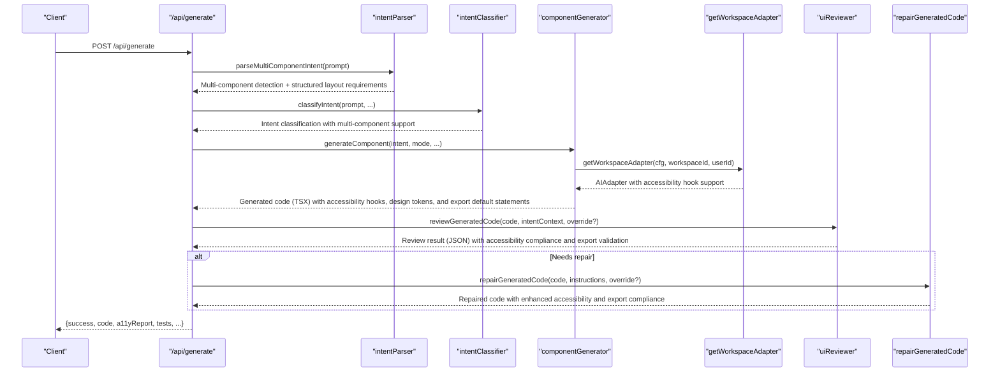
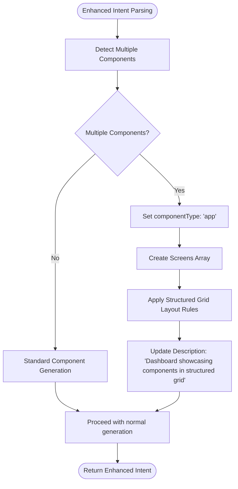
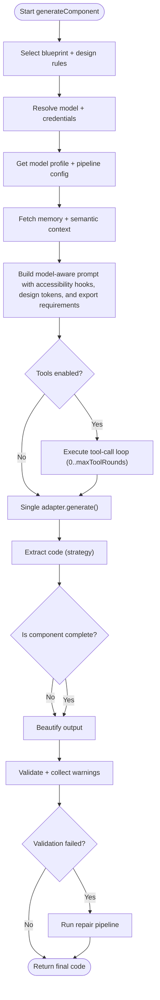
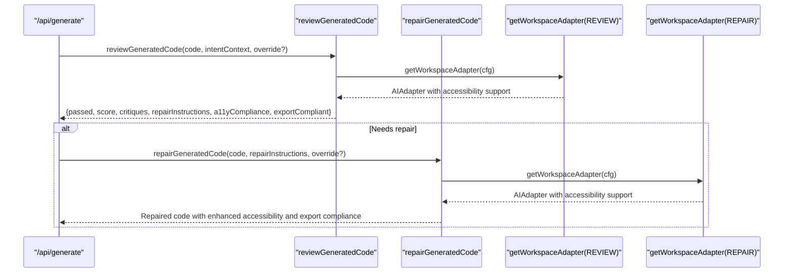
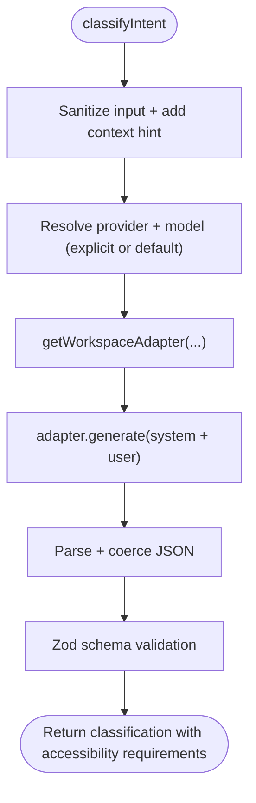
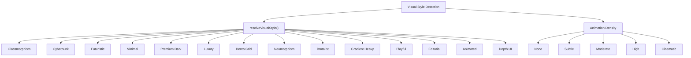
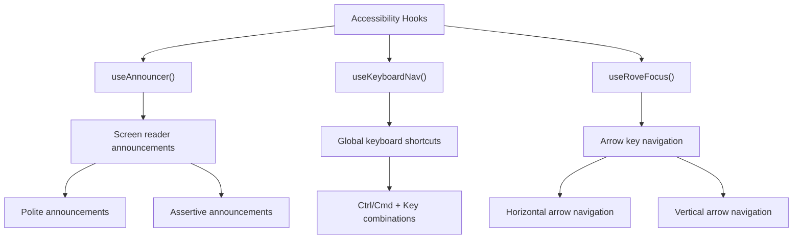
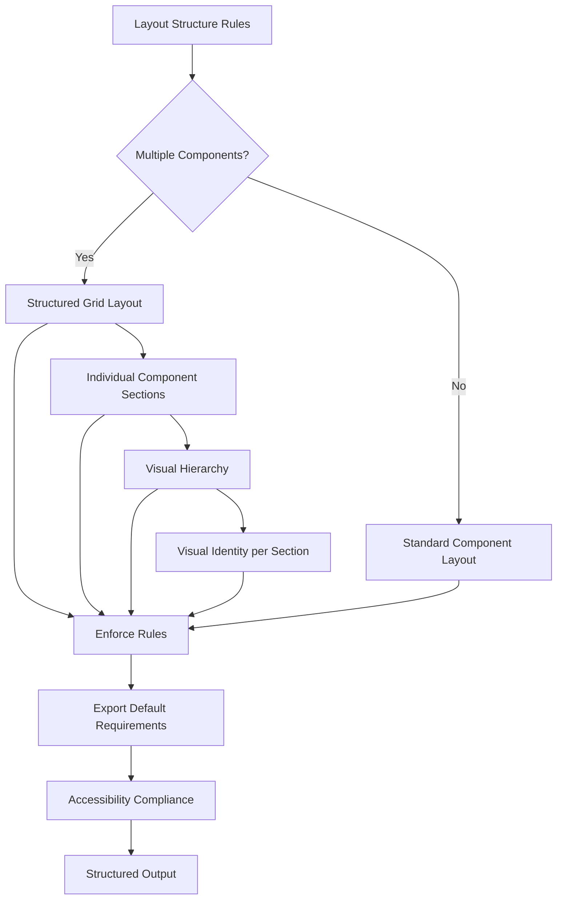
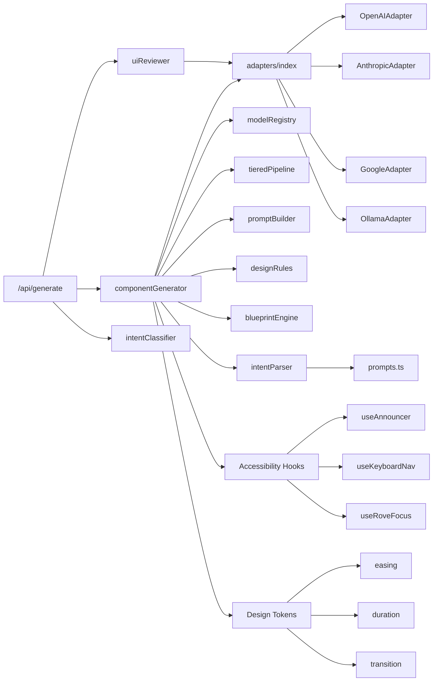

# AI Generation Engine

<cite>
**Referenced Files in This Document**
- [route.ts](file://app/api/generate/route.ts)
- [route.ts](file://app/api/classify/route.ts)
- [index.ts](file://lib/ai/adapters/index.ts)
- [openai.ts](file://lib/ai/adapters/openai.ts)
- [google.ts](file://lib/ai/adapters/google.ts)
- [chunkGenerator.ts](file://lib/ai/chunkGenerator.ts)
- [componentGenerator.ts](file://lib/ai/componentGenerator.ts)
- [uiReviewer.ts](file://lib/ai/uiReviewer.ts)
- [intentClassifier.ts](file://lib/ai/intentClassifier.ts)
- [modelRegistry.ts](file://lib/ai/modelRegistry.ts)
- [tieredPipeline.ts](file://lib/ai/tieredPipeline.ts)
- [promptBuilder.ts](file://lib/ai/promptBuilder.ts)
- [promptBudget.ts](file://lib/ai/promptBudget.ts)
- [designRules.ts](file://lib/intelligence/designRules.ts)
- [blueprintEngine.ts](file://lib/intelligence/blueprintEngine.ts)
- [prompts.ts](file://lib/ai/prompts.ts)
- [uiCheatSheet.ts](file://lib/ai/uiCheatSheet.ts)
- [useAnnouncer.ts](file://packages/a11y/hooks/useAnnouncer.ts)
- [useKeyboardNav.ts](file://packages/a11y/hooks/useKeyboardNav.ts)
- [index.ts](file://packages/tokens/index.ts)
- [transitions.ts](file://packages/tokens/transitions.ts)
</cite>

## Update Summary
**Changes Made**
- Enhanced AI prompt requirements with strengthened export statement requirements and clearer guidance for token usage patterns
- Added explicit export default statements requirement across all generation modes
- Strengthened token usage syntax rules with detailed examples and validation patterns
- Improved syntax rules enforcement for design token imports and usage
- Enhanced error handling consistency across the generation pipeline
- Improved code hygiene by removing unnecessary type imports

## Table of Contents
1. [Introduction](#introduction)
2. [Project Structure](#project-structure)
3. [Core Components](#core-components)
4. [Architecture Overview](#architecture-overview)
5. [Detailed Component Analysis](#detailed-component-analysis)
6. [Enhanced Design System](#enhanced-design-system)
7. [Accessibility Hook Integration](#accessibility-hook-integration)
8. [Multi-Component Generation Pipeline](#multi-component-generation-pipeline)
9. [Dependency Analysis](#dependency-analysis)
10. [Performance Considerations](#performance-considerations)
11. [Troubleshooting Guide](#troubleshooting-guide)
12. [Conclusion](#conclusion)

## Introduction
This document explains the AI generation engine that powers UI component creation with enhanced accessibility-first design principles. It covers the multi-stage generation pipeline (intent classification, expert reviewer stage, and AI repair agent), the universal adapter system supporting multiple providers (OpenAI, Anthropic, Google, DeepSeek, Ollama), model selection and configuration, tiered pipeline configuration for different quality levels, and prompt engineering strategies. The engine now emphasizes visually stunning UI components with comprehensive accessibility hook integration, enhanced design token usage patterns, and streamlined error handling approaches with strengthened export statement requirements.

## Project Structure
The generation engine spans API routes, adapters, and orchestration logic with enhanced accessibility intelligence and comprehensive design system integration:
- API routes handle requests, validate inputs, and coordinate the pipeline with accessibility-first prompts.
- Adapters encapsulate provider-specific clients behind a unified interface with enhanced token and hook support.
- Orchestrators assemble prompts with accessibility hooks, manage tool loops, and post-process outputs.
- Utilities provide model profiles, classification, review/repair logic, and comprehensive design systems.
- Intelligence modules handle blueprint selection, design rules application, visual style detection, and accessibility integration.
- Enhanced accessibility system provides comprehensive hook documentation and design token examples.

**Diagram sources**
- [route.ts:1-387](file://app/api/generate/route.ts#L1-L387)
- [route.ts:1-76](file://app/api/classify/route.ts#L1-L76)
- [index.ts:1-296](file://lib/ai/adapters/index.ts#L1-L296)
- [openai.ts:1-218](file://lib/ai/adapters/openai.ts#L1-L218)
- [google.ts:1-90](file://lib/ai/adapters/google.ts#L1-L90)
- [chunkGenerator.ts:1-220](file://lib/ai/chunkGenerator.ts#L1-L220)
- [componentGenerator.ts:1-402](file://lib/ai/componentGenerator.ts#L1-L402)
- [uiReviewer.ts:1-184](file://lib/ai/uiReviewer.ts#L1-L184)
- [intentClassifier.ts:1-208](file://lib/ai/intentClassifier.ts#L1-L208)
- [modelRegistry.ts:1-1138](file://lib/ai/modelRegistry.ts#L1-L1138)
- [tieredPipeline.ts:1-285](file://lib/ai/tieredPipeline.ts#L1-L285)
- [designRules.ts:1-245](file://lib/intelligence/designRules.ts#L1-L245)
- [blueprintEngine.ts:1-215](file://lib/intelligence/blueprintEngine.ts#L1-L215)
- [prompts.ts:1-556](file://lib/ai/prompts.ts#L1-L556)
- [uiCheatSheet.ts:1-140](file://lib/ai/uiCheatSheet.ts#L1-L140)
- [useAnnouncer.ts:1-39](file://packages/a11y/hooks/useAnnouncer.ts#L1-L39)
- [useKeyboardNav.ts:1-66](file://packages/a11y/hooks/useKeyboardNav.ts#L1-L66)
- [index.ts:1-26](file://packages/tokens/index.ts#L1-L26)
- [transitions.ts:1-36](file://packages/tokens/transitions.ts#L1-L36)

**Section sources**
- [route.ts:1-387](file://app/api/generate/route.ts#L1-L387)
- [route.ts:1-76](file://app/api/classify/route.ts#L1-L76)
- [index.ts:1-296](file://lib/ai/adapters/index.ts#L1-L296)
- [openai.ts:1-218](file://lib/ai/adapters/openai.ts#L1-L218)
- [google.ts:1-90](file://lib/ai/adapters/google.ts#L1-L90)
- [chunkGenerator.ts:1-220](file://lib/ai/chunkGenerator.ts#L1-L220)

## Core Components
- Universal Adapter Interface: A single AIAdapter contract defines generate() and stream(), enabling provider-agnostic code with enhanced accessibility hook support.
- Adapter Factory: Securely resolves credentials from workspace settings or environment variables, selects the correct adapter, and caches results with accessibility-aware configurations.
- Component Generator: Orchestrates intent-driven generation with model-aware prompts, tool loops, extraction, beautification, and deterministic repair with comprehensive accessibility hook integration and strengthened export statement requirements.
- Enhanced Intent Parser: Advanced intent classification system with multi-component detection capabilities that can identify when users request multiple separate UI components.
- Expert Reviewer and Repair Agent: Second-pass review with JSON schema validation and targeted repair using a dedicated repair model with accessibility compliance checks.
- Model Registry: Static capability profiles drive pipeline tiers, token budgets, extraction strategies, and timeouts with accessibility hook support.
- Enhanced Design Intelligence: Advanced design rules, blueprint engine, and visual style detection for creating visually stunning components with structured layouts and comprehensive design token usage.
- Tiered Pipeline: Refined configuration system with optimized token budgets, temperature settings, and timeout management including accessibility hook documentation.
- Accessibility Hook System: Comprehensive documentation and integration of useAnnouncer(), useKeyboardNav(), and useRoveFocus() hooks with detailed usage examples.
- Design Token Integration: Enhanced design token import examples including missing easing and duration token imports for consistent animation and transition patterns.

**Section sources**
- [index.ts:1-296](file://lib/ai/adapters/index.ts#L1-L296)
- [openai.ts:1-218](file://lib/ai/adapters/openai.ts#L1-L218)
- [google.ts:1-90](file://lib/ai/adapters/google.ts#L1-L90)
- [chunkGenerator.ts:1-220](file://lib/ai/chunkGenerator.ts#L1-L220)
- [componentGenerator.ts:1-402](file://lib/ai/componentGenerator.ts#L1-L402)
- [uiReviewer.ts:1-184](file://lib/ai/uiReviewer.ts#L1-L184)
- [intentClassifier.ts:1-208](file://lib/ai/intentClassifier.ts#L1-L208)
- [modelRegistry.ts:1-1138](file://lib/ai/modelRegistry.ts#L1-L1138)
- [tieredPipeline.ts:1-285](file://lib/ai/tieredPipeline.ts#L1-L285)
- [designRules.ts:1-245](file://lib/intelligence/designRules.ts#L1-L245)
- [blueprintEngine.ts:1-215](file://lib/intelligence/blueprintEngine.ts#L1-L215)
- [prompts.ts:8-78](file://lib/ai/prompts.ts#L8-L78)
- [useAnnouncer.ts:1-39](file://packages/a11y/hooks/useAnnouncer.ts#L1-L39)
- [useKeyboardNav.ts:1-66](file://packages/a11y/hooks/useKeyboardNav.ts#L1-L66)
- [index.ts:1-26](file://packages/tokens/index.ts#L1-L26)
- [transitions.ts:1-36](file://packages/tokens/transitions.ts#L1-L36)

## Architecture Overview
The generation pipeline integrates intent classification, component generation, expert review, and parallel validations with enhanced accessibility intelligence, comprehensive design token usage, and streamlined error handling approaches with strengthened export statement requirements.

**Diagram sources**
- [route.ts:1-387](file://app/api/generate/route.ts#L1-L387)
- [route.ts:1-76](file://app/api/classify/route.ts#L1-L76)
- [prompts.ts:8-78](file://lib/ai/prompts.ts#L8-L78)
- [componentGenerator.ts:1-402](file://lib/ai/componentGenerator.ts#L1-L402)
- [index.ts:1-296](file://lib/ai/adapters/index.ts#L1-L296)
- [uiReviewer.ts:1-184](file://lib/ai/uiReviewer.ts#L1-L184)

## Detailed Component Analysis

### Universal Adapter System
The adapter system provides a unified interface for multiple providers and supports local and cloud models through a single factory with enhanced accessibility hook integration.

- Provider resolution: The factory detects provider from model name or explicit provider, supports OpenAI-compatible providers, and falls back to local Ollama/LM Studio when appropriate.
- Credential resolution: Credentials are resolved server-side via workspace key service or environment variables; the factory avoids accepting client-provided secrets.
- Caching: A cached adapter wraps underlying adapters to cache generation results and stream chunks and dispatch metrics.
- Accessibility hook support: Enhanced adapter configurations support accessibility hook integration and design token usage patterns.

**Diagram sources**
- [openai.ts:1-218](file://lib/ai/adapters/openai.ts#L1-L218)
- [google.ts:1-90](file://lib/ai/adapters/google.ts#L1-L90)
- [index.ts:1-296](file://lib/ai/adapters/index.ts#L1-L296)

**Section sources**
- [index.ts:1-296](file://lib/ai/adapters/index.ts#L1-L296)
- [openai.ts:1-218](file://lib/ai/adapters/openai.ts#L1-L218)
- [google.ts:1-90](file://lib/ai/adapters/google.ts#L1-L90)

### Adapter Factory Pattern and Credential Resolution
- getWorkspaceAdapter: Resolves credentials from workspace settings, environment variables, or returns an unconfigured adapter for graceful degradation.
- Compatibility providers: OpenAI-compatible providers (e.g., Groq, LM Studio) are routed through the OpenAI adapter with appropriate base URLs.
- Local models: On Vercel, local providers return an unconfigured adapter to prevent connection errors; otherwise, OllamaAdapter is used.
- Enhanced accessibility support: Adapter configurations now include accessibility hook and design token integration capabilities.

**Section sources**
- [index.ts:218-270](file://lib/ai/adapters/index.ts#L218-L270)

### Enhanced Intent Parsing and Multi-Component Detection
The intent parser now includes comprehensive multi-component detection capabilities that identify when users request multiple separate UI components and automatically sets up structured layout requirements.

- Multi-component detection: Identifies when users describe 2+ separate UI components in one prompt.
- Automatic app mode activation: Converts multi-component requests to app mode with structured layout requirements.
- Screen organization: Creates individual screens for each requested component with proper visual hierarchy.
- Layout enforcement: Ensures structured grid layouts with proper visual identity for each component section.
- Accessibility integration: Automatically includes accessibility requirements for multi-component scenarios.

**Diagram sources**
- [prompts.ts:74-78](file://lib/ai/prompts.ts#L74-L78)

**Section sources**
- [prompts.ts:8-78](file://lib/ai/prompts.ts#L8-L78)

### Component Generator Orchestration
The generator coordinates intent-driven generation with model-aware strategies and enhanced design intelligence, now including comprehensive multi-component support, accessibility hook integration, and strengthened export statement requirements.

- Model-agnostic layer: Uses modelRegistry profiles and tieredPipeline to adapt prompt style, token budgets, tool rounds, and repair strategy.
- Tool calls: Strict OpenAI protocol is followed; assistant messages include raw tool_calls arrays, and tool results are appended as role:'tool'.
- Extraction: Strategies vary by model capability (fence/heuristic/aggressive).
- Beautification and deterministic repair: Cleans and validates output before optional AI repair.
- Enhanced design integration: Blueprint engine and design rules provide visual style guidance throughout the generation process.
- Multi-component layout enforcement: Structured grid layouts with proper visual hierarchy for multi-component requests.
- Accessibility hook integration: Comprehensive documentation and usage examples for accessibility utilities.
- Design token usage: Enhanced token import examples including easing and duration tokens.
- **Updated**: Export statement enforcement: All generated components must include proper export default statements with validation checks.

**Diagram sources**
- [componentGenerator.ts:61-402](file://lib/ai/componentGenerator.ts#L61-L402)
- [modelRegistry.ts:1-1138](file://lib/ai/modelRegistry.ts#L1-L1138)
- [tieredPipeline.ts:1-285](file://lib/ai/tieredPipeline.ts#L1-L285)

**Section sources**
- [componentGenerator.ts:1-402](file://lib/ai/componentGenerator.ts#L1-L402)
- [modelRegistry.ts:1-1138](file://lib/ai/modelRegistry.ts#L1-L1138)
- [tieredPipeline.ts:1-285](file://lib/ai/tieredPipeline.ts#L1-L285)

### Expert Reviewer Stage and AI Repair Agent
The reviewer stage applies a second-pass expert review and optionally repairs issues with enhanced accessibility compliance checking and export statement validation.

- Reviewer adapter override: Honors the user's selected provider for consistency with the generation setup.
- Review schema: Enforces JSON output with pass/fail, score, critiques, repair instructions, accessibility compliance, and export statement validation.
- Repair agent: Applies exact repair instructions to fix structural, visual, logical, accessibility, and export statement issues.
- Accessibility compliance: Enhanced review process includes accessibility hook usage validation and export statement verification.

**Diagram sources**
- [route.ts:226-259](file://app/api/generate/route.ts#L226-L259)
- [uiReviewer.ts:55-184](file://lib/ai/uiReviewer.ts#L55-L184)
- [index.ts:218-270](file://lib/ai/adapters/index.ts#L218-L270)

**Section sources**
- [uiReviewer.ts:1-184](file://lib/ai/uiReviewer.ts#L1-L184)
- [route.ts:226-259](file://app/api/generate/route.ts#L226-L259)

### Enhanced Intent Classification Pipeline
The intent classifier determines intent type, suggested mode, and whether code generation should proceed immediately or require clarification, now with enhanced multi-component detection capabilities and accessibility requirement identification.

- Output format: Strict JSON schema with intent type, confidence, summary, suggested mode, and metadata including accessibility requirements.
- Retry on rate limits: Implements exponential backoff for 429 errors.
- Multi-component awareness: Enhanced classification that recognizes multi-component requests and suggests appropriate modes.
- Accessibility requirement detection: Automatically identifies accessibility needs based on component type and user intent.

**Diagram sources**
- [route.ts:1-76](file://app/api/classify/route.ts#L1-L76)
- [intentClassifier.ts:63-208](file://lib/ai/intentClassifier.ts#L63-L208)
- [index.ts:218-270](file://lib/ai/adapters/index.ts#L218-L270)

**Section sources**
- [route.ts:1-76](file://app/api/classify/route.ts#L1-L76)
- [intentClassifier.ts:1-208](file://lib/ai/intentClassifier.ts#L1-L208)

### Model Selection and Configuration
- Model registry: Centralized capability profiles define tiers, prompt strategies, token budgets, tool support, extraction strategy, and timeouts with accessibility hook support.
- Tiered pipeline: Different strategies for tiny/small/medium/large/cloud models govern temperature, tool rounds, and repair priority.
- Prompt engineering: Model-aware prompt building, token budget enforcement, and merging of system prompts for providers that do not support system roles.
- Enhanced design integration: Visual style detection and design rules application integrated into model selection process.
- Layout structure enforcement: Comprehensive layout rules embedded in system prompts for structured grid layouts and visual hierarchy.
- Accessibility hook documentation: Detailed usage examples and integration patterns for accessibility utilities.
- Design token enhancement: Comprehensive token import examples including missing easing and duration token usage.
- **Updated**: Export statement enforcement: All generation modes now require explicit export default statements with validation checks.
- **Updated**: Token usage syntax rules: Strengthened guidance for design token imports with detailed examples and validation patterns.

**Section sources**
- [modelRegistry.ts:1-1138](file://lib/ai/modelRegistry.ts#L1-L1138)
- [componentGenerator.ts:1-402](file://lib/ai/componentGenerator.ts#L1-L402)
- [tieredPipeline.ts:1-285](file://lib/ai/tieredPipeline.ts#L1-L285)
- [prompts.ts:80-120](file://lib/ai/prompts.ts#L80-L120)
- [prompts.ts:231-267](file://lib/ai/prompts.ts#L231-L267)

### Streamlined Error Handling and Code Cleanup
Recent improvements have focused on removing unnecessary type imports and cleaning up unused imports to streamline error handling approaches:

- **ThinkingPlan Removal**: Removed ThinkingPlan type import from API route handler to simplify error handling logic.
- **Unused Import Cleanup**: Removed unused imports in AI adapters and chunk generator to improve code maintainability.
- **Consistent Error Handling**: Enhanced error handling consistency across the generation pipeline with streamlined approach.
- **Code Hygiene**: Improved code cleanliness by eliminating unnecessary type dependencies.
- **Export Statement Validation**: Enhanced validation logic to ensure all generated components include proper export default statements.

**Section sources**
- [route.ts:48-52](file://app/api/generate/route.ts#L48-L52)
- [openai.ts:13-22](file://lib/ai/adapters/openai.ts#L13-L22)
- [google.ts:14-22](file://lib/ai/adapters/google.ts#L14-L22)
- [chunkGenerator.ts:13-18](file://lib/ai/chunkGenerator.ts#L13-L18)

## Enhanced Design System

### Visual Style Detection and Blueprint Engineering
The engine now includes sophisticated visual style detection and blueprint engineering for creating visually stunning UI components with structured layouts and comprehensive design token integration.

**Diagram sources**
- [blueprintEngine.ts:64-81](file://lib/intelligence/blueprintEngine.ts#L64-L81)
- [blueprintEngine.ts:83-90](file://lib/intelligence/blueprintEngine.ts#L83-L90)

### Design Rules Application
The design rules system provides comprehensive guidance for creating visually appealing and accessible components with structured layout requirements and enhanced design token usage.

- Navigation styles: Sidebar, top-nav, bottom-nav, or none based on content complexity
- Layout complexity: Minimal, standard, rich, or immersive based on design choices
- Depth UI activation: Scroll-linked parallax and layered motion for immersive experiences
- Motion strategies: Subtle microinteractions or cinematic scroll-linked parallax
- Content density: Sparse for landing pages, balanced for most applications, dense for data-heavy interfaces
- Typography scales: Compact for admin interfaces, balanced for general use, display for hero sections
- Accessibility prioritization: WCAG 2.1 AA compliance with proper contrast ratios and semantic HTML
- **Updated**: Structured grid layout requirements for multi-component scenarios with proper visual hierarchy
- **Updated**: Comprehensive design token usage patterns including easing and duration tokens for consistent animations
- **Updated**: Export statement requirements: All generated components must include proper export default statements

**Section sources**
- [designRules.ts:1-245](file://lib/intelligence/designRules.ts#L1-L245)
- [blueprintEngine.ts:1-215](file://lib/intelligence/blueprintEngine.ts#L1-L215)

## Accessibility Hook Integration

### Comprehensive Accessibility Hook Documentation
The AI system now includes detailed documentation and usage examples for accessibility hooks, ensuring generated components meet WCAG 2.1 AA compliance standards.

**Diagram sources**
- [useAnnouncer.ts:1-39](file://packages/a11y/hooks/useAnnouncer.ts#L1-L39)
- [useKeyboardNav.ts:1-66](file://packages/a11y/hooks/useKeyboardNav.ts#L1-L66)

### Enhanced System Prompt Integration
System prompts now include comprehensive accessibility hook documentation and usage examples for developers and AI models, with strengthened export statement requirements.

#### useAnnouncer Hook Usage
- **Purpose**: Provides screen reader announcements for dynamic content updates
- **Usage Pattern**: `const announce = useAnnouncer(); announce('Message', 'polite');`
- **Implementation**: Creates aria-live region with polite or assertive politeness levels
- **Best Practices**: Clear, concise messages with appropriate politeness level

#### useKeyboardNav Hook Usage
- **Purpose**: Enables global keyboard shortcuts for application-wide actions
- **Usage Pattern**: `useKeyboardNav([{ key:'k', ctrl:true, handler:() => {} }]);`
- **Implementation**: Event listener for keyboard combinations with modifier keys
- **Best Practices**: Descriptive key combinations, preventDefault for handled events

#### useRoveFocus Hook Usage
- **Purpose**: Implements arrow key navigation for roving focus management
- **Usage Pattern**: `const { currentIndex, handleKeyDown } = useRoveFocus(5, 'horizontal');`
- **Implementation**: Circular focus management with Home/End support
- **Best Practices**: Proper orientation handling, currentIndex state management

**Section sources**
- [prompts.ts:93-98](file://lib/ai/prompts.ts#L93-L98)
- [prompts.ts:252-256](file://lib/ai/prompts.ts#L252-L256)
- [promptBuilder.ts:69-70](file://lib/ai/promptBuilder.ts#L69-L70)
- [promptBuilder.ts:252-256](file://lib/ai/promptBuilder.ts#L252-L256)
- [uiCheatSheet.ts:48-55](file://lib/ai/uiCheatSheet.ts#L48-L55)
- [useAnnouncer.ts:1-39](file://packages/a11y/hooks/useAnnouncer.ts#L1-L39)
- [useKeyboardNav.ts:1-66](file://packages/a11y/hooks/useKeyboardNav.ts#L1-L66)

### Enhanced Design Token Integration
The system now includes comprehensive design token import examples, including previously missing easing and duration token imports for consistent animation and transition patterns.

#### Design Token Categories
- **Colors**: Semantic color scales with brand variations and status colors
- **Spacing**: Consistent spacing scale from 1px increments to large gaps
- **Typography**: Hierarchical text styles with toStyle() conversion
- **Transitions**: Complete easing curves and duration presets
- **Shadows**: Multi-level shadow system for depth indication
- **Radius**: Rounded corner scale for modern UI elements

#### Transition Token Usage
- **Duration Presets**: instant (0ms), fast (100ms), normal (200ms), slow (300ms), slower (500ms), slowest (700ms)
- **Easing Curves**: Linear, in/out variants, elastic, back, and exponential curves
- **Motion Presets**: Consistent timing functions for micro-interactions and page transitions

**Section sources**
- [prompts.ts:102](file://lib/ai/prompts.ts#L102)
- [prompts.ts:285](file://lib/ai/prompts.ts#L285)
- [promptBuilder.ts:77](file://lib/ai/promptBuilder.ts#L77)
- [promptBuilder.ts:259](file://lib/ai/promptBuilder.ts#L259)
- [uiCheatSheet.ts:88-97](file://lib/ai/uiCheatSheet.ts#L88-L97)
- [index.ts:24-25](file://packages/tokens/index.ts#L24-L25)
- [transitions.ts:10-36](file://packages/tokens/transitions.ts#L10-L36)

## Multi-Component Generation Pipeline

### Enhanced Layout Structure Rules
Both component generator and app mode system prompts now include comprehensive layout structure rules that enforce structured grid layouts and proper visual hierarchy with enhanced accessibility considerations and export statement requirements.

- **Critical**: When the intent describes MULTIPLE components/sections, organize them in a STRUCTURED GRID LAYOUT — NOT a flat vertical stack.
- **Responsive Grid**: Use `grid grid-cols-1 md:grid-cols-2 lg:grid-cols-3 gap-6` for cards/tiers.
- **Individual Sections**: Wrap each distinct component in its own `<section>` or `<article>` with a heading.
- **Page Container**: Use a page-level container with consistent padding and a header: `
`.
- **Visual Identity**: Each section should have: title, description, and its own visual identity (border, rounded corners, shadow).
- **Proper Grouping**: NEVER dump all elements in a single flat list — always create visual hierarchy and grouping.
- **Export Statements**: Each component section must include proper export default statements.
- **Accessibility**: Each section should include proper ARIA labels and semantic HTML structure.
- **Navigation**: Include skip links and keyboard navigation support for multi-component layouts.

**Diagram sources**
- [prompts.ts:98-120](file://lib/ai/prompts.ts#L98-L120)
- [prompts.ts:248-267](file://lib/ai/prompts.ts#L248-L267)

**Section sources**
- [prompts.ts:98-120](file://lib/ai/prompts.ts#L98-L120)
- [prompts.ts:248-267](file://lib/ai/prompts.ts#L248-L267)

## Dependency Analysis
The generation engine exhibits clear separation of concerns with enhanced accessibility intelligence, comprehensive design token usage, and streamlined error handling:
- API routes depend on orchestrators and validators with enhanced accessibility support.
- Orchestrators depend on adapters, model registry, and intelligence modules with accessibility hook integration.
- Intelligence modules handle design rules, blueprint selection, visual style detection, and accessibility requirements.
- Adapters depend on provider SDKs or direct APIs with enhanced accessibility configurations.
- Utilities (classification, review, registry) are shared across flows with accessibility compliance checking.
- Enhanced intent parsing system provides multi-component detection capabilities with accessibility requirements.
- Accessibility hook system provides comprehensive documentation and integration patterns.
- Design token system ensures consistent animation and transition patterns across components.
- **Updated**: Streamlined error handling reduces dependency on unnecessary type imports.
- **Updated**: Export statement validation ensures all generated components meet export requirements.

**Diagram sources**
- [route.ts:1-387](file://app/api/generate/route.ts#L1-L387)
- [route.ts:1-76](file://app/api/classify/route.ts#L1-L76)
- [componentGenerator.ts:1-402](file://lib/ai/componentGenerator.ts#L1-L402)
- [uiReviewer.ts:1-184](file://lib/ai/uiReviewer.ts#L1-L184)
- [intentClassifier.ts:1-208](file://lib/ai/intentClassifier.ts#L1-L208)
- [index.ts:1-296](file://lib/ai/adapters/index.ts#L1-L296)
- [modelRegistry.ts:1-1138](file://lib/ai/modelRegistry.ts#L1-L1138)
- [tieredPipeline.ts:1-285](file://lib/ai/tieredPipeline.ts#L1-L285)
- [designRules.ts:1-245](file://lib/intelligence/designRules.ts#L1-L245)
- [blueprintEngine.ts:1-215](file://lib/intelligence/blueprintEngine.ts#L1-L215)
- [prompts.ts:1-556](file://lib/ai/prompts.ts#L1-L556)
- [uiCheatSheet.ts:1-140](file://lib/ai/uiCheatSheet.ts#L1-L140)
- [useAnnouncer.ts:1-39](file://packages/a11y/hooks/useAnnouncer.ts#L1-L39)
- [useKeyboardNav.ts:1-66](file://packages/a11y/hooks/useKeyboardNav.ts#L1-L66)
- [index.ts:1-26](file://packages/tokens/index.ts#L1-L26)
- [transitions.ts:1-36](file://packages/tokens/transitions.ts#L1-L36)

**Section sources**
- [route.ts:1-387](file://app/api/generate/route.ts#L1-L387)
- [route.ts:1-76](file://app/api/classify/route.ts#L1-L76)
- [componentGenerator.ts:1-402](file://lib/ai/componentGenerator.ts#L1-L402)
- [uiReviewer.ts:1-184](file://lib/ai/uiReviewer.ts#L1-L184)
- [intentClassifier.ts:1-208](file://lib/ai/intentClassifier.ts#L1-L208)
- [index.ts:1-296](file://lib/ai/adapters/index.ts#L1-L296)
- [modelRegistry.ts:1-1138](file://lib/ai/modelRegistry.ts#L1-L1138)
- [tieredPipeline.ts:1-285](file://lib/ai/tieredPipeline.ts#L1-L285)
- [designRules.ts:1-245](file://lib/intelligence/designRules.ts#L1-L245)
- [blueprintEngine.ts:1-215](file://lib/intelligence/blueprintEngine.ts#L1-L215)
- [prompts.ts:1-556](file://lib/ai/prompts.ts#L1-L556)
- [uiCheatSheet.ts:1-140](file://lib/ai/uiCheatSheet.ts#L1-L140)

## Performance Considerations
- Streaming vs non-streaming: Streaming is used for live previews; non-streaming is used for production generation. Streaming reliability varies by model and provider.
- Token budgeting: The pipeline enforces strict token budgets per tier and trims optional context to avoid overflow.
- Tool-call loops: Controlled by pipeline config; too many rounds increase latency and cost.
- Caching: Generation and stream results are cached to reduce repeated calls and improve latency.
- Timeout management: Per-model timeouts and aggregate timeouts protect against slow providers and chained operations.
- Enhanced design processing: Blueprint and design rule computation adds overhead but significantly improves output quality.
- Visual style optimization: Pre-computed visual styles reduce runtime processing during generation.
- **Updated**: Multi-component layout enforcement adds computational overhead but ensures structured, professional output.
- **Updated**: Accessibility hook integration adds minimal overhead while significantly improving accessibility compliance.
- **Updated**: Design token usage patterns ensure consistent animation performance across components.
- **Updated**: Streamlined error handling reduces unnecessary type imports and improves code maintainability.
- **Updated**: Export statement validation adds minimal overhead but ensures all generated components are properly exported.

## Troubleshooting Guide
Common issues and resolutions:
- Empty or invalid code: Extraction confidence low or model did not produce a valid React component; check extraction strategy and prompt clarity.
- Truncated components: Tiny/small models may cut off mid-generation; enable deterministic or AI repair.
- Provider quota errors: 429 responses are handled with retries or graceful fallbacks; add keys or switch providers.
- Local model limitations: Some local models lack tool calls or system role support; adjust pipeline or use cloud models.
- Reviewer/repair failures: Failures are non-fatal and do not block valid code; the pipeline continues with original output.
- Design rule conflicts: When design rules conflict (e.g., performance-first vs Depth UI), the system provides warnings and adjusts accordingly.
- Visual style mismatch: If the generated component doesn't match the intended visual style, adjust the prompt or blueprint parameters.
- **Updated**: Multi-component layout issues: If components aren't properly structured in grid layouts, check that the intent parser correctly detected multiple components and that layout structure rules are being enforced.
- **Updated**: Structured grid layout problems: Ensure that the generated code follows the structured grid layout requirements with proper sectioning and visual hierarchy.
- **Updated**: Accessibility hook integration issues: If accessibility hooks aren't working properly, verify that the hooks are imported correctly and that the usage examples match the implementation patterns.
- **Updated**: Design token import problems: If design tokens aren't recognized, ensure that the complete token import pattern is used including easing and duration tokens for consistent animation behavior.
- **Updated**: Missing easing/duration tokens: Verify that the design token import includes both easing and duration presets for consistent animation timing across components.
- **Updated**: Type import issues: Recent cleanup removed unnecessary ThinkingPlan imports, resolving potential type conflicts in error handling.
- **Updated**: Export statement failures: If components fail export validation, ensure that each component includes proper export default statements with correct component names.
- **Updated**: Token usage syntax errors: Verify that design token imports follow the correct syntax patterns and that style properties are applied correctly using the style prop.

**Section sources**
- [componentGenerator.ts:330-397](file://lib/ai/componentGenerator.ts#L330-L397)
- [uiReviewer.ts:106-116](file://lib/ai/uiReviewer.ts#L106-L116)
- [route.ts:226-259](file://app/api/generate/route.ts#L226-L259)
- [designRules.ts:167-169](file://lib/intelligence/designRules.ts#L167-L169)
- [prompts.ts:98-120](file://lib/ai/prompts.ts#L98-L120)
- [prompts.ts:248-267](file://lib/ai/prompts.ts#L248-L267)
- [useAnnouncer.ts:1-39](file://packages/a11y/hooks/useAnnouncer.ts#L1-L39)
- [useKeyboardNav.ts:1-66](file://packages/a11y/hooks/useKeyboardNav.ts#L1-L66)
- [transitions.ts:1-36](file://packages/tokens/transitions.ts#L1-L36)

## Conclusion
The AI generation engine combines a universal adapter system, a model-agnostic orchestrator, enhanced design intelligence, expert review/repair, and comprehensive multi-component generation capabilities to deliver high-quality, visually stunning UI components with WCAG 2.1 AA accessibility compliance. The adapter factory securely resolves credentials, the model registry drives pipeline configuration with refined token budgets and temperature settings, and the enhanced design system ensures premium output with sophisticated visual style detection, blueprint engineering, structured layout enforcement, and comprehensive accessibility hook integration. The enhanced intent parsing system now detects multi-component requests and automatically applies structured grid layout requirements for professional, organized output. The expert reviewer stage ensures accessibility compliance and overall quality with strengthened export statement validation. The comprehensive accessibility hook documentation and design token integration provide developers with detailed usage examples and consistent implementation patterns. Recent improvements have streamlined error handling approaches by removing unnecessary type imports and cleaning up unused dependencies, resulting in more maintainable and efficient code. The enhanced export statement requirements ensure that all generated components are properly exported, while strengthened token usage syntax rules provide clearer guidance for design token integration. Together, these components provide a robust, extensible foundation for UI generation across providers and environments with a focus on creating visually impressive, accessible, and professionally structured user interfaces that properly handle both single components and complex multi-component scenarios with full accessibility support and proper export compliance.