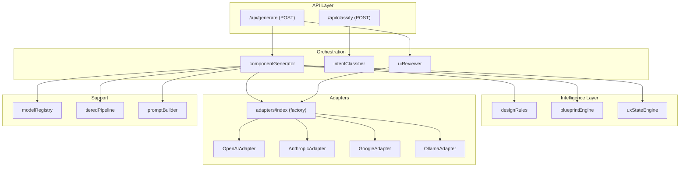
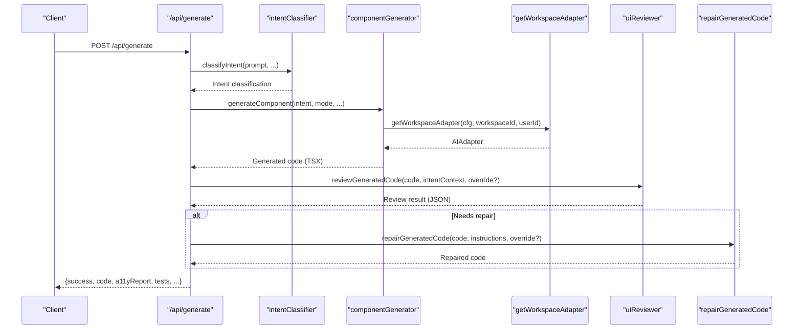
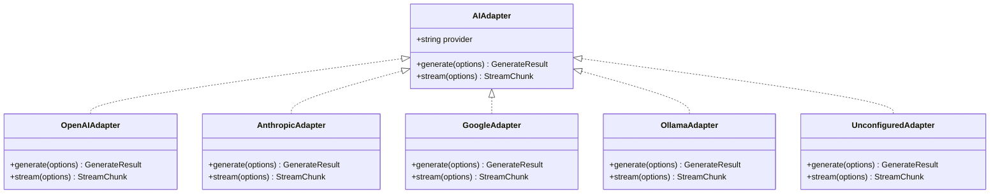
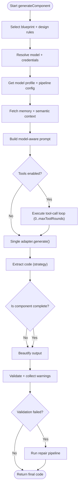
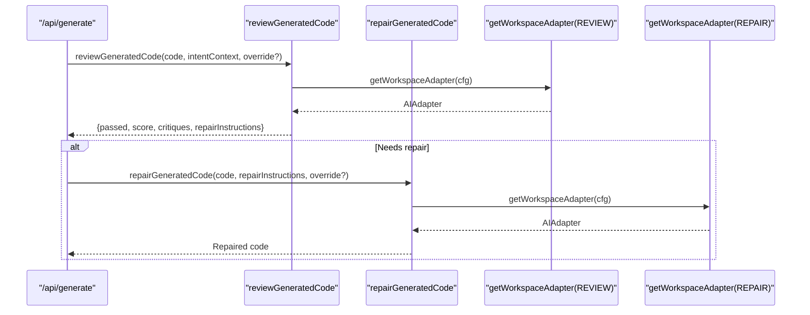
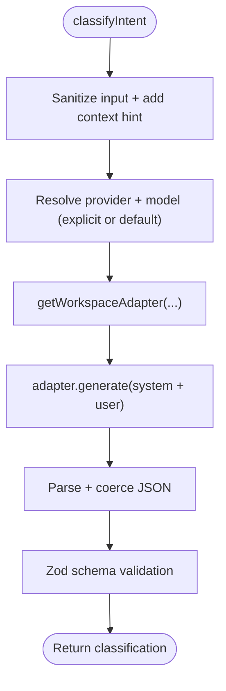
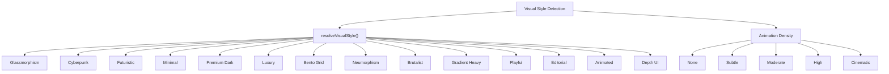
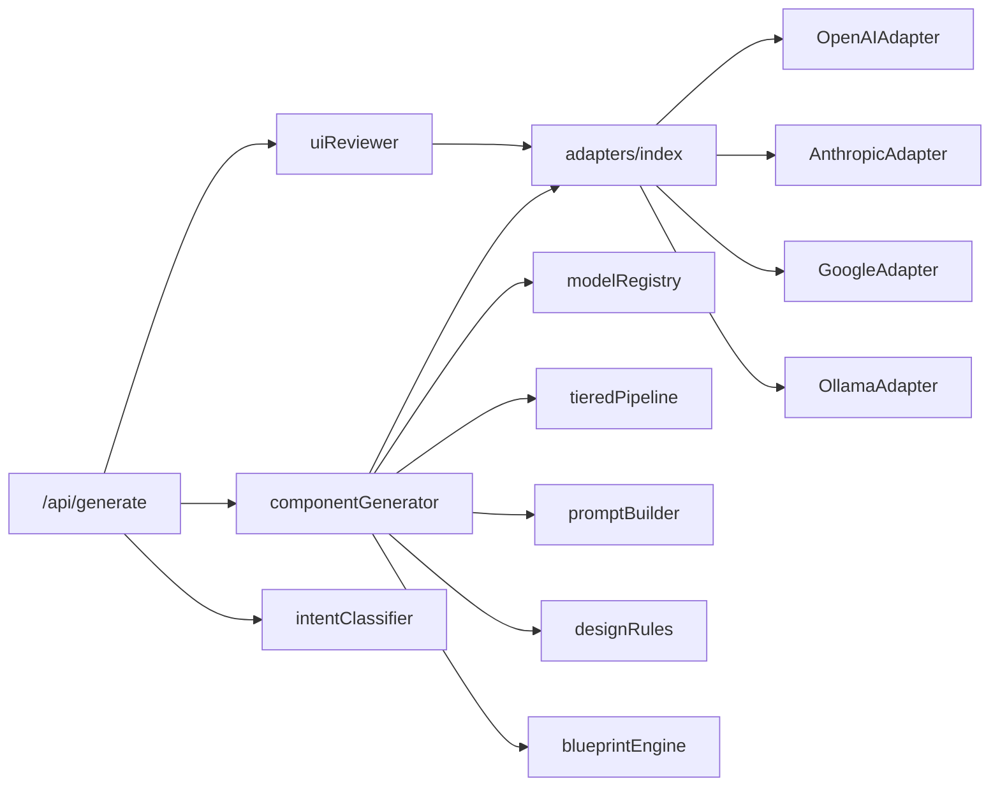

# AI Generation Engine

<cite>
**Referenced Files in This Document**
- [route.ts](file://app/api/generate/route.ts)
- [route.ts](file://app/api/classify/route.ts)
- [index.ts](file://lib/ai/adapters/index.ts)
- [base.ts](file://lib/ai/adapters/base.ts)
- [openai.ts](file://lib/ai/adapters/openai.ts)
- [anthropic.ts](file://lib/ai/adapters/anthropic.ts)
- [google.ts](file://lib/ai/adapters/google.ts)
- [componentGenerator.ts](file://lib/ai/componentGenerator.ts)
- [uiReviewer.ts](file://lib/ai/uiReviewer.ts)
- [intentClassifier.ts](file://lib/ai/intentClassifier.ts)
- [modelRegistry.ts](file://lib/ai/modelRegistry.ts)
- [tieredPipeline.ts](file://lib/ai/tieredPipeline.ts)
- [promptBuilder.ts](file://lib/ai/promptBuilder.ts)
- [promptBudget.ts](file://lib/ai/promptBudget.ts)
- [designRules.ts](file://lib/intelligence/designRules.ts)
- [blueprintEngine.ts](file://lib/intelligence/blueprintEngine.ts)
</cite>

## Update Summary
**Changes Made**
- Enhanced model registry with improved design guidelines emphasizing visually stunning UI components
- Refined tiered pipeline configuration with adjusted token budgets, temperature settings, and timeouts
- Updated architectural improvements for better performance and quality
- Added new design rules for Depth UI and modern visual aesthetics
- Improved blueprint engine with enhanced visual style detection

## Table of Contents
1. [Introduction](#introduction)
2. [Project Structure](#project-structure)
3. [Core Components](#core-components)
4. [Architecture Overview](#architecture-overview)
5. [Detailed Component Analysis](#detailed-component-analysis)
6. [Enhanced Design System](#enhanced-design-system)
7. [Dependency Analysis](#dependency-analysis)
8. [Performance Considerations](#performance-considerations)
9. [Troubleshooting Guide](#troubleshooting-guide)
10. [Conclusion](#conclusion)

## Introduction
This document explains the AI generation engine that powers UI component creation. It covers the multi-stage generation pipeline (intent classification, expert reviewer stage, and AI repair agent), the universal adapter system supporting multiple providers (OpenAI, Anthropic, Google, DeepSeek, Ollama), model selection and configuration, tiered pipeline configuration for different quality levels, and prompt engineering strategies. The engine now emphasizes visually stunning UI components with enhanced design guidelines and refined architectural improvements for superior output quality.

## Project Structure
The generation engine spans API routes, adapters, and orchestration logic with enhanced design intelligence:
- API routes handle requests, validate inputs, and coordinate the pipeline.
- Adapters encapsulate provider-specific clients behind a unified interface.
- Orchestrators assemble prompts, manage tool loops, and post-process outputs.
- Utilities provide model profiles, classification, review/repair logic, and enhanced design systems.
- Intelligence modules handle blueprint selection, design rules application, and visual style detection.

**Diagram sources**
- [route.ts:1-451](file://app/api/generate/route.ts#L1-L451)
- [route.ts:1-76](file://app/api/classify/route.ts#L1-L76)
- [index.ts:1-306](file://lib/ai/adapters/index.ts#L1-L306)
- [base.ts:1-73](file://lib/ai/adapters/base.ts#L1-L73)
- [openai.ts:1-223](file://lib/ai/adapters/openai.ts#L1-L223)
- [anthropic.ts:1-210](file://lib/ai/adapters/anthropic.ts#L1-L210)
- [google.ts:1-90](file://lib/ai/adapters/google.ts#L1-L90)
- [componentGenerator.ts:1-408](file://lib/ai/componentGenerator.ts#L1-L408)
- [uiReviewer.ts:1-184](file://lib/ai/uiReviewer.ts#L1-L184)
- [intentClassifier.ts:1-178](file://lib/ai/intentClassifier.ts#L1-L178)
- [modelRegistry.ts:1-1138](file://lib/ai/modelRegistry.ts#L1-L1138)
- [tieredPipeline.ts:1-285](file://lib/ai/tieredPipeline.ts#L1-L285)
- [designRules.ts:1-245](file://lib/intelligence/designRules.ts#L1-L245)
- [blueprintEngine.ts:1-215](file://lib/intelligence/blueprintEngine.ts#L1-L215)

**Section sources**
- [route.ts:1-451](file://app/api/generate/route.ts#L1-L451)
- [route.ts:1-76](file://app/api/classify/route.ts#L1-L76)
- [index.ts:1-306](file://lib/ai/adapters/index.ts#L1-L306)
- [base.ts:1-73](file://lib/ai/adapters/base.ts#L1-L73)
- [componentGenerator.ts:1-408](file://lib/ai/componentGenerator.ts#L1-L408)
- [uiReviewer.ts:1-184](file://lib/ai/uiReviewer.ts#L1-L184)
- [intentClassifier.ts:1-178](file://lib/ai/intentClassifier.ts#L1-L178)
- [modelRegistry.ts:1-1138](file://lib/ai/modelRegistry.ts#L1-L1138)
- [tieredPipeline.ts:1-285](file://lib/ai/tieredPipeline.ts#L1-L285)
- [designRules.ts:1-245](file://lib/intelligence/designRules.ts#L1-L245)
- [blueprintEngine.ts:1-215](file://lib/intelligence/blueprintEngine.ts#L1-L215)

## Core Components
- Universal Adapter Interface: A single AIAdapter contract defines generate() and stream(), enabling provider-agnostic code.
- Adapter Factory: Securely resolves credentials from workspace settings or environment variables, selects the correct adapter, and caches results.
- Component Generator: Orchestrates intent-driven generation with model-aware prompts, tool loops, extraction, beautification, and deterministic repair.
- Intent Classifier: Classifies user input into intent categories and suggests generation mode and context-appropriate pipeline.
- Expert Reviewer and Repair Agent: Second-pass review with JSON schema validation and targeted repair using a dedicated repair model.
- Model Registry: Static capability profiles drive pipeline tiers, token budgets, extraction strategies, and timeouts.
- Enhanced Design Intelligence: Advanced design rules, blueprint engine, and visual style detection for creating visually stunning components.
- Tiered Pipeline: Refined configuration system with optimized token budgets, temperature settings, and timeout management.

**Section sources**
- [base.ts:1-73](file://lib/ai/adapters/base.ts#L1-L73)
- [index.ts:1-306](file://lib/ai/adapters/index.ts#L1-L306)
- [componentGenerator.ts:1-408](file://lib/ai/componentGenerator.ts#L1-L408)
- [intentClassifier.ts:1-178](file://lib/ai/intentClassifier.ts#L1-L178)
- [uiReviewer.ts:1-184](file://lib/ai/uiReviewer.ts#L1-L184)
- [modelRegistry.ts:1-1138](file://lib/ai/modelRegistry.ts#L1-L1138)
- [tieredPipeline.ts:1-285](file://lib/ai/tieredPipeline.ts#L1-L285)
- [designRules.ts:1-245](file://lib/intelligence/designRules.ts#L1-L245)
- [blueprintEngine.ts:1-215](file://lib/intelligence/blueprintEngine.ts#L1-L215)

## Architecture Overview
The generation pipeline integrates intent classification, component generation, expert review, and parallel validations with enhanced design intelligence.

**Diagram sources**
- [route.ts:1-451](file://app/api/generate/route.ts#L1-L451)
- [route.ts:1-76](file://app/api/classify/route.ts#L1-L76)
- [componentGenerator.ts:1-408](file://lib/ai/componentGenerator.ts#L1-L408)
- [index.ts:1-306](file://lib/ai/adapters/index.ts#L1-L306)
- [uiReviewer.ts:1-184](file://lib/ai/uiReviewer.ts#L1-L184)

## Detailed Component Analysis

### Universal Adapter System
The adapter system provides a unified interface for multiple providers and supports local and cloud models through a single factory.

- Provider resolution: The factory detects provider from model name or explicit provider, supports OpenAI-compatible providers, and falls back to local Ollama/LM Studio when appropriate.
- Credential resolution: Credentials are resolved server-side via workspace key service or environment variables; the factory avoids accepting client-provided secrets.
- Caching: A cached adapter wraps underlying adapters to cache generation results and stream chunks and dispatch metrics.

**Diagram sources**
- [base.ts:1-73](file://lib/ai/adapters/base.ts#L1-L73)
- [openai.ts:1-223](file://lib/ai/adapters/openai.ts#L1-L223)
- [anthropic.ts:1-210](file://lib/ai/adapters/anthropic.ts#L1-L210)
- [google.ts:1-90](file://lib/ai/adapters/google.ts#L1-L90)
- [index.ts:1-306](file://lib/ai/adapters/index.ts#L1-L306)

**Section sources**
- [base.ts:1-73](file://lib/ai/adapters/base.ts#L1-L73)
- [index.ts:1-306](file://lib/ai/adapters/index.ts#L1-L306)
- [openai.ts:1-223](file://lib/ai/adapters/openai.ts#L1-L223)
- [anthropic.ts:1-210](file://lib/ai/adapters/anthropic.ts#L1-L210)
- [google.ts:1-90](file://lib/ai/adapters/google.ts#L1-L90)

### Adapter Factory Pattern and Credential Resolution
- getWorkspaceAdapter: Resolves credentials from workspace settings, environment variables, or returns an unconfigured adapter for graceful degradation.
- Compatibility providers: OpenAI-compatible providers (e.g., Groq, LM Studio) are routed through the OpenAI adapter with appropriate base URLs.
- Local models: On Vercel, local providers return an unconfigured adapter to prevent connection errors; otherwise, OllamaAdapter is used.

**Section sources**
- [index.ts:236-278](file://lib/ai/adapters/index.ts#L236-L278)

### Component Generator Orchestration
The generator coordinates intent-driven generation with model-aware strategies and enhanced design intelligence.

- Model-agnostic layer: Uses modelRegistry profiles and tieredPipeline to adapt prompt style, token budgets, tool rounds, and repair strategy.
- Tool calls: Strict OpenAI protocol is followed; assistant messages include raw tool_calls arrays, and tool results are appended as role:'tool'.
- Extraction: Strategies vary by model capability (fence/heuristic/aggressive).
- Beautification and deterministic repair: Cleans and validates output before optional AI repair.
- Enhanced design integration: Blueprint engine and design rules provide visual style guidance throughout the generation process.

**Diagram sources**
- [componentGenerator.ts:61-408](file://lib/ai/componentGenerator.ts#L61-L408)
- [modelRegistry.ts:1-1138](file://lib/ai/modelRegistry.ts#L1-L1138)
- [tieredPipeline.ts:1-285](file://lib/ai/tieredPipeline.ts#L1-L285)

**Section sources**
- [componentGenerator.ts:1-408](file://lib/ai/componentGenerator.ts#L1-L408)
- [modelRegistry.ts:1-1138](file://lib/ai/modelRegistry.ts#L1-L1138)
- [tieredPipeline.ts:1-285](file://lib/ai/tieredPipeline.ts#L1-L285)

### Expert Reviewer Stage and AI Repair Agent
The reviewer stage applies a second-pass expert review and optionally repairs issues.

- Reviewer adapter override: Honors the user's selected provider for consistency with the generation setup.
- Review schema: Enforces JSON output with pass/fail, score, critiques, and repair instructions.
- Repair agent: Applies exact repair instructions to fix structural, visual, or logical issues.

**Diagram sources**
- [route.ts:241-323](file://app/api/generate/route.ts#L241-L323)
- [uiReviewer.ts:55-184](file://lib/ai/uiReviewer.ts#L55-L184)
- [index.ts:236-278](file://lib/ai/adapters/index.ts#L236-L278)

**Section sources**
- [uiReviewer.ts:1-184](file://lib/ai/uiReviewer.ts#L1-L184)
- [route.ts:241-323](file://app/api/generate/route.ts#L241-L323)

### Intent Classification Pipeline
The intent classifier determines intent type, suggested mode, and whether code generation should proceed immediately or require clarification.

- Output format: Strict JSON schema with intent type, confidence, summary, suggested mode, and metadata.
- Retry on rate limits: Implements exponential backoff for 429 errors.

**Diagram sources**
- [route.ts:1-76](file://app/api/classify/route.ts#L1-L76)
- [intentClassifier.ts:63-178](file://lib/ai/intentClassifier.ts#L63-L178)
- [index.ts:236-278](file://lib/ai/adapters/index.ts#L236-L278)

**Section sources**
- [route.ts:1-76](file://app/api/classify/route.ts#L1-L76)
- [intentClassifier.ts:1-178](file://lib/ai/intentClassifier.ts#L1-L178)

### Model Selection and Configuration
- Model registry: Centralized capability profiles define tiers, prompt strategies, token budgets, tool support, extraction strategy, and timeouts.
- Tiered pipeline: Different strategies for tiny/small/medium/large/cloud models govern temperature, tool rounds, and repair priority.
- Prompt engineering: Model-aware prompt building, token budget enforcement, and merging of system prompts for providers that do not support system roles.
- Enhanced design integration: Visual style detection and design rules application integrated into model selection process.

**Section sources**
- [modelRegistry.ts:1-1138](file://lib/ai/modelRegistry.ts#L1-L1138)
- [componentGenerator.ts:1-408](file://lib/ai/componentGenerator.ts#L1-L408)
- [tieredPipeline.ts:1-285](file://lib/ai/tieredPipeline.ts#L1-L285)

## Enhanced Design System

### Visual Style Detection and Blueprint Engineering
The engine now includes sophisticated visual style detection and blueprint engineering for creating visually stunning UI components.

**Diagram sources**
- [blueprintEngine.ts:64-81](file://lib/intelligence/blueprintEngine.ts#L64-L81)
- [blueprintEngine.ts:83-90](file://lib/intelligence/blueprintEngine.ts#L83-L90)

### Design Rules Application
The design rules system provides comprehensive guidance for creating visually appealing and accessible components.

- Navigation styles: Sidebar, top-nav, bottom-nav, or none based on content complexity
- Layout complexity: Minimal, standard, rich, or immersive based on design choices
- Depth UI activation: Scroll-linked parallax and layered motion for immersive experiences
- Motion strategies: Subtle microinteractions or cinematic scroll-linked parallax
- Content density: Sparse for landing pages, balanced for most applications, dense for data-heavy interfaces
- Typography scales: Compact for admin interfaces, balanced for general use, display for hero sections
- Accessibility prioritization: WCAG 2.1 AA compliance with proper contrast ratios and semantic HTML

**Section sources**
- [designRules.ts:1-245](file://lib/intelligence/designRules.ts#L1-L245)
- [blueprintEngine.ts:1-215](file://lib/intelligence/blueprintEngine.ts#L1-L215)

## Dependency Analysis
The generation engine exhibits clear separation of concerns with enhanced design intelligence:
- API routes depend on orchestrators and validators.
- Orchestrators depend on adapters, model registry, and intelligence modules.
- Intelligence modules handle design rules, blueprint selection, and visual style detection.
- Adapters depend on provider SDKs or direct APIs.
- Utilities (classification, review, registry) are shared across flows.

**Diagram sources**
- [route.ts:1-451](file://app/api/generate/route.ts#L1-L451)
- [route.ts:1-76](file://app/api/classify/route.ts#L1-L76)
- [componentGenerator.ts:1-408](file://lib/ai/componentGenerator.ts#L1-L408)
- [uiReviewer.ts:1-184](file://lib/ai/uiReviewer.ts#L1-L184)
- [intentClassifier.ts:1-178](file://lib/ai/intentClassifier.ts#L1-L178)
- [index.ts:1-306](file://lib/ai/adapters/index.ts#L1-L306)
- [modelRegistry.ts:1-1138](file://lib/ai/modelRegistry.ts#L1-L1138)
- [tieredPipeline.ts:1-285](file://lib/ai/tieredPipeline.ts#L1-L285)
- [designRules.ts:1-245](file://lib/intelligence/designRules.ts#L1-L245)
- [blueprintEngine.ts:1-215](file://lib/intelligence/blueprintEngine.ts#L1-L215)

**Section sources**
- [route.ts:1-451](file://app/api/generate/route.ts#L1-L451)
- [route.ts:1-76](file://app/api/classify/route.ts#L1-L76)
- [componentGenerator.ts:1-408](file://lib/ai/componentGenerator.ts#L1-L408)
- [uiReviewer.ts:1-184](file://lib/ai/uiReviewer.ts#L1-L184)
- [intentClassifier.ts:1-178](file://lib/ai/intentClassifier.ts#L1-L178)
- [index.ts:1-306](file://lib/ai/adapters/index.ts#L1-L306)
- [modelRegistry.ts:1-1138](file://lib/ai/modelRegistry.ts#L1-L1138)
- [tieredPipeline.ts:1-285](file://lib/ai/tieredPipeline.ts#L1-L285)
- [designRules.ts:1-245](file://lib/intelligence/designRules.ts#L1-L245)
- [blueprintEngine.ts:1-215](file://lib/intelligence/blueprintEngine.ts#L1-L215)

## Performance Considerations
- Streaming vs non-streaming: Streaming is used for live previews; non-streaming is used for production generation. Streaming reliability varies by model and provider.
- Token budgeting: The pipeline enforces strict token budgets per tier and trims optional context to avoid overflow.
- Tool-call loops: Controlled by pipeline config; too many rounds increase latency and cost.
- Caching: Generation and stream results are cached to reduce repeated calls and improve latency.
- Timeout management: Per-model timeouts and aggregate timeouts protect against slow providers and chained operations.
- Enhanced design processing: Blueprint and design rule computation adds overhead but significantly improves output quality.
- Visual style optimization: Pre-computed visual styles reduce runtime processing during generation.

[No sources needed since this section provides general guidance]

## Troubleshooting Guide
Common issues and resolutions:
- Empty or invalid code: Extraction confidence low or model did not produce a valid React component; check extraction strategy and prompt clarity.
- Truncated components: Tiny/small models may cut off mid-generation; enable deterministic or AI repair.
- Provider quota errors: 429 responses are handled with retries or graceful fallbacks; add keys or switch providers.
- Local model limitations: Some local models lack tool calls or system role support; adjust pipeline or use cloud models.
- Reviewer/repair failures: Failures are non-fatal and do not block valid code; the pipeline continues with original output.
- Design rule conflicts: When design rules conflict (e.g., performance-first vs Depth UI), the system provides warnings and adjusts accordingly.
- Visual style mismatch: If the generated component doesn't match the intended visual style, adjust the prompt or blueprint parameters.

**Section sources**
- [componentGenerator.ts:330-397](file://lib/ai/componentGenerator.ts#L330-L397)
- [uiReviewer.ts:106-116](file://lib/ai/uiReviewer.ts#L106-L116)
- [route.ts:254-323](file://app/api/generate/route.ts#L254-L323)
- [designRules.ts:167-169](file://lib/intelligence/designRules.ts#L167-L169)

## Conclusion
The AI generation engine combines a universal adapter system, a model-agnostic orchestrator, enhanced design intelligence, and expert review/repair to deliver high-quality, visually stunning UI components. The adapter factory securely resolves credentials, the model registry drives pipeline configuration with refined token budgets and temperature settings, and the enhanced design system ensures premium output with sophisticated visual style detection and blueprint engineering. The expert reviewer stage ensures accessibility compliance and overall quality. Together, these components provide a robust, extensible foundation for UI generation across providers and environments with a focus on creating visually impressive and accessible user interfaces.