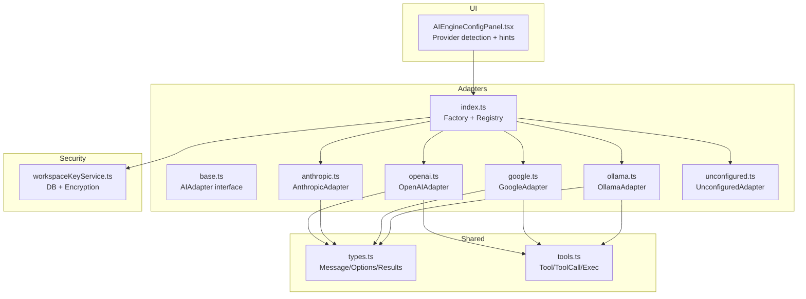
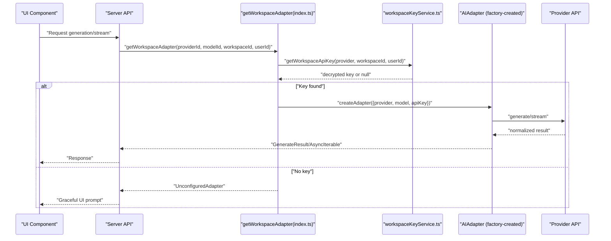
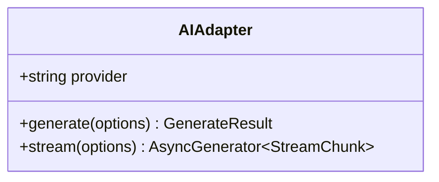
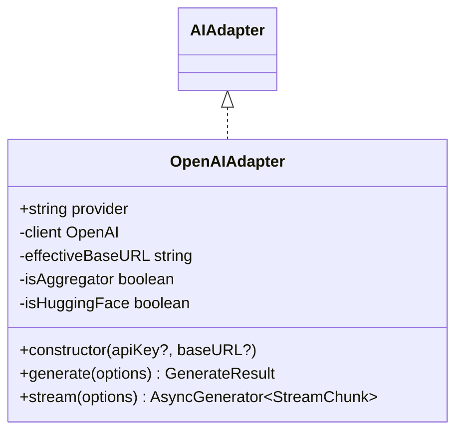
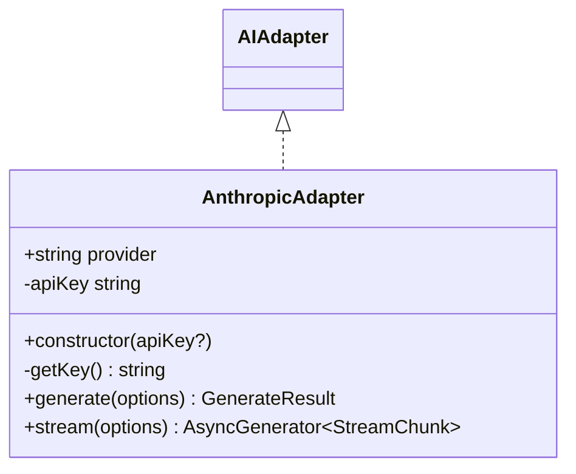
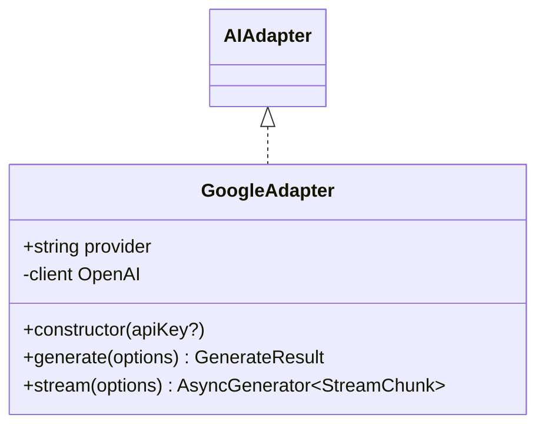
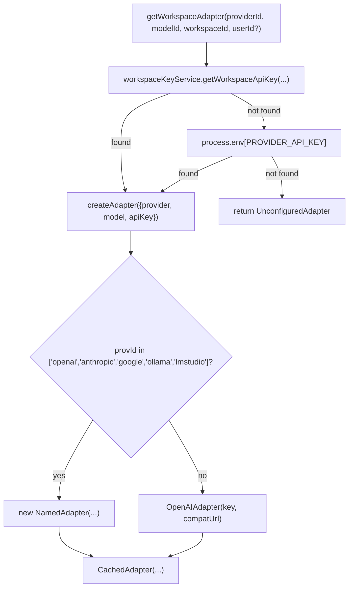
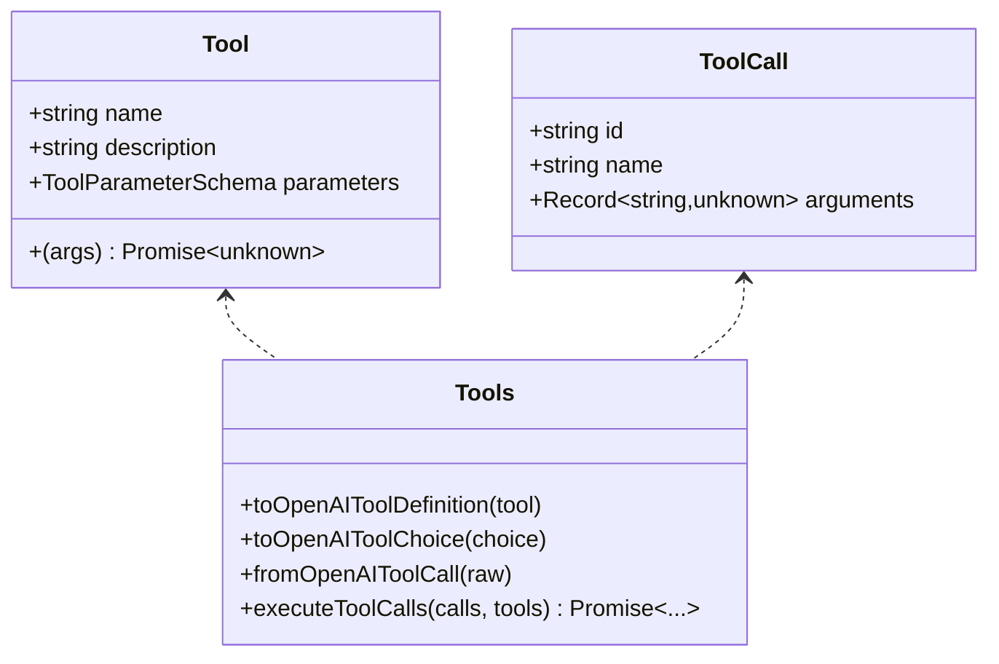
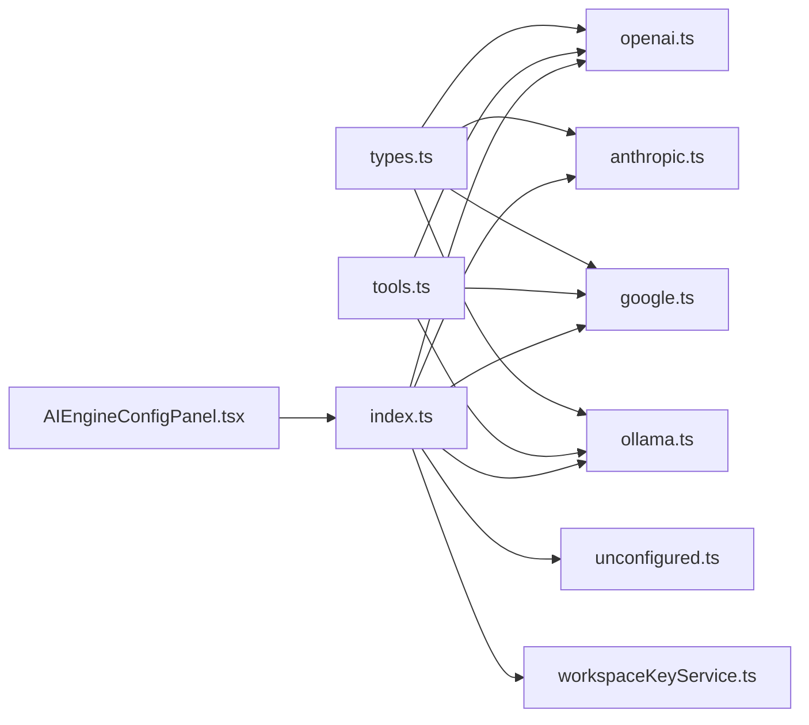

# AI Provider Adapters

<cite>
**Referenced Files in This Document**
- [base.ts](file://lib/ai/adapters/base.ts)
- [openai.ts](file://lib/ai/adapters/openai.ts)
- [anthropic.ts](file://lib/ai/adapters/anthropic.ts)
- [google.ts](file://lib/ai/adapters/google.ts)
- [ollama.ts](file://lib/ai/adapters/ollama.ts)
- [index.ts](file://lib/ai/adapters/index.ts)
- [types.ts](file://lib/ai/types.ts)
- [tools.ts](file://lib/ai/tools.ts)
- [unconfigured.ts](file://lib/ai/adapters/unconfigured.ts)
- [workspaceKeyService.ts](file://lib/security/workspaceKeyService.ts)
- [AIEngineConfigPanel.tsx](file://components/AIEngineConfigPanel.tsx)
- [adapters.test.ts](file://__tests__/adapters.test.ts)
</cite>

## Table of Contents
1. [Introduction](#introduction)
2. [Project Structure](#project-structure)
3. [Core Components](#core-components)
4. [Architecture Overview](#architecture-overview)
5. [Detailed Component Analysis](#detailed-component-analysis)
6. [Dependency Analysis](#dependency-analysis)
7. [Performance Considerations](#performance-considerations)
8. [Troubleshooting Guide](#troubleshooting-guide)
9. [Conclusion](#conclusion)
10. [Appendices](#appendices)

## Introduction
This document explains the universal AI adapter system that provides model-agnostic access to multiple AI providers. It covers the adapter factory pattern, the base adapter interface, and provider-specific implementations for OpenAI, Anthropic, Google, DeepSeek (via OpenAI-compatible mode), and Ollama. It also documents the adapter configuration system, authentication, model selection, provider-specific parameters, and the unified interface that abstracts provider differences. Finally, it describes adapter registration, workspace-specific adapter resolution, fallback mechanisms, and practical guidance for adding new adapters and handling provider-specific features such as tool calls and streaming responses.

## Project Structure
The AI adapter system is organized under lib/ai/adapters with a central factory and per-provider adapters. Supporting modules define shared types, tool schemas, and configuration helpers. UI components integrate with the configuration system to guide users in setting up credentials.

**Diagram sources**
- [index.ts:1-306](file://lib/ai/adapters/index.ts#L1-L306)
- [base.ts:1-73](file://lib/ai/adapters/base.ts#L1-L73)
- [openai.ts:1-223](file://lib/ai/adapters/openai.ts#L1-L223)
- [anthropic.ts:1-210](file://lib/ai/adapters/anthropic.ts#L1-L210)
- [google.ts:1-90](file://lib/ai/adapters/google.ts#L1-L90)
- [ollama.ts:1-87](file://lib/ai/adapters/ollama.ts#L1-L87)
- [types.ts:1-130](file://lib/ai/types.ts#L1-L130)
- [tools.ts:1-175](file://lib/ai/tools.ts#L1-L175)
- [unconfigured.ts:1-99](file://lib/ai/adapters/unconfigured.ts#L1-L99)
- [workspaceKeyService.ts:1-67](file://lib/security/workspaceKeyService.ts#L1-L67)
- [AIEngineConfigPanel.tsx:1-122](file://components/AIEngineConfigPanel.tsx#L1-L122)

**Section sources**
- [index.ts:1-306](file://lib/ai/adapters/index.ts#L1-L306)
- [types.ts:1-130](file://lib/ai/types.ts#L1-L130)
- [tools.ts:1-175](file://lib/ai/tools.ts#L1-L175)
- [workspaceKeyService.ts:1-67](file://lib/security/workspaceKeyService.ts#L1-L67)
- [AIEngineConfigPanel.tsx:1-122](file://components/AIEngineConfigPanel.tsx#L1-L122)

## Core Components
- AIAdapter interface: Defines the provider-agnostic contract with generate() and stream().
- Provider adapters: Implementations for OpenAI, Anthropic, Google, and Ollama; DeepSeek is supported via OpenAI-compatible mode.
- Factory and registry: Centralized creation logic with workspace-aware resolution and fallbacks.
- Shared types: Client-safe message, generation options/results, streaming chunks, and pricing utilities.
- Tools: Canonical tool schema and conversion helpers for provider-specific tool-calling formats.
- Unconfigured adapter: Graceful fallback when no credentials are available.

**Section sources**
- [base.ts:48-72](file://lib/ai/adapters/base.ts#L48-L72)
- [types.ts:19-55](file://lib/ai/types.ts#L19-L55)
- [tools.ts:47-79](file://lib/ai/tools.ts#L47-L79)
- [index.ts:146-215](file://lib/ai/adapters/index.ts#L146-L215)
- [unconfigured.ts:13-99](file://lib/ai/adapters/unconfigured.ts#L13-L99)

## Architecture Overview
The system enforces strict server-only credential resolution. The factory resolves credentials from workspace settings, environment variables, or returns an unconfigured adapter. Each adapter normalizes provider-specific differences into a unified interface.

**Diagram sources**
- [index.ts:236-278](file://lib/ai/adapters/index.ts#L236-L278)
- [workspaceKeyService.ts:32-67](file://lib/security/workspaceKeyService.ts#L32-L67)
- [unconfigured.ts:13-99](file://lib/ai/adapters/unconfigured.ts#L13-L99)

## Detailed Component Analysis

### Base Adapter Interface
Defines the canonical contract that all adapters implement:
- provider: Canonical provider name.
- generate(options): Non-streaming generation returning content, optional toolCalls, and usage.
- stream(options): Async generator yielding StreamChunk with delta text and done flag; usage may be included on the final chunk.

**Diagram sources**
- [base.ts:50-72](file://lib/ai/adapters/base.ts#L50-L72)

**Section sources**
- [base.ts:28-72](file://lib/ai/adapters/base.ts#L28-L72)

### OpenAI Adapter
Implements the OpenAI-compatible interface with special handling for reasoning models (o1/o3 series), tool-calling, response_format, and streaming. It auto-detects aggregator and Hugging Face routes and applies provider-specific constraints.

**Diagram sources**
- [openai.ts:36-223](file://lib/ai/adapters/openai.ts#L36-L223)
- [base.ts:50-72](file://lib/ai/adapters/base.ts#L50-L72)

**Section sources**
- [openai.ts:23-32](file://lib/ai/adapters/openai.ts#L23-L32)
- [openai.ts:64-157](file://lib/ai/adapters/openai.ts#L64-L157)
- [openai.ts:159-222](file://lib/ai/adapters/openai.ts#L159-L222)

### Anthropic Adapter
Uses the native Anthropic Messages API via fetch(), handling system prompts, JSON mode instructions, token caps, and streaming events.

**Diagram sources**
- [anthropic.ts:71-210](file://lib/ai/adapters/anthropic.ts#L71-L210)
- [base.ts:50-72](file://lib/ai/adapters/base.ts#L50-L72)

**Section sources**
- [anthropic.ts:71-145](file://lib/ai/adapters/anthropic.ts#L71-L145)
- [anthropic.ts:147-207](file://lib/ai/adapters/anthropic.ts#L147-L207)

### Google Adapter
Wraps Google AI Studio’s OpenAI-compatible endpoint, forwarding tools and streaming support.

**Diagram sources**
- [google.ts:24-90](file://lib/ai/adapters/google.ts#L24-L90)
- [base.ts:50-72](file://lib/ai/adapters/base.ts#L50-L72)

**Section sources**
- [google.ts:28-69](file://lib/ai/adapters/google.ts#L28-L69)
- [google.ts:71-88](file://lib/ai/adapters/google.ts#L71-L88)

### Ollama Adapter
Provides local inference via the OpenAI-compatible API exposed by Ollama/LM Studio/Groq/HuggingFace routes. Supports tools and streaming.

**Diagram sources**
- [ollama.ts:21-87](file://lib/ai/adapters/ollama.ts#L21-L87)
- [base.ts:50-72](file://lib/ai/adapters/base.ts#L50-L72)

**Section sources**
- [ollama.ts:25-66](file://lib/ai/adapters/ollama.ts#L25-L66)
- [ollama.ts:68-85](file://lib/ai/adapters/ollama.ts#L68-L85)

### Adapter Factory and Registry
Central factory with:
- detectProvider(model): Heuristic to infer provider from model name.
- createAdapter(cfg): Builds the appropriate adapter, validates credentials, and wraps with CachedAdapter for metrics and caching.
- getWorkspaceAdapter(providerId, modelId, workspaceId, userId?): Secure resolution via workspaceKeyService, env vars, or returns UnconfiguredAdapter.
- CachedAdapter: Adds caching and metrics for generate() and stream().

**Diagram sources**
- [index.ts:236-278](file://lib/ai/adapters/index.ts#L236-L278)
- [index.ts:146-215](file://lib/ai/adapters/index.ts#L146-L215)

**Section sources**
- [index.ts:50-64](file://lib/ai/adapters/index.ts#L50-L64)
- [index.ts:146-215](file://lib/ai/adapters/index.ts#L146-L215)
- [index.ts:236-278](file://lib/ai/adapters/index.ts#L236-L278)

### Unconfigured Adapter
Returns a friendly UI component or JSON payload when no credentials are available, preventing server errors and guiding users to configure settings.

**Section sources**
- [unconfigured.ts:13-99](file://lib/ai/adapters/unconfigured.ts#L13-L99)

### Tools and Tool Calls
A canonical schema for tools and conversions ensures consistent tool-calling across providers:
- Tool: name, description, parameters (JSON Schema subset), execute(args).
- ToolCall: id, name, parsed arguments.
- Conversion helpers: OpenAI tool definitions and choices, and OpenAI tool-call normalization.

**Diagram sources**
- [tools.ts:47-79](file://lib/ai/tools.ts#L47-L79)
- [tools.ts:108-133](file://lib/ai/tools.ts#L108-L133)
- [tools.ts:144-174](file://lib/ai/tools.ts#L144-L174)

**Section sources**
- [tools.ts:13-28](file://lib/ai/tools.ts#L13-L28)
- [tools.ts:47-79](file://lib/ai/tools.ts#L47-L79)
- [tools.ts:108-133](file://lib/ai/tools.ts#L108-L133)
- [tools.ts:144-174](file://lib/ai/tools.ts#L144-L174)

### Types and Pricing
Client-safe types define messages, generation options/results, and streaming chunks. Pricing utilities estimate costs per provider/model.

**Section sources**
- [types.ts:10-55](file://lib/ai/types.ts#L10-L55)
- [types.ts:71-130](file://lib/ai/types.ts#L71-L130)

### Configuration and Provider Detection (UI)
The AI Engine Config Panel detects provider from API key prefixes and displays provider-specific hints and documentation links.

**Section sources**
- [AIEngineConfigPanel.tsx:95-106](file://components/AIEngineConfigPanel.tsx#L95-L106)
- [AIEngineConfigPanel.tsx:108-121](file://components/AIEngineConfigPanel.tsx#L108-L121)

## Dependency Analysis
- Adapters depend on shared types and tools for message and tool-calling normalization.
- The factory depends on workspaceKeyService for secure credential resolution and environment variables as fallbacks.
- CachedAdapter decorates any AIAdapter to add caching and metrics.
- UI components rely on the factory and types for configuration and rendering.

**Diagram sources**
- [index.ts:1-306](file://lib/ai/adapters/index.ts#L1-L306)
- [types.ts:1-130](file://lib/ai/types.ts#L1-L130)
- [tools.ts:1-175](file://lib/ai/tools.ts#L1-L175)
- [workspaceKeyService.ts:1-67](file://lib/security/workspaceKeyService.ts#L1-L67)
- [AIEngineConfigPanel.tsx:1-122](file://components/AIEngineConfigPanel.tsx#L1-L122)

**Section sources**
- [index.ts:1-306](file://lib/ai/adapters/index.ts#L1-L306)
- [workspaceKeyService.ts:1-67](file://lib/security/workspaceKeyService.ts#L1-L67)

## Performance Considerations
- Caching: CachedAdapter caches both full results and streaming chunks keyed by normalized options, reducing provider calls and enabling latency metrics.
- Token caps: Provider-specific caps prevent oversized requests and reduce retries.
- Streaming: Providers that support usage in stream finalization enable accurate cost accounting.
- Environment checks: Early detection of aggregator/HF routes avoids unnecessary retries and misconfiguration.

[No sources needed since this section provides general guidance]

## Troubleshooting Guide
Common issues and resolutions:
- Missing API key: The factory throws a ConfigurationError or returns UnconfiguredAdapter. Configure via workspace settings or environment variables.
- Provider mismatch: Use explicit provider selection in configuration to avoid heuristic detection errors.
- Tool-calling not working: Some providers ignore tools; verify provider support and remove tools for incompatible providers.
- Streaming failures: Ensure provider supports streaming and that the adapter is using the correct endpoint/baseURL.
- Local providers unreachable on Vercel: The factory returns UnconfiguredAdapter to avoid connection errors.

**Section sources**
- [index.ts:28-40](file://lib/ai/adapters/index.ts#L28-L40)
- [index.ts:159-162](file://lib/ai/adapters/index.ts#L159-L162)
- [index.ts:204-207](file://lib/ai/adapters/index.ts#L204-L207)
- [unconfigured.ts:13-99](file://lib/ai/adapters/unconfigured.ts#L13-L99)

## Conclusion
The AI adapter system provides a robust, provider-agnostic abstraction over multiple AI providers. By centralizing credential resolution, enforcing server-only secrets, and normalizing provider differences, it enables seamless switching between models and providers. The factory, adapters, tools, and caching/metrics infrastructure work together to deliver a reliable and observable AI integration suitable for production environments.

[No sources needed since this section summarizes without analyzing specific files]

## Appendices

### Implementing a New Adapter
Steps to add a new provider:
1. Define a new class implementing AIAdapter with generate() and stream().
2. Normalize provider-specific message/tool/response formats to the shared types.
3. Register the adapter in the factory’s createAdapter() switch or treat it as OpenAI-compatible via baseUrl.
4. Add provider detection logic if supporting OpenAI-compatible mode.
5. Integrate with the UI configuration panel for hints and documentation.

References:
- [base.ts:50-72](file://lib/ai/adapters/base.ts#L50-L72)
- [index.ts:146-215](file://lib/ai/adapters/index.ts#L146-L215)
- [types.ts:19-55](file://lib/ai/types.ts#L19-L55)
- [tools.ts:108-133](file://lib/ai/tools.ts#L108-L133)

### Configuring Provider Credentials
- Workspace-level: Store encrypted keys in workspace settings; retrieved via workspaceKeyService.
- Environment fallback: Set provider-specific environment variables.
- Unconfigured fallback: When no keys are found, UnconfiguredAdapter returns a helpful UI or JSON.

References:
- [index.ts:236-278](file://lib/ai/adapters/index.ts#L236-L278)
- [workspaceKeyService.ts:32-67](file://lib/security/workspaceKeyService.ts#L32-L67)
- [unconfigured.ts:13-99](file://lib/ai/adapters/unconfigured.ts#L13-L99)

### Handling Provider-Specific Features
- Tool calls: Use the canonical Tool/ToolCall schema; adapters convert to/from provider-specific formats.
- Streaming: Use AsyncGenerator to yield StreamChunk deltas; usage may be included on the final chunk.
- Model constraints: Adapters handle provider-specific limitations (e.g., reasoning models, response_format, token caps).

References:
- [tools.ts:47-79](file://lib/ai/tools.ts#L47-L79)
- [openai.ts:64-157](file://lib/ai/adapters/openai.ts#L64-L157)
- [anthropic.ts:89-145](file://lib/ai/adapters/anthropic.ts#L89-L145)
- [google.ts:35-69](file://lib/ai/adapters/google.ts#L35-L69)
- [ollama.ts:32-66](file://lib/ai/adapters/ollama.ts#L32-L66)

### Example Workflows and Tests
- Adapter usage and streaming are validated in tests for OpenAI, Anthropic, Google, and Ollama.
- Tests demonstrate tool-calling and streaming behavior.

References:
- [adapters.test.ts:1-96](file://__tests__/adapters.test.ts#L1-L96)