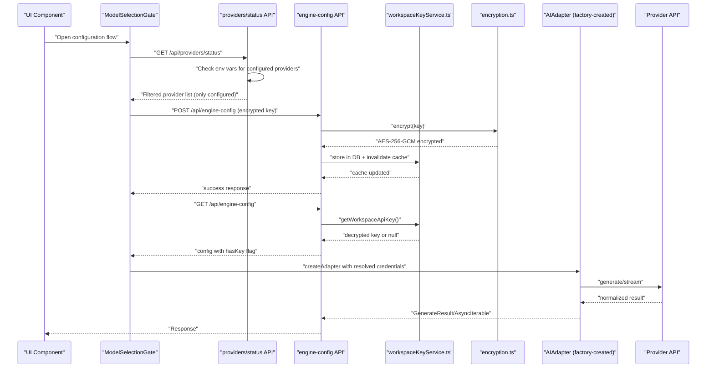
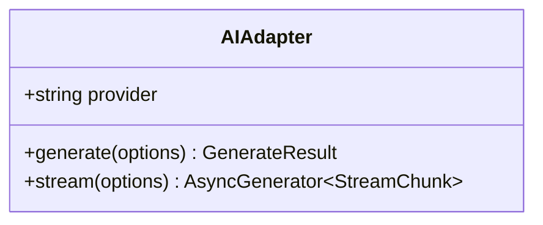
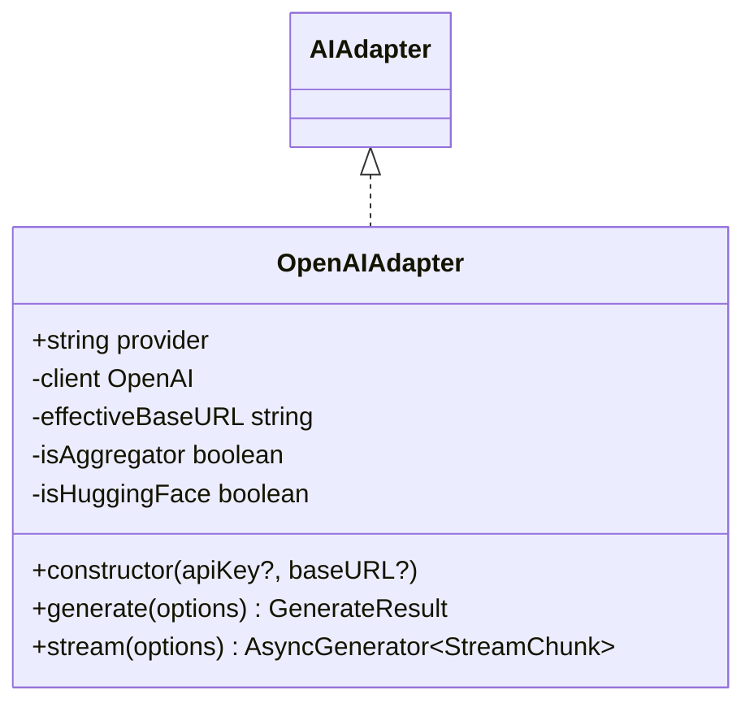
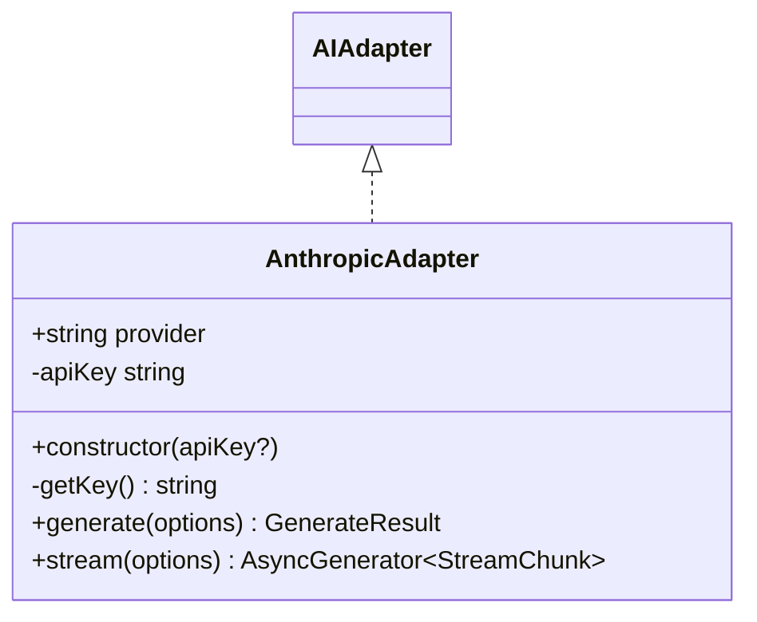
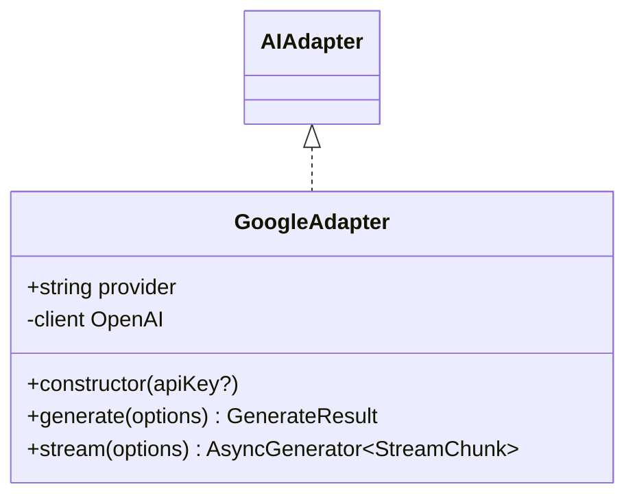
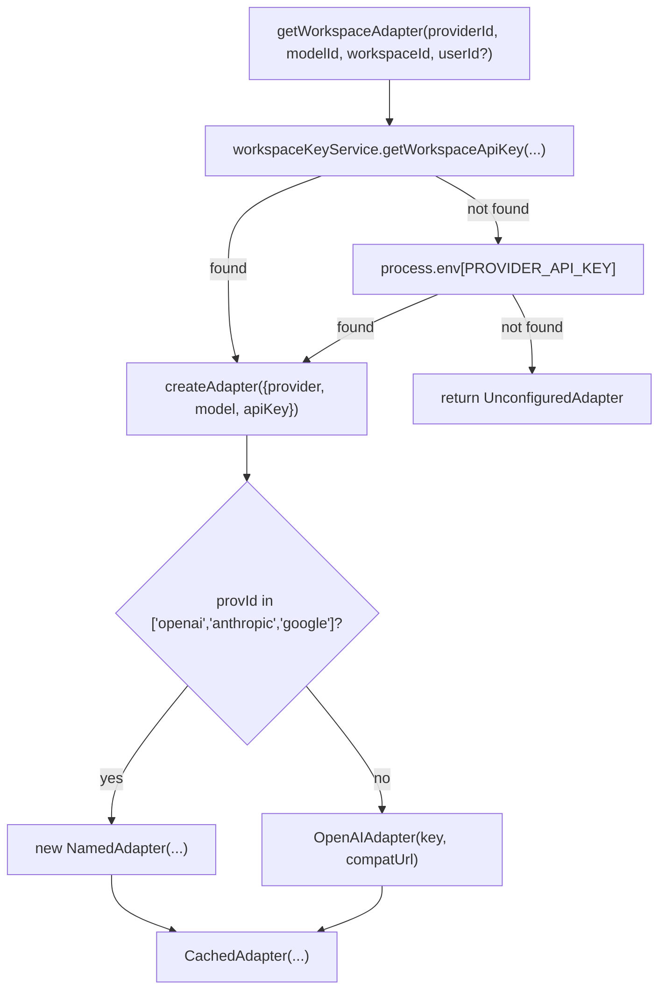
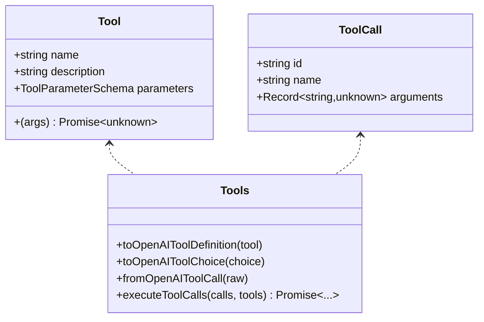
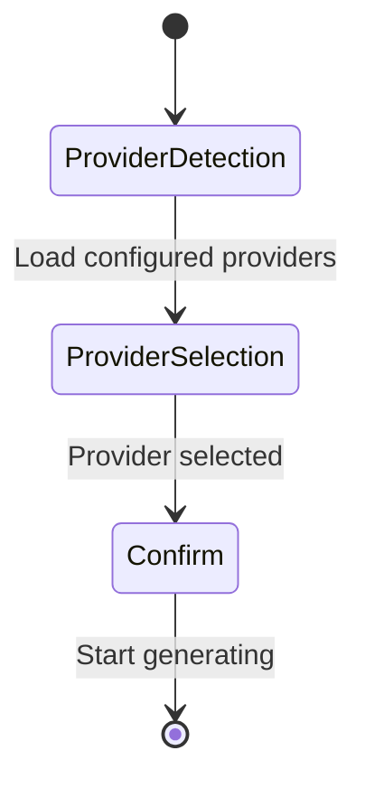
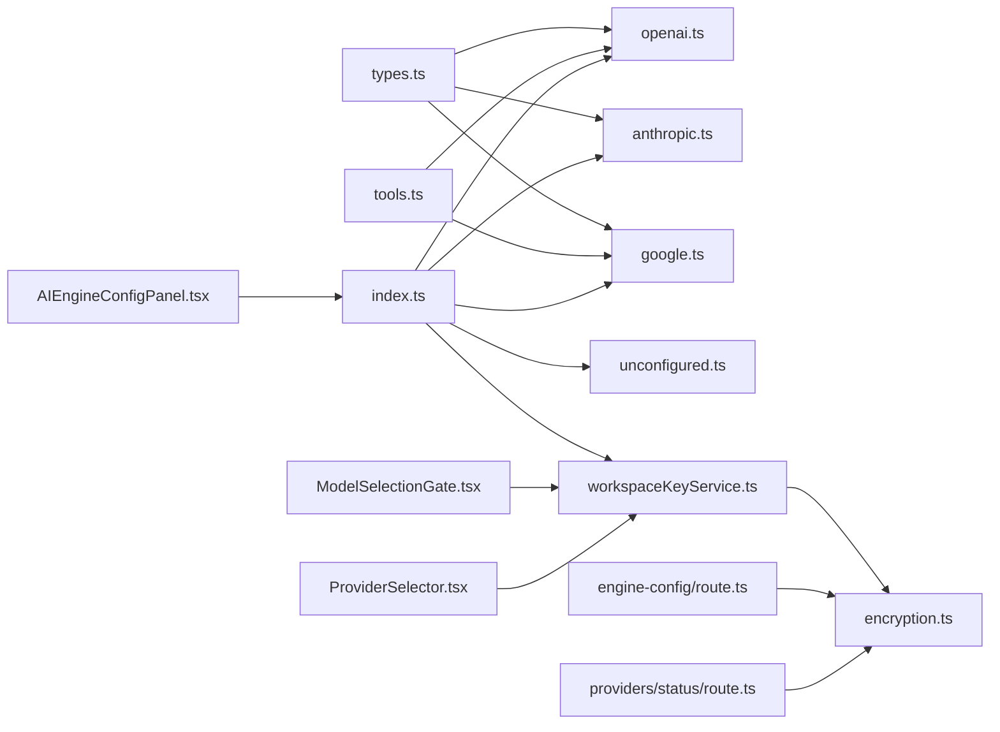

# AI Provider Adapters

<cite>
**Referenced Files in This Document**
- [base.ts](file://lib/ai/adapters/base.ts)
- [openai.ts](file://lib/ai/adapters/openai.ts)
- [anthropic.ts](file://lib/ai/adapters/anthropic.ts)
- [google.ts](file://lib/ai/adapters/google.ts)
- [index.ts](file://lib/ai/adapters/index.ts)
- [types.ts](file://lib/ai/types.ts)
- [tools.ts](file://lib/ai/tools.ts)
- [unconfigured.ts](file://lib/ai/adapters/unconfigured.ts)
- [workspaceKeyService.ts](file://lib/security/workspaceKeyService.ts)
- [encryption.ts](file://lib/security/encryption.ts)
- [ModelSelectionGate.tsx](file://components/ModelSelectionGate.tsx)
- [ProviderSelector.tsx](file://components/ProviderSelector.tsx)
- [route.ts](file://app/api/engine-config/route.ts)
- [route.ts](file://app/api/providers/status/route.ts)
</cite>

## Update Summary
**Changes Made**
- Updated ModelSelectionGate documentation to reflect the streamlined single-panel interface with violet theme and gradient backgrounds
- Enhanced provider status checking system documentation with universal LLM_KEY support
- Updated provider configuration to reflect current supported providers (OpenAI, Anthropic, Google, Groq)
- Removed references to Ollama and local model support
- Updated visual design documentation to include violet theme, gradient backgrounds, and improved security measures
- Enhanced provider status checking system documentation with optimized settings display

## Table of Contents
1. [Introduction](#introduction)
2. [Project Structure](#project-structure)
3. [Core Components](#core-components)
4. [Architecture Overview](#architecture-overview)
5. [Detailed Component Analysis](#detailed-component-analysis)
6. [Enhanced Credential Management System](#enhanced-credential-management-system)
7. [Dependency Analysis](#dependency-analysis)
8. [Performance Considerations](#performance-considerations)
9. [Troubleshooting Guide](#troubleshooting-guide)
10. [Conclusion](#conclusion)
11. [Appendices](#appendices)

## Introduction
This document explains the universal AI adapter system that provides model-agnostic access to multiple AI providers. It covers the adapter factory pattern, the base adapter interface, and provider-specific implementations for OpenAI, Anthropic, Google, and Groq (OpenAI-compatible). The system now features an enhanced credential management system with streamlined provider selection workflow, automatic provider detection, and comprehensive server-side security with AES-256-GCM encryption.

**Updated** The system has been streamlined to support only cloud-based providers, eliminating local model support including Ollama/LM Studio. The ModelSelectionGate now features a single-panel interface with enhanced visual design including violet theme and gradient backgrounds, providing a more intuitive configuration experience.

## Project Structure
The AI adapter system is organized under lib/ai/adapters with a central factory and per-provider adapters. Enhanced UI components provide guided configuration experiences with automatic provider detection and secure credential management. Supporting modules define shared types, tool schemas, encryption services, and workspace key management with global fallback capabilities.

```mermaid
graph TB
subgraph "Adapters"
BASE["base.ts<br/>AIAdapter interface"]
OA["openai.ts<br/>OpenAIAdapter"]
AA["anthropic.ts<br/>AnthropicAdapter"]
GA["google.ts<br/>GoogleAdapter"]
IDX["index.ts<br/>Factory + Registry"]
UNC["unconfigured.ts<br/>UnconfiguredAdapter"]
END
subgraph "Enhanced UI Components"
MSG["ModelSelectionGate.tsx<br/>Streamlined single-panel configuration"]
PS["ProviderSelector.tsx<br/>Provider + model selection"]
END
subgraph "Security & Encryption"
WKS["workspaceKeyService.ts<br/>DB + Encryption + Caching + Global Fallback"]
ENC["encryption.ts<br/>AES-256-GCM encryption + Fallback"]
API["engine-config/route.ts<br/>Secure credential API"]
PSTATUS["providers/status/route.ts<br/>Provider status + automatic detection"]
END
subgraph "Shared"
TYPES["types.ts<br/>Message/Options/Results"]
TOOLS["tools.ts<br/>Tool/ToolCall/Exec"]
END
IDX --> OA
IDX --> AA
IDX --> GA
IDX --> UNC
MSG --> PS
MSG --> WKS
PS --> WKS
OA --> TYPES
AA --> TYPES
GA --> TYPES
OA --> TOOLS
GA --> TOOLS
IDX --> WKS
WKS --> ENC
API --> ENC
PSTATUS --> ENC
```

**Diagram sources**
- [index.ts:1-289](file://lib/ai/adapters/index.ts#L1-L289)
- [base.ts:1-73](file://lib/ai/adapters/base.ts#L1-L73)
- [openai.ts:1-223](file://lib/ai/adapters/openai.ts#L1-L223)
- [anthropic.ts:1-210](file://lib/ai/adapters/anthropic.ts#L1-L210)
- [google.ts:1-90](file://lib/ai/adapters/google.ts#L1-L90)
- [types.ts:1-130](file://lib/ai/types.ts#L1-L130)
- [tools.ts:1-175](file://lib/ai/tools.ts#L1-L175)
- [unconfigured.ts:1-99](file://lib/ai/adapters/unconfigured.ts#L1-L99)
- [workspaceKeyService.ts:1-138](file://lib/security/workspaceKeyService.ts#L1-L138)
- [encryption.ts:1-95](file://lib/security/encryption.ts#L1-L95)
- [ModelSelectionGate.tsx:1-413](file://components/ModelSelectionGate.tsx#L1-L413)
- [ProviderSelector.tsx:1-375](file://components/ProviderSelector.tsx#L1-L375)
- [route.ts:1-154](file://app/api/engine-config/route.ts#L1-L154)
- [route.ts:1-204](file://app/api/providers/status/route.ts#L1-L204)

**Section sources**
- [index.ts:1-289](file://lib/ai/adapters/index.ts#L1-L289)
- [types.ts:1-130](file://lib/ai/types.ts#L1-L130)
- [tools.ts:1-175](file://lib/ai/tools.ts#L1-L175)
- [workspaceKeyService.ts:1-138](file://lib/security/workspaceKeyService.ts#L1-L138)
- [encryption.ts:1-95](file://lib/security/encryption.ts#L1-L95)
- [ModelSelectionGate.tsx:1-413](file://components/ModelSelectionGate.tsx#L1-L413)
- [ProviderSelector.tsx:1-375](file://components/ProviderSelector.tsx#L1-L375)
- [route.ts:1-154](file://app/api/engine-config/route.ts#L1-L154)
- [route.ts:1-204](file://app/api/providers/status/route.ts#L1-L204)

## Core Components
- AIAdapter interface: Defines the provider-agnostic contract with generate() and stream().
- Provider adapters: Implementations for OpenAI, Anthropic, Google, and Groq (OpenAI-compatible); DeepSeek is supported via OpenAI-compatible mode.
- Factory and registry: Centralized creation logic with workspace-aware resolution and fallbacks.
- Enhanced UI components: ModelSelectionGate provides streamlined single-panel configuration flow with automatic provider detection; ProviderSelector offers intuitive provider and model selection with comprehensive provider definitions.
- Comprehensive security system: Server-side credential management with AES-256-GCM encryption, workspace-scoped keys, caching, and global fallback capabilities.
- Shared types: Client-safe message, generation options/results, streaming chunks, and pricing utilities.
- Tools: Canonical tool schema and conversion helpers for provider-specific tool-calling formats.
- Unconfigured adapter: Graceful fallback when no credentials are available.

**Section sources**
- [base.ts:48-72](file://lib/ai/adapters/base.ts#L48-L72)
- [types.ts:19-55](file://lib/ai/types.ts#L19-L55)
- [tools.ts:47-79](file://lib/ai/tools.ts#L47-L79)
- [index.ts:146-215](file://lib/ai/adapters/index.ts#L146-L215)
- [unconfigured.ts:13-99](file://lib/ai/adapters/unconfigured.ts#L13-L99)
- [ModelSelectionGate.tsx:1-413](file://components/ModelSelectionGate.tsx#L1-L413)
- [ProviderSelector.tsx:1-375](file://components/ProviderSelector.tsx#L1-L375)
- [workspaceKeyService.ts:19-95](file://lib/security/workspaceKeyService.ts#L19-L95)
- [encryption.ts:27-69](file://lib/security/encryption.ts#L27-L69)

## Architecture Overview
The system enforces strict server-only credential resolution with comprehensive security and automatic provider detection. The factory resolves credentials from workspace settings, environment variables, or returns an unconfigured adapter. Each adapter normalizes provider-specific differences into a unified interface. Enhanced UI components provide guided configuration with ModelSelectionGate and ProviderSelector, featuring automatic provider detection based on environment variables.



**Diagram sources**
- [ModelSelectionGate.tsx:70-102](file://components/ModelSelectionGate.tsx#L70-L102)
- [route.ts:69-127](file://app/api/engine-config/route.ts#L69-L127)
- [route.ts:88-164](file://app/api/providers/status/route.ts#L88-L164)
- [workspaceKeyService.ts:32-95](file://lib/security/workspaceKeyService.ts#L32-L95)
- [encryption.ts:27-69](file://lib/security/encryption.ts#L27-L69)
- [index.ts:236-278](file://lib/ai/adapters/index.ts#L236-L278)

## Detailed Component Analysis

### Base Adapter Interface
Defines the canonical contract that all adapters implement:
- provider: Canonical provider name.
- generate(options): Non-streaming generation returning content, optional toolCalls, and usage.
- stream(options): Async generator yielding StreamChunk with delta text and done flag; usage may be included on the final chunk.



**Diagram sources**
- [base.ts:50-72](file://lib/ai/adapters/base.ts#L50-L72)

**Section sources**
- [base.ts:28-72](file://lib/ai/adapters/base.ts#L28-L72)

### OpenAI Adapter
Implements the OpenAI-compatible interface with special handling for reasoning models (o1/o3 series), tool-calling, response_format, and streaming. It auto-detects aggregator and Hugging Face routes and applies provider-specific constraints.



**Diagram sources**
- [openai.ts:36-223](file://lib/ai/adapters/openai.ts#L36-L223)
- [base.ts:50-72](file://lib/ai/adapters/base.ts#L50-L72)

**Section sources**
- [openai.ts:23-32](file://lib/ai/adapters/openai.ts#L23-L32)
- [openai.ts:64-157](file://lib/ai/adapters/openai.ts#L64-L157)
- [openai.ts:159-222](file://lib/ai/adapters/openai.ts#L159-L222)

### Anthropic Adapter
Uses the native Anthropic Messages API via fetch(), handling system prompts, JSON mode instructions, token caps, and streaming events.



**Diagram sources**
- [anthropic.ts:71-210](file://lib/ai/adapters/anthropic.ts#L71-L210)
- [base.ts:50-72](file://lib/ai/adapters/base.ts#L50-L72)

**Section sources**
- [anthropic.ts:71-145](file://lib/ai/adapters/anthropic.ts#L71-L145)
- [anthropic.ts:147-207](file://lib/ai/adapters/anthropic.ts#L147-L207)

### Google Adapter
Wraps Google AI Studio's OpenAI-compatible endpoint, forwarding tools and streaming support.



**Diagram sources**
- [google.ts:24-90](file://lib/ai/adapters/google.ts#L24-L90)
- [base.ts:50-72](file://lib/ai/adapters/base.ts#L50-L72)

**Section sources**
- [google.ts:28-69](file://lib/ai/adapters/google.ts#L28-L69)
- [google.ts:71-88](file://lib/ai/adapters/google.ts#L71-L88)

### Adapter Factory and Registry
Central factory with:
- detectProvider(model): Heuristic to infer provider from model name.
- createAdapter(cfg): Builds the appropriate adapter, validates credentials, and wraps with CachedAdapter for metrics and caching.
- getWorkspaceAdapter(providerId, modelId, workspaceId, userId?): Secure resolution via workspaceKeyService, env vars, or returns UnconfiguredAdapter.
- CachedAdapter: Adds caching and metrics for generate() and stream().

**Updated** The factory now supports only 4 cloud providers: OpenAI, Anthropic, Google, and Groq (OpenAI-compatible). Ollama support has been completely removed from the factory pattern.



**Diagram sources**
- [index.ts:236-278](file://lib/ai/adapters/index.ts#L236-L278)
- [index.ts:146-215](file://lib/ai/adapters/index.ts#L146-L215)

**Section sources**
- [index.ts:50-64](file://lib/ai/adapters/index.ts#L50-L64)
- [index.ts:146-215](file://lib/ai/adapters/index.ts#L146-L215)
- [index.ts:236-278](file://lib/ai/adapters/index.ts#L236-L278)

### Unconfigured Adapter
Returns a friendly UI component or JSON payload when no credentials are available, preventing server errors and guiding users to configure settings.

**Section sources**
- [unconfigured.ts:13-99](file://lib/ai/adapters/unconfigured.ts#L13-L99)

### Tools and Tool Calls
A canonical schema for tools and conversions ensures consistent tool-calling across providers:
- Tool: name, description, parameters (JSON Schema subset), execute(args).
- ToolCall: id, name, parsed arguments.
- Conversion helpers: OpenAI tool definitions and choices, and OpenAI tool-call normalization.



**Diagram sources**
- [tools.ts:47-79](file://lib/ai/tools.ts#L47-L79)
- [tools.ts:108-133](file://lib/ai/tools.ts#L108-L133)
- [tools.ts:144-174](file://lib/ai/tools.ts#L144-L174)

**Section sources**
- [tools.ts:13-28](file://lib/ai/tools.ts#L13-L28)
- [tools.ts:47-79](file://lib/ai/tools.ts#L47-L79)
- [tools.ts:108-133](file://lib/ai/tools.ts#L108-L133)
- [tools.ts:144-174](file://lib/ai/tools.ts#L144-L174)

### Types and Pricing
Client-safe types define messages, generation options/results, and streaming chunks. Pricing utilities estimate costs per provider/model.

**Updated** Pricing information has been updated to remove Ollama local model entries, reflecting the elimination of local model support.

**Section sources**
- [types.ts:10-55](file://lib/ai/types.ts#L10-L55)
- [types.ts:71-130](file://lib/ai/types.ts#L71-L130)

## Enhanced Credential Management System

### ModelSelectionGate Component
The ModelSelectionGate provides a streamlined single-panel configuration experience with automatic provider detection and server-side credential management:

**Single-Panel Interface with Violet Theme**
- Features a sophisticated single-panel design with violet gradient backgrounds and dark overlay effects
- Enhanced visual design including floating purple and emerald glow effects with backdrop blur
- Improved security indicators with animated status dots and gradient accents
- **Updated** Eliminated multi-step wizard - now uses streamlined single-panel interface
- **Updated** Enhanced visual design featuring violet color scheme with provider brand color integration

**Automatic Provider Detection**
- Fetches configured providers from `/api/providers/status` which checks environment variables
- Shows only providers with API keys configured in Vercel environment variables
- Interactive provider cards with security badges and recommended provider highlighting
- **Updated** No local provider support - Ollama/LM Studio is no longer available as a configuration option

**Enhanced Provider Selection Experience**
- Provider cards with brand-specific gradient backgrounds and color schemes
- Recommended provider badges with prominent visual indicators
- Model suggestions with provider-specific branding
- Optimized settings display with temperature and token recommendations
- Server-side security indicators with animated status dots

**Streamlined Configuration Flow**
- Direct provider selection without intermediate steps
- One-click model confirmation with security review
- Start generating button with loading states and gradient styling
- **Updated** Streamlined workflow eliminating the intermediate credentials entry step



**Diagram sources**
- [ModelSelectionGate.tsx:69-102](file://components/ModelSelectionGate.tsx#L69-L102)
- [ModelSelectionGate.tsx:110-146](file://components/ModelSelectionGate.tsx#L110-L146)
- [ModelSelectionGate.tsx:300-405](file://components/ModelSelectionGate.tsx#L300-L405)

**Section sources**
- [ModelSelectionGate.tsx:1-413](file://components/ModelSelectionGate.tsx#L1-L413)

### ProviderSelector Component
The ProviderSelector offers intuitive provider and model selection with comprehensive provider definitions and automatic credential validation:

**Provider Options with Automatic Detection**
- OpenAI: GPT-4o, GPT-4o-mini, o3-mini with automatic key detection
- Anthropic: Claude 3.5 Sonnet, Claude 3 Opus with automatic key detection
- Google Gemini: Gemini 2.0 Flash, Gemini 1.5 Pro with automatic key detection
- **Updated** Groq: Llama 3.3, Mixtral - ultra-fast inference with automatic key detection (OpenAI-compatible)

**Enhanced Visual Design**
- Violet-themed interface with gradient backgrounds and animated effects
- Provider cards with brand-specific color schemes and visual indicators
- Recommended provider highlighting with prominent badges
- Feature lists for each provider with context window information
- Model suggestion grids with automatic provider matching

**Security and Validation Features**
- Security badges for each provider with credential status indicators
- Recommended provider highlighting based on configuration
- Feature lists for each provider with context window information
- Model suggestion grids with automatic provider matching
- Workspace-scoped credential status with automatic validation
- **Updated** No local provider support - Ollama/LM Studio removed from options

**Section sources**
- [ProviderSelector.tsx:1-375](file://components/ProviderSelector.tsx#L1-L375)

### Provider Status API
The `/api/providers/status` endpoint provides automatic provider detection based on environment variables:

**Universal LLM_KEY Support**
- **Updated** Added support for universal LLM_KEY that works for all providers
- Checks Vercel environment variables for configured providers
- Handles Google Gemini with dual environment variable support (GOOGLE_API_KEY and GEMINI_API_KEY)
- **Updated** No local-only providers support - Ollama/LM Studio removed from detection logic
- Returns filtered provider list showing only configured providers

**Enhanced Provider Configuration Schema**
- Provider definitions with colors, gradients, and model lists matching UI components
- Environment variable mapping for automatic credential detection
- Recommended provider flags for UI prioritization
- **Updated** No local-only provider support for Ollama
- **Updated** Universal LLM_KEY fallback support for all providers

**Debug and Development Features**
- Debug logging for available environment variables
- Development-only debug information display
- Comprehensive provider configuration validation
- Real-time provider status monitoring

**Section sources**
- [route.ts:1-204](file://app/api/providers/status/route.ts#L1-L204)

### Server-Side Security Architecture
The system implements comprehensive server-side credential management with automatic provider detection:

**Encryption Service**
- AES-256-GCM encryption with random IV and authentication tags
- Support for both base64 and raw 32-byte secrets
- Fallback to SHA-256 derived keys for development environments
- Safe runtime validation with non-fatal warnings during build phase

**Workspace Key Service**
- Per-process in-memory caching with 5-minute TTL
- Workspace-scoped credential resolution with authorization verification
- Global fallback capability for pipeline routes accessing any workspace
- Cache invalidation on configuration changes for immediate effect

**API Endpoints**
- `/api/engine-config`: Secure credential storage and retrieval with automatic cache invalidation
- `/api/providers/status`: Provider availability checking with environment variable validation
- Automatic cache invalidation on configuration changes
- Workspace-scoped encryption and decryption with fallback mechanisms

**Section sources**
- [encryption.ts:1-95](file://lib/security/encryption.ts#L1-L95)
- [workspaceKeyService.ts:1-138](file://lib/security/workspaceKeyService.ts#L1-L138)
- [route.ts:1-154](file://app/api/engine-config/route.ts#L1-L154)

## Dependency Analysis
- Adapters depend on shared types and tools for message and tool-calling normalization.
- The factory depends on workspaceKeyService for secure credential resolution and environment variables as fallbacks.
- CachedAdapter decorates any AIAdapter to add caching and metrics.
- UI components rely on the factory and types for configuration and rendering.
- ModelSelectionGate and ProviderSelector components depend on workspaceKeyService for credential validation.
- Provider status API depends on environment variables for automatic provider detection.
- Encryption service provides secure key storage for all credential management flows.

**Updated** Dependencies have been simplified with the removal of Ollama-related components and references.



**Diagram sources**
- [index.ts:1-289](file://lib/ai/adapters/index.ts#L1-L289)
- [types.ts:1-130](file://lib/ai/types.ts#L1-L130)
- [tools.ts:1-175](file://lib/ai/tools.ts#L1-L175)
- [workspaceKeyService.ts:1-138](file://lib/security/workspaceKeyService.ts#L1-L138)
- [encryption.ts:1-95](file://lib/security/encryption.ts#L1-L95)
- [ModelSelectionGate.tsx:1-413](file://components/ModelSelectionGate.tsx#L1-L413)
- [ProviderSelector.tsx:1-375](file://components/ProviderSelector.tsx#L1-L375)
- [route.ts:1-154](file://app/api/engine-config/route.ts#L1-L154)
- [route.ts:1-204](file://app/api/providers/status/route.ts#L1-L204)

**Section sources**
- [index.ts:1-289](file://lib/ai/adapters/index.ts#L1-L289)
- [workspaceKeyService.ts:1-138](file://lib/security/workspaceKeyService.ts#L1-L138)
- [encryption.ts:1-95](file://lib/security/encryption.ts#L1-L95)
- [route.ts:1-154](file://app/api/engine-config/route.ts#L1-L154)
- [route.ts:1-204](file://app/api/providers/status/route.ts#L1-L204)

## Performance Considerations
- Caching: CachedAdapter caches both full results and streaming chunks keyed by normalized options, reducing provider calls and enabling latency metrics.
- Token caps: Provider-specific caps prevent oversized requests and reduce retries.
- Streaming: Providers that support usage in stream finalization enable accurate cost accounting.
- Environment checks: Early detection of aggregator/HF routes avoids unnecessary retries and misconfiguration.
- Encryption overhead: AES-256-GCM adds minimal performance cost compared to security benefits.
- Workspace caching: 5-minute TTL reduces database lookups while maintaining security.
- Model selection optimization: Predefined model lists reduce API calls for model discovery.
- Automatic provider detection: Environment variable checks are performed server-side, avoiding client-side complexity.
- **Updated** Simplified architecture reduces adapter instantiation overhead and improves performance.
- **Updated** Single-panel UI reduces DOM complexity and improves rendering performance.

## Troubleshooting Guide
Common issues and resolutions:
- Missing API key: The factory throws a ConfigurationError or returns UnconfiguredAdapter. Configure via ModelSelectionGate.
- Provider mismatch: Use explicit provider selection in configuration to avoid heuristic detection errors.
- Tool-calling not working: Some providers ignore tools; verify provider support and remove tools for incompatible providers.
- Streaming failures: Ensure provider supports streaming and that the adapter is using the correct endpoint/baseURL.
- **Updated** Local providers unreachable: No longer applicable - Ollama/LM Studio support has been removed.
- Encryption key issues: Check ENCRYPTION_SECRET environment variable format and length.
- Cache invalidation: WorkspaceKeyService automatically invalidates cache on configuration changes.
- Model selection problems: Use ProviderSelector component for guided model selection with credential validation.
- Security warnings: The system provides non-fatal warnings during build phase to prevent deployment failures.
- Provider detection failures: Check Vercel environment variables for proper provider configuration.
- Automatic provider detection not working: Verify environment variables match expected naming conventions.
- **Updated** Configuration problems: Use streamlined ModelSelectionGate workflow - no more Ollama configuration steps.
- **Updated** Single-panel interface issues: Check browser console for UI rendering errors in the new violet-themed interface.

**Section sources**
- [index.ts:28-40](file://lib/ai/adapters/index.ts#L28-L40)
- [index.ts:159-162](file://lib/ai/adapters/index.ts#L159-L162)
- [index.ts:204-207](file://lib/ai/adapters/index.ts#L204-L207)
- [unconfigured.ts:13-99](file://lib/ai/adapters/unconfigured.ts#L13-L99)
- [encryption.ts:81-94](file://lib/security/encryption.ts#L81-L94)
- [workspaceKeyService.ts:97-106](file://lib/security/workspaceKeyService.ts#L97-L106)
- [ModelSelectionGate.tsx:70-102](file://components/ModelSelectionGate.tsx#L70-L102)
- [ProviderSelector.tsx:136-148](file://components/ProviderSelector.tsx#L136-L148)
- [route.ts:88-164](file://app/api/providers/status/route.ts#L88-L164)

## Conclusion
The AI adapter system provides a robust, provider-agnostic abstraction over multiple AI providers with comprehensive security enhancements and streamlined configuration workflows. The addition of ModelSelectionGate creates a guided single-panel configuration experience with automatic provider detection, while the enhanced credential management system ensures secure, workspace-scoped API key storage using AES-256-GCM encryption. The automatic provider detection system eliminates manual API key entry by leveraging environment variables, and the global fallback capabilities enable seamless operation across different deployment scenarios. By centralizing credential resolution, enforcing server-only secrets, and normalizing provider differences, it enables seamless switching between models and providers with enterprise-grade security and user-friendly configuration.

**Updated** The system has been streamlined to focus exclusively on cloud-based providers, improving reliability and reducing complexity while maintaining comprehensive security and seamless provider switching capabilities. The new single-panel ModelSelectionGate interface with violet theme and gradient backgrounds provides an enhanced user experience while maintaining the system's robust security and performance characteristics.

## Appendices

### Implementing a New Adapter
Steps to add a new provider:
1. Define a new class implementing AIAdapter with generate() and stream().
2. Normalize provider-specific message/tool/response formats to the shared types.
3. Register the adapter in the factory's createAdapter() switch or treat it as OpenAI-compatible via baseUrl.
4. Add provider detection logic if supporting OpenAI-compatible mode.
5. Integrate with the UI configuration panel for hints and documentation.

References:
- [base.ts:50-72](file://lib/ai/adapters/base.ts#L50-L72)
- [index.ts:146-215](file://lib/ai/adapters/index.ts#L146-L215)
- [types.ts:19-55](file://lib/ai/types.ts#L19-L55)
- [tools.ts:108-133](file://lib/ai/tools.ts#L108-L133)

### Configuring Provider Credentials
- **ModelSelectionGate**: Streamlined single-panel configuration with automatic provider detection and server-side encryption
- **ProviderSelector**: Interactive provider and model selection with credential status and automatic validation
- **Updated** No AIEngineConfigPanel: Three-step wizard interface with advanced settings and manual provider detection (dropped in favor of streamlined approach)
- **Automatic Provider Detection**: Environment variable-based provider availability checking with universal LLM_KEY support
- **Workspace-level**: Store encrypted keys in workspace settings; retrieved via workspaceKeyService with global fallback
- **Environment Variables**: Set provider-specific environment variables for automatic credential detection
- **Unconfigured fallback**: When no keys are found, UnconfiguredAdapter returns a helpful UI or JSON

References:
- [ModelSelectionGate.tsx:1-413](file://components/ModelSelectionGate.tsx#L1-L413)
- [ProviderSelector.tsx:1-375](file://components/ProviderSelector.tsx#L1-L375)
- [route.ts:88-164](file://app/api/providers/status/route.ts#L88-L164)
- [index.ts:236-278](file://lib/ai/adapters/index.ts#L236-L278)
- [workspaceKeyService.ts:32-67](file://lib/security/workspaceKeyService.ts#L32-L67)
- [unconfigured.ts:13-99](file://lib/ai/adapters/unconfigured.ts#L13-L99)

### Enhanced Security Features
- **AES-256-GCM Encryption**: Hardware-accelerated encryption with authentication and fallback mechanisms
- **Workspace Scoping**: Keys are tied to specific workspaces with authorization checks and global fallback
- **Cache Invalidation**: Automatic cache clearing on configuration changes with immediate effect
- **Non-Fatal Validation**: Build-time warnings instead of deployment failures with graceful fallback
- **Environment Variable Integration**: Seamless fallback to environment variables with automatic provider detection
- **Provider Status API**: Server-side provider availability checking with environment variable validation
- **Universal LLM_KEY Support**: Single key that works across all providers for simplified configuration

References:
- [encryption.ts:27-69](file://lib/security/encryption.ts#L27-L69)
- [workspaceKeyService.ts:32-95](file://lib/security/workspaceKeyService.ts#L32-L95)
- [route.ts:69-127](file://app/api/engine-config/route.ts#L69-L127)
- [route.ts:88-164](file://app/api/providers/status/route.ts#L88-L164)

### Handling Provider-Specific Features
- Tool calls: Use the canonical Tool/ToolCall schema; adapters convert to/from provider-specific formats.
- Streaming: Use AsyncGenerator to yield StreamChunk deltas; usage may be included on the final chunk.
- Model constraints: Adapters handle provider-specific limitations (e.g., reasoning models, response_format, token caps).
- Model selection: Use ProviderSelector for guided model selection with workspace validation and automatic provider detection.

**Updated** Provider-specific features have been updated to reflect the current supported providers (OpenAI, Anthropic, Google, Groq).

References:
- [tools.ts:47-79](file://lib/ai/tools.ts#L47-L79)
- [openai.ts:64-157](file://lib/ai/adapters/openai.ts#L64-L157)
- [anthropic.ts:89-145](file://lib/ai/adapters/anthropic.ts#L89-L145)
- [google.ts:35-69](file://lib/ai/adapters/google.ts#L35-L69)
- [ProviderSelector.tsx:259-282](file://components/ProviderSelector.tsx#L259-L282)

### Example Workflows and Tests
- Adapter usage and streaming are validated in tests for OpenAI, Anthropic, and Google.
- **Updated** Ollama tests removed - local model support has been eliminated.
- Tests demonstrate tool-calling and streaming behavior.
- Encryption service tests validate AES-256-GCM implementation with fallback mechanisms.
- Adapter index tests cover provider detection and configuration resolution.
- Provider status API tests validate environment variable-based provider detection.
- ModelSelectionGate tests validate automatic provider detection and streamlined configuration workflow.

**Updated** Example workflows now reflect the streamlined adapter system with 4 supported providers and enhanced single-panel interface.

References:
- [adapters.test.ts:1-109](file://__tests__/adapters.test.ts#L1-L109)
- [adapterIndex.test.ts:1-72](file://__tests__/adapterIndex.test.ts#L1-L72)
- [encryption.test.ts:1-48](file://__tests__/encryption.test.ts#L1-L48)
- [route.ts:88-164](file://app/api/providers/status/route.ts#L88-L164)
- [ModelSelectionGate.tsx:1-413](file://components/ModelSelectionGate.tsx#L1-L413)