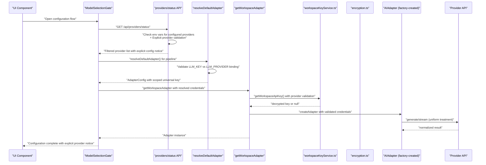
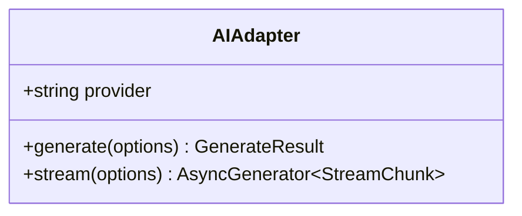
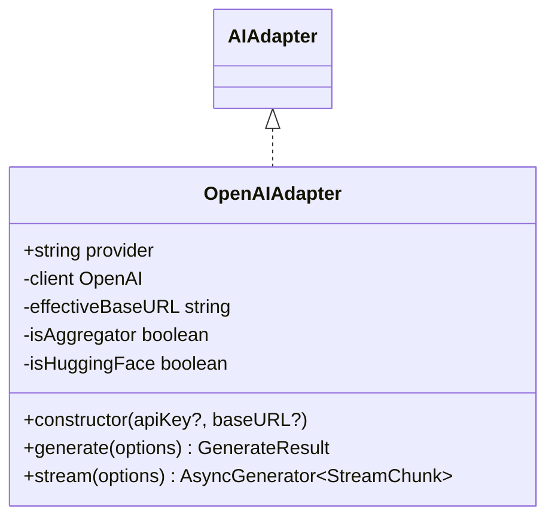
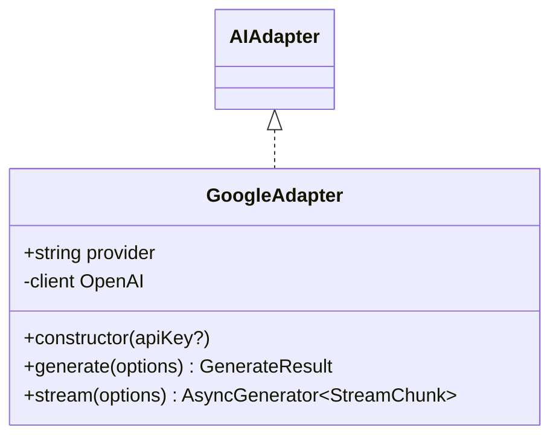
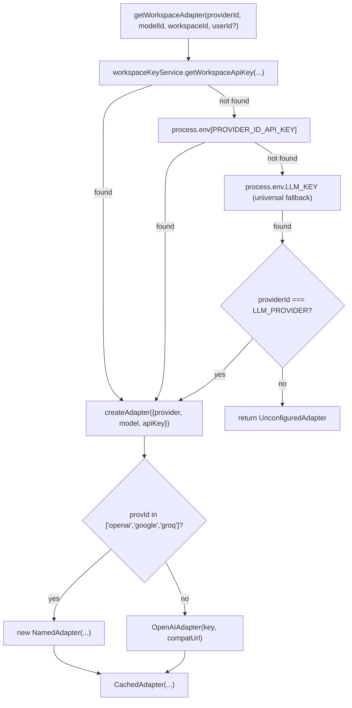
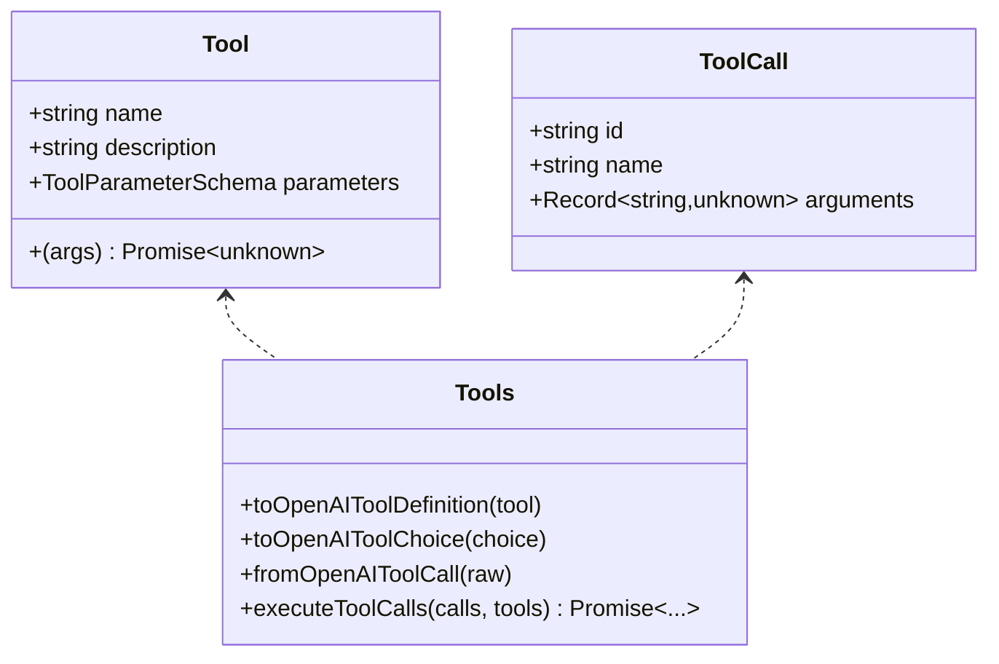
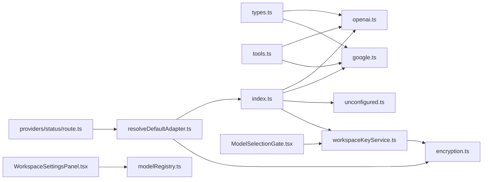

# AI Provider Adapters

<cite>
**Referenced Files in This Document**
- [base.ts](file://lib/ai/adapters/base.ts)
- [openai.ts](file://lib/ai/adapters/openai.ts)
- [google.ts](file://lib/ai/adapters/google.ts)
- [index.ts](file://lib/ai/adapters/index.ts)
- [types.ts](file://lib/ai/types.ts)
- [tools.ts](file://lib/ai/tools.ts)
- [unconfigured.ts](file://lib/ai/adapters/unconfigured.ts)
- [workspaceKeyService.ts](file://lib/security/workspaceKeyService.ts)
- [encryption.ts](file://lib/security/encryption.ts)
- [resolveDefaultAdapter.ts](file://lib/ai/resolveDefaultAdapter.ts)
- [ModelSelectionGate.tsx](file://components/ModelSelectionGate.tsx)
- [WorkspaceSettingsPanel.tsx](file://components/WorkspaceSettingsPanel.tsx)
- [route.ts](file://app/api/providers/status/route.ts)
- [adapterIndex.test.ts](file://__tests__/adapterIndex.test.ts)
- [security.test.ts](file://__tests__/security.test.ts)
- [encryption.test.ts](file://__tests__/encryption.test.ts)
- [modelRegistry.ts](file://lib/ai/modelRegistry.ts)
</cite>

## Update Summary
**Changes Made**
- Updated adapter factory documentation to reflect 3 supported providers instead of 4
- Removed Anthropic and Ollama-specific configuration examples, local runtime detection, and model support documentation
- Updated project structure to reflect the removal of Anthropic and Ollama adapter implementations
- Revised architecture diagrams and component analyses to exclude Anthropic and Ollama references
- Updated troubleshooting guide to remove Anthropic and Ollama-specific connectivity issues
- Modified implementation examples to reflect the simplified provider configuration approach with only OpenAI, Google, and Groq providers

## Table of Contents
1. [Introduction](#introduction)
2. [Project Structure](#project-structure)
3. [Core Components](#core-components)
4. [Architecture Overview](#architecture-overview)
5. [Detailed Component Analysis](#detailed-component-analysis)
6. [Enhanced Security Features](#enhanced-security-features)
7. [Universal LLM_KEY Scoping Implementation](#universal-llm-key-scoping-implementation)
8. [Dependency Analysis](#dependency-analysis)
9. [Performance Considerations](#performance-considerations)
10. [Troubleshooting Guide](#troubleshooting-guide)
11. [Conclusion](#conclusion)
12. [Appendices](#appendices)

## Introduction
This document explains the universal AI adapter system that provides model-agnostic access to multiple AI providers. It covers the adapter factory pattern, the base adapter interface, and provider-specific implementations for OpenAI, Google, and Groq (OpenAI-compatible). The system now features enhanced security with proper universal LLM_KEY scoping, ensuring credentials are only applied to their designated provider rather than all providers.

**Updated** The system has been enhanced with comprehensive security features including proper universal LLM_KEY scoping implementation, explicit provider validation when using universal keys, and simplified provider configuration that requires explicit per-provider setup rather than auto-detection. The adapter system now enforces explicit provider configuration through the ModelSelectionGate interface, ensuring users understand which provider they're configuring.

## Project Structure
The AI adapter system is organized under lib/ai/adapters with a central factory and per-provider adapters. The enhanced security architecture maintains the same core components but adds universal key validation and explicit provider configuration requirements. Enhanced UI components provide guided configuration experiences with explicit provider selection and secure credential management through the unified ModelSelectionGate interface.

```mermaid
graph TB
subgraph "Adapters"
BASE["base.ts<br/>AIAdapter interface"]
OA["openai.ts<br/>OpenAIAdapter"]
GA["google.ts<br/>GoogleAdapter"]
IDX["index.ts<br/>Factory + Registry + Explicit Provider Config"]
UNC["unconfigured.ts<br/>UnconfiguredAdapter"]
END
subgraph "Enhanced Security Components"
RDA["resolveDefaultAdapter.ts<br/>Universal Key Resolver + Provider Binding"]
WKS["workspaceKeyService.ts<br/>DB + Encryption + Caching + Global Fallback"]
ENC["encryption.ts<br/>AES-256-GCM encryption + Fallback"]
PSTATUS["providers/status/route.ts<br/>Provider Status + Explicit Config Only"]
END
subgraph "Enhanced UI Components"
MSG["ModelSelectionGate.tsx<br/>Consolidated configuration + Explicit Provider Notice"]
WSP["WorkspaceSettingsPanel.tsx<br/>Provider configuration + Explicit Setup"]
END
subgraph "Shared"
TYPES["types.ts<br/>Message/Options/Results"]
TOOLS["tools.ts<br/>Tool/ToolCall/Exec"]
END
IDX --> OA
IDX --> GA
IDX --> UNC
RDA --> IDX
RDA --> ENC
MSG --> WSP
MSG --> PSTATUS
PSTATUS --> RDA
OA --> TYPES
GA --> TYPES
OA --> TOOLS
GA --> TOOLS
IDX --> WKS
WKS --> ENC
```

**Diagram sources**
- [index.ts:1-282](file://lib/ai/adapters/index.ts#L1-L282)
- [resolveDefaultAdapter.ts:1-191](file://lib/ai/resolveDefaultAdapter.ts#L1-L191)
- [base.ts:1-73](file://lib/ai/adapters/base.ts#L1-L73)
- [openai.ts:1-218](file://lib/ai/adapters/openai.ts#L1-L218)
- [google.ts:1-90](file://lib/ai/adapters/google.ts#L1-L90)
- [types.ts:1-128](file://lib/ai/types.ts#L1-L128)
- [tools.ts:1-175](file://lib/ai/tools.ts#L1-L175)
- [unconfigured.ts:1-99](file://lib/ai/adapters/unconfigured.ts#L1-L99)
- [workspaceKeyService.ts:1-138](file://lib/security/workspaceKeyService.ts#L1-L138)
- [encryption.ts:1-95](file://lib/security/encryption.ts#L1-L95)
- [ModelSelectionGate.tsx:1-456](file://components/ModelSelectionGate.tsx#L1-L456)
- [WorkspaceSettingsPanel.tsx:1-211](file://components/WorkspaceSettingsPanel.tsx#L1-L211)
- [route.ts:1-208](file://app/api/providers/status/route.ts#L1-L208)

**Section sources**
- [index.ts:1-282](file://lib/ai/adapters/index.ts#L1-L282)
- [resolveDefaultAdapter.ts:1-191](file://lib/ai/resolveDefaultAdapter.ts#L1-L191)
- [types.ts:1-128](file://lib/ai/types.ts#L1-L128)
- [tools.ts:1-175](file://lib/ai/tools.ts#L1-L175)
- [workspaceKeyService.ts:1-138](file://lib/security/workspaceKeyService.ts#L1-L138)
- [encryption.ts:1-95](file://lib/security/encryption.ts#L1-L95)
- [ModelSelectionGate.tsx:1-456](file://components/ModelSelectionGate.tsx#L1-L456)
- [WorkspaceSettingsPanel.tsx:1-211](file://components/WorkspaceSettingsPanel.tsx#L1-L211)
- [route.ts:1-208](file://app/api/providers/status/route.ts#L1-L208)

## Core Components
- AIAdapter interface: Defines the provider-agnostic contract with generate() and stream().
- Provider adapters: Implementations for OpenAI, Google, and Groq (OpenAI-compatible).
- Factory and registry: Centralized creation logic with workspace-aware resolution, fallbacks, and enhanced universal key validation.
- **Enhanced security system**: Comprehensive server-side credential management with AES-256-GCM encryption, workspace-scoped keys, caching, global fallback, and universal key provider scoping.
- **Universal LLM_KEY scoping**: Explicit provider validation ensuring LLM_KEY credentials are only applied to their designated provider via LLM_PROVIDER environment variable.
- **Enhanced UI components**: ModelSelectionGate provides comprehensive configuration flow with explicit provider selection, universal key notices, and unified provider management; WorkspaceSettingsPanel offers detailed provider configuration with credential validation and universal key status.
- Shared types: Client-safe message, generation options/results, streaming chunks, and pricing utilities.
- Tools: Canonical tool schema and conversion helpers for provider-specific tool-calling formats.
- Unconfigured adapter: Graceful fallback when no credentials are available.

**Section sources**
- [base.ts:48-72](file://lib/ai/adapters/base.ts#L48-L72)
- [types.ts:19-55](file://lib/ai/types.ts#L19-L55)
- [tools.ts:47-79](file://lib/ai/tools.ts#L47-L79)
- [index.ts:146-184](file://lib/ai/adapters/index.ts#L146-L184)
- [resolveDefaultAdapter.ts:58-138](file://lib/ai/resolveDefaultAdapter.ts#L58-L138)
- [unconfigured.ts:13-99](file://lib/ai/adapters/unconfigured.ts#L13-L99)

## Architecture Overview
The system enforces strict server-only credential resolution with comprehensive security and explicit provider configuration. The factory resolves credentials from workspace settings, environment variables, or returns an unconfigured adapter. Each adapter normalizes provider-specific differences into a unified interface. Enhanced security features include universal LLM_KEY scoping validation, preventing credential misuse across providers. Enhanced UI components provide guided configuration with ModelSelectionGate, featuring explicit provider selection and universal key notices.



**Diagram sources**
- [ModelSelectionGate.tsx:70-102](file://components/ModelSelectionGate.tsx#L70-L102)
- [route.ts:137-207](file://app/api/providers/status/route.ts#L137-L207)
- [resolveDefaultAdapter.ts:73-138](file://lib/ai/resolveDefaultAdapter.ts#L73-L138)
- [index.ts:205-256](file://lib/ai/adapters/index.ts#L205-L256)
- [workspaceKeyService.ts:32-95](file://lib/security/workspaceKeyService.ts#L32-L95)
- [encryption.ts:27-69](file://lib/security/encryption.ts#L27-L69)

## Detailed Component Analysis

### Base Adapter Interface
Defines the canonical contract that all adapters implement:
- provider: Canonical provider name.
- generate(options): Non-streaming generation returning content, optional toolCalls, and usage.
- stream(options): Async generator yielding StreamChunk with delta text and done flag; usage may be included on the final chunk.



**Diagram sources**
- [base.ts:50-72](file://lib/ai/adapters/base.ts#L50-L72)

**Section sources**
- [base.ts:28-72](file://lib/ai/adapters/base.ts#L28-L72)

### OpenAI Adapter
Implements the OpenAI-compatible interface with special handling for reasoning models (o1/o3 series), tool-calling, response_format, and streaming. It auto-detects aggregator and Hugging Face routes and applies provider-specific constraints.



**Diagram sources**
- [openai.ts:36-218](file://lib/ai/adapters/openai.ts#L36-L218)
- [base.ts:50-72](file://lib/ai/adapters/base.ts#L50-L72)

**Section sources**
- [openai.ts:23-32](file://lib/ai/adapters/openai.ts#L23-L32)
- [openai.ts:59-152](file://lib/ai/adapters/openai.ts#L59-L152)
- [openai.ts:154-217](file://lib/ai/adapters/openai.ts#L154-L217)

### Google Adapter
Wraps Google AI Studio's OpenAI-compatible endpoint, forwarding tools and streaming support.



**Diagram sources**
- [google.ts:24-90](file://lib/ai/adapters/google.ts#L24-L90)
- [base.ts:50-72](file://lib/ai/adapters/base.ts#L50-L72)

**Section sources**
- [google.ts:28-69](file://lib/ai/adapters/google.ts#L28-L69)
- [google.ts:71-88](file://lib/ai/adapters/google.ts#L71-L88)

### Adapter Factory and Registry
Central factory with enhanced universal key validation:
- detectProvider(model): Heuristic to infer provider from model name (now used as fallback only).
- createAdapter(cfg): Builds the appropriate adapter, validates credentials, and wraps with CachedAdapter for metrics and caching.
- getWorkspaceAdapter(providerId, modelId, workspaceId, userId?): Secure resolution via workspaceKeyService, env vars, or returns UnconfiguredAdapter with enhanced LLM_KEY provider scoping.
- CachedAdapter: Adds caching and metrics for generate() and stream().

**Updated** The factory now includes explicit provider validation for universal keys. When LLM_KEY is present, it checks LLM_PROVIDER environment variable to ensure the universal key is only applied to its designated provider. This prevents credential misuse and improves security across all supported providers.



**Diagram sources**
- [index.ts:205-256](file://lib/ai/adapters/index.ts#L205-L256)
- [index.ts:146-184](file://lib/ai/adapters/index.ts#L146-L184)
- [index.ts:236-246](file://lib/ai/adapters/index.ts#L236-L246)

**Section sources**
- [index.ts:50-64](file://lib/ai/adapters/index.ts#L50-L64)
- [index.ts:146-184](file://lib/ai/adapters/index.ts#L146-L184)
- [index.ts:205-256](file://lib/ai/adapters/index.ts#L205-L256)

### Unconfigured Adapter
Returns a friendly UI component or JSON payload when no credentials are available, preventing server errors and guiding users to configure settings.

**Section sources**
- [unconfigured.ts:13-99](file://lib/ai/adapters/unconfigured.ts#L13-L99)

### Tools and Tool Calls
A canonical schema for tools and conversions ensures consistent tool-calling across providers:
- Tool: name, description, parameters (JSON Schema subset), execute(args).
- ToolCall: id, name, parsed arguments.
- Conversion helpers: OpenAI tool definitions and choices, and OpenAI tool-call normalization.



**Diagram sources**
- [tools.ts:47-79](file://lib/ai/tools.ts#L47-L79)
- [tools.ts:108-133](file://lib/ai/tools.ts#L108-L133)
- [tools.ts:144-174](file://lib/ai/tools.ts#L144-L174)

**Section sources**
- [tools.ts:13-28](file://lib/ai/tools.ts#L13-L28)
- [tools.ts:47-79](file://lib/ai/tools.ts#L47-L79)
- [tools.ts:108-133](file://lib/ai/tools.ts#L108-L133)
- [tools.ts:144-174](file://lib/ai/tools.ts#L144-L174)

### Types and Pricing
Client-safe types define messages, generation options/results, and streaming chunks. Pricing utilities estimate costs per provider/model.

**Updated** Pricing information reflects the simplified provider structure with uniform treatment of all providers excluding Anthropic and Ollama and enhanced security validation.

**Section sources**
- [types.ts:10-55](file://lib/ai/types.ts#L10-L55)
- [types.ts:71-128](file://lib/ai/types.ts#L71-L128)

## Enhanced Security Features

### ModelSelectionGate Component
The ModelSelectionGate provides a comprehensive configuration experience with explicit provider selection, universal key notices, and server-side credential management:

**Enhanced Provider Selection Experience**
- **Consolidated Configuration**: Replaces previous AIEngineConfigPanel, ProviderSelector, and ModelSwitcher components
- **Explicit Provider Selection**: Requires users to explicitly select providers rather than relying on auto-detection
- **Sophisticated Multi-Provider Interface**: Supports all providers uniformly with enhanced visual design
- **Interactive Provider Cards**: Feature gradient backgrounds, provider-specific theming, and security badges
- **Universal Key Notice**: Prominent badge indicating LLM_KEY configuration status
- **Enhanced Visual Design**: Provider brand color integration with recommended provider highlighting
- **Standard Configuration Approach**: All providers including Groq use unified configuration

**Explicit Provider Configuration**
- Fetches configured providers from `/api/providers/status` which checks environment variables
- Shows only providers with API keys configured in Vercel environment variables
- **All providers treated uniformly** without special local handling
- **Universal key validation**: Shows LLM_KEY notice when applicable
- Interactive provider cards with security badges and recommended provider highlighting

**Enhanced Universal Key Support**
- **LLM_KEY Notice**: Prominent badge indicating universal key configuration
- **Provider Binding Validation**: Ensures universal keys are only applied to designated provider
- **Security Warning**: Prevents credential misuse across providers
- **Standard configuration for all providers** including Groq

**Section sources**
- [ModelSelectionGate.tsx:1-456](file://components/ModelSelectionGate.tsx#L1-L456)

### WorkspaceSettingsPanel Component
The WorkspaceSettingsPanel offers detailed provider configuration with comprehensive provider definitions, automatic credential validation, and universal key status:

**Enhanced Provider Options with Uniform Treatment**
- **All Providers**: OpenAI, Google, Groq with explicit key detection
- **Enhanced Visual Design**: Provider cards with brand-specific color schemes and visual indicators
- **Universal Key Notice**: Clear indication of LLM_KEY configuration status
- **Recommended provider highlighting**: Prominent badges for optimal provider selection
- **Feature lists**: Context window information and model suggestions for each provider

**Security and Validation Features**
- Security badges for each provider with credential status indicators
- **Universal key status**: Clear indication of LLM_KEY configuration and binding
- **Standard configuration approach** for all providers
- **Enhanced** Provider-specific configuration with environment variable fallbacks
- Workspace-scoped credential status with automatic validation

**Section sources**
- [WorkspaceSettingsPanel.tsx:1-211](file://components/WorkspaceSettingsPanel.tsx#L1-L211)

### Provider Status API
The `/api/providers/status` endpoint provides explicit provider detection based on environment variables with enhanced universal key validation:

**Explicit Provider Configuration Support**
- **Enhanced support** for universal LLM_KEY with explicit provider validation
- Checks Vercel environment variables for configured providers
- Validates LLM_KEY provider binding via LLM_PROVIDER environment variable
- **Prevents credential misuse** across providers
- Handles Google Gemini with dual environment variable support (GOOGLE_API_KEY and GEMINI_API_KEY)
- **All providers treated uniformly** without special local handling

**Enhanced Provider Configuration Schema**
- Provider definitions with colors, gradients, and model lists matching UI components
- Environment variable mapping for explicit credential detection
- **Universal key validation** with provider binding enforcement
- Standard provider configuration without isLocal property
- Recommended provider flags for UI prioritization

**Section sources**
- [route.ts:1-208](file://app/api/providers/status/route.ts#L1-L208)

### Server-Side Security Architecture
The system implements comprehensive server-side credential management with explicit provider configuration and universal key validation:

**Encryption Service**
- AES-256-GCM encryption with random IV and authentication tags
- Support for both base64 and raw 32-byte secrets
- Fallback to SHA-256 derived keys for development environments
- Safe runtime validation with non-fatal warnings during build phase

**Workspace Key Service**
- Per-process in-memory caching with 5-minute TTL
- Workspace-scoped credential resolution with authorization verification
- Global fallback capability for pipeline routes accessing any workspace
- Cache invalidation on configuration changes for immediate effect

**Enhanced Universal Key Validation**
- **Provider binding enforcement**: LLM_KEY only valid for LLM_PROVIDER
- **Credential misuse prevention**: Prevents universal keys from being applied to wrong providers
- **Debug logging**: Comprehensive logging of universal key validation process
- **Fallback mechanism**: Graceful handling when universal key doesn't match provider

**API Endpoints**
- `/api/providers/status`: Provider availability checking with environment variable validation and universal key notice
- **All providers treated uniformly** without special local endpoints
- Automatic cache invalidation on configuration changes
- Workspace-scoped encryption and decryption with fallback mechanisms

**Section sources**
- [encryption.ts:1-95](file://lib/security/encryption.ts#L1-L95)
- [workspaceKeyService.ts:1-138](file://lib/security/workspaceKeyService.ts#L1-L138)
- [route.ts:1-208](file://app/api/providers/status/route.ts#L1-L208)

## Universal LLM_KEY Scoping Implementation

### Enhanced Adapter Resolution Logic
The system now enforces explicit provider validation when using universal LLM_KEY credentials:

**LLM_KEY Provider Binding Validation**
- LLM_KEY credentials are only applied when providerId matches LLM_PROVIDER environment variable
- **Prevents credential misuse** across providers, eliminating 401 errors from wrong provider assignments
- **Enhanced debugging**: Comprehensive logging of universal key validation process

**Factory-Level Implementation**
- getWorkspaceAdapter() includes explicit LLM_KEY provider validation
- Validates LLM_PROVIDER binding before applying universal credentials
- Provides clear error messages when universal key doesn't match provider
- Maintains backward compatibility with existing credential resolution

**Resolver-Level Implementation**
- resolveDefaultAdapter() enforces provider binding for universal keys
- Uses LLM_PROVIDER environment variable to determine valid provider
- Prevents universal keys from being applied to unintended providers
- Supports both purpose-specific and generic model overrides

**Section sources**
- [index.ts:236-246](file://lib/ai/adapters/index.ts#L236-L246)
- [resolveDefaultAdapter.ts:141-190](file://lib/ai/resolveDefaultAdapter.ts#L141-L190)

### Provider Status API Enhancement
The provider status API now includes universal key validation and notices:

**Universal Key Detection and Validation**
- Detects LLM_KEY presence and LLM_PROVIDER binding
- Shows universal key notice when applicable
- Validates that LLM_KEY only marks its designated provider as configured
- Prevents universal keys from marking all providers as configured

**Enhanced Debugging Information**
- Logs available environment variables for debugging
- Shows LLM_KEY presence and LLM_PROVIDER binding status
- Displays provider-specific debug information including matchesLlmProvider
- Provides comprehensive logging for troubleshooting

**Section sources**
- [route.ts:141-196](file://app/api/providers/status/route.ts#L141-L196)

### UI Component Enhancements
Both ModelSelectionGate and WorkspaceSettingsPanel now provide universal key notices:

**ModelSelectionGate Universal Key Notice**
- Prominent badge indicating LLM_KEY configuration status
- Clear indication when universal key is available
- Enhanced provider selection experience with universal key awareness
- Security-focused messaging about universal key benefits

**WorkspaceSettingsPanel Universal Key Status**
- Clear indication of LLM_KEY configuration and binding
- Universal key notice with explanation of provider binding
- Enhanced provider status display with universal key information
- Security-focused configuration guidance

**Section sources**
- [ModelSelectionGate.tsx:123-136](file://components/ModelSelectionGate.tsx#L123-L136)
- [WorkspaceSettingsPanel.tsx:123-136](file://components/WorkspaceSettingsPanel.tsx#L123-L136)

## Dependency Analysis
- Adapters depend on shared types and tools for message and tool-calling normalization.
- The factory depends on workspaceKeyService for secure credential resolution and environment variables as fallbacks.
- CachedAdapter decorates any AIAdapter to add caching and metrics.
- UI components rely on the factory and types for configuration and rendering.
- ModelSelectionGate depends on workspaceKeyService for credential validation.
- Provider status API depends on environment variables for explicit provider detection.
- **All providers are treated uniformly** without special local model dependencies.
- **Enhanced universal key validation** affects all credential resolution flows.
- Encryption service provides secure key storage for all credential management flows.
- **ResolveDefaultAdapter** provides universal key validation for pipeline operations.

**Updated** Dependencies have been enhanced with universal key validation throughout the system, affecting adapter resolution, provider status detection, and UI notifications.



**Diagram sources**
- [index.ts:1-282](file://lib/ai/adapters/index.ts#L1-L282)
- [resolveDefaultAdapter.ts:1-191](file://lib/ai/resolveDefaultAdapter.ts#L1-L191)
- [types.ts:1-128](file://lib/ai/types.ts#L1-L128)
- [tools.ts:1-175](file://lib/ai/tools.ts#L1-L175)
- [workspaceKeyService.ts:1-138](file://lib/security/workspaceKeyService.ts#L1-L138)
- [encryption.ts:1-95](file://lib/security/encryption.ts#L1-L95)
- [ModelSelectionGate.tsx:1-456](file://components/ModelSelectionGate.tsx#L1-L456)
- [WorkspaceSettingsPanel.tsx:1-211](file://components/WorkspaceSettingsPanel.tsx#L1-L211)
- [route.ts:1-208](file://app/api/providers/status/route.ts#L1-L208)

**Section sources**
- [index.ts:1-282](file://lib/ai/adapters/index.ts#L1-L282)
- [resolveDefaultAdapter.ts:1-191](file://lib/ai/resolveDefaultAdapter.ts#L1-L191)
- [workspaceKeyService.ts:1-138](file://lib/security/workspaceKeyService.ts#L1-L138)
- [encryption.ts:1-95](file://lib/security/encryption.ts#L1-L95)
- [route.ts:1-208](file://app/api/providers/status/route.ts#L1-L208)

## Performance Considerations
- Caching: CachedAdapter caches both full results and streaming chunks keyed by normalized options, reducing provider calls and enabling latency metrics.
- Token caps: Provider-specific caps prevent oversized requests and reduce retries.
- Streaming: Providers that support usage in stream finalization enable accurate cost accounting.
- Environment checks: Early detection of aggregator/HF routes avoids unnecessary retries and misconfiguration.
- **Simplified architecture** reduces adapter instantiation overhead with uniform provider treatment.
- **Eliminated local model detection overhead** and runtime validation complexity.
- **Standardized configuration flow** improves performance across all provider types.
- **Enhanced universal key validation** adds minimal overhead with comprehensive security benefits.
- **Provider binding validation** occurs only when LLM_KEY is present, avoiding unnecessary checks.

## Troubleshooting Guide
Common issues and resolutions:
- Missing API key: The factory throws a ConfigurationError or returns UnconfiguredAdapter. Configure via ModelSelectionGate.
- Provider mismatch: Use explicit provider selection in configuration to avoid heuristic detection errors.
- Tool-calling not working: Some providers ignore tools; verify provider support and remove tools for incompatible providers.
- Streaming failures: Ensure provider supports streaming and that the adapter is using the correct endpoint/baseURL.
- **Universal key not working**: Check LLM_PROVIDER environment variable matches the intended provider
- **Provider shows as configured but fails**: Verify LLM_KEY provider binding matches actual provider configuration
- **Credential misuse errors**: Ensure LLM_KEY is only applied to its designated provider via LLM_PROVIDER
- **Provider configuration issues**: All providers now use standard configuration approach without special local handling.
- **Groq connectivity problems**: Use standard provider configuration with GROQ_API_KEY environment variable.
- **Local runtime detection removed**: No longer applicable as all providers are treated uniformly.
- Encryption key issues: Check ENCRYPTION_SECRET environment variable format and length.
- Cache invalidation: WorkspaceKeyService automatically invalidates cache on configuration changes.
- Model selection problems: Use ModelSelectionGate component for guided model selection with credential validation.
- Security warnings: The system provides non-fatal warnings during build phase to prevent deployment failures.
- Provider detection failures: Check Vercel environment variables for proper provider configuration.
- **Explicit provider configuration required**: All providers must be explicitly configured via environment variables
- **Universal key validation failures**: Check LLM_KEY and LLM_PROVIDER environment variables for proper binding
- **Configuration problems**: Use comprehensive ModelSelectionGate workflow with standard provider configuration.
- **Anthropic/Ollama issues**: No longer applicable as these providers are removed from the system.

**Section sources**
- [index.ts:28-40](file://lib/ai/adapters/index.ts#L28-L40)
- [index.ts:159-162](file://lib/ai/adapters/index.ts#L159-L162)
- [index.ts:204-207](file://lib/ai/adapters/index.ts#L204-L207)
- [resolveDefaultAdapter.ts:141-190](file://lib/ai/resolveDefaultAdapter.ts#L141-L190)
- [unconfigured.ts:13-99](file://lib/ai/adapters/unconfigured.ts#L13-L99)
- [encryption.ts:81-94](file://lib/security/encryption.ts#L81-L94)
- [workspaceKeyService.ts:97-106](file://lib/security/workspaceKeyService.ts#L97-L106)
- [ModelSelectionGate.tsx:70-102](file://components/ModelSelectionGate.tsx#L70-L102)
- [WorkspaceSettingsPanel.tsx:136-148](file://components/WorkspaceSettingsPanel.tsx#L136-L148)
- [route.ts:88-164](file://app/api/providers/status/route.ts#L88-L164)

## Conclusion
The AI adapter system provides a robust, provider-agnostic abstraction over multiple AI providers with comprehensive security enhancements and streamlined configuration workflows. The recent enhancement introduces proper universal LLM_KEY scoping implementation, ensuring credentials are only applied to their designated provider rather than all providers. This significantly improves security while maintaining the unified experience across all providers through the ModelSelectionGate component.

The system now features enhanced security with explicit provider validation for universal keys, comprehensive server-side credential management using AES-256-GCM encryption, and explicit provider configuration that eliminates auto-detection. The removal of the isLocal property and Anthropic/Ollama-specific local execution logic has created a more maintainable and consistent system that provides flexible configuration options for different use cases and performance requirements.

By centralizing credential resolution, enforcing server-only secrets, implementing universal key provider scoping, and normalizing provider differences through a unified interface, the system enables seamless switching between models and providers with enterprise-grade security and user-friendly configuration. The enhanced UI components provide clear security notices and validation feedback, ensuring users understand the security benefits of the universal key system.

**Updated** The system has been enhanced with comprehensive security features including proper universal LLM_KEY scoping implementation, explicit provider validation when using universal keys, and simplified provider configuration that requires explicit per-provider setup rather than auto-detection, significantly improving security posture while maintaining the streamlined architecture and unified provider treatment that simplifies configuration and usage.

## Appendices

### Implementing a New Adapter
Steps to add a new provider:
1. Define a new class implementing AIAdapter with generate() and stream().
2. Normalize provider-specific message/tool/response formats to the shared types.
3. Register the adapter in the factory's createAdapter() switch or treat it as OpenAI-compatible via baseUrl.
4. Add provider detection logic if supporting OpenAI-compatible mode.
5. **Integrate with the enhanced universal key validation system** ensuring proper provider scoping.
6. Integrate with the ModelSelectionGate component for hints and documentation.

References:
- [base.ts:50-72](file://lib/ai/adapters/base.ts#L50-L72)
- [index.ts:146-184](file://lib/ai/adapters/index.ts#L146-L184)
- [types.ts:19-55](file://lib/ai/types.ts#L19-L55)
- [tools.ts:108-133](file://lib/ai/tools.ts#L108-L133)
- [resolveDefaultAdapter.ts:141-190](file://lib/ai/resolveDefaultAdapter.ts#L141-L190)

### Configuring Provider Credentials
- **ModelSelectionGate**: Comprehensive configuration with explicit provider selection, universal key notices, and server-side encryption
- **WorkspaceSettingsPanel**: Detailed provider configuration with credential status, universal key validation, and explicit validation
- **Universal LLM_KEY Configuration**: Set LLM_KEY for universal access and LLM_PROVIDER for provider binding
- **Unified Provider Configuration**: All providers use standard configuration approach without special local handling
- **Explicit Provider Detection**: Environment variable-based provider availability checking with universal LLM_KEY support and provider binding validation
- **Workspace-level**: Store encrypted keys in workspace settings; retrieved via workspaceKeyService with global fallback
- **Environment Variables**: Set provider-specific environment variables for explicit credential detection and universal key provider binding
- **Unconfigured fallback**: When no keys are found, UnconfiguredAdapter returns a helpful UI or JSON
- **Standard Configuration**: All providers including Groq use standard environment variable configuration with universal key validation

References:
- [ModelSelectionGate.tsx:1-456](file://components/ModelSelectionGate.tsx#L1-L456)
- [WorkspaceSettingsPanel.tsx:1-211](file://components/WorkspaceSettingsPanel.tsx#L1-L211)
- [route.ts:88-164](file://app/api/providers/status/route.ts#L88-L164)
- [index.ts:224-256](file://lib/ai/adapters/index.ts#L224-L256)
- [workspaceKeyService.ts:32-67](file://lib/security/workspaceKeyService.ts#L32-L67)
- [unconfigured.ts:13-99](file://lib/ai/adapters/unconfigured.ts#L13-L99)
- [resolveDefaultAdapter.ts:141-190](file://lib/ai/resolveDefaultAdapter.ts#L141-L190)

### Enhanced Security Features
- **AES-256-GCM Encryption**: Hardware-accelerated encryption with authentication and fallback mechanisms
- **Workspace Scoping**: Keys are tied to specific workspaces with authorization checks and global fallback
- **Universal Key Provider Binding**: LLM_KEY credentials validated against LLM_PROVIDER environment variable
- **Cache Invalidation**: Automatic cache clearing on configuration changes with immediate effect
- **Non-Fatal Validation**: Build-time warnings instead of deployment failures with graceful fallback
- **Environment Variable Integration**: Seamless fallback to environment variables with explicit provider detection and universal key validation
- **Provider Status API**: Server-side provider availability checking with environment variable validation and universal key notices
- **Enhanced Security Model**: All providers use the same security and configuration approach with universal key validation
- **Credential Misuse Prevention**: Explicit validation prevents universal keys from being applied to wrong providers

References:
- [encryption.ts:27-69](file://lib/security/encryption.ts#L27-L69)
- [workspaceKeyService.ts:32-95](file://lib/security/workspaceKeyService.ts#L32-L95)
- [route.ts:69-127](file://app/api/providers/status/route.ts#L69-L127)
- [route.ts:88-164](file://app/api/providers/status/route.ts#L88-L164)
- [resolveDefaultAdapter.ts:141-190](file://lib/ai/resolveDefaultAdapter.ts#L141-L190)

### Handling Provider-Specific Features
- Tool calls: Use the canonical Tool/ToolCall schema; adapters convert to/from provider-specific formats.
- Streaming: Use AsyncGenerator to yield StreamChunk deltas; usage may be included on the final chunk.
- Model constraints: Adapters handle provider-specific limitations (e.g., reasoning models, response_format, token caps).
- Model selection: Use ModelSelectionGate for guided model selection with workspace validation and explicit provider detection.
- **Universal Key Validation**: All providers benefit from enhanced security with universal key provider binding validation.
- **Uniform Provider Features**: All providers use standard OpenAI-compatible interfaces without special local handling.
- **Enhanced Security**: Universal keys validated against provider binding for improved security.

**Updated** Provider-specific features now use a unified approach with enhanced security validation, ensuring universal keys are only applied to their designated providers.

References:
- [tools.ts:47-79](file://lib/ai/tools.ts#L47-L79)
- [openai.ts:59-152](file://lib/ai/adapters/openai.ts#L59-L152)
- [google.ts:35-69](file://lib/ai/adapters/google.ts#L35-L69)
- [ModelSelectionGate.tsx:259-282](file://components/ModelSelectionGate.tsx#L259-L282)
- [resolveDefaultAdapter.ts:141-190](file://lib/ai/resolveDefaultAdapter.ts#L141-L190)

### Example Workflows and Tests
- Adapter usage and streaming are validated in tests for OpenAI, Google, and Groq.
- **Tests validate unified provider configuration** without special local handling.
- Tests demonstrate tool-calling and streaming behavior across all providers.
- Encryption service tests validate AES-256-GCM implementation with fallback mechanisms.
- Adapter index tests cover provider detection, configuration resolution, and universal key validation.
- Provider status API tests validate environment variable-based provider detection and universal key notices.
- **All tests now reflect the enhanced security architecture** with universal key provider binding validation.
- **Security tests validate universal key scoping** and provider binding enforcement.

**Updated** Example workflows now reflect the enhanced adapter system with universal key validation and improved security features.

References:
- [adapterIndex.test.ts:1-32](file://__tests__/adapterIndex.test.ts#L1-L32)
- [security.test.ts:1-60](file://__tests__/security.test.ts#L1-L60)
- [encryption.test.ts:1-49](file://__tests__/encryption.test.ts#L1-L49)
- [route.ts:88-164](file://app/api/providers/status/route.ts#L88-L164)
- [ModelSelectionGate.tsx:1-456](file://components/ModelSelectionGate.tsx#L1-L456)
- [resolveDefaultAdapter.ts:141-190](file://lib/ai/resolveDefaultAdapter.ts#L141-L190)