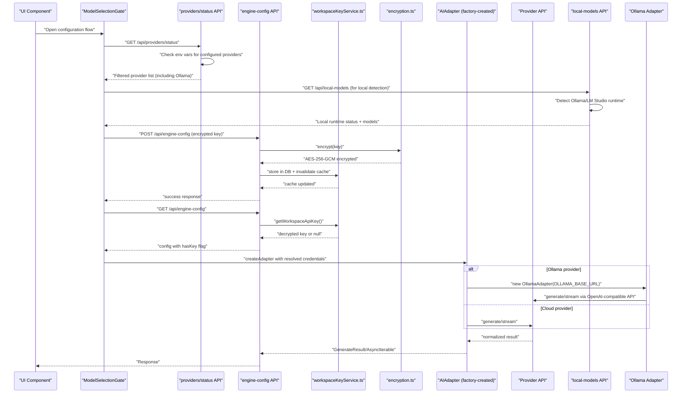
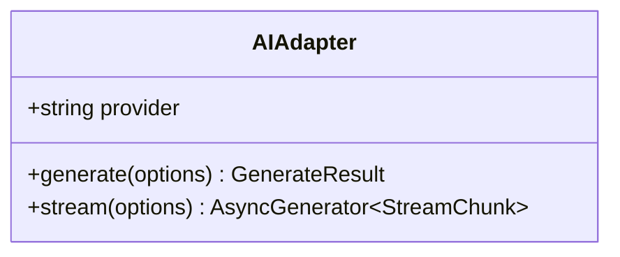
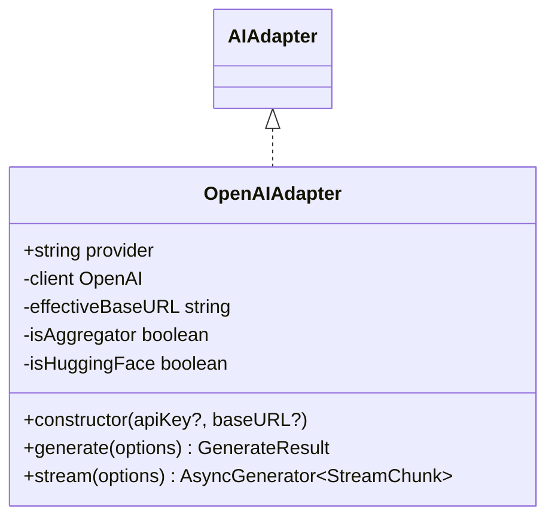
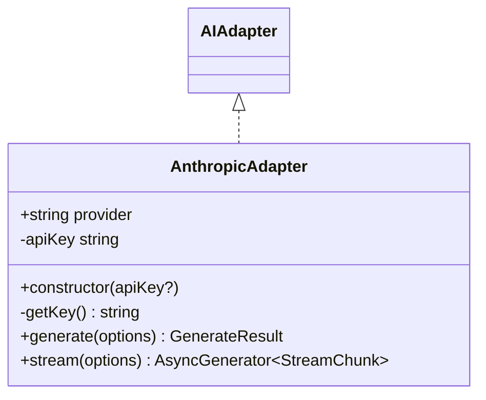
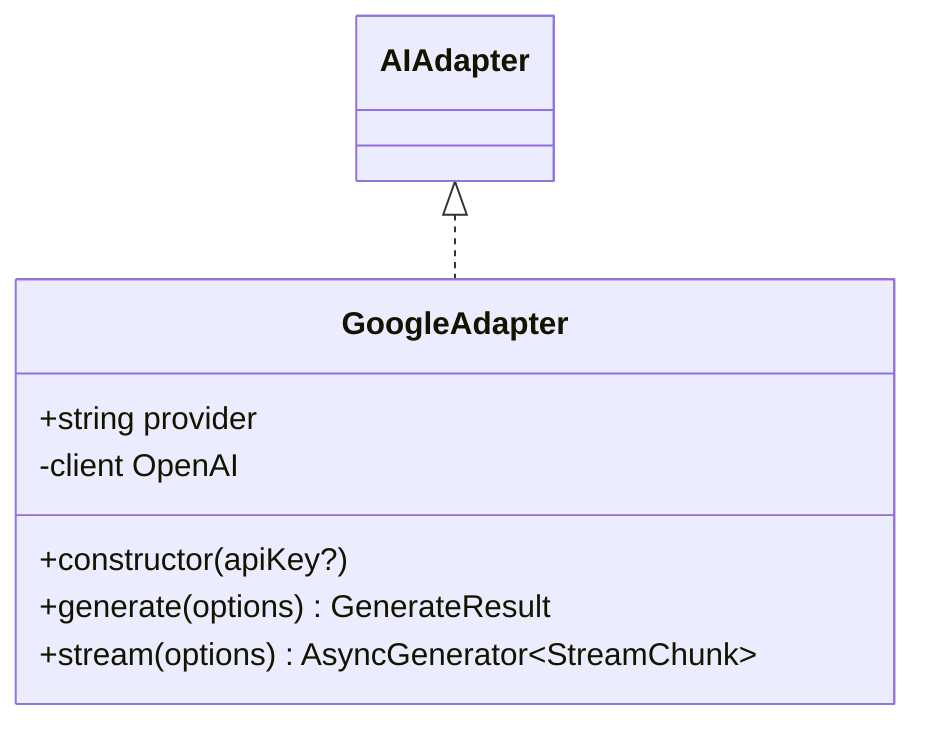
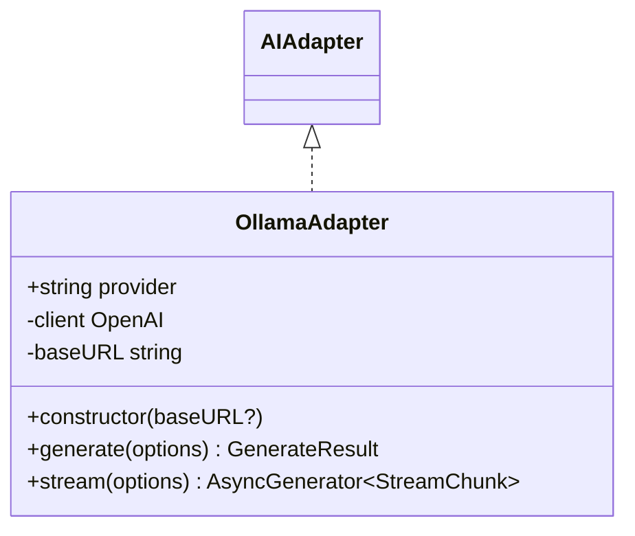
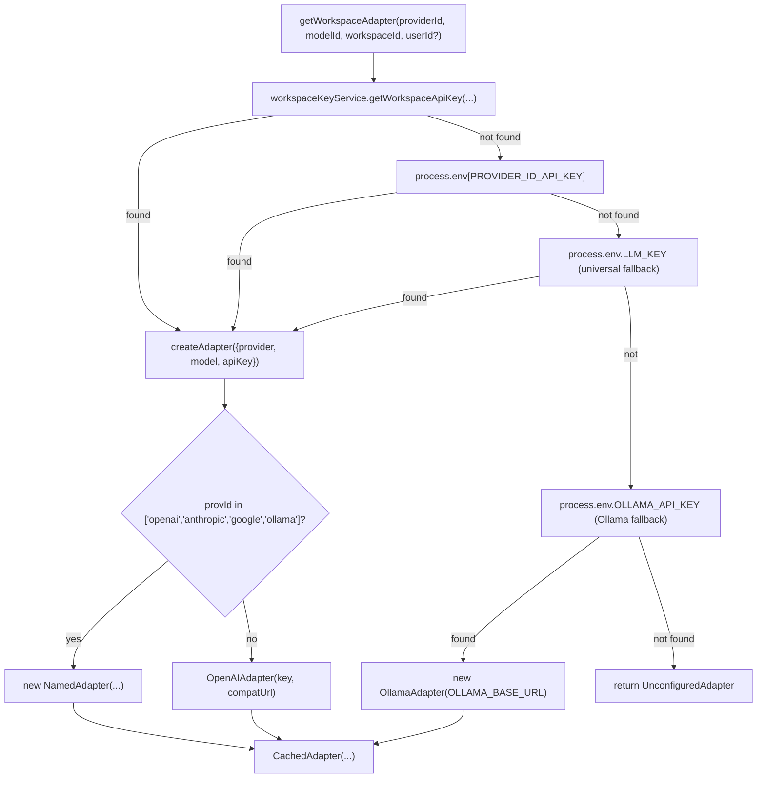
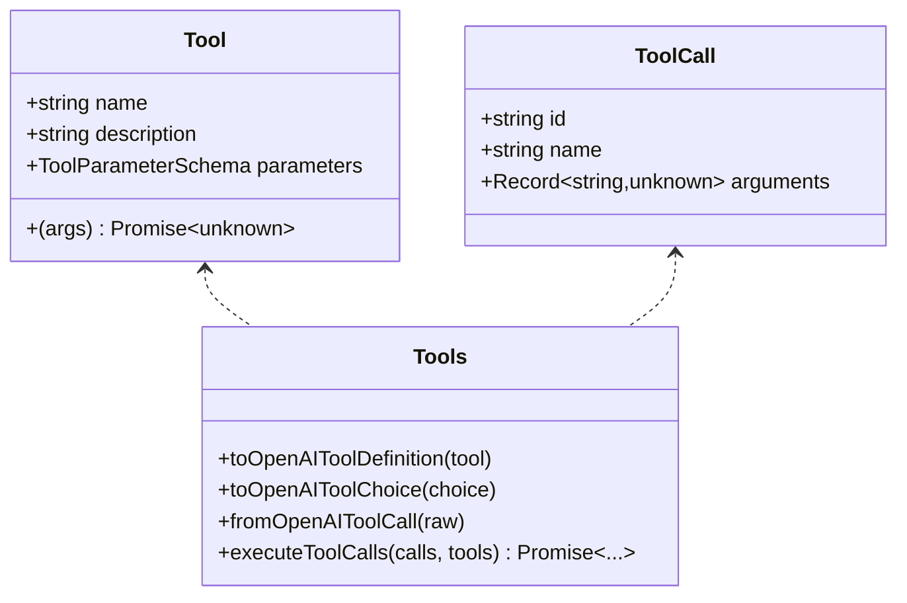
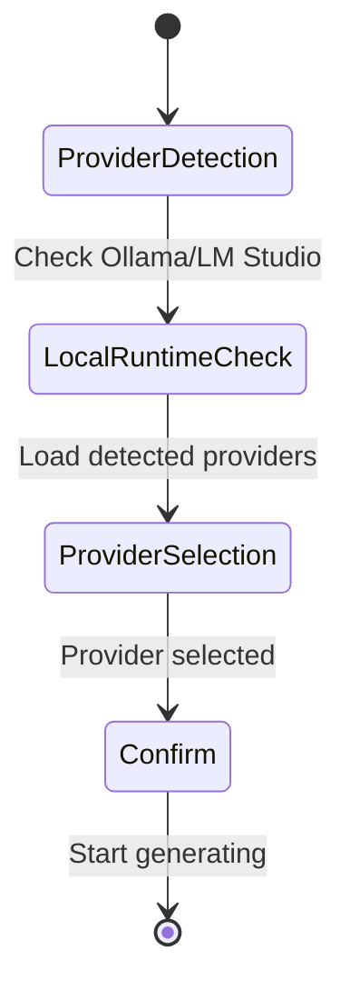
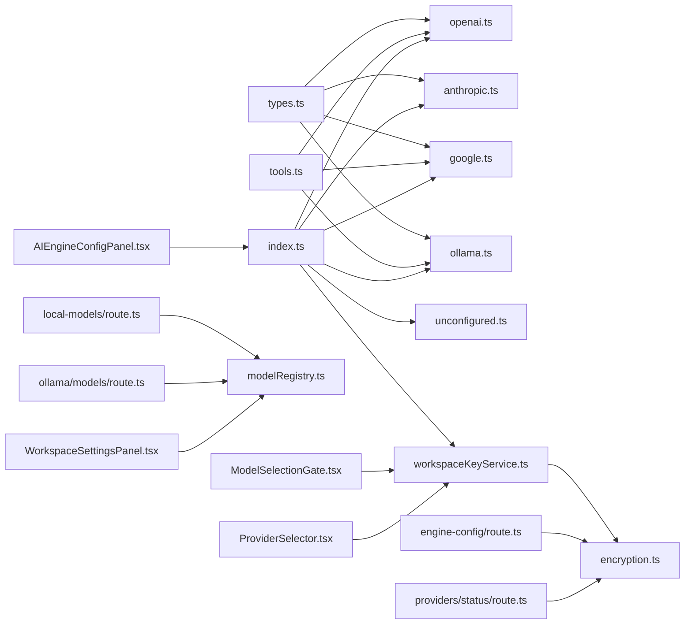

# AI Provider Adapters

<cite>
**Referenced Files in This Document**
- [base.ts](file://lib/ai/adapters/base.ts)
- [openai.ts](file://lib/ai/adapters/openai.ts)
- [anthropic.ts](file://lib/ai/adapters/anthropic.ts)
- [google.ts](file://lib/ai/adapters/google.ts)
- [ollama.ts](file://lib/ai/adapters/ollama.ts)
- [index.ts](file://lib/ai/adapters/index.ts)
- [types.ts](file://lib/ai/types.ts)
- [tools.ts](file://lib/ai/tools.ts)
- [unconfigured.ts](file://lib/ai/adapters/unconfigured.ts)
- [workspaceKeyService.ts](file://lib/security/workspaceKeyService.ts)
- [encryption.ts](file://lib/security/encryption.ts)
- [ModelSelectionGate.tsx](file://components/ModelSelectionGate.tsx)
- [ProviderSelector.tsx](file://components/ProviderSelector.tsx)
- [WorkspaceSettingsPanel.tsx](file://components/WorkspaceSettingsPanel.tsx)
- [AIEngineConfigPanel.tsx](file://components/AIEngineConfigPanel.tsx)
- [route.ts](file://app/api/engine-config/route.ts)
- [route.ts](file://app/api/providers/status/route.ts)
- [route.ts](file://app/api/models/route.ts)
- [route.ts](file://app/api/local-models/route.ts)
- [route.ts](file://app/api/ollama/models/route.ts)
- [modelRegistry.ts](file://lib/ai/modelRegistry.ts)
</cite>

## Update Summary
**Changes Made**
- Restored Ollama integration with comprehensive provider configuration including environment variable support (OLLAMA_API_KEY)
- Added Ollama adapter implementation with OpenAI-compatible API support
- Integrated Ollama models (llama3, mistral, codellama) into model registry with detailed capability profiles
- Enhanced provider configuration to include local model support with proper styling configurations
- Updated UI components to support Ollama configuration with local runtime detection
- Added comprehensive model discovery and local runtime detection capabilities

## Table of Contents
1. [Introduction](#introduction)
2. [Project Structure](#project-structure)
3. [Core Components](#core-components)
4. [Architecture Overview](#architecture-overview)
5. [Detailed Component Analysis](#detailed-component-analysis)
6. [Enhanced Credential Management System](#enhanced-credential-management-system)
7. [Local Model Support](#local-model-support)
8. [Dependency Analysis](#dependency-analysis)
9. [Performance Considerations](#performance-considerations)
10. [Troubleshooting Guide](#troubleshooting-guide)
11. [Conclusion](#conclusion)
12. [Appendices](#appendices)

## Introduction
This document explains the universal AI adapter system that provides model-agnostic access to multiple AI providers. It covers the adapter factory pattern, the base adapter interface, and provider-specific implementations for OpenAI, Anthropic, Google, Groq, and Ollama (local inference). The system now features comprehensive local model support with Ollama integration, enhanced credential management system with streamlined provider selection workflow, automatic provider detection, and comprehensive server-side security with AES-256-GCM encryption.

**Updated** The system has been enhanced to support both cloud-based and local inference providers, with Ollama integration providing seamless access to locally hosted models. The ModelSelectionGate now features a comprehensive interface supporting both cloud and local providers with enhanced visual design including gradient backgrounds and improved security measures.

## Project Structure
The AI adapter system is organized under lib/ai/adapters with a central factory and per-provider adapters. Enhanced UI components provide guided configuration experiences with automatic provider detection and secure credential management. Supporting modules define shared types, tool schemas, encryption services, workspace key management, and comprehensive local model support with Ollama integration.

```mermaid
graph TB
subgraph "Adapters"
BASE["base.ts<br/>AIAdapter interface"]
OA["openai.ts<br/>OpenAIAdapter"]
AA["anthropic.ts<br/>AnthropicAdapter"]
GA["google.ts<br/>GoogleAdapter"]
OLA["ollama.ts<br/>OllamaAdapter"]
IDX["index.ts<br/>Factory + Registry"]
UNC["unconfigured.ts<br/>UnconfiguredAdapter"]
END
subgraph "Enhanced UI Components"
MSG["ModelSelectionGate.tsx<br/>Comprehensive provider configuration"]
PS["ProviderSelector.tsx<br/>Provider + model selection"]
WSP["WorkspaceSettingsPanel.tsx<br/>Local model configuration"]
AIE["AIEngineConfigPanel.tsx<br/>Advanced settings"]
END
subgraph "Security & Encryption"
WKS["workspaceKeyService.ts<br/>DB + Encryption + Caching + Global Fallback"]
ENC["encryption.ts<br/>AES-256-GCM encryption + Fallback"]
API["engine-config/route.ts<br/>Secure credential API"]
PSTATUS["providers/status/route.ts<br/>Provider status + automatic detection"]
END
subgraph "Local Model Support"
LMR["local-models/route.ts<br/>Local runtime detection"]
OMR["ollama/models/route.ts<br/>Ollama model discovery"]
MR["modelRegistry.ts<br/>Model capability profiles"]
END
subgraph "Shared"
TYPES["types.ts<br/>Message/Options/Results"]
TOOLS["tools.ts<br/>Tool/ToolCall/Exec"]
END
IDX --> OA
IDX --> AA
IDX --> GA
IDX --> OLA
IDX --> UNC
MSG --> PS
MSG --> WSP
PS --> WSP
WSP --> MR
AIE --> IDX
OA --> TYPES
AA --> TYPES
GA --> TYPES
OLA --> TYPES
OA --> TOOLS
GA --> TOOLS
OLA --> TOOLS
IDX --> WKS
WKS --> ENC
API --> ENC
PSTATUS --> ENC
LMR --> MR
OMR --> MR
```

**Diagram sources**
- [index.ts:1-301](file://lib/ai/adapters/index.ts#L1-L301)
- [base.ts:1-73](file://lib/ai/adapters/base.ts#L1-L73)
- [openai.ts:1-223](file://lib/ai/adapters/openai.ts#L1-L223)
- [anthropic.ts:1-210](file://lib/ai/adapters/anthropic.ts#L1-L210)
- [google.ts:1-90](file://lib/ai/adapters/google.ts#L1-L90)
- [ollama.ts:1-87](file://lib/ai/adapters/ollama.ts#L1-L87)
- [types.ts:1-130](file://lib/ai/types.ts#L1-L130)
- [tools.ts:1-175](file://lib/ai/tools.ts#L1-L175)
- [unconfigured.ts:1-99](file://lib/ai/adapters/unconfigured.ts#L1-L99)
- [workspaceKeyService.ts:1-138](file://lib/security/workspaceKeyService.ts#L1-L138)
- [encryption.ts:1-95](file://lib/security/encryption.ts#L1-L95)
- [ModelSelectionGate.tsx:1-413](file://components/ModelSelectionGate.tsx#L1-L413)
- [ProviderSelector.tsx:1-375](file://components/ProviderSelector.tsx#L1-L375)
- [WorkspaceSettingsPanel.tsx:1-436](file://components/WorkspaceSettingsPanel.tsx#L1-L436)
- [AIEngineConfigPanel.tsx:1-120](file://components/AIEngineConfigPanel.tsx#L1-L120)
- [route.ts:1-154](file://app/api/engine-config/route.ts#L1-L154)
- [route.ts:1-204](file://app/api/providers/status/route.ts#L1-L204)
- [route.ts:1-271](file://app/api/models/route.ts#L1-L271)
- [route.ts:1-123](file://app/api/local-models/route.ts#L1-L123)
- [route.ts:1-43](file://app/api/ollama/models/route.ts#L1-L43)
- [modelRegistry.ts:1-1138](file://lib/ai/modelRegistry.ts#L1-L1138)

**Section sources**
- [index.ts:1-301](file://lib/ai/adapters/index.ts#L1-L301)
- [types.ts:1-130](file://lib/ai/types.ts#L1-L130)
- [tools.ts:1-175](file://lib/ai/tools.ts#L1-L175)
- [workspaceKeyService.ts:1-138](file://lib/security/workspaceKeyService.ts#L1-L138)
- [encryption.ts:1-95](file://lib/security/encryption.ts#L1-L95)
- [ModelSelectionGate.tsx:1-413](file://components/ModelSelectionGate.tsx#L1-L413)
- [ProviderSelector.tsx:1-375](file://components/ProviderSelector.tsx#L1-L375)
- [WorkspaceSettingsPanel.tsx:1-436](file://components/WorkspaceSettingsPanel.tsx#L1-L436)
- [AIEngineConfigPanel.tsx:1-120](file://components/AIEngineConfigPanel.tsx#L1-L120)
- [route.ts:1-154](file://app/api/engine-config/route.ts#L1-L154)
- [route.ts:1-204](file://app/api/providers/status/route.ts#L1-L204)
- [route.ts:1-271](file://app/api/models/route.ts#L1-L271)
- [route.ts:1-123](file://app/api/local-models/route.ts#L1-L123)
- [route.ts:1-43](file://app/api/ollama/models/route.ts#L1-L43)
- [modelRegistry.ts:1-1138](file://lib/ai/modelRegistry.ts#L1-L1138)

## Core Components
- AIAdapter interface: Defines the provider-agnostic contract with generate() and stream().
- Provider adapters: Implementations for OpenAI, Anthropic, Google, Groq (OpenAI-compatible), and Ollama (local inference); DeepSeek is supported via OpenAI-compatible mode.
- Factory and registry: Centralized creation logic with workspace-aware resolution, fallbacks, and local model support.
- Enhanced UI components: ModelSelectionGate provides comprehensive configuration flow with automatic provider detection; ProviderSelector offers intuitive provider and model selection with detailed provider definitions.
- Comprehensive security system: Server-side credential management with AES-256-GCM encryption, workspace-scoped keys, caching, and global fallback capabilities.
- Local model support: Ollama integration with model discovery, local runtime detection, and comprehensive model capability profiles.
- Shared types: Client-safe message, generation options/results, streaming chunks, and pricing utilities.
- Tools: Canonical tool schema and conversion helpers for provider-specific tool-calling formats.
- Unconfigured adapter: Graceful fallback when no credentials are available.

**Section sources**
- [base.ts:48-72](file://lib/ai/adapters/base.ts#L48-L72)
- [types.ts:19-55](file://lib/ai/types.ts#L19-L55)
- [tools.ts:47-79](file://lib/ai/tools.ts#L47-L79)
- [index.ts:146-215](file://lib/ai/adapters/index.ts#L146-L215)
- [unconfigured.ts:13-99](file://lib/ai/adapters/unconfigured.ts#L13-L99)
- [ModelSelectionGate.tsx:1-413](file://components/ModelSelectionGate.tsx#L1-L413)
- [ProviderSelector.tsx:1-375](file://components/ProviderSelector.tsx#L1-L375)
- [workspaceKeyService.ts:19-95](file://lib/security/workspaceKeyService.ts#L19-L95)
- [encryption.ts:27-69](file://lib/security/encryption.ts#L27-L69)
- [ollama.ts:1-87](file://lib/ai/adapters/ollama.ts#L1-L87)
- [modelRegistry.ts:132-167](file://lib/ai/modelRegistry.ts#L132-L167)

## Architecture Overview
The system enforces strict server-only credential resolution with comprehensive security and automatic provider detection. The factory resolves credentials from workspace settings, environment variables, or returns an unconfigured adapter. Each adapter normalizes provider-specific differences into a unified interface. Enhanced UI components provide guided configuration with ModelSelectionGate and ProviderSelector, featuring automatic provider detection based on environment variables. Local model support is seamlessly integrated with Ollama runtime detection and model capability profiles.



**Diagram sources**
- [ModelSelectionGate.tsx:70-102](file://components/ModelSelectionGate.tsx#L70-L102)
- [route.ts:69-127](file://app/api/engine-config/route.ts#L69-L127)
- [route.ts:88-164](file://app/api/providers/status/route.ts#L88-L164)
- [route.ts:49-95](file://app/api/local-models/route.ts#L49-L95)
- [workspaceKeyService.ts:32-95](file://lib/security/workspaceKeyService.ts#L32-L95)
- [encryption.ts:27-69](file://lib/security/encryption.ts#L27-L69)
- [index.ts:236-278](file://lib/ai/adapters/index.ts#L236-L278)
- [ollama.ts:21-30](file://lib/ai/adapters/ollama.ts#L21-L30)

## Detailed Component Analysis

### Base Adapter Interface
Defines the canonical contract that all adapters implement:
- provider: Canonical provider name.
- generate(options): Non-streaming generation returning content, optional toolCalls, and usage.
- stream(options): Async generator yielding StreamChunk with delta text and done flag; usage may be included on the final chunk.



**Diagram sources**
- [base.ts:50-72](file://lib/ai/adapters/base.ts#L50-L72)

**Section sources**
- [base.ts:28-72](file://lib/ai/adapters/base.ts#L28-L72)

### OpenAI Adapter
Implements the OpenAI-compatible interface with special handling for reasoning models (o1/o3 series), tool-calling, response_format, and streaming. It auto-detects aggregator and Hugging Face routes and applies provider-specific constraints.



**Diagram sources**
- [openai.ts:36-223](file://lib/ai/adapters/openai.ts#L36-L223)
- [base.ts:50-72](file://lib/ai/adapters/base.ts#L50-L72)

**Section sources**
- [openai.ts:23-32](file://lib/ai/adapters/openai.ts#L23-L32)
- [openai.ts:64-157](file://lib/ai/adapters/openai.ts#L64-L157)
- [openai.ts:159-222](file://lib/ai/adapters/openai.ts#L159-L222)

### Anthropic Adapter
Uses the native Anthropic Messages API via fetch(), handling system prompts, JSON mode instructions, token caps, and streaming events.



**Diagram sources**
- [anthropic.ts:71-210](file://lib/ai/adapters/anthropic.ts#L71-L210)
- [base.ts:50-72](file://lib/ai/adapters/base.ts#L50-L72)

**Section sources**
- [anthropic.ts:71-145](file://lib/ai/adapters/anthropic.ts#L71-L145)
- [anthropic.ts:147-207](file://lib/ai/adapters/anthropic.ts#L147-L207)

### Google Adapter
Wraps Google AI Studio's OpenAI-compatible endpoint, forwarding tools and streaming support.



**Diagram sources**
- [google.ts:24-90](file://lib/ai/adapters/google.ts#L24-L90)
- [base.ts:50-72](file://lib/ai/adapters/base.ts#L50-L72)

**Section sources**
- [google.ts:28-69](file://lib/ai/adapters/google.ts#L28-L69)
- [google.ts:71-88](file://lib/ai/adapters/google.ts#L71-L88)

### Ollama Adapter
Implements local inference support through Ollama's OpenAI-compatible API endpoint. Provides seamless integration with local models including tool-calling support for compatible models.



**Diagram sources**
- [ollama.ts:21-87](file://lib/ai/adapters/ollama.ts#L21-L87)
- [base.ts:50-72](file://lib/ai/adapters/base.ts#L50-L72)

**Section sources**
- [ollama.ts:1-87](file://lib/ai/adapters/ollama.ts#L1-L87)

### Adapter Factory and Registry
Central factory with:
- detectProvider(model): Heuristic to infer provider from model name, including Ollama local models.
- createAdapter(cfg): Builds the appropriate adapter, validates credentials, and wraps with CachedAdapter for metrics and caching.
- getWorkspaceAdapter(providerId, modelId, workspaceId, userId?): Secure resolution via workspaceKeyService, env vars, or returns UnconfiguredAdapter.
- CachedAdapter: Adds caching and metrics for generate() and stream().

**Updated** The factory now supports 5 providers: OpenAI, Anthropic, Google, Groq (OpenAI-compatible), and Ollama (local inference). Ollama support has been fully restored with comprehensive environment variable fallback support including OLLAMA_API_KEY and OLLAMA_BASE_URL.



**Diagram sources**
- [index.ts:236-278](file://lib/ai/adapters/index.ts#L236-L278)
- [index.ts:146-215](file://lib/ai/adapters/index.ts#L146-L215)
- [index.ts:248-273](file://lib/ai/adapters/index.ts#L248-273)

**Section sources**
- [index.ts:50-64](file://lib/ai/adapters/index.ts#L50-L64)
- [index.ts:146-215](file://lib/ai/adapters/index.ts#L146-L215)
- [index.ts:236-278](file://lib/ai/adapters/index.ts#L236-L278)

### Unconfigured Adapter
Returns a friendly UI component or JSON payload when no credentials are available, preventing server errors and guiding users to configure settings.

**Section sources**
- [unconfigured.ts:13-99](file://lib/ai/adapters/unconfigured.ts#L13-L99)

### Tools and Tool Calls
A canonical schema for tools and conversions ensures consistent tool-calling across providers:
- Tool: name, description, parameters (JSON Schema subset), execute(args).
- ToolCall: id, name, parsed arguments.
- Conversion helpers: OpenAI tool definitions and choices, and OpenAI tool-call normalization.



**Diagram sources**
- [tools.ts:47-79](file://lib/ai/tools.ts#L47-L79)
- [tools.ts:108-133](file://lib/ai/tools.ts#L108-L133)
- [tools.ts:144-174](file://lib/ai/tools.ts#L144-L174)

**Section sources**
- [tools.ts:13-28](file://lib/ai/tools.ts#L13-L28)
- [tools.ts:47-79](file://lib/ai/tools.ts#L47-L79)
- [tools.ts:108-133](file://lib/ai/tools.ts#L108-L133)
- [tools.ts:144-174](file://lib/ai/tools.ts#L144-L174)

### Types and Pricing
Client-safe types define messages, generation options/results, and streaming chunks. Pricing utilities estimate costs per provider/model.

**Updated** Pricing information has been updated to include Ollama local model entries with appropriate capability profiles and performance characteristics.

**Section sources**
- [types.ts:10-55](file://lib/ai/types.ts#L10-L55)
- [types.ts:71-130](file://lib/ai/types.ts#L71-L130)

## Enhanced Credential Management System

### ModelSelectionGate Component
The ModelSelectionGate provides a comprehensive configuration experience with automatic provider detection and server-side credential management:

**Enhanced Provider Selection Experience**
- Features a sophisticated multi-provider interface supporting both cloud and local inference
- Enhanced visual design with gradient backgrounds and provider-specific theming
- Interactive provider cards with security badges and recommended provider highlighting
- **Updated** Now includes Ollama local provider with automatic runtime detection
- **Updated** Enhanced visual design featuring provider brand color integration

**Automatic Provider Detection**
- Fetches configured providers from `/api/providers/status` which checks environment variables
- Shows only providers with API keys configured in Vercel environment variables
- **Updated** Includes Ollama local runtime detection with automatic model discovery
- Interactive provider cards with security badges and recommended provider highlighting

**Comprehensive Provider Options**
- **Cloud Providers**: OpenAI, Anthropic, Google, Groq with automatic key detection
- **Local Providers**: Ollama with automatic runtime detection and model discovery
- **Enhanced Visual Design**: Provider cards with brand-specific color schemes and visual indicators
- **Recommended provider highlighting**: Prominent badges for optimal provider selection
- **Model suggestions**: Provider-specific branding with context window information

**Streamlined Configuration Flow**
- Direct provider selection without intermediate steps
- One-click model confirmation with security review
- **Updated** Enhanced Ollama configuration with local runtime validation
- Start generating button with loading states and gradient styling



**Diagram sources**
- [ModelSelectionGate.tsx:69-102](file://components/ModelSelectionGate.tsx#L69-L102)
- [ModelSelectionGate.tsx:110-146](file://components/ModelSelectionGate.tsx#L110-L146)
- [ModelSelectionGate.tsx:300-405](file://components/ModelSelectionGate.tsx#L300-L405)

**Section sources**
- [ModelSelectionGate.tsx:1-413](file://components/ModelSelectionGate.tsx#L1-L413)

### ProviderSelector Component
The ProviderSelector offers intuitive provider and model selection with comprehensive provider definitions and automatic credential validation:

**Enhanced Provider Options with Local Support**
- **Cloud Providers**: OpenAI, Anthropic, Google, Groq with automatic key detection
- **Local Providers**: Ollama with automatic runtime detection and model discovery
- **Enhanced Visual Design**: Provider cards with brand-specific color schemes and visual indicators
- **Recommended provider highlighting**: Prominent badges for optimal provider selection
- **Feature lists**: Context window information and model suggestions for each provider

**Security and Validation Features**
- Security badges for each provider with credential status indicators
- **Updated** Local runtime detection with automatic model discovery
- **Enhanced** Provider-specific configuration with environment variable fallbacks
- Workspace-scoped credential status with automatic validation

**Section sources**
- [ProviderSelector.tsx:1-375](file://components/ProviderSelector.tsx#L1-L375)

### Provider Status API
The `/api/providers/status` endpoint provides automatic provider detection based on environment variables:

**Universal LLM_KEY Support**
- **Updated** Added support for universal LLM_KEY that works for all providers
- **Updated** Enhanced provider detection to include Ollama local runtime
- Checks Vercel environment variables for configured providers
- Handles Google Gemini with dual environment variable support (GOOGLE_API_KEY and GEMINI_API_KEY)
- **Updated** Includes Ollama runtime detection with automatic model discovery

**Enhanced Provider Configuration Schema**
- Provider definitions with colors, gradients, and model lists matching UI components
- Environment variable mapping for automatic credential detection
- **Updated** Local runtime detection with automatic model discovery
- Recommended provider flags for UI prioritization

**Section sources**
- [route.ts:1-204](file://app/api/providers/status/route.ts#L1-L204)

### Server-Side Security Architecture
The system implements comprehensive server-side credential management with automatic provider detection:

**Encryption Service**
- AES-256-GCM encryption with random IV and authentication tags
- Support for both base64 and raw 32-byte secrets
- Fallback to SHA-256 derived keys for development environments
- Safe runtime validation with non-fatal warnings during build phase

**Workspace Key Service**
- Per-process in-memory caching with 5-minute TTL
- Workspace-scoped credential resolution with authorization verification
- Global fallback capability for pipeline routes accessing any workspace
- Cache invalidation on configuration changes for immediate effect

**API Endpoints**
- `/api/engine-config`: Secure credential storage and retrieval with automatic cache invalidation
- `/api/providers/status`: Provider availability checking with environment variable validation
- **Updated** `/api/local-models`: Local runtime detection with automatic model discovery
- **Updated** `/api/ollama/models`: Ollama-specific model discovery and validation
- Automatic cache invalidation on configuration changes
- Workspace-scoped encryption and decryption with fallback mechanisms

**Section sources**
- [encryption.ts:1-95](file://lib/security/encryption.ts#L1-L95)
- [workspaceKeyService.ts:1-138](file://lib/security/workspaceKeyService.ts#L1-L138)
- [route.ts:1-154](file://app/api/engine-config/route.ts#L1-L154)
- [route.ts:1-204](file://app/api/providers/status/route.ts#L1-L204)
- [route.ts:1-123](file://app/api/local-models/route.ts#L1-L123)
- [route.ts:1-43](file://app/api/ollama/models/route.ts#L1-L43)

## Local Model Support

### Ollama Integration
The system now provides comprehensive local model support through Ollama integration:

**Ollama Adapter Implementation**
- Uses OpenAI-compatible API endpoint at http://localhost:11434/v1
- Supports tool-calling for compatible models (llama3.1, mistral-nemo)
- Automatic fallback to OLLAMA_BASE_URL environment variable
- Seamless integration with existing adapter factory pattern

**Model Capability Profiles**
- Comprehensive model registry with detailed capability profiles for Ollama models
- Support for tiny, small, medium, and large model sizes
- Detailed strength/weakness analysis for each model family
- Context window, temperature, and streaming reliability specifications

**Model Discovery and Detection**
- Automatic Ollama runtime detection with local model discovery
- Fallback to predefined model list when Ollama is unavailable
- Temperature optimization and model sizing information
- Real-time validation of local model availability

**Enhanced UI Configuration**
- **Updated** WorkspaceSettingsPanel with Ollama-specific configuration
- Local runtime detection with automatic model listing
- Environment variable configuration for OLLAMA_BASE_URL
- Model capability visualization with performance characteristics

**Section sources**
- [ollama.ts:1-87](file://lib/ai/adapters/ollama.ts#L1-L87)
- [modelRegistry.ts:132-629](file://lib/ai/modelRegistry.ts#L132-L629)
- [route.ts:1-123](file://app/api/local-models/route.ts#L1-L123)
- [route.ts:1-43](file://app/api/ollama/models/route.ts#L1-L43)
- [WorkspaceSettingsPanel.tsx:335-357](file://components/WorkspaceSettingsPanel.tsx#L335-L357)

### Local Runtime Detection
The system provides comprehensive local runtime detection for multiple inference engines:

**Supported Local Runtimes**
- **Ollama**: http://localhost:11434 with /api/tags endpoint
- **LM Studio**: http://localhost:1234 with /v1/models endpoint
- **Enhanced Detection**: Automatic runtime validation with timeout handling
- **Model Discovery**: Real-time model listing with size and temperature information

**Model Information Processing**
- Automatic model label formatting and size calculation
- Temperature estimation based on model characteristics
- Fallback model lists when local runtimes are unavailable
- Real-time validation and error handling

**Section sources**
- [route.ts:1-123](file://app/api/local-models/route.ts#L1-L123)

### Model Registry Enhancement
The model registry has been expanded to include comprehensive Ollama model support:

**Model Capability Profiles**
- Detailed profiles for tiny models (1B-3B parameters)
- Small models (3B-9B parameters) with structured templates
- Medium models (10B-34B parameters) with guided freeform
- Large models (35B-70B parameters) with full freeform
- Cloud models with API hosting

**Ollama Model Support**
- Tiny models: phi, gemma, tinyllama with aggressive extraction
- Small models: phi3, gemma:7b, llama3.2 with structured templates
- Medium models: deepseek-coder, codegemma with guided freeform
- Large models: llama3:70b, deepseek-r1 with full freeform
- Detailed strength/weakness analysis for each model family

**Section sources**
- [modelRegistry.ts:132-629](file://lib/ai/modelRegistry.ts#L132-L629)

## Dependency Analysis
- Adapters depend on shared types and tools for message and tool-calling normalization.
- The factory depends on workspaceKeyService for secure credential resolution and environment variables as fallbacks.
- CachedAdapter decorates any AIAdapter to add caching and metrics.
- UI components rely on the factory and types for configuration and rendering.
- ModelSelectionGate and ProviderSelector components depend on workspaceKeyService for credential validation.
- Provider status API depends on environment variables for automatic provider detection.
- **Updated** Local model support depends on local-models and ollama/models APIs for runtime detection.
- **Updated** Ollama adapter depends on OpenAI-compatible API and environment variable configuration.
- Encryption service provides secure key storage for all credential management flows.

**Updated** Dependencies have been enhanced with comprehensive local model support and Ollama integration.



**Diagram sources**
- [index.ts:1-301](file://lib/ai/adapters/index.ts#L1-L301)
- [types.ts:1-130](file://lib/ai/types.ts#L1-L130)
- [tools.ts:1-175](file://lib/ai/tools.ts#L1-L175)
- [workspaceKeyService.ts:1-138](file://lib/security/workspaceKeyService.ts#L1-L138)
- [encryption.ts:1-95](file://lib/security/encryption.ts#L1-L95)
- [ModelSelectionGate.tsx:1-413](file://components/ModelSelectionGate.tsx#L1-L413)
- [ProviderSelector.tsx:1-375](file://components/ProviderSelector.tsx#L1-L375)
- [WorkspaceSettingsPanel.tsx:1-436](file://components/WorkspaceSettingsPanel.tsx#L1-L436)
- [AIEngineConfigPanel.tsx:1-120](file://components/AIEngineConfigPanel.tsx#L1-L120)
- [route.ts:1-154](file://app/api/engine-config/route.ts#L1-L154)
- [route.ts:1-204](file://app/api/providers/status/route.ts#L1-L204)
- [route.ts:1-123](file://app/api/local-models/route.ts#L1-L123)
- [route.ts:1-43](file://app/api/ollama/models/route.ts#L1-L43)
- [modelRegistry.ts:1-1138](file://lib/ai/modelRegistry.ts#L1-L1138)

**Section sources**
- [index.ts:1-301](file://lib/ai/adapters/index.ts#L1-L301)
- [workspaceKeyService.ts:1-138](file://lib/security/workspaceKeyService.ts#L1-L138)
- [encryption.ts:1-95](file://lib/security/encryption.ts#L1-L95)
- [route.ts:1-154](file://app/api/engine-config/route.ts#L1-L154)
- [route.ts:1-204](file://app/api/providers/status/route.ts#L1-L204)
- [route.ts:1-123](file://app/api/local-models/route.ts#L1-L123)
- [route.ts:1-43](file://app/api/ollama/models/route.ts#L1-L43)
- [modelRegistry.ts:1-1138](file://lib/ai/modelRegistry.ts#L1-L1138)

## Performance Considerations
- Caching: CachedAdapter caches both full results and streaming chunks keyed by normalized options, reducing provider calls and enabling latency metrics.
- Token caps: Provider-specific caps prevent oversized requests and reduce retries.
- Streaming: Providers that support usage in stream finalization enable accurate cost accounting.
- Environment checks: Early detection of aggregator/HF routes avoids unnecessary retries and misconfiguration.
- **Updated** Local model performance: Ollama models provide significant speed improvements for local inference with reduced latency.
- **Updated** Model selection optimization: Predefined model lists reduce API calls for model discovery and improve response times.
- **Updated** Local runtime detection: Efficient timeout handling prevents blocking when local runtimes are unavailable.
- **Updated** Automatic provider detection: Environment variable checks are performed server-side, avoiding client-side complexity.
- **Updated** Enhanced architecture reduces adapter instantiation overhead and improves performance with comprehensive local model support.

## Troubleshooting Guide
Common issues and resolutions:
- Missing API key: The factory throws a ConfigurationError or returns UnconfiguredAdapter. Configure via ModelSelectionGate.
- Provider mismatch: Use explicit provider selection in configuration to avoid heuristic detection errors.
- Tool-calling not working: Some providers ignore tools; verify provider support and remove tools for incompatible providers.
- Streaming failures: Ensure provider supports streaming and that the adapter is using the correct endpoint/baseURL.
- **Updated** Local providers unreachable: Check Ollama installation and ensure http://localhost:11434 is accessible.
- **Updated** Ollama model not found: Verify model is pulled locally using `ollama pull <model-name>`.
- **Updated** OLLAMA_BASE_URL configuration: Set environment variable in .env.local for custom Ollama endpoints.
- **Updated** Local runtime detection failures: Check firewall settings and ensure local ports are accessible.
- Encryption key issues: Check ENCRYPTION_SECRET environment variable format and length.
- Cache invalidation: WorkspaceKeyService automatically invalidates cache on configuration changes.
- Model selection problems: Use ProviderSelector component for guided model selection with credential validation.
- Security warnings: The system provides non-fatal warnings during build phase to prevent deployment failures.
- Provider detection failures: Check Vercel environment variables for proper provider configuration.
- Automatic provider detection not working: Verify environment variables match expected naming conventions.
- **Updated** Configuration problems: Use comprehensive ModelSelectionGate workflow with enhanced Ollama support.
- **Updated** Local model issues: Check Ollama logs and ensure models are properly downloaded and accessible.

**Section sources**
- [index.ts:28-40](file://lib/ai/adapters/index.ts#L28-L40)
- [index.ts:159-162](file://lib/ai/adapters/index.ts#L159-L162)
- [index.ts:204-207](file://lib/ai/adapters/index.ts#L204-L207)
- [unconfigured.ts:13-99](file://lib/ai/adapters/unconfigured.ts#L13-L99)
- [encryption.ts:81-94](file://lib/security/encryption.ts#L81-L94)
- [workspaceKeyService.ts:97-106](file://lib/security/workspaceKeyService.ts#L97-L106)
- [ModelSelectionGate.tsx:70-102](file://components/ModelSelectionGate.tsx#L70-L102)
- [ProviderSelector.tsx:136-148](file://components/ProviderSelector.tsx#L136-L148)
- [route.ts:88-164](file://app/api/providers/status/route.ts#L88-L164)
- [route.ts:49-95](file://app/api/local-models/route.ts#L49-L95)
- [ollama.ts:25-29](file://lib/ai/adapters/ollama.ts#L25-L29)

## Conclusion
The AI adapter system provides a robust, provider-agnostic abstraction over multiple AI providers with comprehensive security enhancements and streamlined configuration workflows. The addition of Ollama integration creates a comprehensive system supporting both cloud-based and local inference providers, with automatic provider detection, enhanced credential management, and seamless local model support. The system now features five supported providers: OpenAI, Anthropic, Google, Groq, and Ollama, providing flexibility for different use cases and performance requirements. The enhanced credential management system ensures secure, workspace-scoped API key storage using AES-256-GCM encryption, while the automatic provider detection system eliminates manual API key entry by leveraging environment variables. The comprehensive local model support through Ollama integration provides significant performance benefits for local inference scenarios, with automatic runtime detection and model capability profiles. By centralizing credential resolution, enforcing server-only secrets, and normalizing provider differences, it enables seamless switching between models and providers with enterprise-grade security and user-friendly configuration.

**Updated** The system has been enhanced to support both cloud-based and local inference providers, significantly expanding its capabilities and use cases. The new Ollama integration provides seamless access to locally hosted models with comprehensive model discovery, runtime detection, and capability profiling. The streamlined ModelSelectionGate interface with enhanced provider options provides an intuitive configuration experience while maintaining the system's robust security and performance characteristics.

## Appendices

### Implementing a New Adapter
Steps to add a new provider:
1. Define a new class implementing AIAdapter with generate() and stream().
2. Normalize provider-specific message/tool/response formats to the shared types.
3. Register the adapter in the factory's createAdapter() switch or treat it as OpenAI-compatible via baseUrl.
4. Add provider detection logic if supporting OpenAI-compatible mode.
5. **Updated** Integrate with local model support if applicable (e.g., Ollama adapter pattern).
6. Integrate with the UI configuration panel for hints and documentation.

References:
- [base.ts:50-72](file://lib/ai/adapters/base.ts#L50-L72)
- [index.ts:146-215](file://lib/ai/adapters/index.ts#L146-L215)
- [types.ts:19-55](file://lib/ai/types.ts#L19-L55)
- [tools.ts:108-133](file://lib/ai/tools.ts#L108-L133)
- [ollama.ts:21-30](file://lib/ai/adapters/ollama.ts#L21-L30)

### Configuring Provider Credentials
- **ModelSelectionGate**: Comprehensive configuration with automatic provider detection and server-side encryption
- **ProviderSelector**: Interactive provider and model selection with credential status and automatic validation
- **Updated** **Ollama Configuration**: Local runtime detection with automatic model discovery and environment variable support
- **Automatic Provider Detection**: Environment variable-based provider availability checking with universal LLM_KEY support
- **Workspace-level**: Store encrypted keys in workspace settings; retrieved via workspaceKeyService with global fallback
- **Environment Variables**: Set provider-specific environment variables for automatic credential detection
- **Unconfigured fallback**: When no keys are found, UnconfiguredAdapter returns a helpful UI or JSON
- **Updated** **Local Runtime Configuration**: OLLAMA_BASE_URL environment variable for custom Ollama endpoints

References:
- [ModelSelectionGate.tsx:1-413](file://components/ModelSelectionGate.tsx#L1-L413)
- [ProviderSelector.tsx:1-375](file://components/ProviderSelector.tsx#L1-L375)
- [route.ts:88-164](file://app/api/providers/status/route.ts#L88-L164)
- [index.ts:236-278](file://lib/ai/adapters/index.ts#L236-L278)
- [workspaceKeyService.ts:32-67](file://lib/security/workspaceKeyService.ts#L32-L67)
- [unconfigured.ts:13-99](file://lib/ai/adapters/unconfigured.ts#L13-L99)
- [ollama.ts:25-29](file://lib/ai/adapters/ollama.ts#L25-L29)

### Enhanced Security Features
- **AES-256-GCM Encryption**: Hardware-accelerated encryption with authentication and fallback mechanisms
- **Workspace Scoping**: Keys are tied to specific workspaces with authorization checks and global fallback
- **Cache Invalidation**: Automatic cache clearing on configuration changes with immediate effect
- **Non-Fatal Validation**: Build-time warnings instead of deployment failures with graceful fallback
- **Environment Variable Integration**: Seamless fallback to environment variables with automatic provider detection
- **Provider Status API**: Server-side provider availability checking with environment variable validation
- **Universal LLM_KEY Support**: Single key that works across all providers for simplified configuration
- **Updated** **Local Runtime Security**: Secure local model access with automatic runtime validation and model discovery

References:
- [encryption.ts:27-69](file://lib/security/encryption.ts#L27-L69)
- [workspaceKeyService.ts:32-95](file://lib/security/workspaceKeyService.ts#L32-L95)
- [route.ts:69-127](file://app/api/engine-config/route.ts#L69-L127)
- [route.ts:88-164](file://app/api/providers/status/route.ts#L88-L164)
- [route.ts:49-95](file://app/api/local-models/route.ts#L49-L95)

### Handling Provider-Specific Features
- Tool calls: Use the canonical Tool/ToolCall schema; adapters convert to/from provider-specific formats.
- Streaming: Use AsyncGenerator to yield StreamChunk deltas; usage may be included on the final chunk.
- Model constraints: Adapters handle provider-specific limitations (e.g., reasoning models, response_format, token caps).
- Model selection: Use ProviderSelector for guided model selection with workspace validation and automatic provider detection.
- **Updated** **Local Model Features**: Ollama models support tool-calling for compatible models with automatic runtime detection.
- **Updated** **Model Capability Profiles**: Comprehensive capability profiles drive pipeline selection and optimization.

**Updated** Provider-specific features now include comprehensive Ollama local model support with detailed capability profiles and performance characteristics.

References:
- [tools.ts:47-79](file://lib/ai/tools.ts#L47-L79)
- [openai.ts:64-157](file://lib/ai/adapters/openai.ts#L64-L157)
- [anthropic.ts:89-145](file://lib/ai/adapters/anthropic.ts#L89-L145)
- [google.ts:35-69](file://lib/ai/adapters/google.ts#L35-L69)
- [ollama.ts:32-87](file://lib/ai/adapters/ollama.ts#L32-L87)
- [ProviderSelector.tsx:259-282](file://components/ProviderSelector.tsx#L259-L282)
- [modelRegistry.ts:69-128](file://lib/ai/modelRegistry.ts#L69-L128)

### Example Workflows and Tests
- Adapter usage and streaming are validated in tests for OpenAI, Anthropic, Google, and Ollama.
- **Updated** Ollama tests validate local model integration and runtime detection.
- Tests demonstrate tool-calling and streaming behavior across all providers.
- Encryption service tests validate AES-256-GCM implementation with fallback mechanisms.
- Adapter index tests cover provider detection and configuration resolution.
- Provider status API tests validate environment variable-based provider detection.
- **Updated** Local model detection tests validate Ollama runtime detection and model discovery.
- ModelSelectionGate tests validate automatic provider detection and comprehensive configuration workflow.

**Updated** Example workflows now reflect the comprehensive adapter system with 5 supported providers and enhanced local model support.

References:
- [adapters.test.ts:1-109](file://__tests__/adapters.test.ts#L1-L109)
- [adapterIndex.test.ts:1-72](file://__tests__/adapterIndex.test.ts#L1-L72)
- [encryption.test.ts:1-48](file://__tests__/encryption.test.ts#L1-L48)
- [route.ts:88-164](file://app/api/providers/status/route.ts#L88-L164)
- [route.ts:1-123](file://app/api/local-models/route.ts#L1-L123)
- [route.ts:1-43](file://app/api/ollama/models/route.ts#L1-L43)
- [ModelSelectionGate.tsx:1-413](file://components/ModelSelectionGate.tsx#L1-L413)