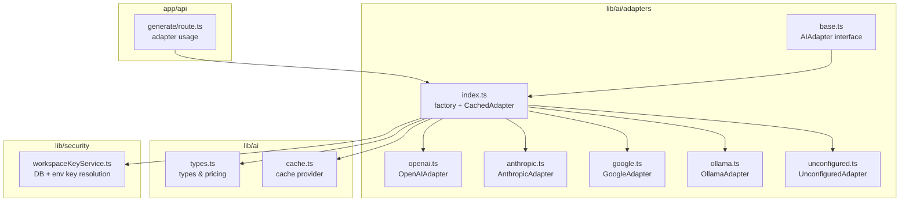
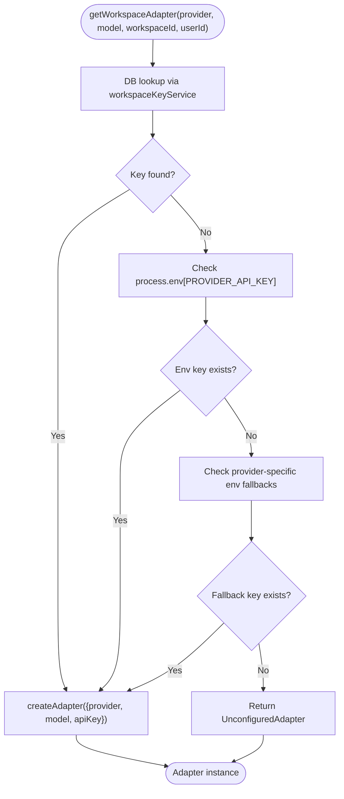
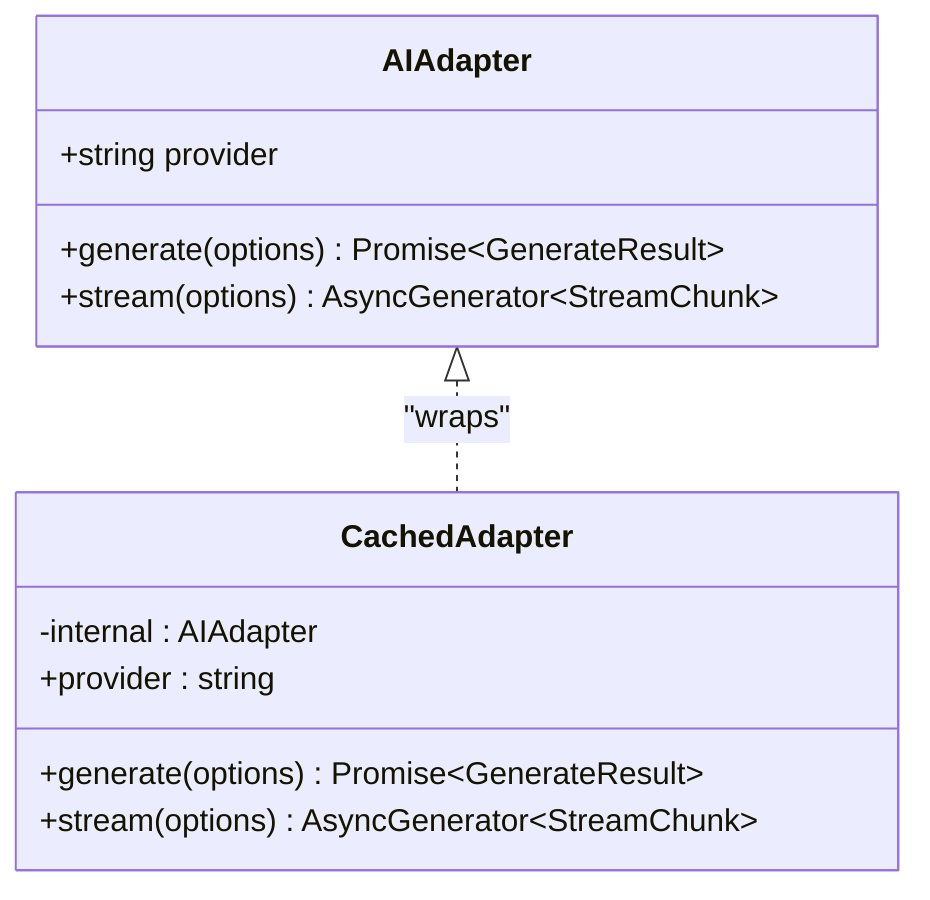
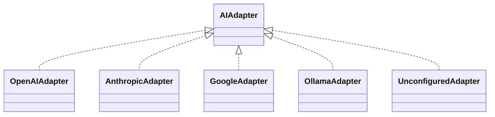
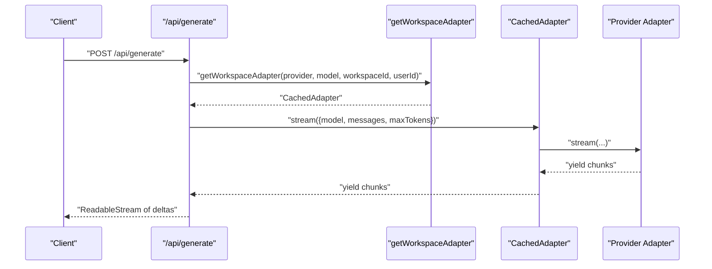
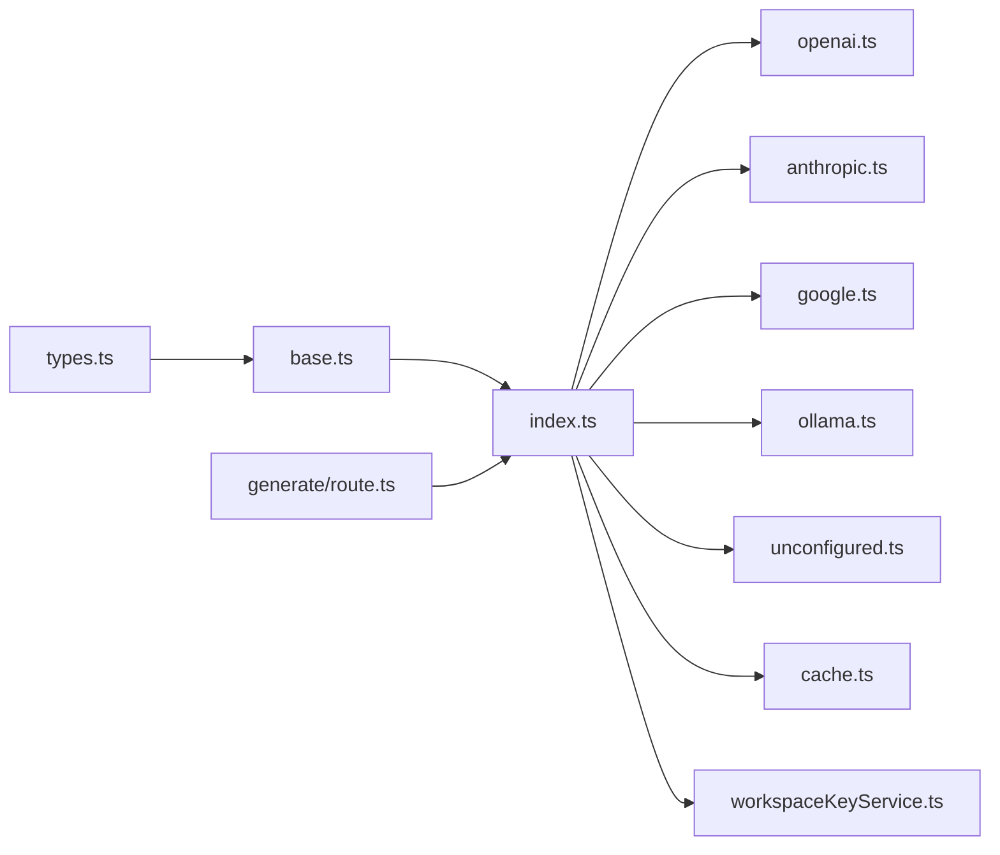

# Adapter Architecture & Factory Pattern

<cite>
**Referenced Files in This Document**
- [base.ts](file://lib/ai/adapters/base.ts)
- [index.ts](file://lib/ai/adapters/index.ts)
- [openai.ts](file://lib/ai/adapters/openai.ts)
- [anthropic.ts](file://lib/ai/adapters/anthropic.ts)
- [google.ts](file://lib/ai/adapters/google.ts)
- [ollama.ts](file://lib/ai/adapters/ollama.ts)
- [unconfigured.ts](file://lib/ai/adapters/unconfigured.ts)
- [types.ts](file://lib/ai/types.ts)
- [cache.ts](file://lib/ai/cache.ts)
- [workspaceKeyService.ts](file://lib/security/workspaceKeyService.ts)
- [route.ts](file://app/api/generate/route.ts)
</cite>

## Table of Contents
1. [Introduction](#introduction)
2. [Project Structure](#project-structure)
3. [Core Components](#core-components)
4. [Architecture Overview](#architecture-overview)
5. [Detailed Component Analysis](#detailed-component-analysis)
6. [Dependency Analysis](#dependency-analysis)
7. [Performance Considerations](#performance-considerations)
8. [Troubleshooting Guide](#troubleshooting-guide)
9. [Conclusion](#conclusion)

## Introduction
This document explains the AI adapter architecture and factory pattern implementation used to provide a unified interface for multiple AI providers. It covers:
- The base AIAdapter interface contract for generate() and stream()
- The adapter factory pattern that selects the correct adapter based on provider configuration
- The credential resolution hierarchy enforced by getWorkspaceAdapter
- The CachedAdapter decorator that adds transparent caching for both synchronous and streaming responses
- Provider detection, model name resolution, and hardening against client-side credential injection
- Examples of adapter lifecycle, error handling, and configuration hierarchy

## Project Structure
The AI adapter system lives under lib/ai/adapters and integrates with shared types, caching, and security utilities. The API routes orchestrate adapter usage.



**Diagram sources**
- [base.ts:48-72](file://lib/ai/adapters/base.ts#L48-L72)
- [index.ts:1-306](file://lib/ai/adapters/index.ts#L1-L306)
- [openai.ts:36-223](file://lib/ai/adapters/openai.ts#L36-L223)
- [anthropic.ts:71-210](file://lib/ai/adapters/anthropic.ts#L71-L210)
- [google.ts:24-90](file://lib/ai/adapters/google.ts#L24-L90)
- [ollama.ts:21-87](file://lib/ai/adapters/ollama.ts#L21-L87)
- [unconfigured.ts:13-99](file://lib/ai/adapters/unconfigured.ts#L13-L99)
- [types.ts:1-130](file://lib/ai/types.ts#L1-L130)
- [cache.ts:1-141](file://lib/ai/cache.ts#L1-L141)
- [workspaceKeyService.ts:32-95](file://lib/security/workspaceKeyService.ts#L32-L95)
- [route.ts:56-85](file://app/api/generate/route.ts#L56-L85)

**Section sources**
- [index.ts:1-306](file://lib/ai/adapters/index.ts#L1-L306)
- [types.ts:1-130](file://lib/ai/types.ts#L1-L130)

## Core Components
- AIAdapter interface: Defines the provider-agnostic contract with generate() and stream().
- Adapter implementations: OpenAIAdapter, AnthropicAdapter, GoogleAdapter, OllamaAdapter, UnconfiguredAdapter.
- Factory and caching: getWorkspaceAdapter(), createAdapter(), CachedAdapter decorator.
- Types and pricing: Shared types, provider registry, and cost estimation helpers.
- Security: workspaceKeyService for encrypted workspace keys and environment fallbacks.
- Cache: Pluggable cache provider with in-memory and Upstash Redis backends.

**Section sources**
- [base.ts:48-72](file://lib/ai/adapters/base.ts#L48-L72)
- [index.ts:82-138](file://lib/ai/adapters/index.ts#L82-L138)
- [types.ts:19-55](file://lib/ai/types.ts#L19-L55)
- [cache.ts:18-141](file://lib/ai/cache.ts#L18-L141)
- [workspaceKeyService.ts:32-95](file://lib/security/workspaceKeyService.ts#L32-L95)

## Architecture Overview
The system enforces a hardened, server-only credential resolution policy. Clients never supply API keys or base URLs; the server resolves credentials from workspace settings or environment variables and returns a CachedAdapter wrapping the appropriate provider-specific adapter.

```mermaid
sequenceDiagram
participant Client as "Client"
participant Route as "app/api/generate/route.ts"
participant Factory as "getWorkspaceAdapter()"
participant WSKey as "workspaceKeyService"
participant Create as "createAdapter()"
participant Cache as "CachedAdapter"
participant Provider as "Provider Adapter"
Client->>Route : "POST /api/generate"
Route->>Factory : "getWorkspaceAdapter(provider, model, workspaceId, userId)"
Factory->>WSKey : "getWorkspaceApiKey(provider, workspaceId, userId)"
alt "Key found"
WSKey-->>Factory : "decrypted key"
else "Not found"
WSKey-->>Factory : "null"
Factory->>Factory : "check process.env[PROVIDER_API_KEY]"
end
Factory->>Create : "createAdapter({provider, model, apiKey})"
Create->>Provider : "instantiate provider adapter"
Create->>Cache : "wrap with CachedAdapter"
Cache-->>Route : "CachedAdapter"
Route->>Cache : "generate()/stream()"
Cache->>Provider : "delegate call"
Provider-->>Cache : "result/stream"
Cache-->>Route : "result/stream"
Route-->>Client : "JSON or streamed response"
```

**Diagram sources**
- [route.ts:56-85](file://app/api/generate/route.ts#L56-L85)
- [index.ts:236-278](file://lib/ai/adapters/index.ts#L236-L278)
- [workspaceKeyService.ts:32-95](file://lib/security/workspaceKeyService.ts#L32-L95)
- [index.ts:146-215](file://lib/ai/adapters/index.ts#L146-L215)
- [index.ts:82-138](file://lib/ai/adapters/index.ts#L82-L138)

## Detailed Component Analysis

### AIAdapter Interface and Contracts
- Provider identity: Each adapter exposes a provider string identifying the canonical provider.
- Synchronous generation: generate(options) returns a structured result with content, optional toolCalls, and usage metrics.
- Streaming generation: stream(options) yields StreamChunk objects incrementally; the final chunk sets done to true.

Implementation highlights:
- The interface ensures all adapters expose the same methods and return types, enabling provider-agnostic code.
- The types module defines client-safe types and pricing helpers used across the system.

**Section sources**
- [base.ts:48-72](file://lib/ai/adapters/base.ts#L48-L72)
- [types.ts:19-55](file://lib/ai/types.ts#L19-L55)

### Adapter Factory Pattern and Credential Resolution
The factory pattern centralizes adapter selection and credential resolution:
- detectProvider(model): Heuristic to infer provider from model name when not explicitly provided.
- resolveModelName(model): Passthrough that preserves the user’s configured model name.
- createAdapter(cfg): Builds the correct adapter instance, enforcing that apiKey and baseUrl are server-resolved.
- getWorkspaceAdapter(providerId, modelId, workspaceId, userId?): The hardened entry point resolving credentials via:
  1) DB lookup via workspaceKeyService.getWorkspaceApiKey
  2) Environment variables fallback
  3) UnconfiguredAdapter fallback for graceful degradation

Hardening mechanisms:
- Never accept apiKey or baseUrl from the client.
- Throw ConfigurationError when credentials are missing for named providers.
- Return UnconfiguredAdapter when no credentials are available (especially on Vercel for local providers).



**Diagram sources**
- [index.ts:236-278](file://lib/ai/adapters/index.ts#L236-L278)
- [workspaceKeyService.ts:32-95](file://lib/security/workspaceKeyService.ts#L32-L95)
- [index.ts:146-215](file://lib/ai/adapters/index.ts#L146-L215)

**Section sources**
- [index.ts:50-67](file://lib/ai/adapters/index.ts#L50-L67)
- [index.ts:146-215](file://lib/ai/adapters/index.ts#L146-L215)
- [index.ts:236-278](file://lib/ai/adapters/index.ts#L236-L278)

### CachedAdapter Decorator Pattern
CachedAdapter wraps any AIAdapter to provide transparent caching:
- generate(): Checks cache by deterministic key; if hit, returns cached result with usage normalized to zero and cached flag; otherwise delegates to internal adapter, stores result, and records metrics.
- stream(): Similar caching logic for streaming; replays cached chunks with minimal delay and marks final usage as cached.

Cache key generation:
- generateCacheKey(options): Deterministic SHA-256 fingerprint derived from model, temperature, messages, and tool names.

Cache provider:
- getCache(): Returns Upstash-backed cache in production or in-memory cache in development.



**Diagram sources**
- [base.ts:48-72](file://lib/ai/adapters/base.ts#L48-L72)
- [index.ts:82-138](file://lib/ai/adapters/index.ts#L82-L138)
- [cache.ts:108-141](file://lib/ai/cache.ts#L108-L141)

**Section sources**
- [index.ts:82-138](file://lib/ai/adapters/index.ts#L82-L138)
- [cache.ts:108-141](file://lib/ai/cache.ts#L108-L141)

### Provider Implementations
- OpenAIAdapter: Supports GPT reasoning models with special handling for system role merging and parameter differences; integrates tool calling and usage reporting.
- AnthropicAdapter: Native REST API calls to Anthropic; includes token caps and JSON mode handling.
- GoogleAdapter: Uses OpenAI-compatible endpoint via Google AI Studio; respects provider constraints.
- OllamaAdapter: Leverages OpenAI-compatible endpoint for local models; passes through tool definitions when supported.
- UnconfiguredAdapter: Graceful fallback returning helpful UI or JSON depending on responseFormat.



**Diagram sources**
- [openai.ts:36-223](file://lib/ai/adapters/openai.ts#L36-L223)
- [anthropic.ts:71-210](file://lib/ai/adapters/anthropic.ts#L71-L210)
- [google.ts:24-90](file://lib/ai/adapters/google.ts#L24-L90)
- [ollama.ts:21-87](file://lib/ai/adapters/ollama.ts#L21-L87)
- [unconfigured.ts:13-99](file://lib/ai/adapters/unconfigured.ts#L13-L99)

**Section sources**
- [openai.ts:36-223](file://lib/ai/adapters/openai.ts#L36-L223)
- [anthropic.ts:71-210](file://lib/ai/adapters/anthropic.ts#L71-L210)
- [google.ts:24-90](file://lib/ai/adapters/google.ts#L24-L90)
- [ollama.ts:21-87](file://lib/ai/adapters/ollama.ts#L21-L87)
- [unconfigured.ts:13-99](file://lib/ai/adapters/unconfigured.ts#L13-L99)

### Provider Detection and Model Name Resolution
- detectProvider(model): Infers provider from model string (supports Anthropic, Google, OpenAI, Groq, and defaults to Ollama).
- resolveModelName(model): Preserves the user’s configured model name without modification.

These utilities ensure robust fallbacks when provider is not explicitly configured.

**Section sources**
- [index.ts:50-67](file://lib/ai/adapters/index.ts#L50-L67)

### Hardening Against Client-Side Credential Injection
- getWorkspaceAdapter never accepts apiKey or baseUrl from the client; it resolves credentials server-side.
- ConfigurationError is thrown for missing keys on named providers.
- UnconfiguredAdapter is returned when no credentials are available, preventing raw connection errors.

**Section sources**
- [index.ts:236-278](file://lib/ai/adapters/index.ts#L236-L278)
- [index.ts:146-215](file://lib/ai/adapters/index.ts#L146-L215)

### Adapter Lifecycle and Usage Example
- API route usage: The generate route constructs a system and user prompt, resolves an adapter via getWorkspaceAdapter, and streams or returns results.
- Typical lifecycle:
  1) Resolve adapter via getWorkspaceAdapter
  2) Call generate() for non-streaming or stream() for streaming
  3) CachedAdapter transparently caches results
  4) Metrics dispatched after completion



**Diagram sources**
- [route.ts:56-85](file://app/api/generate/route.ts#L56-L85)
- [index.ts:236-278](file://lib/ai/adapters/index.ts#L236-L278)
- [index.ts:82-138](file://lib/ai/adapters/index.ts#L82-L138)

**Section sources**
- [route.ts:56-85](file://app/api/generate/route.ts#L56-L85)

## Dependency Analysis
The adapter system exhibits low coupling and high cohesion:
- AIAdapter interface decouples consumers from provider specifics.
- CachedAdapter decorates any AIAdapter, adding caching without changing the interface.
- Factory encapsulates provider selection and credential resolution.
- workspaceKeyService centralizes secure key retrieval with authorization checks.
- cache.ts abstracts storage backend with a simple provider interface.



**Diagram sources**
- [types.ts:1-130](file://lib/ai/types.ts#L1-L130)
- [base.ts:48-72](file://lib/ai/adapters/base.ts#L48-L72)
- [index.ts:1-306](file://lib/ai/adapters/index.ts#L1-L306)
- [openai.ts:36-223](file://lib/ai/adapters/openai.ts#L36-L223)
- [anthropic.ts:71-210](file://lib/ai/adapters/anthropic.ts#L71-L210)
- [google.ts:24-90](file://lib/ai/adapters/google.ts#L24-L90)
- [ollama.ts:21-87](file://lib/ai/adapters/ollama.ts#L21-L87)
- [unconfigured.ts:13-99](file://lib/ai/adapters/unconfigured.ts#L13-L99)
- [cache.ts:1-141](file://lib/ai/cache.ts#L1-L141)
- [workspaceKeyService.ts:32-95](file://lib/security/workspaceKeyService.ts#L32-L95)
- [route.ts:56-85](file://app/api/generate/route.ts#L56-L85)

**Section sources**
- [index.ts:1-306](file://lib/ai/adapters/index.ts#L1-L306)
- [cache.ts:1-141](file://lib/ai/cache.ts#L1-L141)
- [workspaceKeyService.ts:32-95](file://lib/security/workspaceKeyService.ts#L32-L95)

## Performance Considerations
- Caching: Deterministic cache keys enable reuse of identical requests; cache hits return immediately with zero usage and cached flag.
- Streaming: CachedAdapter replays chunks with minimal delay to simulate live streaming while preserving throughput.
- Backend selection: Upstash Redis provides production-grade caching; in-memory cache is suitable for development.
- Provider-specific optimizations: Adapters tailor parameters and constraints per model family to reduce retries and errors.

[No sources needed since this section provides general guidance]

## Troubleshooting Guide
Common scenarios and resolutions:
- Missing API key:
  - Symptom: ConfigurationError thrown during adapter creation.
  - Resolution: Configure the provider key in workspace settings or set the appropriate environment variable.
- Unconfigured fallback:
  - Symptom: UnconfiguredAdapter returns helpful UI or JSON.
  - Resolution: Use the settings panel to add a key; on Vercel, local providers may intentionally return UnconfiguredAdapter.
- Provider mismatch:
  - Symptom: Unexpected provider inferred from model name.
  - Resolution: Explicitly set provider in configuration to override detection.
- Streaming issues:
  - Symptom: Empty or partial streams.
  - Resolution: Verify provider supports streaming and credentials are valid; check network connectivity and rate limits.

**Section sources**
- [index.ts:28-40](file://lib/ai/adapters/index.ts#L28-L40)
- [index.ts:194-200](file://lib/ai/adapters/index.ts#L194-L200)
- [unconfigured.ts:16-74](file://lib/ai/adapters/unconfigured.ts#L16-L74)

## Conclusion
The adapter architecture provides a robust, provider-agnostic interface with strong security and performance characteristics. The factory pattern and credential resolution hierarchy ensure that clients cannot inject credentials, while the CachedAdapter decorator delivers transparent caching for both synchronous and streaming workflows. Provider detection and model name passthrough simplify configuration, and the UnconfiguredAdapter offers graceful degradation when keys are unavailable.