# Configuration & Authentication Management

<cite>
**Referenced Files in This Document**
- [workspaceKeyService.ts](file://lib/security/workspaceKeyService.ts)
- [encryption.ts](file://lib/security/encryption.ts)
- [providers status route.ts](file://app/api/providers/status/route.ts)
- [ModelSelectionGate.tsx](file://components/ModelSelectionGate.tsx)
- [adapters index.ts](file://lib/ai/adapters/index.ts)
- [resolveDefaultAdapter.ts](file://lib/ai/resolveDefaultAdapter.ts)
- [unconfigured.ts](file://lib/ai/adapters/unconfigured.ts)
- [workspaceKeyService.test.ts](file://__tests__/workspaceKeyService.test.ts)
- [adaptersIndex.test.ts](file://__tests__/adaptersIndex.test.ts)
- [encryption.test.ts](file://__tests__/encryption.test.ts)
- [logger.ts](file://lib/logger.ts)
- [VERCEL_CONNECTION_FIX.md](file://VERCEL_CONNECTION_FIX.md)
- [intentClassifier.ts](file://lib/ai/intentClassifier.ts)
- [thinkingEngine.ts](file://lib/ai/thinkingEngine.ts)
</cite>

## Update Summary
**Changes Made**
- Removed Universal LLM_KEY system with explicit provider requirements
- Updated provider configuration to require dedicated environment variables for each provider
- Removed security measures for universal LLM_KEY with explicit provider requirements
- Updated troubleshooting guidance to focus on provider-specific key configuration
- Enhanced error messaging for missing keys with clear provider-specific instructions
- Removed references to LLM_KEY universal key in UI components and documentation

## Table of Contents
1. [Introduction](#introduction)
2. [Project Structure](#project-structure)
3. [Core Components](#core-components)
4. [Architecture Overview](#architecture-overview)
5. [Detailed Component Analysis](#detailed-component-analysis)
6. [Dependency Analysis](#dependency-analysis)
7. [Performance Considerations](#performance-considerations)
8. [Troubleshooting Guide](#troubleshooting-guide)
9. [Conclusion](#conclusion)

## Introduction
This document explains how the AI provider configuration and authentication management system is designed and operated. The system now requires dedicated environment variables for each provider, eliminating the Universal LLM_KEY system with explicit provider requirements. It covers the enhanced credential resolution hierarchy (workspace-specific keys, environment variables, and provider-specific fallbacks), the secure storage and retrieval of encrypted credentials, the configuration error handling mechanism, and the streamlined ModelSelectionGate component that handles configuration during startup. The system enforces explicit provider configuration requirements and provides clear error messaging when keys are missing.

**Updated** The system now requires dedicated environment variables for each provider (OPENAI_API_KEY, ANTHROPIC_API_KEY, GOOGLE_API_KEY, GROQ_API_KEY, OLLAMA_API_KEY) instead of the Universal LLM_KEY system. Provider configuration is now strictly enforced with clear error messages and enhanced troubleshooting guidance for missing keys.

## Project Structure
The configuration and authentication system spans several layers:
- Web UI: The ModelSelectionGate component provides a guided configuration experience during startup.
- API Layer: The providers status route performs enhanced credential detection with provider-specific requirements.
- Security Services: Encryption and workspace key services manage secure storage and retrieval.
- Adapter Layer: Adapters resolve credentials server-side via workspaceKeyService and environment variables with dedicated provider keys.

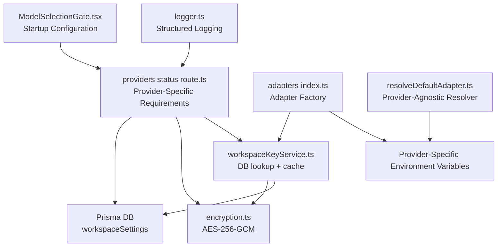

**Diagram sources**
- [ModelSelectionGate.tsx:85-118](file://components/ModelSelectionGate.tsx#L85-L118)
- [providers status route.ts:137-223](file://app/api/providers/status/route.ts#L137-L223)
- [workspaceKeyService.ts:32-95](file://lib/security/workspaceKeyService.ts#L32-L95)
- [encryption.ts:27-68](file://lib/security/encryption.ts#L27-L68)
- [adapters index.ts:223-291](file://lib/ai/adapters/index.ts#L223-L291)
- [resolveDefaultAdapter.ts:58-206](file://lib/ai/resolveDefaultAdapter.ts#L58-L206)
- [logger.ts:23-88](file://lib/logger.ts#L23-L88)

**Section sources**
- [ModelSelectionGate.tsx:85-118](file://components/ModelSelectionGate.tsx#L85-L118)
- [providers status route.ts:137-223](file://app/api/providers/status/route.ts#L137-L223)
- [workspaceKeyService.ts:32-95](file://lib/security/workspaceKeyService.ts#L32-L95)
- [encryption.ts:27-68](file://lib/security/encryption.ts#L27-L68)
- [adapters index.ts:223-291](file://lib/ai/adapters/index.ts#L223-L291)
- [resolveDefaultAdapter.ts:58-206](file://lib/ai/resolveDefaultAdapter.ts#L58-L206)
- [logger.ts:23-88](file://lib/logger.ts#L23-L88)

## Core Components
- Workspace Key Service: Retrieves and caches decrypted API keys per workspace/provider, with a global fallback for default workspace contexts.
- Encryption Service: Provides AES-256-GCM encryption/decryption for API keys at rest, with robust startup validation and fallback behavior.
- Enhanced Provider Status Detection: Performs comprehensive credential detection with provider-specific requirements, supporting dedicated environment variables for each provider.
- Model Selection Gate: A guided startup component that allows users to configure provider credentials through a streamlined interface during initialization.
- Adapter Factory: Resolves credentials server-side via workspaceKeyService and environment variables with dedicated provider keys, throwing ConfigurationError on missing keys, and returning UnconfiguredAdapter for graceful degradation.
- Provider-Agnostic Resolver: Handles provider-specific environment variable resolution for different purposes (intent, generation, etc.).
- Unconfigured Adapter: A fallback socket adapter used when no API keys are present, providing graceful degradation with helpful user guidance.

**Updated** Enhanced adapter factory and provider-agnostic resolver to enforce dedicated environment variable requirements for each provider. The provider status detection now includes comprehensive debugging information for troubleshooting credential resolution issues with provider-specific configuration requirements.

**Section sources**
- [workspaceKeyService.ts:32-137](file://lib/security/workspaceKeyService.ts#L32-L137)
- [encryption.ts:27-68](file://lib/security/encryption.ts#L27-L68)
- [providers status route.ts:137-223](file://app/api/providers/status/route.ts#L137-L223)
- [ModelSelectionGate.tsx:85-118](file://components/ModelSelectionGate.tsx#L85-L118)
- [adapters index.ts:223-291](file://lib/ai/adapters/index.ts#L223-L291)
- [resolveDefaultAdapter.ts:58-206](file://lib/ai/resolveDefaultAdapter.ts#L58-L206)
- [unconfigured.ts:13-99](file://lib/ai/adapters/unconfigured.ts#L13-L99)

## Architecture Overview
The system enforces a strict server-only credential resolution policy with enhanced security measures and comprehensive debugging capabilities. The UI never receives or stores real API keys; all sensitive data is encrypted at rest and handled server-side. Configuration occurs only during startup through the ModelSelectionGate component, with dedicated environment variables providing a streamlined fallback option for each provider.

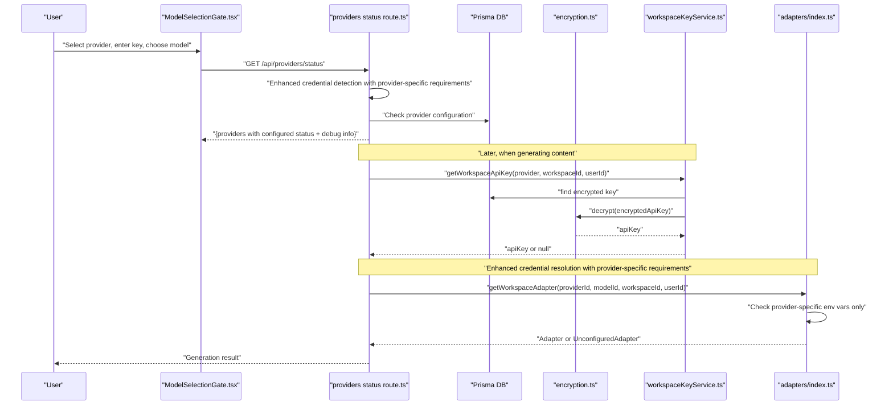

**Diagram sources**
- [ModelSelectionGate.tsx:93-118](file://components/ModelSelectionGate.tsx#L93-L118)
- [providers status route.ts:137-223](file://app/api/providers/status/route.ts#L137-L223)
- [workspaceKeyService.ts:32-95](file://lib/security/workspaceKeyService.ts#L32-L95)
- [encryption.ts:27-68](file://lib/security/encryption.ts#L27-L68)
- [adapters index.ts:262-290](file://lib/ai/adapters/index.ts#L262-L290)

## Detailed Component Analysis

### Enhanced Credential Resolution Hierarchy with Provider-Specific Requirements
The adapter factory implements a strict, layered resolution order with enhanced security measures for provider-specific environment variables:

1. Workspace-specific key lookup via workspaceKeyService.
2. Environment variable fallback for the specific provider using dedicated environment variables.
3. Provider-specific environment variable fallbacks.
4. **Removed** Universal LLM_KEY fallback with explicit provider requirement.
5. Graceful degradation via UnconfiguredAdapter if no credentials are found.

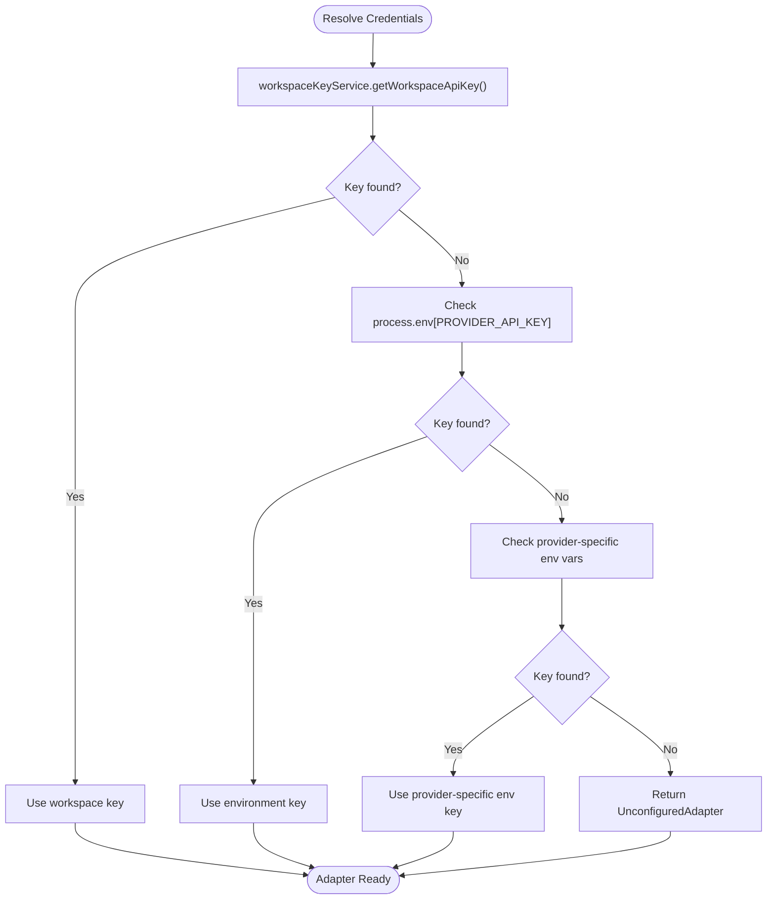

**Diagram sources**
- [adapters index.ts:223-291](file://lib/ai/adapters/index.ts#L223-L291)
- [workspaceKeyService.ts:32-95](file://lib/security/workspaceKeyService.ts#L32-L95)
- [resolveDefaultAdapter.ts:188-206](file://lib/ai/resolveDefaultAdapter.ts#L188-L206)

**Section sources**
- [adapters index.ts:223-291](file://lib/ai/adapters/index.ts#L223-L291)

### Enhanced Provider Status Detection with Provider-Specific Requirements
The provider status endpoint now includes comprehensive credential detection logic with provider-specific requirements to support dedicated environment variables for each provider and enhanced debugging.

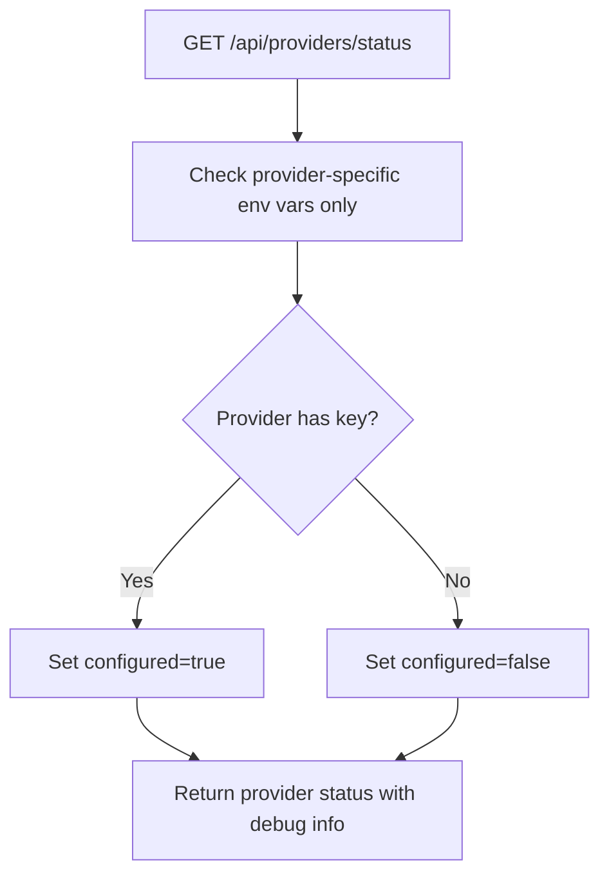

**Diagram sources**
- [providers status route.ts:137-223](file://app/api/providers/status/route.ts#L137-L223)

**Section sources**
- [providers status route.ts:137-223](file://app/api/providers/status/route.ts#L137-L223)

### Enhanced Security Measures for Provider-Specific Configuration
The system now includes comprehensive security measures to prevent unauthorized credential usage with provider-specific requirements:

- **Dedicated Environment Variables**: Each provider now requires its own dedicated environment variable:
  - OpenAI: `OPENAI_API_KEY=gsk_...` or `OPENAI_API_KEY=sk-...`
  - Anthropic: `ANTHROPIC_API_KEY=sk-ant-...` or `ANTHROPIC_API_KEY=sk-ant-api...`
  - Google: `GOOGLE_API_KEY=AIzaSy...` or `GEMINI_API_KEY=AIzaSy...`
  - Groq: `GROQ_API_KEY=gsk_...` or `GROQ_API_KEY=gsk_live_...`
  - Ollama: `OLLAMA_API_KEY=your_ollama_key_here` with `OLLAMA_BASE_URL=https://your-ollama-cloud-instance.com/v1`
- **Provider Validation**: The system strictly validates that environment variables match the specific provider requirements to prevent unauthorized usage across different providers.
- **Enhanced Debugging**: Comprehensive logging shows which providers have dedicated environment variables configured.
- **Prevention of Unauthorized Usage**: Dedicated environment variables are never used as credentials for unrelated providers.
- **Clear Error Messaging**: When environment variables are missing, the system provides clear guidance on how to configure provider-specific keys.

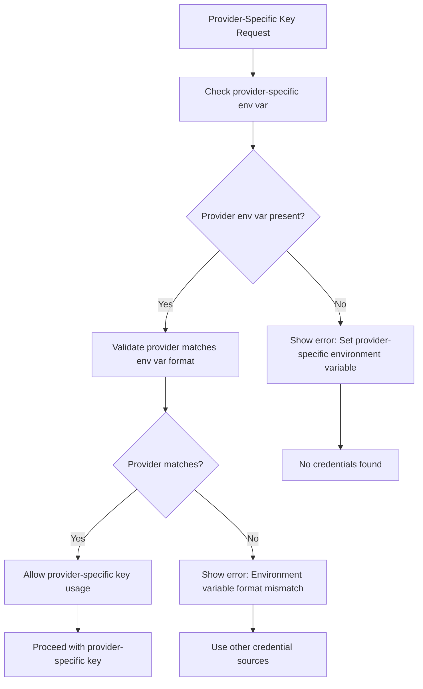

**Diagram sources**
- [adapters index.ts:262-280](file://lib/ai/adapters/index.ts#L262-L280)
- [resolveDefaultAdapter.ts:87-101](file://lib/ai/resolveDefaultAdapter.ts#L87-L101)

**Section sources**
- [adapters index.ts:262-280](file://lib/ai/adapters/index.ts#L262-L280)
- [resolveDefaultAdapter.ts:87-101](file://lib/ai/resolveDefaultAdapter.ts#L87-L101)

### Provider-Agnostic Resolver with Provider-Specific Requirements
The resolveDefaultAdapter module provides a provider-agnostic way to handle environment variable resolution across different purposes (intent, generation, etc.) with provider-specific environment variable requirements.

**Updated** The resolveDefaultAdapter module now enforces provider-specific environment variable requirements, checking for dedicated environment variables for each provider in priority order.

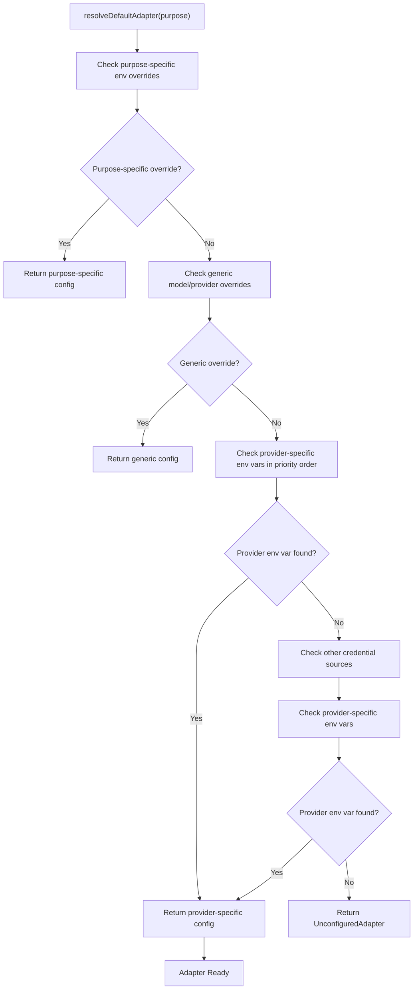

**Diagram sources**
- [resolveDefaultAdapter.ts:116-181](file://lib/ai/resolveDefaultAdapter.ts#L116-L181)

**Section sources**
- [resolveDefaultAdapter.ts:116-181](file://lib/ai/resolveDefaultAdapter.ts#L116-L181)

### Enhanced Provider-Specific Configuration Logic
The system now includes sophisticated provider-specific configuration logic that enforces dedicated environment variable requirements:

- **Provider-Specific Environment Variables**: Users must set dedicated environment variables for each provider:
  - OpenAI: `OPENAI_API_KEY` with keys starting with 'gsk_' or 'sk-'
  - Anthropic: `ANTHROPIC_API_KEY` with keys starting with 'sk-ant-' or 'sk-ant-api...'
  - Google: `GOOGLE_API_KEY` or `GEMINI_API_KEY` with keys starting with 'AIzaSy'
  - Groq: `GROQ_API_KEY` with keys starting with 'gsk_' or 'gsk_live_'
  - Ollama: `OLLAMA_API_KEY` with `OLLAMA_BASE_URL` for cloud-hosted instances
- **Enhanced Fallback Behavior**: If provider-specific environment variables are missing, the system provides clear error messages with configuration guidance
- **Comprehensive Logging**: Detailed console logging shows successful provider validation and warnings for missing environment variables
- **Debug Information**: Enhanced logging displays provider-specific environment variable requirements and validation results to aid troubleshooting

**Updated** The main adapter factory now enforces provider-specific environment variable requirements, while the resolveDefaultAdapter module maintains provider-specific resolution capabilities for backward compatibility.

**Section sources**
- [resolveDefaultAdapter.ts:73-88](file://lib/ai/resolveDefaultAdapter.ts#L73-L88)
- [resolveDefaultAdapter.ts:90-105](file://lib/ai/resolveDefaultAdapter.ts#L90-L105)

### WorkspaceKeyService Integration
- Authorization: Validates user membership for non-default workspaces before retrieving keys.
- Caching: Uses an in-memory TTL map keyed by "workspaceId:provider" to avoid repeated DB lookups.
- Global Fallback: For default workspace context, scans all workspaces to find the first real key for a provider.
- Cache Invalidation: Immediately invalidates cache entries on save/delete to ensure fresh credentials on next request.

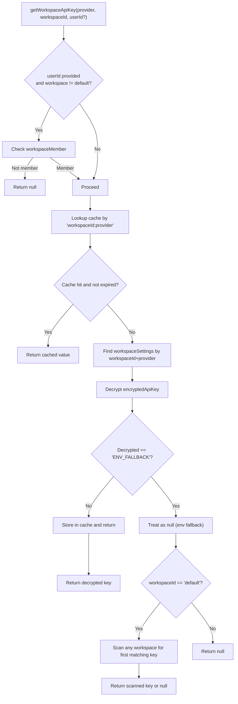

**Diagram sources**
- [workspaceKeyService.ts:32-95](file://lib/security/workspaceKeyService.ts#L32-L95)

**Section sources**
- [workspaceKeyService.ts:32-137](file://lib/security/workspaceKeyService.ts#L32-L137)

### Encryption Service and Secure Storage
- AES-256-GCM encryption with random IV and authentication tag.
- Supports base64-encoded or raw 32-byte ENCRYPTION_SECRET; falls back to a deterministic hash derived from environment variables at startup.
- Startup validation warns if the secret is missing but does not crash builds; runtime encryption/decryption will safely fail with a 500 error.
- Keys are stored in the database as encryptedApiKey and never exposed to the client.

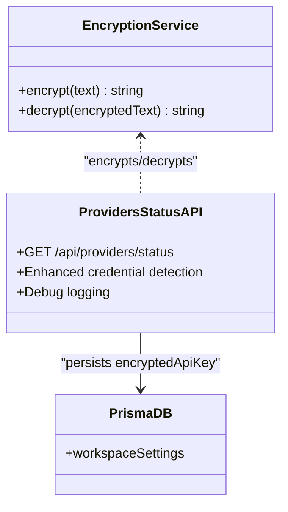

**Diagram sources**
- [encryption.ts:27-68](file://lib/security/encryption.ts#L27-L68)
- [providers status route.ts:137-223](file://app/api/providers/status/route.ts#L137-L223)

**Section sources**
- [encryption.ts:27-95](file://lib/security/encryption.ts#L27-L95)
- [providers status route.ts:137-223](file://app/api/providers/status/route.ts#L137-L223)

### Model Selection Gate Functionality
- Provider Selection: Guides users through a streamlined two-step process (Provider → Confirm) during startup.
- Key Handling: Never stores real keys client-side; sends keys securely to the server for encryption and persistence.
- Provider Discovery: Automatically discovers configured providers from environment variables, including those using dedicated provider-specific environment variables.
- Model Selection: Allows users to select from available models for the chosen provider.
- Persistence: Saves encrypted keys to the database and marks the session as active.

**Updated** Enhanced provider discovery to include dedicated environment variable configuration, eliminating universal key configuration and requiring provider-specific environment variables for each provider.

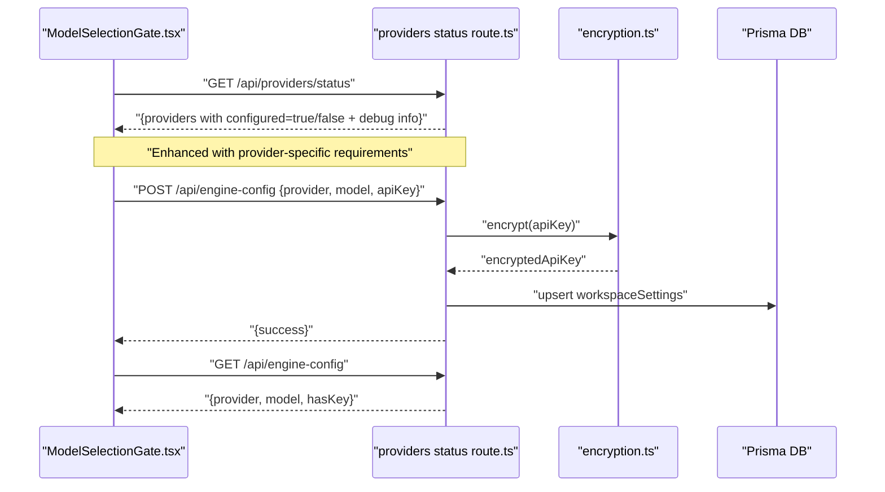

**Diagram sources**
- [ModelSelectionGate.tsx:93-118](file://components/ModelSelectionGate.tsx#L93-L118)
- [providers status route.ts:137-223](file://app/api/providers/status/route.ts#L137-L223)

**Section sources**
- [ModelSelectionGate.tsx:85-118](file://components/ModelSelectionGate.tsx#L85-L118)
- [providers status route.ts:137-223](file://app/api/providers/status/route.ts#L137-L223)

### Configuration Error Handling and User Surfacing
- ConfigurationError is thrown when no credentials are available for a named provider, ensuring clear user-facing guidance.
- The adapter factory returns UnconfiguredAdapter when no credentials are found, enabling graceful degradation with helpful UI messaging.
- The API layer surfaces errors as JSON responses with appropriate HTTP status codes.
- Enhanced logging provides detailed debugging information for troubleshooting credential resolution issues, including provider-specific environment variable validation.

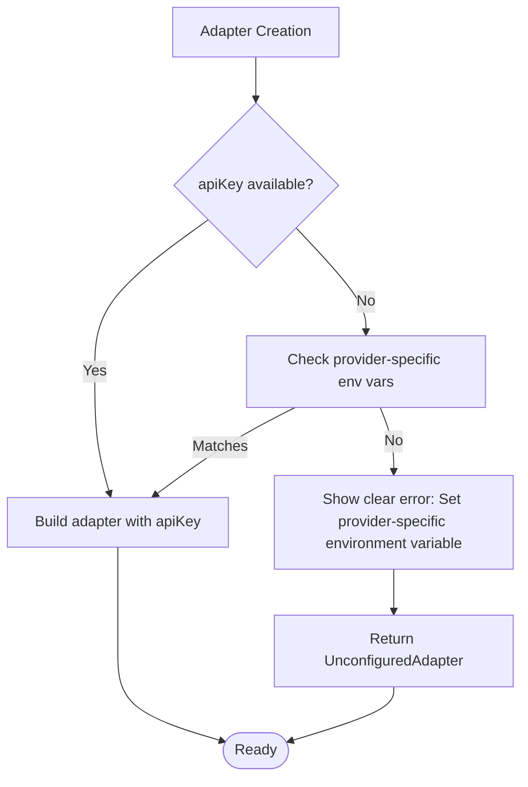

**Diagram sources**
- [adapters index.ts:28-40](file://lib/ai/adapters/index.ts#L28-L40)
- [adapters index.ts:288-291](file://lib/ai/adapters/index.ts#L288-L291)

**Section sources**
- [adapters index.ts:28-40](file://lib/ai/adapters/index.ts#L28-L40)
- [adapters index.ts:288-291](file://lib/ai/adapters/index.ts#L288-L291)

### Security Measures Against Client-Side Credential Injection
- Server-only execution: The adapters and credential resolution run server-side; the UI never receives or logs real keys.
- Strict input validation: The UI masks keys, disables autocomplete, and avoids storing real keys in localStorage.
- Encrypted at rest: Keys are encrypted before being persisted to the database.
- Minimal exposure: The UI only stores non-sensitive display metadata locally.
- **Removed** Universal LLM_KEY usage with explicit provider requirements.
- Comprehensive logging: Detailed debug information helps identify credential resolution issues without exposing sensitive data.

**Updated** The system now enforces provider-specific environment variable requirements, significantly strengthening security measures against unauthorized credential usage across providers.

**Section sources**
- [ModelSelectionGate.tsx:126-156](file://components/ModelSelectionGate.tsx#L126-L156)
- [providers status route.ts:149-154](file://app/api/providers/status/route.ts#L149-L154)
- [encryption.ts:27-68](file://lib/security/encryption.ts#L27-L68)
- [adapters index.ts:262-280](file://lib/ai/adapters/index.ts#L262-L280)

## Dependency Analysis
The following diagram highlights the key dependencies among components involved in configuration and authentication, including the enhanced provider-specific environment variable handling.

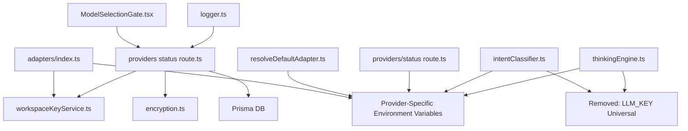

**Diagram sources**
- [adapters index.ts:223-291](file://lib/ai/adapters/index.ts#L223-L291)
- [workspaceKeyService.ts:32-95](file://lib/security/workspaceKeyService.ts#L32-L95)
- [providers status route.ts:137-223](file://app/api/providers/status/route.ts#L137-L223)
- [ModelSelectionGate.tsx:93-118](file://components/ModelSelectionGate.tsx#L93-L118)
- [resolveDefaultAdapter.ts:58-206](file://lib/ai/resolveDefaultAdapter.ts#L58-L206)
- [logger.ts:23-88](file://lib/logger.ts#L23-L88)

**Section sources**
- [adapters index.ts:223-291](file://lib/ai/adapters/index.ts#L223-L291)
- [workspaceKeyService.ts:32-95](file://lib/security/workspaceKeyService.ts#L32-L95)
- [providers status route.ts:137-223](file://app/api/providers/status/route.ts#L137-L223)
- [ModelSelectionGate.tsx:93-118](file://components/ModelSelectionGate.tsx#L93-L118)
- [resolveDefaultAdapter.ts:58-206](file://lib/ai/resolveDefaultAdapter.ts#L58-L206)
- [logger.ts:23-88](file://lib/logger.ts#L23-L88)

## Performance Considerations
- Caching: workspaceKeyService caches decrypted keys with a 5-minute TTL to reduce database and decryption overhead.
- Batch invalidation: Deleting engine configuration invalidates cache entries for all providers in a workspace to ensure immediate freshness.
- Request timeout: The engine-config route sets a maximum execution duration to bound request latency.
- Model discovery: The UI fetches model lists on demand and supports search to minimize unnecessary network traffic.
- **Removed** Universal key optimization: The universal LLM_KEY fallback system has been removed, eliminating any overhead associated with universal key validation.
- Enhanced logging: Debug information is only logged in development mode to minimize performance impact in production.
- **Removed** Universal provider validation: Key format validation for universal keys has been removed, avoiding unnecessary processing.

**Section sources**
- [workspaceKeyService.ts:11-24](file://lib/security/workspaceKeyService.ts#L11-L24)
- [workspaceKeyService.ts:100-106](file://lib/security/workspaceKeyService.ts#L100-L106)
- [providers status route.ts:137-139](file://app/api/providers/status/route.ts#L137-L139)
- [ModelSelectionGate.tsx:93-118](file://components/ModelSelectionGate.tsx#L93-L118)

## Troubleshooting Guide
Common issues and resolutions with enhanced guidance for provider-specific key configuration:

- Missing provider key
  - Symptom: ConfigurationError thrown or UnconfiguredAdapter returned.
  - Action: Use the ModelSelectionGate component to add a key during startup, or set the appropriate provider-specific environment variable. Remove any universal LLM_KEY configuration and use dedicated environment variables for each provider.
  - Reference: [adapters index.ts:288-291](file://lib/ai/adapters/index.ts#L288-L291)
- Key not persisting
  - Symptom: Key disappears after reload.
  - Action: Verify encryption secret is configured; confirm POST to /api/engine-config succeeds; check cache invalidation on save.
  - References: [providers status route.ts:137-139](file://app/api/providers/status/route.ts#L137-L139), [encryption.ts:81-94](file://lib/security/encryption.ts#L81-L94)
- Incorrect provider configuration
  - Symptom: Provider shows as unconfigured despite having environment variables set.
  - Action: Verify the correct provider-specific environment variable is set (e.g., OPENAI_API_KEY for OpenAI, ANTHROPIC_API_KEY for Anthropic). Check console logs for provider-specific environment variable validation results.
  - Reference: [ModelSelectionGate.tsx:120-124](file://components/ModelSelectionGate.tsx#L120-L124)
- Connectivity test fails
  - Symptom: Connection status shows failure.
  - Action: Confirm key validity and network access; test against the provider's documented base URL.
  - Reference: [ModelSelectionGate.tsx:126-156](file://components/ModelSelectionGate.tsx#L126-L156)
- Environment variable fallback not applied
  - Symptom: Keys not used despite being set in environment.
  - Action: Ensure the environment variable name matches the provider (e.g., OPENAI_API_KEY, ANTHROPIC_API_KEY); verify workspace-specific keys take precedence over provider-specific keys; ensure dedicated environment variables are set for each provider.
  - Reference: [adapters index.ts:242-260](file://lib/ai/adapters/index.ts#L242-L260)
- **Removed** Universal LLM_KEY not working
  - Symptom: Universal key configuration no longer works.
  - Action: Remove LLM_KEY environment variable and set dedicated environment variables for each provider (OPENAI_API_KEY, ANTHROPIC_API_KEY, GOOGLE_API_KEY, GROQ_API_KEY, OLLAMA_API_KEY).
  - Reference: [adapters index.ts:262-280](file://lib/ai/adapters/index.ts#L262-L280)
- **Removed** LLM_KEY provider requirement
  - Symptom: Universal key configuration no longer requires provider specification.
  - Action: Remove LLM_KEY environment variable and set dedicated environment variables for each provider.
  - Reference: [adapters index.ts:262-280](file://lib/ai/adapters/index.ts#L262-L280)
- **Removed** LLM_KEY format validation
  - Symptom: Universal key format validation no longer applies.
  - Action: Remove LLM_KEY environment variable and set dedicated environment variables for each provider with correct key formats.
  - Reference: [adapters index.ts:262-280](file://lib/ai/adapters/index.ts#L262-L280)
- Enhanced debugging information
  - Symptom: Need more detailed information about credential resolution.
  - Action: Check server logs for comprehensive debug information including available environment variables, provider configuration status, provider-specific environment variable validation results, and credential detection outcomes.
  - Reference: [providers status route.ts:149-154](file://app/api/providers/status/route.ts#L149-L154)
- Managing multiple provider keys across workspaces
  - Best practice: Configure workspace-specific keys for isolation; rely on dedicated environment variables for shared defaults; use provider-specific environment variables for each provider; leverage provider status detection to see which providers are configured.
  - Reference: [workspaceKeyService.ts:74-87](file://lib/security/workspaceKeyService.ts#L74-L87)
  - Reference: [providers status route.ts:201-202](file://app/api/providers/status/route.ts#L201-L202)
- Enhanced environment variable handling
  - Symptom: API key configuration issues with unclear error messages.
  - Action: Check that environment variables are properly formatted and match expected patterns for each provider; verify dedicated environment variables are set for each provider; use provider-specific configuration for all key setups.
  - Reference: [providers status route.ts:149-154](file://app/api/providers/status/route.ts#L149-L154)
  - Reference: [resolveDefaultAdapter.ts:87-101](file://lib/ai/resolveDefaultAdapter.ts#L87-L101)
- **Removed** Universal provider requirement enforcement
  - Symptom: Universal key configuration no longer enforces provider requirements.
  - Action: Remove LLM_KEY environment variable and set dedicated environment variables for each provider.
  - Reference: [resolveDefaultAdapter.ts:73-88](file://lib/ai/resolveDefaultAdapter.ts#L73-L88)

**Updated** Removed all troubleshooting guidance related to the Universal LLM_KEY system. Added troubleshooting guidance for the new provider-specific environment variable system with enhanced error messaging for missing provider-specific keys. Enhanced existing troubleshooting steps to reflect the expanded credential resolution hierarchy with security measures and comprehensive debugging capabilities.

**Section sources**
- [adapters index.ts:288-291](file://lib/ai/adapters/index.ts#L288-L291)
- [providers status route.ts:137-139](file://app/api/providers/status/route.ts#L137-L139)
- [encryption.ts:81-94](file://lib/security/encryption.ts#L81-L94)
- [ModelSelectionGate.tsx:120-124](file://components/ModelSelectionGate.tsx#L120-L124)
- [ModelSelectionGate.tsx:126-156](file://components/ModelSelectionGate.tsx#L126-L156)
- [adapters index.ts:242-260](file://lib/ai/adapters/index.ts#L242-L260)
- [workspaceKeyService.ts:74-87](file://lib/security/workspaceKeyService.ts#L74-L87)
- [providers status route.ts:201-202](file://app/api/providers/status/route.ts#L201-L202)
- [adapters index.ts:262-280](file://lib/ai/adapters/index.ts#L262-L280)
- [resolveDefaultAdapter.ts:87-101](file://lib/ai/resolveDefaultAdapter.ts#L87-L101)
- [providers status route.ts:149-154](file://app/api/providers/status/route.ts#L149-L154)

## Conclusion
The system enforces a secure, streamlined approach to AI provider configuration and authentication with enhanced security measures for provider-specific environment variables and comprehensive debugging capabilities. The removed Universal LLM_KEY system eliminated automatic provider detection while maintaining strict security measures to prevent unauthorized credential usage across providers. By resolving credentials server-side, encrypting keys at rest, and surfacing clear configuration errors, it ensures safety and usability. The ModelSelectionGate component provides a guided, user-friendly interface for managing provider credentials during startup, while the adapter factory and workspace key service maintain strict separation of concerns and robust fallback behavior. The enhanced backend provider status checking with comprehensive debugging information significantly improves troubleshooting capabilities and credential resolution transparency. This enhanced approach reduces complexity while maintaining security and reliability, with comprehensive logging and validation to prevent unauthorized credential usage across providers.

**Updated** The system now includes enhanced security measures for provider-specific environment variable handling, eliminating the Universal LLM_KEY system. The enhanced backend provider status checking with comprehensive debugging capabilities provides detailed insights into credential resolution issues, including provider-specific environment variable validation results, making troubleshooting significantly easier while maintaining backward compatibility and providing clear debugging information for troubleshooting. The refined environment variable handling offers better validation and clearer error messages for API key configuration problems, improving the overall user experience and system reliability.