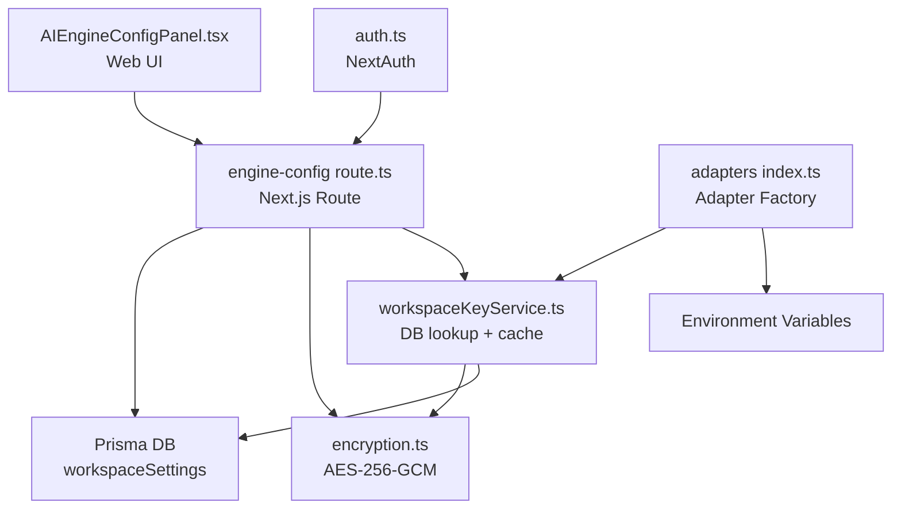
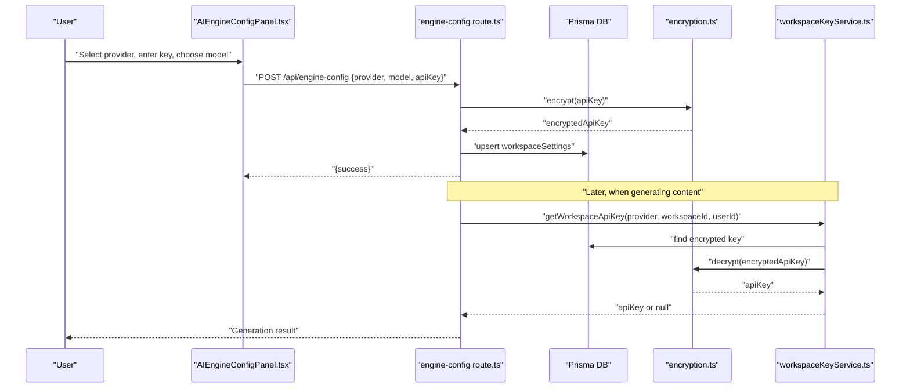
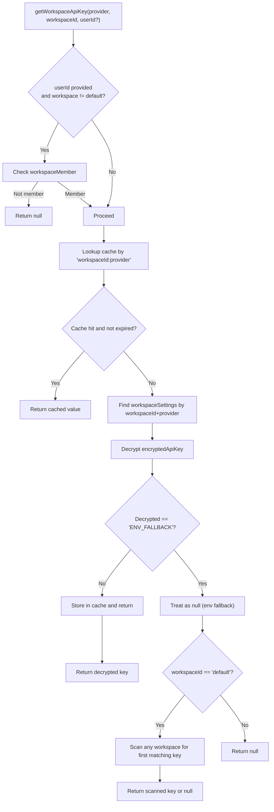
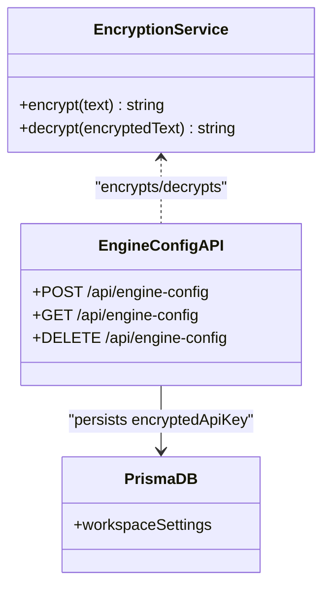
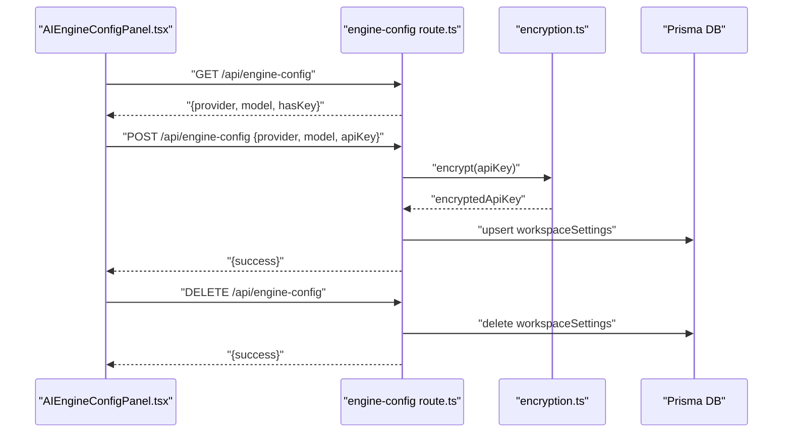
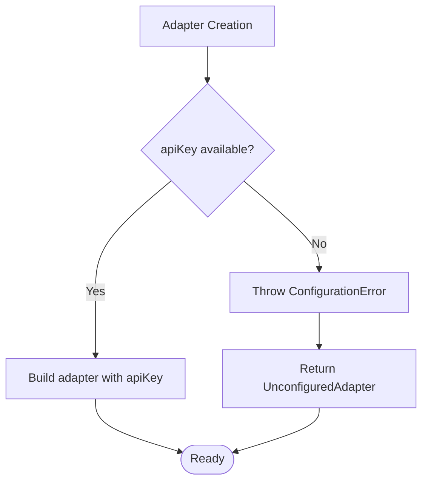
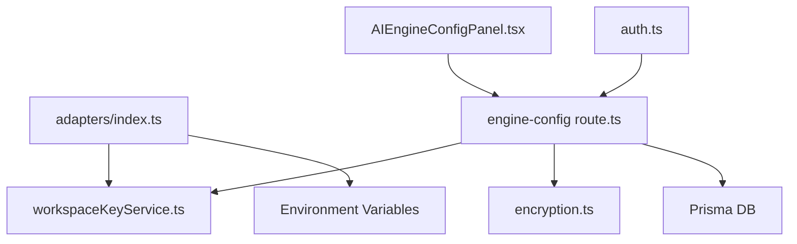

# Configuration & Authentication Management

<cite>
**Referenced Files in This Document**
- [workspaceKeyService.ts](file://lib/security/workspaceKeyService.ts)
- [encryption.ts](file://lib/security/encryption.ts)
- [engine-config route.ts](file://app/api/engine-config/route.ts)
- [AIEngineConfigPanel.tsx](file://components/AIEngineConfigPanel.tsx)
- [adapters index.ts](file://lib/ai/adapters/index.ts)
- [auth.ts](file://lib/auth.ts)
- [workspaceKeyService.test.ts](file://__tests__/workspaceKeyService.test.ts)
- [encryption.test.ts](file://__tests__/encryption.test.ts)
</cite>

## Table of Contents
1. [Introduction](#introduction)
2. [Project Structure](#project-structure)
3. [Core Components](#core-components)
4. [Architecture Overview](#architecture-overview)
5. [Detailed Component Analysis](#detailed-component-analysis)
6. [Dependency Analysis](#dependency-analysis)
7. [Performance Considerations](#performance-considerations)
8. [Troubleshooting Guide](#troubleshooting-guide)
9. [Conclusion](#conclusion)

## Introduction
This document explains how the AI provider configuration and authentication management system is designed and operated. It covers the credential resolution hierarchy (workspace-specific keys, environment variables, and graceful fallbacks), the secure storage and retrieval of encrypted credentials, the configuration error handling mechanism, and the AI Engine Config panel that allows users to configure provider credentials through the web interface. It also details the security measures that prevent client-side credential injection, including server-only execution and validation processes, and provides practical guidance for setting up configurations, troubleshooting common issues, and managing multiple provider keys across workspaces.

## Project Structure
The configuration and authentication system spans several layers:
- Web UI: The AI Engine Config panel collects provider, model, and optional API key inputs from users.
- API Layer: The engine-config route persists encrypted keys to the database and serves non-sensitive configuration.
- Security Services: Encryption and workspace key services manage secure storage and retrieval.
- Adapter Layer: Adapters resolve credentials server-side and enforce strict validation.

**Diagram sources**
- [AIEngineConfigPanel.tsx:194-443](file://components/AIEngineConfigPanel.tsx#L194-L443)
- [engine-config route.ts:36-153](file://app/api/engine-config/route.ts#L36-L153)
- [workspaceKeyService.ts:32-95](file://lib/security/workspaceKeyService.ts#L32-L95)
- [encryption.ts:27-68](file://lib/security/encryption.ts#L27-L68)
- [adapters index.ts:236-278](file://lib/ai/adapters/index.ts#L236-L278)
- [auth.ts:11-86](file://lib/auth.ts#L11-L86)

**Section sources**
- [AIEngineConfigPanel.tsx:194-443](file://components/AIEngineConfigPanel.tsx#L194-L443)
- [engine-config route.ts:36-153](file://app/api/engine-config/route.ts#L36-L153)
- [workspaceKeyService.ts:32-95](file://lib/security/workspaceKeyService.ts#L32-L95)
- [encryption.ts:27-68](file://lib/security/encryption.ts#L27-L68)
- [adapters index.ts:236-278](file://lib/ai/adapters/index.ts#L236-L278)
- [auth.ts:11-86](file://lib/auth.ts#L11-L86)

## Core Components
- Workspace Key Service: Retrieves and caches decrypted API keys per workspace/provider, with a global fallback for default workspace contexts.
- Encryption Service: Provides AES-256-GCM encryption/decryption for API keys at rest, with robust startup validation and fallback behavior.
- Engine Config API: Persists encrypted keys to the database, returns non-sensitive configuration to the UI, and invalidates caches upon changes.
- AI Engine Config Panel: A guided UI for selecting providers, entering credentials, testing connectivity, choosing models, and saving configuration.
- Adapter Factory: Resolves credentials server-side via workspaceKeyService or environment variables, throws ConfigurationError on missing keys, and returns UnconfiguredAdapter for graceful degradation.

**Section sources**
- [workspaceKeyService.ts:32-137](file://lib/security/workspaceKeyService.ts#L32-L137)
- [encryption.ts:27-68](file://lib/security/encryption.ts#L27-L68)
- [engine-config route.ts:36-153](file://app/api/engine-config/route.ts#L36-L153)
- [AIEngineConfigPanel.tsx:194-443](file://components/AIEngineConfigPanel.tsx#L194-L443)
- [adapters index.ts:28-278](file://lib/ai/adapters/index.ts#L28-L278)

## Architecture Overview
The system enforces a strict server-only credential resolution policy. The UI never receives or stores real API keys; all sensitive data is encrypted at rest and handled server-side.

**Diagram sources**
- [AIEngineConfigPanel.tsx:358-420](file://components/AIEngineConfigPanel.tsx#L358-L420)
- [engine-config route.ts:69-127](file://app/api/engine-config/route.ts#L69-L127)
- [workspaceKeyService.ts:32-95](file://lib/security/workspaceKeyService.ts#L32-L95)
- [encryption.ts:27-68](file://lib/security/encryption.ts#L27-L68)

## Detailed Component Analysis

### Credential Resolution Hierarchy
The adapter factory implements a strict, layered resolution order:
1. Workspace-specific key lookup via workspaceKeyService.
2. Environment variable fallback for the provider.
3. Provider-specific environment variable fallbacks.
4. Graceful degradation via UnconfiguredAdapter if no credentials are found.

**Diagram sources**
- [adapters index.ts:236-278](file://lib/ai/adapters/index.ts#L236-L278)
- [workspaceKeyService.ts:32-95](file://lib/security/workspaceKeyService.ts#L32-L95)

**Section sources**
- [adapters index.ts:224-278](file://lib/ai/adapters/index.ts#L224-L278)

### WorkspaceKeyService Integration
- Authorization: Validates user membership for non-default workspaces before retrieving keys.
- Caching: Uses an in-memory TTL map keyed by "workspaceId:provider" to avoid repeated DB lookups.
- Global Fallback: For default workspace context, scans all workspaces to find the first real key for a provider.
- Cache Invalidation: Immediately invalidates cache entries on save/delete to ensure fresh credentials on next request.

**Diagram sources**
- [workspaceKeyService.ts:32-95](file://lib/security/workspaceKeyService.ts#L32-L95)

**Section sources**
- [workspaceKeyService.ts:32-137](file://lib/security/workspaceKeyService.ts#L32-L137)

### Encryption Service and Secure Storage
- AES-256-GCM encryption with random IV and authentication tag.
- Supports base64-encoded or raw 32-byte ENCRYPTION_SECRET; falls back to a deterministic hash derived from environment variables at startup.
- Startup validation warns if the secret is missing but does not crash builds; runtime encryption/decryption will safely fail with a 500 error.
- Keys are stored in the database as encryptedApiKey and never exposed to the client.

**Diagram sources**
- [encryption.ts:27-68](file://lib/security/encryption.ts#L27-L68)
- [engine-config route.ts:69-127](file://app/api/engine-config/route.ts#L69-L127)

**Section sources**
- [encryption.ts:27-95](file://lib/security/encryption.ts#L27-L95)
- [engine-config route.ts:69-127](file://app/api/engine-config/route.ts#L69-L127)

### AI Engine Config Panel Functionality
- Provider Selection: Guides users through a 3-step wizard (Provider → Credentials → Model).
- Key Handling: Never stores real keys client-side; sends keys securely to the server for encryption and persistence.
- Connectivity Testing: Optionally tests the key against the provider’s /models endpoint over HTTPS.
- Model Discovery: Fetches provider model lists and supports manual model entry.
- Persistence: Saves encrypted keys to the database and updates local display state.

**Diagram sources**
- [AIEngineConfigPanel.tsx:267-300](file://components/AIEngineConfigPanel.tsx#L267-L300)
- [AIEngineConfigPanel.tsx:358-420](file://components/AIEngineConfigPanel.tsx#L358-L420)
- [engine-config route.ts:36-153](file://app/api/engine-config/route.ts#L36-L153)

**Section sources**
- [AIEngineConfigPanel.tsx:194-443](file://components/AIEngineConfigPanel.tsx#L194-L443)
- [engine-config route.ts:36-153](file://app/api/engine-config/route.ts#L36-L153)

### Configuration Error Handling and User Surfacing
- ConfigurationError is thrown when no credentials are available for a named provider, ensuring clear user-facing guidance.
- The adapter factory returns UnconfiguredAdapter when no credentials are found, enabling graceful degradation with helpful UI messaging.
- The API layer surfaces errors as JSON responses with appropriate HTTP status codes.

**Diagram sources**
- [adapters index.ts:28-40](file://lib/ai/adapters/index.ts#L28-L40)
- [adapters index.ts:146-215](file://lib/ai/adapters/index.ts#L146-L215)

**Section sources**
- [adapters index.ts:28-40](file://lib/ai/adapters/index.ts#L28-L40)
- [adapters index.ts:146-215](file://lib/ai/adapters/index.ts#L146-L215)

### Security Measures Against Client-Side Credential Injection
- Server-only execution: The adapters and credential resolution run server-side; the UI never receives or logs real keys.
- Strict input validation: The UI masks keys, disables autocomplete, and avoids storing real keys in localStorage.
- Encrypted at rest: Keys are encrypted before being persisted to the database.
- Minimal exposure: The UI only stores non-sensitive display metadata locally.

**Section sources**
- [AIEngineConfigPanel.tsx:395-410](file://components/AIEngineConfigPanel.tsx#L395-L410)
- [engine-config route.ts:89-93](file://app/api/engine-config/route.ts#L89-L93)
- [encryption.ts:27-68](file://lib/security/encryption.ts#L27-L68)

## Dependency Analysis
The following diagram highlights the key dependencies among components involved in configuration and authentication.

**Diagram sources**
- [adapters index.ts:236-278](file://lib/ai/adapters/index.ts#L236-L278)
- [workspaceKeyService.ts:32-95](file://lib/security/workspaceKeyService.ts#L32-L95)
- [engine-config route.ts:69-127](file://app/api/engine-config/route.ts#L69-L127)
- [AIEngineConfigPanel.tsx:358-420](file://components/AIEngineConfigPanel.tsx#L358-L420)
- [auth.ts:11-86](file://lib/auth.ts#L11-L86)

**Section sources**
- [adapters index.ts:236-278](file://lib/ai/adapters/index.ts#L236-L278)
- [workspaceKeyService.ts:32-95](file://lib/security/workspaceKeyService.ts#L32-L95)
- [engine-config route.ts:69-127](file://app/api/engine-config/route.ts#L69-L127)
- [AIEngineConfigPanel.tsx:358-420](file://components/AIEngineConfigPanel.tsx#L358-L420)
- [auth.ts:11-86](file://lib/auth.ts#L11-L86)

## Performance Considerations
- Caching: workspaceKeyService caches decrypted keys with a 5-minute TTL to reduce database and decryption overhead.
- Batch invalidation: Deleting engine configuration invalidates cache entries for all providers in a workspace to ensure immediate freshness.
- Request timeout: The engine-config route sets a maximum execution duration to bound request latency.
- Model discovery: The UI fetches model lists on demand and supports search to minimize unnecessary network traffic.

**Section sources**
- [workspaceKeyService.ts:11-24](file://lib/security/workspaceKeyService.ts#L11-L24)
- [workspaceKeyService.ts:100-106](file://lib/security/workspaceKeyService.ts#L100-L106)
- [engine-config route.ts:18-32](file://app/api/engine-config/route.ts#L18-L32)
- [AIEngineConfigPanel.tsx:311-338](file://components/AIEngineConfigPanel.tsx#L311-L338)

## Troubleshooting Guide
Common issues and resolutions:
- Missing provider key
  - Symptom: ConfigurationError thrown or UnconfiguredAdapter returned.
  - Action: Use the AI Engine Config panel to add a key for the provider, or set the appropriate environment variable.
  - Reference: [adapters index.ts:159-200](file://lib/ai/adapters/index.ts#L159-L200)
- Key not persisting
  - Symptom: Key disappears after reload.
  - Action: Verify encryption secret is configured; confirm POST to /api/engine-config succeeds; check cache invalidation on save.
  - References: [engine-config route.ts:111-120](file://app/api/engine-config/route.ts#L111-L120), [encryption.ts:81-94](file://lib/security/encryption.ts#L81-L94)
- Incorrect provider detected
  - Symptom: Key appears to belong to another provider.
  - Action: Manually select the correct provider in the panel; the UI auto-detects from key prefixes.
  - Reference: [AIEngineConfigPanel.tsx:95-106](file://components/AIEngineConfigPanel.tsx#L95-L106)
- Connectivity test fails
  - Symptom: Connection status shows failure.
  - Action: Confirm key validity and network access; test against the provider’s documented base URL.
  - Reference: [AIEngineConfigPanel.tsx:340-356](file://components/AIEngineConfigPanel.tsx#L340-L356)
- Environment variable fallback not applied
  - Symptom: Keys not used despite being set in environment.
  - Action: Ensure the environment variable name matches the provider (e.g., OPENAI_API_KEY); verify workspace-specific keys take precedence.
  - Reference: [adapters index.ts:255-272](file://lib/ai/adapters/index.ts#L255-L272)
- Managing multiple provider keys across workspaces
  - Best practice: Configure workspace-specific keys for isolation; rely on environment variables for shared defaults; use the global fallback only when necessary.
  - Reference: [workspaceKeyService.ts:74-87](file://lib/security/workspaceKeyService.ts#L74-L87)

**Section sources**
- [adapters index.ts:159-200](file://lib/ai/adapters/index.ts#L159-L200)
- [engine-config route.ts:111-120](file://app/api/engine-config/route.ts#L111-L120)
- [encryption.ts:81-94](file://lib/security/encryption.ts#L81-L94)
- [AIEngineConfigPanel.tsx:95-106](file://components/AIEngineConfigPanel.tsx#L95-L106)
- [AIEngineConfigPanel.tsx:340-356](file://components/AIEngineConfigPanel.tsx#L340-L356)
- [adapters index.ts:255-272](file://lib/ai/adapters/index.ts#L255-L272)
- [workspaceKeyService.ts:74-87](file://lib/security/workspaceKeyService.ts#L74-L87)

## Conclusion
The system enforces a secure, layered approach to AI provider configuration and authentication. By resolving credentials server-side, encrypting keys at rest, and surfacing clear configuration errors, it ensures safety and usability. The AI Engine Config panel provides a guided, user-friendly interface for managing provider credentials, while the adapter factory and workspace key service maintain strict separation of concerns and robust fallback behavior.