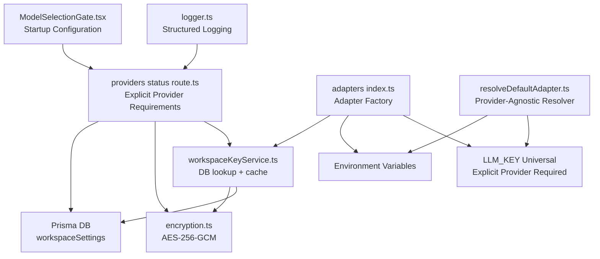
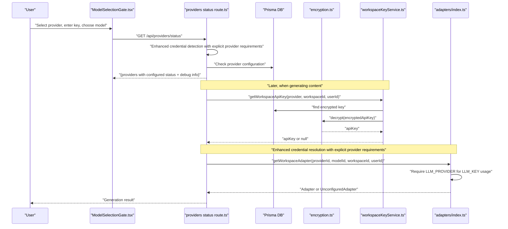
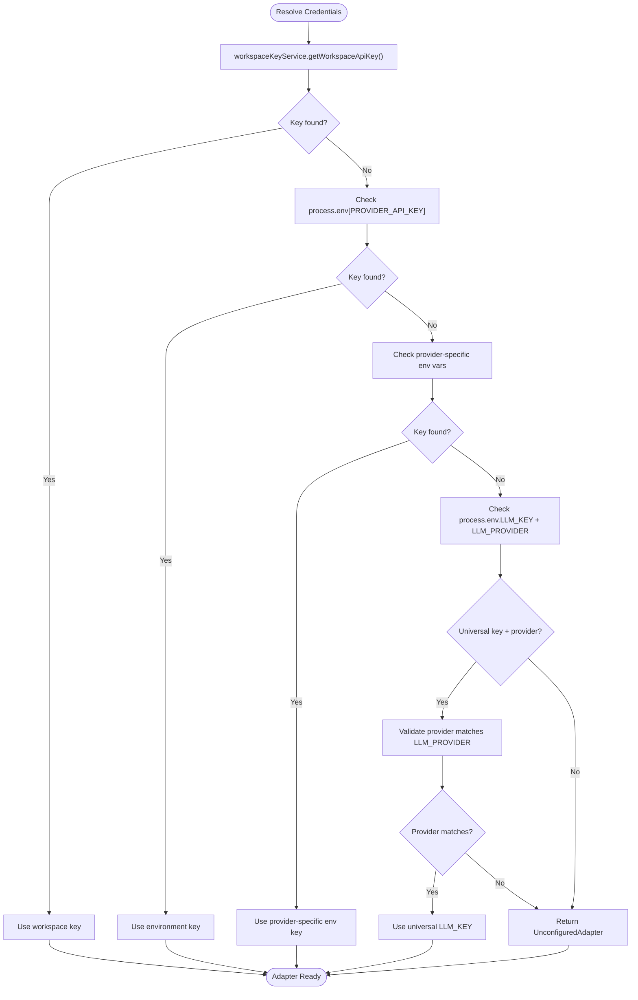
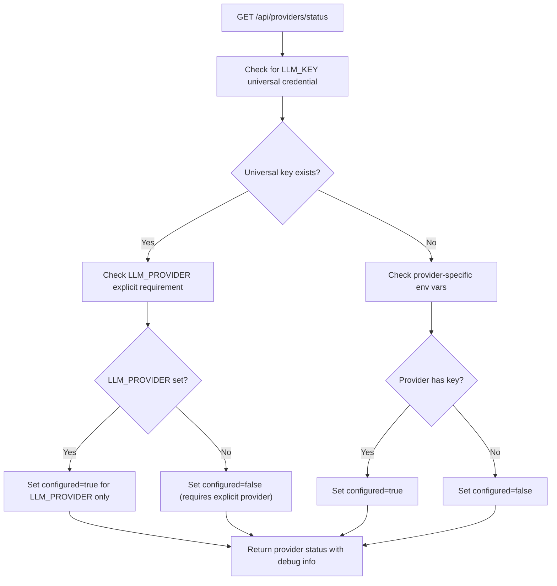
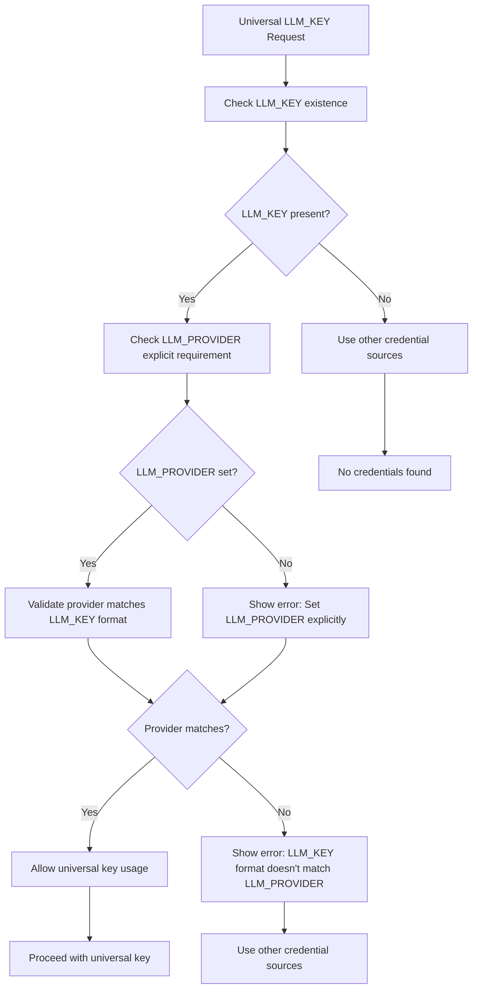
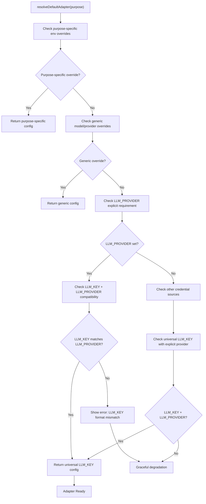
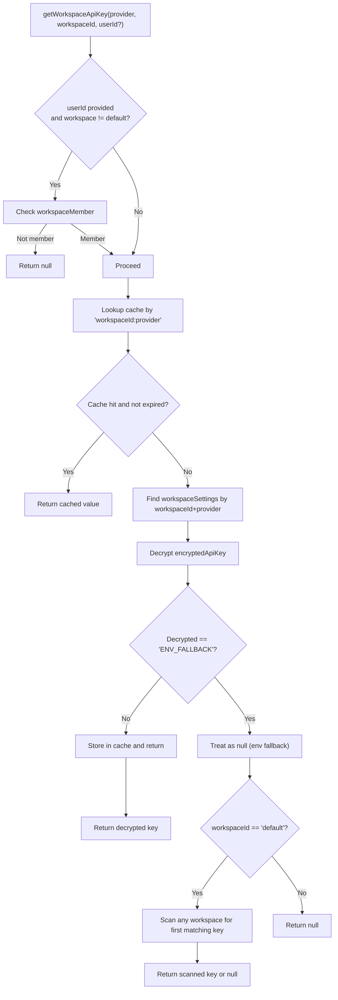
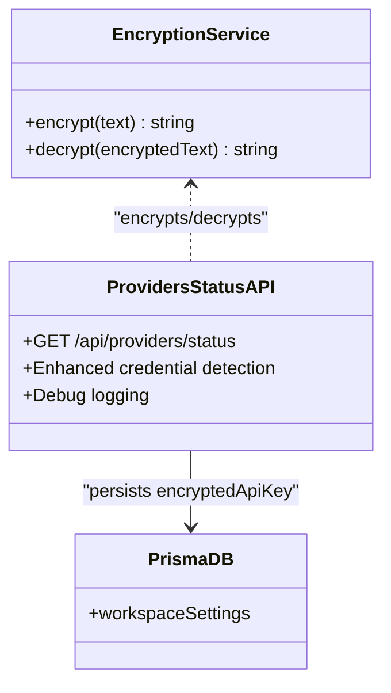
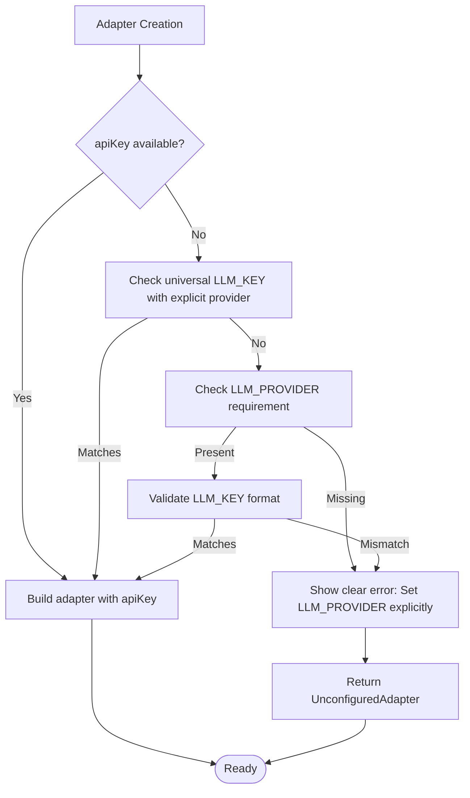
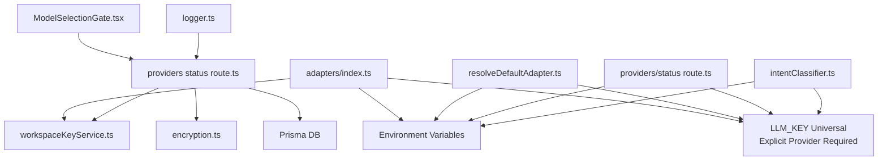

# Configuration & Authentication Management

<cite>
**Referenced Files in This Document**
- [workspaceKeyService.ts](file://lib/security/workspaceKeyService.ts)
- [encryption.ts](file://lib/security/encryption.ts)
- [providers status route.ts](file://app/api/providers/status/route.ts)
- [ModelSelectionGate.tsx](file://components/ModelSelectionGate.tsx)
- [adapters index.ts](file://lib/ai/adapters/index.ts)
- [resolveDefaultAdapter.ts](file://lib/ai/resolveDefaultAdapter.ts)
- [unconfigured.ts](file://lib/ai/adapters/unconfigured.ts)
- [workspaceKeyService.test.ts](file://__tests__/workspaceKeyService.test.ts)
- [adaptersIndex.test.ts](file://__tests__/adaptersIndex.test.ts)
- [encryption.test.ts](file://__tests__/encryption.test.ts)
- [logger.ts](file://lib/logger.ts)
</cite>

## Update Summary
**Changes Made**
- Enhanced provider status detection with universal LLM_KEY support and explicit provider validation
- Improved security by removing client-side API key transmission and centralizing authentication on server side
- Updated credential resolution hierarchy to prioritize workspace-specific keys, environment variables, provider-specific fallbacks, and universal LLM_KEY with explicit provider requirement
- Enhanced error messaging for configuration issues with clear guidance on provider specification
- Strengthened security measures by eliminating automatic provider inference from key formats

## Table of Contents
1. [Introduction](#introduction)
2. [Project Structure](#project-structure)
3. [Core Components](#core-components)
4. [Architecture Overview](#architecture-overview)
5. [Detailed Component Analysis](#detailed-component-analysis)
6. [Dependency Analysis](#dependency-analysis)
7. [Performance Considerations](#performance-considerations)
8. [Troubleshooting Guide](#troubleshooting-guide)
9. [Conclusion](#conclusion)

## Introduction
This document explains how the AI provider configuration and authentication management system is designed and operated. It covers the enhanced credential resolution hierarchy (workspace-specific keys, environment variables, provider-specific fallbacks, and the universal LLM_KEY with explicit provider requirement), the secure storage and retrieval of encrypted credentials, the configuration error handling mechanism, and the streamlined ModelSelectionGate component that handles configuration during startup. The system now enforces explicit provider specification for universal LLM_KEY usage, eliminating automatic provider detection while maintaining strict security measures to prevent unauthorized credential usage across providers.

**Updated** The system now requires explicit LLM_PROVIDER environment variable when using universal LLM_KEY, removing automatic provider detection capabilities. Enhanced error messaging provides clear guidance for users when LLM_KEY is set but format is not recognized. The Ollama cloud-hosted key detection patterns remain functional but are marked as deprecated in favor of explicit provider configuration.

## Project Structure
The configuration and authentication system spans several layers:
- Web UI: The ModelSelectionGate component provides a guided configuration experience during startup.
- API Layer: The providers status route performs enhanced credential detection with explicit provider requirements.
- Security Services: Encryption and workspace key services manage secure storage and retrieval.
- Adapter Layer: Adapters resolve credentials server-side via workspaceKeyService, environment variables, provider-specific fallbacks, and the universal LLM_KEY with explicit provider requirement.

**Diagram sources**
- [ModelSelectionGate.tsx:85-118](file://components/ModelSelectionGate.tsx#L85-L118)
- [providers status route.ts:137-223](file://app/api/providers/status/route.ts#L137-L223)
- [workspaceKeyService.ts:32-95](file://lib/security/workspaceKeyService.ts#L32-L95)
- [encryption.ts:27-68](file://lib/security/encryption.ts#L27-L68)
- [adapters index.ts:223-291](file://lib/ai/adapters/index.ts#L223-L291)
- [resolveDefaultAdapter.ts:58-206](file://lib/ai/resolveDefaultAdapter.ts#L58-L206)
- [logger.ts:23-88](file://lib/logger.ts#L23-L88)

**Section sources**
- [ModelSelectionGate.tsx:85-118](file://components/ModelSelectionGate.tsx#L85-L118)
- [providers status route.ts:137-223](file://app/api/providers/status/route.ts#L137-L223)
- [workspaceKeyService.ts:32-95](file://lib/security/workspaceKeyService.ts#L32-L95)
- [encryption.ts:27-68](file://lib/security/encryption.ts#L27-L68)
- [adapters index.ts:223-291](file://lib/ai/adapters/index.ts#L223-L291)
- [resolveDefaultAdapter.ts:58-206](file://lib/ai/resolveDefaultAdapter.ts#L58-L206)
- [logger.ts:23-88](file://lib/logger.ts#L23-L88)

## Core Components
- Workspace Key Service: Retrieves and caches decrypted API keys per workspace/provider, with a global fallback for default workspace contexts.
- Encryption Service: Provides AES-256-GCM encryption/decryption for API keys at rest, with robust startup validation and fallback behavior.
- Enhanced Provider Status Detection: Performs comprehensive credential detection with explicit provider requirements, supporting LLM_KEY universal credentials only when LLM_PROVIDER is properly configured.
- Model Selection Gate: A guided startup component that allows users to configure provider credentials through a streamlined interface during initialization.
- Adapter Factory: Resolves credentials server-side via workspaceKeyService, environment variables, provider-specific fallbacks, and the universal LLM_KEY with explicit provider requirement, throwing ConfigurationError on missing keys, and returning UnconfiguredAdapter for graceful degradation.
- Provider-Agnostic Resolver: Handles universal LLM_KEY resolution with explicit provider specification from LLM_PROVIDER environment variable for different purposes (intent, generation, etc.).
- Unconfigured Adapter: A fallback socket adapter used when no API keys are present, providing graceful degradation with helpful user guidance.

**Updated** Enhanced adapter factory and provider-agnostic resolver to enforce explicit LLM_PROVIDER requirement for universal LLM_KEY usage, eliminating automatic provider detection capabilities. The provider status detection now includes comprehensive debugging information for troubleshooting credential resolution issues with explicit provider configuration requirements. The refined environment variable handling provides better validation and clearer error messages for API key configuration problems.

**Section sources**
- [workspaceKeyService.ts:32-137](file://lib/security/workspaceKeyService.ts#L32-L137)
- [encryption.ts:27-68](file://lib/security/encryption.ts#L27-L68)
- [providers status route.ts:137-223](file://app/api/providers/status/route.ts#L137-L223)
- [ModelSelectionGate.tsx:85-118](file://components/ModelSelectionGate.tsx#L85-L118)
- [adapters index.ts:223-291](file://lib/ai/adapters/index.ts#L223-L291)
- [resolveDefaultAdapter.ts:58-206](file://lib/ai/resolveDefaultAdapter.ts#L58-L206)
- [unconfigured.ts:13-99](file://lib/ai/adapters/unconfigured.ts#L13-L99)

## Architecture Overview
The system enforces a strict server-only credential resolution policy with enhanced security measures and comprehensive debugging capabilities. The UI never receives or stores real API keys; all sensitive data is encrypted at rest and handled server-side. Configuration occurs only during startup through the ModelSelectionGate component, with the universal LLM_KEY providing a streamlined fallback option that requires explicit provider specification via LLM_PROVIDER environment variable.

**Diagram sources**
- [ModelSelectionGate.tsx:93-118](file://components/ModelSelectionGate.tsx#L93-L118)
- [providers status route.ts:137-223](file://app/api/providers/status/route.ts#L137-L223)
- [workspaceKeyService.ts:32-95](file://lib/security/workspaceKeyService.ts#L32-L95)
- [encryption.ts:27-68](file://lib/security/encryption.ts#L27-L68)
- [adapters index.ts:262-290](file://lib/ai/adapters/index.ts#L262-L290)

## Detailed Component Analysis

### Enhanced Credential Resolution Hierarchy with Explicit Provider Requirements
The adapter factory implements a strict, layered resolution order with enhanced security measures for universal LLM_KEY handling and explicit provider requirements:
1. Workspace-specific key lookup via workspaceKeyService.
2. Environment variable fallback for the specific provider.
3. Provider-specific environment variable fallbacks.
4. **NEW** Universal LLM_KEY fallback with explicit provider requirement via LLM_PROVIDER environment variable.
5. Graceful degradation via UnconfiguredAdapter if no credentials are found.

**Diagram sources**
- [adapters index.ts:223-291](file://lib/ai/adapters/index.ts#L223-L291)
- [workspaceKeyService.ts:32-95](file://lib/security/workspaceKeyService.ts#L32-L95)
- [resolveDefaultAdapter.ts:188-206](file://lib/ai/resolveDefaultAdapter.ts#L188-L206)

**Section sources**
- [adapters index.ts:223-291](file://lib/ai/adapters/index.ts#L223-L291)

### Enhanced Provider Status Detection with Explicit Provider Requirements
The provider status endpoint now includes comprehensive credential detection logic with explicit provider requirements to support LLM_KEY universal credentials and enhanced debugging.

**Diagram sources**
- [providers status route.ts:137-223](file://app/api/providers/status/route.ts#L137-L223)

**Section sources**
- [providers status route.ts:137-223](file://app/api/providers/status/route.ts#L137-L223)

### Enhanced Security Measures for Universal LLM_KEY with Explicit Provider Requirements
The system now includes comprehensive security measures to prevent unauthorized credential usage with explicit provider requirements:

- **Explicit Provider Requirement**: The universal LLM_KEY now requires LLM_PROVIDER environment variable to specify which provider it belongs to:
  - Groq: `LLM_PROVIDER=groq` with `LLM_KEY=gsk_...` or `LLM_KEY=gsk_live_...`
  - Anthropic: `LLM_PROVIDER=anthropic` with `LLM_KEY=sk-ant-...` or `LLM_KEY=sk-ant-api...`
  - Google: `LLM_PROVIDER=google` with `LLM_KEY=AIzaSy...`
  - OpenAI: `LLM_PROVIDER=openai` with `LLM_KEY=sk-proj-...`, `LLM_KEY=sk-...`, or `LLM_KEY=sk_live_...`
  - Ollama: `LLM_PROVIDER=ollama` with `LLM_KEY=numeric prefixes (e.g., 2794...)`
- **Provider Validation**: The system strictly validates that LLM_KEY matches the LLM_PROVIDER specification to prevent unauthorized usage across different providers.
- **Enhanced Debugging**: Comprehensive logging shows which providers are eligible for universal key usage and requires explicit configuration.
- **Prevention of Unauthorized Usage**: LLM_KEY is never used as a credential for unrelated providers without explicit LLM_PROVIDER specification, preventing 401 errors and unauthorized access.
- **Clear Error Messaging**: When LLM_KEY is set but LLM_PROVIDER is missing, the system provides clear guidance on how to configure explicit provider specification.

**Diagram sources**
- [adapters index.ts:262-280](file://lib/ai/adapters/index.ts#L262-L280)
- [resolveDefaultAdapter.ts:87-101](file://lib/ai/resolveDefaultAdapter.ts#L87-L101)

**Section sources**
- [adapters index.ts:262-280](file://lib/ai/adapters/index.ts#L262-L280)
- [resolveDefaultAdapter.ts:87-101](file://lib/ai/resolveDefaultAdapter.ts#L87-L101)

### Provider-Agnostic Universal LLM_KEY Resolver with Explicit Provider Requirements
The resolveDefaultAdapter module provides a provider-agnostic way to handle universal LLM_KEY usage across different purposes (intent, generation, etc.) with explicit provider specification from LLM_PROVIDER environment variable.

**Updated** The resolveDefaultAdapter module still maintains automatic provider detection for legacy purposes, but the main adapter factory now enforces explicit provider requirements. The detectProviderFromKey function continues to support automatic detection but is marked as deprecated in favor of explicit LLM_PROVIDER specification.

**Diagram sources**
- [resolveDefaultAdapter.ts:116-181](file://lib/ai/resolveDefaultAdapter.ts#L116-L181)

**Section sources**
- [resolveDefaultAdapter.ts:116-181](file://lib/ai/resolveDefaultAdapter.ts#L116-L181)

### Enhanced Explicit Provider Requirement Logic
The system now includes sophisticated explicit provider requirement logic that enforces LLM_PROVIDER specification for universal LLM_KEY usage:

- **LLM_PROVIDER Requirement**: Users must set `LLM_PROVIDER=openai|anthropic|google|groq|ollama` when using `LLM_KEY`
- **Provider-Specific Key Formats**: Each provider has specific key format requirements when using LLM_PROVIDER:
  - Groq: `LLM_PROVIDER=groq` with keys starting with 'gsk_' or 'gsk_live_'
  - Anthropic: `LLM_PROVIDER=anthropic` with keys starting with 'sk-ant-' or 'sk-ant-api...'
  - Google: `LLM_PROVIDER=google` with keys starting with 'AIzaSy'
  - OpenAI: `LLM_PROVIDER=openai` with keys starting with 'sk-proj-', 'sk-', or 'sk_live_'
  - Ollama: `LLM_PROVIDER=ollama` with numeric prefixes (e.g., 2794...) for cloud-hosted instances
- **Enhanced Fallback Behavior**: If LLM_PROVIDER is missing, the system provides clear error messages with configuration guidance
- **Comprehensive Logging**: Detailed console logging shows successful provider validation and warnings for missing LLM_PROVIDER
- **Debug Information**: Enhanced logging displays LLM_PROVIDER requirements and LLM_KEY format validation results to aid troubleshooting

**Updated** The main adapter factory now enforces explicit LLM_PROVIDER requirement, while the resolveDefaultAdapter module maintains automatic detection capabilities for backward compatibility. The system provides clear error messages when LLM_KEY is used without LLM_PROVIDER specification.

**Section sources**
- [resolveDefaultAdapter.ts:73-88](file://lib/ai/resolveDefaultAdapter.ts#L73-L88)
- [resolveDefaultAdapter.ts:90-105](file://lib/ai/resolveDefaultAdapter.ts#L90-L105)

### WorkspaceKeyService Integration
- Authorization: Validates user membership for non-default workspaces before retrieving keys.
- Caching: Uses an in-memory TTL map keyed by "workspaceId:provider" to avoid repeated DB lookups.
- Global Fallback: For default workspace context, scans all workspaces to find the first real key for a provider.
- Cache Invalidation: Immediately invalidates cache entries on save/delete to ensure fresh credentials on next request.

**Diagram sources**
- [workspaceKeyService.ts:32-95](file://lib/security/workspaceKeyService.ts#L32-L95)

**Section sources**
- [workspaceKeyService.ts:32-137](file://lib/security/workspaceKeyService.ts#L32-L137)

### Encryption Service and Secure Storage
- AES-256-GCM encryption with random IV and authentication tag.
- Supports base64-encoded or raw 32-byte ENCRYPTION_SECRET; falls back to a deterministic hash derived from environment variables at startup.
- Startup validation warns if the secret is missing but does not crash builds; runtime encryption/decryption will safely fail with a 500 error.
- Keys are stored in the database as encryptedApiKey and never exposed to the client.

**Diagram sources**
- [encryption.ts:27-68](file://lib/security/encryption.ts#L27-L68)
- [providers status route.ts:137-223](file://app/api/providers/status/route.ts#L137-L223)

**Section sources**
- [encryption.ts:27-95](file://lib/security/encryption.ts#L27-L95)
- [providers status route.ts:137-223](file://app/api/providers/status/route.ts#L137-L223)

### Model Selection Gate Functionality
- Provider Selection: Guides users through a streamlined two-step process (Provider → Confirm) during startup.
- Key Handling: Never stores real keys client-side; sends keys securely to the server for encryption and persistence.
- Provider Discovery: Automatically discovers configured providers from environment variables, including those using the universal LLM_KEY with explicit provider requirements.
- Model Selection: Allows users to select from available models for the chosen provider.
- Persistence: Saves encrypted keys to the database and marks the session as active.

**Updated** Enhanced provider discovery to include universal LLM_KEY configuration with explicit provider requirements, eliminating automatic provider detection and requiring LLM_PROVIDER specification for universal key usage.

**Diagram sources**
- [ModelSelectionGate.tsx:93-118](file://components/ModelSelectionGate.tsx#L93-L118)
- [providers status route.ts:137-223](file://app/api/providers/status/route.ts#L137-L223)

**Section sources**
- [ModelSelectionGate.tsx:85-118](file://components/ModelSelectionGate.tsx#L85-L118)
- [providers status route.ts:137-223](file://app/api/providers/status/route.ts#L137-L223)

### Configuration Error Handling and User Surfacing
- ConfigurationError is thrown when no credentials are available for a named provider, ensuring clear user-facing guidance.
- The adapter factory returns UnconfiguredAdapter when no credentials are found, enabling graceful degradation with helpful UI messaging.
- The API layer surfaces errors as JSON responses with appropriate HTTP status codes.
- Enhanced logging provides detailed debugging information for troubleshooting credential resolution issues, including explicit provider requirement validation.

**Diagram sources**
- [adapters index.ts:28-40](file://lib/ai/adapters/index.ts#L28-L40)
- [adapters index.ts:288-291](file://lib/ai/adapters/index.ts#L288-L291)

**Section sources**
- [adapters index.ts:28-40](file://lib/ai/adapters/index.ts#L28-L40)
- [adapters index.ts:288-291](file://lib/ai/adapters/index.ts#L288-L291)

### Security Measures Against Client-Side Credential Injection
- Server-only execution: The adapters and credential resolution run server-side; the UI never receives or logs real keys.
- Strict input validation: The UI masks keys, disables autocomplete, and avoids storing real keys in localStorage.
- Encrypted at rest: Keys are encrypted before being persisted to the database.
- Minimal exposure: The UI only stores non-sensitive display metadata locally.
- Enhanced provider requirements: Universal LLM_KEY usage requires explicit LLM_PROVIDER specification, preventing unauthorized usage across different providers.
- Comprehensive logging: Detailed debug information helps identify credential resolution issues without exposing sensitive data.

**Updated** The system now enforces explicit LLM_PROVIDER requirement for universal LLM_KEY usage, significantly strengthening security measures against unauthorized credential usage across providers.

**Section sources**
- [ModelSelectionGate.tsx:126-156](file://components/ModelSelectionGate.tsx#L126-L156)
- [providers status route.ts:149-154](file://app/api/providers/status/route.ts#L149-L154)
- [encryption.ts:27-68](file://lib/security/encryption.ts#L27-L68)
- [adapters index.ts:262-280](file://lib/ai/adapters/index.ts#L262-L280)

## Dependency Analysis
The following diagram highlights the key dependencies among components involved in configuration and authentication, including the enhanced universal LLM_KEY handling with explicit provider requirements.

**Diagram sources**
- [adapters index.ts:223-291](file://lib/ai/adapters/index.ts#L223-L291)
- [workspaceKeyService.ts:32-95](file://lib/security/workspaceKeyService.ts#L32-L95)
- [providers status route.ts:137-223](file://app/api/providers/status/route.ts#L137-L223)
- [ModelSelectionGate.tsx:93-118](file://components/ModelSelectionGate.tsx#L93-L118)
- [resolveDefaultAdapter.ts:58-206](file://lib/ai/resolveDefaultAdapter.ts#L58-L206)
- [logger.ts:23-88](file://lib/logger.ts#L23-L88)

**Section sources**
- [adapters index.ts:223-291](file://lib/ai/adapters/index.ts#L223-L291)
- [workspaceKeyService.ts:32-95](file://lib/security/workspaceKeyService.ts#L32-L95)
- [providers status route.ts:137-223](file://app/api/providers/status/route.ts#L137-L223)
- [ModelSelectionGate.tsx:93-118](file://components/ModelSelectionGate.tsx#L93-L118)
- [resolveDefaultAdapter.ts:58-206](file://lib/ai/resolveDefaultAdapter.ts#L58-L206)
- [logger.ts:23-88](file://lib/logger.ts#L23-L88)

## Performance Considerations
- Caching: workspaceKeyService caches decrypted keys with a 5-minute TTL to reduce database and decryption overhead.
- Batch invalidation: Deleting engine configuration invalidates cache entries for all providers in a workspace to ensure immediate freshness.
- Request timeout: The engine-config route sets a maximum execution duration to bound request latency.
- Model discovery: The UI fetches model lists on demand and supports search to minimize unnecessary network traffic.
- Universal key optimization: The universal LLM_KEY fallback with explicit provider requirements adds minimal overhead as it's checked only after provider-specific keys are exhausted.
- Enhanced logging: Debug information is only logged in development mode to minimize performance impact in production.
- Explicit provider validation: Key format validation is performed only when LLM_KEY is present and LLM_PROVIDER is set, avoiding unnecessary processing.

**Section sources**
- [workspaceKeyService.ts:11-24](file://lib/security/workspaceKeyService.ts#L11-L24)
- [workspaceKeyService.ts:100-106](file://lib/security/workspaceKeyService.ts#L100-L106)
- [providers status route.ts:137-139](file://app/api/providers/status/route.ts#L137-L139)
- [ModelSelectionGate.tsx:93-118](file://components/ModelSelectionGate.tsx#L93-L118)

## Troubleshooting Guide
Common issues and resolutions with enhanced guidance for universal LLM_KEY explicit provider requirements:

- Missing provider key
  - Symptom: ConfigurationError thrown or UnconfiguredAdapter returned.
  - Action: Use the ModelSelectionGate component to add a key during startup, or set the appropriate environment variable. Try the universal LLM_KEY as a fallback option, but ensure LLM_PROVIDER is set to the correct provider.
  - Reference: [adapters index.ts:288-291](file://lib/ai/adapters/index.ts#L288-L291)
- Key not persisting
  - Symptom: Key disappears after reload.
  - Action: Verify encryption secret is configured; confirm POST to /api/engine-config succeeds; check cache invalidation on save.
  - References: [providers status route.ts:137-139](file://app/api/providers/status/route.ts#L137-L139), [encryption.ts:81-94](file://lib/security/encryption.ts#L81-L94)
- Incorrect provider configuration
  - Symptom: LLM_KEY appears but provider shows as unconfigured.
  - Action: Set LLM_PROVIDER environment variable to match the provider of your LLM_KEY (e.g., `LLM_PROVIDER=openai` for OpenAI keys). Check console logs for explicit provider requirement validation results.
  - Reference: [ModelSelectionGate.tsx:120-124](file://components/ModelSelectionGate.tsx#L120-L124)
- Connectivity test fails
  - Symptom: Connection status shows failure.
  - Action: Confirm key validity and network access; test against the provider's documented base URL.
  - Reference: [ModelSelectionGate.tsx:126-156](file://components/ModelSelectionGate.tsx#L126-L156)
- Environment variable fallback not applied
  - Symptom: Keys not used despite being set in environment.
  - Action: Ensure the environment variable name matches the provider (e.g., OPENAI_API_KEY); verify workspace-specific keys take precedence over universal LLM_KEY; ensure LLM_PROVIDER is set when using LLM_KEY.
  - Reference: [adapters index.ts:242-260](file://lib/ai/adapters/index.ts#L242-L260)
- Universal LLM_KEY not working
  - Symptom: Universal key not being used despite being set.
  - Action: Verify LLM_KEY is set in environment variables; ensure LLM_PROVIDER is set to the correct provider; check console logs for explicit provider requirement validation results.
  - Reference: [adapters index.ts:262-280](file://lib/ai/adapters/index.ts#L262-L280)
- LLM_PROVIDER missing for universal LLM_KEY
  - Symptom: LLM_KEY is set but system shows error requiring explicit provider specification.
  - Action: Set LLM_PROVIDER environment variable to match the provider of your LLM_KEY (e.g., `LLM_PROVIDER=openai`, `LLM_PROVIDER=anthropic`, `LLM_PROVIDER=google`, `LLM_PROVIDER=groq`, `LLM_PROVIDER=ollama`).
  - Reference: [adapters index.ts:262-280](file://lib/ai/adapters/index.ts#L262-L280)
- LLM_KEY format mismatch with LLM_PROVIDER
  - Symptom: LLM_KEY format doesn't match LLM_PROVIDER specification.
  - Action: Ensure LLM_KEY format matches the provider specified in LLM_PROVIDER. For example, OpenAI keys should start with 'sk-proj-', 'sk-', or 'sk_live_' when LLM_PROVIDER=openai.
  - Reference: [adapters index.ts:262-280](file://lib/ai/adapters/index.ts#L262-L280)
- Enhanced debugging information
  - Symptom: Need more detailed information about credential resolution.
  - Action: Check server logs for comprehensive debug information including available environment variables, provider configuration status, explicit provider requirement validation results, and credential detection outcomes.
  - Reference: [providers status route.ts:149-154](file://app/api/providers/status/route.ts#L149-L154)
- Managing multiple provider keys across workspaces
  - Best practice: Configure workspace-specific keys for isolation; rely on environment variables for shared defaults; use the universal LLM_KEY with explicit LLM_PROVIDER specification as a final fallback; leverage provider status detection to see which providers are configured.
  - Reference: [workspaceKeyService.ts:74-87](file://lib/security/workspaceKeyService.ts#L74-L87)
  - Reference: [providers status route.ts:201-202](file://app/api/providers/status/route.ts#L201-L202)
- Enhanced environment variable handling
  - Symptom: API key configuration issues with unclear error messages.
  - Action: Check that environment variables are properly formatted and match expected patterns; verify LLM_PROVIDER is set when using LLM_KEY; use explicit provider specification for all universal key configurations.
  - Reference: [providers status route.ts:149-154](file://app/api/providers/status/route.ts#L149-L154)
  - Reference: [resolveDefaultAdapter.ts:87-101](file://lib/ai/resolveDefaultAdapter.ts#L87-L101)
- Enhanced provider requirement enforcement
  - Symptom: New configuration not working despite correct key format.
  - Action: Verify LLM_PROVIDER environment variable is set to match the provider of your LLM_KEY; check console logs for explicit provider requirement validation results; ensure proper LLM_PROVIDER specification for your key format.
  - Reference: [resolveDefaultAdapter.ts:73-88](file://lib/ai/resolveDefaultAdapter.ts#L73-L88)

**Updated** Added troubleshooting guidance for the new explicit LLM_PROVIDER requirement system with enhanced error messaging for missing provider specification. Enhanced existing troubleshooting steps to reflect the expanded credential resolution hierarchy with security measures and comprehensive debugging capabilities. Included guidance for refined environment variable handling with better validation and clearer error messages for API key configuration problems.

**Section sources**
- [adapters index.ts:288-291](file://lib/ai/adapters/index.ts#L288-L291)
- [providers status route.ts:137-139](file://app/api/providers/status/route.ts#L137-L139)
- [encryption.ts:81-94](file://lib/security/encryption.ts#L81-L94)
- [ModelSelectionGate.tsx:120-124](file://components/ModelSelectionGate.tsx#L120-L124)
- [ModelSelectionGate.tsx:126-156](file://components/ModelSelectionGate.tsx#L126-L156)
- [adapters index.ts:242-260](file://lib/ai/adapters/index.ts#L242-L260)
- [workspaceKeyService.ts:74-87](file://lib/security/workspaceKeyService.ts#L74-L87)
- [providers status route.ts:201-202](file://app/api/providers/status/route.ts#L201-L202)
- [adapters index.ts:262-280](file://lib/ai/adapters/index.ts#L262-L280)
- [resolveDefaultAdapter.ts:87-101](file://lib/ai/resolveDefaultAdapter.ts#L87-L101)
- [providers status route.ts:149-154](file://app/api/providers/status/route.ts#L149-L154)

## Conclusion
The system enforces a secure, streamlined approach to AI provider configuration and authentication with enhanced security measures for universal LLM_KEY handling and comprehensive debugging capabilities. The new explicit LLM_PROVIDER requirement system eliminates automatic provider detection while maintaining strict security measures to prevent unauthorized credential usage across providers. By resolving credentials server-side, encrypting keys at rest, and surfacing clear configuration errors, it ensures safety and usability. The ModelSelectionGate component provides a guided, user-friendly interface for managing provider credentials during startup, while the adapter factory and workspace key service maintain strict separation of concerns and robust fallback behavior. The enhanced backend provider status checking with comprehensive debugging information significantly improves troubleshooting capabilities and credential resolution transparency. This enhanced approach reduces complexity while maintaining security and reliability, with comprehensive logging and validation to prevent unauthorized credential usage across providers.

**Updated** The system now includes enhanced security measures for universal LLM_KEY handling with explicit provider requirements, eliminating automatic provider detection capabilities. The enhanced backend provider status checking with comprehensive debugging capabilities provides detailed insights into credential resolution issues, including explicit provider requirement validation results, making troubleshooting significantly easier while maintaining backward compatibility and providing clear debugging information for troubleshooting. The refined environment variable handling offers better validation and clearer error messages for API key configuration problems, improving the overall user experience and system reliability.