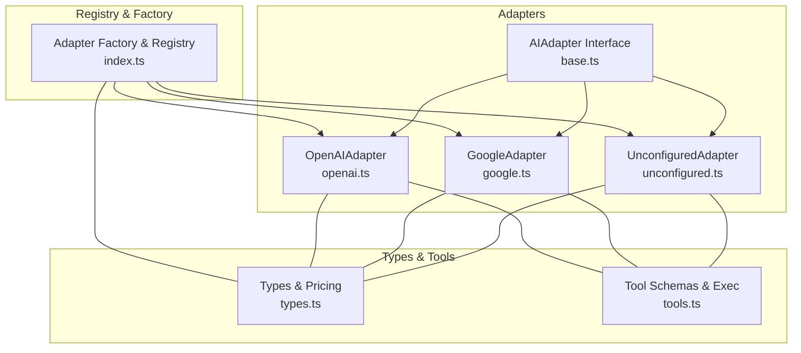
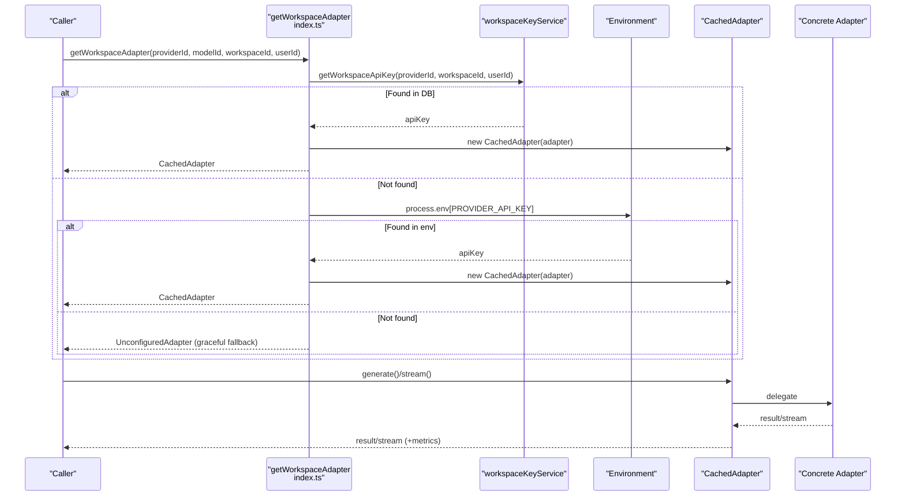
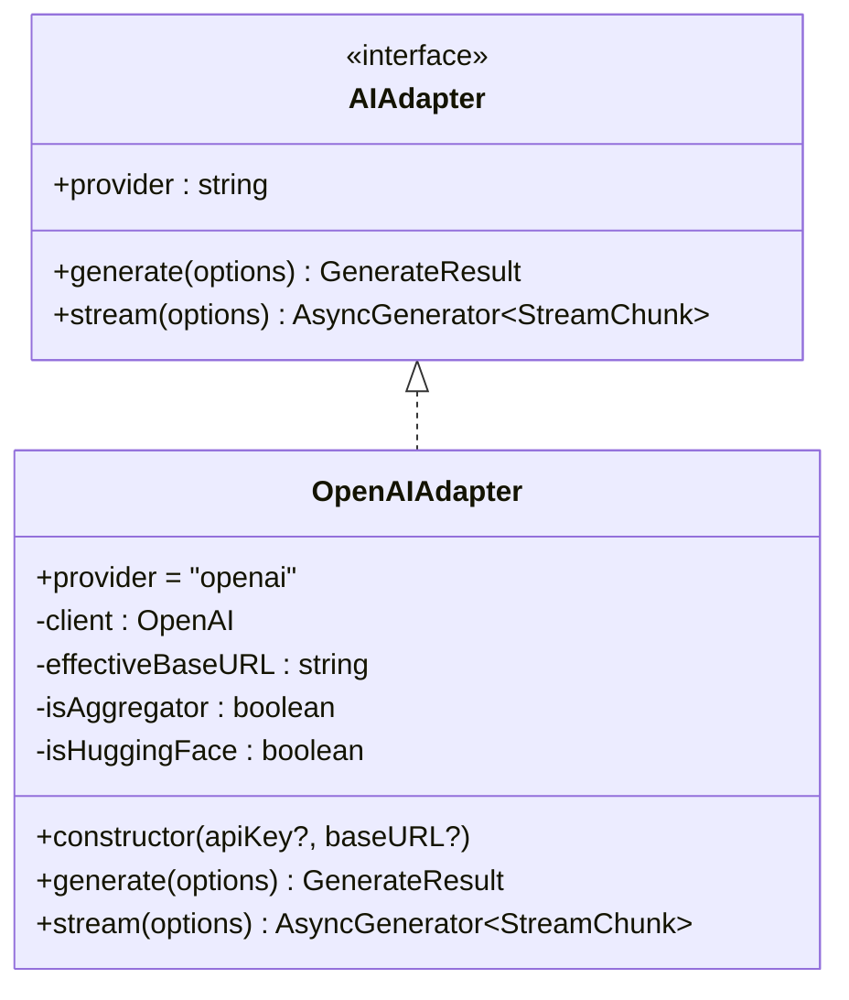
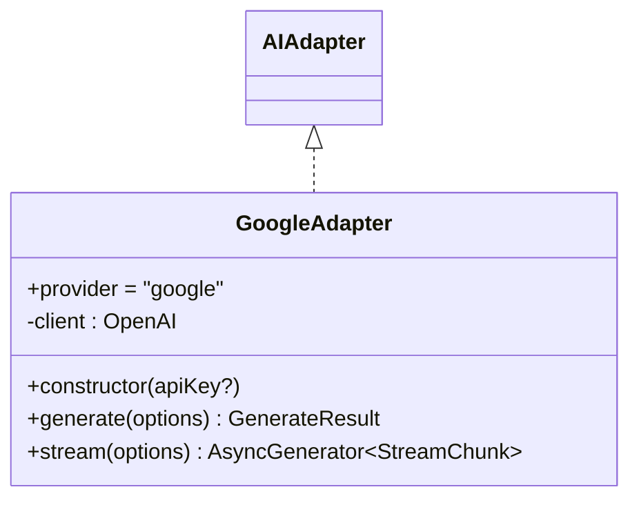
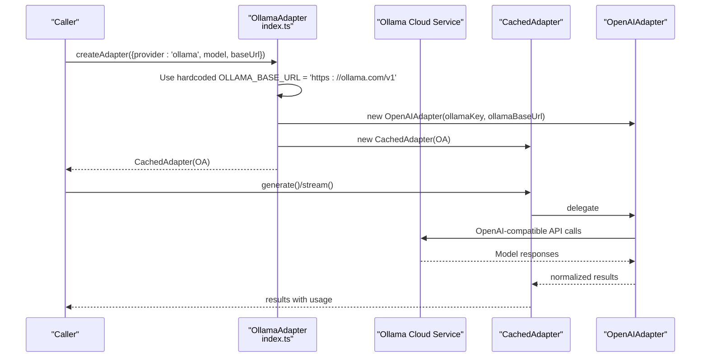
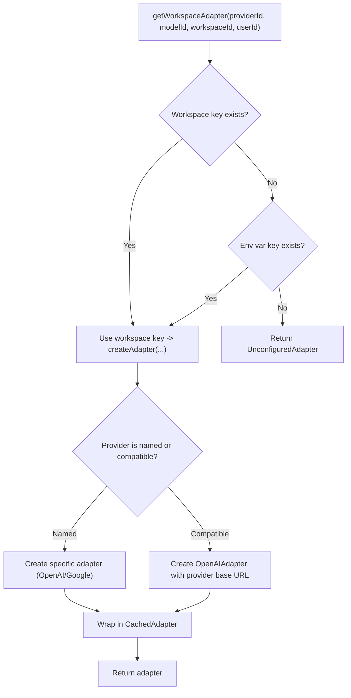
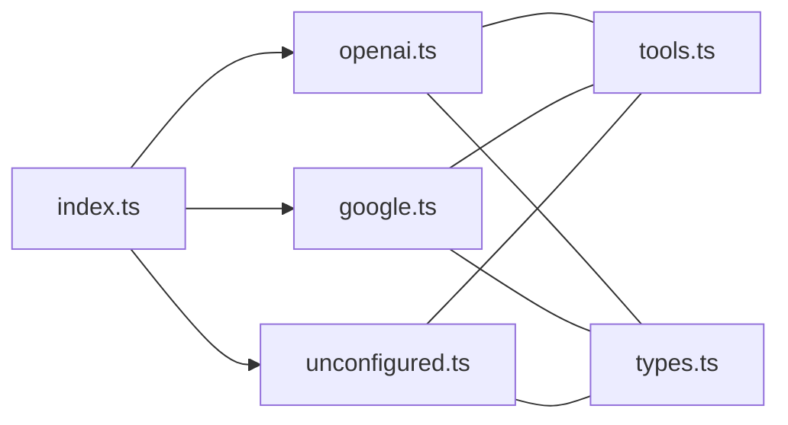

# Provider-Specific Implementations

<cite>
**Referenced Files in This Document**
- [base.ts](file://lib/ai/adapters/base.ts)
- [openai.ts](file://lib/ai/adapters/openai.ts)
- [google.ts](file://lib/ai/adapters/google.ts)
- [unconfigured.ts](file://lib/ai/adapters/unconfigured.ts)
- [index.ts](file://lib/ai/adapters/index.ts)
- [types.ts](file://lib/ai/types.ts)
- [tools.ts](file://lib/ai/tools.ts)
- [adapterIndex.test.ts](file://__tests__/adapterIndex.test.ts)
- [modelRegistry.ts](file://lib/ai/modelRegistry.ts)
- [route.ts](file://app/api/providers/status/route.ts)
</cite>

## Update Summary
**Changes Made**
- Updated OllamaAdapter implementation to reflect the transition from local Ollama instances to Ollama Cloud service (https://ollama.com/v1)
- Removed references to local model detection and runtime validation capabilities
- Updated provider-specific configuration and authentication flows for Ollama Cloud
- Revised troubleshooting guide to reflect Ollama Cloud-specific configurations
- Updated model registry entries to reflect Ollama Cloud models

## Table of Contents
1. [Introduction](#introduction)
2. [Project Structure](#project-structure)
3. [Core Components](#core-components)
4. [Architecture Overview](#architecture-overview)
5. [Detailed Component Analysis](#detailed-component-analysis)
6. [Dependency Analysis](#dependency-analysis)
7. [Performance Considerations](#performance-considerations)
8. [Troubleshooting Guide](#troubleshooting-guide)
9. [Conclusion](#conclusion)

## Introduction
This document explains the AI provider implementations and their adapter classes that power the UI engine. It covers the base AIAdapter interface, the concrete adapters for OpenAI, Google, and the UnconfiguredAdapter. It also documents how OpenAI-compatible providers (Groq, Ollama) are handled via the OpenAI adapter, and how the UnconfiguredAdapter provides graceful degradation when no credentials are available. The guide highlights provider-specific parameters, authentication flows, response handling, error management, and unique features such as tool calls and streaming.

**Updated** The system now supports Ollama as a first-class provider that connects to Ollama Cloud service (https://ollama.com/v1) instead of local Ollama instances. Ollama operates as an OpenAI-compatible cloud inference service that routes through the OpenAI adapter with configurable base URLs.

## Project Structure
The AI adapter system is organized under lib/ai/adapters with a central factory and registry in index.ts. Each provider has its own adapter file implementing the shared AIAdapter interface. Supporting types and tool schemas live in lib/ai/types.ts and lib/ai/tools.ts respectively.

**Diagram sources**
- [index.ts:10-13](file://lib/ai/adapters/index.ts#L10-L13)
- [base.ts:50-72](file://lib/ai/adapters/base.ts#L50-L72)
- [openai.ts:36-218](file://lib/ai/adapters/openai.ts#L36-L218)
- [google.ts:24-90](file://lib/ai/adapters/google.ts#L24-L90)
- [unconfigured.ts:13-99](file://lib/ai/adapters/unconfigured.ts#L13-L99)
- [types.ts:19-55](file://lib/ai/types.ts#L19-L55)
- [tools.ts:47-79](file://lib/ai/tools.ts#L47-L79)

**Section sources**
- [index.ts:10-13](file://lib/ai/adapters/index.ts#L10-L13)
- [base.ts:11-26](file://lib/ai/adapters/base.ts#L11-L26)

## Core Components
- AIAdapter interface: Defines the provider-agnostic contract with generate() and stream().
- GenerateOptions: Shared input schema including model, messages, temperature, maxTokens, responseFormat, tools, and toolChoice.
- GenerateResult and StreamChunk: Unified output formats for content, optional toolCalls, and token usage.
- ProviderName: Canonical provider identifiers used across the system including 'ollama'.

These types enable the rest of the application to remain provider-agnostic while adapters normalize provider-specific responses.

**Section sources**
- [base.ts:34-46](file://lib/ai/adapters/base.ts#L34-L46)
- [base.ts:50-72](file://lib/ai/adapters/base.ts#L50-L72)
- [types.ts:19-55](file://lib/ai/types.ts#L19-L55)
- [types.ts:59-67](file://lib/ai/types.ts#L59-L67)

## Architecture Overview
The adapter factory resolves credentials securely from workspace storage or environment variables, selects the appropriate adapter, and wraps it in a caching layer. OpenAI-compatible providers (Groq, Ollama) are routed through the OpenAI adapter with provider-specific base URLs. Google leverages an OpenAI-compatible endpoint. UnconfiguredAdapter provides graceful fallback when no credentials are present.

**Diagram sources**
- [index.ts:236-278](file://lib/ai/adapters/index.ts#L236-L278)
- [index.ts:140-215](file://lib/ai/adapters/index.ts#L140-L215)
- [index.ts:82-138](file://lib/ai/adapters/index.ts#L82-L138)

## Detailed Component Analysis

### OpenAIAdapter
- Purpose: Supports OpenAI models including reasoning models (o1/o3 series) and OpenAI-compatible aggregators and proxies (OpenRouter, Together.ai, HuggingFace, Groq, Ollama).
- Authentication: Accepts an API key and optional base URL; auto-migrates deprecated HuggingFace endpoints to the current router endpoint.
- Special handling:
  - Reasoning models: omit temperature, use max_completion_tokens, avoid response_format and tools for certain variants.
  - Aggregators and proxies: disable response_format, tools, and tool_choice to prevent silent rejection.
  - HuggingFace: cap max_tokens conservatively to avoid 400 errors due to small output budgets.
  - System role: models without system role support merge system messages into the first user message.
- Tool calls: Converts unified tool definitions to OpenAI format and normalizes tool calls back to the unified schema.
- Streaming: Uses OpenAI SDK streaming with usage injection on the final chunk.

**Diagram sources**
- [base.ts:50-72](file://lib/ai/adapters/base.ts#L50-L72)
- [openai.ts:36-218](file://lib/ai/adapters/openai.ts#L36-L218)

**Section sources**
- [openai.ts:1-11](file://lib/ai/adapters/openai.ts#L1-L11)
- [openai.ts:23-32](file://lib/ai/adapters/openai.ts#L23-L32)
- [openai.ts:46-62](file://lib/ai/adapters/openai.ts#L46-L62)
- [openai.ts:64-157](file://lib/ai/adapters/openai.ts#L64-L157)
- [openai.ts:159-217](file://lib/ai/adapters/openai.ts#L159-L217)

### GoogleAdapter
- Purpose: Uses Google AI Studio's OpenAI-compatible endpoint to call Gemini models.
- Authentication: Uses GOOGLE_API_KEY or GEMINI_API_KEY; base URL is fixed.
- Special handling:
  - Google's proxy rejects response_format; it is omitted when passed.
  - Tool calling is supported via OpenAI-compatible tool definitions.
- Streaming: Uses OpenAI SDK streaming.

**Diagram sources**
- [base.ts:50-72](file://lib/ai/adapters/base.ts#L50-L72)
- [google.ts:24-90](file://lib/ai/adapters/google.ts#L24-L90)

**Section sources**
- [google.ts:1-12](file://lib/ai/adapters/google.ts#L1-L12)
- [google.ts:28-33](file://lib/ai/adapters/google.ts#L28-L33)
- [google.ts:35-68](file://lib/ai/adapters/google.ts#L35-L68)
- [google.ts:71-88](file://lib/ai/adapters/google.ts#L71-L88)

### OllamaAdapter
- Purpose: OpenAI-compatible cloud inference service that routes through the OpenAI adapter.
- Authentication: Uses OLLAMA_API_KEY environment variable or defaults to 'ollama' when not set.
- Base URL Configuration: Connects to Ollama Cloud service at https://ollama.com/v1.
- Special handling:
  - Supports response_format and tool calling when the underlying model supports them.
  - Works with Ollama Cloud models (e.g., qwen3-coder-next, gemma4:e2b, devstral-small-2, deepseek-v3.2, qwen3.5:9b).
  - Uses OpenAI SDK streaming with usage injection.
- Provider Detection: Automatically detected when model names include 'ollama:' prefix or specific model identifiers.

**Updated** OllamaAdapter now connects to Ollama Cloud service (https://ollama.com/v1) instead of local Ollama instances. Local model detection and runtime validation capabilities have been removed. The adapter now focuses solely on cloud model inference through the OpenAI-compatible API.

**Diagram sources**
- [index.ts:151-157](file://lib/ai/adapters/index.ts#L151-L157)
- [index.ts:42-45](file://lib/ai/adapters/index.ts#L42-L45)
- [index.ts:55-59](file://lib/ai/adapters/index.ts#L55-L59)

**Section sources**
- [index.ts:42-45](file://lib/ai/adapters/index.ts#L42-L45)
- [index.ts:55-59](file://lib/ai/adapters/index.ts#L55-L59)
- [index.ts:151-157](file://lib/ai/adapters/index.ts#L151-L157)

### UnconfiguredAdapter
- Purpose: Graceful fallback when no API keys are available. Prevents server crashes and surfaces actionable guidance to the user.
- Behavior:
  - JSON mode: Returns a structured JSON suitable for intent/thinking schemas with clear guidance.
  - Non-JSON mode: Returns a React component as a string to render a friendly "configure me" UI.
  - Streaming: Emits a minimal React component piece by piece.
- Role: Ensures the system remains usable even without credentials, guiding users to the settings panel.

**Diagram sources**
- [unconfigured.ts:16-74](file://lib/ai/adapters/unconfigured.ts#L16-L74)
- [unconfigured.ts:76-97](file://lib/ai/adapters/unconfigured.ts#L76-L97)

**Section sources**
- [unconfigured.ts:1-12](file://lib/ai/adapters/unconfigured.ts#L1-L12)
- [unconfigured.ts:16-74](file://lib/ai/adapters/unconfigured.ts#L16-L74)
- [unconfigured.ts:76-97](file://lib/ai/adapters/unconfigured.ts#L76-L97)

### Adapter Factory and Provider Routing
- Provider detection: Explicit provider selection is preferred; otherwise detects from model name (supports OpenAI, Google, Groq, Ollama, and defaults to OpenAI).
- OpenAI-compatible providers: Groq and Ollama are routed through the OpenAI adapter with provider-specific base URLs.
- Credential resolution: Workspace keys take precedence; environment variables are the fallback; missing keys trigger a ConfigurationError or return UnconfiguredAdapter.
- Caching: All adapters are wrapped in a CachedAdapter that caches results and streams, emitting metrics.

**Diagram sources**
- [index.ts:236-278](file://lib/ai/adapters/index.ts#L236-L278)
- [index.ts:146-215](file://lib/ai/adapters/index.ts#L146-L215)
- [index.ts:42-48](file://lib/ai/adapters/index.ts#L42-L48)
- [index.ts:56-64](file://lib/ai/adapters/index.ts#L56-L64)
- [index.ts:82-138](file://lib/ai/adapters/index.ts#L82-L138)

**Section sources**
- [index.ts:42-64](file://lib/ai/adapters/index.ts#L42-L64)
- [index.ts:146-215](file://lib/ai/adapters/index.ts#L146-L215)
- [index.ts:236-278](file://lib/ai/adapters/index.ts#L236-L278)
- [index.ts:82-138](file://lib/ai/adapters/index.ts#L82-L138)

## Dependency Analysis
- Cohesion: Each adapter encapsulates provider-specific logic and conversions.
- Coupling: Adapters depend on shared types and tool schemas; the factory manages provider selection and credentials.
- External integrations:
  - OpenAI SDK for OpenAIAdapter and GoogleAdapter.
  - Environment variables for credentials including OLLAMA_API_KEY and OLLAMA_BASE_URL.
- Circular dependencies: None observed among adapters and the factory.

**Diagram sources**
- [index.ts:19-23](file://lib/ai/adapters/index.ts#L19-L23)
- [openai.ts:15-21](file://lib/ai/adapters/openai.ts#L15-L21)
- [google.ts:16-22](file://lib/ai/adapters/google.ts#L16-L22)
- [types.ts:14-26](file://lib/ai/types.ts#L14-L26)

**Section sources**
- [index.ts:19-23](file://lib/ai/adapters/index.ts#L19-L23)
- [openai.ts:15-21](file://lib/ai/adapters/openai.ts#L15-L21)
- [google.ts:16-22](file://lib/ai/adapters/google.ts#L16-L22)
- [types.ts:14-26](file://lib/ai/types.ts#L14-L26)

## Performance Considerations
- Caching: CachedAdapter stores full results and streams, reducing repeated calls and enabling cached metrics emission.
- Streaming: Providers that support usage injection (OpenAIAdapter) yield usage on the final chunk; others omit it.
- Token caps: Provider-specific caps (HuggingFace) prevent 400 errors and reduce retries.
- Tool calls: Conversion overhead is minimal; adapters convert tool definitions and normalize tool calls uniformly.

## Troubleshooting Guide
- Missing API key:
  - OpenAI/Google require keys; the factory throws a ConfigurationError or returns UnconfiguredAdapter depending on context.
  - Verify environment variables and workspace settings.
- Ollama-specific:
  - Ensure OLLAMA_API_KEY is set (defaults to 'ollama' if not provided).
  - **Updated** Ollama now connects to Ollama Cloud service at https://ollama.com/v1. No need to configure OLLAMA_BASE_URL as it's hardcoded.
  - Verify the Ollama Cloud service is accessible and the model exists in the Ollama Cloud registry.
  - Confirm the model is available in the Ollama Cloud model registry (e.g., 'qwen3-coder-next', 'gemma4:e2b').
- OpenAI-compatible providers:
  - For Groq/Ollama/OpenRouter/Together.ai, confirm the base URL and key.
  - HuggingFace endpoints are auto-migrated; ensure the correct router endpoint is used.
- Streaming issues:
  - OpenAIAdapter requires stream_options; ensure the client consumes the stream properly.
- General configuration:
  - Verify environment variables are properly set in your deployment environment.
  - Check that workspace keys are correctly stored and retrievable.

**Updated** Ollama configuration has been simplified - the adapter now uses Ollama Cloud service at https://ollama.com/v1 with hardcoded base URL. Local Ollama instance configuration is no longer supported.

**Section sources**
- [index.ts:159-162](file://lib/ai/adapters/index.ts#L159-L162)
- [index.ts:175-178](file://lib/ai/adapters/index.ts#L175-L178)
- [index.ts:182-184](file://lib/ai/adapters/index.ts#L182-L184)
- [index.ts:204-207](file://lib/ai/adapters/index.ts#L204-L207)
- [route.ts:94-105](file://app/api/providers/status/route.ts#L94-L105)

## Conclusion
The adapter system provides a robust, provider-agnostic interface for multiple AI backends. Each adapter encapsulates provider-specific quirks, ensuring consistent input/output semantics and reliable streaming. The factory enforces secure credential resolution and graceful fallback, while caching improves performance. OpenAI-compatible providers are unified under the OpenAI adapter with careful parameter normalization, and Google's native OpenAI-compatible API is supported. Ollama is integrated as a first-class provider that leverages the same OpenAI-compatible infrastructure for cloud model inference through Ollama Cloud service. UnconfiguredAdapter ensures usability without credentials by returning helpful guidance and UI components.

**Updated** The system now includes Ollama as a fully supported provider that connects to Ollama Cloud service (https://ollama.com/v1) instead of local Ollama instances. Ollama operates as an OpenAI-compatible cloud inference service that routes through the OpenAI adapter, providing access to cloud-hosted models without the complexity of local model management. The adapter simplifies configuration by using a hardcoded base URL and focuses on cloud model inference capabilities.