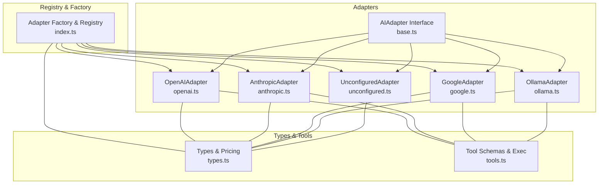
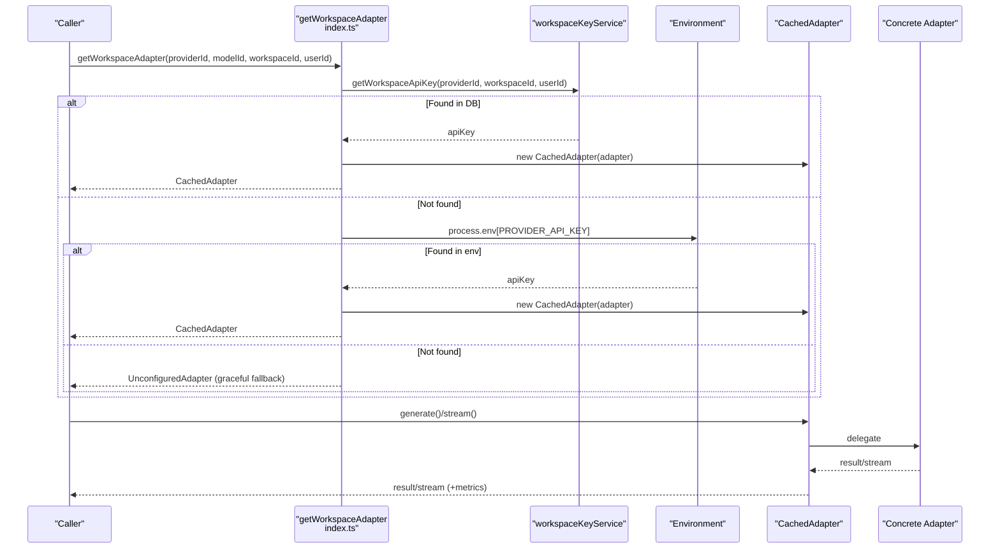
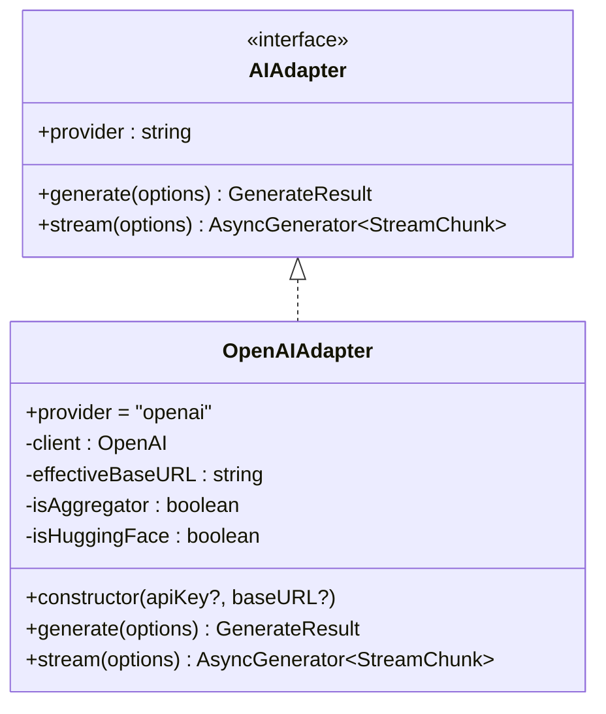
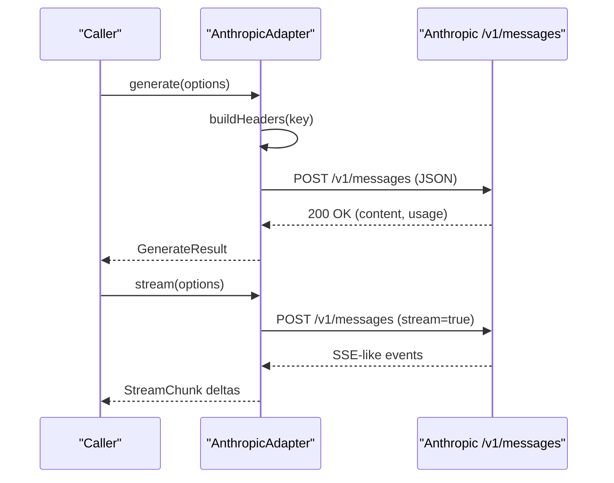
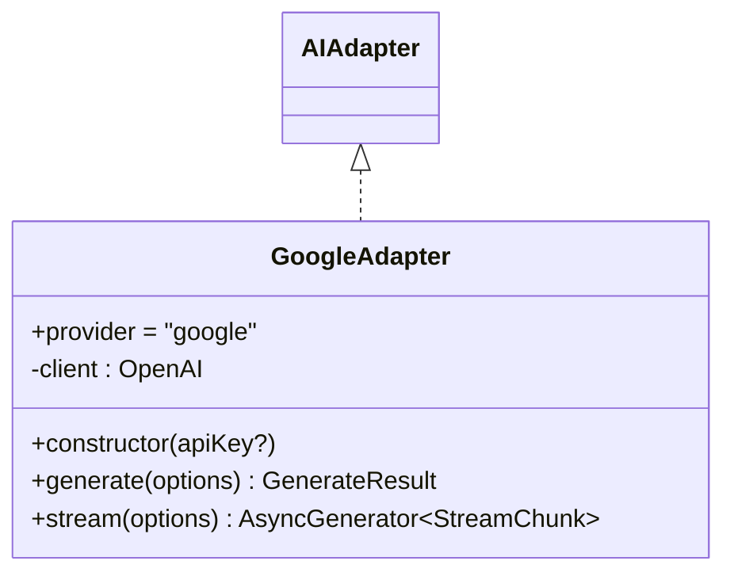
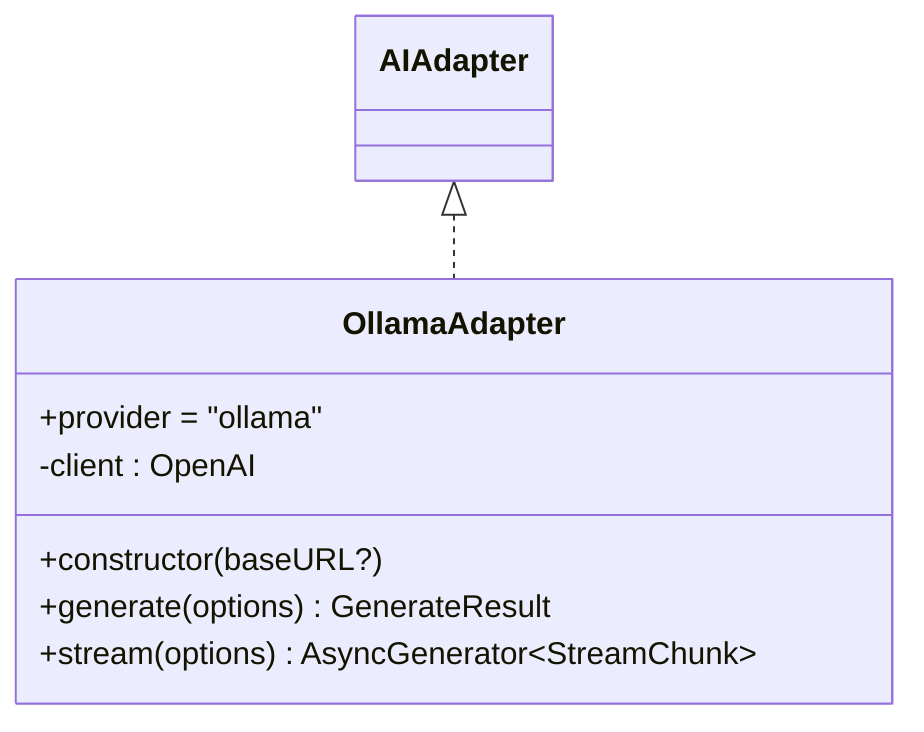
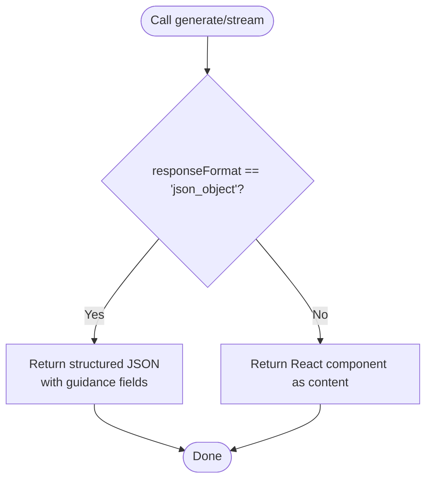
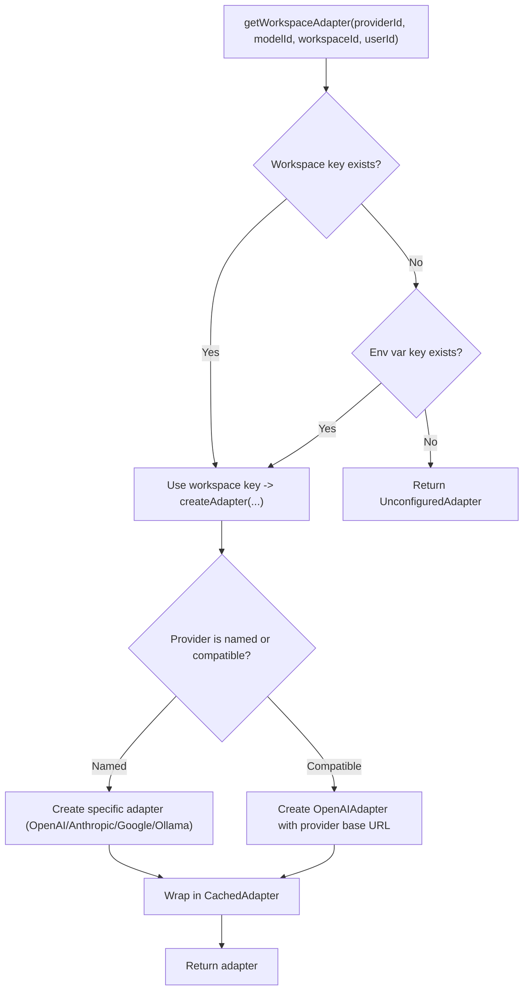
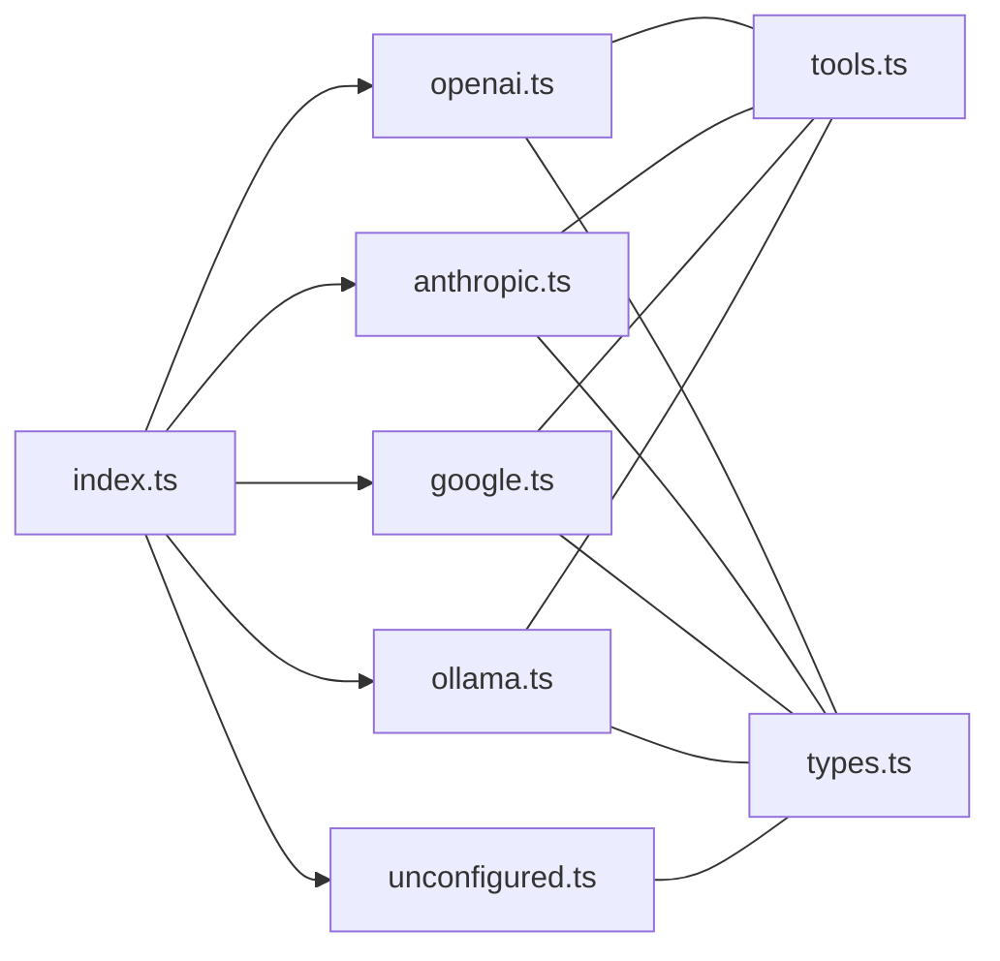

# Provider-Specific Implementations

<cite>
**Referenced Files in This Document**
- [base.ts](file://lib/ai/adapters/base.ts)
- [openai.ts](file://lib/ai/adapters/openai.ts)
- [anthropic.ts](file://lib/ai/adapters/anthropic.ts)
- [google.ts](file://lib/ai/adapters/google.ts)
- [ollama.ts](file://lib/ai/adapters/ollama.ts)
- [unconfigured.ts](file://lib/ai/adapters/unconfigured.ts)
- [index.ts](file://lib/ai/adapters/index.ts)
- [types.ts](file://lib/ai/types.ts)
- [tools.ts](file://lib/ai/tools.ts)
- [adapters.test.ts](file://__tests__/adapters.test.ts)
- [adapterIndex.test.ts](file://__tests__/adapterIndex.test.ts)
</cite>

## Table of Contents
1. [Introduction](#introduction)
2. [Project Structure](#project-structure)
3. [Core Components](#core-components)
4. [Architecture Overview](#architecture-overview)
5. [Detailed Component Analysis](#detailed-component-analysis)
6. [Dependency Analysis](#dependency-analysis)
7. [Performance Considerations](#performance-considerations)
8. [Troubleshooting Guide](#troubleshooting-guide)
9. [Conclusion](#conclusion)

## Introduction
This document explains the AI provider implementations and their adapter classes that power the UI engine. It covers the base AIAdapter interface, the concrete adapters for OpenAI, Anthropic, Google, Ollama, and the UnconfiguredAdapter. It also documents how OpenAI-compatible providers (Groq, LM Studio) are handled via the OpenAI adapter, and how the UnconfiguredAdapter provides graceful degradation when no credentials are available. The guide highlights provider-specific parameters, authentication flows, response handling, error management, and unique features such as tool calls and streaming.

## Project Structure
The AI adapter system is organized under lib/ai/adapters with a central factory and registry in index.ts. Each provider has its own adapter file implementing the shared AIAdapter interface. Supporting types and tool schemas live in lib/ai/types.ts and lib/ai/tools.ts respectively.

**Diagram sources**
- [index.ts:140-215](file://lib/ai/adapters/index.ts#L140-L215)
- [base.ts:50-72](file://lib/ai/adapters/base.ts#L50-L72)
- [openai.ts:36-222](file://lib/ai/adapters/openai.ts#L36-L222)
- [anthropic.ts:71-208](file://lib/ai/adapters/anthropic.ts#L71-L208)
- [google.ts:24-89](file://lib/ai/adapters/google.ts#L24-L89)
- [ollama.ts:21-86](file://lib/ai/adapters/ollama.ts#L21-L86)
- [unconfigured.ts:13-98](file://lib/ai/adapters/unconfigured.ts#L13-L98)
- [types.ts:19-55](file://lib/ai/types.ts#L19-L55)
- [tools.ts:47-79](file://lib/ai/tools.ts#L47-L79)

**Section sources**
- [index.ts:10-13](file://lib/ai/adapters/index.ts#L10-L13)
- [base.ts:11-26](file://lib/ai/adapters/base.ts#L11-L26)

## Core Components
- AIAdapter interface: Defines the provider-agnostic contract with generate() and stream().
- GenerateOptions: Shared input schema including model, messages, temperature, maxTokens, responseFormat, tools, and toolChoice.
- GenerateResult and StreamChunk: Unified output formats for content, optional toolCalls, and token usage.
- ProviderName: Canonical provider identifiers used across the system.

These types enable the rest of the application to remain provider-agnostic while adapters normalize provider-specific responses.

**Section sources**
- [base.ts:34-46](file://lib/ai/adapters/base.ts#L34-L46)
- [base.ts:50-72](file://lib/ai/adapters/base.ts#L50-L72)
- [types.ts:19-55](file://lib/ai/types.ts#L19-L55)
- [types.ts:59-67](file://lib/ai/types.ts#L59-L67)

## Architecture Overview
The adapter factory resolves credentials securely from workspace storage or environment variables, selects the appropriate adapter, and wraps it in a caching layer. OpenAI-compatible providers (Groq, LM Studio) are routed through the OpenAI adapter with provider-specific base URLs. Anthropic uses a native fetch-based API. Google leverages an OpenAI-compatible endpoint. Ollama targets a local OpenAI-compatible server. UnconfiguredAdapter provides graceful fallback when no credentials are present.

**Diagram sources**
- [index.ts:236-278](file://lib/ai/adapters/index.ts#L236-L278)
- [index.ts:140-215](file://lib/ai/adapters/index.ts#L140-L215)
- [index.ts:82-138](file://lib/ai/adapters/index.ts#L82-L138)

## Detailed Component Analysis

### OpenAIAdapter
- Purpose: Supports OpenAI models including reasoning models (o1/o3 series) and OpenAI-compatible aggregators and proxies (OpenRouter, Together.ai, HuggingFace, Groq).
- Authentication: Accepts an API key and optional base URL; auto-migrates deprecated HuggingFace endpoints to the current router endpoint.
- Special handling:
  - Reasoning models: omit temperature, use max_completion_tokens, avoid response_format and tools for certain variants.
  - Aggregators and proxies: disable response_format, tools, and tool_choice to prevent silent rejection.
  - HuggingFace: cap max_tokens conservatively to avoid 400 errors due to small output budgets.
  - System role: models without system role support merge system messages into the first user message.
- Tool calls: Converts unified tool definitions to OpenAI format and normalizes tool calls back to the unified schema.
- Streaming: Uses OpenAI SDK streaming with usage injection on the final chunk.

**Diagram sources**
- [base.ts:50-72](file://lib/ai/adapters/base.ts#L50-L72)
- [openai.ts:36-222](file://lib/ai/adapters/openai.ts#L36-L222)

**Section sources**
- [openai.ts:1-11](file://lib/ai/adapters/openai.ts#L1-L11)
- [openai.ts:23-32](file://lib/ai/adapters/openai.ts#L23-L32)
- [openai.ts:46-62](file://lib/ai/adapters/openai.ts#L46-L62)
- [openai.ts:64-157](file://lib/ai/adapters/openai.ts#L64-L157)
- [openai.ts:159-221](file://lib/ai/adapters/openai.ts#L159-L221)

### AnthropicAdapter
- Purpose: Calls the native Anthropic Messages API (/v1/messages) via fetch.
- Authentication: Requires ANTHROPIC_API_KEY; throws a clear error if missing.
- Special handling:
  - No /chat/completions endpoint; direct fetch to /v1/messages.
  - No response_format support; when JSON mode is requested, the instruction is appended to the system prompt.
  - Per-model output caps to avoid HTTP 400 errors.
  - System role support varies; merges system into the first user message when required.
- Streaming: Parses SSE-like events from the stream and yields deltas until completion.

**Diagram sources**
- [anthropic.ts:71-208](file://lib/ai/adapters/anthropic.ts#L71-L208)

**Section sources**
- [anthropic.ts:1-12](file://lib/ai/adapters/anthropic.ts#L1-L12)
- [anthropic.ts:75-87](file://lib/ai/adapters/anthropic.ts#L75-L87)
- [anthropic.ts:89-144](file://lib/ai/adapters/anthropic.ts#L89-L144)
- [anthropic.ts:147-207](file://lib/ai/adapters/anthropic.ts#L147-L207)

### GoogleAdapter
- Purpose: Uses Google AI Studio’s OpenAI-compatible endpoint to call Gemini models.
- Authentication: Uses GOOGLE_API_KEY or GEMINI_API_KEY; base URL is fixed.
- Special handling:
  - Google’s proxy rejects response_format; it is omitted when passed.
  - Tool calling is supported via OpenAI-compatible tool definitions.
- Streaming: Uses OpenAI SDK streaming.

**Diagram sources**
- [base.ts:50-72](file://lib/ai/adapters/base.ts#L50-L72)
- [google.ts:24-89](file://lib/ai/adapters/google.ts#L24-L89)

**Section sources**
- [google.ts:1-12](file://lib/ai/adapters/google.ts#L1-L12)
- [google.ts:28-33](file://lib/ai/adapters/google.ts#L28-L33)
- [google.ts:35-68](file://lib/ai/adapters/google.ts#L35-L68)
- [google.ts:71-88](file://lib/ai/adapters/google.ts#L71-L88)

### OllamaAdapter
- Purpose: Connects to a local OpenAI-compatible server exposed by Ollama/LM Studio/Groq/HuggingFace via base URL.
- Authentication: Uses a placeholder API key; relies on baseURL pointing to a local service.
- Special handling:
  - Supports response_format and tool calling when the underlying model supports them.
  - Works with any model pulled via Ollama.
- Streaming: Uses OpenAI SDK streaming.

**Diagram sources**
- [base.ts:50-72](file://lib/ai/adapters/base.ts#L50-L72)
- [ollama.ts:21-86](file://lib/ai/adapters/ollama.ts#L21-L86)

**Section sources**
- [ollama.ts:1-9](file://lib/ai/adapters/ollama.ts#L1-L9)
- [ollama.ts:25-30](file://lib/ai/adapters/ollama.ts#L25-L30)
- [ollama.ts:32-65](file://lib/ai/adapters/ollama.ts#L32-L65)
- [ollama.ts:68-85](file://lib/ai/adapters/ollama.ts#L68-L85)

### UnconfiguredAdapter
- Purpose: Graceful fallback when no API keys are available. Prevents server crashes and surfaces actionable guidance to the user.
- Behavior:
  - JSON mode: Returns a structured JSON suitable for intent/thinking schemas with clear guidance.
  - Non-JSON mode: Returns a React component as a string to render a friendly “configure me” UI.
  - Streaming: Emits a minimal React component piece by piece.
- Role: Ensures the system remains usable even without credentials, guiding users to the settings panel.

**Diagram sources**
- [unconfigured.ts:16-74](file://lib/ai/adapters/unconfigured.ts#L16-L74)
- [unconfigured.ts:76-97](file://lib/ai/adapters/unconfigured.ts#L76-L97)

**Section sources**
- [unconfigured.ts:1-12](file://lib/ai/adapters/unconfigured.ts#L1-L12)
- [unconfigured.ts:16-74](file://lib/ai/adapters/unconfigured.ts#L16-L74)
- [unconfigured.ts:76-97](file://lib/ai/adapters/unconfigured.ts#L76-L97)

### Adapter Factory and Provider Routing
- Provider detection: Explicit provider selection is preferred; otherwise detects from model name (supports OpenAI, Anthropic, Google, Groq, and defaults to Ollama).
- OpenAI-compatible providers: Groq and LM Studio are routed through the OpenAI adapter with provider-specific base URLs.
- Credential resolution: Workspace keys take precedence; environment variables are the fallback; missing keys trigger a ConfigurationError or return UnconfiguredAdapter.
- Caching: All adapters are wrapped in a CachedAdapter that caches results and streams, emitting metrics.

**Diagram sources**
- [index.ts:236-278](file://lib/ai/adapters/index.ts#L236-L278)
- [index.ts:146-215](file://lib/ai/adapters/index.ts#L146-L215)
- [index.ts:42-48](file://lib/ai/adapters/index.ts#L42-L48)
- [index.ts:56-64](file://lib/ai/adapters/index.ts#L56-L64)
- [index.ts:82-138](file://lib/ai/adapters/index.ts#L82-L138)

**Section sources**
- [index.ts:42-64](file://lib/ai/adapters/index.ts#L42-L64)
- [index.ts:146-215](file://lib/ai/adapters/index.ts#L146-L215)
- [index.ts:236-278](file://lib/ai/adapters/index.ts#L236-L278)
- [index.ts:82-138](file://lib/ai/adapters/index.ts#L82-L138)

## Dependency Analysis
- Cohesion: Each adapter encapsulates provider-specific logic and conversions.
- Coupling: Adapters depend on shared types and tool schemas; the factory manages provider selection and credentials.
- External integrations:
  - OpenAI SDK for OpenAIAdapter, GoogleAdapter, and OllamaAdapter.
  - Native fetch for AnthropicAdapter.
  - Environment variables for credentials.
- Circular dependencies: None observed among adapters and the factory.

**Diagram sources**
- [index.ts:19-23](file://lib/ai/adapters/index.ts#L19-L23)
- [openai.ts:15-21](file://lib/ai/adapters/openai.ts#L15-L21)
- [anthropic.ts:16-17](file://lib/ai/adapters/anthropic.ts#L16-L17)
- [google.ts:16-22](file://lib/ai/adapters/google.ts#L16-L22)
- [ollama.ts:13-19](file://lib/ai/adapters/ollama.ts#L13-L19)
- [types.ts:14-26](file://lib/ai/types.ts#L14-L26)

**Section sources**
- [index.ts:19-23](file://lib/ai/adapters/index.ts#L19-L23)
- [openai.ts:15-21](file://lib/ai/adapters/openai.ts#L15-L21)
- [anthropic.ts:16-17](file://lib/ai/adapters/anthropic.ts#L16-L17)
- [google.ts:16-22](file://lib/ai/adapters/google.ts#L16-L22)
- [ollama.ts:13-19](file://lib/ai/adapters/ollama.ts#L13-L19)
- [types.ts:14-26](file://lib/ai/types.ts#L14-L26)

## Performance Considerations
- Caching: CachedAdapter stores full results and streams, reducing repeated calls and enabling cached metrics emission.
- Streaming: Providers that support usage injection (OpenAIAdapter) yield usage on the final chunk; others omit it.
- Token caps: Provider-specific caps (Anthropic, HuggingFace) prevent 400 errors and reduce retries.
- Tool calls: Conversion overhead is minimal; adapters convert tool definitions and normalize tool calls uniformly.

[No sources needed since this section provides general guidance]

## Troubleshooting Guide
- Missing API key:
  - OpenAI/Anthropic/Google require keys; the factory throws a ConfigurationError or returns UnconfiguredAdapter depending on context.
  - Verify environment variables and workspace settings.
- Anthropic-specific:
  - Ensure ANTHROPIC_API_KEY is set; the adapter validates presence and throws a clear error if missing.
  - JSON mode is not natively supported; the adapter appends a JSON-only instruction to the system prompt.
- OpenAI-compatible providers:
  - For Groq/LM Studio/HuggingFace/OpenRouter/Together.ai, confirm the base URL and key.
  - HuggingFace endpoints are auto-migrated; ensure the correct router endpoint is used.
- Streaming issues:
  - OpenAIAdapter requires stream_options; AnthropicAdapter expects SSE-like events; ensure the client consumes the stream properly.
- Local models:
  - OllamaAdapter depends on a reachable local server; on platforms where local daemons are unreachable, UnconfiguredAdapter is returned.

**Section sources**
- [index.ts:159-162](file://lib/ai/adapters/index.ts#L159-L162)
- [index.ts:175-178](file://lib/ai/adapters/index.ts#L175-L178)
- [index.ts:182-184](file://lib/ai/adapters/index.ts#L182-L184)
- [anthropic.ts:79-87](file://lib/ai/adapters/anthropic.ts#L79-L87)
- [openai.ts:48-51](file://lib/ai/adapters/openai.ts#L48-L51)
- [index.ts:204-207](file://lib/ai/adapters/index.ts#L204-L207)

## Conclusion
The adapter system provides a robust, provider-agnostic interface for multiple AI backends. Each adapter encapsulates provider-specific quirks, ensuring consistent input/output semantics and reliable streaming. The factory enforces secure credential resolution and graceful fallback, while caching improves performance. OpenAI-compatible providers are unified under the OpenAI adapter with careful parameter normalization, and Anthropic’s native API is supported via direct fetch. UnconfiguredAdapter ensures usability without credentials by returning helpful guidance and UI components.