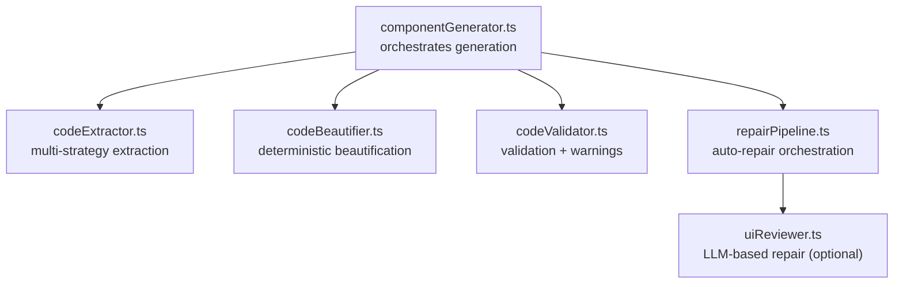
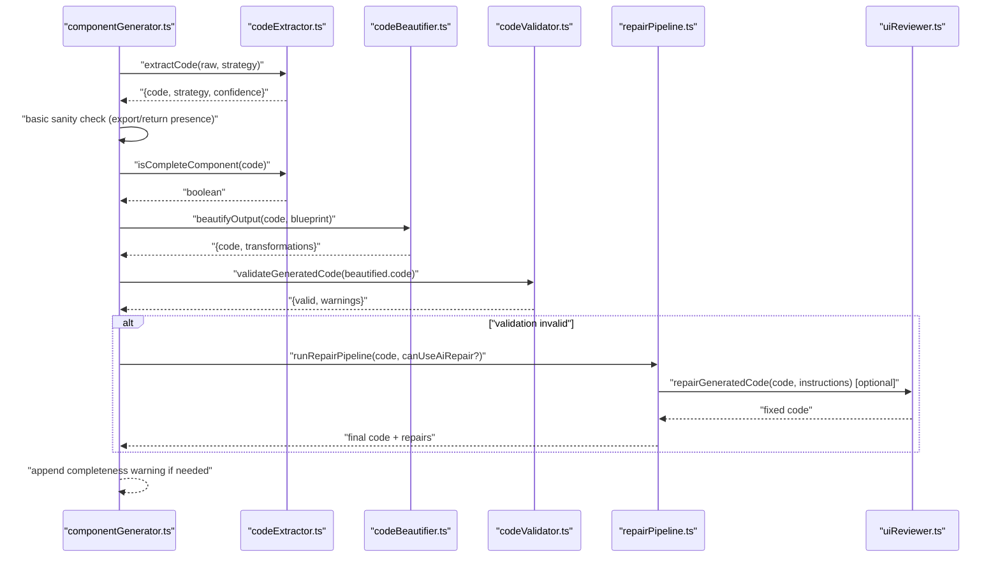
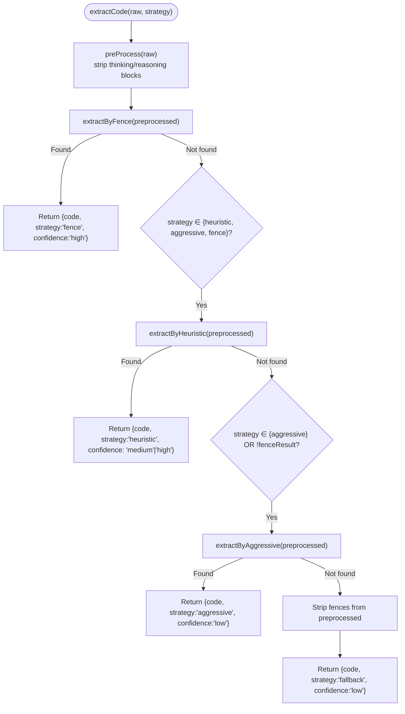
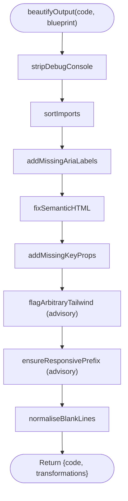
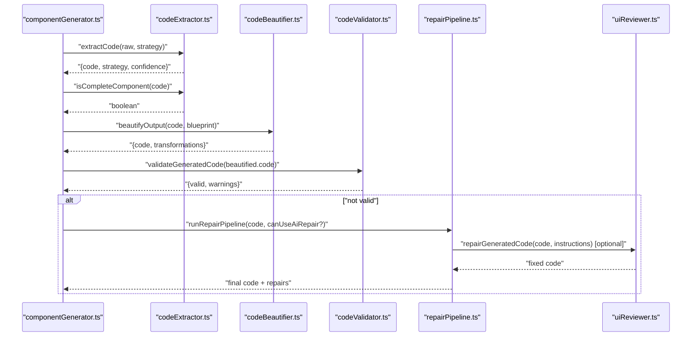
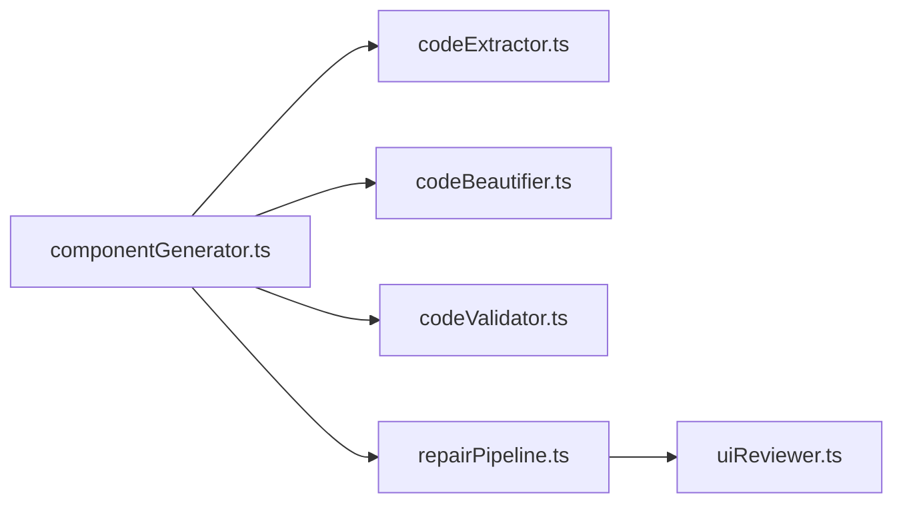

# Code Extraction & Beautification

<cite>
**Referenced Files in This Document**
- [codeExtractor.ts](file://lib/ai/codeExtractor.ts)
- [codeBeautifier.ts](file://lib/intelligence/codeBeautifier.ts)
- [componentGenerator.ts](file://lib/ai/componentGenerator.ts)
- [repairPipeline.ts](file://lib/intelligence/repairPipeline.ts)
- [codeValidator.ts](file://lib/intelligence/codeValidator.ts)
- [uiReviewer.ts](file://lib/ai/uiReviewer.ts)
</cite>

## Table of Contents
1. [Introduction](#introduction)
2. [Project Structure](#project-structure)
3. [Core Components](#core-components)
4. [Architecture Overview](#architecture-overview)
5. [Detailed Component Analysis](#detailed-component-analysis)
6. [Dependency Analysis](#dependency-analysis)
7. [Performance Considerations](#performance-considerations)
8. [Troubleshooting Guide](#troubleshooting-guide)
9. [Conclusion](#conclusion)

## Introduction
This document explains the code extraction and beautification phases of the generation pipeline. It covers:
- A model-agnostic extraction system that applies multiple strategies to reliably extract generated code from AI responses.
- A deterministic beautification pipeline that normalizes code structure and improves accessibility and maintainability.
- Completeness validation that checks for essential code elements.
- An extraction confidence scoring system to flag potentially problematic outputs.
- Implementation specifics, transformation rules, and validation criteria.
- Examples of successful extraction scenarios and troubleshooting steps for failures.

## Project Structure
The extraction and beautification logic lives in dedicated modules:
- Extraction: lib/ai/codeExtractor.ts
- Beautification: lib/intelligence/codeBeautifier.ts
- Orchestration and validation: lib/ai/componentGenerator.ts, lib/intelligence/codeValidator.ts, lib/intelligence/repairPipeline.ts, lib/ai/uiReviewer.ts

**Diagram sources**
- [componentGenerator.ts:330-351](file://lib/ai/componentGenerator.ts#L330-L351)
- [codeExtractor.ts:218-262](file://lib/ai/codeExtractor.ts#L218-L262)
- [codeBeautifier.ts:214-232](file://lib/intelligence/codeBeautifier.ts#L214-L232)
- [codeValidator.ts](file://lib/intelligence/codeValidator.ts)
- [repairPipeline.ts](file://lib/intelligence/repairPipeline.ts)
- [uiReviewer.ts](file://lib/ai/uiReviewer.ts)

**Section sources**
- [componentGenerator.ts:330-351](file://lib/ai/componentGenerator.ts#L330-L351)

## Core Components
- Extraction module: Implements three strategies (fenced code blocks, heuristic parsing, aggressive extraction) with confidence scoring and completeness checks.
- Beautification module: Applies a fixed sequence of deterministic transformations to normalize code structure and improve accessibility.
- Orchestration: Integrates extraction, beautification, validation, and optional repair into a single pipeline.

**Section sources**
- [codeExtractor.ts:24-28](file://lib/ai/codeExtractor.ts#L24-L28)
- [codeExtractor.ts:218-262](file://lib/ai/codeExtractor.ts#L218-L262)
- [codeBeautifier.ts:29-34](file://lib/intelligence/codeBeautifier.ts#L29-L34)
- [codeBeautifier.ts:214-232](file://lib/intelligence/codeBeautifier.ts#L214-L232)

## Architecture Overview
The generation pipeline stages for extraction and beautification:

**Diagram sources**
- [componentGenerator.ts:329-380](file://lib/ai/componentGenerator.ts#L329-L380)
- [codeExtractor.ts:218-262](file://lib/ai/codeExtractor.ts#L218-L262)
- [codeExtractor.ts:268-279](file://lib/ai/codeExtractor.ts#L268-L279)
- [codeBeautifier.ts:214-232](file://lib/intelligence/codeBeautifier.ts#L214-L232)
- [codeValidator.ts](file://lib/intelligence/codeValidator.ts)
- [repairPipeline.ts](file://lib/intelligence/repairPipeline.ts)
- [uiReviewer.ts](file://lib/ai/uiReviewer.ts)

## Detailed Component Analysis

### Extraction Module
The extraction module implements a multi-strategy approach designed to handle diverse model output formats:
- Strategy 1: Fenced code blocks
  - Detects fenced code blocks with language labels and bare fences.
  - Validates candidates heuristically to avoid returning prose.
  - Confidence: high when fenced output is detected.
- Strategy 2: Heuristic parsing
  - Locates the first line that starts a React/TSX construct and slices from there.
  - Strips trailing explanations and cleans up dangling closing fences.
  - Confidence: medium when model previously emitted fenced content; high otherwise.
- Strategy 3: Aggressive extraction
  - Removes known preamble and explanation patterns, strips remaining fences, and returns any code-like content.
  - Confidence: low.
- Fallback
  - Returns stripped raw content with low confidence.

**Diagram sources**
- [codeExtractor.ts:218-262](file://lib/ai/codeExtractor.ts#L218-L262)
- [codeExtractor.ts:110-128](file://lib/ai/codeExtractor.ts#L110-L128)
- [codeExtractor.ts:138-171](file://lib/ai/codeExtractor.ts#L138-L171)
- [codeExtractor.ts:181-203](file://lib/ai/codeExtractor.ts#L181-L203)

Implementation highlights:
- Preprocessing removes reasoning blocks to reduce noise.
- Heuristic detection targets React/TSX constructs and filters out non-code lines.
- Aggressive mode is a last resort for tiny or unreliable models.
- Confidence scoring helps downstream decisions (monitoring, repair eligibility).

Extraction confidence scoring:
- high: fenced output detected.
- medium: heuristic succeeded after a previous fenced attempt.
- low: heuristic failed and aggressive or fallback was used.

Completeness validation:
- Checks for presence of export/return and balanced braces to detect truncation or missing exports.

**Section sources**
- [codeExtractor.ts:88-101](file://lib/ai/codeExtractor.ts#L88-L101)
- [codeExtractor.ts:110-128](file://lib/ai/codeExtractor.ts#L110-L128)
- [codeExtractor.ts:138-171](file://lib/ai/codeExtractor.ts#L138-L171)
- [codeExtractor.ts:181-203](file://lib/ai/codeExtractor.ts#L181-L203)
- [codeExtractor.ts:218-262](file://lib/ai/codeExtractor.ts#L218-L262)
- [codeExtractor.ts:268-279](file://lib/ai/codeExtractor.ts#L268-L279)

### Beautification Module
The beautification pipeline applies a deterministic, logic-preserving sequence of transformations to normalize code structure and improve accessibility:
1. Strip debug console statements.
2. Sort and normalize import blocks by dependency layer.
3. Add missing aria-label to icon-only buttons.
4. Replace 
 with <button> for semantic HTML.
5. Add missing key props to array.map() renders.
6. Flag arbitrary Tailwind values (advisory).
7. Ensure at least one responsive Tailwind prefix is present (advisory).
8. Normalize excessive blank lines.

**Diagram sources**
- [codeBeautifier.ts:192-201](file://lib/intelligence/codeBeautifier.ts#L192-L201)
- [codeBeautifier.ts:214-232](file://lib/intelligence/codeBeautifier.ts#L214-L232)

Design rules:
- Never change business logic—only format and structure.
- Never call an LLM—this is 100% deterministic.
- When in doubt, skip the transformation.
- Every transformation must be reversible in principle.

Accessibility and safety:
- Replaces non-semantic 
 with <button> where safe.
- Adds aria-label to icon-only buttons to improve screen reader support.
- Flags arbitrary Tailwind values and missing responsive prefixes as advisories.

**Section sources**
- [codeBeautifier.ts:1-25](file://lib/intelligence/codeBeautifier.ts#L1-L25)
- [codeBeautifier.ts:40-49](file://lib/intelligence/codeBeautifier.ts#L40-L49)
- [codeBeautifier.ts:51-94](file://lib/intelligence/codeBeautifier.ts#L51-L94)
- [codeBeautifier.ts:96-116](file://lib/intelligence/codeBeautifier.ts#L96-L116)
- [codeBeautifier.ts:118-137](file://lib/intelligence/codeBeautifier.ts#L118-L137)
- [codeBeautifier.ts:139-158](file://lib/intelligence/codeBeautifier.ts#L139-L158)
- [codeBeautifier.ts:160-170](file://lib/intelligence/codeBeautifier.ts#L160-L170)
- [codeBeautifier.ts:172-180](file://lib/intelligence/codeBeautifier.ts#L172-L180)
- [codeBeautifier.ts:182-188](file://lib/intelligence/codeBeautifier.ts#L182-L188)
- [codeBeautifier.ts:214-232](file://lib/intelligence/codeBeautifier.ts#L214-L232)

### Orchestration and Validation
The generation orchestrator coordinates extraction, beautification, and validation:
- Extract code using the model-aware strategy.
- Perform a basic sanity check for export/return presence.
- Validate completeness using brace balancing and export/return presence.
- Beautify the extracted code deterministically.
- Validate the beautified code and collect warnings.
- Optionally repair using a repair pipeline that can call an LLM-based reviewer depending on model tier and repair strategy.

**Diagram sources**
- [componentGenerator.ts:329-380](file://lib/ai/componentGenerator.ts#L329-L380)
- [codeExtractor.ts:218-262](file://lib/ai/codeExtractor.ts#L218-L262)
- [codeExtractor.ts:268-279](file://lib/ai/codeExtractor.ts#L268-L279)
- [codeBeautifier.ts:214-232](file://lib/intelligence/codeBeautifier.ts#L214-L232)
- [codeValidator.ts](file://lib/intelligence/codeValidator.ts)
- [repairPipeline.ts](file://lib/intelligence/repairPipeline.ts)
- [uiReviewer.ts](file://lib/ai/uiReviewer.ts)

**Section sources**
- [componentGenerator.ts:329-380](file://lib/ai/componentGenerator.ts#L329-L380)

## Dependency Analysis
- componentGenerator.ts depends on:
  - codeExtractor.ts for extraction and completeness checks.
  - codeBeautifier.ts for deterministic normalization.
  - codeValidator.ts for structural and style validation.
  - repairPipeline.ts for automated repair orchestration.
  - uiReviewer.ts for optional LLM-based repair.

**Diagram sources**
- [componentGenerator.ts:330-351](file://lib/ai/componentGenerator.ts#L330-L351)
- [codeExtractor.ts:218-262](file://lib/ai/codeExtractor.ts#L218-L262)
- [codeBeautifier.ts:214-232](file://lib/intelligence/codeBeautifier.ts#L214-L232)
- [codeValidator.ts](file://lib/intelligence/codeValidator.ts)
- [repairPipeline.ts](file://lib/intelligence/repairPipeline.ts)
- [uiReviewer.ts](file://lib/ai/uiReviewer.ts)

**Section sources**
- [componentGenerator.ts:330-351](file://lib/ai/componentGenerator.ts#L330-L351)

## Performance Considerations
- Extraction strategies are ordered by reliability to minimize wasted computation: fenced first, then heuristic, then aggressive.
- Beautification runs a fixed, small set of regex-based transformations that are O(n) in the length of the code.
- Validation is lightweight and focuses on structural indicators rather than full AST parsing.
- Repair is invoked conditionally based on validation results and model tier, avoiding unnecessary LLM calls.

## Troubleshooting Guide
Common extraction failures and remedies:
- Fenced output not detected:
  - Cause: Model did not wrap code in fences or used bare fences.
  - Action: Ensure the model profile selects a strategy that includes heuristic or aggressive extraction.
  - Evidence: Confidence score falls back to medium/high depending on strategy.
- Heuristic parsing fails:
  - Cause: Preamble or trailing explanation patterns not recognized, or code does not start with a React/TSX construct.
  - Action: Verify the prompt encourages fenced output or direct code; adjust preamble/trailing explanation patterns if needed.
  - Evidence: Strategy advances to aggressive extraction.
- Aggressive extraction returns noisy content:
  - Cause: Tiny or unreliable models echoing prompts or mixing prose and code.
  - Action: Increase model tier or refine prompts to reduce noise; monitor confidence scores.
  - Evidence: Low confidence and stripped content returned.
- Completeness validation fails:
  - Cause: Missing export, missing return, or unbalanced braces.
  - Action: Run repair pipeline; consider enabling LLM-based repair for eligible tiers.
  - Evidence: Warning appended indicating potential incompleteness.

Validation and repair flow:
- If validation reports invalid code, the repair pipeline decides whether to use LLM-based repair based on the configured repair strategy and model tier.
- Repairs are logged and applied to produce a final code artifact.

**Section sources**
- [componentGenerator.ts:333-340](file://lib/ai/componentGenerator.ts#L333-L340)
- [componentGenerator.ts:359-375](file://lib/ai/componentGenerator.ts#L359-L375)
- [codeExtractor.ts:268-279](file://lib/ai/codeExtractor.ts#L268-L279)
- [codeValidator.ts](file://lib/intelligence/codeValidator.ts)
- [repairPipeline.ts](file://lib/intelligence/repairPipeline.ts)
- [uiReviewer.ts](file://lib/ai/uiReviewer.ts)

## Conclusion
The extraction and beautification pipeline provides a robust, model-agnostic foundation for generating high-quality React components:
- Extraction strategies adapt to model output styles with confidence scoring.
- Deterministic beautification ensures consistent structure and accessibility improvements.
- Completeness validation and optional repair guarantee functional artifacts across tiers.
- The orchestration integrates these steps seamlessly, enabling scalable generation with predictable quality.