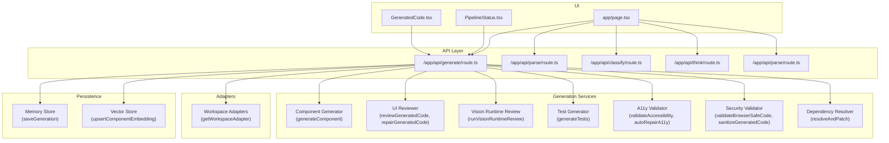
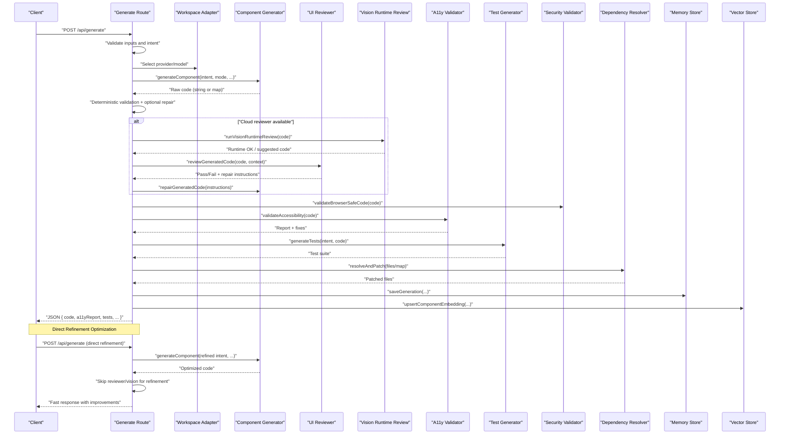
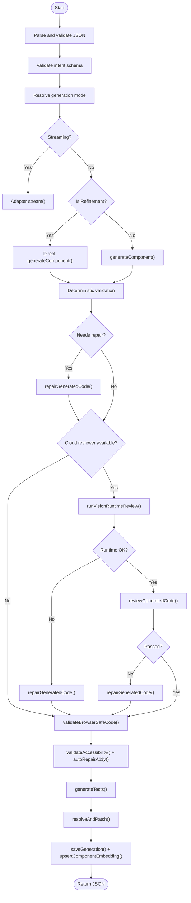
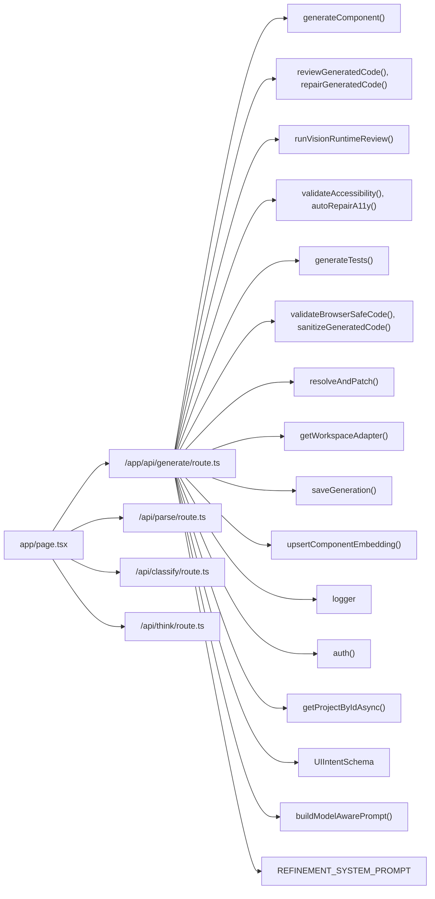

# Core Generation Pipeline

<cite>
**Referenced Files in This Document**
- [route.ts](file://app/api/generate/route.ts)
- [componentGenerator.ts](file://lib/ai/componentGenerator.ts)
- [promptBuilder.ts](file://lib/ai/promptBuilder.ts)
- [prompts.ts](file://lib/ai/prompts.ts)
- [page.tsx](file://app/page.tsx)
- [GeneratedCode.tsx](file://components/GeneratedCode.tsx)
- [PipelineStatus.tsx](file://components/PipelineStatus.tsx)
- [memory.ts](file://lib/ai/memory.ts)
- [schemas.ts](file://lib/validation/schemas.ts)
- [a11yValidator.test.ts](file://__tests__/a11yValidator.test.ts)
- [adapters.test.ts](file://__tests__/adapters.test.ts)
- [adaptersIndex.test.ts](file://__tests__/adaptersIndex.test.ts)
- [anthropicAdapter.test.ts](file://__tests__/anthropicAdapter.test.ts)
- [base.test.ts](file://__tests__/base.test.ts)
- [schemas.test.ts](file://__tests__/schemas.test.ts)
- [workspaceKeyService.test.ts](file://__tests__/workspaceKeyService.test.ts)
- [README.md](file://README.md)
- [ARCHITECTURE.md](file://docs/ARCHITECTURE.md)
- [ENV_SETUP.md](file://docs/ENV_SETUP.md)
</cite>

## Update Summary
**Changes Made**
- Updated refinement workflow section to reflect new direct refinement optimization
- Added new section documenting the direct refinement optimization that bypasses classify, think, and parse phases
- Updated generation endpoint orchestration to include refinement optimization details
- Enhanced prompt engineering strategies to cover refinement-specific optimizations
- Updated UI integration section to reflect direct refinement workflow improvements

## Table of Contents
1. [Introduction](#introduction)
2. [Project Structure](#project-structure)
3. [Core Components](#core-components)
4. [Architecture Overview](#architecture-overview)
5. [Detailed Component Analysis](#detailed-component-analysis)
6. [Dependency Analysis](#dependency-analysis)
7. [Performance Considerations](#performance-considerations)
8. [Troubleshooting Guide](#troubleshooting-guide)
9. [Conclusion](#conclusion)
10. [Appendices](#appendices)

## Introduction
This document describes the core generation pipeline that orchestrates multi-stage AI-driven UI component creation. It covers the full workflow from intent parsing and model selection to final code delivery, including blueprint selection, model resolution, knowledge injection, prompt construction, tool execution loops, code extraction, beautification, and validation. It also explains the tiered pipeline configuration system that adapts generation parameters based on model capabilities and quality tiers, and details prompt engineering strategies, token budget enforcement, generation loop mechanics, tool call protocols, and error handling. The pipeline now includes an optimized direct refinement workflow that provides approximately 3x faster response times by bypassing the classify, think, and parse phases for iterative improvements.

## Project Structure
The generation pipeline is primarily implemented in a single API endpoint that coordinates multiple internal services and validations. Supporting UI components visualize pipeline progress and present generated code. The tests under __tests__ validate key behaviors of adapters, accessibility, and schemas used by the pipeline.

**Diagram sources**
- [route.ts](file://app/api/generate/route.ts)
- [componentGenerator.ts](file://lib/ai/componentGenerator.ts)
- [GeneratedCode.tsx](file://components/GeneratedCode.tsx)
- [PipelineStatus.tsx](file://components/PipelineStatus.tsx)
- [page.tsx](file://app/page.tsx)

**Section sources**
- [route.ts](file://app/api/generate/route.ts)
- [GeneratedCode.tsx](file://components/GeneratedCode.tsx)
- [PipelineStatus.tsx](file://components/PipelineStatus.tsx)

## Core Components
- Generation Endpoint: Orchestrates the entire pipeline, validates inputs, selects adapters, streams or executes generation, applies deterministic and accessibility fixes, runs optional reviewer and vision checks, sanitizes and validates browser safety, generates tests, resolves dependencies, persists results, and returns structured output.
- Component Generator: Produces React/Tailwind components or apps from structured intents and optional refinement context.
- Reviewer and Vision Review: Optional expert critique and runtime rendering checks to improve code quality and reliability.
- Accessibility Validator and Auto-Repair: Enforces WCAG AA rules and automatically repairs common issues.
- Test Generator: Creates automated tests for the generated component.
- Security Validator and Sanitizer: Ensures generated code is safe for browser environments.
- Dependency Resolver: Resolves cross-file dependencies and patches imports/exports for multi-file outputs.
- Adapters: Provider-specific clients that execute model calls and streaming.
- Persistence: Saves generations and embeddings for future retrieval and learning.
- Direct Refinement Optimization: Enhanced workflow that bypasses classify, think, and parse phases for faster refinement operations.

**Section sources**
- [route.ts](file://app/api/generate/route.ts)

## Architecture Overview
The pipeline is a controlled, asynchronous orchestration that balances quality and performance. It supports both streaming and batch modes, with optional expert review and vision checks disabled for local or low-cost providers to reduce latency and cost. The enhanced refinement workflow now provides direct access to the generation endpoint for iterative improvements, significantly reducing response times.

**Diagram sources**
- [route.ts](file://app/api/generate/route.ts)

## Detailed Component Analysis

### Generation Endpoint Orchestration
- Input validation: JSON parsing, presence of intent, optional prompt validation, and mode validation.
- Intent parsing: Zod schema validation for structured intent.
- Local model detection: Heuristics to detect Ollama/LM Studio/Groq-compatible providers or localhost/cloud key absence to skip expensive reviewer/vision steps.
- Streaming path: Uses provider adapter to stream raw text deltas for real-time display.
- Batch path: Executes the full pipeline with optional expert review and vision checks, parallel A11y and tests, dependency resolution, persistence, and embedding updates.
- Safety and security: Browser-safe validation and sanitizer to prevent unsafe constructs.
- Output: Structured JSON with code, accessibility report, tests, critique metadata, and generator metadata.
- **Updated**: Direct refinement optimization: When `intent.isRefinement` is true, the pipeline bypasses the classify, think, and parse phases, directly calling the component generator with merged intent descriptions and refinement instructions for approximately 3x faster response times.

**Diagram sources**
- [route.ts](file://app/api/generate/route.ts)

**Section sources**
- [route.ts](file://app/api/generate/route.ts)

### Direct Refinement Optimization
The refinement workflow has been enhanced with a direct optimization that bypasses the traditional classify, think, and parse phases for significantly faster response times. This optimization provides approximately 3x faster refinement operations by:

- **Bypassing classification**: Direct refinement requests skip the `/api/classify` endpoint entirely
- **Eliminating planning**: The think phase is bypassed, avoiding the `/api/think` endpoint overhead
- **Skipping parsing**: The parse phase is eliminated, removing the `/api/parse` endpoint call
- **Direct generation**: Refinement requests go directly to `/api/generate` with merged intent descriptions
- **Optimized context**: Previous project code and manifest are injected directly into the refinement context

The direct refinement workflow follows these steps:
1. User submits refinement prompt in the IDE
2. Frontend merges refinement prompt into existing intent description
3. Direct POST request to `/api/generate` with `isRefinement: true`
4. Backend bypasses reviewer and vision checks for refinement
5. Component generator processes refined intent directly
6. Optimized code returned with minimal latency

**Section sources**
- [page.tsx](file://app/page.tsx)
- [route.ts](file://app/api/generate/route.ts)
- [componentGenerator.ts](file://lib/ai/componentGenerator.ts)

### Tiered Pipeline Configuration and Model Resolution
- Provider and model selection: The endpoint resolves a workspace-scoped adapter using the provider and model supplied by the client. The client may supply provider and model; otherwise defaults are resolved via workspace configuration.
- Local model detection: The pipeline detects local/Ollama/LM Studio/Groq-compatible providers or environments without cloud keys and disables the reviewer and vision review to reduce latency and cost.
- Reviewer override: When a provider is explicitly chosen by the user, the reviewer uses the same provider/provider key/baseUrl to avoid quota or key conflicts.
- Token budget enforcement: The endpoint passes a configurable maxTokens to the adapter stream or generation call, enabling token budget control per request.
- **Updated**: Refinement optimization: For refinement requests, the pipeline automatically skips reviewer and vision checks to maximize speed while maintaining quality.

Implementation specifics:
- Provider selection and adapter resolution are delegated to a workspace-aware adapter factory.
- The pipeline sets a global maxDuration for the endpoint to bound total execution time.
- For streaming, the endpoint constructs a system message and a user message and streams deltas directly from the adapter.
- **Updated**: Refinement context handling: The pipeline optimizes memory usage by skipping RAG knowledge injection for refinement requests.

**Section sources**
- [route.ts](file://app/api/generate/route.ts)

### Prompt Engineering Strategies
- System message: A concise, focused instruction tailored for React/Tailwind component generation, instructing the model to return raw TSX without markdown fences.
- User message: Either a provided prompt or a default simple prompt for basic components.
- Context fitting: The pipeline optionally injects refinement context from a previous project when performing component refinement.
- Token budget enforcement: The endpoint forwards maxTokens to the adapter to constrain generation length and cost.
- **Updated**: Refinement system prompt: Specialized refinement prompt that focuses on targeted improvements while maintaining existing code structure and accessibility features.
- **Updated**: Direct refinement optimization: Merges refinement instructions directly into the intent description for seamless processing.

**Section sources**
- [route.ts](file://app/api/generate/route.ts)
- [promptBuilder.ts](file://lib/ai/promptBuilder.ts)
- [prompts.ts](file://lib/ai/prompts.ts)

### Tool Call Protocols and Generation Loop
- Generation loop: The endpoint calls the component generator with intent, mode, model, maxTokens, refinement context, and workspace identifiers. The generator returns either a single code string or a file map for multi-file outputs.
- Deterministic validation: The pipeline performs a fast, deterministic syntax check before invoking expensive reviewer calls.
- Reviewer and vision review: When reviewer is enabled, the pipeline runs a vision runtime review to detect headless rendering crashes, followed by a textual review. If either fails, it repairs the code and records review metadata.
- Parallelization: Accessibility validation and test generation run concurrently to reduce total latency.
- Dependency resolution: After A11y repairs, the pipeline merges the repaired primary file back into a multi-file map and resolves dependencies across files.
- **Updated**: Refinement optimization: For refinement requests, the pipeline bypasses reviewer and vision checks entirely, focusing solely on applying targeted improvements to existing code.

**Section sources**
- [route.ts](file://app/api/generate/route.ts)

### Error Handling Mechanisms
- Input validation failures: Returns structured 400 errors with reasons and suggestions.
- Generation failures: Returns 422 with the error from the generator.
- Reviewer/vision failures: Logged warnings; the pipeline continues with original code to preserve validity.
- Safety violations: Returns 422 with a list of unsafe patterns.
- Unexpected errors: Returns 500 with generic message.
- Streaming errors: Emits a delta with an error marker and closes the stream.
- **Updated**: Refinement error handling: Direct refinement requests maintain the same error handling patterns as regular generation, ensuring consistent user experience.

**Section sources**
- [route.ts](file://app/api/generate/route.ts)

### UI Integration
- GeneratedCode component: Displays the final code with copy/download actions and a dark-themed editor.
- PipelineStatus component: Visualizes pipeline stages (parsing, generating, validating, testing, preview) with active, complete, and error states.
- **Updated**: Direct refinement UI: The IDE now provides a dedicated refinement workflow that bypasses the traditional pipeline stages, showing immediate feedback for iterative improvements.

**Section sources**
- [GeneratedCode.tsx](file://components/GeneratedCode.tsx)
- [PipelineStatus.tsx](file://components/PipelineStatus.tsx)
- [page.tsx](file://app/page.tsx)

## Dependency Analysis
The generation endpoint depends on several internal libraries and services. The following diagram highlights key dependencies and their roles.

**Diagram sources**
- [route.ts](file://app/api/generate/route.ts)
- [page.tsx](file://app/page.tsx)

**Section sources**
- [route.ts](file://app/api/generate/route.ts)

## Performance Considerations
- Disable reviewer/vision for local models: Prevents unnecessary slow inference calls and reduces latency/cost.
- Parallel A11y and tests: Reduces total pipeline time by overlapping independent tasks.
- Streaming mode: Provides immediate feedback for long-running generations.
- Token budget control: Limits generation length to manage cost and latency.
- Timeout guards: The reviewer phase is bounded by a 60-second aggregate timeout to prevent exceeding platform limits.
- Fast exit on safety violations: Early termination avoids wasted compute on unsafe code.
- **Updated**: Direct refinement optimization: Approximately 3x faster response times for iterative improvements by bypassing classify, think, and parse phases.
- **Updated**: Memory optimization: RAG knowledge injection is skipped for refinement requests to reduce latency and token usage.

## Troubleshooting Guide
Common issues and resolutions:
- Invalid JSON or missing intent: Ensure the request body is valid JSON and includes the intent field.
- Prompt validation failures: Adjust the prompt to meet the validator's criteria; suggestions are returned with the error.
- Generation errors: Inspect the returned error message and model/provider combination; retry with adjusted parameters.
- Reviewer/vision failures: The pipeline logs warnings and continues; check logs for details and retry later.
- Browser safety violations: The code contains unsafe patterns (e.g., Node/TTY imports); sanitize or refactor the code.
- Streaming errors: Verify provider credentials and model availability; the endpoint emits an error delta and closes the stream.
- Unauthorized errors: The PipelineStatus component detects unauthorized states and prompts sign-in.
- **Updated**: Direct refinement issues: If direct refinement fails, verify that the existing project ID is valid and the refinement prompt is properly formatted.

**Section sources**
- [route.ts](file://app/api/generate/route.ts)
- [PipelineStatus.tsx](file://components/PipelineStatus.tsx)

## Conclusion
The core generation pipeline integrates intent parsing, model selection, expert review, accessibility validation, test generation, and dependency resolution into a robust, configurable system. It adapts to model capabilities and provider constraints, enforces safety and quality, and provides both streaming and batch modes. The enhanced refinement workflow now offers direct optimization that bypasses traditional phases for significantly faster iterative improvements. The UI components offer clear feedback and code presentation. By following the strategies and troubleshooting steps outlined here, operators can maintain reliable, high-quality generation workflows with optimal performance for both initial generation and iterative refinement.

## Appendices

### Successful Generation Workflows
- Basic component generation: Provide a clear intent and optional prompt; select a cloud-capable model to enable reviewer and vision checks.
- Refinement workflow: Use a previous project ID and target files to refine an existing component; the pipeline injects the previous code as refinement context.
- Direct refinement optimization: Use the IDE's refinement interface to apply targeted improvements instantly, bypassing traditional pipeline phases for faster iteration.
- Multi-file app generation: The generator may return a file map; the dependency resolver patches imports/exports and merges A11y repairs into the primary file.

**Section sources**
- [route.ts](file://app/api/generate/route.ts)
- [page.tsx](file://app/page.tsx)

### Related Tests and Documentation
- Accessibility validation tests: Validate A11y behavior and auto-repair logic.
- Adapter tests: Verify provider adapter behavior and workspace scoping.
- Schema tests: Ensure intent parsing correctness.
- Workspace key service tests: Confirm workspace-level configuration and key handling.
- Project documentation: Architectural and environment setup guides.

**Section sources**
- [a11yValidator.test.ts](file://__tests__/a11yValidator.test.ts)
- [adapters.test.ts](file://__tests__/adapters.test.ts)
- [adaptersIndex.test.ts](file://__tests__/adaptersIndex.test.ts)
- [anthropicAdapter.test.ts](file://__tests__/anthropicAdapter.test.ts)
- [base.test.ts](file://__tests__/base.test.ts)
- [schemas.test.ts](file://__tests__/schemas.test.ts)
- [workspaceKeyService.test.ts](file://__tests__/workspaceKeyService.test.ts)
- [README.md](file://README.md)
- [ARCHITECTURE.md](file://docs/ARCHITECTURE.md)
- [ENV_SETUP.md](file://docs/ENV_SETUP.md)