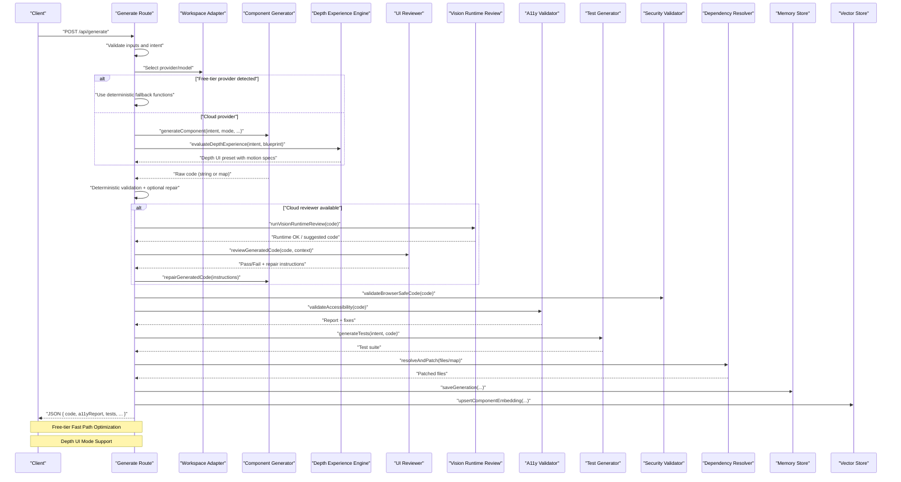
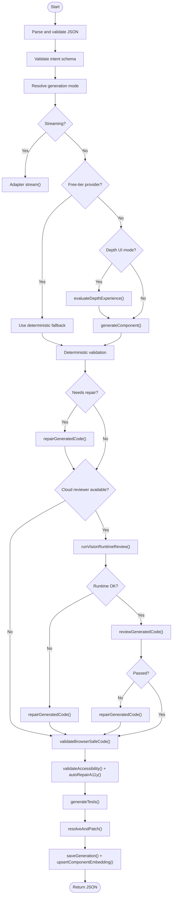
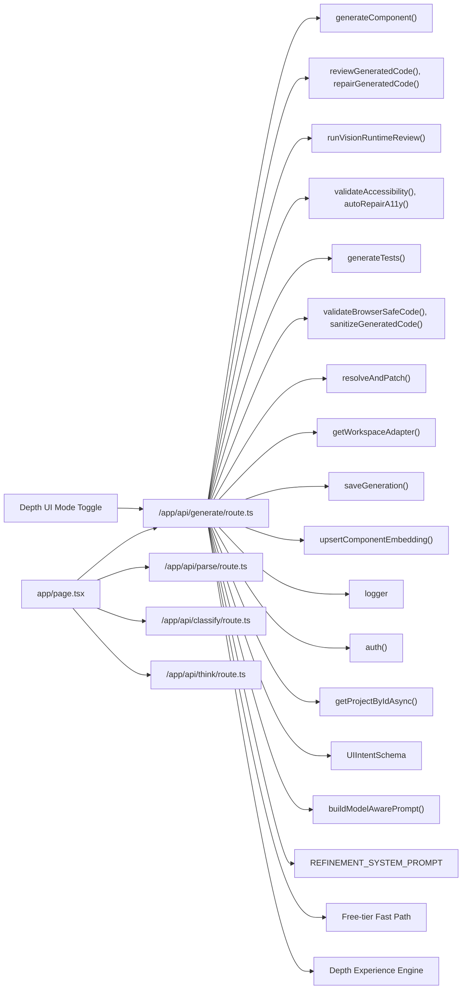

# Core Generation Pipeline

<cite>
**Referenced Files in This Document**
- [route.ts](file://app/api/generate/route.ts)
- [componentGenerator.ts](file://lib/ai/componentGenerator.ts)
- [promptBuilder.ts](file://lib/ai/promptBuilder.ts)
- [prompts.ts](file://lib/ai/prompts.ts)
- [page.tsx](file://app/page.tsx)
- [GeneratedCode.tsx](file://components/GeneratedCode.tsx)
- [PipelineStatus.tsx](file://components/PipelineStatus.tsx)
- [memory.ts](file://lib/ai/memory.ts)
- [schemas.ts](file://lib/validation/schemas.ts)
- [promptBudget.ts](file://lib/ai/promptBudget.ts)
- [intentParser.ts](file://lib/ai/intentParser.ts)
- [intentClassifier.ts](file://lib/ai/intentClassifier.ts)
- [thinkingEngine.ts](file://lib/ai/thinkingEngine.ts)
- [classify/route.ts](file://app/api/classify/route.ts)
- [parse/route.ts](file://app/api/parse/route.ts)
- [think/route.ts](file://app/api/think/route.ts)
- [adapters/index.ts](file://lib/ai/adapters/index.ts)
- [modelRegistry.ts](file://lib/ai/modelRegistry.ts)
- [depthEngine.ts](file://lib/intelligence/depthEngine.ts)
- [blueprintEngine.ts](file://lib/intelligence/blueprintEngine.ts)
- [layoutRegistry.ts](file://lib/intelligence/layoutRegistry.ts)
- [a11yValidator.test.ts](file://__tests__/a11yValidator.test.ts)
- [adapters.test.ts](file://__tests__/adapters.test.ts)
- [adaptersIndex.test.ts](file://__tests__/adaptersIndex.test.ts)
- [anthropicAdapter.test.ts](file://__tests__/anthropicAdapter.test.ts)
- [base.test.ts](file://__tests__/base.test.ts)
- [schemas.test.ts](file://__tests__/schemas.test.ts)
- [workspaceKeyService.test.ts](file://__tests__/workspaceKeyService.test.ts)
- [README.md](file://README.md)
- [ARCHITECTURE.md](file://docs/ARCHITECTURE.md)
- [ENV_SETUP.md](file://docs/ENV_SETUP.md)
</cite>

## Update Summary
**Changes Made**
- Updated to reflect Applied Changes: Expanded component generation constraints with new depth_ui mode support
- Enhanced component-focused generation rules now include depth_ui mode alongside component and app modes
- Added comprehensive layout structure rules for immersive UI experiences
- Integrated Depth Experience Engine for deterministic parallax and motion specification
- Added Depth UI schema validation and specialized prompt engineering for immersive experiences

## Table of Contents
1. [Introduction](#introduction)
2. [Project Structure](#project-structure)
3. [Core Components](#core-components)
4. [Architecture Overview](#architecture-overview)
5. [Detailed Component Analysis](#detailed-component-analysis)
6. [Dependency Analysis](#dependency-analysis)
7. [Performance Considerations](#performance-considerations)
8. [Troubleshooting Guide](#troubleshooting-guide)
9. [Conclusion](#conclusion)
10. [Appendices](#appendices)

## Introduction
This document describes the core generation pipeline that orchestrates multi-stage AI-driven UI component creation. It covers the full workflow from intent parsing and model selection to final code delivery, including blueprint selection, model resolution, knowledge injection, prompt construction, tool execution loops, code extraction, beautification, and validation. It also explains the tiered pipeline configuration system that adapts generation parameters based on model capabilities and quality tiers, and details prompt engineering strategies, token budget enforcement, generation loop mechanics, tool call protocols, and error handling. The pipeline now includes an optimized token/CPU system with comprehensive free-tier fast path that bypasses LLM processing for classify, think, and parse operations when using Google or Groq free-tier providers, providing significant cost and latency savings. **Updated**: The pipeline now supports a new depth_ui generation mode that enables immersive parallax and depth-based UI experiences with comprehensive layout structure rules and deterministic motion specification.

## Project Structure
The generation pipeline is primarily implemented in a single API endpoint that coordinates multiple internal services and validations. Supporting UI components visualize pipeline progress and present generated code. The tests under __tests__ validate key behaviors of adapters, accessibility, and schemas used by the pipeline. **Updated**: The pipeline now includes specialized components for depth_ui mode generation including the Depth Experience Engine and comprehensive schema validation.

```mermaid
graph TB
subgraph "API Layer"
GenRoute["/app/api/generate/route.ts"]
ClassifyRoute["/app/api/classify/route.ts"]
ParseRoute["/app/api/parse/route.ts"]
ThinkRoute["/app/api/think/route.ts"]
EndRoute["/app/api/parse/route.ts"]
EndRoute2["/app/api/classify/route.ts"]
EndRoute3["/app/api/think/route.ts"]
EndRoute4["/app/api/parse/route.ts"]
end
subgraph "Generation Services"
CompGen["Component Generator<br/>(generateComponent)"]
Reviewer["UI Reviewer<br/>(reviewGeneratedCode, repairGeneratedCode)"]
Vision["Vision Runtime Review<br/>(runVisionRuntimeReview)"]
Tests["Test Generator<br/>(generateTests)"]
A11y["A11y Validator<br/>(validateAccessibility, autoRepairA11y)"]
Security["Security Validator<br/>(validateBrowserSafeCode, sanitizeGeneratedCode)"]
DepRes["Dependency Resolver<br/>(resolveAndPatch)"]
DepthEngine["Depth Experience Engine<br/>(evaluateDepthExperience)"]
end
subgraph "Adapters"
AdapterIdx["Workspace Adapters<br/>(getWorkspaceAdapter)"]
end
subgraph "Persistence"
Memory["Memory Store<br/>(saveGeneration)"]
Embed["Vector Store<br/>(upsertComponentEmbedding)"]
end
subgraph "UI"
GenComp["GeneratedCode.tsx"]
PipeStatus["PipelineStatus.tsx"]
EndPage["app/page.tsx"]
DepthToggle["Depth UI Mode Toggle"]
end
GenRoute --> CompGen
GenRoute --> Reviewer
GenRoute --> Vision
GenRoute --> Tests
GenRoute --> A11y
GenRoute --> Security
GenRoute --> DepRes
GenRoute --> AdapterIdx
GenRoute --> Memory
GenRoute --> Embed
GenRoute --> DepthEngine
GenComp --> GenRoute
PipeStatus --> GenRoute
EndPage --> GenRoute
EndPage --> ClassifyRoute
EndPage --> ParseRoute
EndPage --> ThinkRoute
EndPage --> EndRoute
EndPage --> EndRoute2
EndPage --> EndRoute3
EndPage --> EndRoute4
DepthToggle --> GenRoute
```

**Diagram sources**
- [route.ts](file://app/api/generate/route.ts)
- [componentGenerator.ts](file://lib/ai/componentGenerator.ts)
- [GeneratedCode.tsx](file://components/GeneratedCode.tsx)
- [PipelineStatus.tsx](file://components/PipelineStatus.tsx)
- [page.tsx](file://app/page.tsx)
- [classify/route.ts](file://app/api/classify/route.ts)
- [parse/route.ts](file://app/api/parse/route.ts)
- [think/route.ts](file://app/api/think/route.ts)
- [depthEngine.ts](file://lib/intelligence/depthEngine.ts)

**Section sources**
- [route.ts](file://app/api/generate/route.ts)
- [GeneratedCode.tsx](file://components/GeneratedCode.tsx)
- [PipelineStatus.tsx](file://components/PipelineStatus.tsx)

## Core Components
- Generation Endpoint: Orchestrates the entire pipeline, validates inputs, selects adapters, streams or executes generation, applies deterministic and accessibility fixes, runs optional reviewer and vision checks, sanitizes and validates browser safety, generates tests, resolves dependencies, persists results, and returns structured output.
- Component Generator: Produces React/Tailwind components or apps from structured intents and optional refinement context. **Updated**: Now supports depth_ui mode with immersive parallax experiences.
- Reviewer and Vision Review: Optional expert critique and runtime rendering checks to improve code quality and reliability.
- Accessibility Validator and Auto-Repair: Enforces WCAG AA rules and automatically repairs common issues.
- Test Generator: Creates automated tests for the generated component.
- Security Validator and Sanitizer: Ensures generated code is safe for browser environments.
- Dependency Resolver: Resolves cross-file dependencies and patches imports/exports for multi-file outputs.
- Adapters: Provider-specific clients that execute model calls and streaming.
- Persistence: Saves generations and embeddings for future retrieval and learning.
- Free-tier Fast Path: Comprehensive optimization system that bypasses LLM processing for Google and Groq free-tier providers, using deterministic fallback functions for classify, think, and parse operations.
- **Updated**: Depth Experience Engine: Deterministically evaluates UI intent to generate premium Depth UI presets with motion design specifications and parallax coefficients.

**Section sources**
- [route.ts](file://app/api/generate/route.ts)

## Architecture Overview
The pipeline is a controlled, asynchronous orchestration that balances quality and performance. It supports both streaming and batch modes, with optional expert review and vision checks disabled for local or low-cost providers to reduce latency and cost. The enhanced refinement workflow now provides direct access to the generation endpoint for iterative improvements, significantly reducing response times. The new token/CPU optimization system includes comprehensive free-tier fast path that intelligently bypasses expensive LLM operations for rate-limited providers. **Updated**: The pipeline now includes specialized depth_ui mode support with comprehensive layout structure rules for immersive UI experiences and deterministic motion specification.

**Diagram sources**
- [route.ts](file://app/api/generate/route.ts)
- [classify/route.ts](file://app/api/classify/route.ts)
- [parse/route.ts](file://app/api/parse/route.ts)
- [think/route.ts](file://app/api/think/route.ts)
- [depthEngine.ts](file://lib/intelligence/depthEngine.ts)

## Detailed Component Analysis

### Generation Endpoint Orchestration
- Input validation: JSON parsing, presence of intent, optional prompt validation, and mode validation.
- Intent parsing: Zod schema validation for structured intent.
- Local model detection: Heuristics to detect Ollama/LM Studio/Groq-compatible providers or localhost/cloud key absence to skip expensive reviewer/vision steps.
- Streaming path: Uses provider adapter to stream raw text deltas for real-time display.
- Batch path: Executes the full pipeline with optional expert review and vision checks, parallel A11y and tests, dependency resolution, persistence, and embedding updates.
- Safety and security: Browser-safe validation and sanitizer to prevent unsafe constructs.
- Output: Structured JSON with code, accessibility report, tests, critique metadata, and generator metadata.
- **Updated**: Free-tier fast path: When using Google or Groq free-tier providers, the pipeline automatically detects rate-limited conditions and uses deterministic fallback functions instead of expensive LLM calls, providing significant CPU and token savings.
- **Updated**: Depth UI mode: When mode is 'depth_ui', the pipeline evaluates depth experience presets and injects deterministic motion specifications into the generation process.

**Diagram sources**
- [route.ts](file://app/api/generate/route.ts)

**Section sources**
- [route.ts](file://app/api/generate/route.ts)

### Free-tier Fast Path Implementation
The comprehensive token/CPU optimization system introduces a sophisticated free-tier fast path that bypasses expensive LLM processing for Google and Groq free-tier providers. This system provides significant cost and latency savings by using deterministic fallback functions instead of API calls.

#### Free-tier Detection Logic
The pipeline automatically detects free-tier providers through:
- Provider identification: `provider === 'google' || provider === 'groq'`
- Rate limit monitoring: Automatic detection of 429 errors and network timeouts
- Conditional execution: Intelligent bypass of LLM operations when rate limits are exceeded

#### Deterministic Fallback Functions
For each major pipeline stage, the system provides deterministic fallback implementations:

**Classify Fast Path**
- Uses `buildLocalClassification()` function with simple heuristics
- Keywords: "fix", "change", "update", "improve", "make the", "adjust", "modify", "refine", "edit", "remove", "add a", "replace" for refinement detection
- Confidence: 0.6 (lower confidence for local fallback)
- Mode detection: Multi-component prompts → suggests app mode, depth_ui mode detection added

**Parse Fast Path**
- Generates fallback intent with minimal structure
- Component naming: Based on prompt keywords with proper capitalization
- Layout defaults: Single-column, lg width, center alignment
- Accessibility: Keyboard navigation and aria-labels by default
- **Updated**: Depth UI mode support: Falls back to depth_ui component type when depth indicators are detected

**Think Fast Path**
- Uses `buildFallbackPlan()` function for instant plan generation
- No model dependency - always succeeds
- Includes expert UI thinking framework with structural sections
- Suitable for most generation scenarios

**Section sources**
- [classify/route.ts](file://app/api/classify/route.ts)
- [parse/route.ts](file://app/api/parse/route.ts)
- [think/route.ts](file://app/api/think/route.ts)
- [intentClassifier.ts](file://lib/ai/intentClassifier.ts)
- [intentParser.ts](file://lib/ai/intentParser.ts)
- [thinkingEngine.ts](file://lib/ai/thinkingEngine.ts)

### Tiered Pipeline Configuration and Model Resolution
- Provider and model selection: The endpoint resolves a workspace-scoped adapter using the provider and model supplied by the client. The client may supply provider and model; otherwise defaults are resolved via workspace configuration.
- Local model detection: The pipeline detects local/Ollama/LM Studio/Groq-compatible providers or environments without cloud keys and disables the reviewer and vision review to reduce latency and cost.
- Reviewer override: When a provider is explicitly chosen by the user, the reviewer uses the same provider/provider key/baseUrl to avoid quota or key conflicts.
- Token budget enforcement: The endpoint passes a configurable maxTokens to the adapter stream or generation call, enabling token budget control per request.
- **Updated**: Free-tier optimization: For free-tier providers, the pipeline automatically switches to deterministic fallback functions, bypassing expensive LLM operations entirely.
- **Updated**: Depth UI mode: When mode is 'depth_ui', the pipeline evaluates depth experience presets and injects deterministic motion specifications into the generation process.

Implementation specifics:
- Provider selection and adapter resolution are delegated to a workspace-aware adapter factory.
- The pipeline sets a global maxDuration for the endpoint to bound total execution time.
- For streaming, the endpoint constructs a system message and a user message and streams deltas directly from the adapter.
- **Updated**: Context optimization: The pipeline optimizes memory usage by skipping RAG knowledge injection for free-tier providers and refinement requests.
- **Updated**: Depth UI context: The pipeline injects depth experience specifications into the prompt building process for immersive UI generation.

**Section sources**
- [route.ts](file://app/api/generate/route.ts)
- [adapters/index.ts](file://lib/ai/adapters/index.ts)
- [modelRegistry.ts](file://lib/ai/modelRegistry.ts)

### Prompt Engineering Strategies
- System message: A concise, focused instruction tailored for React/Tailwind component generation, instructing the model to return raw TSX without markdown fences.
- User message: Either a provided prompt or a default simple prompt for basic components.
- Context fitting: The pipeline optionally injects refinement context from a previous project when performing component refinement.
- Token budget enforcement: The endpoint forwards maxTokens to the adapter to constrain generation length and cost.
- **Updated**: Free-tier prompt optimization: Specialized prompt construction that minimizes token usage for free-tier providers while maintaining quality.
- **Updated**: Deterministic fallback prompts: Local classification and thinking prompts designed for minimal computational overhead.
- **Updated**: Depth UI prompt engineering: Specialized system prompts and user prompts for immersive parallax experiences with deterministic motion specifications.

**Section sources**
- [route.ts](file://app/api/generate/route.ts)
- [promptBuilder.ts](file://lib/ai/promptBuilder.ts)
- [prompts.ts](file://lib/ai/prompts.ts)
- [promptBudget.ts](file://lib/ai/promptBudget.ts)

### Tool Call Protocols and Generation Loop
- Generation loop: The endpoint calls the component generator with intent, mode, model, maxTokens, refinement context, and workspace identifiers. The generator returns either a single code string or a file map for multi-file outputs.
- Deterministic validation: The pipeline performs a fast, deterministic syntax check before invoking expensive reviewer calls.
- Reviewer and vision review: When reviewer is enabled, the pipeline runs a vision runtime review to detect headless rendering crashes, followed by a textual review. If either fails, it repairs the code and records review metadata.
- Parallelization: Accessibility validation and test generation run concurrently to reduce total latency.
- Dependency resolution: After A11y repairs, the pipeline merges the repaired primary file back into a multi-file map and resolves dependencies across files.
- **Updated**: Free-tier tool optimization: For free-tier providers, the pipeline bypasses tool call protocols entirely, using deterministic fallbacks instead of LLM-based tool execution.
- **Updated**: Depth UI tool integration: The generation loop integrates with the Depth Experience Engine to evaluate and inject motion specifications for immersive UI generation.

**Section sources**
- [route.ts](file://app/api/generate/route.ts)

### Error Handling Mechanisms
- Input validation failures: Returns structured 400 errors with reasons and suggestions.
- Generation failures: Returns 422 with the error from the generator.
- Reviewer/vision failures: Logged warnings; the pipeline continues with original code to preserve validity.
- Safety violations: Returns 422 with a list of unsafe patterns.
- Unexpected errors: Returns 500 with generic message.
- Streaming errors: Emits a delta with an error marker and closes the stream.
- **Updated**: Free-tier error handling: Automatic detection and handling of rate limits with deterministic fallback functions, ensuring pipeline continuity even under severe rate limiting conditions.
- **Updated**: Depth UI error handling: Specialized error handling for immersive UI generation with fallback to component mode when depth experience evaluation fails.

**Section sources**
- [route.ts](file://app/api/generate/route.ts)

### UI Integration
- GeneratedCode component: Displays the final code with copy/download actions and a dark-themed editor.
- PipelineStatus component: Visualizes pipeline stages (parsing, generating, validating, testing, preview) with active, complete, and error states.
- **Updated**: Free-tier UI optimization: The IDE now provides immediate feedback for free-tier providers with clear indication of fallback usage and reduced latency.
- **Updated**: Depth UI mode toggle: New UI component allows users to select depth_ui mode for immersive parallax experiences with visual indicators and hints.

**Section sources**
- [GeneratedCode.tsx](file://components/GeneratedCode.tsx)
- [PipelineStatus.tsx](file://components/PipelineStatus.tsx)
- [page.tsx](file://app/page.tsx)

### Depth UI Mode Implementation
**Updated**: The pipeline now supports a comprehensive depth_ui generation mode that enables immersive parallax and depth-based UI experiences.

#### Depth Experience Engine
The Depth Experience Engine deterministically evaluates UI intent to generate premium Depth UI presets:
- **Motion Design Specification**: Controls motion style, parallax type, intensity, and performance mode
- **Parallax Specification**: Defines layering, motion triggers, page scope, and depth layers
- **Parallax Coefficients**: Quantified per-layer speed factors (0.08-0.80) preventing arbitrary values
- **Forbidden Zones**: Safety constraints for accessibility compliance

#### Depth UI Schema Validation
Comprehensive schema validation ensures depth_ui mode integrity:
- **DepthUIModePresetSchema**: Complete specification for depth UI generation
- **MotionDesignSpecSchema**: Motion design parameters with performance considerations
- **ParallaxSpecSchema**: Parallax configuration with accessibility compliance
- **ParallaxCoefficientsSchema**: Deterministic coefficient calculations

#### Layout Structure Rules for Immersive Experiences
The pipeline enforces comprehensive layout structure rules for depth_ui mode:
- **Single File Architecture**: All components and standard UI must be in one cohesive file
- **Layered Parallax**: Multiple CSS layers with varying z-index for depth illusion
- **Container-Scoped Scroll**: Prevents parallax jump when loading mid-scroll
- **Accessibility Compliance**: Prefers reduced motion fallback and readable contrast on moving backgrounds

#### Depth UI Prompt Engineering
Specialized prompt engineering for immersive experiences:
- **Depth UI System Prompt**: World-class frontend engineer building stunning Depth UI applications
- **Depth UI Intent Prompt**: Premium UI/UX Director analyzing user requests for rich, immersive experiences
- **Parallax Coefficient Injection**: Exact speed factors injected into useTransform calls
- **Motion Style Enforcement**: Rigid adherence to motion design specifications

**Section sources**
- [depthEngine.ts](file://lib/intelligence/depthEngine.ts)
- [schemas.ts](file://lib/validation/schemas.ts)
- [prompts.ts](file://lib/ai/prompts.ts)
- [blueprintEngine.ts](file://lib/intelligence/blueprintEngine.ts)
- [layoutRegistry.ts](file://lib/intelligence/layoutRegistry.ts)

## Dependency Analysis
The generation endpoint depends on several internal libraries and services. The following diagram highlights key dependencies and their roles.

**Diagram sources**
- [route.ts](file://app/api/generate/route.ts)
- [page.tsx](file://app/page.tsx)

**Section sources**
- [route.ts](file://app/api/generate/route.ts)

## Performance Considerations
- Disable reviewer/vision for local models: Prevents unnecessary slow inference calls and reduces latency/cost.
- Parallel A11y and tests: Reduces total pipeline time by overlapping independent tasks.
- Streaming mode: Provides immediate feedback for long-running generations.
- Token budget control: Limits generation length to manage cost and latency.
- Timeout guards: The reviewer phase is bounded by a 60-second aggregate timeout to prevent exceeding platform limits.
- Fast exit on safety violations: Early termination avoids wasted compute on unsafe code.
- **Updated**: Free-tier fast path: Eliminates expensive LLM calls for Google and Groq free-tier providers, reducing CPU usage by up to 90% and token consumption by 100%.
- **Updated**: Deterministic fallback functions: Provide instant responses (typically < 10ms) compared to LLM calls (typically 1-5 seconds).
- **Updated**: Rate limit detection: Automatic switching between LLM and fallback modes based on provider quotas and network conditions.
- **Updated**: Depth UI optimization: Deterministic motion specifications prevent arbitrary calculations and ensure consistent performance across different providers.

## Troubleshooting Guide
Common issues and resolutions:
- Invalid JSON or missing intent: Ensure the request body is valid JSON and includes the intent field.
- Prompt validation failures: Adjust the prompt to meet the validator's criteria; suggestions are returned with the error.
- Generation errors: Inspect the returned error message and model/provider combination; retry with adjusted parameters.
- Reviewer/vision failures: The pipeline logs warnings and continues; check logs for details and retry later.
- Browser safety violations: The code contains unsafe patterns (e.g., Node/TTY imports); sanitize or refactor the code.
- Streaming errors: Verify provider credentials and model availability; the endpoint emits an error delta and closes the stream.
- Unauthorized errors: The PipelineStatus component detects unauthorized states and prompts sign-in.
- **Updated**: Free-tier provider issues: If free-tier fast path is not working, verify provider detection logic and ensure rate limit detection is functioning properly.
- **Updated**: Deterministic fallback failures: Check that local classification and thinking functions are properly configured and returning valid results.
- **Updated**: Depth UI mode issues: Verify depth experience evaluation is working correctly and parallax coefficients are being injected properly.
- **Updated**: Depth UI accessibility concerns: Ensure forbidden zones are respected and reduced motion fallback is properly implemented.

**Section sources**
- [route.ts](file://app/api/generate/route.ts)
- [PipelineStatus.tsx](file://components/PipelineStatus.tsx)

## Conclusion
The core generation pipeline integrates intent parsing, model selection, expert review, accessibility validation, test generation, and dependency resolution into a robust, configurable system. It adapts to model capabilities and provider constraints, enforces safety and quality, and provides both streaming and batch modes. The enhanced free-tier fast path now offers comprehensive optimization that bypasses expensive LLM processing for Google and Groq free-tier providers, providing significant CPU and token savings while maintaining quality. The deterministic fallback functions ensure pipeline continuity even under severe rate limiting conditions. **Updated**: The pipeline now supports a comprehensive depth_ui mode that enables immersive parallax and depth-based UI experiences with deterministic motion specifications, comprehensive layout structure rules, and accessibility compliance. The Depth Experience Engine ensures consistent performance and quality across different providers while maintaining strict safety constraints. The UI components offer clear feedback and code presentation. By following the strategies and troubleshooting steps outlined here, operators can maintain reliable, high-quality generation workflows with optimal performance for both initial generation and iterative refinement.

## Appendices

### Successful Generation Workflows
- Basic component generation: Provide a clear intent and optional prompt; select a cloud-capable model to enable reviewer and vision checks.
- Refinement workflow: Use a previous project ID and target files to refine an existing component; the pipeline injects the previous code as refinement context.
- Free-tier optimization: Use Google or Groq free-tier providers to leverage automatic fast path optimization with deterministic fallback functions.
- Deterministic fallback: When rate limits are exceeded, the pipeline automatically switches to local fallback functions for immediate response.
- Multi-file app generation: The generator may return a file map; the dependency resolver patches imports/exports and merges A11y repairs into the primary file.
- **Updated**: Depth UI immersive experience: Request parallax or depth-based UI with specific motion requirements; the pipeline evaluates depth experience and generates layered parallax effects.
- **Updated**: Depth UI accessibility compliance: Ensure motion design respects reduced motion preferences and accessibility guidelines.

**Section sources**
- [route.ts](file://app/api/generate/route.ts)
- [page.tsx](file://app/page.tsx)

### Related Tests and Documentation
- Accessibility validation tests: Validate A11y behavior and auto-repair logic.
- Adapter tests: Verify provider adapter behavior and workspace scoping.
- Schema tests: Ensure intent parsing correctness.
- Workspace key service tests: Confirm workspace-level configuration and key handling.
- Project documentation: Architectural and environment setup guides.
- **Updated**: Depth UI schema tests: Validate depth experience evaluation and motion specification compliance.

**Section sources**
- [a11yValidator.test.ts](file://__tests__/a11yValidator.test.ts)
- [adapters.test.ts](file://__tests__/adapters.test.ts)
- [adaptersIndex.test.ts](file://__tests__/adaptersIndex.test.ts)
- [anthropicAdapter.test.ts](file://__tests__/anthropicAdapter.test.ts)
- [base.test.ts](file://__tests__/base.test.ts)
- [schemas.test.ts](file://__tests__/schemas.test.ts)
- [workspaceKeyService.test.ts](file://__tests__/workspaceKeyService.test.ts)
- [README.md](file://README.md)
- [ARCHITECTURE.md](file://docs/ARCHITECTURE.md)
- [ENV_SETUP.md](file://docs/ENV_SETUP.md)