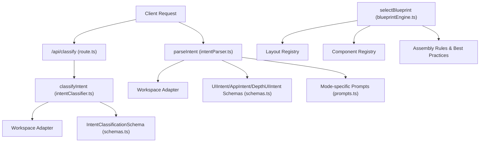
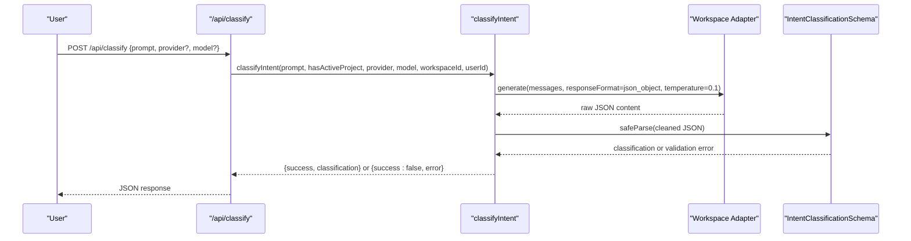
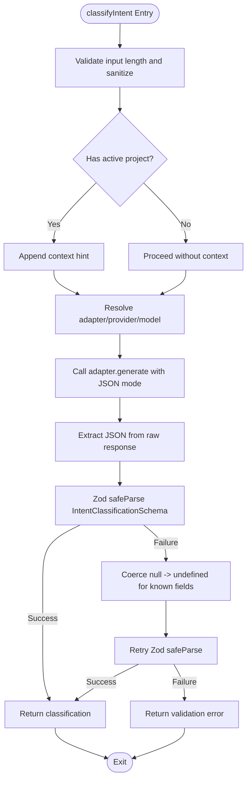
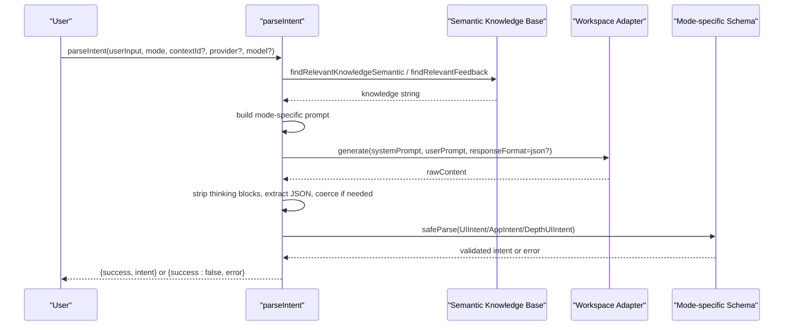
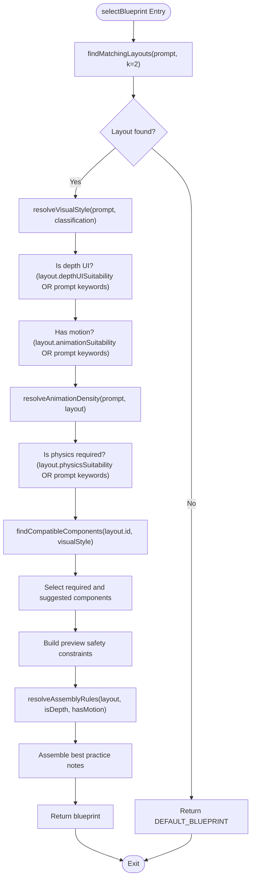
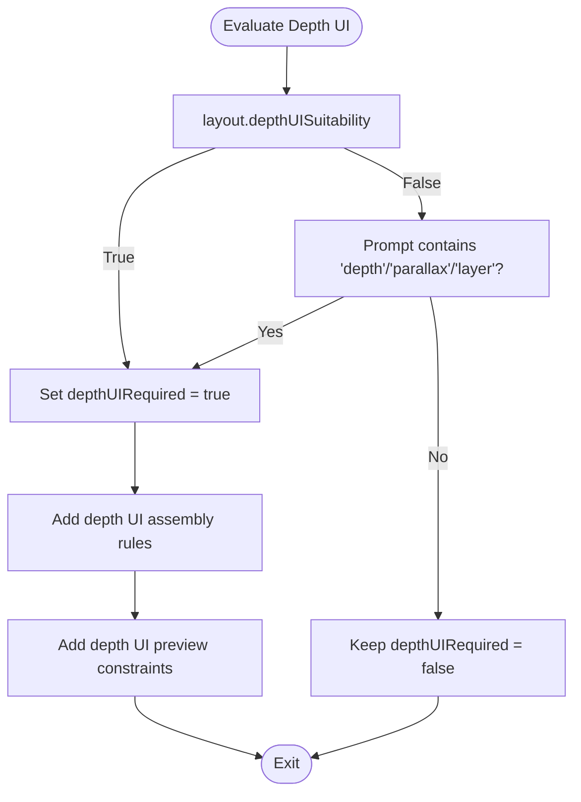
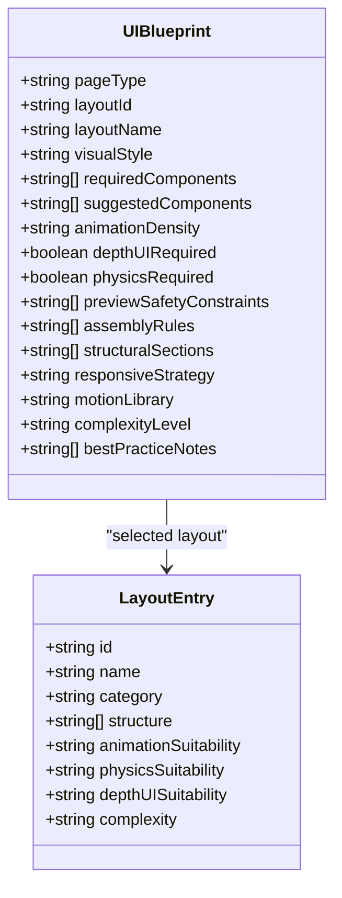
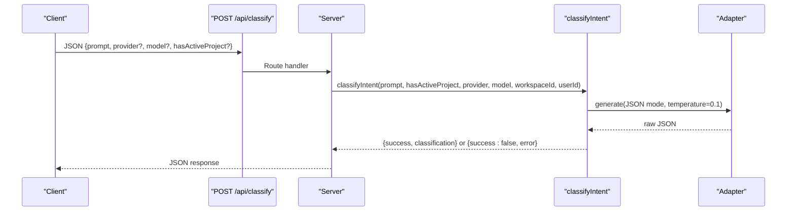
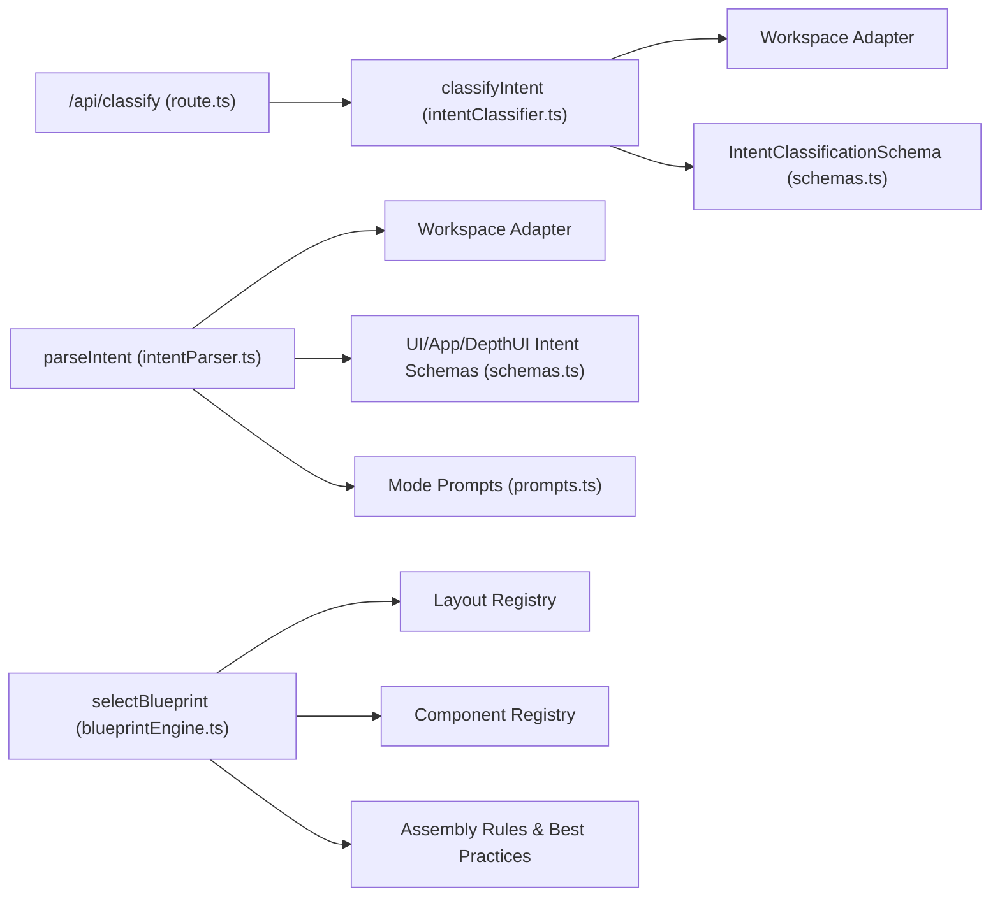

# Intent Processing & Blueprint Selection

<cite>
**Referenced Files in This Document**
- [route.ts](file://app/api/classify/route.ts)
- [intentClassifier.ts](file://lib/ai/intentClassifier.ts)
- [intentParser.ts](file://lib/ai/intentParser.ts)
- [intent.ts](file://lib/ai/intent.ts)
- [blueprintEngine.ts](file://lib/intelligence/blueprintEngine.ts)
- [schemas.ts](file://lib/validation/schemas.ts)
- [prompts.ts](file://lib/ai/prompts.ts)
</cite>

## Table of Contents
1. [Introduction](#introduction)
2. [Project Structure](#project-structure)
3. [Core Components](#core-components)
4. [Architecture Overview](#architecture-overview)
5. [Detailed Component Analysis](#detailed-component-analysis)
6. [Dependency Analysis](#dependency-analysis)
7. [Performance Considerations](#performance-considerations)
8. [Troubleshooting Guide](#troubleshooting-guide)
9. [Conclusion](#conclusion)

## Introduction
This document explains the intent processing and blueprint selection phase of the generation pipeline. It covers how user intents are analyzed and transformed into actionable generation parameters, how blueprints are selected to match user requirements to UI patterns, and how design rules are applied consistently. It also details the depth UI mode evaluation for complex interactive components, the intent classification system, blueprint scoring mechanisms, and design rule conflict resolution. Practical examples and troubleshooting guidance are included to help developers and users achieve reliable, accessible, and visually coherent UI generation outcomes.

## Project Structure
The intent processing and blueprint selection pipeline spans several modules:
- API endpoint for intent classification
- Intent classification service
- Intent parsing service
- Blueprint engine for selecting and formatting UI blueprints
- Validation schemas for typed intent outputs
- Prompt templates for different generation modes
- A barrel export module for intent-related utilities

**Diagram sources**
- [route.ts:1-76](file://app/api/classify/route.ts#L1-L76)
- [intentClassifier.ts:1-178](file://lib/ai/intentClassifier.ts#L1-L178)
- [intentParser.ts:1-259](file://lib/ai/intentParser.ts#L1-L259)
- [blueprintEngine.ts:1-215](file://lib/intelligence/blueprintEngine.ts#L1-L215)
- [schemas.ts:1-467](file://lib/ai/prompts.ts#L1-L467)

**Section sources**
- [route.ts:1-76](file://app/api/classify/route.ts#L1-L76)
- [intentClassifier.ts:1-178](file://lib/ai/intentClassifier.ts#L1-L178)
- [intentParser.ts:1-259](file://lib/ai/intentParser.ts#L1-L259)
- [blueprintEngine.ts:1-215](file://lib/intelligence/blueprintEngine.ts#L1-L215)
- [schemas.ts:1-467](file://lib/ai/prompts.ts#L1-L467)

## Core Components
- Intent classification: Converts raw user input into a structured classification with intent type, suggested generation mode, and metadata for routing.
- Intent parsing: Transforms user intent into a detailed UI intent specification, including component/app/depth UI schemas.
- Blueprint engine: Selects a UI blueprint based on layout compatibility, visual style, motion, and depth requirements, and enforces design rules.
- Validation schemas: Provide strong typing and schema validation for classification and intent outputs.
- Prompt templates: Define system prompts and user prompts for component, app, and depth UI modes.

**Section sources**
- [intentClassifier.ts:57-178](file://lib/ai/intentClassifier.ts#L57-L178)
- [intentParser.ts:29-259](file://lib/ai/intentParser.ts#L29-L259)
- [blueprintEngine.ts:9-215](file://lib/intelligence/blueprintEngine.ts#L9-L215)
- [schemas.ts:16-340](file://lib/validation/schemas.ts#L16-L340)
- [prompts.ts:8-467](file://lib/ai/prompts.ts#L8-L467)

## Architecture Overview
The intent processing pipeline consists of two primary stages:
1) Intent classification: Determines intent category, suggested mode, and metadata to decide whether to generate code immediately or gather more context.
2) Intent parsing: Produces a structured intent (component, app, or depth UI) enriched with fields, interactions, layout, and accessibility requirements.
3) Blueprint selection: Matches the intent to a layout and component palette, evaluates motion and depth requirements, and applies design rules.

**Diagram sources**
- [route.ts:8-76](file://app/api/classify/route.ts#L8-L76)
- [intentClassifier.ts:63-178](file://lib/ai/intentClassifier.ts#L63-L178)
- [schemas.ts:16-46](file://lib/validation/schemas.ts#L16-L46)

## Detailed Component Analysis

### Intent Classification System
The classifier interprets user input and returns a structured classification with:
- intentType: One of six categories (ui_generation, ui_refinement, product_requirement, ideation, debug_fix, context_clarification)
- suggestedMode: component, app, or depth_ui
- shouldGenerateCode: Whether to proceed with code generation
- Purpose, visualType, complexity, platform, layout, motionLevel, and preferredStack metadata for downstream decisions

Implementation highlights:
- Uses a system prompt that defines intent types and output schema.
- Sanitizes input and optionally injects context about an active project.
- Resolves adapter/provider/model dynamically or falls back to defaults.
- Implements retry-on-rate-limit logic for 429 responses.
- Parses and validates JSON output against a Zod schema, with a coercion pass for known edge cases.

**Diagram sources**
- [intentClassifier.ts:63-178](file://lib/ai/intentClassifier.ts#L63-L178)
- [schemas.ts:16-46](file://lib/validation/schemas.ts#L16-L46)

**Section sources**
- [intentClassifier.ts:10-53](file://lib/ai/intentClassifier.ts#L10-L53)
- [intentClassifier.ts:63-178](file://lib/ai/intentClassifier.ts#L63-L178)
- [schemas.ts:16-46](file://lib/validation/schemas.ts#L16-L46)

### Intent Parsing and Generation Mode Routing
The parser builds a detailed intent from user input:
- Mode selection: component, app, or depth_ui
- Knowledge retrieval: semantic search and feedback context
- Prompt construction: mode-specific system prompts and user prompts
- JSON extraction: robust parsing with markdown stripping and bracket-matching fallback
- Schema validation: UIIntent, AppIntent, or DepthUIIntent depending on mode
- Fallback handling: minimal-intent recovery when the AI rejects the prompt

Key behaviors:
- Uses mode-specific system prompts and user prompts to guide the model.
- Applies JSON mode when supported by the model profile; ensures “json” appears in the system prompt for Ollama.
- Enforces context budgeting for small/local models.
- Supports iterative context for refinements.

**Diagram sources**
- [intentParser.ts:36-259](file://lib/ai/intentParser.ts#L36-L259)
- [prompts.ts:120-467](file://lib/ai/prompts.ts#L120-L467)
- [schemas.ts:150-287](file://lib/validation/schemas.ts#L150-L287)

**Section sources**
- [intentParser.ts:36-259](file://lib/ai/intentParser.ts#L36-L259)
- [prompts.ts:8-467](file://lib/ai/prompts.ts#L8-L467)
- [schemas.ts:150-287](file://lib/validation/schemas.ts#L150-L287)

### Blueprint Selection and Design Rule Application
The blueprint engine selects a UI blueprint based on:
- Layout matching: finds compatible layouts and picks the best candidate
- Visual style resolution: infers style from prompt keywords and classification metadata
- Animation density: determines motion level from prompt and layout suitability
- Depth UI evaluation: detects depth UI requirements from prompt and layout
- Physics evaluation: checks for physics-based motion
- Component compatibility: selects required and suggested components aligned with layout and style
- Assembly rules: enforces non-negotiable rules for imports, motion libraries, layout primitives, and safety constraints
- Best practice notes: accessibility and responsive design guidelines

**Diagram sources**
- [blueprintEngine.ts:122-176](file://lib/intelligence/blueprintEngine.ts#L122-L176)
- [blueprintEngine.ts:64-120](file://lib/intelligence/blueprintEngine.ts#L64-L120)

**Section sources**
- [blueprintEngine.ts:9-215](file://lib/intelligence/blueprintEngine.ts#L9-L215)

### Depth UI Mode Evaluation
Depth UI mode is evaluated when:
- The layout indicates depth UI suitability
- The prompt contains depth-related keywords (e.g., depth, parallax, layer)
- The classification suggests depth-related visual types

The blueprint engine sets:
- depthUIRequired: true
- motion library: framer-motion
- assembly rules tailored for layered parallax and CSS-based depth effects
- preview safety constraints for depth UI layers and motion variants

**Diagram sources**
- [blueprintEngine.ts:132-136](file://lib/intelligence/blueprintEngine.ts#L132-L136)
- [blueprintEngine.ts:102-111](file://lib/intelligence/blueprintEngine.ts#L102-L111)
- [blueprintEngine.ts:147-148](file://lib/intelligence/blueprintEngine.ts#L147-L148)

**Section sources**
- [blueprintEngine.ts:132-136](file://lib/intelligence/blueprintEngine.ts#L132-L136)
- [blueprintEngine.ts:102-111](file://lib/intelligence/blueprintEngine.ts#L102-L111)
- [blueprintEngine.ts:147-148](file://lib/intelligence/blueprintEngine.ts#L147-L148)

### Blueprint Scoring Mechanisms and Design Rule Conflict Resolution
Scoring and selection:
- Layout matching: ranked by relevance; primary layout drives blueprint selection.
- Component compatibility: usagePriority determines inclusion order; required components have lower priority thresholds.
- Visual style and motion: inferred from prompt and classification metadata to align with design system.

Conflict resolution:
- Assembly rules are non-negotiable and take precedence over user intent.
- Preview safety constraints prevent unsafe code patterns (e.g., Node.js APIs, dynamic requires).
- Best practice notes enforce accessibility and responsive design standards.

**Diagram sources**
- [blueprintEngine.ts:9-27](file://lib/intelligence/blueprintEngine.ts#L9-L27)
- [blueprintEngine.ts:126-176](file://lib/intelligence/blueprintEngine.ts#L126-L176)

**Section sources**
- [blueprintEngine.ts:126-176](file://lib/intelligence/blueprintEngine.ts#L126-L176)

### API Workflow for Intent Classification
The classification endpoint:
- Validates request payload and extracts prompt, provider, model, and workspace context.
- Calls classifyIntent with workspace-aware adapter resolution.
- Returns structured classification or error response.

**Diagram sources**
- [route.ts:8-76](file://app/api/classify/route.ts#L8-L76)
- [intentClassifier.ts:63-178](file://lib/ai/intentClassifier.ts#L63-L178)

**Section sources**
- [route.ts:8-76](file://app/api/classify/route.ts#L8-L76)

## Dependency Analysis
The intent processing pipeline exhibits clear separation of concerns:
- API layer depends on the classification service.
- Classification service depends on workspace adapters and validation schemas.
- Parsing service depends on semantic knowledge base, prompts, and validation schemas.
- Blueprint engine depends on layout and component registries and produces design rule artifacts.
- All outputs are validated by Zod schemas to ensure type safety.

**Diagram sources**
- [route.ts:1-76](file://app/api/classify/route.ts#L1-L76)
- [intentClassifier.ts:1-178](file://lib/ai/intentClassifier.ts#L1-L178)
- [intentParser.ts:1-259](file://lib/ai/intentParser.ts#L1-L259)
- [blueprintEngine.ts:1-215](file://lib/intelligence/blueprintEngine.ts#L1-L215)
- [schemas.ts:1-340](file://lib/validation/schemas.ts#L1-L340)
- [prompts.ts:1-467](file://lib/ai/prompts.ts#L1-L467)

**Section sources**
- [route.ts:1-76](file://app/api/classify/route.ts#L1-L76)
- [intentClassifier.ts:1-178](file://lib/ai/intentClassifier.ts#L1-L178)
- [intentParser.ts:1-259](file://lib/ai/intentParser.ts#L1-L259)
- [blueprintEngine.ts:1-215](file://lib/intelligence/blueprintEngine.ts#L1-L215)
- [schemas.ts:1-340](file://lib/validation/schemas.ts#L1-L340)
- [prompts.ts:1-467](file://lib/ai/prompts.ts#L1-L467)

## Performance Considerations
- Token budgeting: The parser estimates tokens and fits knowledge within model capacity tiers to avoid context overflow for small/local models.
- JSON mode gating: The system checks model profiles to safely enable JSON mode and adjusts prompts for Ollama compatibility.
- Retry-on-rate-limit: The classifier retries 429 responses with exponential backoff to reduce transient failures.
- Lightweight model selection: The API endpoint selects the fastest available model for classification to minimize latency and cost.

[No sources needed since this section provides general guidance]

## Troubleshooting Guide
Common issues and resolutions:
- Malformed JSON from AI: The parser strips thinking blocks and attempts bracket-matching extraction; if still invalid, returns a structured error with the raw response for inspection.
- Schema validation failures: The parser reports specific Zod issues; refine the prompt to match the expected schema fields.
- Not a UI description: The parser can recover with a minimal fallback intent when the AI rejects the input as non-UI.
- Empty response: The parser and classifier both guard against empty content and return descriptive errors.
- Rate limit errors: The classifier retries on 429 with exponential backoff; monitor logs for repeated failures.
- JSON mode unsupported: The parser checks model capabilities and avoids enabling JSON mode when unsupported.

**Section sources**
- [intentParser.ts:151-227](file://lib/ai/intentParser.ts#L151-L227)
- [intentParser.ts:233-240](file://lib/ai/intentParser.ts#L233-L240)
- [intentParser.ts:254-258](file://lib/ai/intentParser.ts#L254-L258)
- [intentClassifier.ts:123-133](file://lib/ai/intentClassifier.ts#L123-L133)
- [intentClassifier.ts:173-177](file://lib/ai/intentClassifier.ts#L173-L177)

## Conclusion
The intent processing and blueprint selection pipeline provides a robust, schema-driven pathway from user intent to executable UI generation. By combining classification, parsing, and blueprint selection with strict validation and design rule enforcement, the system ensures consistent, accessible, and visually coherent outputs. Depth UI mode is evaluated explicitly to support immersive experiences, while conflict resolution prioritizes non-negotiable rules and best practices.