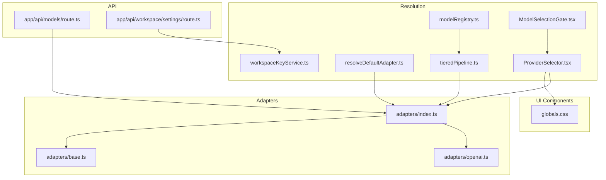
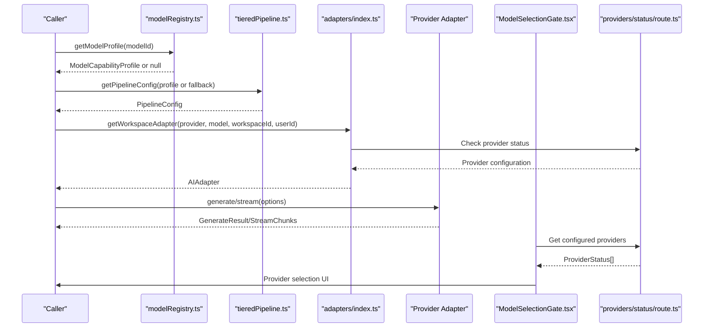
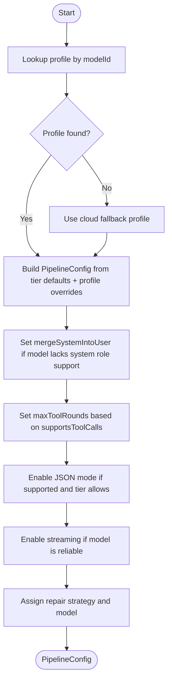
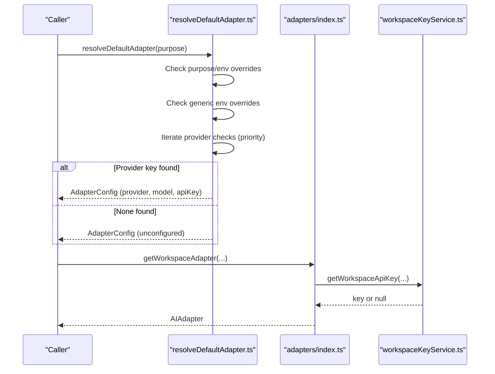
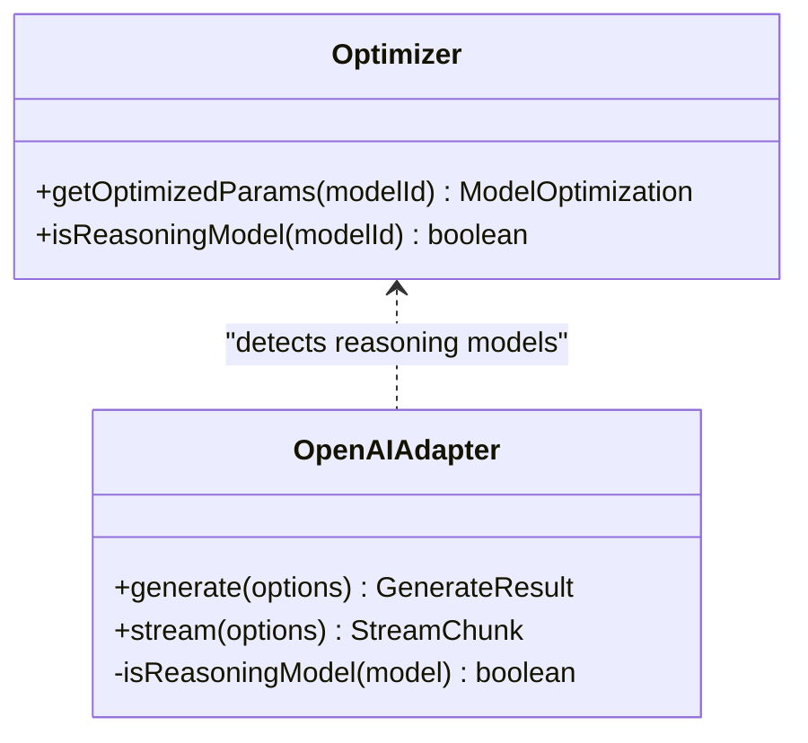
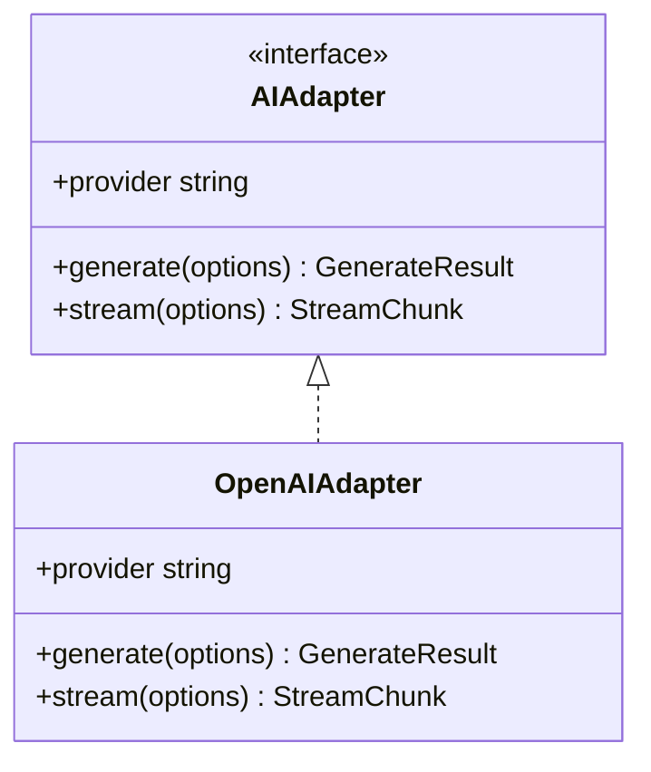
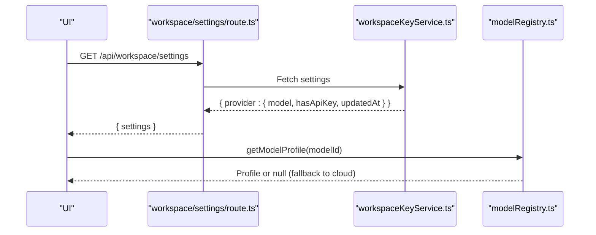
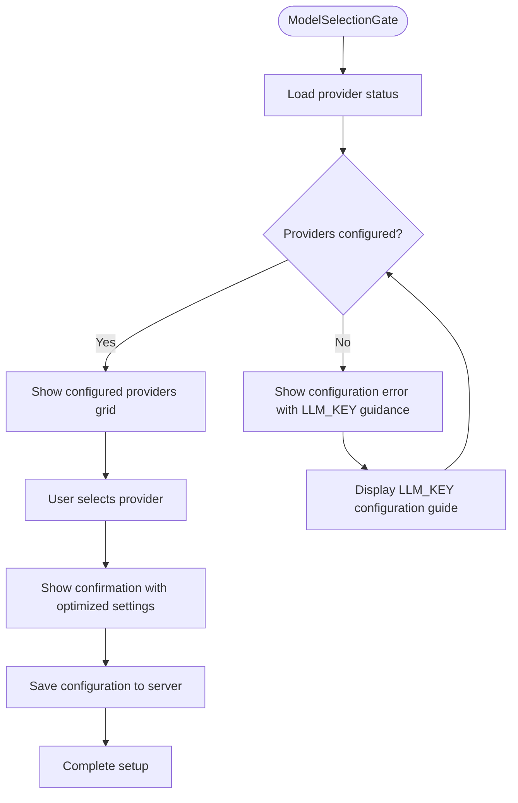
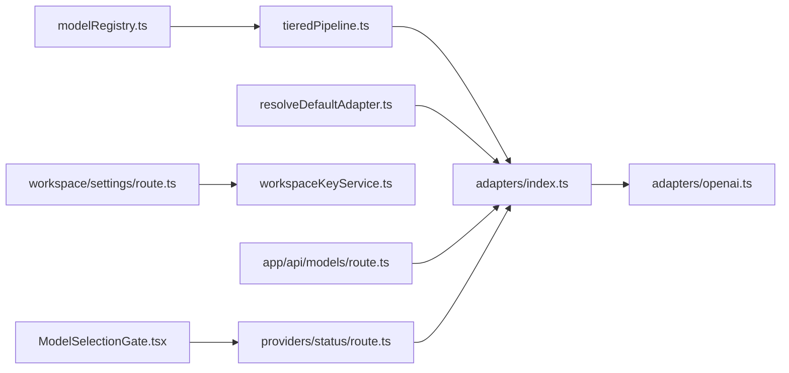

# Model Resolution & Configuration

<cite>
**Referenced Files in This Document**
- [modelRegistry.ts](file://lib/ai/modelRegistry.ts)
- [tieredPipeline.ts](file://lib/ai/tieredPipeline.ts)
- [optimizer.ts](file://lib/ai/optimizer.ts)
- [adapters/index.ts](file://lib/ai/adapters/index.ts)
- [resolveDefaultAdapter.ts](file://lib/ai/resolveDefaultAdapter.ts)
- [adapters/base.ts](file://lib/ai/adapters/base.ts)
- [adapters/openai.ts](file://lib/ai/adapters/openai.ts)
- [workspaceKeyService.ts](file://lib/security/workspaceKeyService.ts)
- [models/route.ts](file://app/api/models/route.ts)
- [workspace/settings/route.ts](file://app/api/workspace/settings/route.ts)
- [ModelSelectionGate.tsx](file://components/ModelSelectionGate.tsx)
- [providers/status/route.ts](file://app/api/providers/status/route.ts)
- [ProviderSelector.tsx](file://components/ProviderSelector.tsx)
- [globals.css](file://app/globals.css)
</cite>

## Update Summary
**Changes Made**
- Updated Ollama Cloud model registry entry for gemma4 to use base model identifier 'gemma4' instead of 'gemma4:e2b'
- Corrected model identification in provider status API and default adapter configuration
- Enhanced model capability detection and partial matching logic for Ollama Cloud models
- Updated troubleshooting guidance for model selection scenarios involving Ollama Cloud models

## Table of Contents
1. [Introduction](#introduction)
2. [Project Structure](#project-structure)
3. [Core Components](#core-components)
4. [Architecture Overview](#architecture-overview)
5. [Detailed Component Analysis](#detailed-component-analysis)
6. [Dependency Analysis](#dependency-analysis)
7. [Performance Considerations](#performance-considerations)
8. [Troubleshooting Guide](#troubleshooting-guide)
9. [Conclusion](#conclusion)

## Introduction
This document explains the model resolution and configuration phase of the generation pipeline. It covers:
- The model registry that catalogs AI models with capabilities, token limits, and feature support
- The tiered pipeline configuration that adapts generation parameters based on model capabilities
- The default adapter resolution process that selects appropriate models based on workspace settings and environment
- The model profile system that distinguishes explicit registrations versus cloud fallback profiles
- Implementation specifics for capability detection, pipeline parameter mapping, and fallback mechanisms
- Examples of model selection scenarios and troubleshooting configuration conflicts

**Updated** Enhanced with corrected Ollama Cloud model naming and improved model identification for gemma4 profile

## Project Structure
The model resolution system spans several modules:
- Registry: central model capability metadata
- Pipeline: maps profiles to runnable generation configs
- Adapters: provider-specific clients with safe parameter handling
- Resolver: chooses default adapters from environment and workspace settings
- Workspace service: stores provider keys and preferred models per workspace
- API routes: expose model lists and workspace settings
- UI components: streamlined provider selection with violet theme

**Diagram sources**
- [modelRegistry.ts](file://lib/ai/modelRegistry.ts)
- [tieredPipeline.ts](file://lib/ai/tieredPipeline.ts)
- [resolveDefaultAdapter.ts](file://lib/ai/resolveDefaultAdapter.ts)
- [adapters/index.ts](file://lib/ai/adapters/index.ts)
- [adapters/openai.ts](file://lib/ai/adapters/openai.ts)
- [adapters/base.ts](file://lib/ai/adapters/base.ts)
- [workspaceKeyService.ts](file://lib/security/workspaceKeyService.ts)
- [models/route.ts](file://app/api/models/route.ts)
- [workspace/settings/route.ts](file://app/api/workspace/settings/route.ts)
- [ModelSelectionGate.tsx](file://components/ModelSelectionGate.tsx)
- [providers/status/route.ts](file://app/api/providers/status/route.ts)
- [ProviderSelector.tsx](file://components/ProviderSelector.tsx)
- [globals.css](file://app/globals.css)

**Section sources**
- [modelRegistry.ts](file://lib/ai/modelRegistry.ts)
- [tieredPipeline.ts](file://lib/ai/tieredPipeline.ts)
- [adapters/index.ts](file://lib/ai/adapters/index.ts)
- [resolveDefaultAdapter.ts](file://lib/ai/resolveDefaultAdapter.ts)
- [workspaceKeyService.ts](file://lib/security/workspaceKeyService.ts)
- [models/route.ts](file://app/api/models/route.ts)
- [workspace/settings/route.ts](file://app/api/workspace/settings/route.ts)
- [ModelSelectionGate.tsx](file://components/ModelSelectionGate.tsx)
- [providers/status/route.ts](file://app/api/providers/status/route.ts)
- [ProviderSelector.tsx](file://components/ProviderSelector.tsx)
- [globals.css](file://app/globals.css)

## Core Components
- Model Registry: defines capability profiles for all supported models, including context windows, output limits, temperature preferences, tool-call support, JSON mode support, streaming reliability, prompt strategies, extraction strategies, repair priorities, and timeouts. Provides partial matching and a cloud fallback profile.
- Tiered Pipeline: transforms a capability profile into a concrete PipelineConfig with prompt style, token budgets, tool rounds, temperature, streaming, timeouts, and repair behavior.
- Optimizer: provides per-model generation hyperparameters (temperature, max tokens) and reasoning model detection for special API handling.
- Adapters: provider-agnostic factory and adapters for OpenAI-compatible providers, Anthropic, Google, and Groq. Handles credential resolution and safe parameter selection.
- Default Adapter Resolver: selects a provider/model based on environment variables and purpose, with explicit overrides and fallbacks.
- Workspace Key Service: persists provider keys and preferred models per workspace and supports runtime retrieval and cache invalidation.
- API Routes: expose model listings and workspace settings for UI consumption.
- ModelSelectionGate: streamlined provider selection UI with violet theme and universal LLM_KEY support.
- Provider Status API: checks environment variables for configured providers and returns optimized settings.

**Updated** Enhanced with corrected Ollama Cloud model naming and improved model identification

**Section sources**
- [modelRegistry.ts](file://lib/ai/modelRegistry.ts)
- [tieredPipeline.ts](file://lib/ai/tieredPipeline.ts)
- [optimizer.ts](file://lib/ai/optimizer.ts)
- [adapters/index.ts](file://lib/ai/adapters/index.ts)
- [resolveDefaultAdapter.ts](file://lib/ai/resolveDefaultAdapter.ts)
- [workspaceKeyService.ts](file://lib/security/workspaceKeyService.ts)
- [models/route.ts](file://app/api/models/route.ts)
- [workspace/settings/route.ts](file://app/api/workspace/settings/route.ts)
- [ModelSelectionGate.tsx](file://components/ModelSelectionGate.tsx)
- [providers/status/route.ts](file://app/api/providers/status/route.ts)
- [ProviderSelector.tsx](file://components/ProviderSelector.tsx)
- [globals.css](file://app/globals.css)

## Architecture Overview
The model resolution pipeline:
1. Resolve a model identifier to a capability profile (registry lookup with partial matching).
2. Map the profile to a PipelineConfig (tier defaults plus profile overrides).
3. Select an adapter using workspace settings and environment variables.
4. Execute generation with provider-specific parameter normalization and safety checks.

**Updated** Enhanced with corrected Ollama Cloud model naming and streamlined provider selection flow

**Diagram sources**
- [modelRegistry.ts](file://lib/ai/modelRegistry.ts)
- [tieredPipeline.ts](file://lib/ai/tieredPipeline.ts)
- [adapters/index.ts](file://lib/ai/adapters/index.ts)
- [adapters/base.ts](file://lib/ai/adapters/base.ts)
- [ModelSelectionGate.tsx](file://components/ModelSelectionGate.tsx)
- [providers/status/route.ts](file://app/api/providers/status/route.ts)

## Detailed Component Analysis

### Model Registry
The registry is the single source of truth for model capabilities. It:
- Defines five tiers (tiny, small, medium, large, cloud) with distinct strategies and defaults
- Supports partial matching for model identifiers (e.g., "gpt-4o-2024-08-06" matches "gpt-4o")
- Never silently fails; unknown models return null and callers must fall back to a sensible default tier
- Provides a cloud fallback profile for unknown models
- Includes provider-specific quirks (e.g., reasoning models, system prompt support, tool-call support, JSON mode, streaming reliability)

Key behaviors:
- Capability detection via exact/partial model ID matching
- Safe defaults for unknown models
- Explicit handling for reasoning models (OpenAI o1/o3) with different API constraints

**Updated** Corrected Ollama Cloud model entry for gemma4 to use base model identifier 'gemma4' instead of 'gemma4:e2b'

**Section sources**
- [modelRegistry.ts](file://lib/ai/modelRegistry.ts)

### Tiered Pipeline Configuration
The pipeline builder:
- Starts from tier defaults and overrides with profile-specific values
- Applies system prompt merging for models that do not honor the system role
- Adjusts tool-call rounds based on model support
- Enables JSON mode only for compatible models and tiers
- Sets streaming based on model reliability
- Assigns repair strategy and model based on tier and repair priority
- Provides helpers to derive configs for a model ID directly

**Diagram sources**
- [tieredPipeline.ts](file://lib/ai/tieredPipeline.ts)
- [modelRegistry.ts](file://lib/ai/modelRegistry.ts)

**Section sources**
- [tieredPipeline.ts](file://lib/ai/tieredPipeline.ts)

### Default Adapter Resolution
The resolver selects an adapter based on:
- Purpose-specific environment overrides (e.g., INTENT_MODEL/PROVIDER/API_KEY)
- Generic DEFAULT_MODEL/PROVIDER overrides
- Provider API keys discovered in priority order (Groq, Google, Anthropic, OpenAI)
- **Updated** Enhanced with corrected Ollama Cloud model naming for gemma4 profile
- Unconfigured adapter as a graceful fallback

Credential resolution:
- Workspace-scoped keys via workspaceKeyService
- Environment variables with provider-specific names
- **Enhanced** Universal LLM_KEY support for all providers
- OpenAI-compatible providers via base URLs

**Diagram sources**
- [resolveDefaultAdapter.ts](file://lib/ai/resolveDefaultAdapter.ts)
- [adapters/index.ts](file://lib/ai/adapters/index.ts)
- [workspaceKeyService.ts](file://lib/security/workspaceKeyService.ts)

**Section sources**
- [resolveDefaultAdapter.ts](file://lib/ai/resolveDefaultAdapter.ts)
- [adapters/index.ts](file://lib/ai/adapters/index.ts)
- [workspaceKeyService.ts](file://lib/security/workspaceKeyService.ts)

### Model Capability Detection and Parameter Mapping
- Optimizer maps model IDs to generation hyperparameters (temperature, max tokens, reasoning flag) with partial matching and defaults
- Adapter factories normalize parameters for provider constraints (e.g., reasoning models omit temperature/max_tokens, use max_completion_tokens)
- OpenAI adapter merges system messages into user for models that do not support system role
- OpenAI adapter selectively enables response_format, tools, and tool_choice depending on provider and model constraints

**Diagram sources**
- [optimizer.ts](file://lib/ai/optimizer.ts)
- [adapters/openai.ts](file://lib/ai/adapters/openai.ts)

**Section sources**
- [optimizer.ts](file://lib/ai/optimizer.ts)
- [adapters/openai.ts](file://lib/ai/adapters/openai.ts)

### Adapter Factory and Safety
- Provider detection and base URL mapping for OpenAI-compatible providers
- **Enhanced** Strict credential resolution: never accept client-provided keys; resolve via workspace DB or environment
- **Updated** Enhanced with corrected Ollama Cloud model naming for improved model identification
- Cached adapter wrapper for performance and metrics
- Unconfigured adapter for graceful UI messaging when no credentials are available

**Diagram sources**
- [adapters/base.ts](file://lib/ai/adapters/base.ts)
- [adapters/openai.ts](file://lib/ai/adapters/openai.ts)

**Section sources**
- [adapters/base.ts](file://lib/ai/adapters/base.ts)
- [adapters/index.ts](file://lib/ai/adapters/index.ts)
- [adapters/openai.ts](file://lib/ai/adapters/openai.ts)

### Workspace Settings and Model Profiles
- Workspace settings persist provider keys and preferred models per workspace
- The settings API returns a compact provider map with model and credential presence
- The model list API surfaces provider-specific model catalogs and featured models

**Diagram sources**
- [workspace/settings/route.ts](file://app/api/workspace/settings/route.ts)
- [workspaceKeyService.ts](file://lib/security/workspaceKeyService.ts)
- [modelRegistry.ts](file://lib/ai/modelRegistry.ts)

**Section sources**
- [workspace/settings/route.ts](file://app/api/workspace/settings/route.ts)
- [workspaceKeyService.ts](file://lib/security/workspaceKeyService.ts)
- [modelRegistry.ts](file://lib/ai/modelRegistry.ts)

### ModelSelectionGate Component
**New** Enhanced provider selection UI with streamlined configuration flow and violet theme

The ModelSelectionGate provides an improved user experience for selecting AI providers:
- **Enhanced** Streamlined configuration flow with provider status checking
- **Updated** Visual design system with violet theme and gradient backgrounds
- **New** Universal LLM_KEY support for simplified credential management
- **Improved** Provider status checking via `/api/providers/status` endpoint
- **Enhanced** Optimized settings display with temperature and token recommendations

Key features:
- Real-time provider availability checking
- Optimized settings display per provider
- Violet-themed UI with gradient backgrounds and glow effects
- Universal LLM_KEY support for all providers
- Graceful error handling and configuration guidance

**Diagram sources**
- [ModelSelectionGate.tsx](file://components/ModelSelectionGate.tsx)
- [providers/status/route.ts](file://app/api/providers/status/route.ts)

**Section sources**
- [ModelSelectionGate.tsx](file://components/ModelSelectionGate.tsx)
- [providers/status/route.ts](file://app/api/providers/status/route.ts)
- [globals.css](file://app/globals.css)

### Provider Status Checking System
**New** Enhanced provider status checking with universal LLM_KEY support

The provider status system checks environment variables for configured providers and returns optimized settings:
- **Enhanced** Universal LLM_KEY support for all providers
- **Improved** Debug logging and environment variable inspection
- **Updated** Enhanced with corrected Ollama Cloud model naming for accurate model listing
- **New** Provider-specific environment variable fallbacks

Key functionality:
- Checks for universal LLM_KEY that works for all providers
- Validates provider-specific API keys
- Returns provider configuration with optimized settings
- Provides debug information for development environments

**Section sources**
- [providers/status/route.ts](file://app/api/providers/status/route.ts)

## Dependency Analysis
- modelRegistry.ts depends on no external runtime services; it is the authoritative source for model capabilities
- tieredPipeline.ts depends on modelRegistry.ts and constructs PipelineConfig instances
- adapters/index.ts depends on workspaceKeyService.ts for workspace-scoped keys and environment variables for fallbacks
- **Updated** adapters/openai.ts depends on provider SDKs and normalizes parameters according to model/profile constraints
- resolveDefaultAdapter.ts orchestrates environment-based selection and falls back to cloud providers
- **Updated** API routes depend on adapters and workspace services to expose model catalogs and settings
- **New** ModelSelectionGate depends on provider status API for real-time configuration

**Diagram sources**
- [modelRegistry.ts](file://lib/ai/modelRegistry.ts)
- [tieredPipeline.ts](file://lib/ai/tieredPipeline.ts)
- [adapters/index.ts](file://lib/ai/adapters/index.ts)
- [adapters/openai.ts](file://lib/ai/adapters/openai.ts)
- [resolveDefaultAdapter.ts](file://lib/ai/resolveDefaultAdapter.ts)
- [workspace/settings/route.ts](file://app/api/workspace/settings/route.ts)
- [workspaceKeyService.ts](file://lib/security/workspaceKeyService.ts)
- [models/route.ts](file://app/api/models/route.ts)
- [ModelSelectionGate.tsx](file://components/ModelSelectionGate.tsx)
- [providers/status/route.ts](file://app/api/providers/status/route.ts)

**Section sources**
- [modelRegistry.ts](file://lib/ai/modelRegistry.ts)
- [tieredPipeline.ts](file://lib/ai/tieredPipeline.ts)
- [adapters/index.ts](file://lib/ai/adapters/index.ts)
- [resolveDefaultAdapter.ts](file://lib/ai/resolveDefaultAdapter.ts)
- [workspaceKeyService.ts](file://lib/security/workspaceKeyService.ts)
- [models/route.ts](file://app/api/models/route.ts)
- [workspace/settings/route.ts](file://app/api/workspace/settings/route.ts)
- [ModelSelectionGate.tsx](file://components/ModelSelectionGate.tsx)
- [providers/status/route.ts](file://app/api/providers/status/route.ts)

## Performance Considerations
- Prefer cloud providers (Groq, Google, Anthropic, OpenAI) for production workloads due to better reliability and cost efficiency
- **Updated** Use streaming for models with reliable streaming; otherwise, fall back to non-streaming generation
- Respect maxOutputTokens and blueprintTokenBudget to avoid context overflow and reduce retries
- Cache adapter instances and leverage the built-in caching wrapper for generation and streaming responses
- Avoid enabling JSON mode or tool calls for models that do not support them to prevent 400 errors
- **New** Leverage universal LLM_KEY for simplified credential management across all providers
- **Updated** Enhanced model identification for Ollama Cloud models improves resolution accuracy and reduces misconfiguration

## Troubleshooting Guide
Common issues and resolutions:
- Unknown model ID
  - Symptom: null profile leads to cloud fallback
  - Action: Register the model in the registry or ensure partial match; verify model ID spelling
  - **Updated** For Ollama Cloud models, ensure correct base model identifier (e.g., 'gemma4' not 'gemma4:e2b')
  - Section sources
    - [modelRegistry.ts](file://lib/ai/modelRegistry.ts)
- Missing API key
  - Symptom: ConfigurationError thrown or UnconfiguredAdapter returned
  - Action: Set provider-specific environment variable; confirm workspace settings; verify Vercel environment variables
  - **Updated** Try using universal LLM_KEY for all providers
  - Section sources
    - [adapters/index.ts](file://lib/ai/adapters/index.ts)
    - [workspaceKeyService.ts](file://lib/security/workspaceKeyService.ts)
- Provider mismatch or wrong base URL
  - Symptom: 401/400 errors or unexpected behavior
  - Action: Ensure correct provider detection or explicitly set provider; verify base URL for OpenAI-compatible providers
  - Section sources
    - [adapters/index.ts](file://lib/ai/adapters/index.ts)
- **New** Universal LLM_KEY configuration
  - Symptom: Provider shows as configured but still fails
  - Action: Verify LLM_KEY environment variable contains valid API key for target provider
  - Section sources
    - [providers/status/route.ts](file://app/api/providers/status/route.ts)
    - [adapters/index.ts](file://lib/ai/adapters/index.ts)
- **New** ModelSelectionGate provider issues
  - Symptom: No providers available in selection UI
  - Action: Check environment variables for provider keys or LLM_KEY; verify Vercel environment configuration
  - Section sources
    - [ModelSelectionGate.tsx](file://components/ModelSelectionGate.tsx)
    - [providers/status/route.ts](file://app/api/providers/status/route.ts)
- **Updated** Ollama Cloud model identification issues
  - Symptom: gemma4 model not recognized or incorrectly resolved
  - Action: Use base model identifier 'gemma4' instead of 'gemma4:e2b'; verify model appears in provider status listing
  - Section sources
    - [modelRegistry.ts](file://lib/ai/modelRegistry.ts)
    - [providers/status/route.ts](file://app/api/providers/status/route.ts)
    - [resolveDefaultAdapter.ts](file://lib/ai/resolveDefaultAdapter.ts)
- Reasoning model parameter errors
  - Symptom: 400 errors when sending temperature or response_format
  - Action: Use optimizer's reasoning detection; rely on adapter normalization; avoid unsupported params
  - Section sources
    - [optimizer.ts](file://lib/ai/optimizer.ts)
    - [adapters/openai.ts](file://lib/ai/adapters/openai.ts)
- System prompt ignored
  - Symptom: System messages lost in output
  - Action: Use mergeSystemIntoUser behavior for models that do not support system role
  - Section sources
    - [tieredPipeline.ts](file://lib/ai/tieredPipeline.ts)
    - [adapters/openai.ts](file://lib/ai/adapters/openai.ts)
- Tool calls not working
  - Symptom: Silent failures or 400 errors
  - Action: Disable tools for models/providers that do not support them; verify tool definitions and choices
  - Section sources
    - [tieredPipeline.ts](file://lib/ai/tieredPipeline.ts)
    - [adapters/openai.ts](file://lib/ai/adapters/openai.ts)
- Context overflow
  - Symptom: 400 errors or truncated output
  - Action: Reduce blueprintTokenBudget; respect model contextWindow; use smaller maxOutputTokens
  - Section sources
    - [tieredPipeline.ts](file://lib/ai/tieredPipeline.ts)
    - [modelRegistry.ts](file://lib/ai/modelRegistry.ts)

## Conclusion
The model resolution and configuration system centers on a static registry of model capabilities, a robust pipeline builder that maps profiles to runnable configurations, and a hardened adapter factory that enforces secure credential resolution and provider-specific parameter normalization. **Updated** The system now prioritizes cloud providers (OpenAI, Anthropic, Google, Groq) with universal LLM_KEY support, streamlines provider selection through ModelSelectionGate, and enhances the visual design system with violet themes. The corrected Ollama Cloud model naming ensures accurate model identification and capability profiling for gemma4 and other Ollama-hosted models. Together with default adapter resolution and workspace settings, it ensures predictable, efficient, and safe generation across diverse providers and model families, while gracefully handling unknown models and configuration conflicts.