# Prompt Engineering & Context Injection

<cite>
**Referenced Files in This Document**
- [promptBuilder.ts](file://lib/ai/promptBuilder.ts)
- [prompts.ts](file://lib/ai/prompts.ts)
- [promptBudget.ts](file://lib/ai/promptBudget.ts)
- [tieredPipeline.ts](file://lib/ai/tieredPipeline.ts)
- [knowledgeAggregator.ts](file://lib/ai/knowledgeAggregator.ts)
- [knowledgeBase.ts](file://lib/ai/knowledgeBase.ts)
- [uiCheatSheet.ts](file://lib/ai/uiCheatSheet.ts)
- [memory.ts](file://lib/ai/memory.ts)
- [designRules.ts](file://lib/intelligence/designRules.ts)
- [layoutRegistry.ts](file://lib/intelligence/layoutRegistry.ts)
- [Layout.tsx](file://packages/layout/components/Layout.tsx)
- [tokens/index.ts](file://packages/tokens/index.ts)
- [tokens/colors.ts](file://packages/tokens/colors.ts)
- [tokens/typography.ts](file://packages/tokens/typography.ts)
</cite>

## Update Summary
**Changes Made**
- Enhanced documentation to clarify the restriction of `toStyle()` utility function to typography presets only
- Updated design system enforcement documentation with explicit guidelines for `toStyle()` usage
- Added comprehensive examples of correct and incorrect `toStyle()` usage patterns
- Expanded troubleshooting guidance to address `toStyle()` type errors
- Updated critical design system enforcement with specific `toStyle()` restrictions

## Table of Contents
1. [Introduction](#introduction)
2. [Project Structure](#project-structure)
3. [Core Components](#core-components)
4. [Architecture Overview](#architecture-overview)
5. [Detailed Component Analysis](#detailed-component-analysis)
6. [Dependency Analysis](#dependency-analysis)
7. [Performance Considerations](#performance-considerations)
8. [Troubleshooting Guide](#troubleshooting-guide)
9. [Conclusion](#conclusion)

## Introduction
This document explains the prompt engineering and context injection phase of the generation pipeline. It focuses on:
- Model-aware prompt building that adapts strategies per provider/model tier
- Context fitting algorithms that respect token budgets with progressive truncation
- Semantic knowledge base integration for UI patterns and best practices
- Memory retrieval for relevant examples of similar component generations
- Implementation specifics for prompt template construction, context prioritization, and token budget enforcement
- **Critical Design System Enforcement**: Mandatory @ui/tokens and @ui/core usage with explicit penalties for violations
- **Enhanced `toStyle()` Utility Restrictions**: Explicit guidelines restricting `toStyle()` usage to typography presets only (text.h1, text.body, etc.)

**Updated** Enhanced with critical design system enforcement requiring @ui/tokens and @ui/core usage with "VIOLATION = REJECT" penalties, and explicit restrictions on `toStyle()` utility function usage.

## Project Structure
The prompt engineering and context injection logic is centered around several modules:
- Prompt construction and strategy dispatch
- Prompt templates and few-shot injection
- Token budget management and truncation
- Knowledge aggregation and retrieval
- Memory persistence and example retrieval
- UI ecosystem cheat sheet for sandbox constraints
- **Design System Enforcement**: Critical enforcement of @ui/tokens and @ui/core requirements with `toStyle()` restrictions
- **Typography Utility**: Specialized handling of `toStyle()` function for typography presets only

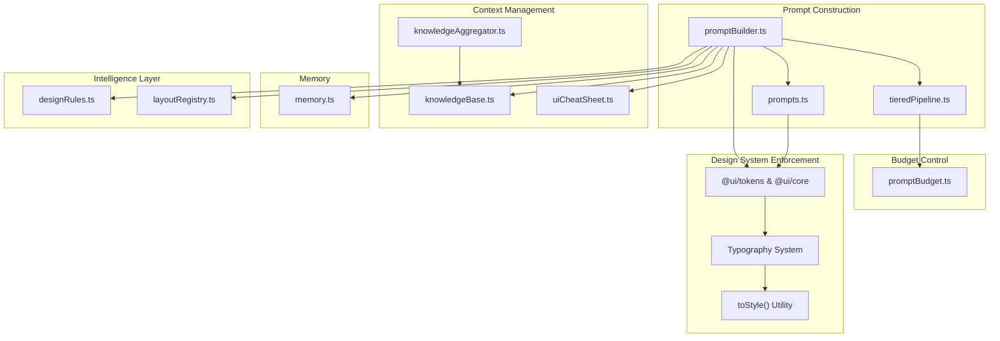

**Diagram sources**
- [promptBuilder.ts:1-367](file://lib/ai/promptBuilder.ts#L1-L367)
- [prompts.ts:1-553](file://lib/ai/prompts.ts#L1-L553)
- [tieredPipeline.ts:1-285](file://lib/ai/tieredPipeline.ts#L1-L285)
- [knowledgeBase.ts:1-293](file://lib/ai/knowledgeBase.ts#L1-L293)
- [knowledgeAggregator.ts:1-312](file://lib/ai/knowledgeAggregator.ts#L1-L312)
- [uiCheatSheet.ts:1-140](file://lib/ai/uiCheatSheet.ts#L1-L140)
- [memory.ts:1-211](file://lib/ai/memory.ts#L1-L211)
- [promptBudget.ts:1-79](file://lib/ai/promptBudget.ts#L1-L79)
- [designRules.ts:1-245](file://lib/intelligence/designRules.ts#L1-L245)
- [layoutRegistry.ts:1-79](file://lib/intelligence/layoutRegistry.ts#L1-L79)
- [tokens/typography.ts:150-160](file://packages/tokens/typography.ts#L150-L160)

**Section sources**
- [promptBuilder.ts:1-367](file://lib/ai/promptBuilder.ts#L1-L367)
- [prompts.ts:1-553](file://lib/ai/prompts.ts#L1-L553)
- [tieredPipeline.ts:1-285](file://lib/ai/tieredPipeline.ts#L1-L285)
- [knowledgeBase.ts:1-293](file://lib/ai/knowledgeBase.ts#L1-L293)
- [knowledgeAggregator.ts:1-312](file://lib/ai/knowledgeAggregator.ts#L1-L312)
- [uiCheatSheet.ts:1-140](file://lib/ai/uiCheatSheet.ts#L1-L140)
- [memory.ts:1-211](file://lib/ai/memory.ts#L1-L211)
- [promptBudget.ts:1-79](file://lib/ai/promptBudget.ts#L1-L79)
- [designRules.ts:1-245](file://lib/intelligence/designRules.ts#L1-L245)
- [layoutRegistry.ts:1-79](file://lib/intelligence/layoutRegistry.ts#L1-L79)

## Core Components
- Model-aware prompt builder: Selects and constructs system/user prompts per model tier and generation mode, with optional knowledge and memory injection.
- Prompt templates: Full system prompts and user prompt builders for component, app, and depth UI modes, plus intent parsing.
- Token budget manager: Estimates tokens and enforces per-tier system/user/output budgets with graceful truncation.
- Knowledge aggregator: Converts structured knowledge sources into semantic chunks for embedding and retrieval.
- Knowledge base: Keyword-driven templates for component/app/depth UI patterns with structured layout guidelines.
- UI cheat sheet: Available packages and APIs in the sandbox to prevent hallucinations.
- Memory: Persists generations and retrieves relevant examples for few-shot learning.
- Intelligence layer: Design rules and layout registry for structured layout recommendations.
- **Design System Enforcement**: Critical enforcement of @ui/tokens and @ui/core usage with explicit rejection penalties for violations.
- **Typography Utility**: Specialized `toStyle()` function restricted to typography presets only, preventing type errors with non-typography tokens.

**Updated** Enhanced with critical design system enforcement requiring mandatory @ui/tokens and @ui/core usage patterns, and explicit `toStyle()` utility restrictions.

**Section sources**
- [promptBuilder.ts:244-311](file://lib/ai/promptBuilder.ts#L244-L311)
- [prompts.ts:74-170](file://lib/ai/prompts.ts#L74-L170)
- [promptBudget.ts:27-79](file://lib/ai/promptBudget.ts#L27-L79)
- [knowledgeAggregator.ts:267-289](file://lib/ai/knowledgeAggregator.ts#L267-L289)
- [knowledgeBase.ts:264-292](file://lib/ai/knowledgeBase.ts#L264-L292)
- [uiCheatSheet.ts:9-53](file://lib/ai/uiCheatSheet.ts#L9-L53)
- [memory.ts:175-210](file://lib/ai/memory.ts#L175-L210)
- [designRules.ts:1-245](file://lib/intelligence/designRules.ts#L1-L245)
- [layoutRegistry.ts:1-79](file://lib/intelligence/layoutRegistry.ts#L1-L79)
- [tokens/typography.ts:150-160](file://packages/tokens/typography.ts#L150-L160)

## Architecture Overview
The prompt engineering pipeline orchestrates intent parsing, blueprint formatting, knowledge and memory injection, and tier-aware prompt construction. It enforces token budgets and merges system prompts when needed. **Critical design system enforcement** ensures all generated code uses @ui/tokens and @ui/core components exclusively when available, with explicit restrictions on `toStyle()` utility function usage.

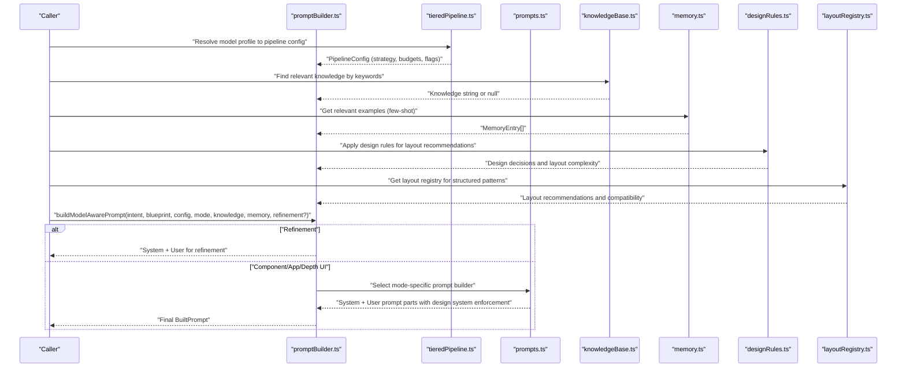

**Diagram sources**
- [promptBuilder.ts:244-311](file://lib/ai/promptBuilder.ts#L244-L311)
- [prompts.ts:141-170](file://lib/ai/prompts.ts#L141-L170)
- [tieredPipeline.ts:191-235](file://lib/ai/tieredPipeline.ts#L191-L235)
- [knowledgeBase.ts:264-292](file://lib/ai/knowledgeBase.ts#L264-L292)
- [memory.ts:175-210](file://lib/ai/memory.ts#L175-L210)
- [designRules.ts:100-200](file://lib/intelligence/designRules.ts#L100-L200)
- [layoutRegistry.ts:56-79](file://lib/intelligence/layoutRegistry.ts#L56-L79)

## Detailed Component Analysis

### Prompt Builder and Strategy Dispatch
- Strategies:
  - fill-in-blank (tiny): Locked imports, skeleton with TODO markers, temperature 0.0
  - structured-template (small): Step-by-step system prompt with blueprint truncation and explicit output format
  - guided-freeform (medium): Style guidelines + design rules with blueprint and knowledge/mem injection
  - freeform (large/cloud): Full system prompts from templates
- Refinement mode: Overrides strategy to enforce precise target file and manifest context
- System merging: When a provider ignores system roles, merges system into user with a separator
- **Design System Enforcement**: Critical enforcement of @ui/tokens and @ui/core usage with explicit rejection penalties
- **Typography Restrictions**: Explicit `toStyle()` usage restrictions for typography presets only

**Updated** Enhanced with critical design system enforcement requiring mandatory @ui/tokens and @ui/core usage patterns, and explicit `toStyle()` utility restrictions.

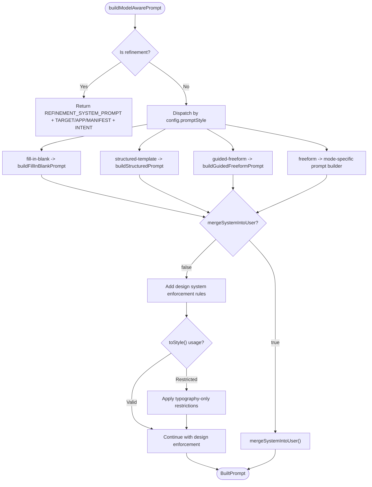

**Diagram sources**
- [promptBuilder.ts:244-311](file://lib/ai/promptBuilder.ts#L244-L311)

**Section sources**
- [promptBuilder.ts:244-311](file://lib/ai/promptBuilder.ts#L244-L311)

### Prompt Templates and Few-Shot Injection
- Component, app, and depth UI system prompts define mandatory rules, imports, accessibility, and output constraints.
- User prompt builders assemble:
  - Intent JSON
  - Knowledge base injection (exact template matches)
  - Memory entries (few-shot examples) with snippet caps
  - Multi-slide/architecture requirements when applicable
- **Design System Enforcement**: Critical @ui/tokens and @ui/core usage requirements with explicit violation penalties
- **Typography Utility**: Explicit `toStyle()` usage restrictions for typography presets only

**Updated** Enhanced with critical design system enforcement requiring @ui/tokens and @ui/core usage patterns, and explicit `toStyle()` utility restrictions.

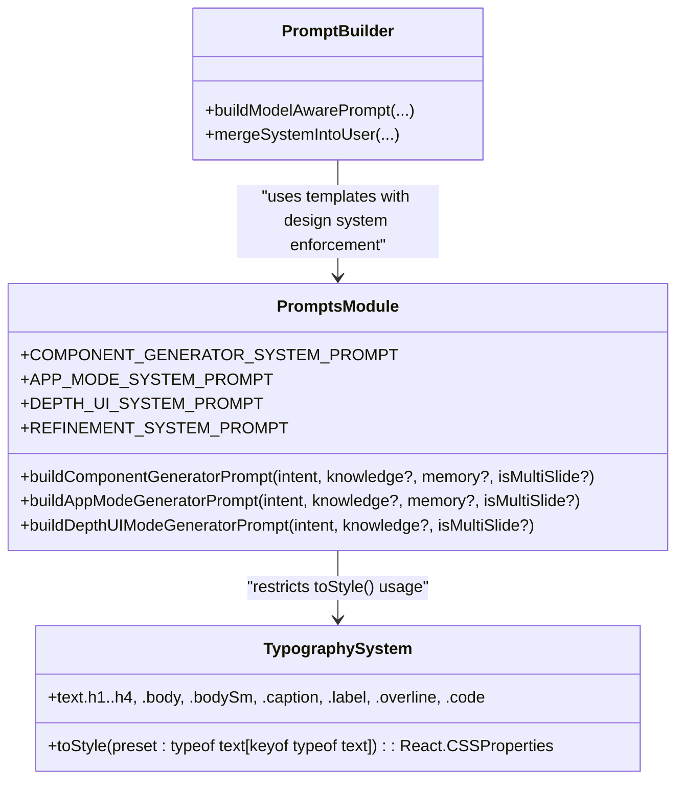

**Diagram sources**
- [prompts.ts:74-170](file://lib/ai/prompts.ts#L74-L170)
- [promptBuilder.ts:244-298](file://lib/ai/promptBuilder.ts#L244-L298)
- [tokens/typography.ts:59-148](file://packages/tokens/typography.ts#L59-L148)

**Section sources**
- [prompts.ts:74-170](file://lib/ai/prompts.ts#L74-L170)
- [promptBuilder.ts:228-298](file://lib/ai/promptBuilder.ts#L228-L298)
- [tokens/typography.ts:150-160](file://packages/tokens/typography.ts#L150-L160)

### Token Budget Enforcement and Progressive Truncation
- Heuristic: ~1 token ≈ 4 characters for English prose/code
- Per-tier system prompt caps guard small-context models
- Available output tokens computed after subtracting system/user and reserved output
- Progressive truncation:
  - Blueprint truncation for small/medium models
  - Context block truncation with newline-aware slicing and budget suffix
  - Memory snippets capped to preserve token headroom
- **Design System Compliance**: Design system enforcement checks integrated into truncation process
- **Typography Compliance**: `toStyle()` usage restrictions maintained during truncation

**Updated** Enhanced with design system compliance checks during truncation, including `toStyle()` usage restrictions.

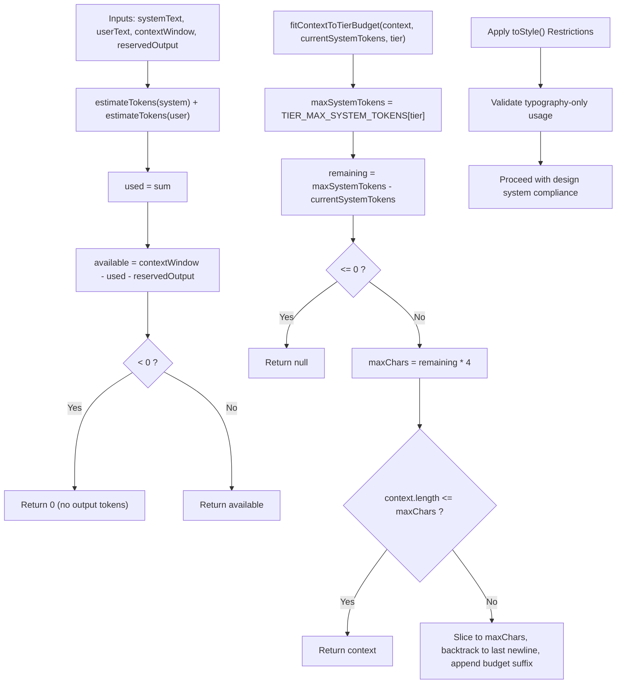

**Diagram sources**
- [promptBudget.ts:41-79](file://lib/ai/promptBudget.ts#L41-L79)
- [tieredPipeline.ts:277-284](file://lib/ai/tieredPipeline.ts#L277-L284)
- [tokens/typography.ts:150-160](file://packages/tokens/typography.ts#L150-L160)

**Section sources**
- [promptBudget.ts:27-79](file://lib/ai/promptBudget.ts#L27-L79)
- [tieredPipeline.ts:277-284](file://lib/ai/tieredPipeline.ts#L277-L284)

### Semantic Knowledge Base Integration
- Knowledge aggregator:
  - Sources: templates, component registry, layout blueprints, depth motion patterns
  - Produces structured, embeddable prose chunks with keywords and IDs
- Knowledge base:
  - Keyword-driven templates for component/app/depth UI patterns
  - Helpers to find exact matches and return tagged knowledge strings
- UI cheat sheet:
  - Lists allowed packages and APIs to prevent hallucinations
- **Design System Integration**: Knowledge base includes design system compliance patterns
- **Typography Integration**: Knowledge base includes `toStyle()` usage guidelines for typography

**Updated** Enhanced with design system integration patterns and `toStyle()` usage guidelines.

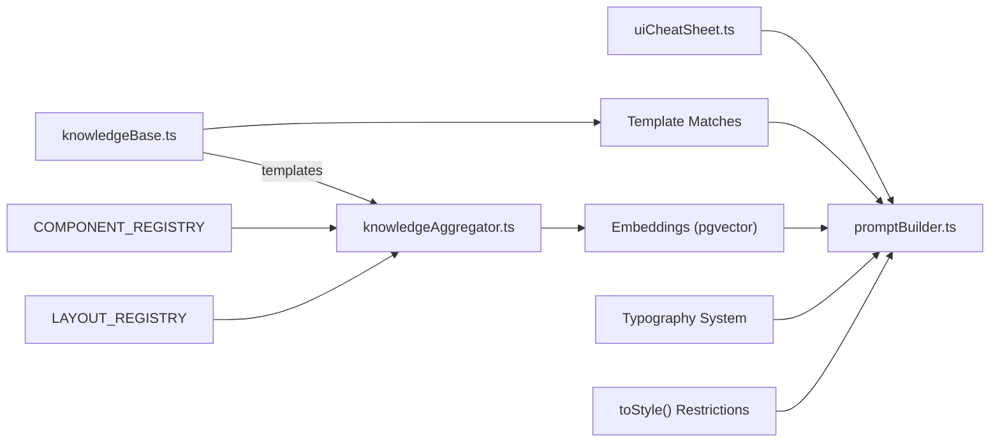

**Diagram sources**
- [knowledgeAggregator.ts:267-289](file://lib/ai/knowledgeAggregator.ts#L267-L289)
- [knowledgeBase.ts:264-292](file://lib/ai/knowledgeBase.ts#L264-L292)
- [uiCheatSheet.ts:9-53](file://lib/ai/uiCheatSheet.ts#L9-L53)
- [promptBuilder.ts:181-183](file://lib/ai/promptBuilder.ts#L181-L183)
- [tokens/typography.ts:150-160](file://packages/tokens/typography.ts#L150-L160)

**Section sources**
- [knowledgeAggregator.ts:1-312](file://lib/ai/knowledgeAggregator.ts#L1-L312)
- [knowledgeBase.ts:1-293](file://lib/ai/knowledgeBase.ts#L1-L293)
- [uiCheatSheet.ts:1-54](file://lib/ai/uiCheatSheet.ts#L1-L54)
- [promptBuilder.ts:181-183](file://lib/ai/promptBuilder.ts#L181-L183)

### Memory System for Few-Shot Examples
- Persists generations with Prisma-backed storage, including intent, code, manifest, and accessibility metrics
- Retrieves recent, highly accessible examples (score threshold) for the same component type
- Provides concise code snippets for inclusion in user prompts
- **Design System Compliance**: Memory retrieval prioritizes examples that correctly use @ui/tokens and @ui/core
- **Typography Compliance**: Memory examples validated for proper `toStyle()` usage patterns

**Updated** Enhanced with design system compliance filtering for memory retrieval and `toStyle()` usage validation.

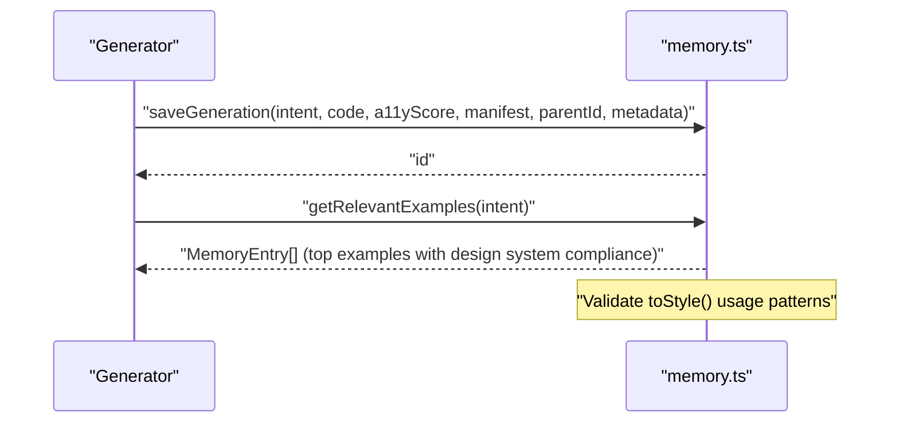

**Diagram sources**
- [memory.ts:55-210](file://lib/ai/memory.ts#L55-L210)

**Section sources**
- [memory.ts:16-211](file://lib/ai/memory.ts#L16-L211)

### Intelligence Layer for Structured Layouts
- Design rules: Apply heuristics for navigation style, layout complexity, depth UI suitability, and motion strategies
- Layout registry: Comprehensive catalog of layout patterns with structured grid compatibility
- Integration: Automatically suggests appropriate layout structures based on component requirements
- **Design System Alignment**: Intelligence layer ensures layout recommendations align with design system constraints
- **Typography Alignment**: Intelligence layer validates typography usage with `toStyle()` restrictions

**New** Added intelligence layer for structured layout recommendations and compatibility checking.

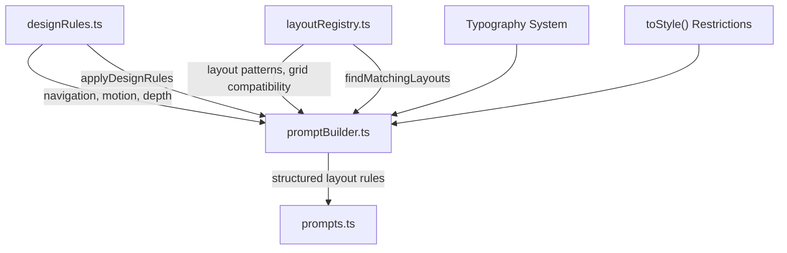

**Diagram sources**
- [designRules.ts:100-200](file://lib/intelligence/designRules.ts#L100-L200)
- [layoutRegistry.ts:56-79](file://lib/intelligence/layoutRegistry.ts#L56-L79)
- [promptBuilder.ts:244-311](file://lib/ai/promptBuilder.ts#L244-L311)
- [tokens/typography.ts:150-160](file://packages/tokens/typography.ts#L150-L160)

**Section sources**
- [designRules.ts:1-245](file://lib/intelligence/designRules.ts#L1-L245)
- [layoutRegistry.ts:1-79](file://lib/intelligence/layoutRegistry.ts#L1-L79)
- [promptBuilder.ts:244-311](file://lib/ai/promptBuilder.ts#L244-L311)

### Critical Design System Enforcement
- **Mandatory Usage**: @ui/tokens and @ui/core are NOT optional — they are the project's design system
- **Explicit Penalties**: "VIOLATION = REJECT" for any non-compliant usage
- **Comprehensive Coverage**: All color, spacing, typography, and component usage must follow design system patterns
- **Typography Restrictions**: `toStyle()` utility function is restricted to typography presets only (text.h1, text.body, etc.)
- **Enforcement Mechanisms**: Systematic checks during prompt construction and validation
- **Type Safety**: Prevents type errors when attempting to use `toStyle()` with non-typography tokens like colors, spacing, or other design tokens

**New** Added comprehensive design system enforcement documentation with explicit `toStyle()` usage restrictions.

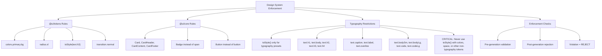

**Diagram sources**
- [promptBuilder.ts:257-269](file://lib/ai/promptBuilder.ts#L257-L269)
- [prompts.ts:100-115](file://lib/ai/prompts.ts#L100-L115)
- [tokens/typography.ts:150-160](file://packages/tokens/typography.ts#L150-L160)

**Section sources**
- [promptBuilder.ts:257-269](file://lib/ai/promptBuilder.ts#L257-L269)
- [prompts.ts:100-115](file://lib/ai/prompts.ts#L100-L115)
- [tokens/typography.ts:150-160](file://packages/tokens/typography.ts#L150-L160)

### Typography Utility System
- **Restricted Usage**: The `toStyle()` function is designed specifically for typography presets
- **Function Signature**: `toStyle(preset: typeof text[keyof typeof text]): React.CSSProperties`
- **Allowed Presets**: text.h1, text.body, text.h2, text.h3, text.h4, text.caption, text.label, text.overline, text.bodySm, text.bodyLg, text.code, text.codeLg
- **Prohibited Usage**: Never use `toStyle()` with colors, spacing, radius, shadow, or other non-typography tokens
- **Type Safety**: The function signature prevents compilation when used with non-typography tokens
- **Correct Usage Pattern**: `style={toStyle(text.h3)}` instead of `className="text-2xl font-bold"`

**New** Added dedicated typography utility documentation with explicit usage restrictions.

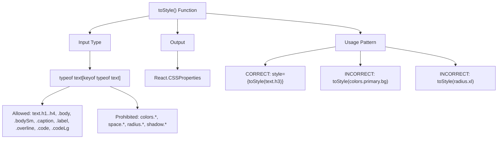

**Diagram sources**
- [tokens/typography.ts:150-160](file://packages/tokens/typography.ts#L150-L160)

**Section sources**
- [tokens/typography.ts:150-160](file://packages/tokens/typography.ts#L150-L160)

## Dependency Analysis
- promptBuilder depends on:
  - tieredPipeline for strategy and budgets
  - prompts for templates and user prompt builders
  - memory for examples
  - knowledgeBase for keyword-driven knowledge
  - uiCheatSheet for sandbox constraints
  - designRules for layout recommendations
  - layoutRegistry for structured patterns
  - **designSystem for @ui/tokens and @ui/core enforcement**
  - **typography for `toStyle()` utility restrictions**
- promptBudget provides shared budget utilities used by tieredPipeline
- knowledgeAggregator feeds embeddings used for retrieval (conceptual dependency)

**Updated** Enhanced with design system dependency integration and typography utility restrictions.

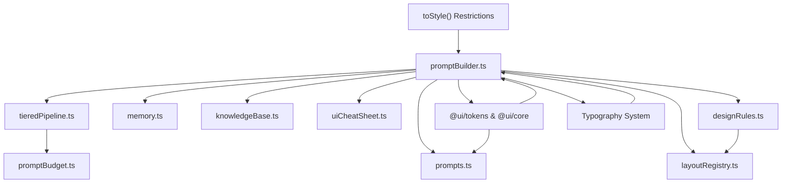

**Diagram sources**
- [promptBuilder.ts:33-44](file://lib/ai/promptBuilder.ts#L33-L44)
- [tieredPipeline.ts:21-29](file://lib/ai/tieredPipeline.ts#L21-L29)
- [prompts.ts:5-6](file://lib/ai/prompts.ts#L5-L6)
- [memory.ts:12-14](file://lib/ai/memory.ts#L12-L14)
- [knowledgeBase.ts:25-27](file://lib/ai/knowledgeBase.ts#L25-L27)
- [uiCheatSheet.ts](file://lib/ai/uiCheatSheet.ts#L5)
- [promptBudget.ts:12-13](file://lib/ai/promptBudget.ts#L12-L13)
- [designRules.ts:1-245](file://lib/intelligence/designRules.ts#L1-L245)
- [layoutRegistry.ts:1-79](file://lib/intelligence/layoutRegistry.ts#L1-L79)
- [tokens/typography.ts:150-160](file://packages/tokens/typography.ts#L150-L160)

**Section sources**
- [promptBuilder.ts:33-44](file://lib/ai/promptBuilder.ts#L33-L44)
- [tieredPipeline.ts:21-29](file://lib/ai/tieredPipeline.ts#L21-L29)
- [prompts.ts:5-6](file://lib/ai/prompts.ts#L5-L6)
- [memory.ts:12-14](file://lib/ai/memory.ts#L12-L14)
- [knowledgeBase.ts:25-27](file://lib/ai/knowledgeBase.ts#L25-L27)
- [uiCheatSheet.ts](file://lib/ai/uiCheatSheet.ts#L5)
- [promptBudget.ts:12-13](file://lib/ai/promptBudget.ts#L12-L13)
- [designRules.ts:1-245](file://lib/intelligence/designRules.ts#L1-L245)
- [layoutRegistry.ts:1-79](file://lib/intelligence/layoutRegistry.ts#L1-L79)

## Performance Considerations
- Prefer smaller token budgets for small/medium models to avoid context overflows
- Use newline-aware truncation to avoid splitting mid-line and maintain validity
- Cap memory snippets to minimize token overhead while preserving structure
- Limit knowledge injection length and avoid redundant repetition
- Disable streaming or adjust timeouts per model reliability profile
- **Design System Compliance**: Ensure design system rules don't exceed token budgets, especially for comprehensive enforcement checks
- **Critical Enforcement**: Design system validation adds computational overhead but ensures compliance
- **Typography Efficiency**: `toStyle()` restrictions prevent unnecessary token usage for non-typography tokens

## Troubleshooting Guide
Common issues and resolutions:
- Provider ignores system role:
  - Enable mergeSystemIntoUser in pipeline config; promptBuilder will collapse system into user with a separator
  - Verify mergeSystemIntoUser is respected in the final BuiltPrompt
- Context overflow on small models:
  - Reduce blueprintTokenBudget or enable progressive truncation
  - Use fitContextToTierBudget for additional context blocks
- Hallucinated imports or packages:
  - Inject UI cheat sheet and locked imports for tiny/small models
  - Restrict imports in system prompts
- Few-shot examples not helping:
  - Ensure examples are highly accessible and relevant by component type
  - Limit snippet length and avoid full code dumps
- Knowledge not matched:
  - Expand keywords in knowledgeBase entries
  - Normalize prompt text before matching
- **Design System Violations**:
  - **Critical**: "VIOLATION = REJECT" for any non-compliant usage
  - Ensure all color, spacing, typography, and component usage follows @ui/tokens and @ui/core patterns
  - Use exact token names: colors.primary.bg, radius.xl, toStyle(text.h3), transition.normal
  - Replace raw Tailwind values with design system tokens when user references them
  - Use @ui/core components: Card, Badge, Button instead of raw HTML elements
- **Typography Issues**:
  - **CRITICAL**: `toStyle()` function is restricted to typography presets only
  - **Correct Usage**: `style={toStyle(text.h3)}` for typography styles
  - **Incorrect Usage**: Never use `toStyle()` with colors, spacing, radius, or other non-typography tokens
  - **Type Errors**: Using `toStyle()` with non-typography tokens will cause compilation errors due to type restrictions
  - **Alternative Patterns**: Use direct token access for non-typography tokens: `colors.primary.bg`, `radius.xl`, `spacing[4]`
- **Enforcement Failures**:
  - Implement systematic design system validation before code generation
  - Use style prop for tokens that return CSS values
  - Apply tokens consistently across all design elements
  - Test with comprehensive examples of correct vs incorrect usage patterns
  - Validate `toStyle()` usage against typography presets only

**Section sources**
- [promptBuilder.ts:306-311](file://lib/ai/promptBuilder.ts#L306-L311)
- [tieredPipeline.ts:204-205](file://lib/ai/tieredPipeline.ts#L204-L205)
- [tieredPipeline.ts:277-284](file://lib/ai/tieredPipeline.ts#L277-L284)
- [promptBudget.ts:59-78](file://lib/ai/promptBudget.ts#L59-L78)
- [promptBuilder.ts:60-66](file://lib/ai/promptBuilder.ts#L60-L66)
- [prompts.ts:78-83](file://lib/ai/prompts.ts#L78-L83)
- [uiCheatSheet.ts:9-53](file://lib/ai/uiCheatSheet.ts#L9-L53)
- [memory.ts:175-210](file://lib/ai/memory.ts#L175-L210)
- [prompts.ts:153-163](file://lib/ai/prompts.ts#L153-L163)
- [knowledgeBase.ts:264-292](file://lib/ai/knowledgeBase.ts#L264-L292)
- [promptBuilder.ts:257-269](file://lib/ai/promptBuilder.ts#L257-L269)
- [tokens/typography.ts:150-160](file://packages/tokens/typography.ts#L150-L160)

## Conclusion
The prompt engineering and context injection system adapts to model capabilities while enforcing strict token budgets. It integrates structured knowledge, curated examples, and sandbox constraints to produce high-quality, accessible UI components across tiers and modes. **Critical design system enforcement** ensures all generated code adheres to @ui/tokens and @ui/core requirements with explicit "VIOLATION = REJECT" penalties for non-compliance. **Enhanced** with mandatory design system usage patterns that replace advisory guidance with strict enforcement mechanisms, ensuring consistent visual identity and design language adherence across all generated components. **Typography Restrictions** add an additional layer of type safety by restricting `toStyle()` utility function usage to typography presets only, preventing type errors and ensuring proper token usage patterns. Progressive truncation, careful few-shot curation, and model-aware strategies ensure reliable generation outcomes with consistent design system compliance and typography safety.