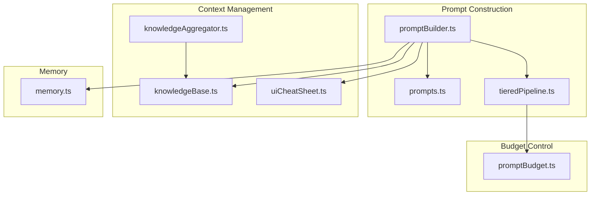
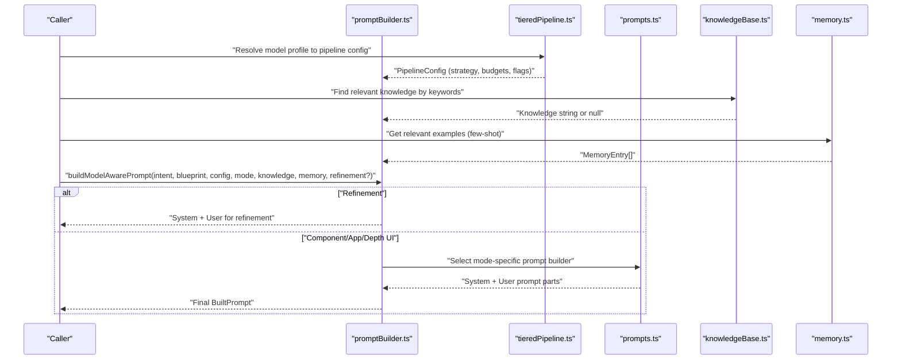
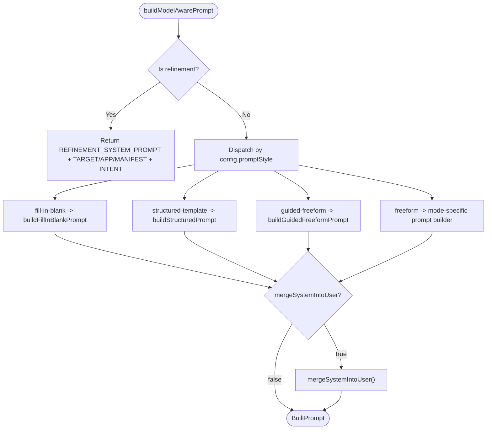
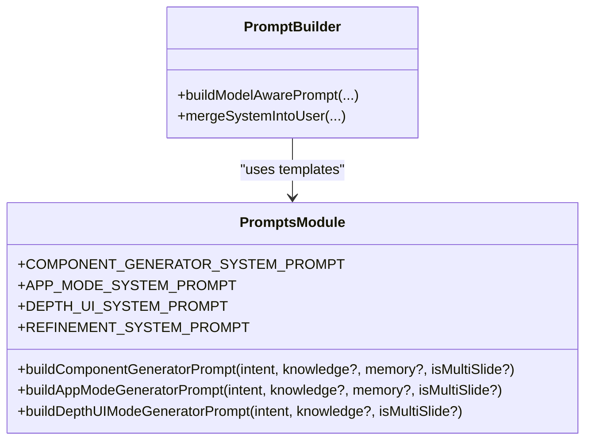
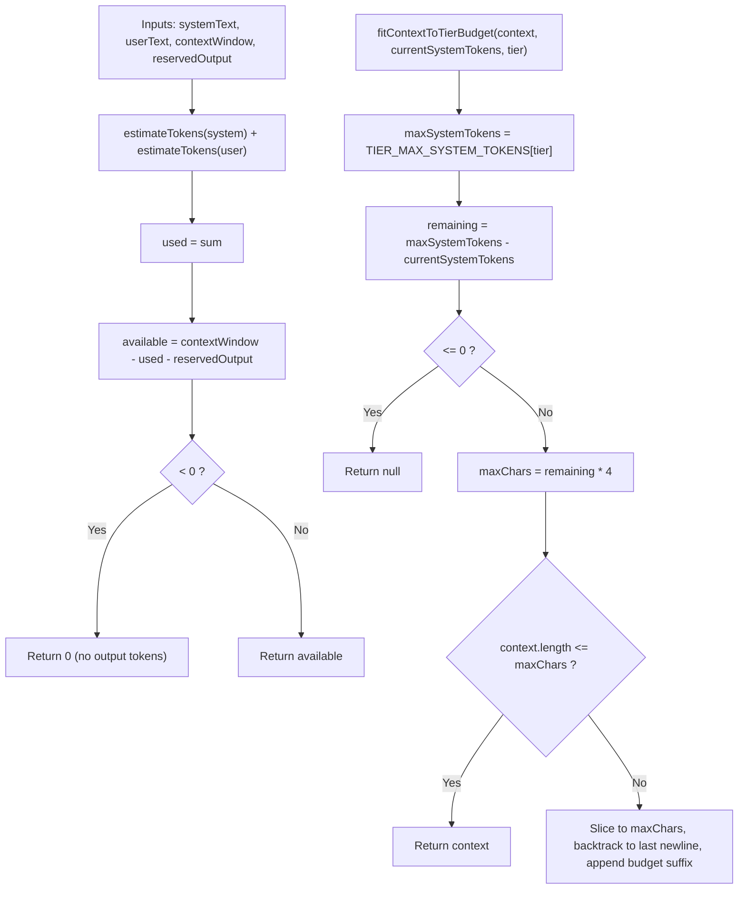
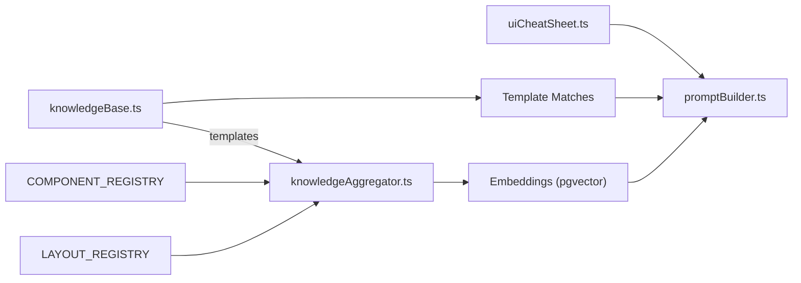
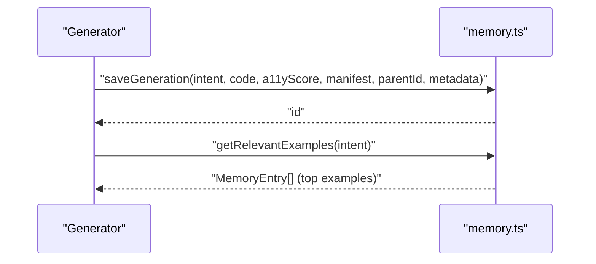
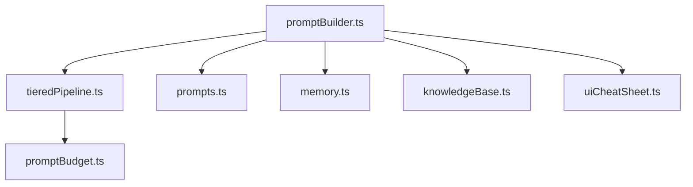

# Prompt Engineering & Context Injection

<cite>
**Referenced Files in This Document**
- [promptBuilder.ts](file://lib/ai/promptBuilder.ts)
- [prompts.ts](file://lib/ai/prompts.ts)
- [promptBudget.ts](file://lib/ai/promptBudget.ts)
- [tieredPipeline.ts](file://lib/ai/tieredPipeline.ts)
- [knowledgeAggregator.ts](file://lib/ai/knowledgeAggregator.ts)
- [knowledgeBase.ts](file://lib/ai/knowledgeBase.ts)
- [uiCheatSheet.ts](file://lib/ai/uiCheatSheet.ts)
- [memory.ts](file://lib/ai/memory.ts)
</cite>

## Table of Contents
1. [Introduction](#introduction)
2. [Project Structure](#project-structure)
3. [Core Components](#core-components)
4. [Architecture Overview](#architecture-overview)
5. [Detailed Component Analysis](#detailed-component-analysis)
6. [Dependency Analysis](#dependency-analysis)
7. [Performance Considerations](#performance-considerations)
8. [Troubleshooting Guide](#troubleshooting-guide)
9. [Conclusion](#conclusion)

## Introduction
This document explains the prompt engineering and context injection phase of the generation pipeline. It focuses on:
- Model-aware prompt building that adapts strategies per provider/model tier
- Context fitting algorithms that respect token budgets with progressive truncation
- Semantic knowledge base integration for UI patterns and best practices
- Memory retrieval for relevant examples of similar component generations
- Implementation specifics for prompt template construction, context prioritization, and token budget enforcement

## Project Structure
The prompt engineering and context injection logic is centered around several modules:
- Prompt construction and strategy dispatch
- Prompt templates and few-shot injection
- Token budget management and truncation
- Knowledge aggregation and retrieval
- Memory persistence and example retrieval
- UI ecosystem cheat sheet for sandbox constraints

**Diagram sources**
- [promptBuilder.ts:1-312](file://lib/ai/promptBuilder.ts#L1-L312)
- [prompts.ts:1-467](file://lib/ai/prompts.ts#L1-L467)
- [tieredPipeline.ts:1-285](file://lib/ai/tieredPipeline.ts#L1-L285)
- [knowledgeBase.ts:1-293](file://lib/ai/knowledgeBase.ts#L1-L293)
- [knowledgeAggregator.ts:1-312](file://lib/ai/knowledgeAggregator.ts#L1-L312)
- [uiCheatSheet.ts:1-54](file://lib/ai/uiCheatSheet.ts#L1-L54)
- [memory.ts:1-211](file://lib/ai/memory.ts#L1-L211)
- [promptBudget.ts:1-79](file://lib/ai/promptBudget.ts#L1-L79)

**Section sources**
- [promptBuilder.ts:1-312](file://lib/ai/promptBuilder.ts#L1-L312)
- [prompts.ts:1-467](file://lib/ai/prompts.ts#L1-L467)
- [tieredPipeline.ts:1-285](file://lib/ai/tieredPipeline.ts#L1-L285)
- [knowledgeBase.ts:1-293](file://lib/ai/knowledgeBase.ts#L1-L293)
- [knowledgeAggregator.ts:1-312](file://lib/ai/knowledgeAggregator.ts#L1-L312)
- [uiCheatSheet.ts:1-54](file://lib/ai/uiCheatSheet.ts#L1-L54)
- [memory.ts:1-211](file://lib/ai/memory.ts#L1-L211)
- [promptBudget.ts:1-79](file://lib/ai/promptBudget.ts#L1-L79)

## Core Components
- Model-aware prompt builder: Selects and constructs system/user prompts per model tier and generation mode, with optional knowledge and memory injection.
- Prompt templates: Full system prompts and user prompt builders for component, app, and depth UI modes, plus intent parsing.
- Token budget manager: Estimates tokens and enforces per-tier system/user/output budgets with graceful truncation.
- Knowledge aggregator: Converts structured knowledge sources into semantic chunks for embedding and retrieval.
- Knowledge base: Keyword-driven templates for component/app/depth UI patterns.
- UI cheat sheet: Available packages and APIs in the sandbox to prevent hallucinations.
- Memory: Persists generations and retrieves relevant examples for few-shot learning.

**Section sources**
- [promptBuilder.ts:244-298](file://lib/ai/promptBuilder.ts#L244-L298)
- [prompts.ts:74-170](file://lib/ai/prompts.ts#L74-L170)
- [promptBudget.ts:27-79](file://lib/ai/promptBudget.ts#L27-L79)
- [knowledgeAggregator.ts:267-289](file://lib/ai/knowledgeAggregator.ts#L267-L289)
- [knowledgeBase.ts:264-292](file://lib/ai/knowledgeBase.ts#L264-L292)
- [uiCheatSheet.ts:9-53](file://lib/ai/uiCheatSheet.ts#L9-L53)
- [memory.ts:175-210](file://lib/ai/memory.ts#L175-L210)

## Architecture Overview
The prompt engineering pipeline orchestrates intent parsing, blueprint formatting, knowledge and memory injection, and tier-aware prompt construction. It enforces token budgets and merges system prompts when needed.

**Diagram sources**
- [promptBuilder.ts:244-298](file://lib/ai/promptBuilder.ts#L244-L298)
- [prompts.ts:141-170](file://lib/ai/prompts.ts#L141-L170)
- [tieredPipeline.ts:191-235](file://lib/ai/tieredPipeline.ts#L191-L235)
- [knowledgeBase.ts:264-292](file://lib/ai/knowledgeBase.ts#L264-L292)
- [memory.ts:175-210](file://lib/ai/memory.ts#L175-L210)

## Detailed Component Analysis

### Prompt Builder and Strategy Dispatch
- Strategies:
  - fill-in-blank (tiny): Locked imports, skeleton with TODO markers, temperature 0.0
  - structured-template (small): Step-by-step system prompt with blueprint truncation and explicit output format
  - guided-freeform (medium): Style guidelines + design rules with blueprint and knowledge/mem injection
  - freeform (large/cloud): Full system prompts from templates
- Refinement mode: Overrides strategy to enforce precise target file and manifest context
- System merging: When a provider ignores system roles, merges system into user with a separator

**Diagram sources**
- [promptBuilder.ts:244-311](file://lib/ai/promptBuilder.ts#L244-L311)

**Section sources**
- [promptBuilder.ts:244-311](file://lib/ai/promptBuilder.ts#L244-L311)

### Prompt Templates and Few-Shot Injection
- Component, app, and depth UI system prompts define mandatory rules, imports, accessibility, and output constraints.
- User prompt builders assemble:
  - Intent JSON
  - Knowledge base injection (exact template matches)
  - Memory entries (few-shot examples) with snippet caps
  - Multi-slide/architecture requirements when applicable

**Diagram sources**
- [prompts.ts:74-170](file://lib/ai/prompts.ts#L74-L170)
- [promptBuilder.ts:244-298](file://lib/ai/promptBuilder.ts#L244-L298)

**Section sources**
- [prompts.ts:74-170](file://lib/ai/prompts.ts#L74-L170)
- [promptBuilder.ts:228-298](file://lib/ai/promptBuilder.ts#L228-L298)

### Token Budget Enforcement and Progressive Truncation
- Heuristic: ~1 token ≈ 4 characters for English prose/code
- Per-tier system prompt caps guard small-context models
- Available output tokens computed after subtracting system/user and reserved output
- Progressive truncation:
  - Blueprint truncation for small/medium models
  - Context block truncation with newline-aware slicing and budget suffix
  - Memory snippets capped to preserve token headroom

**Diagram sources**
- [promptBudget.ts:41-79](file://lib/ai/promptBudget.ts#L41-L79)
- [tieredPipeline.ts:277-284](file://lib/ai/tieredPipeline.ts#L277-L284)

**Section sources**
- [promptBudget.ts:27-79](file://lib/ai/promptBudget.ts#L27-L79)
- [tieredPipeline.ts:277-284](file://lib/ai/tieredPipeline.ts#L277-L284)

### Semantic Knowledge Base Integration
- Knowledge aggregator:
  - Sources: templates, component registry, layout blueprints, depth motion patterns
  - Produces structured, embeddable prose chunks with keywords and IDs
- Knowledge base:
  - Keyword-driven templates for component/app/depth UI patterns
  - Helpers to find exact matches and return tagged knowledge strings
- UI cheat sheet:
  - Lists allowed packages and APIs to prevent hallucinations

**Diagram sources**
- [knowledgeAggregator.ts:267-289](file://lib/ai/knowledgeAggregator.ts#L267-L289)
- [knowledgeBase.ts:264-292](file://lib/ai/knowledgeBase.ts#L264-L292)
- [uiCheatSheet.ts:9-53](file://lib/ai/uiCheatSheet.ts#L9-L53)
- [promptBuilder.ts:181-183](file://lib/ai/promptBuilder.ts#L181-L183)

**Section sources**
- [knowledgeAggregator.ts:1-312](file://lib/ai/knowledgeAggregator.ts#L1-L312)
- [knowledgeBase.ts:1-293](file://lib/ai/knowledgeBase.ts#L1-L293)
- [uiCheatSheet.ts:1-54](file://lib/ai/uiCheatSheet.ts#L1-L54)
- [promptBuilder.ts:181-183](file://lib/ai/promptBuilder.ts#L181-L183)

### Memory System for Few-Shot Examples
- Persists generations with Prisma-backed storage, including intent, code, manifest, and accessibility metrics
- Retrieves recent, highly accessible examples (score threshold) for the same component type
- Provides concise code snippets for inclusion in user prompts

**Diagram sources**
- [memory.ts:55-210](file://lib/ai/memory.ts#L55-L210)

**Section sources**
- [memory.ts:16-211](file://lib/ai/memory.ts#L16-L211)

## Dependency Analysis
- promptBuilder depends on:
  - tieredPipeline for strategy and budgets
  - prompts for templates and user prompt builders
  - memory for examples
  - knowledgeBase for keyword-driven knowledge
  - uiCheatSheet for sandbox constraints
- promptBudget provides shared budget utilities used by tieredPipeline
- knowledgeAggregator feeds embeddings used for retrieval (conceptual dependency)

**Diagram sources**
- [promptBuilder.ts:33-44](file://lib/ai/promptBuilder.ts#L33-L44)
- [tieredPipeline.ts:21-29](file://lib/ai/tieredPipeline.ts#L21-L29)
- [prompts.ts:5-6](file://lib/ai/prompts.ts#L5-L6)
- [memory.ts:12-14](file://lib/ai/memory.ts#L12-L14)
- [knowledgeBase.ts:25-27](file://lib/ai/knowledgeBase.ts#L25-L27)
- [uiCheatSheet.ts](file://lib/ai/uiCheatSheet.ts#L5)
- [promptBudget.ts:12-13](file://lib/ai/promptBudget.ts#L12-L13)

**Section sources**
- [promptBuilder.ts:33-44](file://lib/ai/promptBuilder.ts#L33-L44)
- [tieredPipeline.ts:21-29](file://lib/ai/tieredPipeline.ts#L21-L29)
- [prompts.ts:5-6](file://lib/ai/prompts.ts#L5-L6)
- [memory.ts:12-14](file://lib/ai/memory.ts#L12-L14)
- [knowledgeBase.ts:25-27](file://lib/ai/knowledgeBase.ts#L25-L27)
- [uiCheatSheet.ts](file://lib/ai/uiCheatSheet.ts#L5)
- [promptBudget.ts:12-13](file://lib/ai/promptBudget.ts#L12-L13)

## Performance Considerations
- Prefer smaller token budgets for small/medium models to avoid context overflows
- Use newline-aware truncation to avoid splitting mid-line and maintain validity
- Cap memory snippets to minimize token overhead while preserving structure
- Limit knowledge injection length and avoid redundant repetition
- Disable streaming or adjust timeouts per model reliability profile

## Troubleshooting Guide
Common issues and resolutions:
- Provider ignores system role:
  - Enable mergeSystemIntoUser in pipeline config; promptBuilder will collapse system into user with a separator
  - Verify mergeSystemIntoUser is respected in the final BuiltPrompt
  - Section sources
    - [promptBuilder.ts:306-311](file://lib/ai/promptBuilder.ts#L306-L311)
    - [tieredPipeline.ts:204-205](file://lib/ai/tieredPipeline.ts#L204-L205)
- Context overflow on small models:
  - Reduce blueprintTokenBudget or enable progressive truncation
  - Use fitContextToTierBudget for additional context blocks
  - Section sources
    - [tieredPipeline.ts:277-284](file://lib/ai/tieredPipeline.ts#L277-L284)
    - [promptBudget.ts:59-78](file://lib/ai/promptBudget.ts#L59-L78)
- Hallucinated imports or packages:
  - Inject UI cheat sheet and locked imports for tiny/small models
  - Restrict imports in system prompts
  - Section sources
    - [promptBuilder.ts:60-66](file://lib/ai/promptBuilder.ts#L60-L66)
    - [prompts.ts:78-83](file://lib/ai/prompts.ts#L78-L83)
    - [uiCheatSheet.ts:9-53](file://lib/ai/uiCheatSheet.ts#L9-L53)
- Few-shot examples not helping:
  - Ensure examples are highly accessible and relevant by component type
  - Limit snippet length and avoid full code dumps
  - Section sources
    - [memory.ts:175-210](file://lib/ai/memory.ts#L175-L210)
    - [prompts.ts:153-163](file://lib/ai/prompts.ts#L153-L163)
- Knowledge not matched:
  - Expand keywords in knowledgeBase entries
  - Normalize prompt text before matching
  - Section sources
    - [knowledgeBase.ts:264-292](file://lib/ai/knowledgeBase.ts#L264-L292)

## Conclusion
The prompt engineering and context injection system adapts to model capabilities while enforcing strict token budgets. It integrates structured knowledge, curated examples, and sandbox constraints to produce high-quality, accessible UI components across tiers and modes. Progressive truncation, careful few-shot curation, and model-aware strategies ensure reliable generation outcomes.