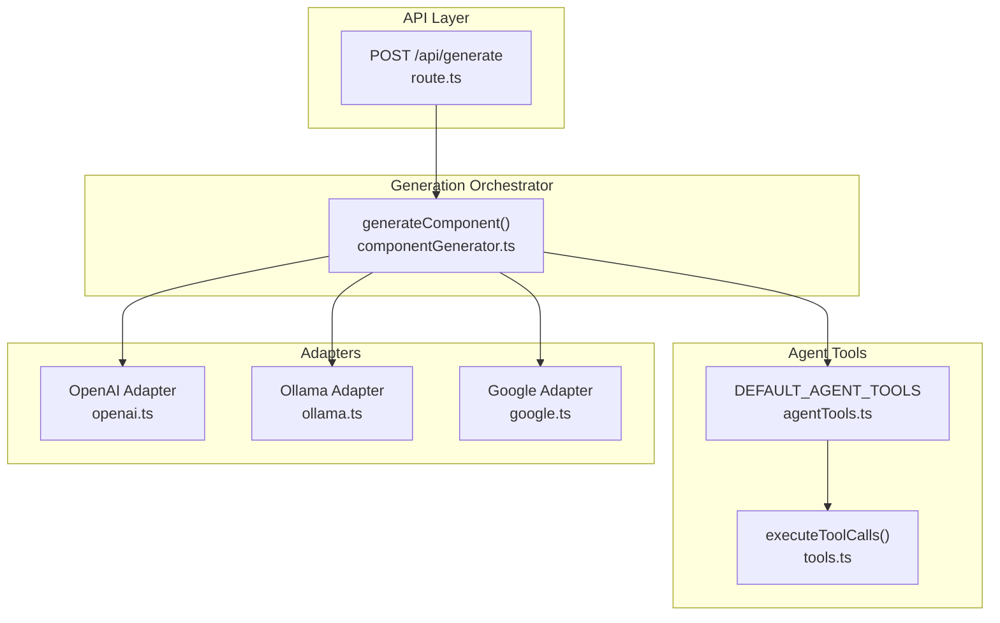
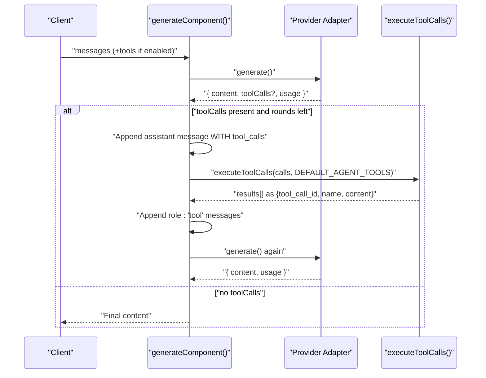
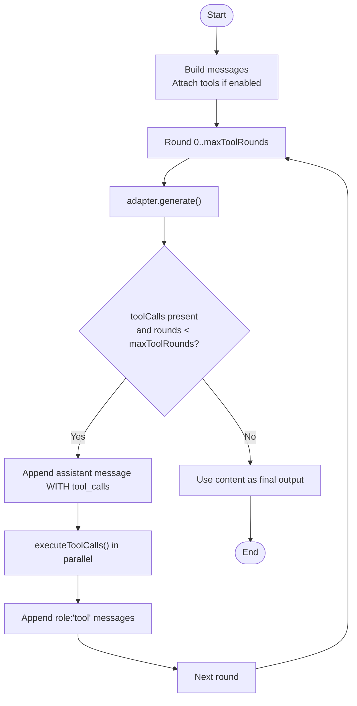
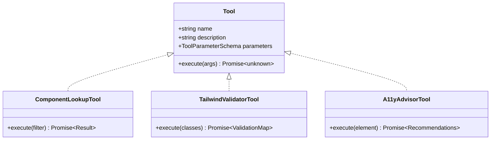
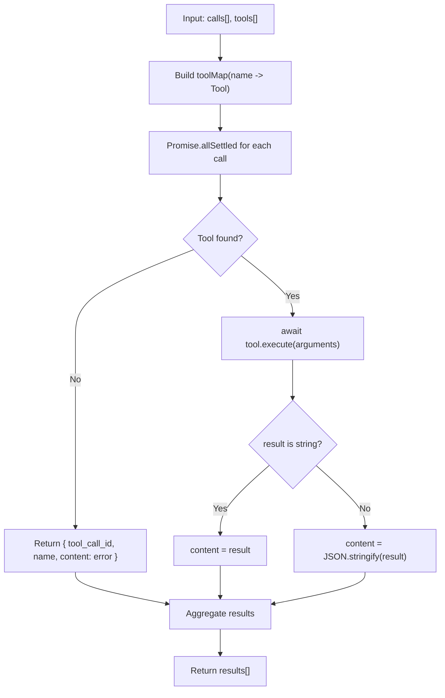
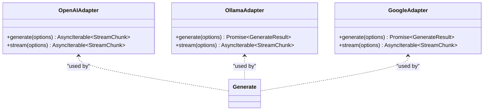
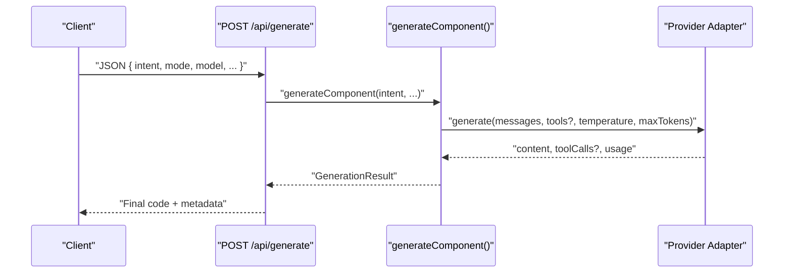
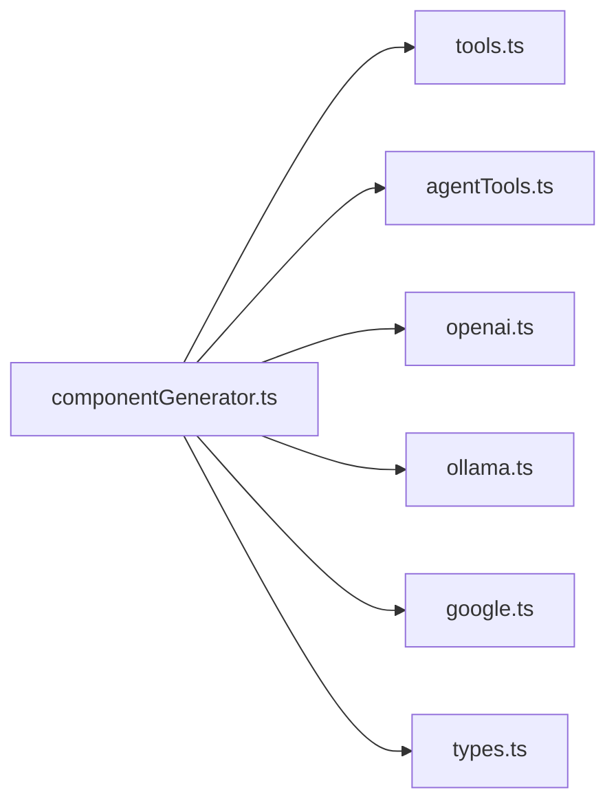

# Tool Execution Loops

<cite>
**Referenced Files in This Document**
- [componentGenerator.ts](file://lib/ai/componentGenerator.ts)
- [agentTools.ts](file://lib/ai/agentTools.ts)
- [tools.ts](file://lib/ai/tools.ts)
- [openai.ts](file://lib/ai/adapters/openai.ts)
- [ollama.ts](file://lib/ai/adapters/ollama.ts)
- [google.ts](file://lib/ai/adapters/google.ts)
- [route.ts](file://app/api/generate/route.ts)
- [types.ts](file://lib/ai/types.ts)
</cite>

## Table of Contents
1. [Introduction](#introduction)
2. [Project Structure](#project-structure)
3. [Core Components](#core-components)
4. [Architecture Overview](#architecture-overview)
5. [Detailed Component Analysis](#detailed-component-analysis)
6. [Dependency Analysis](#dependency-analysis)
7. [Performance Considerations](#performance-considerations)
8. [Troubleshooting Guide](#troubleshooting-guide)
9. [Conclusion](#conclusion)

## Introduction
This document explains the agentic tool execution loops embedded in the generation pipeline. It details the strict OpenAI-compatible message flow for assistant/tool exchanges, the loop management that respects model capabilities and pipeline configuration, and the tool execution system that supports parallel tool requests. It also documents the agent tools available for code generation assistance, including their capabilities and limitations, and provides examples of successful tool-assisted generations along with troubleshooting guidance for tool execution failures.

## Project Structure
The generation pipeline centers around a single orchestrator that builds prompts, selects adapters, and manages the tool-call loop. Tools are defined centrally and executed in parallel against the model’s requests. Providers are abstracted behind adapter interfaces that convert between a unified internal representation and provider-specific formats.

**Diagram sources**
- [route.ts:183-195](file://app/api/generate/route.ts#L183-L195)
- [componentGenerator.ts:237-242](file://lib/ai/componentGenerator.ts#L237-L242)
- [agentTools.ts:167-171](file://lib/ai/agentTools.ts#L167-L171)
- [tools.ts:144-174](file://lib/ai/tools.ts#L144-L174)
- [openai.ts:195-221](file://lib/ai/adapters/openai.ts#L195-L221)
- [ollama.ts:38-86](file://lib/ai/adapters/ollama.ts#L38-L86)
- [google.ts:41-89](file://lib/ai/adapters/google.ts#L41-L89)

**Section sources**
- [route.ts:183-195](file://app/api/generate/route.ts#L183-L195)
- [componentGenerator.ts:237-242](file://lib/ai/componentGenerator.ts#L237-L242)

## Core Components
- Generation orchestrator: Builds prompts, resolves adapters, enforces pipeline configuration, and manages the tool-call loop.
- Agent tools: A registry of tools the model can request during generation (component lookup, Tailwind validation, A11y recommendations).
- Tool execution: Converts model requests into tool invocations and returns results formatted for the next generation turn.
- Adapters: Provider-specific implementations that translate between the unified types and provider-native formats.

Key responsibilities:
- Enforce OpenAI-compatible message protocol strictly (assistant message with tool_calls followed by role:'tool' messages).
- Respect maxToolRounds from pipeline configuration and model capability profiles.
- Inject tools only when a model is explicitly registered to support tool calls.
- Execute tool calls in parallel and append results as role:'tool' messages.

**Section sources**
- [componentGenerator.ts:244-327](file://lib/ai/componentGenerator.ts#L244-L327)
- [agentTools.ts:167-171](file://lib/ai/agentTools.ts#L167-L171)
- [tools.ts:144-174](file://lib/ai/tools.ts#L144-L174)

## Architecture Overview
The tool execution loop follows a strict protocol:
1. Initial request includes messages and tools (when enabled).
2. Model responds with an assistant message containing tool_calls.
3. Client appends the assistant message (with intact tool_calls) and one role:'tool' message per call.
4. Client invokes generate() again; model produces final text.

**Diagram sources**
- [componentGenerator.ts:274-321](file://lib/ai/componentGenerator.ts#L274-L321)
- [tools.ts:144-174](file://lib/ai/tools.ts#L144-L174)

**Section sources**
- [componentGenerator.ts:244-327](file://lib/ai/componentGenerator.ts#L244-L327)

## Detailed Component Analysis

### Tool Call Protocol and Loop Management
- The orchestrator constructs the initial messages (system/user) and conditionally attaches tools based on model capability and pipeline configuration.
- Loop bounds are governed by maxToolRounds from the pipeline configuration; the loop exits early if the model produces final content without tool calls.
- The protocol requires preserving the assistant message with the raw tool_calls array intact before appending role:'tool' results.

**Diagram sources**
- [componentGenerator.ts:270-322](file://lib/ai/componentGenerator.ts#L270-L322)

**Section sources**
- [componentGenerator.ts:244-327](file://lib/ai/componentGenerator.ts#L244-L327)

### Agent Tools Available for Code Generation Assistance
The default tool set includes:
- Component lookup: Enumerates available design-system components, optionally filtered by keyword.
- Tailwind validator: Validates Tailwind utility classes using a lightweight pattern-based approach.
- A11y advisor: Provides WCAG recommendations for common interactive elements.

Capabilities and limitations:
- Component lookup reads a prebuilt ecosystem index and filters by keyword; returns counts and lists.
- Tailwind validator uses prefix patterns and allows common extensions; avoids heavy PostCSS parsing.
- A11y advisor returns structured recommendations per element type; limited to predefined categories.

**Diagram sources**
- [agentTools.ts:26-61](file://lib/ai/agentTools.ts#L26-L61)
- [agentTools.ts:69-102](file://lib/ai/agentTools.ts#L69-L102)
- [agentTools.ts:109-162](file://lib/ai/agentTools.ts#L109-L162)

**Section sources**
- [agentTools.ts:167-171](file://lib/ai/agentTools.ts#L167-L171)

### Tool Execution System (Parallel Execution and Message Formatting)
- executeToolCalls maps tool names to implementations, executes all calls in parallel using Promise.allSettled, and returns a normalized array of results.
- Results are formatted as role:'tool' messages with tool_call_id and serialized content.
- Unknown tools return an error payload; execution errors are captured and returned as error strings.

**Diagram sources**
- [tools.ts:144-174](file://lib/ai/tools.ts#L144-L174)

**Section sources**
- [tools.ts:144-174](file://lib/ai/tools.ts#L144-L174)

### Provider Adapters and Tool Support
- OpenAI adapter: Streams completions, merges system role into the first user message when unsupported, and passes tools when supported.
- Ollama adapter: Supports tools and tool_choice; converts tool calls to OpenAI-compatible shapes.
- Google adapter: Supports tools and tool_choice; omits response_format to avoid 400 errors.

**Diagram sources**
- [openai.ts:195-221](file://lib/ai/adapters/openai.ts#L195-L221)
- [ollama.ts:38-86](file://lib/ai/adapters/ollama.ts#L38-L86)
- [google.ts:41-89](file://lib/ai/adapters/google.ts#L41-L89)

**Section sources**
- [openai.ts:164-221](file://lib/ai/adapters/openai.ts#L164-L221)
- [ollama.ts:38-86](file://lib/ai/adapters/ollama.ts#L38-L86)
- [google.ts:41-89](file://lib/ai/adapters/google.ts#L41-L89)

### API Endpoint Integration
- The /api/generate endpoint validates inputs, resolves adapters, and invokes generateComponent().
- It supports streaming for quick feedback and non-streaming for full pipeline execution including review, repair, A11y, and tests.

**Diagram sources**
- [route.ts:25-440](file://app/api/generate/route.ts#L25-L440)
- [componentGenerator.ts:60-402](file://lib/ai/componentGenerator.ts#L60-L402)

**Section sources**
- [route.ts:25-440](file://app/api/generate/route.ts#L25-L440)

## Dependency Analysis
- The orchestrator depends on:
  - Model registry and pipeline configuration to decide tool availability and loop bounds.
  - Adapter layer to execute generation and handle provider-specific nuances.
  - Tool registry and executor to fulfill model requests.
- Adapters depend on provider SDKs and convert between unified types and provider-native shapes.

**Diagram sources**
- [componentGenerator.ts:16-39](file://lib/ai/componentGenerator.ts#L16-L39)
- [tools.ts:13-59](file://lib/ai/tools.ts#L13-L59)
- [agentTools.ts:17-174](file://lib/ai/agentTools.ts#L17-L174)
- [openai.ts:195-221](file://lib/ai/adapters/openai.ts#L195-L221)
- [ollama.ts:38-86](file://lib/ai/adapters/ollama.ts#L38-L86)
- [google.ts:41-89](file://lib/ai/adapters/google.ts#L41-L89)
- [types.ts:19-44](file://lib/ai/types.ts#L19-L44)

**Section sources**
- [componentGenerator.ts:16-39](file://lib/ai/componentGenerator.ts#L16-L39)

## Performance Considerations
- Parallel tool execution: executeToolCalls uses Promise.allSettled to maximize throughput when multiple tools are requested.
- Streaming adapters: OpenAI adapter streams deltas and usage; this reduces latency and improves responsiveness.
- Budget-aware prompt construction: The orchestrator trims optional context to fit model-specific token budgets, reducing retries and timeouts.
- Loop bounds: maxToolRounds prevents infinite loops and caps provider costs.

[No sources needed since this section provides general guidance]

## Troubleshooting Guide
Common issues and resolutions:
- Empty or invalid tool results:
  - Ensure tools are enabled only for models with explicit tool-call support; unknown models may silently reject tools.
  - Verify tool names match exactly; mismatches return error payloads.
- Protocol violations causing 400 errors:
  - Always append the assistant message WITH the raw tool_calls array intact.
  - Append one role:'tool' message per tool call; using role:'user' instead of role:'tool' triggers errors.
- Excessive tool-call rounds:
  - Confirm maxToolRounds is set appropriately for the model tier; tiny/small tiers typically disable tools.
- Provider-specific quirks:
  - OpenAI: System role merged into first user message when unsupported; tools passed only when supported.
  - Ollama/Google: Tools supported; avoid passing response_format to Google to prevent 400 errors.

Operational checks:
- Inspect the final messages array before invoking the next generate() call to confirm assistant message and tool results are present.
- Log tool execution outcomes and provider responses for diagnosis.

**Section sources**
- [componentGenerator.ts:244-327](file://lib/ai/componentGenerator.ts#L244-L327)
- [tools.ts:144-174](file://lib/ai/tools.ts#L144-L174)
- [openai.ts:164-221](file://lib/ai/adapters/openai.ts#L164-L221)
- [ollama.ts:38-86](file://lib/ai/adapters/ollama.ts#L38-L86)
- [google.ts:41-89](file://lib/ai/adapters/google.ts#L41-L89)

## Conclusion
The generation pipeline enforces a strict OpenAI-compatible tool-call protocol, manages loop rounds according to model capabilities and pipeline configuration, and executes tools in parallel for responsiveness. The agent tools provide practical assistance for component discovery, style validation, and accessibility guidance. By adhering to the protocol, respecting loop bounds, and validating tool execution, the system reliably produces high-quality, accessible UI code.