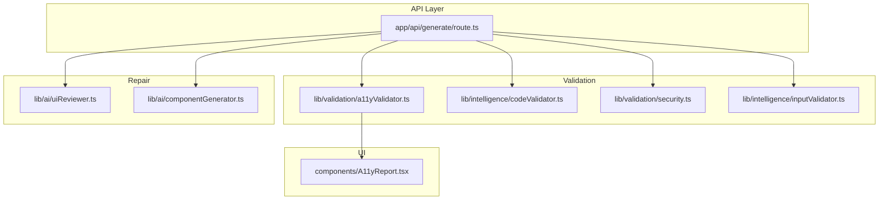
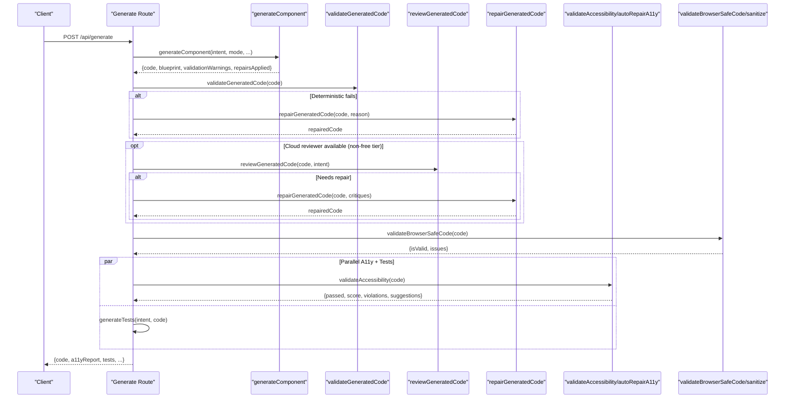
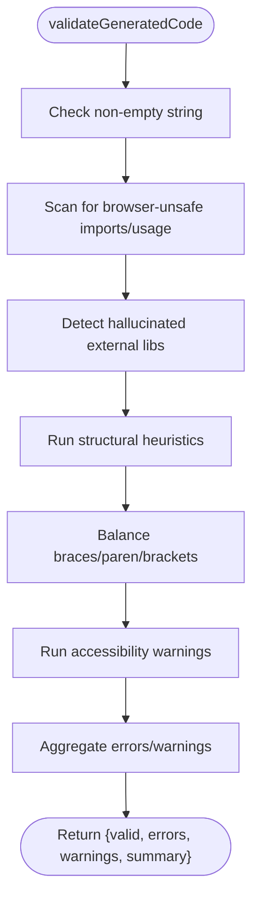
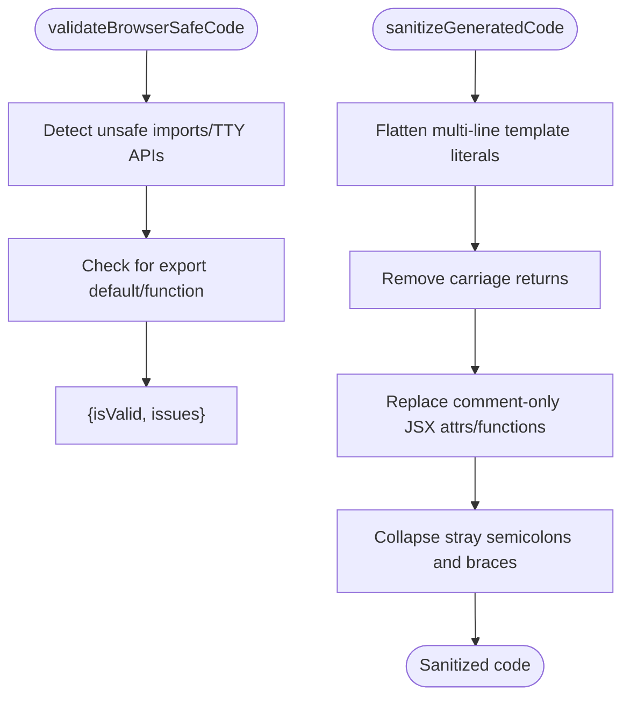
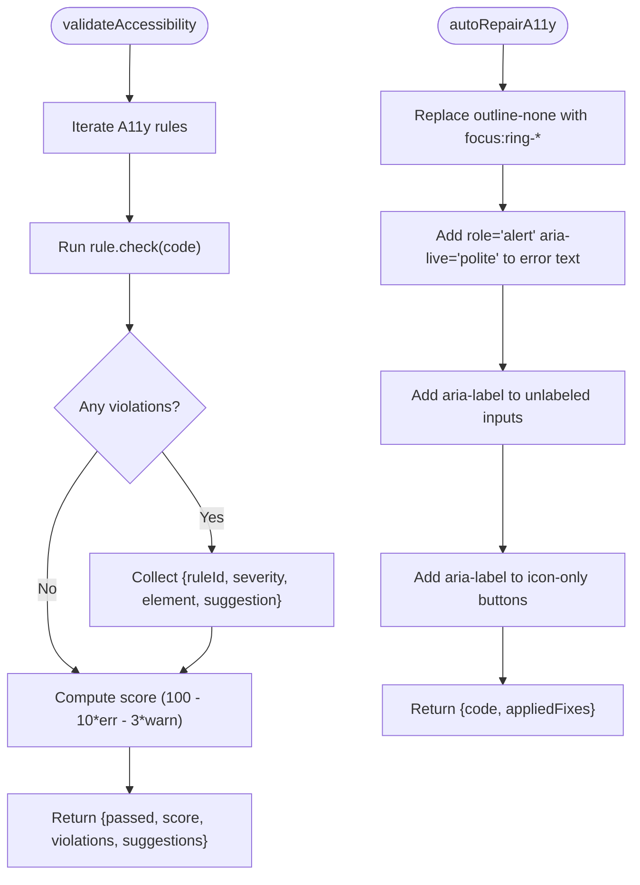
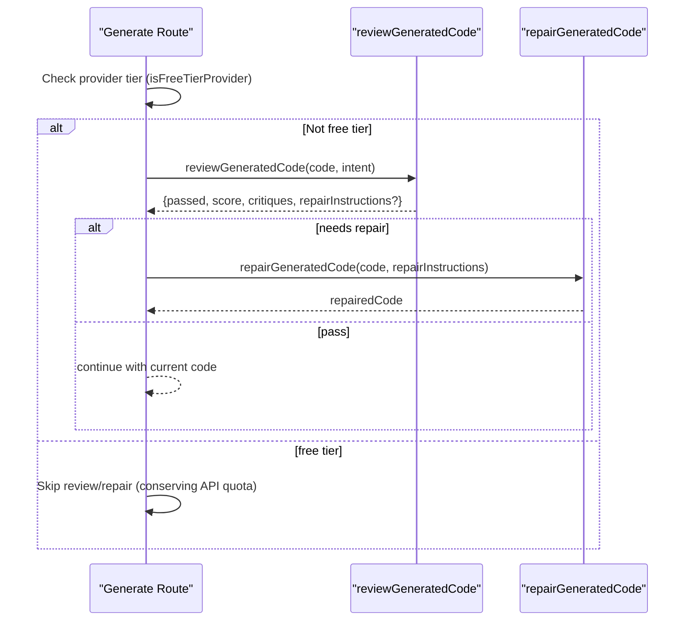
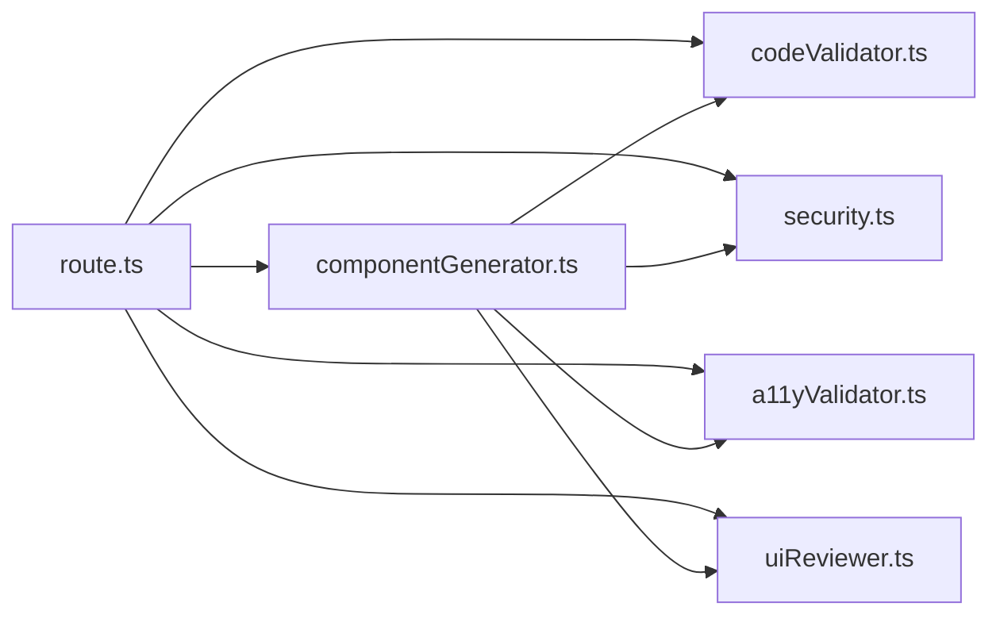

# Validation & Repair System

<cite>
**Referenced Files in This Document**
- [route.ts](file://app/api/generate/route.ts)
- [a11yValidator.ts](file://lib/validation/a11yValidator.ts)
- [schemas.ts](file://lib/validation/schemas.ts)
- [security.ts](file://lib/validation/security.ts)
- [codeValidator.ts](file://lib/intelligence/codeValidator.ts)
- [uiReviewer.ts](file://lib/ai/uiReviewer.ts)
- [inputValidator.ts](file://lib/intelligence/inputValidator.ts)
- [componentGenerator.ts](file://lib/ai/componentGenerator.ts)
- [A11yReport.tsx](file://components/A11yReport.tsx)
- [a11yValidator.test.ts](file://__tests__/a11yValidator.test.ts)
- [security.test.ts](file://__tests__/security.test.ts)
</cite>

## Update Summary
**Changes Made**
- Removed visionReviewer component documentation (file no longer exists)
- Updated UI Expert Review section to reflect simplified conditional logic for free-tier providers
- Revised architecture overview to remove browserless rendering and visual critique
- Updated troubleshooting guide to reflect new provider tier detection system
- Enhanced performance considerations to account for provider tier awareness

## Table of Contents
1. [Introduction](#introduction)
2. [Project Structure](#project-structure)
3. [Core Components](#core-components)
4. [Architecture Overview](#architecture-overview)
5. [Detailed Component Analysis](#detailed-component-analysis)
6. [Dependency Analysis](#dependency-analysis)
7. [Performance Considerations](#performance-considerations)
8. [Troubleshooting Guide](#troubleshooting-guide)
9. [Conclusion](#conclusion)

## Introduction
This document describes the validation and auto-repair system embedded in the generation pipeline. It covers:
- Comprehensive code validation for syntax errors, semantic correctness, and React component compliance
- An adaptive repair pipeline that applies rule-based fixes first, optionally followed by AI-assisted repairs
- WCAG 2.1 AA–aligned accessibility validation and automated repair
- Strategy selection based on model tier and resource availability
- Quality assessment criteria and scoring
- Examples of successful validation and repair outcomes, plus troubleshooting guidance

## Project Structure
The validation and repair system spans several modules:
- Route orchestration: [route.ts](file://app/api/generate/route.ts)
- Validation utilities: [a11yValidator.ts](file://lib/validation/a11yValidator.ts), [codeValidator.ts](file://lib/intelligence/codeValidator.ts), [security.ts](file://lib/validation/security.ts), [inputValidator.ts](file://lib/intelligence/inputValidator.ts)
- Repair orchestration: [uiReviewer.ts](file://lib/ai/uiReviewer.ts), [componentGenerator.ts](file://lib/ai/componentGenerator.ts)
- UI reporting: [A11yReport.tsx](file://components/A11yReport.tsx)
- Tests: [a11yValidator.test.ts](file://__tests__/a11yValidator.test.ts), [security.test.ts](file://__tests__/security.test.ts)

**Diagram sources**
- [route.ts:25-387](file://app/api/generate/route.ts#L25-L387)
- [a11yValidator.ts:1-376](file://lib/validation/a11yValidator.ts#L1-L376)
- [codeValidator.ts:1-388](file://lib/intelligence/codeValidator.ts#L1-L388)
- [security.ts:1-129](file://lib/validation/security.ts#L1-L129)
- [inputValidator.ts:1-137](file://lib/intelligence/inputValidator.ts#L1-L137)
- [uiReviewer.ts:1-199](file://lib/ai/uiReviewer.ts#L1-L199)
- [componentGenerator.ts:1-419](file://lib/ai/componentGenerator.ts#L1-L419)
- [A11yReport.tsx:1-193](file://components/A11yReport.tsx#L1-L193)

**Section sources**
- [route.ts:25-387](file://app/api/generate/route.ts#L25-L387)

## Core Components
- Input validation: [validatePromptInput:53-117](file://lib/intelligence/inputValidator.ts#L53-L117), [validateGenerationMode:119-125](file://lib/intelligence/inputValidator.ts#L119-L125)
- Deterministic syntax and structural validation: [validateGeneratedCode:264-364](file://lib/intelligence/codeValidator.ts#L264-L364)
- Browser safety validation: [validateBrowserSafeCode:6-34](file://lib/validation/security.ts#L6-L34), [sanitizeGeneratedCode:44-128](file://lib/validation/security.ts#L44-L128)
- Accessibility validation and auto-repair: [validateAccessibility:264-297](file://lib/validation/a11yValidator.ts#L264-L297), [autoRepairA11y:303-375](file://lib/validation/a11yValidator.ts#L303-L375)
- UI expert review and repair: [reviewGeneratedCode:58-126](file://lib/ai/uiReviewer.ts#L58-L126), [repairGeneratedCode:137-199](file://lib/ai/uiReviewer.ts#L137-L199)
- Generation-time repair integration: [generateComponent:60-419](file://lib/ai/componentGenerator.ts#L60-L419)

**Section sources**
- [inputValidator.ts:53-125](file://lib/intelligence/inputValidator.ts#L53-L125)
- [codeValidator.ts:264-364](file://lib/intelligence/codeValidator.ts#L264-L364)
- [security.ts:6-128](file://lib/validation/security.ts#L6-L128)
- [a11yValidator.ts:264-375](file://lib/validation/a11yValidator.ts#L264-L375)
- [uiReviewer.ts:58-199](file://lib/ai/uiReviewer.ts#L58-L199)
- [componentGenerator.ts:60-419](file://lib/ai/componentGenerator.ts#L60-L419)

## Architecture Overview
The generation pipeline performs validation and repair in stages:
1. Input sanitization and intent parsing
2. Deterministic syntax and structural validation
3. Optional UI expert review and repair (conditional based on provider tier)
4. Browser safety validation and sanitization
5. Parallel accessibility validation and test generation
6. Dependency resolution and persistence

**Updated** The system now uses conditional logic to skip review/repair phases for free-tier providers rather than relying on browserless rendering. This simplifies the architecture while maintaining quality through deterministic fallbacks.

**Diagram sources**
- [route.ts:25-387](file://app/api/generate/route.ts#L25-L387)
- [componentGenerator.ts:60-419](file://lib/ai/componentGenerator.ts#L60-L419)
- [codeValidator.ts:264-364](file://lib/intelligence/codeValidator.ts#L264-L364)
- [uiReviewer.ts:58-199](file://lib/ai/uiReviewer.ts#L58-L199)
- [a11yValidator.ts:264-375](file://lib/validation/a11yValidator.ts#L264-L375)
- [security.ts:6-128](file://lib/validation/security.ts#L6-L128)

## Detailed Component Analysis

### Deterministic Syntax and Structural Validation
Purpose:
- Catch truncation, missing exports, JSX imbalance, and unsafe patterns before preview.
- Provide warnings for accessibility-first guidance.

Key behaviors:
- Unbalanced brackets/braces detection for truncation hints
- Structural heuristics for exports, JSX presence, and excessive dynamic imports
- Accessibility warnings for common issues (e.g., missing alt, icon-only buttons)

Scoring and thresholds:
- Errors block preview; warnings inform improvements.

**Diagram sources**
- [codeValidator.ts:264-364](file://lib/intelligence/codeValidator.ts#L264-L364)

**Section sources**
- [codeValidator.ts:264-364](file://lib/intelligence/codeValidator.ts#L264-L364)

### Browser Safety and Sanitization
Purpose:
- Ensure generated code is safe for the browser sandbox (no Node/tty APIs).
- Fix common AI artifacts that break the parser.

Key behaviors:
- Detect Node/tty imports and disallowed methods
- Validate default export presence
- Sanitize multi-line template literals and comment artifacts

**Diagram sources**
- [security.ts:6-128](file://lib/validation/security.ts#L6-L128)

**Section sources**
- [security.ts:6-128](file://lib/validation/security.ts#L6-L128)

### Accessibility Validation and Auto-Repair (WCAG 2.1 AA)
Purpose:
- Static analysis against WCAG 2.1 AA rules with scoring and suggestions.
- Automated repair for common issues.

Rule coverage:
- Form inputs require labels
- Buttons require accessible names
- Images require alt text
- Forms should have labels or legends
- Headings must follow logical hierarchy
- Interactive elements must be keyboard accessible
- Error messages should be announced to assistive tech
- Color contrast expectations for light/dark contexts
- Focus visibility for keyboard navigation

Scoring:
- Starts at 100; subtracts 10 per hard error, 3 per warning
- Passed when no hard errors

Auto-repair strategies:
- Adds focus ring replacements for outline-none without focus ring
- Adds role="alert" and aria-live="polite" to error containers
- Adds aria-label to unlabeled inputs derived from placeholder/name/id
- Adds aria-label to icon-only buttons

**Diagram sources**
- [a11yValidator.ts:264-375](file://lib/validation/a11yValidator.ts#L264-L375)

**Section sources**
- [a11yValidator.ts:264-375](file://lib/validation/a11yValidator.ts#L264-L375)
- [A11yReport.tsx:97-193](file://components/A11yReport.tsx#L97-L193)
- [a11yValidator.test.ts:1-110](file://__tests__/a11yValidator.test.ts#L1-L110)

### UI Expert Review and Repair
Purpose:
- Second-pass review for visual quality, layout, and production-readiness.
- Optional AI-assisted repair when reviewer detects issues.

**Updated** The system now uses conditional logic to skip review/repair phases for free-tier providers to conserve API quotas and avoid rate limiting.

Workflow:
- Reviewer evaluates code against a strict schema and returns a pass/fail score with critiques and optional repair instructions.
- If failing, repair agent applies exact repair instructions to produce a fixed component.
- Free-tier providers (Google without paid key) skip review entirely unless a dedicated REVIEW_MODEL is configured.

**Diagram sources**
- [route.ts:210-259](file://app/api/generate/route.ts#L210-L259)
- [uiReviewer.ts:58-199](file://lib/ai/uiReviewer.ts#L58-L199)

**Section sources**
- [uiReviewer.ts:58-199](file://lib/ai/uiReviewer.ts#L58-L199)
- [route.ts:210-259](file://app/api/generate/route.ts#L210-L259)

### Generation-Time Repair Integration
Purpose:
- Apply deterministic repairs during generation when model tier permits.
- Fall back to rule-based repair when AI repair is not available.

Key logic:
- Determines whether AI repair is allowed based on model tier and pipeline config
- Invokes repair pipeline and aggregates applied repairs

**Diagram sources**
- [componentGenerator.ts:370-398](file://lib/ai/componentGenerator.ts#L370-L398)

**Section sources**
- [componentGenerator.ts:370-398](file://lib/ai/componentGenerator.ts#L370-L398)

## Dependency Analysis
- The generation route orchestrates all validations and repairs, conditionally invoking the reviewer based on provider tier detection.
- Deterministic validation is performed before expensive reviewer calls to reduce cost and latency.
- Accessibility validation runs in parallel with test generation to optimize throughput.
- Security sanitization occurs after reviewer repairs to preserve fixes while ensuring browser compatibility.

**Updated** The simplified architecture removes the visionReviewer dependency, making the system more efficient and provider-tier aware.

**Diagram sources**
- [route.ts:25-387](file://app/api/generate/route.ts#L25-L387)
- [codeValidator.ts:264-364](file://lib/intelligence/codeValidator.ts#L264-L364)
- [security.ts:6-128](file://lib/validation/security.ts#L6-L128)
- [a11yValidator.ts:264-375](file://lib/validation/a11yValidator.ts#L264-L375)
- [uiReviewer.ts:58-199](file://lib/ai/uiReviewer.ts#L58-L199)
- [componentGenerator.ts:60-419](file://lib/ai/componentGenerator.ts#L60-L419)

**Section sources**
- [route.ts:25-387](file://app/api/generate/route.ts#L25-L387)

## Performance Considerations
- Early deterministic validation reduces unnecessary reviewer calls and speeds up the pipeline.
- Parallel execution of accessibility validation and test generation minimizes total latency.
- **Updated** Provider tier awareness skips expensive review/repair phases for free-tier providers, significantly reducing API costs and avoiding rate limiting.
- Security sanitization avoids costly retries by fixing parser-breaking artifacts upfront.
- Model tier awareness selects appropriate repair strategies to balance quality and cost.

**Updated** The new provider tier detection system conserves API quotas by intelligently skipping review/repair for free-tier providers, making the system more cost-effective while maintaining quality standards.

## Troubleshooting Guide
Common validation failures and resolutions:
- Deterministic validation errors
  - Cause: Truncated or malformed code (unbalanced braces/brackets), missing export, or insufficient JSX.
  - Resolution: The pipeline attempts AI repair with specific reasons. If not available, ensure the model tier supports AI repair or rely on deterministic fixes.
  - Reference: [route.ts:196-207](file://app/api/generate/route.ts#L196-L207), [codeValidator.ts:264-364](file://lib/intelligence/codeValidator.ts#L264-L364)

- Browser safety violations
  - Cause: Node/tty imports, process.exit, or missing export.
  - Resolution: Remove unsafe imports and ensure a default export; the sanitizer also cleans common artifacts.
  - Reference: [security.ts:6-34](file://lib/validation/security.ts#L6-L34), [security.ts:44-128](file://lib/validation/security.ts#L44-L128)

- Accessibility violations
  - Cause: Missing alt attributes, unlabeled inputs/buttons, heading hierarchy issues, low contrast, or missing focus indicators.
  - Resolution: Auto-repair applies targeted fixes; review suggestions in the accessibility report.
  - Reference: [a11yValidator.ts:264-375](file://lib/validation/a11yValidator.ts#L264-L375), [A11yReport.tsx:97-193](file://components/A11yReport.tsx#L97-L193)

- Reviewer/repair unavailability
  - Cause: Provider quota limits or missing API keys.
  - Resolution: The system defaults to pass and continues with original code; add keys or switch providers.
  - **Updated** Free-tier providers automatically skip review/repair to conserve API quotas.
  - Reference: [uiReviewer.ts:115-125](file://lib/ai/uiReviewer.ts#L115-L125), [route.ts:210-259](file://app/api/generate/route.ts#L210-L259)

- Provider tier detection issues
  - Cause: Incorrect provider configuration or missing REVIEW_MODEL environment variable.
  - Resolution: Configure appropriate provider settings or set REVIEW_MODEL for dedicated review capabilities.
  - Reference: [route.ts:220-222](file://app/api/generate/route.ts#L220-L222)

## Conclusion
The validation and auto-repair system integrates deterministic checks, accessibility scanning, browser safety sanitization, and optional expert review. **Updated** The simplified architecture uses conditional logic to skip review/repair phases for free-tier providers, making the system more cost-effective while maintaining high-quality, accessible, and production-ready React components. The system adapts repair strategies to model capabilities and environment constraints, ensuring efficient delivery of quality UI components.