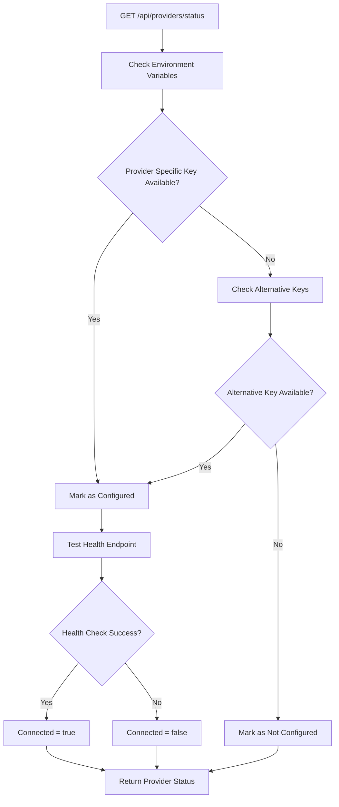
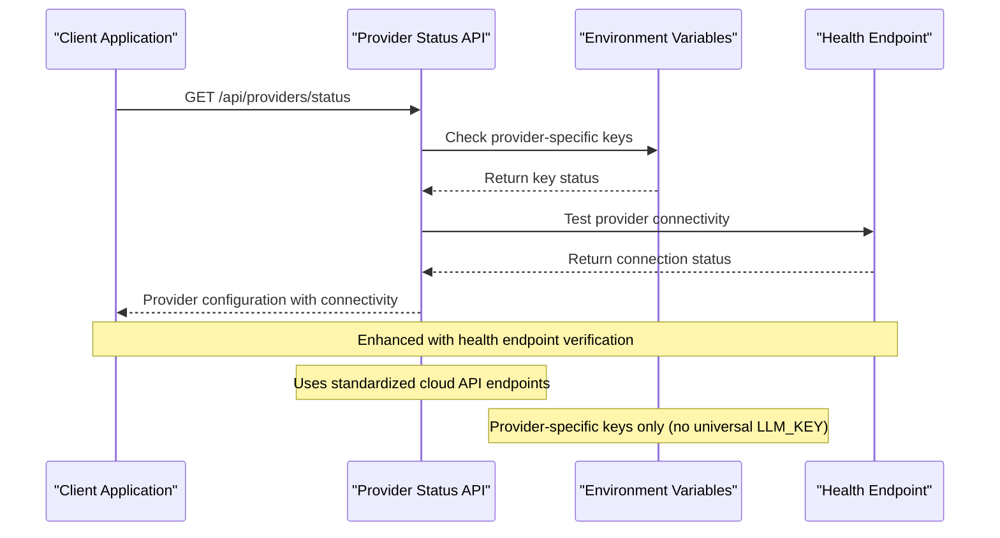

# Model Configuration & Selection

<cite>
**Referenced Files in This Document**
- [providers/status/route.ts](file://app/api/providers/status/route.ts)
- [adapters/index.ts](file://lib/ai/adapters/index.ts)
- [modelRegistry.ts](file://lib/ai/modelRegistry.ts)
- [types.ts](file://lib/ai/types.ts)
- [openai.ts](file://lib/ai/adapters/openai.ts)
- [google.ts](file://lib/ai/adapters/google.ts)
- [ModelSelectionGate.tsx](file://components/ModelSelectionGate.tsx)
- [modelRegistry.ts](file://lib/ai/modelRegistry.ts)
- [types.ts](file://lib/ai/types.ts)
</cite>

## Update Summary
**Changes Made**
- Updated provider status checking system to use standardized cloud API endpoints
- Simplified configuration process by removing universal LLM_KEY support
- Updated environment variable requirements to OLLAMA_API_KEY for cloud authentication
- Enhanced provider configuration with health endpoint verification
- Streamlined provider discovery with connectivity checks

## Table of Contents
1. [Introduction](#introduction)
2. [Provider Status Checking System](#provider-status-checking-system)
3. [Enhanced Provider Configuration](#enhanced-provider-configuration)
4. [Simplified Environment Variable Setup](#simplified-environment-variable-setup)
5. [Cloud Authentication Flow](#cloud-authentication-flow)
6. [Provider Connectivity Verification](#provider-connectivity-verification)
7. [Updated Model Registry](#updated-model-registry)
8. [Configuration Examples](#configuration-examples)
9. [Troubleshooting Guide](#troubleshooting-guide)
10. [Migration from Universal Keys](#migration-from-universal-keys)

## Introduction
This document describes the enhanced model configuration and selection system that provides streamlined provider setup with cloud-first authentication. The system now focuses exclusively on cloud-based providers with standardized API endpoints and simplified configuration processes.

Key enhancements include:
- **Standardized Cloud API Endpoints**: All providers now use consistent cloud-based authentication
- **Simplified Configuration**: Elimination of universal LLM_KEY support in favor of provider-specific keys
- **Enhanced Connectivity Verification**: Real-time health endpoint checks for provider availability
- **Cloud-First Approach**: Ollama self-hosted configuration support has been removed
- **Streamlined Authentication**: Direct cloud API key requirements with OLLAMA_API_KEY for cloud authentication

## Provider Status Checking System
The provider status checking system now uses standardized cloud API endpoints with enhanced connectivity verification:



**Diagram sources**
- [providers/status/route.ts:158-225](file://app/api/providers/status/route.ts#L158-L225)

**Section sources**
- [providers/status/route.ts:13-121](file://app/api/providers/status/route.ts#L13-L121)
- [providers/status/route.ts:158-225](file://app/api/providers/status/route.ts#L158-L225)

## Enhanced Provider Configuration
The system now supports four cloud-based providers with standardized configuration:

### Provider Configuration Structure
Each provider includes:
- **ID**: Unique identifier for internal use
- **Name**: Display name for UI
- **Description**: Model variants supported
- **Color Scheme**: Brand colors for UI theming
- **Environment Variables**: Provider-specific API keys
- **Health Endpoints**: Standardized cloud API endpoints
- **Optimized Settings**: Temperature and token configurations

### Supported Providers
1. **OpenAI**: GPT-4o, GPT-4o-mini, o3-mini with `OPENAI_API_KEY`
2. **Google Gemini**: Gemini 2.0 Flash, Gemini 1.5 Pro with `GOOGLE_API_KEY` or `GEMINI_API_KEY`
3. **Groq**: Llama 3.3, Mixtral with `GROQ_API_KEY`
4. **Ollama**: Cloud models via `OLLAMA_API_KEY` (now cloud-only)

**Section sources**
- [providers/status/route.ts:55-106](file://app/api/providers/status/route.ts#L55-L106)

## Simplified Environment Variable Setup
The configuration system now requires provider-specific environment variables:

### Required Environment Variables
- **OPENAI_API_KEY**: OpenAI GPT models
- **GOOGLE_API_KEY**: Google Gemini models  
- **GEMINI_API_KEY**: Alternative Google key
- **GROQ_API_KEY**: Groq inference models
- **OLLAMA_API_KEY**: Ollama cloud models (cloud-only)

### Configuration Process
1. Set the appropriate environment variable in your deployment platform
2. The system automatically detects and validates the configuration
3. Health endpoint testing ensures connectivity
4. Provider appears in the selection interface when configured

**Section sources**
- [providers/status/route.ts:164-172](file://app/api/providers/status/route.ts#L164-L172)
- [adapters/index.ts:249-254](file://lib/ai/adapters/index.ts#L249-L254)

## Cloud Authentication Flow
The enhanced authentication system provides seamless cloud-based provider setup:



**Diagram sources**
- [providers/status/route.ts:130-154](file://app/api/providers/status/route.ts#L130-L154)
- [providers/status/route.ts:174-180](file://app/api/providers/status/route.ts#L174-L180)

**Section sources**
- [providers/status/route.ts:125-180](file://app/api/providers/status/route.ts#L125-L180)

## Provider Connectivity Verification
Enhanced connectivity verification ensures reliable provider setup:

### Health Endpoint Testing
Each provider includes a dedicated health endpoint:
- **OpenAI**: `https://api.openai.com/v1/models`
- **Google**: `https://generativelanguage.googleapis.com/v1beta/openai/models`
- **Groq**: `https://api.groq.com/openai/v1/models`
- **Ollama**: `https://ollama.com/v1/models`

### Connection Logic
1. **Configured Providers**: Tested for connectivity
2. **Unconfigured Providers**: Marked as not available
3. **Connection Results**: Cached for performance
4. **Timeout Handling**: 5-second timeout per provider test

**Section sources**
- [providers/status/route.ts:130-154](file://app/api/providers/status/route.ts#L130-L154)
- [providers/status/route.ts:174-180](file://app/api/providers/status/route.ts#L174-L180)

## Updated Model Registry
The model registry now reflects the cloud-first approach with enhanced provider support:

### Cloud Provider Models
- **OpenAI**: GPT-4o, GPT-4o-mini, o1, o3-mini
- **Google**: Gemini 2.0 Flash, Gemini 1.5 Pro, Gemini 1.5 Flash
- **Groq**: Llama 3.3 70B, Mixtral 8x7B, Gemma 2 9B
- **Ollama**: Qwen3 Coder Next, Gemma 4 2B, Devstral Small 2, DeepSeek V3.2, Qwen 3.5 9B

### Enhanced Model Profiles
Each model includes:
- **Provider Association**: Cloud provider identification
- **Context Windows**: Input token limits
- **Output Limits**: Maximum generation tokens
- **Optimal Temperatures**: Model-specific temperature settings
- **Tool Support**: Function calling capabilities
- **Streaming Reliability**: SSE streaming support

**Section sources**
- [modelRegistry.ts:116-517](file://lib/ai/modelRegistry.ts#L116-L517)

## Configuration Examples

### Setting Up OpenAI Provider
```bash
# Set environment variable
export OPENAI_API_KEY=your_openai_api_key_here

# Provider configuration
{
  "id": "openai",
  "name": "OpenAI",
  "envVar": "OPENAI_API_KEY",
  "healthEndpoint": "https://api.openai.com/v1/models"
}
```

### Setting Up Google Provider
```bash
# Set environment variable (primary)
export GOOGLE_API_KEY=your_google_api_key_here

# Or use alternative
export GEMINI_API_KEY=your_google_api_key_here

# Provider configuration
{
  "id": "google", 
  "name": "Google Gemini",
  "envVar": "GOOGLE_API_KEY",
  "envVarAlt": "GEMINI_API_KEY",
  "healthEndpoint": "https://generativelanguage.googleapis.com/v1beta/openai/models"
}
```

### Setting Up Groq Provider
```bash
# Set environment variable
export GROQ_API_KEY=your_groq_api_key_here

# Provider configuration
{
  "id": "groq",
  "name": "Groq",
  "envVar": "GROQ_API_KEY", 
  "healthEndpoint": "https://api.groq.com/openai/v1/models"
}
```

### Setting Up Ollama Provider (Cloud Only)
```bash
# Set environment variable
export OLLAMA_API_KEY=your_ollama_cloud_api_key_here

# Provider configuration (cloud-only)
{
  "id": "ollama",
  "name": "Ollama",
  "envVar": "OLLAMA_API_KEY",
  "healthEndpoint": "https://ollama.com/v1/models"
}
```

**Section sources**
- [providers/status/route.ts:55-106](file://app/api/providers/status/route.ts#L55-L106)

## Troubleshooting Guide

### Common Configuration Issues

#### Provider Not Appearing
**Symptoms**: Provider doesn't show in selection interface
**Causes**: 
- Missing environment variable
- Incorrect API key format
- Health endpoint connectivity issues

**Solutions**:
1. Verify environment variable is set correctly
2. Check API key validity in provider dashboard
3. Test health endpoint connectivity
4. Ensure proper Vercel environment variable configuration

#### Authentication Failures
**Symptoms**: "No API key configured" errors
**Causes**:
- Missing provider-specific key
- Expired or invalid API key
- Incorrect environment variable name

**Solutions**:
1. Set correct environment variable (`OPENAI_API_KEY`, `GOOGLE_API_KEY`, etc.)
2. Generate new API key from provider dashboard
3. Verify key hasn't expired or been revoked
4. Check Vercel project environment variables

#### Connectivity Issues
**Symptoms**: Provider shows as "Not connected"
**Causes**:
- Network restrictions blocking health endpoint
- Provider service outages
- Firewall blocking external connections

**Solutions**:
1. Test health endpoint manually
2. Check network connectivity from deployment region
3. Verify provider service status
4. Review firewall and security group settings

### Migration from Universal Keys
**Note**: Universal LLM_KEY support has been removed. All providers now require specific API keys.

**Migration Steps**:
1. Remove any existing LLM_KEY configuration
2. Obtain provider-specific API keys from respective dashboards
3. Set appropriate environment variables
4. Verify provider appears in selection interface
5. Test connectivity with health endpoint

**Section sources**
- [ModelSelectionGate.tsx:205-211](file://components/ModelSelectionGate.tsx#L205-L211)
- [adapters/index.ts:262-269](file://lib/ai/adapters/index.ts#L262-L269)

## Migration from Universal Keys

### Before (Legacy System)
```javascript
// Legacy universal key approach
const legacyConfig = {
  LLM_KEY: "universal_api_key", // Removed
  provider: "openai",
  model: "gpt-4o"
}
```

### After (Current System)
```javascript
// Current provider-specific key approach
const currentConfig = {
  OPENAI_API_KEY: "openai_specific_key", // Required
  provider: "openai", 
  model: "gpt-4o"
}

const providerSpecificKeys = {
  OPENAI_API_KEY: "required_for_openai",
  GOOGLE_API_KEY: "required_for_google",
  GROQ_API_KEY: "required_for_groq", 
  OLLAMA_API_KEY: "required_for_ollama_cloud"
}
```

### Migration Checklist
1. **Remove Universal Keys**: Delete any LLM_KEY references
2. **Obtain Provider Keys**: Generate API keys from each provider
3. **Update Environment Variables**: Set provider-specific keys
4. **Verify Configuration**: Test provider connectivity
5. **Update Documentation**: Remove universal key references

**Section sources**
- [ModelSelectionGate.tsx:205-211](file://components/ModelSelectionGate.tsx#L205-L211)
- [providers/status/route.ts:164-172](file://app/api/providers/status/route.ts#L164-L172)