# Model Configuration & Selection

<cite>
**Referenced Files in This Document**
- [modelRegistry.ts](file://lib/ai/modelRegistry.ts)
- [types.ts](file://lib/ai/types.ts)
- [adapters/index.ts](file://lib/ai/adapters/index.ts)
- [adapters/base.ts](file://lib/ai/adapters/base.ts)
- [adapters/openai.ts](file://lib/ai/adapters/openai.ts)
- [adapters/anthropic.ts](file://lib/ai/adapters/anthropic.ts)
- [adapters/ollama.ts](file://lib/ai/adapters/ollama.ts)
- [adapters/unconfigured.ts](file://lib/ai/adapters/unconfigured.ts)
- [cache.ts](file://lib/ai/cache.ts)
- [workspaceKeyService.ts](file://lib/security/workspaceKeyService.ts)
- [engine-config/route.ts](file://app/api/engine-config/route.ts)
- [models/route.ts](file://app/api/models/route.ts)
- [providers/status/route.ts](file://app/api/providers/status/route.ts)
- [AIEngineConfigPanel.tsx](file://components/AIEngineConfigPanel.tsx)
- [WorkspaceSettingsPanel.tsx](file://components/WorkspaceSettingsPanel.tsx)
- [ModelSelectionGate.tsx](file://components/ModelSelectionGate.tsx)
- [ProviderSelector.tsx](file://components/ProviderSelector.tsx)
- [page.tsx](file://app/page.tsx)
- [globals.css](file://app/globals.css)
- [resolveDefaultAdapter.ts](file://lib/ai/resolveDefaultAdapter.ts)
</cite>

## Update Summary
**Changes Made**
- ModelSelectionGate simplified from three-step wizard to streamlined two-step process
- Removed detailed provider comparison features and complex error handling with environment variable instructions
- Eliminated skip functionality - ModelSelectionGate now acts as mandatory first-time setup
- Enhanced visual design system with violet theme, gradient backgrounds, and improved provider selection interface
- Updated to reflect new streamlined configuration approach where AI engine configuration is handled during startup via ModelSelectionGate
- Removed Ollama provider from provider configuration - local model support has been eliminated
- Updated environment variable configuration to remove OLLAMA_API_KEY references

## Table of Contents
1. [Introduction](#introduction)
2. [Project Structure](#project-structure)
3. [Core Components](#core-components)
4. [Architecture Overview](#architecture-overview)
5. [Detailed Component Analysis](#detailed-component-analysis)
6. [Visual Design System](#visual-design-system)
7. [Dependency Analysis](#dependency-analysis)
8. [Performance Considerations](#performance-considerations)
9. [Troubleshooting Guide](#troubleshooting-guide)
10. [Conclusion](#conclusion)
11. [Appendices](#appendices)

## Introduction
This document describes the model configuration and selection system that powers AI-driven UI generation. It covers:
- Model registry architecture with capability profiles, tier classifications, and capability flags
- Tiered pipeline configuration that selects generation parameters based on model capabilities
- Model resolution algorithm that chooses appropriate models based on intent complexity, workspace settings, and available resources
- Streamlined two-step model selection flow with automatic provider discovery and credential resolution
- Enhanced visual redesign with violet-themed color scheme, gradient backgrounds, and brand color integration
- Improved hover effects with violet glow transitions and enhanced typography with hover state animations
- Universal LLM_KEY support for simplified credential management across all providers
- Dedicated Groq provider configuration with optimized temperature and maxTokens settings
- Updated: Eliminated Ollama as a selectable provider option - local model support has been completely removed
- Prompt style selection (structured, guided-freeform, freeform), token budget calculations, and fallback mechanisms
- Examples for configuring custom models, optimizing for cost/performance, and handling model availability issues

## Project Structure
The model configuration system spans several layers with enhanced streamlined selection flow and comprehensive visual design:
- ModelSelectionGate for mandatory initial setup with automatic provider discovery, credential resolution, and major visual redesign
- ProviderSelector for intuitive provider and model selection with enhanced visual feedback
- UI panels for configuration and model discovery
- Backend APIs for engine configuration, provider status, and model listing
- Adapter layer for provider-neutral model invocation
- Registry and pricing for capability metadata and cost estimation
- Caching and credential management for reliability and performance
- Comprehensive styling system with violet theme, gradient backgrounds, and frosted glass effects

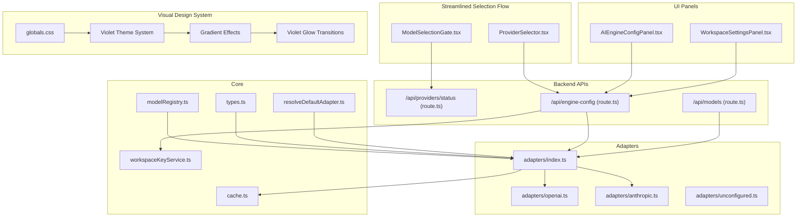

**Diagram sources**
- [ModelSelectionGate.tsx:1-413](file://components/ModelSelectionGate.tsx#L1-L413)
- [ProviderSelector.tsx:1-375](file://components/ProviderSelector.tsx#L1-L375)
- [providers/status/route.ts:1-204](file://app/api/providers/status/route.ts#L1-L204)
- [engine-config/route.ts:1-154](file://app/api/engine-config/route.ts#L1-L154)
- [models/route.ts:1-271](file://app/api/models/route.ts#L1-L271)
- [AIEngineConfigPanel.tsx:1-928](file://components/AIEngineConfigPanel.tsx#L1-L928)
- [WorkspaceSettingsPanel.tsx:1-436](file://components/WorkspaceSettingsPanel.tsx#L1-L436)
- [adapters/index.ts:1-314](file://lib/ai/adapters/index.ts#L1-L314)
- [adapters/openai.ts:1-223](file://lib/ai/adapters/openai.ts#L1-L223)
- [adapters/anthropic.ts:1-210](file://lib/ai/adapters/anthropic.ts#L1-L210)
- [adapters/unconfigured.ts:1-99](file://lib/ai/adapters/unconfigured.ts#L1-L99)
- [modelRegistry.ts:1-1138](file://lib/ai/modelRegistry.ts#L1-L1138)
- [types.ts:1-130](file://lib/ai/types.ts#L1-L130)
- [workspaceKeyService.ts:1-138](file://lib/security/workspaceKeyService.ts#L1-L138)
- [cache.ts:1-141](file://lib/ai/cache.ts#L1-L141)
- [resolveDefaultAdapter.ts:1-131](file://lib/ai/resolveDefaultAdapter.ts#L1-L131)
- [globals.css:1-156](file://app/globals.css#L1-L156)

**Section sources**
- [ModelSelectionGate.tsx:1-413](file://components/ModelSelectionGate.tsx#L1-L413)
- [ProviderSelector.tsx:1-375](file://components/ProviderSelector.tsx#L1-L375)
- [providers/status/route.ts:1-204](file://app/api/providers/status/route.ts#L1-L204)
- [engine-config/route.ts:1-154](file://app/api/engine-config/route.ts#L1-L154)
- [models/route.ts:1-271](file://app/api/models/route.ts#L1-L271)
- [AIEngineConfigPanel.tsx:1-928](file://components/AIEngineConfigPanel.tsx#L1-L928)
- [WorkspaceSettingsPanel.tsx:1-436](file://components/WorkspaceSettingsPanel.tsx#L1-L436)
- [adapters/index.ts:1-314](file://lib/ai/adapters/index.ts#L1-L314)
- [adapters/openai.ts:1-223](file://lib/ai/adapters/openai.ts#L1-L223)
- [adapters/anthropic.ts:1-210](file://lib/ai/adapters/anthropic.ts#L1-L210)
- [adapters/unconfigured.ts:1-99](file://lib/ai/adapters/unconfigured.ts#L1-L99)
- [modelRegistry.ts:1-1138](file://lib/ai/modelRegistry.ts#L1-L1138)
- [types.ts:1-130](file://lib/ai/types.ts#L1-L130)
- [workspaceKeyService.ts:1-138](file://lib/security/workspaceKeyService.ts#L1-L138)
- [cache.ts:1-141](file://lib/ai/cache.ts#L1-L141)
- [resolveDefaultAdapter.ts:1-131](file://lib/ai/resolveDefaultAdapter.ts#L1-L131)
- [globals.css:1-156](file://app/globals.css#L1-L156)

## Core Components
- Model registry: Central capability metadata for all supported models, including tier classification, token budgets, prompt strategies, and repair priorities.
- Pricing and cost estimation: Provider pricing entries and a function to estimate USD costs for a generation call.
- Adapter factory: Provider-neutral creation of adapters with secure credential resolution and fallbacks.
- Workspace configuration: Persistent storage of provider, model, and encrypted API keys per workspace.
- Model discovery: Dynamic listing of available models per provider with robust fallbacks.
- Enhanced ModelSelectionGate: Streamlined two-step wizard for mandatory initial model configuration with automatic provider discovery, credential resolution, and comprehensive visual redesign featuring violet theme, gradients, and brand color integration.
- Enhanced ProviderSelector: Intuitive provider selection component with model suggestions, secure credential management, and enhanced visual feedback.
- Universal LLM_KEY support: Simplified credential management allowing a single universal key to work across all providers.
- Groq provider integration: Dedicated configuration with optimized settings and OpenAI-compatible API support.
- Updated: Eliminated Ollama provider: Ollama is no longer available as a selectable provider option - local model support has been completely removed from the system.
- Caching: Deterministic caching of generation results for performance and cost savings.

**Section sources**
- [modelRegistry.ts:1-1138](file://lib/ai/modelRegistry.ts#L1-L1138)
- [types.ts:1-130](file://lib/ai/types.ts#L1-L130)
- [adapters/index.ts:1-314](file://lib/ai/adapters/index.ts#L1-L314)
- [engine-config/route.ts:1-154](file://app/api/engine-config/route.ts#L1-L154)
- [models/route.ts:1-271](file://app/api/models/route.ts#L1-L271)
- [cache.ts:1-141](file://lib/ai/cache.ts#L1-L141)
- [ModelSelectionGate.tsx:1-413](file://components/ModelSelectionGate.tsx#L1-L413)
- [ProviderSelector.tsx:1-375](file://components/ProviderSelector.tsx#L1-L375)
- [resolveDefaultAdapter.ts:1-131](file://lib/ai/resolveDefaultAdapter.ts#L1-L131)

## Architecture Overview
The system separates concerns across UI, persistence, adapters, and registry with enhanced streamlined selection flow and comprehensive visual design:
- ModelSelectionGate provides mandatory initial setup with automatic provider discovery, credential resolution, and major visual redesign.
- ProviderSelector offers intuitive provider and model selection with model suggestions and enhanced visual feedback.
- UI panels collect provider, model, and optional credentials.
- Provider status API dynamically discovers configured providers based on environment variables.
- Engine configuration API persists encrypted keys and returns current configuration.
- Model listing API queries providers and falls back to static lists when unavailable.
- Adapters encapsulate provider-specific logic and expose a uniform interface.
- Registry defines pipeline behavior per model tier and capability flags.
- Pricing enables cost-aware decisions.
- Comprehensive styling system provides violet theme, gradient backgrounds, and frosted glass effects.

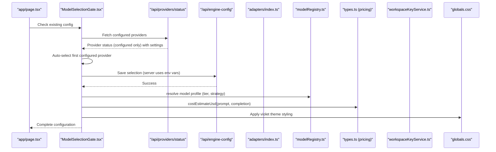

**Diagram sources**
- [page.tsx:68-107](file://app/page.tsx#L68-L107)
- [ModelSelectionGate.tsx:71-104](file://components/ModelSelectionGate.tsx#L71-L104)
- [providers/status/route.ts:128-205](file://app/api/providers/status/route.ts#L128-L205)
- [engine-config/route.ts:69-127](file://app/api/engine-config/route.ts#L69-L127)
- [adapters/index.ts:236-286](file://lib/ai/adapters/index.ts#L236-L286)
- [modelRegistry.ts:1-1138](file://lib/ai/modelRegistry.ts#L1-L1138)
- [types.ts:110-129](file://lib/ai/types.ts#L110-L129)
- [workspaceKeyService.ts:32-95](file://lib/security/workspaceKeyService.ts#L32-L95)
- [globals.css:1-156](file://app/globals.css#L1-L156)

## Detailed Component Analysis

### Enhanced Provider Status Checking System
The new `/api/providers/status` endpoint provides dynamic provider discovery with comprehensive configuration and optimized settings:
- Defines provider configurations with colors, gradients, model lists, and optimized settings
- Checks environment variables for provider configuration including universal LLM_KEY support
- Updated: Removed Ollama from provider configuration - local model support has been eliminated
- Returns configured provider count for UI display
- Enhanced: Implements ProviderSettings interface with temperature, maxTokens, and other optimization parameters
- Enhanced: Supports universal LLM_KEY fallback that works across all providers

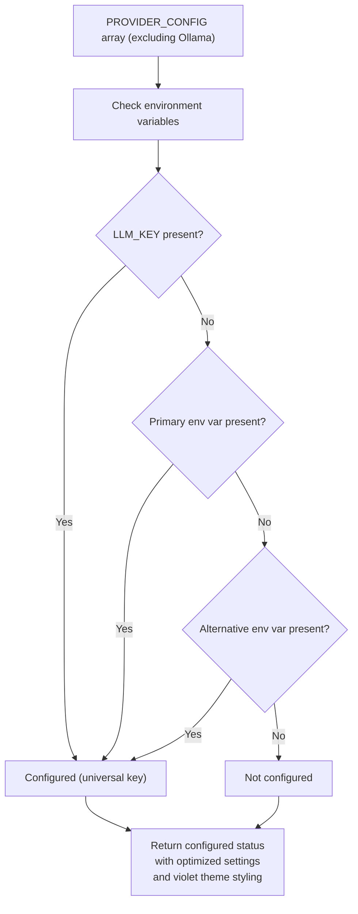

**Diagram sources**
- [providers/status/route.ts:53-111](file://app/api/providers/status/route.ts#L53-L111)
- [providers/status/route.ts:128-205](file://app/api/providers/status/route.ts#L128-L205)

**Section sources**
- [providers/status/route.ts:1-204](file://app/api/providers/status/route.ts#L1-L204)

### Enhanced Model Selection Gate and Streamlined Two-Step Process
The ModelSelectionGate provides a streamlined two-step wizard for mandatory initial model configuration with comprehensive visual redesign:
- **Step 1: Loading** - Automatically fetches configured providers from the new `/api/providers/status` endpoint with animated loading states and optimized settings display
- **Step 2: Provider Selection** - Displays only providers with configured API keys (filtered from environment variables) in an enhanced grid layout with gradient backgrounds, brand color integration, and optimized settings preview
- **Step 3: Confirmation** - Reviews and confirms the selected configuration with automatic credential resolution, enhanced security indicators, and optimized settings visualization

The new provider status API dynamically discovers configured providers based on environment variables:
- Checks for provider-specific environment variables (OPENAI_API_KEY, ANTHROPIC_API_KEY, etc.)
- Enhanced: Supports universal LLM_KEY that works across all providers
- Filters providers to only show those with valid credentials configured
- Updated: Excludes Ollama from provider list - local model support has been eliminated
- Supports alternative environment variables (e.g., GOOGLE_API_KEY and GEMINI_API_KEY)
- Enhanced: Returns optimized settings (temperature, maxTokens) for each provider

**Updated** Removed skip functionality - ModelSelectionGate now acts as mandatory first-time setup without skip option

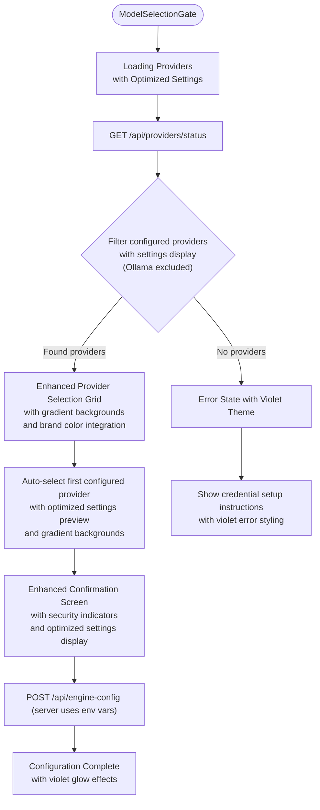

**Diagram sources**
- [ModelSelectionGate.tsx:71-104](file://components/ModelSelectionGate.tsx#L71-L104)
- [providers/status/route.ts:128-205](file://app/api/providers/status/route.ts#L128-L205)
- [ModelSelectionGate.tsx:112-148](file://components/ModelSelectionGate.tsx#L112-L148)

**Section sources**
- [ModelSelectionGate.tsx:1-413](file://components/ModelSelectionGate.tsx#L1-L413)
- [providers/status/route.ts:1-204](file://app/api/providers/status/route.ts#L1-L204)

### Enhanced Provider Status Discovery
The new `/api/providers/status` endpoint provides dynamic provider discovery with comprehensive configuration:
- Defines provider configurations with colors, gradients, and model lists
- Enhanced: Adds ProviderSettings interface with optimized temperature and maxTokens values
- Enhanced: Implements universal LLM_KEY support for simplified credential management
- Checks environment variables for provider configuration
- Updated: Removes Ollama provider configuration - local model support has been eliminated
- Returns configured provider count for UI display


**Diagram sources**
- [providers/status/route.ts:13-67](file://app/api/providers/status/route.ts#L13-L67)
- [providers/status/route.ts:128-205](file://app/api/providers/status/route.ts#L128-L205)

**Section sources**
- [providers/status/route.ts:1-204](file://app/api/providers/status/route.ts#L1-L204)

### Enhanced Adapter Factory and Credential Resolution
The adapter factory creates provider-specific adapters with secure credential resolution and enhanced universal key support:
- Resolves keys from workspace settings, environment variables, or returns an unconfigured adapter for graceful degradation
- Enhanced: Supports universal LLM_KEY that works across all providers
- Enhanced: Groq provider support with OpenAI-compatible API integration
- Supports OpenAI-compatible providers via base URLs
- Wraps adapters with caching and metrics dispatch

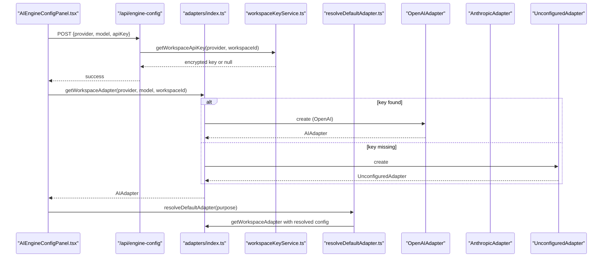

**Diagram sources**
- [engine-config/route.ts:69-127](file://app/api/engine-config/route.ts#L69-L127)
- [adapters/index.ts:236-286](file://lib/ai/adapters/index.ts#L236-L286)
- [workspaceKeyService.ts:32-95](file://lib/security/workspaceKeyService.ts#L32-L95)
- [resolveDefaultAdapter.ts:69-111](file://lib/ai/resolveDefaultAdapter.ts#L69-L111)
- [adapters/openai.ts:36-62](file://lib/ai/adapters/openai.ts#L36-L62)
- [adapters/anthropic.ts:71-87](file://lib/ai/adapters/anthropic.ts#L71-L87)
- [adapters/unconfigured.ts:13-14](file://lib/ai/adapters/unconfigured.ts#L13-L14)

**Section sources**
- [adapters/index.ts:146-215](file://lib/ai/adapters/index.ts#L146-L215)
- [adapters/index.ts:236-286](file://lib/ai/adapters/index.ts#L236-L286)
- [workspaceKeyService.ts:32-95](file://lib/security/workspaceKeyService.ts#L32-L95)
- [resolveDefaultAdapter.ts:1-131](file://lib/ai/resolveDefaultAdapter.ts#L1-L131)

### Enhanced Model Discovery and Fallbacks
The model listing API:
- Accepts provider and optional API key
- Resolves keys from client, database, or environment variables
- Enhanced: Groq provider support with dedicated model fetching and authentication
- Queries provider endpoints or falls back to static lists
- Sorts featured models and returns counts

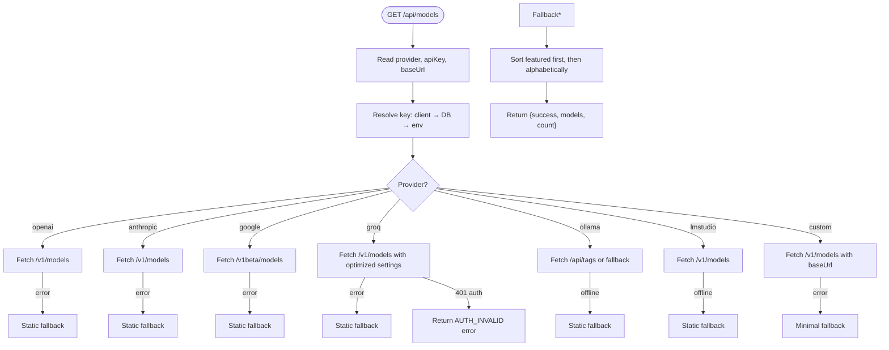

**Diagram sources**
- [models/route.ts:18-271](file://app/api/models/route.ts#L18-L271)

**Section sources**
- [models/route.ts:18-271](file://app/api/models/route.ts#L18-L271)

### Model Registry and Tiered Pipeline
The registry defines five tiers and associated pipeline behaviors:
- tiny (< 3B): fill-in-blank templates, temperature 0.0, no tool calls
- small (3B–9B): structured templates, temperature 0.1–0.2, rules-only repair
- medium (10B–34B): guided freeform, temperature 0.2–0.4, 1 tool round
- large (35B–70B): light guidance, temperature 0.3–0.5, 2 tool rounds
- cloud (API-hosted): full freeform, temperature 0.5–0.7, 3 tool rounds

Each profile includes:
- Capability flags: context window, max output tokens, temperature, tool calls, JSON mode, streaming reliability
- Pipeline controls: prompt strategy, blueprint token budget, explicit imports, output wrapper, extraction strategy
- Repair policy and timeouts

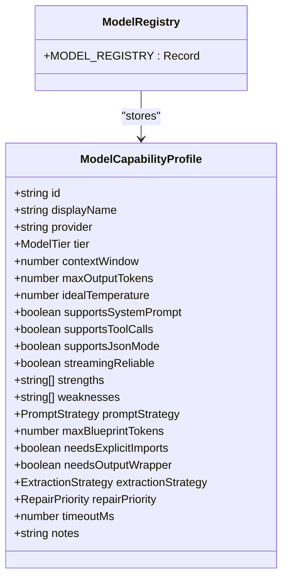

**Diagram sources**
- [modelRegistry.ts:69-128](file://lib/ai/modelRegistry.ts#L69-L128)

**Section sources**
- [modelRegistry.ts:25-128](file://lib/ai/modelRegistry.ts#L25-L128)

### Prompt Styles, Token Budgets, and Extraction Strategies
Prompt styles and pipeline controls are defined per model tier:
- fill-in-blank: tiny models
- structured-template: small models
- guided-freeform: medium/large
- freeform: cloud models

Token budgets and extraction strategies are tuned per model to balance quality and reliability.

```mermaid
classDiagram
class PromptStrategy {
<<enumeration>>
"fill-in-blank"
"structured-template"
"guided-freeform"
"freeform"
}
class ExtractionStrategy {
<<enumeration>>
"fence"
"heuristic"
"aggressive"
}
class RepairPriority {
<<enumeration>>
"never"
"rules-only"
"ai-cheap"
"ai-strong"
}
class ModelCapabilityProfile {
+PromptStrategy promptStrategy
+number maxBlueprintTokens
+boolean needsExplicitImports
+boolean needsOutputWrapper
+ExtractionStrategy extractionStrategy
+RepairPriority repairPriority
+number timeoutMs
}
```

**Diagram sources**
- [modelRegistry.ts:38-65](file://lib/ai/modelRegistry.ts#L38-L65)
- [modelRegistry.ts:69-128](file://lib/ai/modelRegistry.ts#L69-L128)

**Section sources**
- [modelRegistry.ts:38-65](file://lib/ai/modelRegistry.ts#L38-L65)
- [modelRegistry.ts:69-128](file://lib/ai/modelRegistry.ts#L69-L128)

### Cost Estimation and Pricing
Pricing entries enable cost-aware model selection:
- Canonical model names map to input/output cost per 1K tokens
- costEstimateUsd estimates total USD cost for a generation call
- Partial matching supports model variants

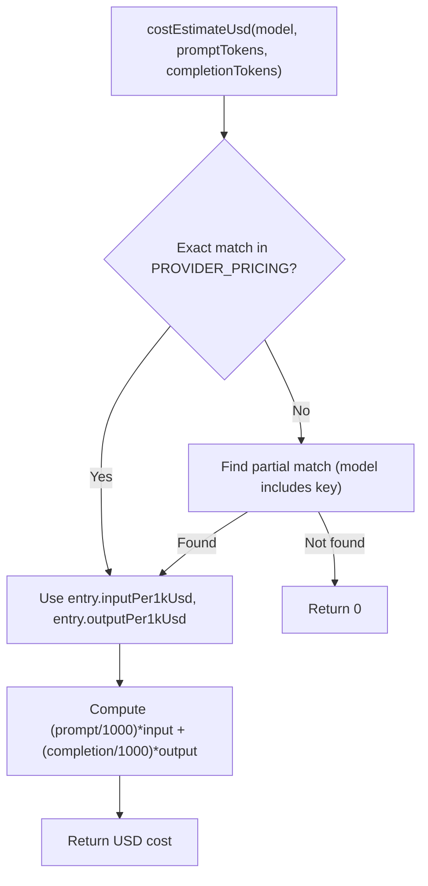

**Diagram sources**
- [types.ts:110-129](file://lib/ai/types.ts#L110-L129)

**Section sources**
- [types.ts:79-129](file://lib/ai/types.ts#L79-L129)

### Caching and Metrics
Adapters are wrapped with caching and metrics:
- Deterministic cache keys derived from model, temperature, messages, and tools
- Upstash Redis in production, memory cache in development
- Metrics dispatched on each generation/stream operation

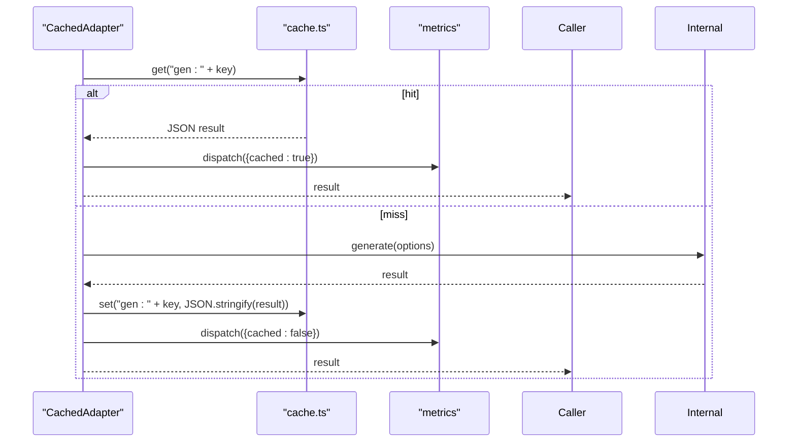

**Diagram sources**
- [adapters/index.ts:82-138](file://lib/ai/adapters/index.ts#L82-L138)
- [cache.ts:132-140](file://lib/ai/cache.ts#L132-L140)

**Section sources**
- [adapters/index.ts:82-138](file://lib/ai/adapters/index.ts#L82-L138)
- [cache.ts:108-140](file://lib/ai/cache.ts#L108-L140)

## Visual Design System

### Enhanced Styling Architecture
The ModelSelectionGate features a comprehensive visual redesign with a cohesive violet-themed design system:
- **Violet Orb Background**: Radial gradient orbs positioned strategically behind the main content
- **Gradient Provider Cards**: Each provider displays with unique gradient backgrounds and brand color integration
- **Violet Glow Transitions**: Smooth hover effects with purple/violet glow transitions on interactive elements
- **Frosted Glass Effects**: Backdrop blur and translucent surfaces for modern UI feel
- **Typography Enhancements**: Improved hover state animations and text styling with violet accents

### Color Scheme and Theming
The system implements a sophisticated color palette centered around violet and purple tones:
- Primary violet: `#8b5cf6` (139, 92, 246) - used for highlights, gradients, and interactive elements
- Secondary gradients: From-violet-to-purple combinations for provider cards and buttons
- Background: Dark slate blue `#0B0F19` with subtle violet undertones
- Text: high contrast white and gray tones with violet accents for emphasis
- Glows: Subtle violet shadows and text glows for depth and visual interest

### Interactive Elements and Animations
- **Hover Effects**: Smooth scaling transitions (1.02x) with violet glow overlays on provider cards
- **Button States**: Gradient backgrounds with hover effects, active press-down animations
- **Loading States**: Animated spinner with violet color scheme
- **Success States**: Emerald green accents for positive feedback
- **Error States**: Red/orange tones with violet borders for warnings

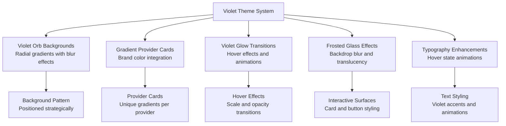

**Diagram sources**
- [ModelSelectionGate.tsx:158-163](file://components/ModelSelectionGate.tsx#L158-L163)
- [ModelSelectionGate.tsx:294-332](file://components/ModelSelectionGate.tsx#L294-L332)
- [ModelSelectionGate.tsx:424-437](file://components/ModelSelectionGate.tsx#L424-L437)
- [globals.css:9-21](file://app/globals.css#L9-L21)
- [globals.css:54-68](file://app/globals.css#L54-L68)

**Section sources**
- [ModelSelectionGate.tsx:158-163](file://components/ModelSelectionGate.tsx#L158-L163)
- [ModelSelectionGate.tsx:294-332](file://components/ModelSelectionGate.tsx#L294-L332)
- [ModelSelectionGate.tsx:424-437](file://components/ModelSelectionGate.tsx#L424-L437)
- [globals.css:9-21](file://app/globals.css#L9-L21)
- [globals.css:54-68](file://app/globals.css#L54-L68)

## Dependency Analysis
The system exhibits clear separation of concerns with enhanced streamlined selection flow and comprehensive visual design:
- ModelSelectionGate depends on provider status API for automatic provider discovery and styling system for visual effects
- ProviderSelector depends on engine-config API for credential status checks and configuration
- UI panels depend on backend APIs for configuration and model discovery
- Provider status API depends on environment variables and provider configurations
- Engine configuration API depends on workspace key service and encryption
- Adapter factory depends on provider-specific adapters and caching
- Registry and pricing are independent data sources consumed by UI and adapters
- Model listing API depends on provider endpoints and static fallbacks
- Visual design system provides consistent theming across all components
- Enhanced: Universal LLM_KEY support integrates across all components for simplified credential management
- Updated: Removed Ollama dependencies - local model support has been eliminated from all components

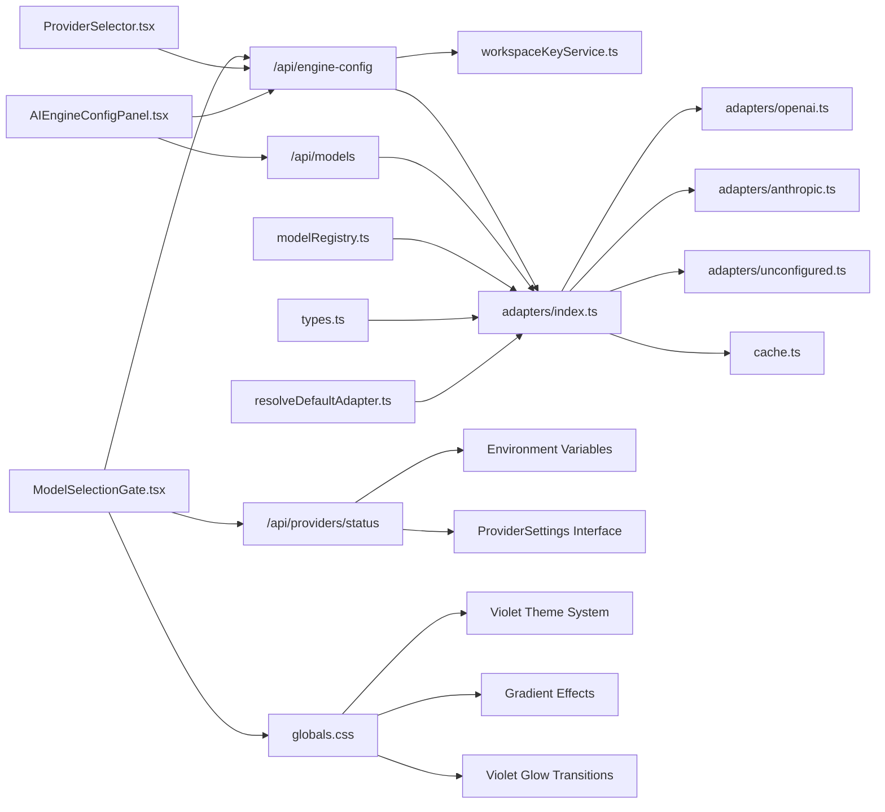

**Diagram sources**
- [ModelSelectionGate.tsx:1-413](file://components/ModelSelectionGate.tsx#L1-L413)
- [ProviderSelector.tsx:1-375](file://components/ProviderSelector.tsx#L1-L375)
- [providers/status/route.ts:1-204](file://app/api/providers/status/route.ts#L1-L204)
- [engine-config/route.ts:1-154](file://app/api/engine-config/route.ts#L1-L154)
- [models/route.ts:1-271](file://app/api/models/route.ts#L1-L271)
- [adapters/index.ts:1-314](file://lib/ai/adapters/index.ts#L1-L314)
- [adapters/openai.ts:1-223](file://lib/ai/adapters/openai.ts#L1-L223)
- [adapters/anthropic.ts:1-210](file://lib/ai/adapters/anthropic.ts#L1-L210)
- [adapters/unconfigured.ts:1-99](file://lib/ai/adapters/unconfigured.ts#L1-L99)
- [workspaceKeyService.ts:1-138](file://lib/security/workspaceKeyService.ts#L1-L138)
- [cache.ts:1-141](file://lib/ai/cache.ts#L1-L141)
- [modelRegistry.ts:1-1138](file://lib/ai/modelRegistry.ts#L1-L1138)
- [types.ts:1-130](file://lib/ai/types.ts#L1-L130)
- [globals.css:1-156](file://app/globals.css#L1-L156)
- [resolveDefaultAdapter.ts:1-131](file://lib/ai/resolveDefaultAdapter.ts#L1-L131)

**Section sources**
- [adapters/index.ts:1-314](file://lib/ai/adapters/index.ts#L1-L314)
- [providers/status/route.ts:1-204](file://app/api/providers/status/route.ts#L1-L204)
- [engine-config/route.ts:1-154](file://app/api/engine-config/route.ts#L1-L154)
- [models/route.ts:1-271](file://app/api/models/route.ts#L1-L271)
- [workspaceKeyService.ts:1-138](file://lib/security/workspaceKeyService.ts#L1-L138)
- [cache.ts:1-141](file://lib/ai/cache.ts#L1-L141)
- [modelRegistry.ts:1-1138](file://lib/ai/modelRegistry.ts#L1-L1138)
- [types.ts:1-130](file://lib/ai/types.ts#L1-L130)
- [ModelSelectionGate.tsx:1-413](file://components/ModelSelectionGate.tsx#L1-L413)
- [ProviderSelector.tsx:1-375](file://components/ProviderSelector.tsx#L1-L375)
- [globals.css:1-156](file://app/globals.css#L1-L156)
- [resolveDefaultAdapter.ts:1-131](file://lib/ai/resolveDefaultAdapter.ts#L1-L131)

## Performance Considerations
- Use caching to reduce redundant generations and lower latency and cost
- Prefer smaller models for constrained contexts and faster iteration
- Tune temperature and max tokens according to model profiles to balance quality and speed
- Leverage static fallbacks for model discovery to avoid network timeouts
- Monitor token usage and cost estimates to guide model selection
- Enhanced: ModelSelectionGate reduces initial setup friction with streamlined two-step flow and optimized visual effects
- Enhanced: Automatic provider discovery eliminates manual credential entry overhead with efficient API calls
- Enhanced: Environment variable-based credential resolution improves security and reduces configuration complexity
- Enhanced: Universal LLM_KEY support simplifies credential management across all providers
- Enhanced: Visual redesign maintains performance through optimized gradient rendering and minimal DOM manipulation
- Updated: Removed Ollama-related performance considerations - local model support has been eliminated

## Troubleshooting Guide
Common issues and resolutions:
- Missing API keys: The provider status API filters out providers without configured credentials; check environment variables
- Enhanced: Universal LLM_KEY not working: Verify LLM_KEY is properly set in environment variables and accessible to all providers
- Provider connectivity: Model listing API surfaces authentication errors distinctly; use the connection test in the settings panel
- Silent failures: The registry returns null for unknown models; callers should fall back to a sensible default tier (cloud)
- Updated: Local provider unavailability: Ollama is no longer available as a provider option - all providers now require API keys
- Enhanced: Model gate showing error state: Check that environment variables are properly configured for desired providers with violet-themed error display
- Enhanced: Provider not appearing: Verify environment variable naming conventions (OPENAI_API_KEY, ANTHROPIC_API_KEY, GROQ_API_KEY, etc.) with proper configuration detection
- Enhanced: Automatic credential resolution failing: Ensure environment variables are set in the deployment platform (Vercel) with proper environment variable support
- Enhanced: Visual effects not displaying: Verify globals.css is properly loaded and violet theme variables are accessible
- Enhanced: Groq provider authentication issues: Verify GROQ_API_KEY is valid and has sufficient quota for model access

**Section sources**
- [adapters/index.ts:28-40](file://lib/ai/adapters/index.ts#L28-L40)
- [adapters/unconfigured.ts:13-99](file://lib/ai/adapters/unconfigured.ts#L13-L99)
- [models/route.ts:18-271](file://app/api/models/route.ts#L18-L271)
- [modelRegistry.ts:18-23](file://lib/ai/modelRegistry.ts#L18-L23)
- [providers/status/route.ts:128-205](file://app/api/providers/status/route.ts#L128-L205)
- [ModelSelectionGate.tsx:244-275](file://components/ModelSelectionGate.tsx#L244-L275)
- [globals.css:9-21](file://app/globals.css#L9-L21)

## Conclusion
The model configuration and selection system provides a robust, provider-agnostic framework for choosing and managing AI models. The enhanced streamlined ModelSelectionGate flow with automatic provider discovery, credential resolution, and comprehensive visual redesign significantly improves the initial setup experience while maintaining security and flexibility. The major visual redesign featuring violet-themed color schemes, gradient backgrounds, and brand color integration creates a cohesive and visually appealing user experience. 

Enhanced Features:
- Universal LLM_KEY support simplifies credential management across all providers
- Dedicated Groq provider integration with optimized settings and OpenAI-compatible API
- Enhanced provider status checking system with optimized settings display
- Comprehensive visual design system with violet theme, gradient effects, and frosted glass aesthetics

Updated Features:
- **Eliminated Ollama provider**: Ollama is no longer available as a selectable provider option - local model support has been completely removed from the system
- **Updated environment variable configuration**: Removed OLLAMA_API_KEY references and related local model configuration examples
- **Simplified ModelSelectionGate**: Reduced from three-step wizard to streamlined two-step process with mandatory setup flow

By combining a centralized registry, secure credential resolution, dynamic provider discovery, cost-aware pricing, and comprehensive visual design system, it enables teams to optimize for performance, cost, and reliability while maintaining a consistent developer experience with enhanced aesthetics.

## Appendices

### Example: Configure a Custom Model
- Use the AI Engine Config panel to select a provider and enter a custom model ID
- Optionally set a base URL for OpenAI-compatible endpoints
- Save the configuration; the backend encrypts and stores the key securely
- The adapter factory resolves the key and constructs the appropriate adapter

**Section sources**
- [AIEngineConfigPanel.tsx:359-420](file://components/AIEngineConfigPanel.tsx#L359-L420)
- [engine-config/route.ts:69-127](file://app/api/engine-config/route.ts#L69-L127)
- [adapters/index.ts:236-286](file://lib/ai/adapters/index.ts#L236-L286)

### Example: Optimize for Cost/Performance
- Use the pricing table to estimate costs for different models
- Select a tier appropriate for the task (e.g., small for structured templates)
- Adjust temperature and token budgets according to model profiles
- Enable caching to reduce repeated requests
- Enhanced: Leverage universal LLM_KEY for simplified cost management across providers
- Updated: Focus on cloud-based providers (OpenAI, Anthropic, Google, Groq) as Ollama is no longer available

**Section sources**
- [types.ts:79-129](file://lib/ai/types.ts#L79-L129)
- [modelRegistry.ts:25-65](file://lib/ai/modelRegistry.ts#L25-L65)
- [cache.ts:108-140](file://lib/ai/cache.ts#L108-L140)
- [resolveDefaultAdapter.ts:1-131](file://lib/ai/resolveDefaultAdapter.ts#L1-L131)

### Example: Handle Model Availability Issues
- If a provider endpoint is down, the model listing API returns static fallbacks
- If no keys are configured, the adapter factory returns an unconfigured adapter with helpful messaging
- Use the settings panel to validate connections and manage keys
- Enhanced: Universal LLM_KEY provides fallback option when provider-specific keys are unavailable
- Updated: All providers now require API keys - Ollama is no longer available as a fallback option

**Section sources**
- [models/route.ts:18-271](file://app/api/models/route.ts#L18-L271)
- [adapters/unconfigured.ts:13-99](file://lib/ai/adapters/unconfigured.ts#L13-L99)
- [AIEngineConfigPanel.tsx:340-356](file://components/AIEngineConfigPanel.tsx#L340-L356)
- [resolveDefaultAdapter.ts:1-131](file://lib/ai/resolveDefaultAdapter.ts#L1-L131)

### Example: Implement Streamlined Model Selection Gate
- Integrate ModelSelectionGate into your main application as the mandatory initial setup flow
- The component automatically handles provider discovery and credential resolution with visual feedback
- Handle onComplete callback to receive selected provider, model, and providerName
- **Updated**: Removed skip functionality - ModelSelectionGate now acts as mandatory setup without skip option
- Leverage the enhanced visual design system for consistent theming
- Enhanced: Benefit from optimized settings display and universal LLM_KEY support
- Updated: Provider list excludes Ollama - only cloud-based providers are available

**Section sources**
- [ModelSelectionGate.tsx:59-157](file://components/ModelSelectionGate.tsx#L59-L157)
- [page.tsx:468-474](file://app/page.tsx#L468-L474)

### Example: Customize Provider Selector
- Use ProviderSelector component for standalone provider selection
- Configure PROVIDER_OPTIONS and PROVIDER_MODELS for your specific needs
- Handle onProviderSelect callback to receive provider and model selections
- Use onConfigureCredentials callback for credential management flows
- Enhanced: Leverage universal LLM_KEY for simplified credential management
- Updated: Provider list excludes Ollama - only cloud-based providers are available

**Section sources**
- [ProviderSelector.tsx:126-148](file://components/ProviderSelector.tsx#L126-L148)
- [ProviderSelector.tsx:34-101](file://components/ProviderSelector.tsx#L34-L101)
- [ProviderSelector.tsx:105-111](file://components/ProviderSelector.tsx#L105-L111)

### Example: Configure Environment Variables for Providers
- Set OPENAI_API_KEY for OpenAI models
- Set ANTHROPIC_API_KEY for Claude models
- Set GOOGLE_API_KEY or GEMINI_API_KEY for Gemini models
- Enhanced: Set GROQ_API_KEY for Groq inference
- Updated: Removed OLLAMA_API_KEY - Ollama is no longer supported
- Enhanced: Set LLM_KEY for universal key across all providers

Updated: Removed references to DeepSeek, Mistral, OpenRouter, Together, Meta, Qwen, and Gemma providers from environment variable configuration examples

**Section sources**
- [providers/status/route.ts:13-67](file://app/api/providers/status/route.ts#L13-L67)
- [providers/status/route.ts:128-205](file://app/api/providers/status/route.ts#L128-L205)
- [providers/status/route.ts:88-104](file://app/api/providers/status/route.ts#L88-L104)

### Example: Implement Enhanced Visual Design System
- Utilize the violet theme system with `--stitch-violet` variables
- Apply gradient backgrounds using `from-violet-500/20 to-purple-500/20` classes
- Implement violet glow effects with `shadow-violet-500/25` classes
- Use frosted glass effects with `backdrop-blur-xl` and translucent surfaces
- Leverage hover effects with smooth transitions and opacity changes

**Section sources**
- [globals.css:9-21](file://app/globals.css#L9-L21)
- [globals.css:54-68](file://app/globals.css#L54-L68)
- [ModelSelectionGate.tsx:158-163](file://components/ModelSelectionGate.tsx#L158-L163)
- [ModelSelectionGate.tsx:294-332](file://components/ModelSelectionGate.tsx#L294-L332)

### Example: Implement Universal LLM_KEY Support
- Set LLM_KEY environment variable to work across all providers
- The system automatically detects and uses the universal key for any provider
- Provides fallback when provider-specific keys are unavailable
- Simplifies credential management for development and testing environments

**Section sources**
- [adapters/index.ts:275-280](file://lib/ai/adapters/index.ts#L275-L280)
- [providers/status/route.ts:133-157](file://app/api/providers/status/route.ts#L133-L157)
- [resolveDefaultAdapter.ts:275-280](file://lib/ai/resolveDefaultAdapter.ts#L275-L280)

### Example: Configure Groq Provider Settings
- Set GROQ_API_KEY environment variable for Groq access
- The system automatically applies optimized settings (temperature: 0.5, maxTokens: 4096)
- Supports ultra-fast inference with Llama 3.3 and Mixtral models
- Integrates seamlessly with OpenAI-compatible API interface

**Section sources**
- [providers/status/route.ts:40-44](file://app/api/providers/status/route.ts#L40-L44)
- [providers/status/route.ts:90-99](file://app/api/providers/status/route.ts#L90-L99)
- [models/route.ts:84-100](file://app/api/models/route.ts#L84-L100)
- [resolveDefaultAdapter.ts:49-56](file://lib/ai/resolveDefaultAdapter.ts#L49-L56)

### Example: Updated Provider Configuration
Updated: The system now supports the following providers:
- OpenAI (GPT-4o, GPT-4o-mini, o3-mini)
- Anthropic (Claude 3.5 Sonnet, Claude 3 Opus)
- Google Gemini (Gemini 2.0 Flash, Gemini 1.5 Pro)
- Groq (Llama 3.3, Mixtral - ultra-fast inference)

Removed: Ollama provider support - local model functionality has been eliminated from the system.

**Section sources**
- [providers/status/route.ts:62-109](file://app/api/providers/status/route.ts#L62-L109)
- [ProviderSelector.tsx:34-101](file://components/ProviderSelector.tsx#L34-L101)