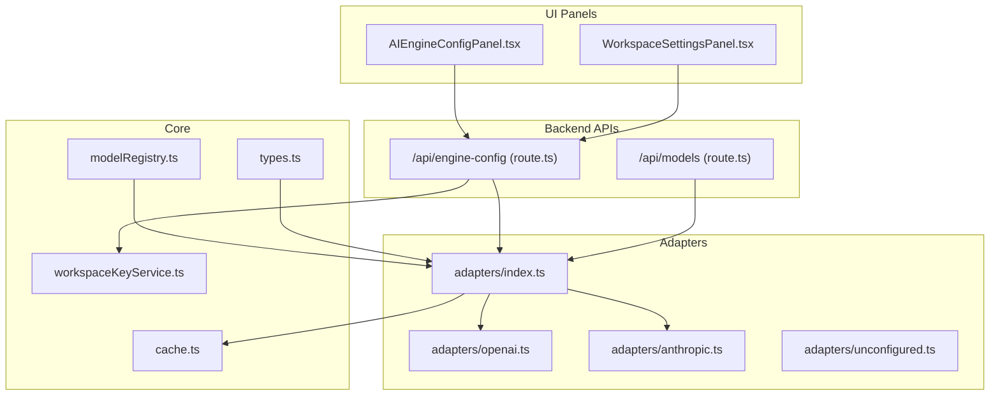
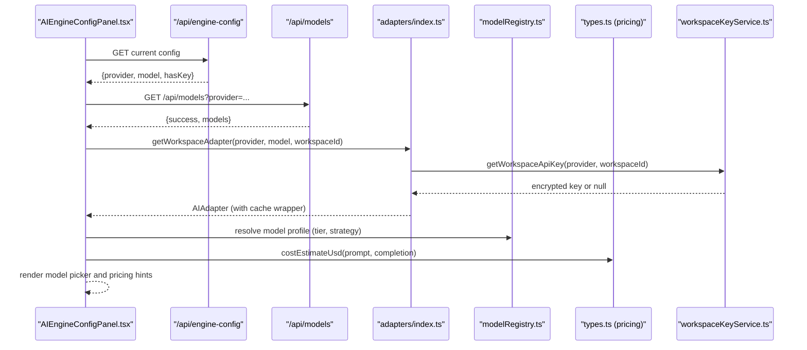
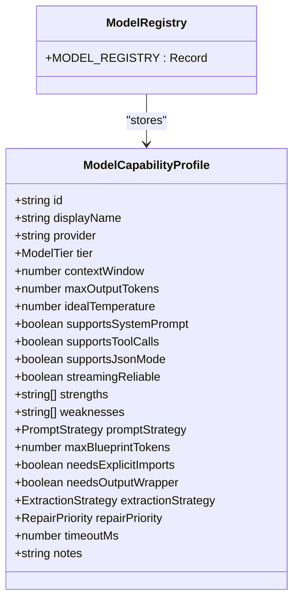
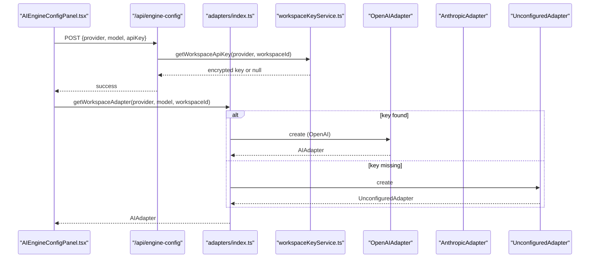
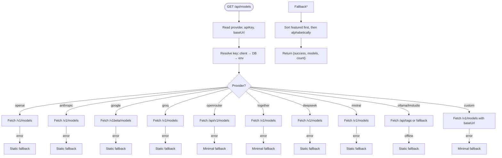
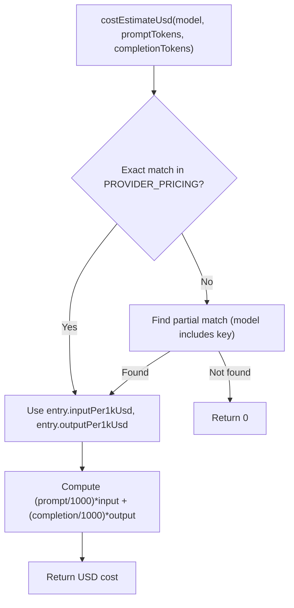
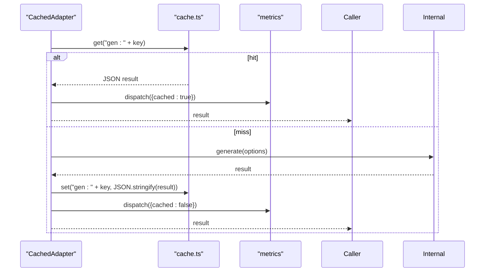
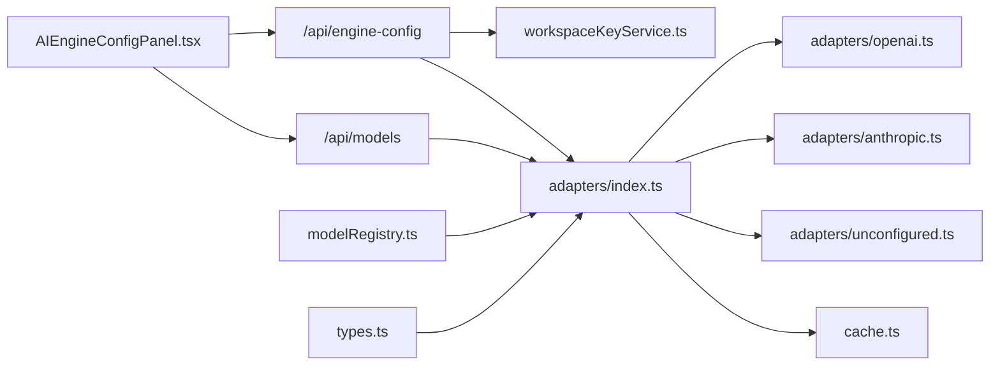

# Model Configuration & Selection

<cite>
**Referenced Files in This Document**
- [modelRegistry.ts](file://lib/ai/modelRegistry.ts)
- [types.ts](file://lib/ai/types.ts)
- [adapters/index.ts](file://lib/ai/adapters/index.ts)
- [adapters/base.ts](file://lib/ai/adapters/base.ts)
- [adapters/openai.ts](file://lib/ai/adapters/openai.ts)
- [adapters/anthropic.ts](file://lib/ai/adapters/anthropic.ts)
- [adapters/unconfigured.ts](file://lib/ai/adapters/unconfigured.ts)
- [cache.ts](file://lib/ai/cache.ts)
- [workspaceKeyService.ts](file://lib/security/workspaceKeyService.ts)
- [engine-config/route.ts](file://app/api/engine-config/route.ts)
- [models/route.ts](file://app/api/models/route.ts)
- [AIEngineConfigPanel.tsx](file://components/AIEngineConfigPanel.tsx)
- [WorkspaceSettingsPanel.tsx](file://components/WorkspaceSettingsPanel.tsx)
</cite>

## Table of Contents
1. [Introduction](#introduction)
2. [Project Structure](#project-structure)
3. [Core Components](#core-components)
4. [Architecture Overview](#architecture-overview)
5. [Detailed Component Analysis](#detailed-component-analysis)
6. [Dependency Analysis](#dependency-analysis)
7. [Performance Considerations](#performance-considerations)
8. [Troubleshooting Guide](#troubleshooting-guide)
9. [Conclusion](#conclusion)
10. [Appendices](#appendices)

## Introduction
This document describes the model configuration and selection system that powers AI-driven UI generation. It covers:
- Model registry architecture with capability profiles, tier classifications, and capability flags
- Tiered pipeline configuration that selects generation parameters based on model capabilities
- Model resolution algorithm that chooses appropriate models based on intent complexity, workspace settings, and available resources
- Prompt style selection (structured, guided-freeform, freeform), token budget calculations, and fallback mechanisms
- Examples for configuring custom models, optimizing for cost/performance, and handling model availability issues

## Project Structure
The model configuration system spans several layers:
- UI panels for configuration and model discovery
- Backend APIs for engine configuration and model listing
- Adapter layer for provider-neutral model invocation
- Registry and pricing for capability metadata and cost estimation
- Caching and credential management for reliability and performance



**Diagram sources**
- [AIEngineConfigPanel.tsx:1-899](file://components/AIEngineConfigPanel.tsx#L1-L899)
- [WorkspaceSettingsPanel.tsx:1-437](file://components/WorkspaceSettingsPanel.tsx#L1-L437)
- [engine-config/route.ts:1-154](file://app/api/engine-config/route.ts#L1-L154)
- [models/route.ts:1-457](file://app/api/models/route.ts#L1-L457)
- [adapters/index.ts:1-306](file://lib/ai/adapters/index.ts#L1-L306)
- [adapters/openai.ts:1-223](file://lib/ai/adapters/openai.ts#L1-L223)
- [adapters/anthropic.ts:1-210](file://lib/ai/adapters/anthropic.ts#L1-L210)
- [adapters/unconfigured.ts:1-99](file://lib/ai/adapters/unconfigured.ts#L1-L99)
- [modelRegistry.ts:1-1138](file://lib/ai/modelRegistry.ts#L1-L1138)
- [types.ts:1-130](file://lib/ai/types.ts#L1-L130)
- [workspaceKeyService.ts:1-138](file://lib/security/workspaceKeyService.ts#L1-L138)
- [cache.ts:1-141](file://lib/ai/cache.ts#L1-L141)

**Section sources**
- [AIEngineConfigPanel.tsx:1-899](file://components/AIEngineConfigPanel.tsx#L1-L899)
- [WorkspaceSettingsPanel.tsx:1-437](file://components/WorkspaceSettingsPanel.tsx#L1-L437)
- [engine-config/route.ts:1-154](file://app/api/engine-config/route.ts#L1-L154)
- [models/route.ts:1-457](file://app/api/models/route.ts#L1-L457)
- [adapters/index.ts:1-306](file://lib/ai/adapters/index.ts#L1-L306)
- [adapters/openai.ts:1-223](file://lib/ai/adapters/openai.ts#L1-L223)
- [adapters/anthropic.ts:1-210](file://lib/ai/adapters/anthropic.ts#L1-L210)
- [adapters/unconfigured.ts:1-99](file://lib/ai/adapters/unconfigured.ts#L1-L99)
- [modelRegistry.ts:1-1138](file://lib/ai/modelRegistry.ts#L1-L1138)
- [types.ts:1-130](file://lib/ai/types.ts#L1-L130)
- [workspaceKeyService.ts:1-138](file://lib/security/workspaceKeyService.ts#L1-L138)
- [cache.ts:1-141](file://lib/ai/cache.ts#L1-L141)

## Core Components
- Model registry: Central capability metadata for all supported models, including tier classification, token budgets, prompt strategies, and repair priorities.
- Pricing and cost estimation: Provider pricing entries and a function to estimate USD costs for a generation call.
- Adapter factory: Provider-neutral creation of adapters with secure credential resolution and fallbacks.
- Workspace configuration: Persistent storage of provider, model, and encrypted API keys per workspace.
- Model discovery: Dynamic listing of available models per provider with robust fallbacks.
- Caching: Deterministic caching of generation results for performance and cost savings.

**Section sources**
- [modelRegistry.ts:1-1138](file://lib/ai/modelRegistry.ts#L1-L1138)
- [types.ts:1-130](file://lib/ai/types.ts#L1-L130)
- [adapters/index.ts:1-306](file://lib/ai/adapters/index.ts#L1-L306)
- [engine-config/route.ts:1-154](file://app/api/engine-config/route.ts#L1-L154)
- [models/route.ts:1-457](file://app/api/models/route.ts#L1-L457)
- [cache.ts:1-141](file://lib/ai/cache.ts#L1-L141)

## Architecture Overview
The system separates concerns across UI, persistence, adapters, and registry:
- UI panels collect provider, model, and optional credentials.
- Engine configuration API persists encrypted keys and returns current configuration.
- Model listing API queries providers and falls back to static lists when unavailable.
- Adapters encapsulate provider-specific logic and expose a uniform interface.
- Registry defines pipeline behavior per model tier and capability flags.
- Pricing enables cost-aware decisions.



**Diagram sources**
- [AIEngineConfigPanel.tsx:1-899](file://components/AIEngineConfigPanel.tsx#L1-L899)
- [engine-config/route.ts:1-154](file://app/api/engine-config/route.ts#L1-L154)
- [models/route.ts:1-457](file://app/api/models/route.ts#L1-L457)
- [adapters/index.ts:1-306](file://lib/ai/adapters/index.ts#L1-L306)
- [modelRegistry.ts:1-1138](file://lib/ai/modelRegistry.ts#L1-L1138)
- [types.ts:1-130](file://lib/ai/types.ts#L1-L130)
- [workspaceKeyService.ts:1-138](file://lib/security/workspaceKeyService.ts#L1-L138)

## Detailed Component Analysis

### Model Registry and Tiered Pipeline
The registry defines five tiers and associated pipeline behaviors:
- tiny (< 3B): fill-in-blank templates, temperature 0.0, no tool calls
- small (3B–9B): structured templates, temperature 0.1–0.2, rules-only repair
- medium (10B–34B): guided freeform, temperature 0.2–0.4, 1 tool round
- large (35B–70B): light guidance, temperature 0.3–0.5, 2 tool rounds
- cloud (API-hosted): full freeform, temperature 0.5–0.7, 3 tool rounds

Each profile includes:
- Capability flags: context window, max output tokens, temperature, tool calls, JSON mode, streaming reliability
- Pipeline controls: prompt strategy, blueprint token budget, explicit imports, output wrapper, extraction strategy
- Repair policy and timeouts



**Diagram sources**
- [modelRegistry.ts:69-128](file://lib/ai/modelRegistry.ts#L69-L128)

**Section sources**
- [modelRegistry.ts:25-128](file://lib/ai/modelRegistry.ts#L25-L128)

### Adapter Factory and Credential Resolution
The adapter factory creates provider-specific adapters with secure credential resolution:
- Resolves keys from workspace settings, environment variables, or returns an unconfigured adapter for graceful degradation
- Supports OpenAI-compatible providers via base URLs
- Wraps adapters with caching and metrics dispatch



**Diagram sources**
- [engine-config/route.ts:69-127](file://app/api/engine-config/route.ts#L69-L127)
- [adapters/index.ts:236-278](file://lib/ai/adapters/index.ts#L236-L278)
- [workspaceKeyService.ts:32-95](file://lib/security/workspaceKeyService.ts#L32-L95)
- [adapters/openai.ts:36-62](file://lib/ai/adapters/openai.ts#L36-L62)
- [adapters/anthropic.ts:71-87](file://lib/ai/adapters/anthropic.ts#L71-L87)
- [adapters/unconfigured.ts:13-14](file://lib/ai/adapters/unconfigured.ts#L13-L14)

**Section sources**
- [adapters/index.ts:146-215](file://lib/ai/adapters/index.ts#L146-L215)
- [adapters/index.ts:236-278](file://lib/ai/adapters/index.ts#L236-L278)
- [workspaceKeyService.ts:32-95](file://lib/security/workspaceKeyService.ts#L32-L95)

### Model Discovery and Fallbacks
The model listing API:
- Accepts provider and optional API key
- Resolves keys from client, database, or environment variables
- Queries provider endpoints or falls back to static lists
- Sorts featured models and returns counts



**Diagram sources**
- [models/route.ts:206-456](file://app/api/models/route.ts#L206-L456)

**Section sources**
- [models/route.ts:206-456](file://app/api/models/route.ts#L206-L456)

### Prompt Styles, Token Budgets, and Extraction Strategies
Prompt styles and pipeline controls are defined per model tier:
- fill-in-blank: tiny models
- structured-template: small models
- guided-freeform: medium/large
- freeform: cloud models

Token budgets and extraction strategies are tuned per model to balance quality and reliability.

```mermaid
classDiagram
class PromptStrategy {
<<enumeration>>
"fill-in-blank"
"structured-template"
"guided-freeform"
"freeform"
}
class ExtractionStrategy {
<<enumeration>>
"fence"
"heuristic"
"aggressive"
}
class RepairPriority {
<<enumeration>>
"never"
"rules-only"
"ai-cheap"
"ai-strong"
}
class ModelCapabilityProfile {
+PromptStrategy promptStrategy
+number maxBlueprintTokens
+boolean needsExplicitImports
+boolean needsOutputWrapper
+ExtractionStrategy extractionStrategy
+RepairPriority repairPriority
+number timeoutMs
}
```

**Diagram sources**
- [modelRegistry.ts:38-65](file://lib/ai/modelRegistry.ts#L38-L65)
- [modelRegistry.ts:69-128](file://lib/ai/modelRegistry.ts#L69-L128)

**Section sources**
- [modelRegistry.ts:38-65](file://lib/ai/modelRegistry.ts#L38-L65)
- [modelRegistry.ts:69-128](file://lib/ai/modelRegistry.ts#L69-L128)

### Cost Estimation and Pricing
Pricing entries enable cost-aware model selection:
- Canonical model names map to input/output cost per 1K tokens
- costEstimateUsd estimates total USD cost for a generation call
- Partial matching supports model variants



**Diagram sources**
- [types.ts:110-129](file://lib/ai/types.ts#L110-L129)

**Section sources**
- [types.ts:79-129](file://lib/ai/types.ts#L79-L129)

### Caching and Metrics
Adapters are wrapped with caching and metrics:
- Deterministic cache keys derived from model, temperature, messages, and tools
- Upstash Redis in production, memory cache in development
- Metrics dispatched on each generation/stream operation



**Diagram sources**
- [adapters/index.ts:82-138](file://lib/ai/adapters/index.ts#L82-L138)
- [cache.ts:132-140](file://lib/ai/cache.ts#L132-L140)

**Section sources**
- [adapters/index.ts:82-138](file://lib/ai/adapters/index.ts#L82-L138)
- [cache.ts:108-140](file://lib/ai/cache.ts#L108-L140)

## Dependency Analysis
The system exhibits clear separation of concerns:
- UI panels depend on backend APIs for configuration and model discovery
- Engine configuration API depends on workspace key service and encryption
- Adapter factory depends on provider-specific adapters and caching
- Registry and pricing are independent data sources consumed by UI and adapters
- Model listing API depends on provider endpoints and static fallbacks



**Diagram sources**
- [AIEngineConfigPanel.tsx:1-899](file://components/AIEngineConfigPanel.tsx#L1-L899)
- [engine-config/route.ts:1-154](file://app/api/engine-config/route.ts#L1-L154)
- [models/route.ts:1-457](file://app/api/models/route.ts#L1-L457)
- [adapters/index.ts:1-306](file://lib/ai/adapters/index.ts#L1-L306)
- [adapters/openai.ts:1-223](file://lib/ai/adapters/openai.ts#L1-L223)
- [adapters/anthropic.ts:1-210](file://lib/ai/adapters/anthropic.ts#L1-L210)
- [adapters/unconfigured.ts:1-99](file://lib/ai/adapters/unconfigured.ts#L1-L99)
- [workspaceKeyService.ts:1-138](file://lib/security/workspaceKeyService.ts#L1-L138)
- [cache.ts:1-141](file://lib/ai/cache.ts#L1-L141)
- [modelRegistry.ts:1-1138](file://lib/ai/modelRegistry.ts#L1-L1138)
- [types.ts:1-130](file://lib/ai/types.ts#L1-L130)

**Section sources**
- [adapters/index.ts:1-306](file://lib/ai/adapters/index.ts#L1-L306)
- [engine-config/route.ts:1-154](file://app/api/engine-config/route.ts#L1-L154)
- [models/route.ts:1-457](file://app/api/models/route.ts#L1-L457)
- [workspaceKeyService.ts:1-138](file://lib/security/workspaceKeyService.ts#L1-L138)
- [cache.ts:1-141](file://lib/ai/cache.ts#L1-L141)
- [modelRegistry.ts:1-1138](file://lib/ai/modelRegistry.ts#L1-L1138)
- [types.ts:1-130](file://lib/ai/types.ts#L1-L130)

## Performance Considerations
- Use caching to reduce redundant generations and lower latency and cost
- Prefer smaller models for constrained contexts and faster iteration
- Tune temperature and max tokens according to model profiles to balance quality and speed
- Leverage static fallbacks for model discovery to avoid network timeouts
- Monitor token usage and cost estimates to guide model selection

[No sources needed since this section provides general guidance]

## Troubleshooting Guide
Common issues and resolutions:
- Missing API keys: The adapter factory throws a configuration error or returns an unconfigured adapter; use the settings panel to save keys
- Provider connectivity: Model listing API surfaces authentication errors distinctly; use the connection test in the settings panel
- Silent failures: The registry returns null for unknown models; callers should fall back to a sensible default tier (cloud)
- Local provider unavailability: Ollama fallbacks provide a static list; ensure the daemon is reachable or configure environment variables

**Section sources**
- [adapters/index.ts:28-40](file://lib/ai/adapters/index.ts#L28-L40)
- [adapters/unconfigured.ts:13-99](file://lib/ai/adapters/unconfigured.ts#L13-L99)
- [models/route.ts:445-455](file://app/api/models/route.ts#L445-L455)
- [modelRegistry.ts:18-23](file://lib/ai/modelRegistry.ts#L18-L23)

## Conclusion
The model configuration and selection system provides a robust, provider-agnostic framework for choosing and managing AI models. By combining a centralized registry, secure credential resolution, dynamic model discovery, and cost-aware pricing, it enables teams to optimize for performance, cost, and reliability while maintaining a consistent developer experience.

[No sources needed since this section summarizes without analyzing specific files]

## Appendices

### Example: Configure a Custom Model
- Use the AI Engine Config panel to select a provider and enter a custom model ID
- Optionally set a base URL for OpenAI-compatible endpoints
- Save the configuration; the backend encrypts and stores the key securely
- The adapter factory resolves the key and constructs the appropriate adapter

**Section sources**
- [AIEngineConfigPanel.tsx:359-420](file://components/AIEngineConfigPanel.tsx#L359-L420)
- [engine-config/route.ts:69-127](file://app/api/engine-config/route.ts#L69-L127)
- [adapters/index.ts:236-278](file://lib/ai/adapters/index.ts#L236-L278)

### Example: Optimize for Cost/Performance
- Use the pricing table to estimate costs for different models
- Select a tier appropriate for the task (e.g., small for structured templates)
- Adjust temperature and token budgets according to model profiles
- Enable caching to reduce repeated requests

**Section sources**
- [types.ts:79-129](file://lib/ai/types.ts#L79-L129)
- [modelRegistry.ts:25-65](file://lib/ai/modelRegistry.ts#L25-L65)
- [cache.ts:108-140](file://lib/ai/cache.ts#L108-L140)

### Example: Handle Model Availability Issues
- If a provider endpoint is down, the model listing API returns static fallbacks
- If no keys are configured, the adapter factory returns an unconfigured adapter with helpful messaging
- Use the settings panel to validate connections and manage keys

**Section sources**
- [models/route.ts:231-263](file://app/api/models/route.ts#L231-L263)
- [adapters/unconfigured.ts:13-99](file://lib/ai/adapters/unconfigured.ts#L13-L99)
- [AIEngineConfigPanel.tsx:340-356](file://components/AIEngineConfigPanel.tsx#L340-L356)