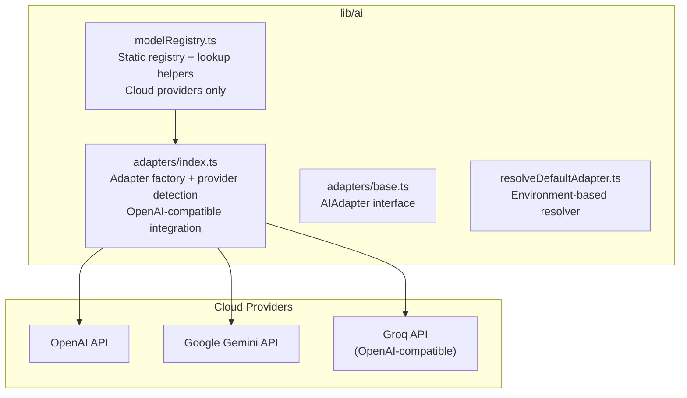
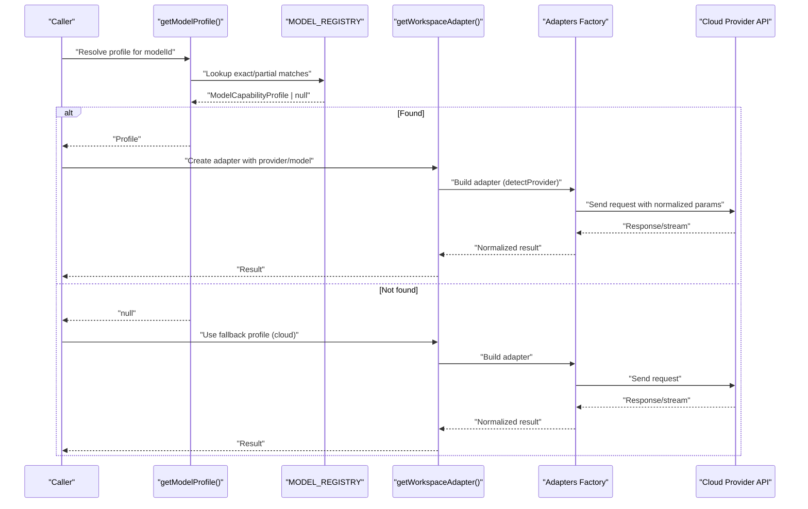
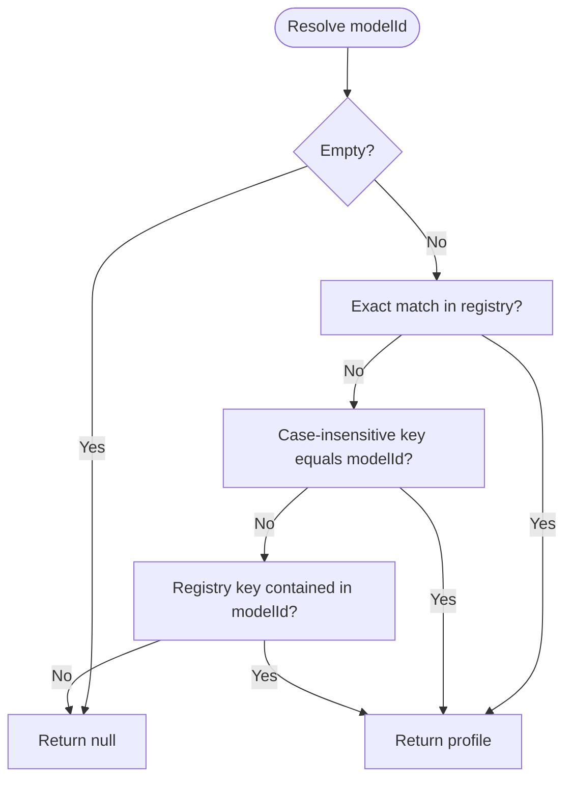
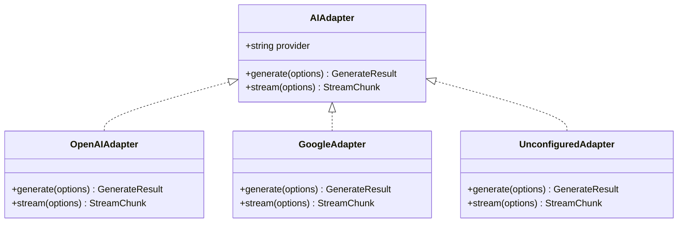
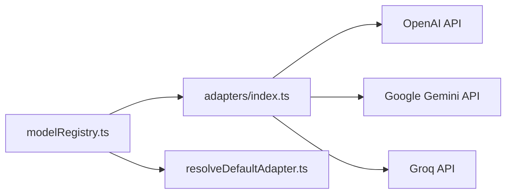

# Model Registry & Profiles

<cite>
**Referenced Files in This Document**
- [modelRegistry.ts](file://lib/ai/modelRegistry.ts)
- [index.ts](file://lib/ai/adapters/index.ts)
- [base.ts](file://lib/ai/adapters/base.ts)
- [resolveDefaultAdapter.ts](file://lib/ai/resolveDefaultAdapter.ts)
- [adaptersIndex.test.ts](file://__tests__/adaptersIndex.test.ts)
</cite>

## Update Summary
**Changes Made**
- Updated registry architecture to reflect simplified cloud-only model support
- Removed references to local Ollama and HuggingFace model support
- Updated provider coverage to focus exclusively on OpenAI, Google Gemini, and Groq
- Revised adapter factory documentation to reflect OpenAI-compatible provider integration
- Updated troubleshooting guidance to remove local model considerations

## Table of Contents
1. [Introduction](#introduction)
2. [Project Structure](#project-structure)
3. [Core Components](#core-components)
4. [Architecture Overview](#architecture-overview)
5. [Detailed Component Analysis](#detailed-component-analysis)
6. [Dependency Analysis](#dependency-analysis)
7. [Performance Considerations](#performance-considerations)
8. [Troubleshooting Guide](#troubleshooting-guide)
9. [Conclusion](#conclusion)

## Introduction
This document describes the Model Registry system that defines all AI model capabilities and behaviors for the engine. The registry now focuses exclusively on cloud providers (OpenAI, Google Gemini, and Groq), dramatically simplifying the system by removing support for local Ollama and HuggingFace models. It explains the ModelCapabilityProfile interface, the five tier classifications, prompt and extraction strategies, and how the static registry integrates with the model resolution and adapter systems.

## Project Structure
The Model Registry lives in a dedicated module alongside the adapter layer that executes requests against cloud providers. The simplified architecture focuses on three major cloud providers with OpenAI-compatible integration for third-party services.

**Diagram sources**
- [modelRegistry.ts:1-467](file://lib/ai/modelRegistry.ts#L1-L467)
- [index.ts:1-282](file://lib/ai/adapters/index.ts#L1-L282)
- [base.ts:1-73](file://lib/ai/adapters/base.ts#L1-L73)
- [resolveDefaultAdapter.ts:1-27](file://lib/ai/resolveDefaultAdapter.ts#L1-L27)

**Section sources**
- [modelRegistry.ts:1-467](file://lib/ai/modelRegistry.ts#L1-L467)
- [index.ts:1-282](file://lib/ai/adapters/index.ts#L1-L282)
- [base.ts:1-73](file://lib/ai/adapters/base.ts#L1-L73)

## Core Components
- **ModelCapabilityProfile**: The canonical capability definition for every cloud model, including id, displayName, provider, tier, capacity, generation behavior flags, pipeline controls, repair policy, and timeout.
- **MODEL_REGISTRY**: Static dictionary keyed by model id/provider aliases, containing all cloud provider profiles.
- **Lookup helpers**:
  - `getModelProfile(modelId)`: Resolves exact/partial matches for cloud models only.
  - `getModelsByTier(tier)`: Enumerates cloud models by tier.
  - `getCloudFallbackProfile()`: Returns a safe default cloud profile.
  - `getFastModelForProvider(provider)`: Heuristically selects a fast/cheap cloud model per provider.

These components enable deterministic, provider-agnostic model selection and pipeline configuration for cloud-based AI services.

**Section sources**
- [modelRegistry.ts:53-112](file://lib/ai/modelRegistry.ts#L53-L112)
- [modelRegistry.ts:116-398](file://lib/ai/modelRegistry.ts#L116-L398)
- [modelRegistry.ts:413-466](file://lib/ai/modelRegistry.ts#L413-L466)

## Architecture Overview
The registry is the single source of truth for cloud model capabilities. The adapter factory uses registry-driven hints to configure generation parameters and streaming behavior. Cloud providers are integrated through standardized interfaces, with Groq supporting OpenAI-compatible APIs.

**Diagram sources**
- [modelRegistry.ts:413-429](file://lib/ai/modelRegistry.ts#L413-L429)
- [index.ts:205-256](file://lib/ai/adapters/index.ts#L205-L256)
- [index.ts:141-184](file://lib/ai/adapters/index.ts#L141-L184)

## Detailed Component Analysis

### ModelCapabilityProfile Interface
The profile defines:
- **Identity**: id, displayName, provider
- **Tier**: ModelTier ('tiny' | 'small' | 'medium' | 'large' | 'cloud')
- **Capacity**: contextWindow, maxOutputTokens
- **Generation behavior**: idealTemperature, supportsSystemPrompt, supportsToolCalls, supportsJsonMode, streamingReliable
- **Known behavior**: strengths[], weaknesses[]
- **Pipeline control**: promptStrategy, maxBlueprintTokens, needsExplicitImports, needsOutputWrapper, extractionStrategy
- **Repair and timeouts**: repairPriority, timeoutMs
- **Notes**: optional provider/model-specific quirks

**Updated** Simplified to focus exclusively on cloud provider capabilities with streamlined tier definitions.

Behavioral characteristics by tier:
- **tiny**: Not currently represented in the simplified registry
- **small**: Not currently represented in the simplified registry  
- **medium**: Not currently represented in the simplified registry
- **large**: Not currently represented in the simplified registry
- **cloud**: API-hosted models with full freeform generation, 0.5–0.7 temperature, 3 tool rounds, generous token budgets

**Section sources**
- [modelRegistry.ts:28-37](file://lib/ai/modelRegistry.ts#L28-L37)
- [modelRegistry.ts:53-112](file://lib/ai/modelRegistry.ts#L53-L112)

### Static Registry and Registration
The registry is a static dictionary of cloud provider profiles keyed by canonical ids and provider aliases. Current cloud provider coverage includes:

**OpenAI Models**:
- gpt-4o-mini: Fast, cheap, excellent for repair tasks
- gpt-4o: Best overall cloud model for UI generation
- o3-mini: Strongest reasoning, very large context
- o1: Advanced multi-step reasoning, slow
- o1-mini: Fast reasoning, cheaper than o1

**Google Gemini Models**:
- gemini-2.0-flash: Fastest cloud model, cheapest, ideal for thinking
- gemini-1.5-pro: Enormous context window (1M tokens), vision/multimodal
- gemini-1.5-flash: Fast and cheap, 1M context window

**Groq Models** (via OpenAI-compatible API):
- llama-3.3-70b-versatile: Fastest 70B model via Groq (< 3s), free tier available
- mixtral-8x7b-32768: Fast MoE inference via Groq, large 32K context, free tier
- gemma2-9b-it: Fast 9B model via Groq, free tier, good instruction following

**Section sources**
- [modelRegistry.ts:116-398](file://lib/ai/modelRegistry.ts#L116-L398)

### Partial Matching and Fallback Mechanisms
Resolution order remains consistent but applies only to cloud models:
1) Exact match by id
2) Partial match: registry key contained in modelId (case-insensitive)
3) Return null if none matched

**Updated** Removed provider-aware fallbacks for local models (Ollama/HF) as they are no longer supported.

Fallback profile:
- `getCloudFallbackProfile()` returns gpt-4o-mini as the most conservative cloud profile when unknown models are encountered.

**Diagram sources**
- [modelRegistry.ts:413-429](file://lib/ai/modelRegistry.ts#L413-L429)

**Section sources**
- [modelRegistry.ts:413-429](file://lib/ai/modelRegistry.ts#L413-L429)

### Integration with Adapter Layer
The adapter factory uses registry hints to configure generation safely for cloud providers:
- **Provider detection**: Prefers explicit provider from configuration; otherwise inferred from model name
- **OpenAI-compatible integration**: Groq models use OpenAI-compatible API endpoints
- **Credential management**: Server-side credential resolution via workspaceKeyService or environment variables
- **Cache integration**: Automatic caching for performance optimization

**Updated** Removed local model adapter support and focused on cloud provider integration.

**Diagram sources**
- [base.ts:50-72](file://lib/ai/adapters/base.ts#L50-L72)
- [index.ts:18-20](file://lib/ai/adapters/index.ts#L18-L20)
- [index.ts:176-180](file://lib/ai/adapters/index.ts#L176-L180)

**Section sources**
- [index.ts:10-12](file://lib/ai/adapters/index.ts#L10-L12)
- [index.ts:48-59](file://lib/ai/adapters/index.ts#L48-L59)
- [index.ts:141-184](file://lib/ai/adapters/index.ts#L141-L184)

### Environment-Based Model Resolution
The system includes environment-based model resolution for different purposes:
- **Priority order**: Groq → Google Gemini → OpenAI (based on capability and cost efficiency)
- **Purpose-specific overrides**: INTENT_MODEL, CLASSIFIER_MODEL, GENERATION_MODEL, THINKING_MODEL, REVIEW_MODEL, REPAIR_MODEL
- **Provider-specific environment variables**: INTENT_PROVIDER, CLASSIFIER_PROVIDER, etc.

**Section sources**
- [resolveDefaultAdapter.ts:1-27](file://lib/ai/resolveDefaultAdapter.ts#L1-L27)

## Dependency Analysis
The registry is consumed by:
- Adapter factory: for provider detection and fallbacks
- Environment resolver: for purpose-specific model selection
- Pipeline: for tier selection, prompt strategy, extraction, and repair

**Updated** Removed dependencies on local model discovery routes and APIs.

**Diagram sources**
- [modelRegistry.ts:413-466](file://lib/ai/modelRegistry.ts#L413-L466)
- [index.ts:141-184](file://lib/ai/adapters/index.ts#L141-L184)
- [resolveDefaultAdapter.ts:17-27](file://lib/ai/resolveDefaultAdapter.ts#L17-L27)

**Section sources**
- [modelRegistry.ts:413-466](file://lib/ai/modelRegistry.ts#L413-L466)
- [index.ts:141-184](file://lib/ai/adapters/index.ts#L141-L184)

## Performance Considerations
- **Cloud-first approach**: All models are API-hosted, eliminating local inference overhead
- **Cost optimization**: Use getFastModelForProvider to select the cheapest/fastest available cloud model per provider
- **Streaming reliability**: All cloud models support reliable streaming with streamingReliable: true
- **Token efficiency**: Conservative contextWindow and maxOutputTokens settings prevent provider errors
- **Caching integration**: Automatic caching reduces latency and costs for repeated requests

**Updated** Removed local model performance considerations and focused on cloud provider optimizations.

## Troubleshooting Guide
Common issues and resolutions for the simplified cloud-only system:
- **Unknown model id**: getModelProfile returns null; use getCloudFallbackProfile() to select gpt-4o-mini as a conservative fallback
- **Missing API credentials**: ConfigurationError thrown for unconfigured providers; ensure proper environment variables are set
- **Streaming failures**: All cloud models support streaming; check network connectivity and API quotas
- **Tool calls rejected**: Verify supportsToolCalls flag; some models may not support tool calling
- **JSON mode not honored**: Some providers do not support response_format; use appropriate provider-specific configuration
- **No local model discovery**: Local Ollama/HuggingFace models are no longer supported; use cloud alternatives

**Updated** Removed troubleshooting guidance for local models and focused on cloud provider issues.

**Section sources**
- [modelRegistry.ts:443-445](file://lib/ai/modelRegistry.ts#L443-L445)
- [index.ts:29-37](file://lib/ai/adapters/index.ts#L29-L37)
- [index.ts:154-157](file://lib/ai/adapters/index.ts#L154-L157)

## Conclusion
The Model Registry provides a centralized, static source of truth for cloud AI model capabilities. The dramatically simplified system now focuses exclusively on three major cloud providers (OpenAI, Google Gemini, Groq), eliminating complexity from local model support. It drives pipeline selection, prompt strategy, extraction, and repair policies while enabling robust partial matching and provider-aware fallbacks. Combined with the adapter factory's OpenAI-compatible integration and server-side credential management, it ensures predictable, provider-agnostic behavior across cloud AI services.