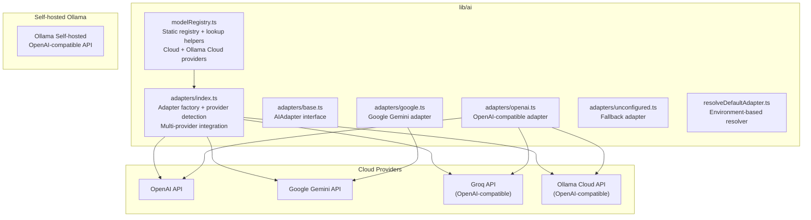
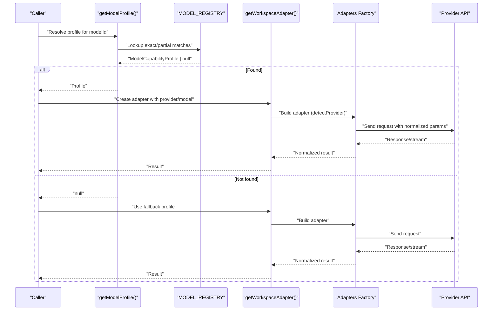
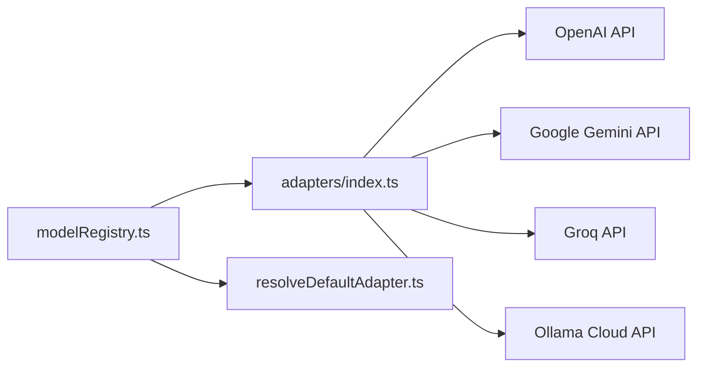

# Model Registry & Profiles

<cite>
**Referenced Files in This Document**
- [modelRegistry.ts](file://lib/ai/modelRegistry.ts)
- [index.ts](file://lib/ai/adapters/index.ts)
- [base.ts](file://lib/ai/adapters/base.ts)
- [openai.ts](file://lib/ai/adapters/openai.ts)
- [google.ts](file://lib/ai/adapters/google.ts)
- [unconfigured.ts](file://lib/ai/adapters/unconfigured.ts)
- [resolveDefaultAdapter.ts](file://lib/ai/resolveDefaultAdapter.ts)
- [route.ts](file://app/api/providers/status/route.ts)
- [adaptersIndex.test.ts](file://__tests__/adaptersIndex.test.ts)
- [adapterIndex.test.ts](file://__tests__/adapterIndex.test.ts)
</cite>

## Update Summary
**Changes Made**
- Migrated from self-hosted Ollama models to Ollama Cloud models with OpenAI-compatible API
- Updated Ollama section to reflect new cloud model profiles: qwen3-coder-next, gemma4:e2b, devstral-small-2, deepseek-v3.2, qwen3.5:9b
- Revised registry architecture to support Ollama Cloud models with cloud-specific capabilities and pricing model
- Updated environment-based model resolution to include Ollama Cloud as a provider option
- Enhanced adapter factory to support Ollama Cloud OpenAI-compatible API integration
- Revised documentation to reflect Ollama Cloud migration from self-hosted deployment

## Table of Contents
1. [Introduction](#introduction)
2. [Project Structure](#project-structure)
3. [Core Components](#core-components)
4. [Architecture Overview](#architecture-overview)
5. [Detailed Component Analysis](#detailed-component-analysis)
6. [Dependency Analysis](#dependency-analysis)
7. [Performance Considerations](#performance-considerations)
8. [Troubleshooting Guide](#troubleshooting-guide)
9. [Conclusion](#conclusion)

## Introduction
This document describes the Model Registry system that defines all AI model capabilities and behaviors for the engine. The registry now supports both cloud providers (OpenAI, Google Gemini, Groq, and Ollama Cloud) and self-hosted Ollama models, providing a comprehensive solution for both API-based and locally-hosted AI inference. It explains the ModelCapabilityProfile interface, the five tier classifications, prompt and extraction strategies, and how the static registry integrates with the model resolution and adapter systems across multiple deployment scenarios.

**Updated** The system has migrated from self-hosted Ollama models to Ollama Cloud models, which are served via the Ollama.com OpenAI-compatible API. This change introduces new cloud-based model profiles with usage-based pricing and improved performance characteristics.

## Project Structure
The Model Registry lives in a dedicated module alongside the adapter layer that executes requests against cloud providers and Ollama Cloud instances. The architecture supports four major cloud providers plus Ollama Cloud for cloud-hosted deployments.

**Diagram sources**
- [modelRegistry.ts:1-586](file://lib/ai/modelRegistry.ts#L1-L586)
- [index.ts:1-296](file://lib/ai/adapters/index.ts#L1-L296)
- [base.ts:1-73](file://lib/ai/adapters/base.ts#L1-L73)
- [openai.ts:1-218](file://lib/ai/adapters/openai.ts#L1-L218)
- [google.ts:1-90](file://lib/ai/adapters/google.ts#L1-L90)
- [unconfigured.ts:1-99](file://lib/ai/adapters/unconfigured.ts#L1-L99)

**Section sources**
- [modelRegistry.ts:1-586](file://lib/ai/modelRegistry.ts#L1-L586)
- [index.ts:1-296](file://lib/ai/adapters/index.ts#L1-L296)
- [base.ts:1-73](file://lib/ai/adapters/base.ts#L1-L73)

## Core Components
- **ModelCapabilityProfile**: The canonical capability definition for every model, including id, displayName, provider, tier, capacity, generation behavior flags, pipeline controls, repair policy, and timeout.
- **MODEL_REGISTRY**: Static dictionary keyed by model id/provider aliases, containing cloud provider profiles and Ollama Cloud models.
- **Lookup helpers**:
  - `getModelProfile(modelId)`: Resolves exact/partial matches for cloud and Ollama Cloud models.
  - `getModelsByTier(tier)`: Enumerates models by tier across all providers.
  - `getCloudFallbackProfile()`: Returns a safe default cloud profile.
  - `getFastModelForProvider(provider)`: Heuristically selects a fast/cheap model per provider.

These components enable deterministic, provider-agnostic model selection and pipeline configuration across cloud and cloud-hosted deployment scenarios.

**Section sources**
- [modelRegistry.ts:53-112](file://lib/ai/modelRegistry.ts#L53-L112)
- [modelRegistry.ts:116-517](file://lib/ai/modelRegistry.ts#L116-L517)
- [modelRegistry.ts:521-586](file://lib/ai/modelRegistry.ts#L521-L586)

## Architecture Overview
The registry is the single source of truth for all model capabilities across cloud and cloud-hosted deployments. The adapter factory uses registry-driven hints to configure generation parameters and streaming behavior. Providers are integrated through standardized interfaces, with Ollama Cloud supporting OpenAI-compatible APIs for seamless integration.

**Diagram sources**
- [modelRegistry.ts:521-548](file://lib/ai/modelRegistry.ts#L521-L548)
- [index.ts:217-269](file://lib/ai/adapters/index.ts#L217-L269)
- [index.ts:146-196](file://lib/ai/adapters/index.ts#L146-L196)

## Detailed Component Analysis

### ModelCapabilityProfile Interface
The profile defines:
- **Identity**: id, displayName, provider
- **Tier**: ModelTier ('tiny' | 'small' | 'medium' | 'large' | 'cloud')
- **Capacity**: contextWindow, maxOutputTokens
- **Generation behavior**: idealTemperature, supportsSystemPrompt, supportsToolCalls, supportsJsonMode, streamingReliable
- **Known behavior**: strengths[], weaknesses[]
- **Pipeline control**: promptStrategy, maxBlueprintTokens, needsExplicitImports, needsOutputWrapper, extractionStrategy
- **Repair and timeouts**: repairPriority, timeoutMs
- **Notes**: optional provider/model-specific quirks

Behavioral characteristics by tier:
- **tiny**: Very small models (≤3B params) with fill-in-blank templates, temp 0.0, no tool calls
- **small**: Small models (3B–9B) with structured templates, temp 0.1–0.2, rules-only repair
- **medium**: Medium models (10B–34B) with guided freeform, temp 0.2–0.4, 1 tool round
- **large**: Large models (35B–70B) with light guidance, temp 0.3–0.5, 2 tool rounds
- **cloud**: API-hosted models with full freeform generation, temp 0.5–0.7, 3 tool rounds

**Section sources**
- [modelRegistry.ts:28-37](file://lib/ai/modelRegistry.ts#L28-L37)
- [modelRegistry.ts:53-112](file://lib/ai/modelRegistry.ts#L53-L112)

### Static Registry and Registration
The registry is a static dictionary of profiles keyed by canonical ids and provider aliases, supporting both cloud providers and Ollama Cloud models. Current coverage includes:

**Cloud Provider Models**:
- **OpenAI**: gpt-4o-mini, gpt-4o, o3-mini, o1, o1-mini
- **Google Gemini**: gemini-2.0-flash, gemini-1.5-pro, gemini-1.5-flash
- **Groq**: llama-3.3-70b-versatile, mixtral-8x7b-32768, gemma2-9b-it

**Ollama Cloud Models** (Updated):
- **qwen3-coder-next**: Best coding model on Ollama Cloud, 80B agentic coding, large context, tool support
- **gemma4:e2b**: Fast and cheap 2B model, good for classify/think, frontier quality at 2B
- **devstral-small-2**: Agentic coding, multi-file editing, 24B parameter model
- **deepseek-v3.2**: Strong reasoning, agentic capabilities, 3.2B parameter model
- **qwen3.5:9b**: Multimodal, good balance of speed and quality, 9B parameter model

Each Ollama Cloud model includes detailed capability profiles with context windows, output token limits, and strength/weakness analysis. These models are served via the Ollama.com OpenAI-compatible API with usage-based pricing.

**Section sources**
- [modelRegistry.ts:116-517](file://lib/ai/modelRegistry.ts#L116-L517)

### Ollama Cloud Model Profiles Analysis

#### Qwen3 Coder Next (Ollama Cloud)
- **Tier**: cloud
- **Context Window**: 131,072 tokens
- **Output Tokens**: 8,192
- **Strengths**: Best coding model on Ollama Cloud, 80B agentic coding, large context, tool support
- **Weaknesses**: Higher latency than local models, usage-based pricing
- **Prompt Strategy**: guided-freeform
- **Extraction**: fence
- **Repair Priority**: ai-cheap
- **Pricing Model**: Usage-based (cloud-specific)

#### Gemma 4 2B (Ollama Cloud)
- **Tier**: cloud
- **Context Window**: 32,768 tokens
- **Output Tokens**: 4,096
- **Strengths**: Fast and cheap, good for classify/think, frontier quality at 2B, tool support
- **Weaknesses**: Small model — weaker code generation, may truncate long output
- **Prompt Strategy**: guided-freeform
- **Extraction**: fence
- **Repair Priority**: rules-only
- **Pricing Model**: Usage-based (cloud-specific)

#### Devstral Small 2 (Ollama Cloud)
- **Tier**: cloud
- **Context Window**: 131,072 tokens
- **Output Tokens**: 8,192
- **Strengths**: Agentic coding, multi-file editing, large context, tool support
- **Weaknesses**: Usage-based pricing, may over-engineer simple components
- **Prompt Strategy**: guided-freeform
- **Extraction**: fence
- **Repair Priority**: ai-cheap
- **Pricing Model**: Usage-based (cloud-specific)

#### DeepSeek V3.2 (Ollama Cloud)
- **Tier**: cloud
- **Context Window**: 131,072 tokens
- **Output Tokens**: 8,192
- **Strengths**: Strong reasoning, agentic capabilities, large context, tool support
- **Weaknesses**: Usage-based pricing, slower inference on complex prompts
- **Prompt Strategy**: guided-freeform
- **Extraction**: fence
- **Repair Priority**: ai-cheap
- **Pricing Model**: Usage-based (cloud-specific)

#### Qwen 3.5 9B (Ollama Cloud)
- **Tier**: cloud
- **Context Window**: 131,072 tokens
- **Output Tokens**: 4,096
- **Strengths**: Multimodal, good balance of speed and quality, tool support, large context
- **Weaknesses**: Weaker than dedicated coding models, usage-based pricing
- **Prompt Strategy**: guided-freeform
- **Extraction**: fence
- **Repair Priority**: rules-only
- **Pricing Model**: Usage-based (cloud-specific)

**Section sources**
- [modelRegistry.ts:403-516](file://lib/ai/modelRegistry.ts#L403-L516)

### Partial Matching and Fallback Mechanisms
Resolution order applies to both cloud and Ollama Cloud models:
1) Exact match by id
2) Partial match: registry key contained in modelId (case-insensitive)
3) Return null if none matched

Fallback profile:
- `getCloudFallbackProfile()` returns gpt-4o-mini as the most conservative cloud profile when unknown models are encountered.

**Diagram sources**
- [modelRegistry.ts:521-548](file://lib/ai/modelRegistry.ts#L521-L548)

**Section sources**
- [modelRegistry.ts:521-548](file://lib/ai/modelRegistry.ts#L521-L548)

### Integration with Adapter Layer
The adapter factory uses registry hints to configure generation safely across all providers:
- **Provider detection**: Prefers explicit provider from configuration; otherwise inferred from model name
- **OpenAI-compatible integration**: Groq, Ollama Cloud, and Ollama models use OpenAI-compatible API endpoints
- **Credential management**: Server-side credential resolution via workspaceKeyService or environment variables
- **Cache integration**: Automatic caching for performance optimization

**Updated** Ollama Cloud models are now integrated through the OpenAI-compatible API at `https://ollama.com/v1`, replacing the previous self-hosted Ollama integration.

**Section sources**
- [index.ts:47-64](file://lib/ai/adapters/index.ts#L47-L64)
- [index.ts:146-196](file://lib/ai/adapters/index.ts#L146-L196)
- [base.ts:50-72](file://lib/ai/adapters/base.ts#L50-L72)

### Environment-Based Model Resolution
The system includes environment-based model resolution for different purposes across all providers:
- **Priority order**: Groq → Ollama Cloud → Google Gemini → OpenAI (based on capability and cost efficiency)
- **Purpose-specific overrides**: INTENT_MODEL, CLASSIFIER_MODEL, GENERATION_MODEL, THINKING_MODEL, REVIEW_MODEL, REPAIR_MODEL
- **Provider-specific environment variables**: INTENT_PROVIDER, CLASSIFIER_PROVIDER, etc.
- **Ollama Cloud support**: OLLAMA_API_KEY for cloud model access via OpenAI-compatible API

**Updated** Ollama Cloud models are now included in the PURPOSE_DEFAULTS with appropriate model recommendations for each pipeline stage.

**Section sources**
- [resolveDefaultAdapter.ts:75-127](file://lib/ai/resolveDefaultAdapter.ts#L75-L127)
- [resolveDefaultAdapter.ts:29-36](file://lib/ai/resolveDefaultAdapter.ts#L29-L36)

## Dependency Analysis
The registry is consumed by:
- Adapter factory: for provider detection and fallbacks
- Environment resolver: for purpose-specific model selection
- Pipeline: for tier selection, prompt strategy, extraction, and repair

**Diagram sources**
- [modelRegistry.ts:521-586](file://lib/ai/modelRegistry.ts#L521-L586)
- [index.ts:146-196](file://lib/ai/adapters/index.ts#L146-L196)
- [resolveDefaultAdapter.ts:105-117](file://lib/ai/resolveDefaultAdapter.ts#L105-L117)

**Section sources**
- [modelRegistry.ts:521-586](file://lib/ai/modelRegistry.ts#L521-L586)
- [index.ts:146-196](file://lib/ai/adapters/index.ts#L146-L196)

## Performance Considerations
- **Multi-provider approach**: Supports both cloud API hosting and cloud-hosted Ollama deployments for flexibility
- **Cost optimization**: Use getFastModelForProvider to select the cheapest/fastest available model per provider
- **Streaming reliability**: All models support reliable streaming with streamingReliable: true
- **Token efficiency**: Conservative contextWindow and maxOutputTokens settings prevent provider errors
- **Caching integration**: Automatic caching reduces latency and costs for repeated requests
- **Cloud deployment benefits**: Ollama Cloud models eliminate local infrastructure requirements and provide managed scaling

**Updated** Ollama Cloud models offer improved performance characteristics compared to self-hosted deployments, with managed infrastructure and optimized routing.

**Section sources**
- [modelRegistry.ts:570-585](file://lib/ai/modelRegistry.ts#L570-L585)
- [index.ts:82-138](file://lib/ai/adapters/index.ts#L82-L138)

## Troubleshooting Guide
Common issues and resolutions for the multi-provider system:

**Cloud Provider Issues**:
- **Unknown model id**: getModelProfile returns null; use getCloudFallbackProfile() to select gpt-4o-mini as a conservative fallback
- **Missing API credentials**: ConfigurationError thrown for unconfigured providers; ensure proper environment variables are set
- **Streaming failures**: All cloud models support streaming; check network connectivity and API quotas

**Ollama Cloud Issues** (Updated):
- **Ollama Cloud connection failures**: Verify OLLAMA_API_KEY environment variable contains a valid Ollama Cloud API key
- **Model availability**: Ensure requested Ollama Cloud model is available in the Ollama.com catalog
- **Usage-based pricing**: Monitor API usage as Ollama Cloud models use per-request billing
- **Performance concerns**: Cloud models may have different latency characteristics than self-hosted alternatives; adjust contextWindow and maxOutputTokens accordingly

**Provider-specific issues**:
- **Tool calls rejected**: Verify supportsToolCalls flag; some models may not support tool calling
- **JSON mode not honored**: Some providers do not support response_format; use appropriate provider-specific configuration
- **Model detection failures**: Provider detection checks for specific patterns; ensure model names follow expected conventions

**Section sources**
- [modelRegistry.ts:562](file://lib/ai/modelRegistry.ts#L562)
- [index.ts:29-37](file://lib/ai/adapters/index.ts#L29-L37)
- [index.ts:151-156](file://lib/ai/adapters/index.ts#L151-L156)
- [resolveDefaultAdapter.ts:133-146](file://lib/ai/resolveDefaultAdapter.ts#L133-L146)

## Conclusion
The Model Registry provides a centralized, static source of truth for AI model capabilities across cloud and cloud-hosted deployment scenarios. The expanded system now supports four major cloud providers (OpenAI, Google Gemini, Groq, Ollama Cloud) plus comprehensive Ollama model integration for cloud-hosted deployments. The recent migration to Ollama Cloud models leverages the Ollama.com OpenAI-compatible API, providing improved performance, managed infrastructure, and usage-based pricing. It drives pipeline selection, prompt strategy, extraction, and repair policies while enabling robust partial matching and provider-aware fallbacks. Combined with the adapter factory's OpenAI-compatible integration and server-side credential management, it ensures predictable, provider-agnostic behavior across diverse AI service architectures, from fully cloud-based to hybrid cloud-local solutions.