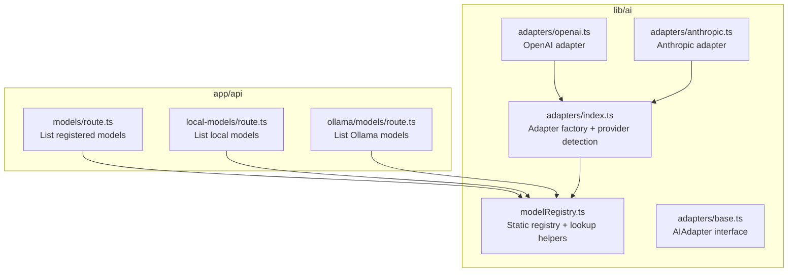
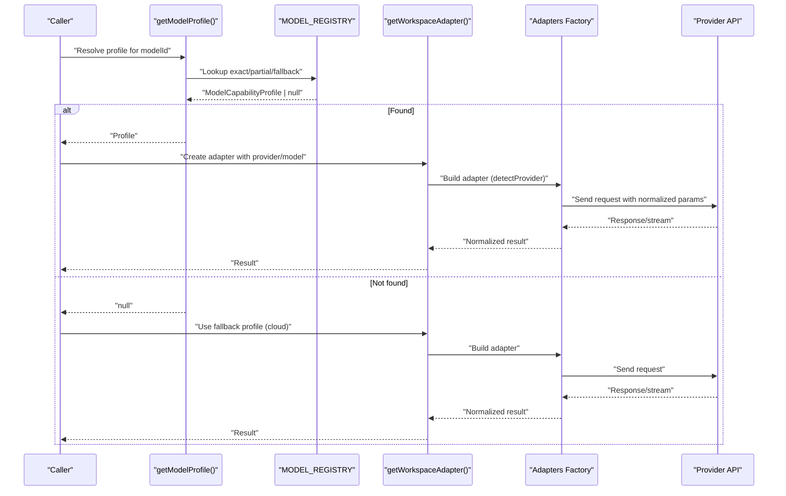
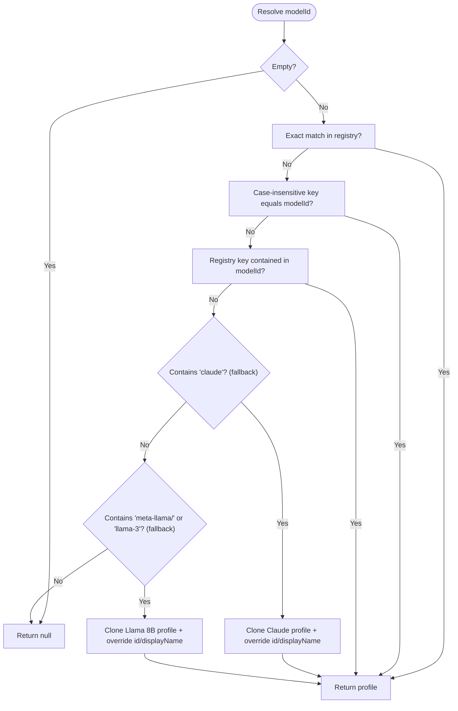
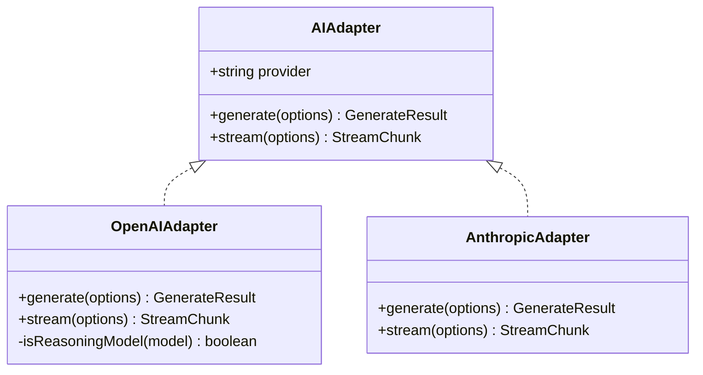
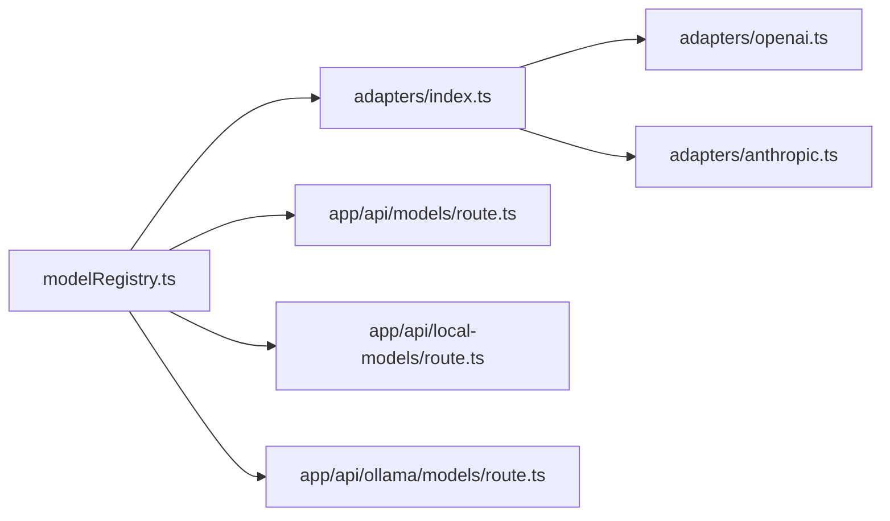

# Model Registry & Profiles

<cite>
**Referenced Files in This Document**
- [modelRegistry.ts](file://lib/ai/modelRegistry.ts)
- [index.ts](file://lib/ai/adapters/index.ts)
- [base.ts](file://lib/ai/adapters/base.ts)
- [openai.ts](file://lib/ai/adapters/openai.ts)
- [anthropic.ts](file://lib/ai/adapters/anthropic.ts)
- [route.ts](file://app/api/models/route.ts)
- [route.ts](file://app/api/local-models/route.ts)
- [route.ts](file://app/api/ollama/models/route.ts)
</cite>

## Table of Contents
1. [Introduction](#introduction)
2. [Project Structure](#project-structure)
3. [Core Components](#core-components)
4. [Architecture Overview](#architecture-overview)
5. [Detailed Component Analysis](#detailed-component-analysis)
6. [Dependency Analysis](#dependency-analysis)
7. [Performance Considerations](#performance-considerations)
8. [Troubleshooting Guide](#troubleshooting-guide)
9. [Conclusion](#conclusion)

## Introduction
This document describes the Model Registry system that defines all AI model capabilities and behaviors for the engine. It explains the ModelCapabilityProfile interface, the five tier classifications, prompt and extraction strategies, and how the static registry integrates with the model resolution and adapter systems. It also covers registration of new models, partial matching, and fallback mechanisms.

## Project Structure
The Model Registry lives in a dedicated module alongside the adapter layer that executes requests against providers. API routes expose model lists and local model discovery, which feed into the resolver.

**Diagram sources**
- [modelRegistry.ts:1033-1138](file://lib/ai/modelRegistry.ts#L1033-L1138)
- [index.ts:140-278](file://lib/ai/adapters/index.ts#L140-L278)
- [base.ts:50-72](file://lib/ai/adapters/base.ts#L50-L72)
- [openai.ts:36-223](file://lib/ai/adapters/openai.ts#L36-L223)
- [anthropic.ts:71-210](file://lib/ai/adapters/anthropic.ts#L71-L210)
- [route.ts](file://app/api/models/route.ts)
- [route.ts](file://app/api/local-models/route.ts)
- [route.ts](file://app/api/ollama/models/route.ts)

**Section sources**
- [modelRegistry.ts:1-1138](file://lib/ai/modelRegistry.ts#L1-L1138)
- [index.ts:1-306](file://lib/ai/adapters/index.ts#L1-L306)
- [base.ts:1-73](file://lib/ai/adapters/base.ts#L1-L73)

## Core Components
- ModelCapabilityProfile: The canonical capability definition for every model, including id, displayName, provider, tier, capacity, generation behavior flags, pipeline controls, repair policy, and timeout.
- MODEL_REGISTRY: Static dictionary keyed by model id/provider aliases, containing all profiles.
- Lookup helpers:
  - getModelProfile(modelId): Resolves exact/partial matches and provider-aware fallbacks.
  - getModelsByTier(tier): Enumerates models by tier.
  - getCloudFallbackProfile(): Returns a safe default cloud profile.
  - getFastModelForProvider(provider): Heuristically selects a fast/cheap model per provider.

These components enable deterministic, provider-agnostic model selection and pipeline configuration.

**Section sources**
- [modelRegistry.ts:69-128](file://lib/ai/modelRegistry.ts#L69-L128)
- [modelRegistry.ts:132-1031](file://lib/ai/modelRegistry.ts#L132-L1031)
- [modelRegistry.ts:1035-1138](file://lib/ai/modelRegistry.ts#L1035-L1138)

## Architecture Overview
The registry is the single source of truth for model capabilities. The adapter factory uses registry-driven hints to configure generation parameters and streaming behavior. Provider-specific adapters normalize differences (e.g., reasoning models, JSON mode, tool schemas).

**Diagram sources**
- [modelRegistry.ts:1046-1085](file://lib/ai/modelRegistry.ts#L1046-L1085)
- [index.ts:56-64](file://lib/ai/adapters/index.ts#L56-L64)
- [index.ts:146-215](file://lib/ai/adapters/index.ts#L146-L215)

## Detailed Component Analysis

### ModelCapabilityProfile Interface
The profile defines:
- Identity: id, displayName, provider
- Tier: ModelTier ('tiny' | 'small' | 'medium' | 'large' | 'cloud')
- Capacity: contextWindow, maxOutputTokens
- Generation behavior: idealTemperature, supportsSystemPrompt, supportsToolCalls, supportsJsonMode, streamingReliable
- Known behavior: strengths[], weaknesses[]
- Pipeline control: promptStrategy, maxBlueprintTokens, needsExplicitImports, needsOutputWrapper, extractionStrategy
- Repair and timeouts: repairPriority, timeoutMs
- Notes: optional provider/model-specific quirks

Behavioral characteristics by tier:
- tiny (< 3B): fill-in-blank templates, temperature 0.0, no tool calls, constrained blueprint (~300 tokens), reliability-focused extraction.
- small (3B–9B): structured templates, temperature 0.1–0.2, rules-only repair, moderate blueprint (500–1200 tokens).
- medium (10B–34B): guided freeform, temperature 0.2–0.4, 1 tool round, larger blueprint (1500–2500 tokens).
- large (35B–70B): light guidance, temperature 0.3–0.5, 2 tool rounds, substantial blueprint (3000–5000 tokens).
- cloud (API-hosted): full freeform, temperature 0.5–0.7, 3 tool rounds, generous blueprint (6000–12000+ tokens).

Prompt strategies:
- fill-in-blank: minimal freedom, strong templating.
- structured-template: numbered steps with blueprint.
- guided-freeform: style + rules with some freedom.
- freeform: full system prompt, unrestricted.

Extraction strategies:
- fence: robust fenced code extraction.
- heuristic: pattern-based extraction for verbose models.
- aggressive: preambles stripped, targeted for tiny models.

Repair priorities:
- never, rules-only, ai-cheap, ai-strong.

**Section sources**
- [modelRegistry.ts:27-66](file://lib/ai/modelRegistry.ts#L27-L66)
- [modelRegistry.ts:69-128](file://lib/ai/modelRegistry.ts#L69-L128)

### Static Registry and Registration
The registry is a static dictionary of profiles keyed by canonical ids and provider aliases. Examples include:
- Tiny: tinyllama, phi, gemma:2b
- Small: phi3, phi4, gemma:7b, llama3.2, mistral:7b, deepseek-coder:6.7b, codegemma:7b, meta-llama variants
- Medium: llama3.1, deepseek-coder:33b, mistral:22b
- Large: llama3:70b, deepseek-r1:70b
- Cloud: gpt-4o-mini, gpt-4o, o1/o3 variants, claude series, gemini, deepseek-chat, groq, mistral-large-latest

Registration checklist for a new model:
- Choose a canonical id (lowercase, stable).
- Set provider ('openai' | 'anthropic' | 'google' | 'groq' | 'mistral' | 'deepseek' | 'ollama' | 'lmstudio').
- Assign tier based on parameter count and known behavior.
- Define contextWindow and maxOutputTokens conservatively.
- Set idealTemperature and capability flags (supportsSystemPrompt, supportsToolCalls, supportsJsonMode, streamingReliable).
- Describe strengths/weaknesses for the pipeline.
- Select promptStrategy and maxBlueprintTokens appropriate for the tier.
- Decide needsExplicitImports, needsOutputWrapper, extractionStrategy.
- Choose repairPriority and timeoutMs.
- Add notes for provider quirks if applicable.

**Section sources**
- [modelRegistry.ts:132-1031](file://lib/ai/modelRegistry.ts#L132-L1031)

### Partial Matching and Fallback Mechanisms
Resolution order:
1) Exact match by id.
2) Partial match: registry key contained in modelId (case-insensitive).
3) Partial match: registry key is contained within modelId (case-insensitive).
4) Provider-aware fallbacks:
   - For unregistered 'claude*' models, clone the closest Claude profile and override id/displayName.
   - For unregistered 'meta-llama/*' or 'llama-3' models, clone the registered Llama 8B profile and override id/displayName.
5) Return null if none matched.

Fallback profile:
- getCloudFallbackProfile() returns a conservative cloud profile (e.g., gpt-4o-mini) when unknown models are encountered.

**Diagram sources**
- [modelRegistry.ts:1046-1085](file://lib/ai/modelRegistry.ts#L1046-L1085)

**Section sources**
- [modelRegistry.ts:1046-1085](file://lib/ai/modelRegistry.ts#L1046-L1085)

### Integration with Adapter Layer
The adapter factory uses registry hints to configure generation safely:
- Provider detection prefers explicit provider from configuration; otherwise inferred from model name.
- OpenAI adapter:
  - Handles reasoning models (o1/o3) by omitting temperature/max_tokens and using max_completion_tokens.
  - Skips response_format/tools/tool_choice for providers/aggregators/reasoning/HuggingFace where unsupported.
- Anthropic adapter:
  - Uses native /v1/messages API; no response_format; respects per-model output caps.

**Diagram sources**
- [base.ts:50-72](file://lib/ai/adapters/base.ts#L50-L72)
- [openai.ts:36-223](file://lib/ai/adapters/openai.ts#L36-L223)
- [anthropic.ts:71-210](file://lib/ai/adapters/anthropic.ts#L71-L210)

**Section sources**
- [index.ts:56-64](file://lib/ai/adapters/index.ts#L56-L64)
- [openai.ts:30-32](file://lib/ai/adapters/openai.ts#L30-L32)
- [openai.ts:99-111](file://lib/ai/adapters/openai.ts#L99-L111)
- [openai.ts:113-126](file://lib/ai/adapters/openai.ts#L113-L126)
- [anthropic.ts:95-108](file://lib/ai/adapters/anthropic.ts#L95-L108)

### API Routes and Model Discovery
- app/api/models/route.ts: Lists registered models from the registry.
- app/api/local-models/route.ts: Lists local models (e.g., Ollama).
- app/api/ollama/models/route.ts: Lists Ollama models.

These routes rely on the registry for capability hints and on the adapter factory for runtime configuration.

**Section sources**
- [route.ts](file://app/api/models/route.ts)
- [route.ts](file://app/api/local-models/route.ts)
- [route.ts](file://app/api/ollama/models/route.ts)

## Dependency Analysis
The registry is consumed by:
- Adapter factory: for provider detection and fallbacks.
- API routes: for listing and discovery.
- Pipeline: for tier selection, prompt strategy, extraction, and repair.

**Diagram sources**
- [modelRegistry.ts:1033-1138](file://lib/ai/modelRegistry.ts#L1033-L1138)
- [index.ts:140-278](file://lib/ai/adapters/index.ts#L140-L278)
- [openai.ts:36-223](file://lib/ai/adapters/openai.ts#L36-L223)
- [anthropic.ts:71-210](file://lib/ai/adapters/anthropic.ts#L71-L210)
- [route.ts](file://app/api/models/route.ts)
- [route.ts](file://app/api/local-models/route.ts)
- [route.ts](file://app/api/ollama/models/route.ts)

**Section sources**
- [modelRegistry.ts:1033-1138](file://lib/ai/modelRegistry.ts#L1033-L1138)
- [index.ts:140-278](file://lib/ai/adapters/index.ts#L140-L278)

## Performance Considerations
- Prefer smaller tiers for constrained contexts to reduce token usage and latency.
- Use streamingReliable to decide between streaming and non-streaming generation paths.
- Cap maxOutputTokens conservatively to avoid provider errors (e.g., HuggingFace strict total context limits).
- Choose extraction strategies aligned with model output patterns to minimize post-processing overhead.
- Use getFastModelForProvider to select the cheapest/fastest available model per provider for background tasks.

[No sources needed since this section provides general guidance]

## Troubleshooting Guide
Common issues and resolutions:
- Unknown model id: getModelProfile returns null; callers must fall back to a sensible default tier (cloud). Use getCloudFallbackProfile() to select a conservative fallback.
- Streaming failures: Check streamingReliable; if false, prefer non-streaming generation.
- Tool calls rejected: Verify supportsToolCalls and provider compatibility; some adapters skip tools for certain providers or models.
- JSON mode not honored: Some providers do not support response_format; append explicit JSON instructions to system prompt when needed.
- HuggingFace context overflow: Registered HF models already have safe caps; unregistered ones are capped at 4096 tokens by the adapter as a safety net.

**Section sources**
- [modelRegistry.ts:1046-1085](file://lib/ai/modelRegistry.ts#L1046-L1085)
- [openai.ts:99-111](file://lib/ai/adapters/openai.ts#L99-L111)
- [openai.ts:119-121](file://lib/ai/adapters/openai.ts#L119-L121)
- [anthropic.ts:95-98](file://lib/ai/adapters/anthropic.ts#L95-L98)

## Conclusion
The Model Registry provides a centralized, static source of truth for model capabilities. It drives pipeline selection, prompt strategy, extraction, and repair policies, while enabling robust partial matching and provider-aware fallbacks. Combined with the adapter factory’s normalization, it ensures predictable, provider-agnostic behavior across diverse model ecosystems.