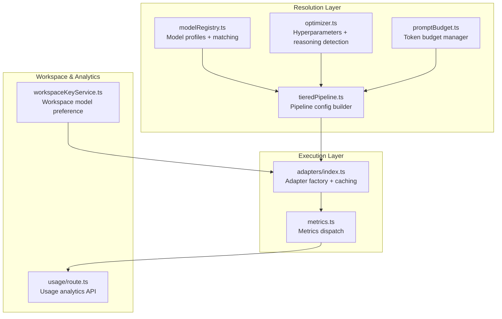
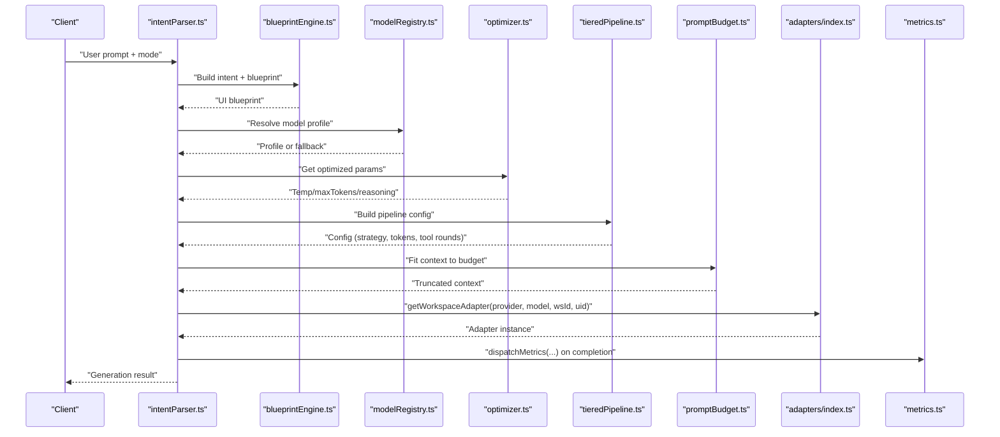
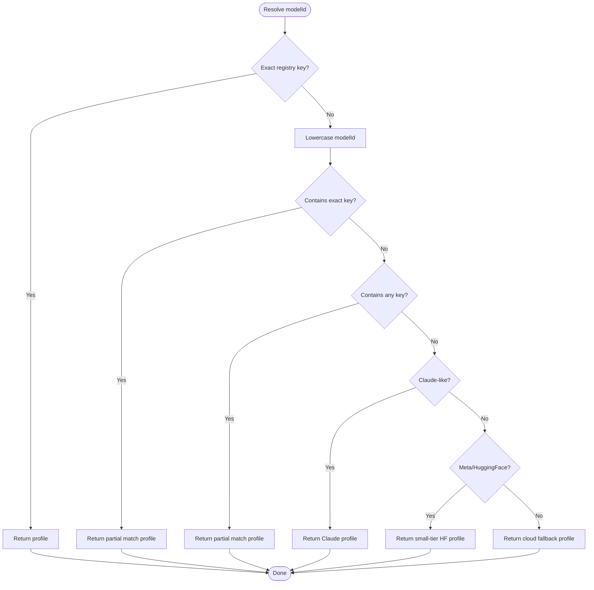
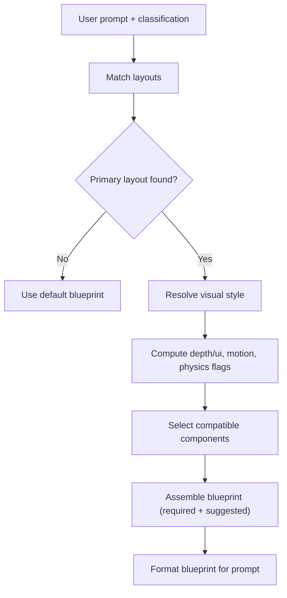
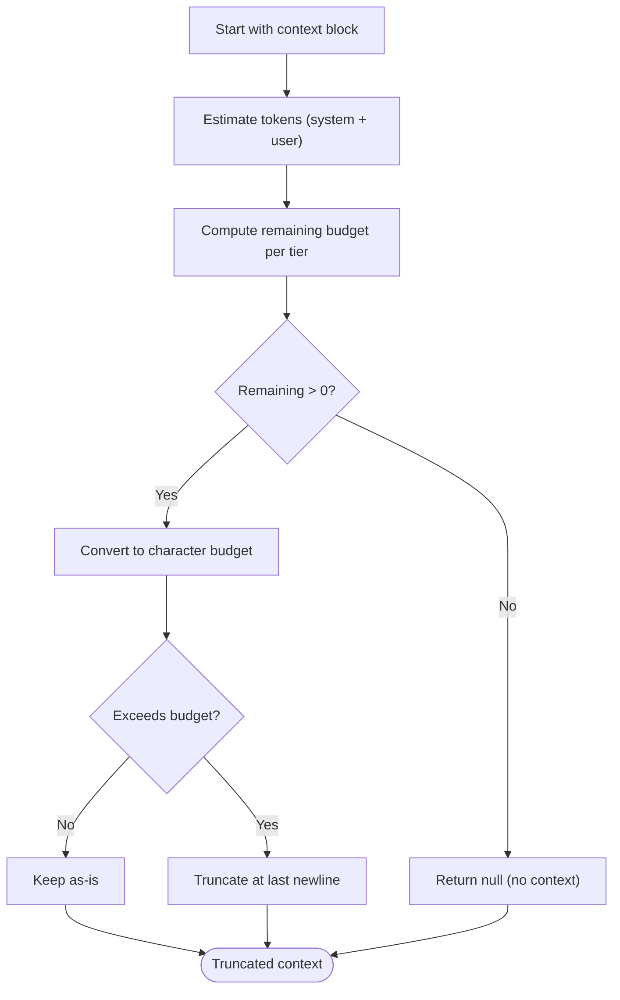
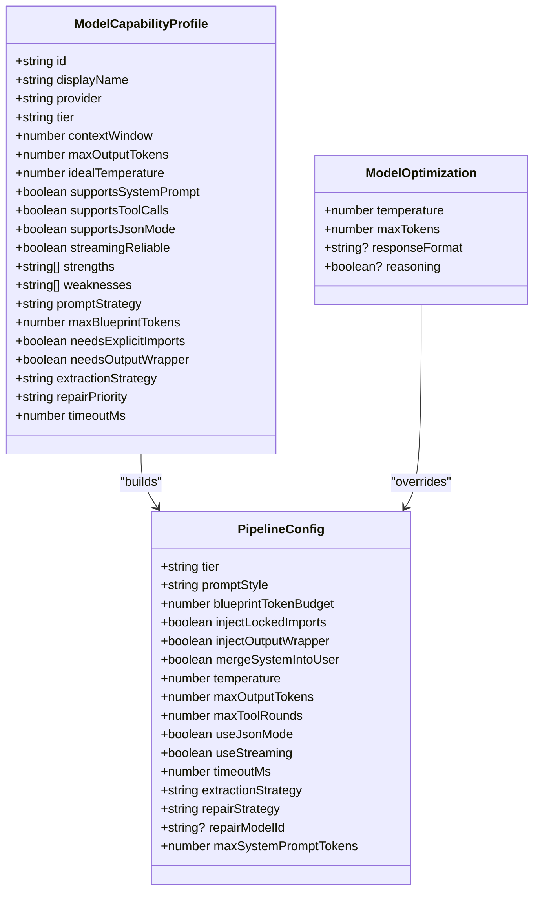
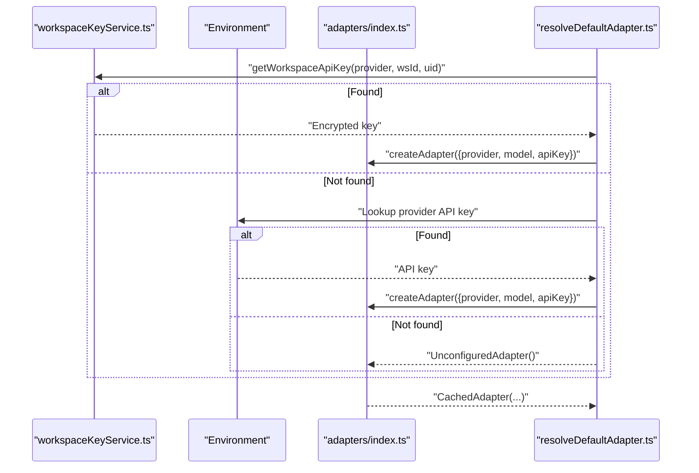
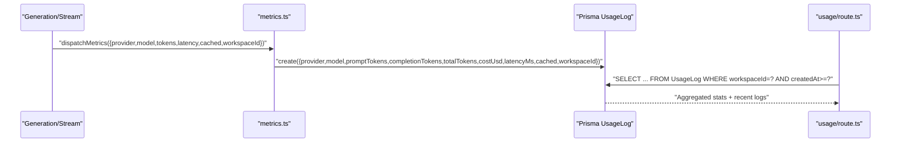
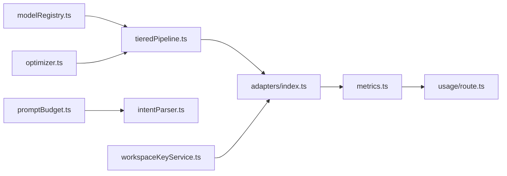

# Model Resolution Algorithms

<cite>
**Referenced Files in This Document**
- [modelRegistry.ts](file://lib/ai/modelRegistry.ts)
- [optimizer.ts](file://lib/ai/optimizer.ts)
- [tieredPipeline.ts](file://lib/ai/tieredPipeline.ts)
- [promptBudget.ts](file://lib/ai/promptBudget.ts)
- [resolveDefaultAdapter.ts](file://lib/ai/resolveDefaultAdapter.ts)
- [adapters/index.ts](file://lib/ai/adapters/index.ts)
- [metrics.ts](file://lib/ai/metrics.ts)
- [usage/route.ts](file://app/api/usage/route.ts)
- [workspaceKeyService.ts](file://lib/security/workspaceKeyService.ts)
- [schemas.ts](file://lib/validation/schemas.ts)
- [blueprintEngine.ts](file://lib/intelligence/blueprintEngine.ts)
- [intentParser.ts](file://lib/ai/intentParser.ts)
- [route.ts](file://app/api/parse/route.ts)
</cite>

## Table of Contents
1. [Introduction](#introduction)
2. [Project Structure](#project-structure)
3. [Core Components](#core-components)
4. [Architecture Overview](#architecture-overview)
5. [Detailed Component Analysis](#detailed-component-analysis)
6. [Dependency Analysis](#dependency-analysis)
7. [Performance Considerations](#performance-considerations)
8. [Troubleshooting Guide](#troubleshooting-guide)
9. [Conclusion](#conclusion)
10. [Appendices](#appendices)

## Introduction
This document explains the model resolution algorithms that automatically select appropriate models based on intent complexity, workspace constraints, and resource availability. It covers:
- Model matching logic (exact and partial matches)
- Fallback hierarchies for unknown models
- Intent complexity scoring and blueprint-driven selection
- Workspace integration and usage analytics
- Cost/performance optimization and token budgeting
- Decision trees, priority ordering, and conflict resolution strategies
- Examples for customizing resolution rules and handling unavailability

## Project Structure
The model resolution pipeline spans several modules:
- Model metadata registry and matching
- Optimization parameters and reasoning model detection
- Tiered pipeline configuration derived from profiles
- Prompt budgeting and token safety
- Adapter selection and credential resolution
- Metrics collection and usage analytics
- Workspace settings integration for model preferences

**Diagram sources**
- [modelRegistry.ts:1-1138](file://lib/ai/modelRegistry.ts#L1-L1138)
- [optimizer.ts:1-95](file://lib/ai/optimizer.ts#L1-L95)
- [tieredPipeline.ts:1-285](file://lib/ai/tieredPipeline.ts#L1-L285)
- [promptBudget.ts:1-79](file://lib/ai/promptBudget.ts#L1-L79)
- [adapters/index.ts:1-306](file://lib/ai/adapters/index.ts#L1-L306)
- [metrics.ts:1-89](file://lib/ai/metrics.ts#L1-L89)
- [workspaceKeyService.ts:97-137](file://lib/security/workspaceKeyService.ts#L97-L137)
- [usage/route.ts:1-110](file://app/api/usage/route.ts#L1-L110)

**Section sources**
- [modelRegistry.ts:1-1138](file://lib/ai/modelRegistry.ts#L1-L1138)
- [optimizer.ts:1-95](file://lib/ai/optimizer.ts#L1-L95)
- [tieredPipeline.ts:1-285](file://lib/ai/tieredPipeline.ts#L1-L285)
- [promptBudget.ts:1-79](file://lib/ai/promptBudget.ts#L1-L79)
- [adapters/index.ts:1-306](file://lib/ai/adapters/index.ts#L1-L306)
- [metrics.ts:1-89](file://lib/ai/metrics.ts#L1-L89)
- [workspaceKeyService.ts:97-137](file://lib/security/workspaceKeyService.ts#L97-L137)
- [usage/route.ts:1-110](file://app/api/usage/route.ts#L1-L110)

## Core Components
- Model Registry: Defines capability profiles, matching rules, and fallbacks for unknown models.
- Optimizer: Provides model-specific hyperparameters and reasoning model detection.
- Tiered Pipeline: Translates profiles into concrete generation configs (temperature, token budgets, tool rounds, streaming, timeouts).
- Prompt Budget: Safeguards against context overflow by truncating context blocks to per-tier budgets.
- Adapter Factory: Selects provider adapters based on credentials and environment/workspace settings.
- Metrics & Usage Analytics: Centralized dispatch of usage logs and aggregation API for cost/performance insights.

**Section sources**
- [modelRegistry.ts:1-1138](file://lib/ai/modelRegistry.ts#L1-L1138)
- [optimizer.ts:1-95](file://lib/ai/optimizer.ts#L1-L95)
- [tieredPipeline.ts:1-285](file://lib/ai/tieredPipeline.ts#L1-L285)
- [promptBudget.ts:1-79](file://lib/ai/promptBudget.ts#L1-L79)
- [adapters/index.ts:1-306](file://lib/ai/adapters/index.ts#L1-L306)
- [metrics.ts:1-89](file://lib/ai/metrics.ts#L1-L89)
- [usage/route.ts:1-110](file://app/api/usage/route.ts#L1-L110)

## Architecture Overview
The resolution algorithm follows a deterministic pipeline:
1. Parse and classify intent to derive complexity and visual characteristics.
2. Select a blueprint tailored to the intent and layout.
3. Resolve model profile via registry (exact/partial match) with provider-aware fallbacks.
4. Build pipeline configuration from profile and optimizer parameters.
5. Enforce token budgets and prompt formatting.
6. Obtain adapter via workspace settings and environment credentials.
7. Execute generation and record metrics for analytics.

**Diagram sources**
- [intentParser.ts:97-121](file://lib/ai/intentParser.ts#L97-L121)
- [blueprintEngine.ts:122-214](file://lib/intelligence/blueprintEngine.ts#L122-L214)
- [modelRegistry.ts:1049-1084](file://lib/ai/modelRegistry.ts#L1049-L1084)
- [optimizer.ts:68-94](file://lib/ai/optimizer.ts#L68-L94)
- [tieredPipeline.ts:191-246](file://lib/ai/tieredPipeline.ts#L191-L246)
- [promptBudget.ts:59-78](file://lib/ai/promptBudget.ts#L59-L78)
- [adapters/index.ts:236-278](file://lib/ai/adapters/index.ts#L236-L278)
- [metrics.ts:36-88](file://lib/ai/metrics.ts#L36-L88)

## Detailed Component Analysis

### Model Matching and Fallback Logic
- Exact match: Direct lookup by registry key.
- Partial match: Case-insensitive containment (e.g., "phi3:mini" matches "phi3").
- Provider-aware fallbacks:
  - Unknown Claude-like model names inherit a Claude profile.
  - Unknown Meta Llama/HuggingFace models inherit a small-tier profile with conservative output caps.
- Unknown models without registry entries fall back to a cloud-tier default profile.

**Diagram sources**
- [modelRegistry.ts:1049-1084](file://lib/ai/modelRegistry.ts#L1049-L1084)

**Section sources**
- [modelRegistry.ts:1049-1084](file://lib/ai/modelRegistry.ts#L1049-L1084)

### Intent Complexity Scoring and Blueprint Selection
- Intent classification schema captures complexity, platform, layout, motion level, and visual type.
- Blueprint engine selects layouts, styles, motion density, and physics based on prompt and classification.
- Blueprint assembly prioritizes required components and suggests complementary ones.

**Diagram sources**
- [schemas.ts:32-60](file://lib/validation/schemas.ts#L32-L60)
- [blueprintEngine.ts:64-214](file://lib/intelligence/blueprintEngine.ts#L64-L214)

**Section sources**
- [schemas.ts:32-60](file://lib/validation/schemas.ts#L32-L60)
- [blueprintEngine.ts:122-214](file://lib/intelligence/blueprintEngine.ts#L122-L214)

### Token Budgeting and Context Safety
- Heuristic: ~4 characters per token for English prose/code.
- Per-tier system prompt caps protect small-context models.
- Context blocks are truncated to fit within remaining budget, preserving line boundaries.

**Diagram sources**
- [promptBudget.ts:59-78](file://lib/ai/promptBudget.ts#L59-L78)

**Section sources**
- [promptBudget.ts:1-79](file://lib/ai/promptBudget.ts#L1-L79)

### Pipeline Configuration and Optimization
- Profiles drive prompt strategy, blueprint token budgets, extraction strategy, and repair priority.
- Optimizer parameters (temperature, maxTokens) are mapped per model with partial matching fallback.
- Reasoning models (o1/o3) bypass standard temperature/maxTokens controls.

**Diagram sources**
- [modelRegistry.ts:69-128](file://lib/ai/modelRegistry.ts#L69-L128)
- [tieredPipeline.ts:33-84](file://lib/ai/tieredPipeline.ts#L33-L84)
- [optimizer.ts:7-16](file://lib/ai/optimizer.ts#L7-L16)

**Section sources**
- [modelRegistry.ts:69-128](file://lib/ai/modelRegistry.ts#L69-L128)
- [tieredPipeline.ts:191-246](file://lib/ai/tieredPipeline.ts#L191-L246)
- [optimizer.ts:68-94](file://lib/ai/optimizer.ts#L68-L94)

### Adapter Resolution and Workspace Integration
- Adapter factory resolves credentials from workspace settings, environment variables, or returns an unconfigured adapter for graceful degradation.
- Provider detection supports OpenAI-compatible providers (Groq, LM Studio) and named providers (OpenAI, Anthropic, Google, Ollama).
- Default adapter resolver prioritizes providers by capability and cost-efficiency, with explicit overrides per purpose.

**Diagram sources**
- [workspaceKeyService.ts:111-137](file://lib/security/workspaceKeyService.ts#L111-L137)
- [adapters/index.ts:236-278](file://lib/ai/adapters/index.ts#L236-L278)
- [resolveDefaultAdapter.ts:69-111](file://lib/ai/resolveDefaultAdapter.ts#L69-L111)

**Section sources**
- [workspaceKeyService.ts:97-137](file://lib/security/workspaceKeyService.ts#L97-L137)
- [adapters/index.ts:146-215](file://lib/ai/adapters/index.ts#L146-L215)
- [resolveDefaultAdapter.ts:69-111](file://lib/ai/resolveDefaultAdapter.ts#L69-L111)

### Usage Analytics and Cost Tracking
- Metrics are dispatched after each generation/stream operation with token usage, latency, and cost estimation.
- Usage logs are persisted asynchronously and exposed via a paginated API with aggregations by provider and model.

**Diagram sources**
- [metrics.ts:36-88](file://lib/ai/metrics.ts#L36-L88)
- [usage/route.ts:72-110](file://app/api/usage/route.ts#L72-L110)

**Section sources**
- [metrics.ts:1-89](file://lib/ai/metrics.ts#L1-L89)
- [usage/route.ts:1-110](file://app/api/usage/route.ts#L1-L110)

## Dependency Analysis
- modelRegistry.ts depends on no external runtime; it is the single source of truth for model capabilities.
- optimizer.ts depends on modelRegistry’s tier semantics to compute safe defaults.
- tieredPipeline.ts composes profile and optimizer outputs into a runnable config.
- promptBudget.ts is used by intentParser.ts to constrain context sizes.
- adapters/index.ts depends on workspaceKeyService.ts and environment variables for credentials.
- metrics.ts integrates with usage/route.ts for analytics.

**Diagram sources**
- [modelRegistry.ts:1-1138](file://lib/ai/modelRegistry.ts#L1-L1138)
- [optimizer.ts:1-95](file://lib/ai/optimizer.ts#L1-L95)
- [tieredPipeline.ts:1-285](file://lib/ai/tieredPipeline.ts#L1-L285)
- [promptBudget.ts:1-79](file://lib/ai/promptBudget.ts#L1-L79)
- [adapters/index.ts:1-306](file://lib/ai/adapters/index.ts#L1-L306)
- [metrics.ts:1-89](file://lib/ai/metrics.ts#L1-L89)
- [usage/route.ts:1-110](file://app/api/usage/route.ts#L1-L110)
- [workspaceKeyService.ts:97-137](file://lib/security/workspaceKeyService.ts#L97-L137)

**Section sources**
- [modelRegistry.ts:1-1138](file://lib/ai/modelRegistry.ts#L1-L1138)
- [optimizer.ts:1-95](file://lib/ai/optimizer.ts#L1-L95)
- [tieredPipeline.ts:1-285](file://lib/ai/tieredPipeline.ts#L1-L285)
- [promptBudget.ts:1-79](file://lib/ai/promptBudget.ts#L1-L79)
- [adapters/index.ts:1-306](file://lib/ai/adapters/index.ts#L1-L306)
- [metrics.ts:1-89](file://lib/ai/metrics.ts#L1-L89)
- [usage/route.ts:1-110](file://app/api/usage/route.ts#L1-L110)
- [workspaceKeyService.ts:97-137](file://lib/security/workspaceKeyService.ts#L97-L137)

## Performance Considerations
- Prefer small/local models for simple tasks to reduce latency and cost.
- Use fill-in-blank or structured templates for tiny models to improve reliability.
- Limit blueprint size for small models via token budgets.
- Disable streaming for models with unreliable streaming.
- Cache adapter responses to reduce repeated calls.
- Monitor usage analytics to identify underperforming models and adjust workspace preferences.

[No sources needed since this section provides general guidance]

## Troubleshooting Guide
- Unknown model names: The registry falls back to Claude or HuggingFace profiles; confirm model availability or update registry.
- Context overflow: Reduce blueprint or knowledge injection; rely on fitContextToTierBudget.
- Missing credentials: Adapter factory throws a configuration error; add provider keys in workspace settings or environment variables.
- Slow generations: Switch to faster models (e.g., mini/haiku/flash) or reduce maxOutputTokens.
- Streaming failures: Disable streaming for models flagged as unreliable.

**Section sources**
- [modelRegistry.ts:1064-1082](file://lib/ai/modelRegistry.ts#L1064-L1082)
- [promptBudget.ts:59-78](file://lib/ai/promptBudget.ts#L59-L78)
- [adapters/index.ts:159-162](file://lib/ai/adapters/index.ts#L159-L162)
- [tieredPipeline.ts:218-219](file://lib/ai/tieredPipeline.ts#L218-L219)

## Conclusion
The model resolution algorithms combine intent-driven blueprint selection with robust model matching, provider-aware fallbacks, and strict token budgeting. They integrate with workspace settings and usage analytics to optimize cost and performance while ensuring reliability across diverse environments.

[No sources needed since this section summarizes without analyzing specific files]

## Appendices

### Customizing Resolution Rules
- Extend the model registry with new profiles and update matching logic for partial matches.
- Add new provider-specific fallbacks in the registry’s fallback section.
- Introduce new intent categories and update blueprint selection logic to reflect complexity and style preferences.

**Section sources**
- [modelRegistry.ts:1049-1084](file://lib/ai/modelRegistry.ts#L1049-L1084)
- [blueprintEngine.ts:122-214](file://lib/intelligence/blueprintEngine.ts#L122-L214)

### Implementing Priority Queues
- Use a priority queue keyed by cost-per-token and latency estimates to rank candidate models for a given intent.
- Incorporate workspace preferences and historical usage to bias selection.

[No sources needed since this section provides general guidance]

### Handling Model Unavailability
- When a model is unavailable, the adapter factory returns an unconfigured adapter to guide users to configure credentials.
- Use the usage analytics API to monitor unavailability trends and adjust workspace defaults.

**Section sources**
- [adapters/index.ts:274-278](file://lib/ai/adapters/index.ts#L274-L278)
- [usage/route.ts:72-110](file://app/api/usage/route.ts#L72-L110)

### Integration with Workspace Settings and Automatic Scaling
- Workspace service returns preferred models per provider; use these to preselect models before intent parsing.
- Metrics dispatch records cost and latency; use analytics to inform scaling decisions (e.g., prefer cheaper models during peak usage).

**Section sources**
- [workspaceKeyService.ts:111-137](file://lib/security/workspaceKeyService.ts#L111-L137)
- [metrics.ts:36-88](file://lib/ai/metrics.ts#L36-L88)