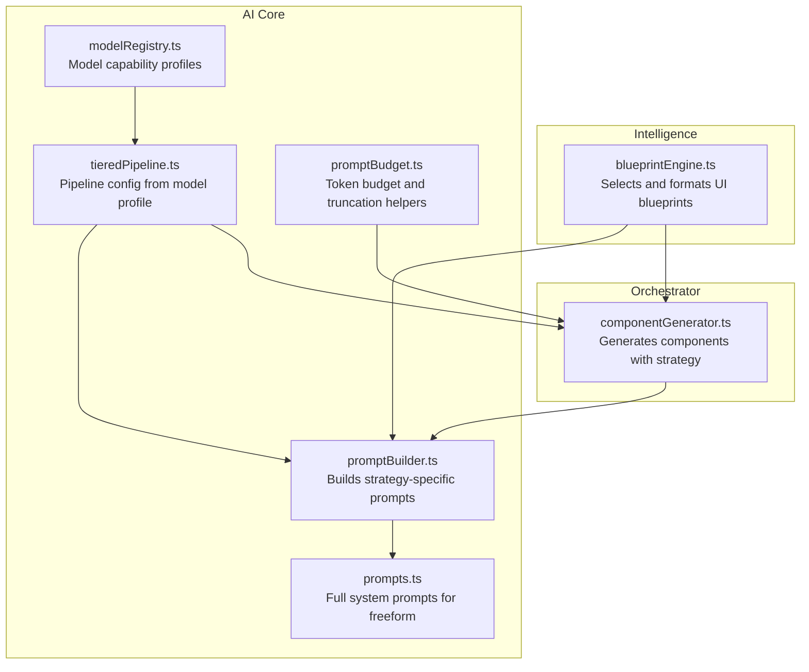
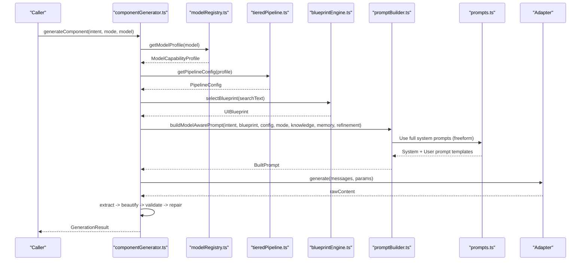
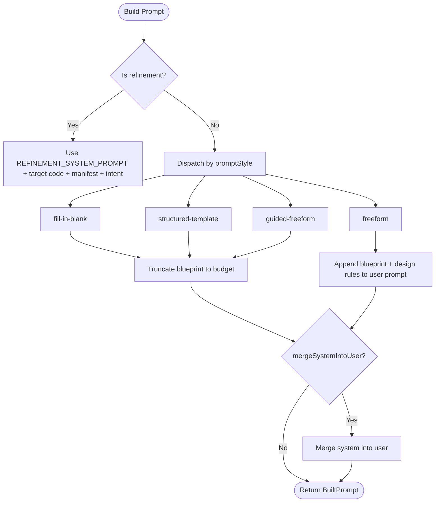
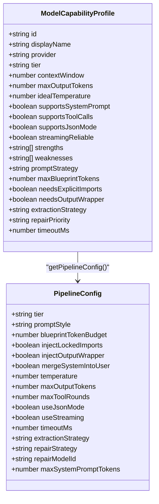
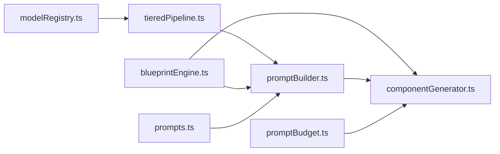

# Prompt Strategy Management

<cite>
**Referenced Files in This Document**
- [promptBuilder.ts](file://lib/ai/promptBuilder.ts)
- [tieredPipeline.ts](file://lib/ai/tieredPipeline.ts)
- [promptBudget.ts](file://lib/ai/promptBudget.ts)
- [prompts.ts](file://lib/ai/prompts.ts)
- [modelRegistry.ts](file://lib/ai/modelRegistry.ts)
- [blueprintEngine.ts](file://lib/intelligence/blueprintEngine.ts)
- [componentGenerator.ts](file://lib/ai/componentGenerator.ts)
</cite>

## Update Summary
**Changes Made**
- Updated Section 3.1 to document the new mandatory import rule requiring imports to be at the TOP of the file
- Enhanced Section 4.3 to explain the importance of import placement for preventing ReferenceError exceptions
- Added new subsection in Section 4.4 covering import validation and error prevention
- Updated troubleshooting guidance to include import placement issues

## Table of Contents
1. [Introduction](#introduction)
2. [Project Structure](#project-structure)
3. [Core Components](#core-components)
4. [Architecture Overview](#architecture-overview)
5. [Detailed Component Analysis](#detailed-component-analysis)
6. [Dependency Analysis](#dependency-analysis)
7. [Performance Considerations](#performance-considerations)
8. [Troubleshooting Guide](#troubleshooting-guide)
9. [Conclusion](#conclusion)

## Introduction
This document explains the prompt strategy management system that controls how AI models receive instructions during generation. It covers the four prompt strategies—fill-in-blank (structured slot-filling), structured-template (numbered steps with blueprints), guided-freeform (style guidelines with design rules), and freeform (unrestricted generation)—along with token budget allocation, blueprint injection mechanisms, and context window optimization. It also documents the prompt construction algorithms, template formatting, strategy selection logic, and the relationship between prompt strategies and model tier classifications.

**Updated** Added new mandatory rule requiring imports to be at the TOP of the file before any component code to prevent ReferenceError exceptions in AI-generated code.

## Project Structure
The prompt strategy system spans several modules:
- Model capability profiles and tier mapping
- Pipeline configuration derivation
- Prompt construction for each strategy
- Blueprint formatting and injection
- Context window budget enforcement
- Orchestration of generation and post-processing

**Diagram sources**
- [blueprintEngine.ts:178-214](file://lib/intelligence/blueprintEngine.ts#L178-L214)
- [modelRegistry.ts:132-800](file://lib/ai/modelRegistry.ts#L132-L800)
- [tieredPipeline.ts:191-235](file://lib/ai/tieredPipeline.ts#L191-L235)
- [promptBuilder.ts:244-298](file://lib/ai/promptBuilder.ts#L244-L298)
- [prompts.ts:74-114](file://lib/ai/prompts.ts#L74-L114)
- [promptBudget.ts:1-79](file://lib/ai/promptBudget.ts#L1-L79)
- [componentGenerator.ts:60-402](file://lib/ai/componentGenerator.ts#L60-L402)

**Section sources**
- [promptBuilder.ts:1-312](file://lib/ai/promptBuilder.ts#L1-L312)
- [tieredPipeline.ts:1-285](file://lib/ai/tieredPipeline.ts#L1-L285)
- [promptBudget.ts:1-79](file://lib/ai/promptBudget.ts#L1-L79)
- [prompts.ts:1-467](file://lib/ai/prompts.ts#L1-L467)
- [modelRegistry.ts:1-800](file://lib/ai/modelRegistry.ts#L1-L800)
- [blueprintEngine.ts:1-215](file://lib/intelligence/blueprintEngine.ts#L1-L215)
- [componentGenerator.ts:1-402](file://lib/ai/componentGenerator.ts#L1-L402)

## Core Components
- PromptBuilder: Selects and constructs the correct prompt strategy based on the pipeline configuration. It builds fill-in-blank, structured-template, guided-freeform, or freeform prompts and merges system roles when needed.
- TieredPipeline: Maps model capability profiles to pipeline configurations, including prompt style, token budgets, temperature, tool rounds, and repair strategies.
- PromptBudget: Provides token estimation and safe truncation utilities to prevent context overflow on small-context models.
- Prompts: Supplies the full system prompts used by freeform strategies and helper builders for component/app/depth UI modes.
- BlueprintEngine: Produces a structured UI blueprint and serializes it for injection into prompts.
- ComponentGenerator: Orchestrates the entire generation pipeline, including blueprint selection, memory and knowledge retrieval, context budgeting, prompt construction, and post-processing.

**Section sources**
- [promptBuilder.ts:244-298](file://lib/ai/promptBuilder.ts#L244-L298)
- [tieredPipeline.ts:191-235](file://lib/ai/tieredPipeline.ts#L191-L235)
- [promptBudget.ts:27-79](file://lib/ai/promptBudget.ts#L27-L79)
- [prompts.ts:74-114](file://lib/ai/prompts.ts#L74-L114)
- [blueprintEngine.ts:178-214](file://lib/intelligence/blueprintEngine.ts#L178-L214)
- [componentGenerator.ts:60-208](file://lib/ai/componentGenerator.ts#L60-L208)

## Architecture Overview
The system routes model capability profiles to a pipeline configuration, which determines the prompt strategy and token budgets. The prompt builder constructs the system and user prompts accordingly, and the orchestrator enforces context window safety and applies post-processing.

**Diagram sources**
- [componentGenerator.ts:60-402](file://lib/ai/componentGenerator.ts#L60-L402)
- [modelRegistry.ts:132-800](file://lib/ai/modelRegistry.ts#L132-L800)
- [tieredPipeline.ts:191-235](file://lib/ai/tieredPipeline.ts#L191-L235)
- [blueprintEngine.ts:122-176](file://lib/intelligence/blueprintEngine.ts#L122-L176)
- [promptBuilder.ts:244-298](file://lib/ai/promptBuilder.ts#L244-L298)
- [prompts.ts:74-114](file://lib/ai/prompts.ts#L74-L114)

## Detailed Component Analysis

### Prompt Strategies and Token Budget Allocation
- Fill-in-blank (tiny)
  - Purpose: Pattern completion with a skeleton TSX template and locked imports.
  - Token budget: Blueprint capped at ~300 tokens; system prompt capped at 400 tokens.
  - Behavior: Aggressive extraction strategy; inject locked imports; merge system into user; temperature 0.0.
- Structured-template (small)
  - Purpose: Numbered steps with a blueprint summary and explicit output format hint.
  - Token budget: Blueprint up to 800 tokens; system prompt capped at 800 tokens.
  - Behavior: Uses fenced code extraction; inject locked imports; temperature 0.15.
- Guided-freeform (medium)
  - Purpose: Style guidelines and design rules with concise blueprint; model has creative freedom within constraints.
  - Token budget: Blueprint up to 2000 tokens; system prompt capped at 1800 tokens.
  - Behavior: No locked imports; temperature 0.25; streaming enabled.
- Freeform (large, cloud)
  - Purpose: Full system prompts from prompts.ts; no extra constraints.
  - Token budget: Blueprint up to 4000–8000 tokens depending on tier; system prompt uncapped for cloud.
  - Behavior: Full freeform; streaming enabled; JSON mode depends on model support.

**Section sources**
- [tieredPipeline.ts:88-179](file://lib/ai/tieredPipeline.ts#L88-L179)
- [promptBudget.ts:17-23](file://lib/ai/promptBudget.ts#L17-L23)
- [promptBuilder.ts:69-144](file://lib/ai/promptBuilder.ts#L69-L144)
- [promptBuilder.ts:148-186](file://lib/ai/promptBuilder.ts#L148-L186)
- [promptBuilder.ts:190-226](file://lib/ai/promptBuilder.ts#L190-L226)
- [prompts.ts:74-114](file://lib/ai/prompts.ts#L74-L114)

### Blueprint Injection Mechanisms and Context Window Optimization
- Blueprint serialization: The blueprint is formatted into a structured block and injected into prompts.
- Truncation helpers:
  - Strategy-level truncation: Blueprints are truncated to the model's blueprintTokenBudget using a 4-character-per-token heuristic.
  - System prompt cap: Enforced via maxSystemPromptTokens per tier; if exceeded, optional sections are trimmed progressively.
  - Context fitting: Knowledge and cheat sheets are injected only when budget remains; otherwise trimmed or omitted.
- Merge system into user: For models that do not honor the system role, the system prompt is merged into the user message.

**Diagram sources**
- [promptBuilder.ts:244-298](file://lib/ai/promptBuilder.ts#L244-L298)
- [promptBuilder.ts:306-311](file://lib/ai/promptBuilder.ts#L306-L311)
- [tieredPipeline.ts:277-284](file://lib/ai/tieredPipeline.ts#L277-L284)
- [promptBudget.ts:59-78](file://lib/ai/promptBudget.ts#L59-L78)

**Section sources**
- [blueprintEngine.ts:178-214](file://lib/intelligence/blueprintEngine.ts#L178-L214)
- [promptBuilder.ts:148-186](file://lib/ai/promptBuilder.ts#L148-L186)
- [promptBuilder.ts:190-226](file://lib/ai/promptBuilder.ts#L190-L226)
- [promptBuilder.ts:244-298](file://lib/ai/promptBuilder.ts#L244-L298)
- [promptBuilder.ts:306-311](file://lib/ai/promptBuilder.ts#L306-L311)
- [tieredPipeline.ts:277-284](file://lib/ai/tieredPipeline.ts#L277-L284)
- [promptBudget.ts:59-78](file://lib/ai/promptBudget.ts#L59-L78)

### Prompt Construction Algorithms and Template Formatting
- Fill-in-blank:
  - Locked imports are injected at the top of the skeleton.
  - The system prompt enforces strict output rules and prohibits imports or structural changes.
  - The user prompt provides the skeleton with TODO markers and component purpose.
- Structured-template:
  - System prompt includes numbered steps, mandatory rules, and a truncated blueprint.
  - User prompt includes intent and optional knowledge base.
- Guided-freeform:
  - System prompt includes design guidelines, available imports, and blueprint.
  - User prompt is built from intent with optional memory examples.
  - **Updated**: Critical import placement rule requiring imports to be at the TOP of the file before any component code.
- Freeform:
  - System prompts from prompts.ts are used; user prompt includes intent and optional intelligence context.
  - **Updated**: Critical import placement rule requiring imports to be at the TOP of the file before any component code.

**Section sources**
- [promptBuilder.ts:69-144](file://lib/ai/promptBuilder.ts#L69-L144)
- [promptBuilder.ts:148-186](file://lib/ai/promptBuilder.ts#L148-L186)
- [promptBuilder.ts:190-226](file://lib/ai/promptBuilder.ts#L190-L226)
- [prompts.ts:74-114](file://lib/ai/prompts.ts#L74-L114)
- [prompts.ts:141-170](file://lib/ai/prompts.ts#L141-L170)
- [prompts.ts:255-283](file://lib/ai/prompts.ts#L255-L283)
- [prompts.ts:374-464](file://lib/ai/prompts.ts#L374-L464)

### Strategy Selection Logic and Model Tier Classification
- Strategy selection:
  - Tiny: fill-in-blank
  - Small: structured-template
  - Medium: guided-freeform
  - Large/Cloud: freeform
- Tier defaults:
  - Each tier defines promptStyle, blueprintTokenBudget, temperature, maxOutputTokens, maxToolRounds, and repair strategy.
  - Pipeline config is derived from the model profile and tier defaults, with overrides for model-specific behavior.
- Relationship to model tiers:
  - The model registry encodes capability tiers and strategy mappings.
  - Pipeline config enforces system prompt caps and truncation to prevent overflow.

**Diagram sources**
- [modelRegistry.ts:69-128](file://lib/ai/modelRegistry.ts#L69-L128)
- [tieredPipeline.ts:33-84](file://lib/ai/tieredPipeline.ts#L33-L84)
- [tieredPipeline.ts:191-235](file://lib/ai/tieredPipeline.ts#L191-L235)

**Section sources**
- [modelRegistry.ts:27-36](file://lib/ai/modelRegistry.ts#L27-L36)
- [modelRegistry.ts:132-800](file://lib/ai/modelRegistry.ts#L132-L800)
- [tieredPipeline.ts:88-179](file://lib/ai/tieredPipeline.ts#L88-L179)
- [tieredPipeline.ts:191-235](file://lib/ai/tieredPipeline.ts#L191-L235)

### Import Validation and Error Prevention
**Updated** The system now enforces a critical import placement rule to prevent ReferenceError exceptions in AI-generated code.

- **Mandatory Import Placement**: All imports must be placed at the TOP of the file, before any component code. This prevents ReferenceError exceptions when the AI attempts to use components or functions that haven't been imported yet.
- **Validation Enforcement**: The system validates that imports are positioned correctly and rejects code that violates this rule.
- **Error Prevention**: This rule specifically targets the common issue where AI models generate code with imports scattered throughout the file, causing runtime errors when components reference symbols before their imports.
- **Implementation Details**: The rule applies to both guided-freeform and freeform strategies, ensuring consistent import placement across all model tiers.

**Section sources**
- [promptBuilder.ts:267](file://lib/ai/promptBuilder.ts#L267)
- [prompts.ts:110](file://lib/ai/prompts.ts#L110)

### Customization Examples and Hybrid Approaches
- Customizing prompt styles:
  - Adjust blueprintTokenBudget and maxSystemPromptTokens per model profile to tailor context usage.
  - Toggle injectLockedImports and injectOutputWrapper to control injection behavior.
  - Modify extractionStrategy to balance reliability and output fidelity.
- Optimizing for different model capabilities:
  - For models without system role support, enable mergeSystemIntoUser to ensure instructions are preserved.
  - For small-context models, reduce blueprintTokenBudget and use truncation helpers to prevent overflow.
- Hybrid approaches:
  - Combine guided-freeform with blueprint truncation and append design rules to the user prompt for cloud/large models.
  - Use refinement mode to constrain edits to existing code, bypassing strategy selection.
  - **Updated**: Ensure that any hybrid approach maintains proper import placement at the top of the file.

**Section sources**
- [tieredPipeline.ts:191-235](file://lib/ai/tieredPipeline.ts#L191-L235)
- [promptBuilder.ts:244-298](file://lib/ai/promptBuilder.ts#L244-L298)
- [componentGenerator.ts:110-138](file://lib/ai/componentGenerator.ts#L110-L138)
- [componentGenerator.ts:163-170](file://lib/ai/componentGenerator.ts#L163-L170)

## Dependency Analysis
The prompt strategy system exhibits clear separation of concerns:
- ModelRegistry defines capabilities and strategy mappings.
- TieredPipeline derives pipeline configuration from profiles.
- BlueprintEngine supplies and formats blueprints.
- PromptBuilder constructs strategy-specific prompts.
- PromptBudget ensures safe context usage.
- ComponentGenerator orchestrates the end-to-end flow.

**Diagram sources**
- [modelRegistry.ts:132-800](file://lib/ai/modelRegistry.ts#L132-L800)
- [tieredPipeline.ts:191-235](file://lib/ai/tieredPipeline.ts#L191-L235)
- [promptBuilder.ts:244-298](file://lib/ai/promptBuilder.ts#L244-L298)
- [blueprintEngine.ts:178-214](file://lib/intelligence/blueprintEngine.ts#L178-L214)
- [promptBudget.ts:1-79](file://lib/ai/promptBudget.ts#L1-L79)
- [prompts.ts:74-114](file://lib/ai/prompts.ts#L74-L114)
- [componentGenerator.ts:60-208](file://lib/ai/componentGenerator.ts#L60-L208)

**Section sources**
- [modelRegistry.ts:132-800](file://lib/ai/modelRegistry.ts#L132-L800)
- [tieredPipeline.ts:191-235](file://lib/ai/tieredPipeline.ts#L191-L235)
- [promptBuilder.ts:244-298](file://lib/ai/promptBuilder.ts#L244-L298)
- [blueprintEngine.ts:178-214](file://lib/intelligence/blueprintEngine.ts#L178-L214)
- [promptBudget.ts:1-79](file://lib/ai/promptBudget.ts#L1-L79)
- [prompts.ts:74-114](file://lib/ai/prompts.ts#L74-L114)
- [componentGenerator.ts:60-208](file://lib/ai/componentGenerator.ts#L60-L208)

## Performance Considerations
- Token estimation: A 4-character-per-token heuristic is used for quick budget checks.
- Progressive trimming: System prompts are trimmed to maxSystemPromptTokens; optional blocks are removed first to preserve essential instructions.
- Streaming and timeouts: Streaming is enabled for medium/large/cloud tiers; timeouts vary by tier to balance responsiveness and quality.
- Output extraction: Strategy-based extraction reduces post-processing overhead and improves reliability.
- **Updated**: Import validation adds minimal overhead while preventing costly runtime errors and reprocessing.

## Troubleshooting Guide
- Context overflow on small models:
  - Verify blueprintTokenBudget and maxSystemPromptTokens for the selected tier.
  - Use fitContextToTierBudget to trim knowledge and cheat sheets before injection.
- System role ignored:
  - Enable mergeSystemIntoUser for models that do not support system messages.
- Incomplete components:
  - For tiny models, confirm that the fill-in-blank skeleton is complete and that extraction confidence is acceptable.
- Tool call errors:
  - Ensure tools are only enabled for models explicitly registered with supportsToolCalls; otherwise, disable tools to avoid silent 400 errors.
- **Updated** Import placement errors:
  - Verify that all imports are positioned at the TOP of the file, before any component code.
  - Check for ReferenceError exceptions caused by components referencing symbols before their imports.
  - Ensure that the critical import placement rule is followed in both guided-freeform and freeform strategies.

**Section sources**
- [promptBudget.ts:59-78](file://lib/ai/promptBudget.ts#L59-L78)
- [tieredPipeline.ts:204-213](file://lib/ai/tieredPipeline.ts#L204-L213)
- [componentGenerator.ts:266-268](file://lib/ai/componentGenerator.ts#L266-L268)
- [promptBuilder.ts:306-311](file://lib/ai/promptBuilder.ts#L306-L311)

## Conclusion
The prompt strategy management system aligns model capabilities with tailored prompting strategies, ensuring high-quality, context-safe generation across a wide range of models. By enforcing token budgets, truncating context thoughtfully, and selecting appropriate strategies per tier, the system maintains reliability and performance while preserving creative freedom for capable models.

**Updated** The addition of the mandatory import placement rule significantly improves code quality and prevents ReferenceError exceptions in AI-generated code, making the system more robust and production-ready across all model tiers and strategies.