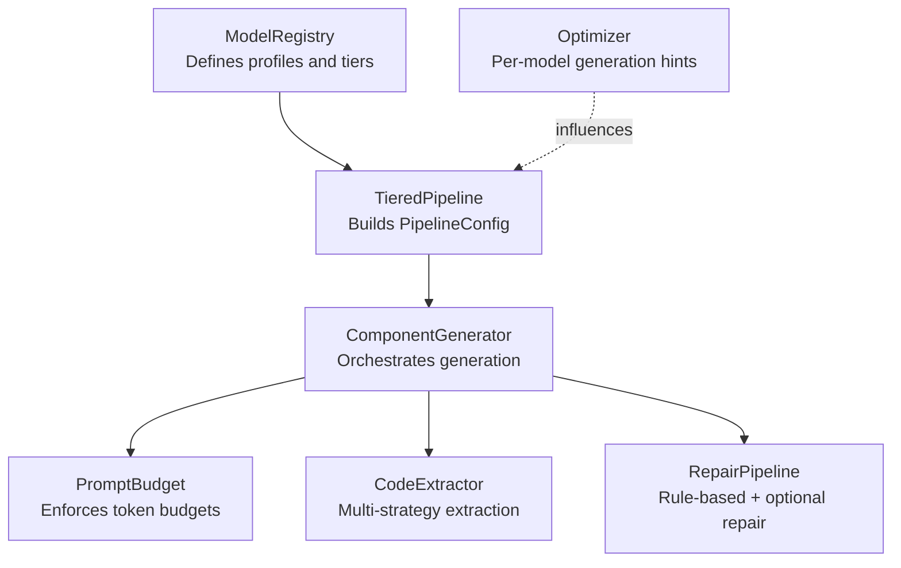
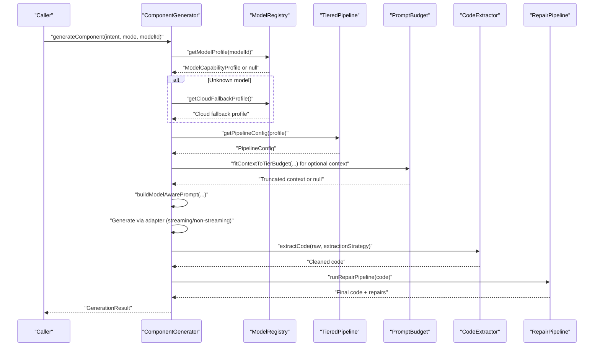
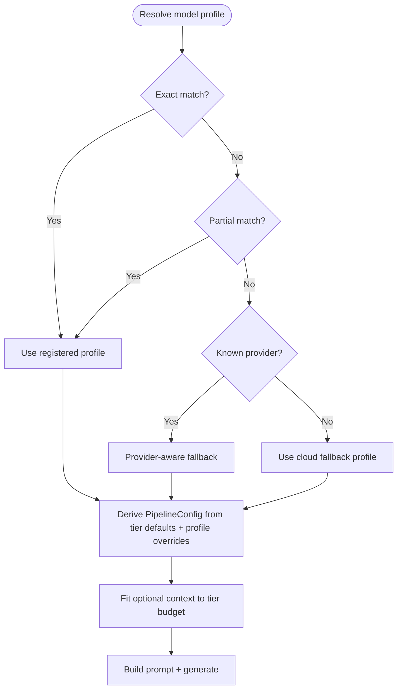
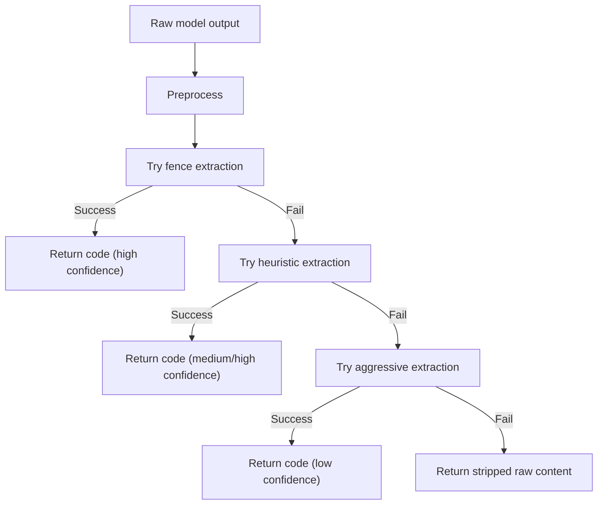
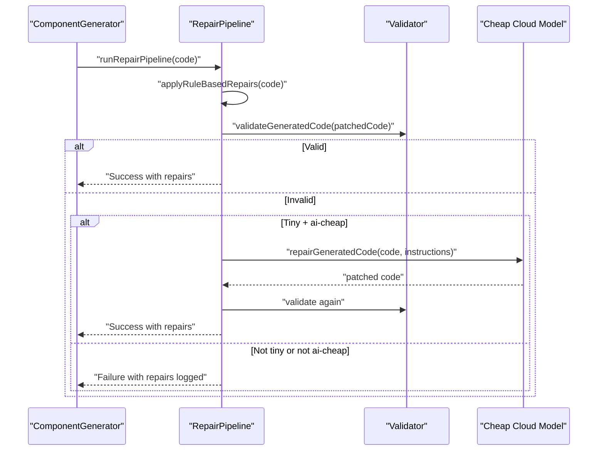
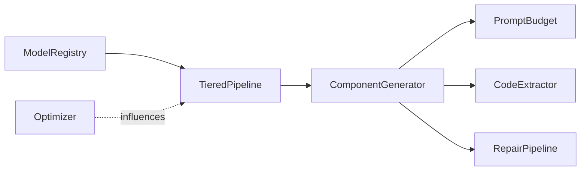

# Tiered Pipeline Configuration

<cite>
**Referenced Files in This Document**
- [tieredPipeline.ts](file://lib/ai/tieredPipeline.ts)
- [modelRegistry.ts](file://lib/ai/modelRegistry.ts)
- [promptBudget.ts](file://lib/ai/promptBudget.ts)
- [optimizer.ts](file://lib/ai/optimizer.ts)
- [componentGenerator.ts](file://lib/ai/componentGenerator.ts)
- [codeExtractor.ts](file://lib/ai/codeExtractor.ts)
- [repairPipeline.ts](file://lib/intelligence/repairPipeline.ts)
</cite>

## Table of Contents
1. [Introduction](#introduction)
2. [Project Structure](#project-structure)
3. [Core Components](#core-components)
4. [Architecture Overview](#architecture-overview)
5. [Detailed Component Analysis](#detailed-component-analysis)
6. [Dependency Analysis](#dependency-analysis)
7. [Performance Considerations](#performance-considerations)
8. [Troubleshooting Guide](#troubleshooting-guide)
9. [Conclusion](#conclusion)

## Introduction
This document explains the tiered pipeline configuration system that automatically selects optimal generation parameters based on model capabilities. It covers the five pipeline tiers (tiny, small, medium, large, cloud) and their strategies, automatic parameter selection (temperature ranges, tool call configurations, blueprint token limits, repair strategies), decision logic, fallback mechanisms, and performance optimizations. It also provides guidance for configuring custom pipeline behaviors and handling edge cases.

## Project Structure
The tiered pipeline system spans several modules:
- Model capability registry defines model profiles and tiers.
- Pipeline builder maps profiles to concrete generation configs.
- Prompt budget manager enforces context window constraints.
- Component generator orchestrates generation using the pipeline config.
- Code extraction adapts to model output styles.
- Repair pipeline applies deterministic fixes and optional cheap cloud repair.

**Diagram sources**
- [modelRegistry.ts:27-36](file://lib/ai/modelRegistry.ts#L27-L36)
- [tieredPipeline.ts:88-179](file://lib/ai/tieredPipeline.ts#L88-L179)
- [componentGenerator.ts:90-138](file://lib/ai/componentGenerator.ts#L90-L138)
- [promptBudget.ts:59-78](file://lib/ai/promptBudget.ts#L59-L78)
- [codeExtractor.ts:218-262](file://lib/ai/codeExtractor.ts#L218-L262)
- [repairPipeline.ts:238-254](file://lib/intelligence/repairPipeline.ts#L238-L254)
- [optimizer.ts:68-85](file://lib/ai/optimizer.ts#L68-L85)

**Section sources**
- [modelRegistry.ts:27-36](file://lib/ai/modelRegistry.ts#L27-L36)
- [tieredPipeline.ts:88-179](file://lib/ai/tieredPipeline.ts#L88-L179)
- [componentGenerator.ts:90-138](file://lib/ai/componentGenerator.ts#L90-L138)
- [promptBudget.ts:59-78](file://lib/ai/promptBudget.ts#L59-L78)
- [codeExtractor.ts:218-262](file://lib/ai/codeExtractor.ts#L218-L262)
- [repairPipeline.ts:238-254](file://lib/intelligence/repairPipeline.ts#L238-L254)
- [optimizer.ts:68-85](file://lib/ai/optimizer.ts#L68-L85)

## Core Components
- Model capability profile: Defines tier, token capacities, generation behavior, prompt strategy, extraction strategy, repair priority, and timeouts.
- Pipeline configuration: Concrete set of parameters derived from a profile, including temperature, output token limits, tool rounds, JSON mode, streaming, timeouts, and repair model selection.
- Prompt budget manager: Ensures prompts fit within model context windows by truncating optional context blocks.
- Component generator: Orchestrates blueprint selection, prompt building, generation, extraction, validation, and repair.
- Code extraction: Applies multi-strategy extraction tailored to model output styles.
- Repair pipeline: Applies deterministic fixes and optionally uses a cheap cloud model for repair.

**Section sources**
- [modelRegistry.ts:69-128](file://lib/ai/modelRegistry.ts#L69-L128)
- [tieredPipeline.ts:33-84](file://lib/ai/tieredPipeline.ts#L33-L84)
- [promptBudget.ts:59-78](file://lib/ai/promptBudget.ts#L59-L78)
- [componentGenerator.ts:60-200](file://lib/ai/componentGenerator.ts#L60-L200)
- [codeExtractor.ts:218-262](file://lib/ai/codeExtractor.ts#L218-L262)
- [repairPipeline.ts:238-254](file://lib/intelligence/repairPipeline.ts#L238-L254)

## Architecture Overview
The system maps a model’s capability profile to a pipeline configuration and uses it to orchestrate generation safely and effectively across diverse models.

**Diagram sources**
- [componentGenerator.ts:90-191](file://lib/ai/componentGenerator.ts#L90-L191)
- [modelRegistry.ts:1046-1085](file://lib/ai/modelRegistry.ts#L1046-L1085)
- [tieredPipeline.ts:191-234](file://lib/ai/tieredPipeline.ts#L191-L234)
- [promptBudget.ts:59-78](file://lib/ai/promptBudget.ts#L59-L78)
- [codeExtractor.ts:218-262](file://lib/ai/codeExtractor.ts#L218-L262)
- [repairPipeline.ts:238-254](file://lib/intelligence/repairPipeline.ts#L238-L254)

## Detailed Component Analysis

### Five Pipeline Tiers and Strategies
- Tiny (< 3B parameters)
  - Prompt strategy: fill-in-blank
  - Temperature: 0.0
  - Tool calls: disabled
  - Blueprint token budget: small
  - Extraction: aggressive
  - Repair: ai-cheap (cheap cloud repair)
- Small (3B–9B parameters)
  - Prompt strategy: structured-template
  - Temperature: low
  - Tool calls: disabled
  - Blueprint token budget: moderate
  - Extraction: fence
  - Repair: rules-only
- Medium (10B–34B parameters)
  - Prompt strategy: guided-freeform
  - Temperature: low-to-moderate
  - Tool calls: disabled globally (to avoid 400s on unknown endpoints)
  - Blueprint token budget: larger
  - Extraction: fence
  - Repair: rules-only
- Large (35B–70B parameters)
  - Prompt strategy: freeform
  - Temperature: moderate
  - Tool calls: disabled globally
  - Blueprint token budget: large
  - Extraction: fence
  - Repair: rules-only
- Cloud (API-hosted)
  - Prompt strategy: freeform
  - Temperature: higher
  - Tool calls: disabled globally
  - Blueprint token budget: very large
  - Extraction: fence
  - Repair: rules-only (never call another LLM for repair)

**Section sources**
- [tieredPipeline.ts:88-179](file://lib/ai/tieredPipeline.ts#L88-L179)
- [modelRegistry.ts:27-36](file://lib/ai/modelRegistry.ts#L27-L36)
- [modelRegistry.ts:40-46](file://lib/ai/modelRegistry.ts#L40-L46)

### Automatic Parameter Selection
- Temperature ranges
  - Tiny: 0.0
  - Small: tuned low
  - Medium: low-to-moderate
  - Large: moderate
  - Cloud: higher
- Tool call configurations
  - Disabled globally for small/medium/large/cloud to avoid 400s on unknown/proxy endpoints.
  - Profiles override only if the model explicitly supports tool calls.
- Blueprint token limits
  - Derived from tier defaults and overridden per-profile.
  - Enforced by prompt builder and budget manager.
- Repair strategies
  - Cloud: rules-only (never repair with another LLM).
  - Tiny: ai-cheap (rules-first, then cheap cloud repair).
  - Others: rules-only.
- Streaming
  - Enabled only when the model reports reliable streaming.

**Section sources**
- [tieredPipeline.ts:191-234](file://lib/ai/tieredPipeline.ts#L191-L234)
- [modelRegistry.ts:85-96](file://lib/ai/modelRegistry.ts#L85-L96)

### Pipeline Decision Logic and Fallback Mechanisms
- Model resolution
  - Exact match, then partial match, then provider-aware fallback for unregistered models.
  - Unknown models fall back to a conservative cloud profile.
- Pipeline derivation
  - Start from tier defaults, then override with profile-specific values.
  - Respect model capabilities (system prompt support, tool calls, JSON mode, streaming reliability).
- Prompt enrichment
  - For freeform/guided-freeform, optional context is injected only when budget allows.
  - Context is truncated to fit within tier-specific system prompt caps.

**Diagram sources**
- [modelRegistry.ts:1046-1085](file://lib/ai/modelRegistry.ts#L1046-L1085)
- [tieredPipeline.ts:191-234](file://lib/ai/tieredPipeline.ts#L191-L234)
- [promptBudget.ts:59-78](file://lib/ai/promptBudget.ts#L59-L78)

**Section sources**
- [modelRegistry.ts:1046-1085](file://lib/ai/modelRegistry.ts#L1046-L1085)
- [tieredPipeline.ts:191-234](file://lib/ai/tieredPipeline.ts#L191-L234)
- [promptBudget.ts:59-78](file://lib/ai/promptBudget.ts#L59-L78)

### Code Extraction Strategies
Extraction adapts to model output styles:
- Fence: standard fenced code blocks (preferred).
- Heuristic: finds first code-like line and strips prose (for verbose models).
- Aggressive: strips preamble/trailing explanations and cleans raw output (for tiny models).

**Diagram sources**
- [codeExtractor.ts:218-262](file://lib/ai/codeExtractor.ts#L218-L262)

**Section sources**
- [codeExtractor.ts:218-262](file://lib/ai/codeExtractor.ts#L218-L262)

### Repair Pipeline
- Rule-based repairs are applied first.
- If validation still fails, optional repair is performed using a cheap cloud model for tiny models.
- Cloud models never trigger AI repair; only rules-only.

**Diagram sources**
- [repairPipeline.ts:238-254](file://lib/intelligence/repairPipeline.ts#L238-L254)
- [tieredPipeline.ts:225-233](file://lib/ai/tieredPipeline.ts#L225-L233)

**Section sources**
- [repairPipeline.ts:238-254](file://lib/intelligence/repairPipeline.ts#L238-L254)
- [tieredPipeline.ts:225-233](file://lib/ai/tieredPipeline.ts#L225-L233)

### Performance Optimizations
- Context window guardrails
  - Per-tier system prompt caps prevent overflow on small-context models.
  - Optional context blocks are truncated to fit remaining budget.
- Streaming control
  - Streaming is enabled only when reliable to reduce latency and improve UX.
- Conservative defaults
  - Tool calls disabled globally to avoid endpoint errors.
  - Lower temperatures for models sensitive to instruction-following.
- Model-specific optimizations
  - Per-model generation hints (temperature, max tokens) guide adapter behavior.

**Section sources**
- [promptBudget.ts:17-23](file://lib/ai/promptBudget.ts#L17-L23)
- [promptBudget.ts:59-78](file://lib/ai/promptBudget.ts#L59-L78)
- [tieredPipeline.ts:218-219](file://lib/ai/tieredPipeline.ts#L218-L219)
- [optimizer.ts:68-85](file://lib/ai/optimizer.ts#L68-L85)

### Examples and Best Practices
- Configure custom pipeline behaviors
  - Define a new model profile with desired tier, token limits, prompt strategy, extraction strategy, and repair priority.
  - Ensure tool call support aligns with the model’s capabilities.
  - Use the pipeline builder to derive a full configuration.
- Optimize for different use cases
  - Cost-sensitive local generation: choose small/medium with rules-only repair.
  - Creative design tasks: cloud with freeform and higher temperature.
  - Fast iteration: cheap cloud models with freeform and minimal repair.
- Handle edge cases
  - Unknown models: rely on cloud fallback profile to avoid misconfiguration.
  - Small context windows: inject minimal blueprint and rely on truncation.
  - Streaming failures: fall back to non-streaming generation.

**Section sources**
- [modelRegistry.ts:1046-1085](file://lib/ai/modelRegistry.ts#L1046-L1085)
- [tieredPipeline.ts:191-234](file://lib/ai/tieredPipeline.ts#L191-L234)
- [promptBudget.ts:59-78](file://lib/ai/promptBudget.ts#L59-L78)

## Dependency Analysis
The pipeline configuration depends on the model registry and integrates with prompt building, extraction, and repair.

**Diagram sources**
- [modelRegistry.ts:1046-1085](file://lib/ai/modelRegistry.ts#L1046-L1085)
- [tieredPipeline.ts:191-234](file://lib/ai/tieredPipeline.ts#L191-L234)
- [componentGenerator.ts:90-138](file://lib/ai/componentGenerator.ts#L90-L138)
- [promptBudget.ts:59-78](file://lib/ai/promptBudget.ts#L59-L78)
- [codeExtractor.ts:218-262](file://lib/ai/codeExtractor.ts#L218-L262)
- [repairPipeline.ts:238-254](file://lib/intelligence/repairPipeline.ts#L238-L254)
- [optimizer.ts:68-85](file://lib/ai/optimizer.ts#L68-L85)

**Section sources**
- [modelRegistry.ts:1046-1085](file://lib/ai/modelRegistry.ts#L1046-L1085)
- [tieredPipeline.ts:191-234](file://lib/ai/tieredPipeline.ts#L191-L234)
- [componentGenerator.ts:90-138](file://lib/ai/componentGenerator.ts#L90-L138)
- [promptBudget.ts:59-78](file://lib/ai/promptBudget.ts#L59-L78)
- [codeExtractor.ts:218-262](file://lib/ai/codeExtractor.ts#L218-L262)
- [repairPipeline.ts:238-254](file://lib/intelligence/repairPipeline.ts#L238-L254)
- [optimizer.ts:68-85](file://lib/ai/optimizer.ts#L68-L85)

## Performance Considerations
- Prefer smaller token budgets for small-context models to avoid overflow.
- Disable streaming for models with unreliable streaming to reduce retries.
- Limit tool calls globally to prevent endpoint errors; enable only when explicitly supported.
- Use per-model optimization hints to tune temperature and max tokens for faster convergence.

[No sources needed since this section provides general guidance]

## Troubleshooting Guide
- Model not found
  - The resolver falls back to a cloud profile; verify the model identifier and provider.
- Context overflow
  - Reduce blueprint size or rely on truncation; check tier-specific system prompt caps.
- Streaming issues
  - Streaming is disabled for models marked unreliable; switch to non-streaming.
- Repair not applied
  - Cloud models never trigger AI repair; ensure repair priority is set appropriately for other tiers.
- Extraction failures
  - Try a different extraction strategy or preprocess the raw output to remove preamble.

**Section sources**
- [modelRegistry.ts:1046-1085](file://lib/ai/modelRegistry.ts#L1046-L1085)
- [promptBudget.ts:59-78](file://lib/ai/promptBudget.ts#L59-L78)
- [tieredPipeline.ts:218-219](file://lib/ai/tieredPipeline.ts#L218-L219)
- [tieredPipeline.ts:225-233](file://lib/ai/tieredPipeline.ts#L225-L233)
- [codeExtractor.ts:218-262](file://lib/ai/codeExtractor.ts#L218-L262)

## Conclusion
The tiered pipeline configuration system provides a robust, model-agnostic framework for generating UI components. By mapping model capabilities to precise generation parameters, enforcing context window safety, and applying adaptive extraction and repair strategies, it ensures reliable, efficient, and high-quality outputs across a wide range of models—from tiny local models to cloud giants.