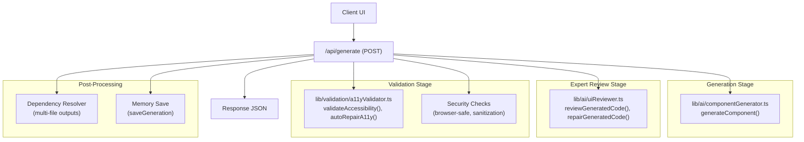
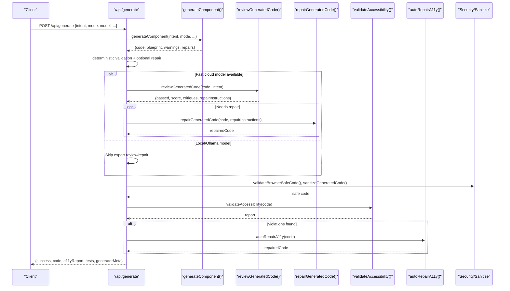
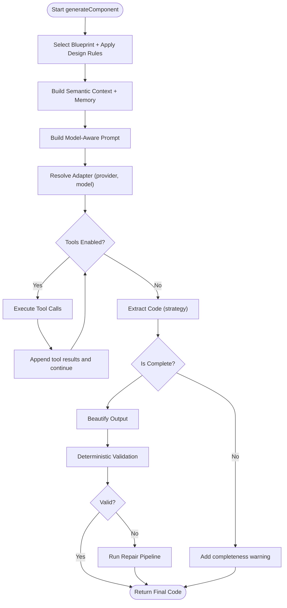
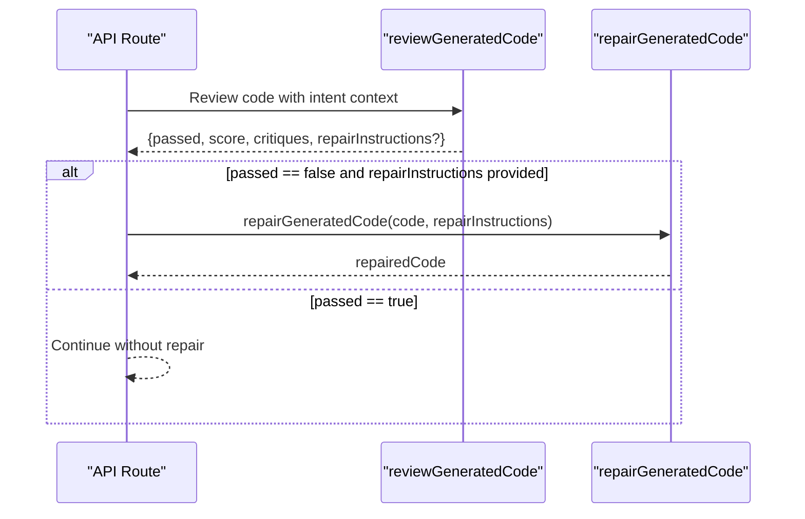
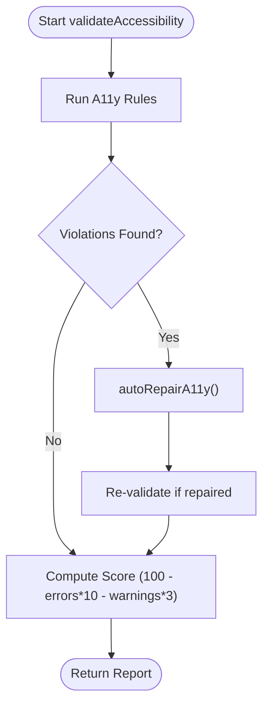
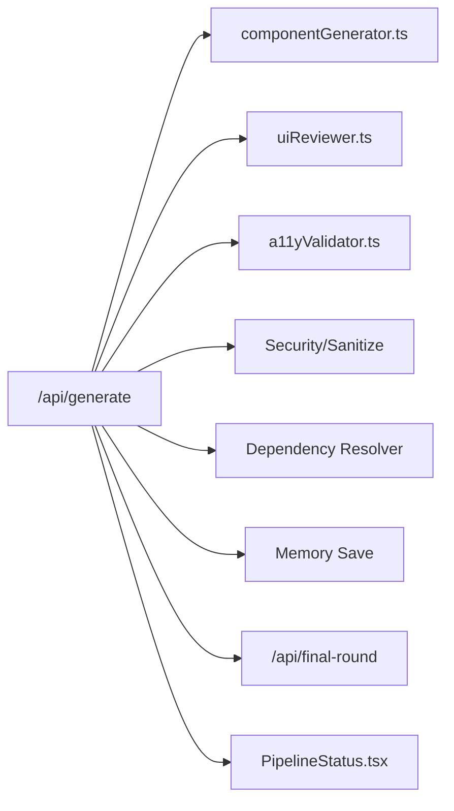

# Agent Workflow Management

<cite>
**Referenced Files in This Document**
- [README.md](file://README.md)
- [AGENTS.md](file://AGENTS.md)
- [app/api/generate/route.ts](file://app/api/generate/route.ts)
- [app/api/final-round/route.ts](file://app/api/final-round/route.ts)
- [lib/ai/componentGenerator.ts](file://lib/ai/componentGenerator.ts)
- [lib/ai/uiReviewer.ts](file://lib/ai/uiReviewer.ts)
- [lib/validation/a11yValidator.ts](file://lib/validation/a11yValidator.ts)
- [components/PipelineStatus.tsx](file://components/PipelineStatus.tsx)
</cite>

## Table of Contents
1. [Introduction](#introduction)
2. [Project Structure](#project-structure)
3. [Core Components](#core-components)
4. [Architecture Overview](#architecture-overview)
5. [Detailed Component Analysis](#detailed-component-analysis)
6. [Dependency Analysis](#dependency-analysis)
7. [Performance Considerations](#performance-considerations)
8. [Troubleshooting Guide](#troubleshooting-guide)
9. [Conclusion](#conclusion)

## Introduction
This document explains the agent workflow management system that coordinates a multi-stage generation pipeline for building accessible React components. It covers the sequential stages from intent processing and blueprint application through expert review and final repair, and details how the system enforces design rules, validates accessibility and security, and coordinates a repair pipeline. It also documents workflow state management, error handling, and decision logic for triggering repair actions.

## Project Structure
The generation pipeline is orchestrated by a server endpoint that validates inputs, generates code, runs expert review and repair agents, enforces accessibility and security rules, and returns a final, validated artifact. Supporting libraries encapsulate the generation orchestration, accessibility validation, and expert review/repair logic.

**Diagram sources**
- [app/api/generate/route.ts:25-440](file://app/api/generate/route.ts#L25-L440)
- [lib/ai/componentGenerator.ts:60-402](file://lib/ai/componentGenerator.ts#L60-L402)
- [lib/ai/uiReviewer.ts:58-199](file://lib/ai/uiReviewer.ts#L58-L199)
- [lib/validation/a11yValidator.ts:264-376](file://lib/validation/a11yValidator.ts#L264-L376)

**Section sources**
- [app/api/generate/route.ts:25-440](file://app/api/generate/route.ts#L25-L440)
- [lib/ai/componentGenerator.ts:60-402](file://lib/ai/componentGenerator.ts#L60-L402)
- [lib/ai/uiReviewer.ts:58-199](file://lib/ai/uiReviewer.ts#L58-L199)
- [lib/validation/a11yValidator.ts:264-376](file://lib/validation/a11yValidator.ts#L264-L376)

## Core Components
- Generation Orchestrator: Builds prompts, resolves adapters, executes tool loops, extracts code, beautifies, validates, and repairs.
- Expert Reviewer Agent: Evaluates generated UI quality and triggers repair when needed.
- Accessibility Validator: Enforces WCAG 2.1 AA rules and auto-repairs common issues.
- Security and Sanitization: Ensures generated code is browser-safe and cleans problematic constructs.
- Dependency Resolver: Applies patches to multi-file outputs after validation and repair.
- Pipeline Status UI: Visualizes the current stage of the generation pipeline.

**Section sources**
- [lib/ai/componentGenerator.ts:60-402](file://lib/ai/componentGenerator.ts#L60-L402)
- [lib/ai/uiReviewer.ts:58-199](file://lib/ai/uiReviewer.ts#L58-L199)
- [lib/validation/a11yValidator.ts:264-376](file://lib/validation/a11yValidator.ts#L264-L376)
- [components/PipelineStatus.tsx:10-75](file://components/PipelineStatus.tsx#L10-L75)

## Architecture Overview
The generation pipeline is a server-driven workflow that:
1. Validates inputs and intent structure.
2. Generates code using a model-agnostic generation orchestrator.
3. Applies deterministic validation and auto-repair.
4. Runs expert review and repair when a fast cloud model is available.
5. Enforces accessibility and security checks.
6. Generates tests and resolves dependencies for multi-file outputs.
7. Saves generation metadata and returns a structured response.

**Diagram sources**
- [app/api/generate/route.ts:25-440](file://app/api/generate/route.ts#L25-L440)
- [lib/ai/componentGenerator.ts:60-402](file://lib/ai/componentGenerator.ts#L60-L402)
- [lib/ai/uiReviewer.ts:58-199](file://lib/ai/uiReviewer.ts#L58-L199)
- [lib/validation/a11yValidator.ts:264-376](file://lib/validation/a11yValidator.ts#L264-L376)

## Detailed Component Analysis

### Generation Orchestrator
The orchestrator coordinates blueprint selection, design rules application, semantic context injection, tool-enabled agent loop, code extraction, beautification, deterministic validation, and repair pipeline integration. It selects model profiles and pipeline configurations, builds model-aware prompts, and enforces token budgets.

Key behaviors:
- Blueprint and design rules shaping the prompt.
- Knowledge and cheat sheet injection with budget-aware trimming.
- Feedback enrichment to improve prompt quality.
- Tool loop execution respecting model capabilities.
- Extraction strategy selection and completeness checks.
- Beautification and deterministic validation with repair pipeline integration.

**Diagram sources**
- [lib/ai/componentGenerator.ts:60-402](file://lib/ai/componentGenerator.ts#L60-L402)

**Section sources**
- [lib/ai/componentGenerator.ts:60-402](file://lib/ai/componentGenerator.ts#L60-L402)

### Expert Reviewer Agent
The reviewer evaluates generated UI quality and optionally triggers repair. It respects user-selected provider/model overrides and falls back to environment-configured models when not overridden. It returns structured JSON indicating pass/fail, score, critiques, and repair instructions.

Decision logic:
- If the review fails and repair instructions are present, the repair agent is invoked.
- Failures are handled gracefully to avoid breaking the pipeline.

**Diagram sources**
- [app/api/generate/route.ts:242-312](file://app/api/generate/route.ts#L242-L312)
- [lib/ai/uiReviewer.ts:58-199](file://lib/ai/uiReviewer.ts#L58-L199)

**Section sources**
- [lib/ai/uiReviewer.ts:58-199](file://lib/ai/uiReviewer.ts#L58-L199)
- [app/api/generate/route.ts:242-312](file://app/api/generate/route.ts#L242-L312)

### Accessibility Validator and Auto-Repair
The validator statically checks generated TSX against WCAG 2.1 AA rules and computes a score. Auto-repair applies targeted fixes for common issues (e.g., focus indicators, error announcements, labeled inputs, icon-only buttons).

**Diagram sources**
- [lib/validation/a11yValidator.ts:264-376](file://lib/validation/a11yValidator.ts#L264-L376)

**Section sources**
- [lib/validation/a11yValidator.ts:264-376](file://lib/validation/a11yValidator.ts#L264-L376)

### Security and Sanitization
The pipeline performs browser safety validation and sanitizes code to prevent parsing issues in the preview environment. It rejects unsafe patterns and ensures compatibility with the sandbox runtime.

**Section sources**
- [app/api/generate/route.ts:317-326](file://app/api/generate/route.ts#L317-L326)

### Dependency Resolution and Multi-File Outputs
After accessibility repair, the system merges the repaired primary file back into multi-file outputs and applies dependency patches. Patch logs are included in the generator metadata.

**Section sources**
- [app/api/generate/route.ts:385-406](file://app/api/generate/route.ts#L385-L406)

### Final Round Critique Endpoint
A separate endpoint enables a final visual critique using a screenshot of the rendered UI, allowing human-in-the-loop validation and feedback.

**Section sources**
- [app/api/final-round/route.ts:21-71](file://app/api/final-round/route.ts#L21-L71)

### Pipeline State Management
The UI displays the current stage of the pipeline with visual indicators and handles error states, including unauthorized sessions.

**Section sources**
- [components/PipelineStatus.tsx:10-75](file://components/PipelineStatus.tsx#L10-L75)
- [components/PipelineStatus.tsx:77-219](file://components/PipelineStatus.tsx#L77-L219)

## Dependency Analysis
The generation route composes several libraries and services:
- Input validation and intent parsing.
- Generation orchestration and tool loop.
- Expert review and repair agents.
- Accessibility validation and auto-repair.
- Security and sanitization.
- Dependency resolution and embedding updates.
- Memory persistence and telemetry.

**Diagram sources**
- [app/api/generate/route.ts:25-440](file://app/api/generate/route.ts#L25-L440)
- [lib/ai/componentGenerator.ts:60-402](file://lib/ai/componentGenerator.ts#L60-L402)
- [lib/ai/uiReviewer.ts:58-199](file://lib/ai/uiReviewer.ts#L58-L199)
- [lib/validation/a11yValidator.ts:264-376](file://lib/validation/a11yValidator.ts#L264-L376)
- [app/api/final-round/route.ts:21-71](file://app/api/final-round/route.ts#L21-L71)
- [components/PipelineStatus.tsx:10-75](file://components/PipelineStatus.tsx#L10-L75)

**Section sources**
- [app/api/generate/route.ts:25-440](file://app/api/generate/route.ts#L25-L440)

## Performance Considerations
- Streaming generation is supported for immediate text chunks.
- Expert review and repair are skipped for local/Ollama models to avoid expensive inference calls.
- A 60-second aggregate timeout bounds the review phase to prevent exceeding platform limits.
- Parallel execution of accessibility validation and test generation reduces total latency.
- Token budget enforcement trims optional context to fit model caps.

[No sources needed since this section provides general guidance]

## Troubleshooting Guide
Common issues and resolutions:
- Invalid JSON or missing intent: The route returns a 400 with a clear error message. Verify the request payload structure.
- Generation failures: The route logs the model/provider context and returns a 422 with the error. Check provider credentials and model availability.
- Expert reviewer unavailable: The route continues with the original code and logs a warning. Confirm quota and provider configuration.
- Accessibility violations: The system auto-repairs common issues; re-run validation to confirm fixes.
- Browser safety violations: The route rejects code containing unsafe patterns. Remove Node/TTY imports and similar constructs.
- Dependency resolver patches: Ensure the repaired code is merged back into multi-file outputs before patching.

**Section sources**
- [app/api/generate/route.ts:29-46](file://app/api/generate/route.ts#L29-L46)
- [app/api/generate/route.ts:196-208](file://app/api/generate/route.ts#L196-L208)
- [app/api/generate/route.ts:296-302](file://app/api/generate/route.ts#L296-L302)
- [app/api/generate/route.ts:317-326](file://app/api/generate/route.ts#L317-L326)
- [lib/validation/a11yValidator.ts:264-376](file://lib/validation/a11yValidator.ts#L264-L376)

## Conclusion
The agent workflow management system integrates intent processing, blueprint application, expert review, accessibility enforcement, and repair automation into a robust, model-agnostic pipeline. It balances performance and quality by selectively enabling expert review, parallelizing validations, and applying deterministic repairs. The result is a reliable generation experience that prioritizes accessibility-first outcomes and provides clear diagnostics and recovery paths.