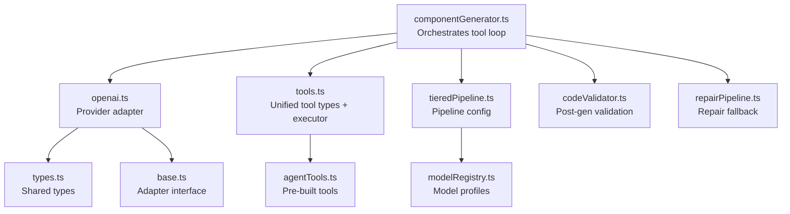
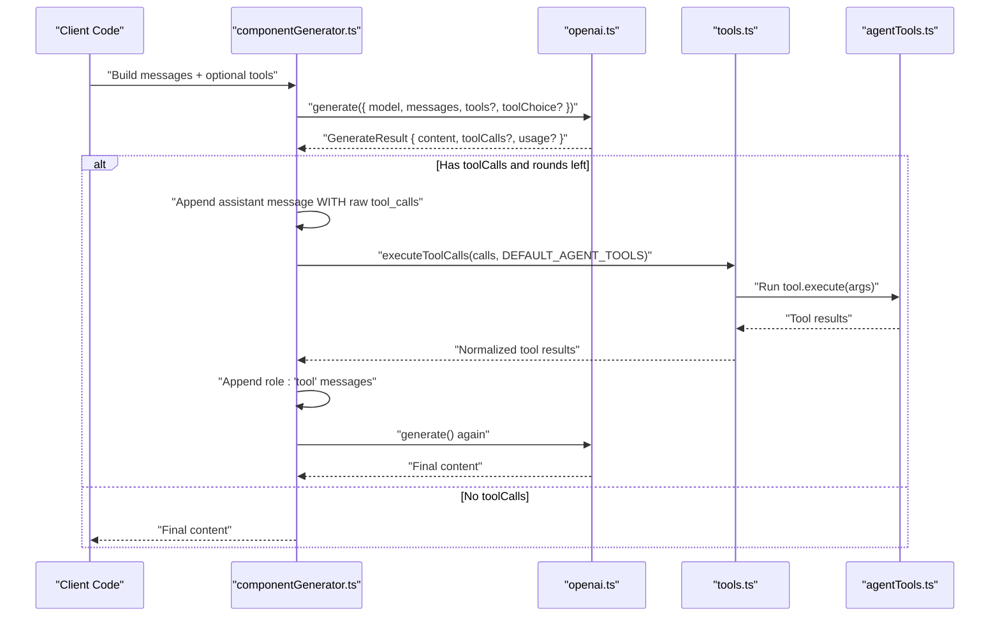
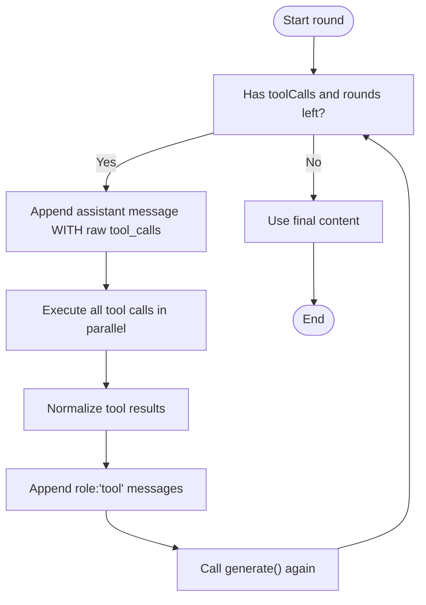
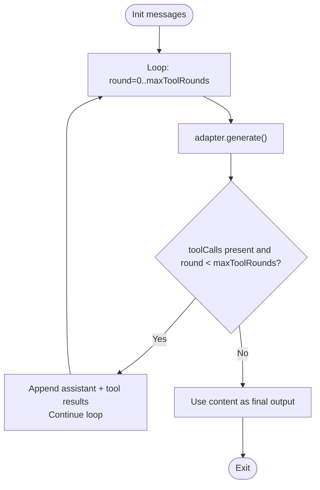
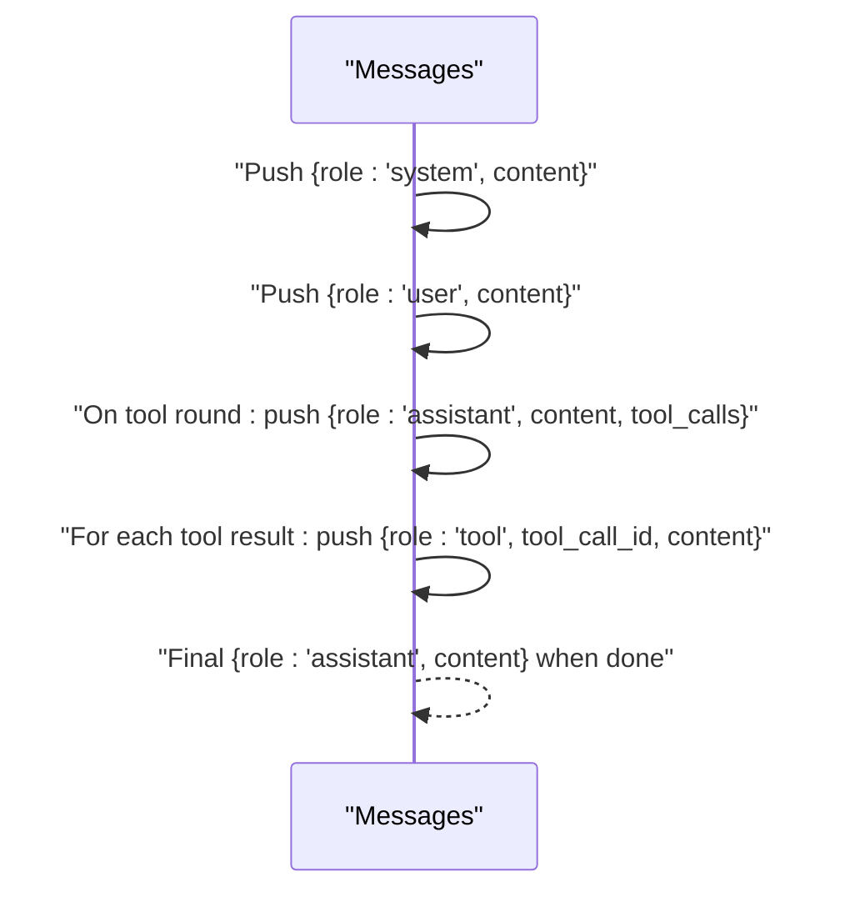
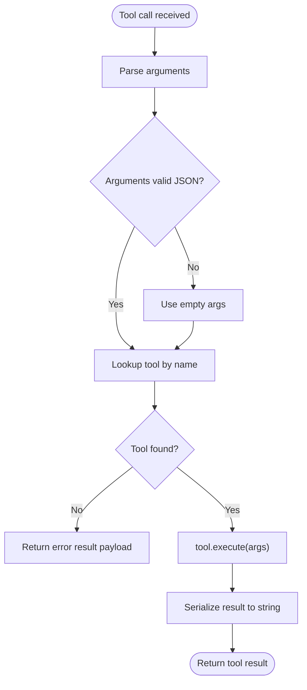
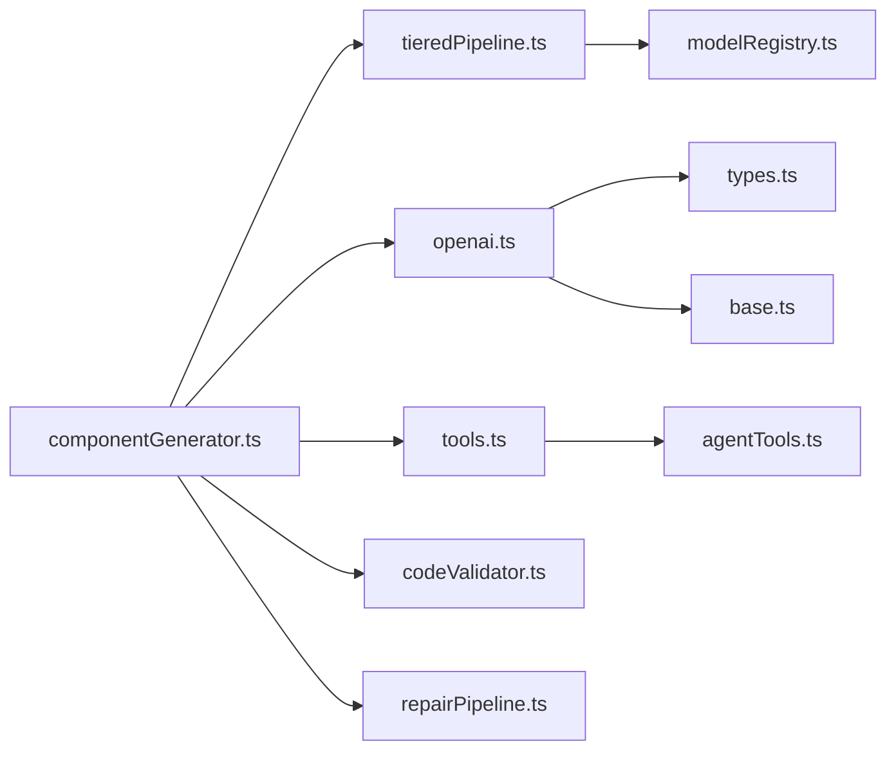

# Agentic Tool Loop Protocol

<cite>
**Referenced Files in This Document**
- [componentGenerator.ts](file://lib/ai/componentGenerator.ts)
- [tools.ts](file://lib/ai/tools.ts)
- [agentTools.ts](file://lib/ai/agentTools.ts)
- [openai.ts](file://lib/ai/adapters/openai.ts)
- [base.ts](file://lib/ai/adapters/base.ts)
- [types.ts](file://lib/ai/types.ts)
- [modelRegistry.ts](file://lib/ai/modelRegistry.ts)
- [tieredPipeline.ts](file://lib/ai/tieredPipeline.ts)
- [codeValidator.ts](file://lib/intelligence/codeValidator.ts)
- [repairPipeline.ts](file://lib/intelligence/repairPipeline.ts)
</cite>

## Table of Contents
1. [Introduction](#introduction)
2. [Project Structure](#project-structure)
3. [Core Components](#core-components)
4. [Architecture Overview](#architecture-overview)
5. [Detailed Component Analysis](#detailed-component-analysis)
6. [Dependency Analysis](#dependency-analysis)
7. [Performance Considerations](#performance-considerations)
8. [Troubleshooting Guide](#troubleshooting-guide)
9. [Conclusion](#conclusion)

## Introduction
This document explains the agentic tool loop protocol that enables iterative tool interactions between agents and external services during generation. It covers the OpenAI-compatible tool call protocol, message formatting, validation, response processing, loop control with configurable maximum rounds, termination conditions, and robust error handling. It also provides examples of successful loops, error scenarios, debugging techniques, and performance considerations.

## Project Structure
The tool loop lives in the generation orchestration layer and integrates with provider adapters, tool registries, and pipeline configuration. The key files are:
- Orchestration and loop control: [componentGenerator.ts](file://lib/ai/componentGenerator.ts)
- Unified tool types and execution: [tools.ts](file://lib/ai/tools.ts)
- Built-in agent tools: [agentTools.ts](file://lib/ai/agentTools.ts)
- Provider adapter (OpenAI): [openai.ts](file://lib/ai/adapters/openai.ts)
- Adapter interface: [base.ts](file://lib/ai/adapters/base.ts)
- Shared types: [types.ts](file://lib/ai/types.ts)
- Model capability profiles: [modelRegistry.ts](file://lib/ai/modelRegistry.ts)
- Pipeline configuration: [tieredPipeline.ts](file://lib/ai/tieredPipeline.ts)
- Code validation and repair: [codeValidator.ts](file://lib/intelligence/codeValidator.ts), [repairPipeline.ts](file://lib/intelligence/repairPipeline.ts)

**Diagram sources**
- [componentGenerator.ts:244-327](file://lib/ai/componentGenerator.ts#L244-L327)
- [tools.ts:144-174](file://lib/ai/tools.ts#L144-L174)
- [agentTools.ts:166-171](file://lib/ai/agentTools.ts#L166-L171)
- [openai.ts:64-157](file://lib/ai/adapters/openai.ts#L64-L157)
- [base.ts:34-72](file://lib/ai/adapters/base.ts#L34-L72)
- [types.ts:19-44](file://lib/ai/types.ts#L19-L44)
- [modelRegistry.ts:67-128](file://lib/ai/modelRegistry.ts#L67-L128)
- [tieredPipeline.ts:33-84](file://lib/ai/tieredPipeline.ts#L33-L84)
- [codeValidator.ts:293-341](file://lib/intelligence/codeValidator.ts#L293-L341)
- [repairPipeline.ts:256-286](file://lib/intelligence/repairPipeline.ts#L256-L286)

**Section sources**
- [componentGenerator.ts:244-327](file://lib/ai/componentGenerator.ts#L244-L327)
- [tools.ts:144-174](file://lib/ai/tools.ts#L144-L174)
- [agentTools.ts:166-171](file://lib/ai/agentTools.ts#L166-L171)
- [openai.ts:64-157](file://lib/ai/adapters/openai.ts#L64-L157)
- [base.ts:34-72](file://lib/ai/adapters/base.ts#L34-L72)
- [types.ts:19-44](file://lib/ai/types.ts#L19-L44)
- [modelRegistry.ts:67-128](file://lib/ai/modelRegistry.ts#L67-L128)
- [tieredPipeline.ts:33-84](file://lib/ai/tieredPipeline.ts#L33-L84)
- [codeValidator.ts:293-341](file://lib/intelligence/codeValidator.ts#L293-L341)
- [repairPipeline.ts:256-286](file://lib/intelligence/repairPipeline.ts#L256-L286)

## Core Components
- Tool definition and execution:
  - Unified ToolCall and Tool interfaces define the cross-provider schema.
  - Execution helper runs requested tools in parallel and returns normalized results.
- Agent tools:
  - Pre-built tools for design system lookups, Tailwind validation, and accessibility recommendations.
- Provider adapter:
  - Converts between unified types and provider-specific shapes (e.g., OpenAI tool definitions and choices).
  - Handles special cases for reasoning models and provider quirks.
- Orchestration:
  - Builds initial messages (system + user), runs the loop with configurable rounds, validates tool calls, and terminates when the model produces final output.
- Pipeline and model profiles:
  - Determines maxToolRounds, temperature, token budgets, and whether to inject tools based on model capability.

**Section sources**
- [tools.ts:47-79](file://lib/ai/tools.ts#L47-L79)
- [tools.ts:144-174](file://lib/ai/tools.ts#L144-L174)
- [agentTools.ts:26-171](file://lib/ai/agentTools.ts#L26-L171)
- [openai.ts:64-157](file://lib/ai/adapters/openai.ts#L64-L157)
- [componentGenerator.ts:244-327](file://lib/ai/componentGenerator.ts#L244-L327)
- [tieredPipeline.ts:191-235](file://lib/ai/tieredPipeline.ts#L191-L235)
- [modelRegistry.ts:67-128](file://lib/ai/modelRegistry.ts#L67-L128)

## Architecture Overview
The tool loop follows the OpenAI-compatible function/tool calling protocol strictly. The sequence is:
1. Client sends messages and tools (when enabled).
2. Model responds with an assistant message containing tool_calls.
3. Client appends the assistant message WITH the raw tool_calls array intact.
4. Client executes all requested tools in parallel and appends one role:'tool' message per call.
5. Client calls generate() again; model produces final text.

**Diagram sources**
- [componentGenerator.ts:244-327](file://lib/ai/componentGenerator.ts#L244-L327)
- [tools.ts:144-174](file://lib/ai/tools.ts#L144-L174)
- [agentTools.ts:166-171](file://lib/ai/agentTools.ts#L166-L171)
- [openai.ts:64-157](file://lib/ai/adapters/openai.ts#L64-L157)

## Detailed Component Analysis

### OpenAI-Compatible Tool Call Protocol
- Message formatting:
  - Initial messages include an optional system message followed by a user message.
  - During tool rounds, the assistant message is appended WITH the raw tool_calls array intact.
  - For each tool call, a role:'tool' message is appended with tool_call_id and content.
- Tool call validation:
  - The adapter converts provider-specific tool_call objects to the unified ToolCall format.
  - The executor validates tool names and serializes results to strings.
- Response processing:
  - The adapter normalizes toolCalls back to the unified format for the orchestrator.

**Diagram sources**
- [componentGenerator.ts:288-321](file://lib/ai/componentGenerator.ts#L288-L321)
- [tools.ts:87-106](file://lib/ai/tools.ts#L87-L106)
- [tools.ts:144-174](file://lib/ai/tools.ts#L144-L174)
- [openai.ts:142-148](file://lib/ai/adapters/openai.ts#L142-L148)

**Section sources**
- [componentGenerator.ts:255-321](file://lib/ai/componentGenerator.ts#L255-L321)
- [tools.ts:87-106](file://lib/ai/tools.ts#L87-L106)
- [tools.ts:144-174](file://lib/ai/tools.ts#L144-L174)
- [openai.ts:142-148](file://lib/ai/adapters/openai.ts#L142-L148)

### Loop Structure and Termination Conditions
- Configurable maximum rounds:
  - Determined by pipelineConfig.maxToolRounds, derived from model capability profiles.
  - Tools are only injected when the model explicitly supports tool calls.
- Termination:
  - Loop ends when the model produces final content without toolCalls.
  - If all rounds are exhausted without content, the orchestrator reports an error.

**Diagram sources**
- [componentGenerator.ts:263-327](file://lib/ai/componentGenerator.ts#L263-L327)
- [tieredPipeline.ts:191-235](file://lib/ai/tieredPipeline.ts#L191-L235)
- [modelRegistry.ts:67-128](file://lib/ai/modelRegistry.ts#L67-L128)

**Section sources**
- [componentGenerator.ts:263-327](file://lib/ai/componentGenerator.ts#L263-L327)
- [tieredPipeline.ts:191-235](file://lib/ai/tieredPipeline.ts#L191-L235)
- [modelRegistry.ts:67-128](file://lib/ai/modelRegistry.ts#L67-L128)

### Message Sequence
- System message (optional) followed by user message.
- Assistant message with tool_calls appended during tool rounds.
- Role:'tool' messages appended for each tool call result.
- Final assistant message with the model’s final text.

**Diagram sources**
- [componentGenerator.ts:255-321](file://lib/ai/componentGenerator.ts#L255-L321)

**Section sources**
- [componentGenerator.ts:255-321](file://lib/ai/componentGenerator.ts#L255-L321)

### Error Handling
- Malformed tool calls:
  - Arguments parsing failures are caught; malformed JSON yields empty args.
- Invalid tool names:
  - Executor returns an error result payload for unknown tools.
- Protocol violations:
  - Not appending assistant message with raw tool_calls or using role:'user' instead of role:'tool' violates the protocol and can cause provider errors.
- Empty output after rounds:
  - Orchestrator returns an error indicating the model did not produce content after all tool-call rounds.
- Validation and repair:
  - Post-generation validation detects structural issues; repair pipeline applies deterministic fixes and optionally an LLM-based repair agent.

**Diagram sources**
- [tools.ts:87-106](file://lib/ai/tools.ts#L87-L106)
- [tools.ts:150-174](file://lib/ai/tools.ts#L150-L174)
- [componentGenerator.ts:324-327](file://lib/ai/componentGenerator.ts#L324-L327)
- [codeValidator.ts:293-341](file://lib/intelligence/codeValidator.ts#L293-L341)
- [repairPipeline.ts:256-286](file://lib/intelligence/repairPipeline.ts#L256-L286)

**Section sources**
- [tools.ts:87-106](file://lib/ai/tools.ts#L87-L106)
- [tools.ts:150-174](file://lib/ai/tools.ts#L150-L174)
- [componentGenerator.ts:324-327](file://lib/ai/componentGenerator.ts#L324-L327)
- [codeValidator.ts:293-341](file://lib/intelligence/codeValidator.ts#L293-L341)
- [repairPipeline.ts:256-286](file://lib/intelligence/repairPipeline.ts#L256-L286)

### Examples and Debugging Techniques
- Successful tool loop:
  - The orchestrator builds messages, injects tools when supported, receives tool_calls, executes tools in parallel, appends tool results, and obtains final content.
- Error scenarios:
  - Unknown tool name: executor returns an error result payload.
  - Protocol violation: missing assistant message with raw tool_calls or incorrect role:'user' instead of role:'tool' can cause provider errors.
  - Empty output after rounds: orchestrator reports an error.
- Debugging tips:
  - Inspect raw provider responses for toolCalls and usage.
  - Verify model profile supports tool calls and that maxToolRounds is greater than zero.
  - Confirm tool definitions and choices are converted to provider format by the adapter.

**Section sources**
- [componentGenerator.ts:244-327](file://lib/ai/componentGenerator.ts#L244-L327)
- [tools.ts:150-174](file://lib/ai/tools.ts#L150-L174)
- [openai.ts:64-157](file://lib/ai/adapters/openai.ts#L64-L157)

## Dependency Analysis
The orchestrator depends on:
- Pipeline configuration to decide tool rounds and parameters.
- Model profiles to gate tool injection.
- Adapter to normalize tool calls and enforce provider-specific constraints.
- Tool registry and executor for runtime tool invocation.

**Diagram sources**
- [componentGenerator.ts:244-327](file://lib/ai/componentGenerator.ts#L244-L327)
- [tieredPipeline.ts:191-235](file://lib/ai/tieredPipeline.ts#L191-L235)
- [modelRegistry.ts:67-128](file://lib/ai/modelRegistry.ts#L67-L128)
- [openai.ts:64-157](file://lib/ai/adapters/openai.ts#L64-L157)
- [base.ts:34-72](file://lib/ai/adapters/base.ts#L34-L72)
- [types.ts:19-44](file://lib/ai/types.ts#L19-L44)
- [tools.ts:144-174](file://lib/ai/tools.ts#L144-L174)
- [agentTools.ts:166-171](file://lib/ai/agentTools.ts#L166-L171)
- [codeValidator.ts:293-341](file://lib/intelligence/codeValidator.ts#L293-L341)
- [repairPipeline.ts:256-286](file://lib/intelligence/repairPipeline.ts#L256-L286)

**Section sources**
- [componentGenerator.ts:244-327](file://lib/ai/componentGenerator.ts#L244-L327)
- [tieredPipeline.ts:191-235](file://lib/ai/tieredPipeline.ts#L191-L235)
- [modelRegistry.ts:67-128](file://lib/ai/modelRegistry.ts#L67-L128)
- [openai.ts:64-157](file://lib/ai/adapters/openai.ts#L64-L157)
- [base.ts:34-72](file://lib/ai/adapters/base.ts#L34-L72)
- [types.ts:19-44](file://lib/ai/types.ts#L19-L44)
- [tools.ts:144-174](file://lib/ai/tools.ts#L144-L174)
- [agentTools.ts:166-171](file://lib/ai/agentTools.ts#L166-L171)
- [codeValidator.ts:293-341](file://lib/intelligence/codeValidator.ts#L293-L341)
- [repairPipeline.ts:256-286](file://lib/intelligence/repairPipeline.ts#L256-L286)

## Performance Considerations
- Parallel tool execution:
  - Tools are executed concurrently using Promise.allSettled to minimize latency.
- Token budgeting:
  - Pipeline configuration caps maxOutputTokens and system prompt length to prevent overflows.
- Streaming:
  - Streaming is disabled for models where it is unreliable; otherwise enabled to improve perceived latency.
- Repair strategy:
  - Cloud tiers use rules-only repair to avoid extra LLM calls; cheaper tiers may use an auxiliary model for repair.

**Section sources**
- [tools.ts:150-174](file://lib/ai/tools.ts#L150-L174)
- [tieredPipeline.ts:191-235](file://lib/ai/tieredPipeline.ts#L191-L235)
- [modelRegistry.ts:67-128](file://lib/ai/modelRegistry.ts#L67-L128)
- [repairPipeline.ts:256-286](file://lib/intelligence/repairPipeline.ts#L256-L286)

## Troubleshooting Guide
- Symptom: Silent 400 or no-body responses after tool calls
  - Cause: Using tools with models that do not support tool calls or sending tools to unknown/proxy endpoints.
  - Fix: Ensure model profile supports tool calls and that maxToolRounds > 0; only inject tools for explicitly registered models.
- Symptom: Role mismatch causing provider errors
  - Cause: Using role:'user' instead of role:'tool' for tool results.
  - Fix: Always append role:'tool' messages with tool_call_id and content.
- Symptom: Missing assistant message with raw tool_calls
  - Cause: Omitting the assistant message that contains the original tool_calls array.
  - Fix: Preserve and re-append the assistant message with the raw tool_calls array intact.
- Symptom: Empty component code after all rounds
  - Cause: Model did not produce content despite tool rounds.
  - Fix: Review prompt quality, tool relevance, and increase maxToolRounds cautiously.

**Section sources**
- [componentGenerator.ts:266-268](file://lib/ai/componentGenerator.ts#L266-L268)
- [componentGenerator.ts:288-321](file://lib/ai/componentGenerator.ts#L288-L321)
- [componentGenerator.ts:324-327](file://lib/ai/componentGenerator.ts#L324-L327)
- [openai.ts:103-111](file://lib/ai/adapters/openai.ts#L103-L111)

## Conclusion
The agentic tool loop protocol is a strict, provider-agnostic extension of the OpenAI function/tool calling pattern. The orchestrator enforces protocol compliance, validates tool calls, and terminates when the model produces final output. Robust error handling, token budgeting, and configurable pipeline tiers ensure reliability across diverse models and providers. By following the documented message sequence, validation rules, and troubleshooting steps, developers can implement dependable tool loops that enhance agent capabilities while maintaining stability and performance.