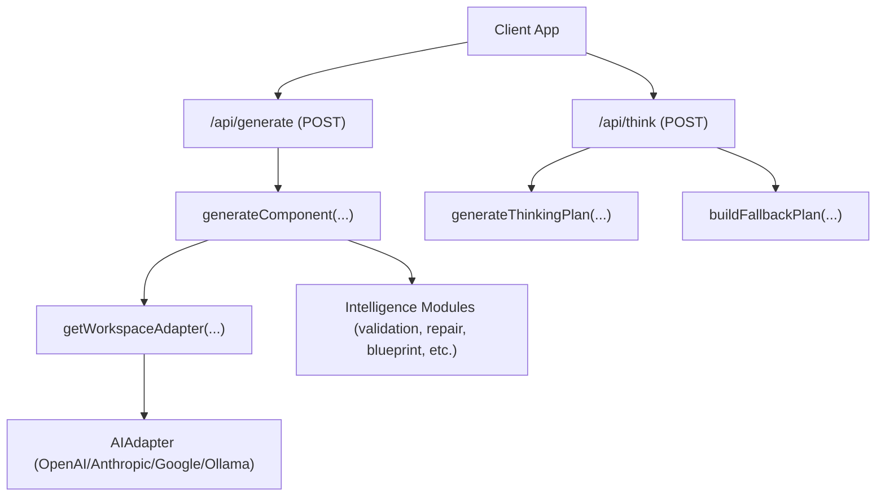
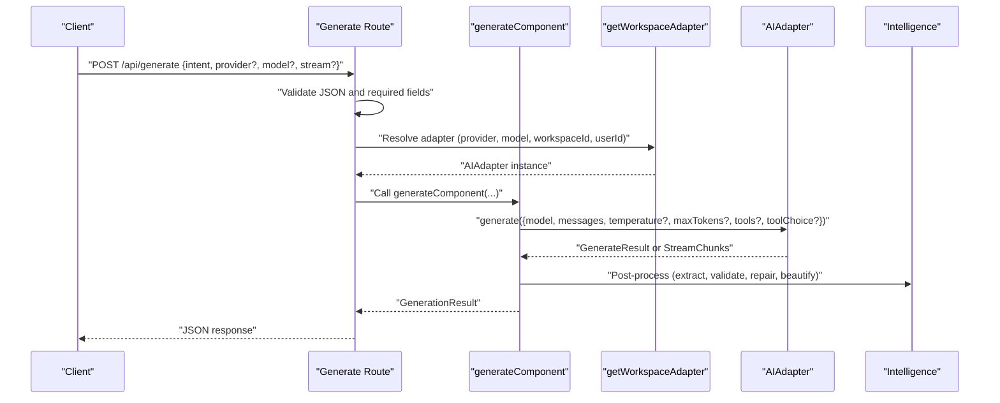
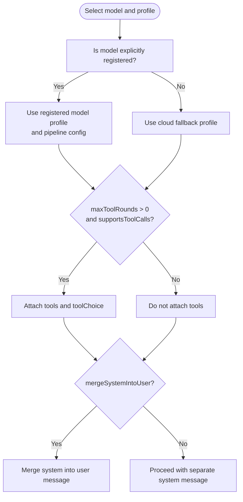
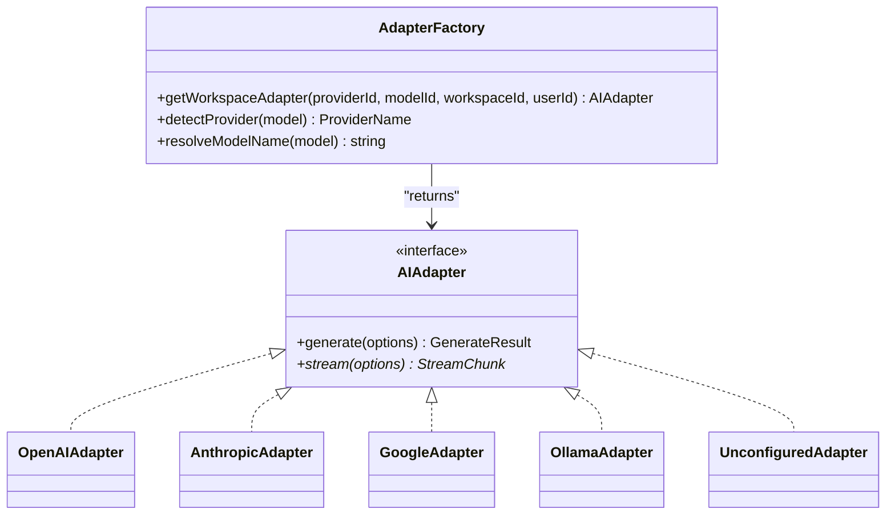
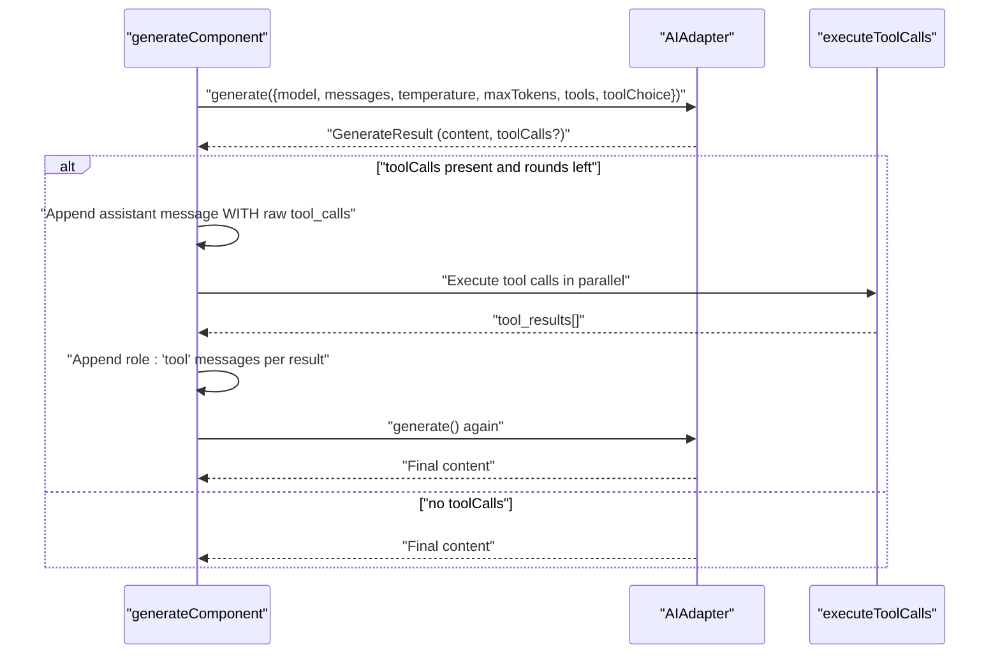
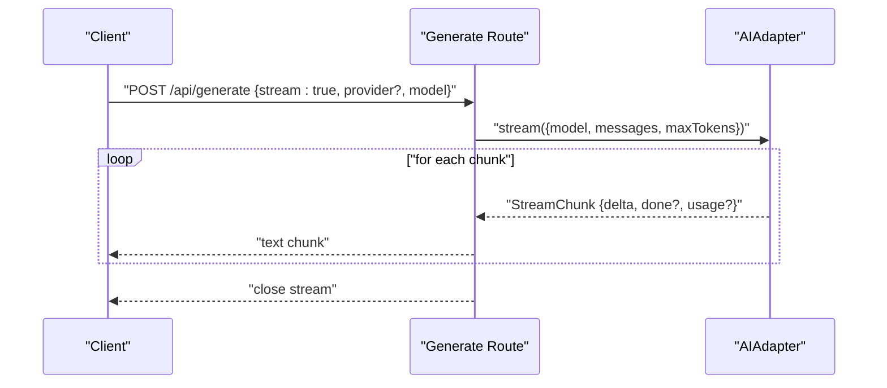
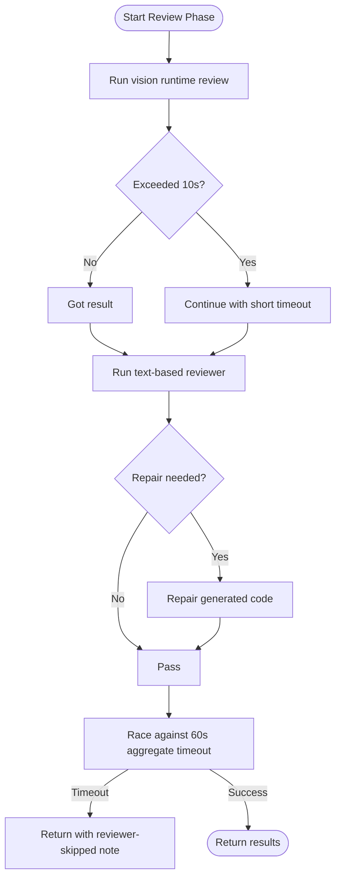
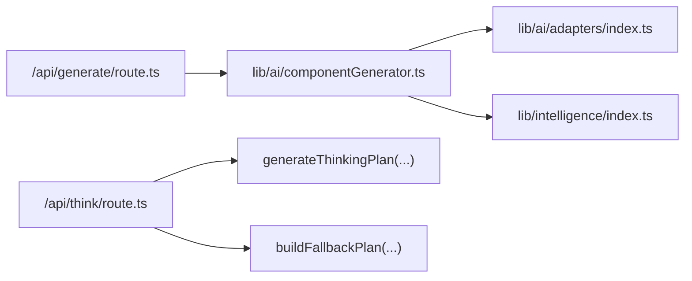

# Communication Protocols

<cite>
**Referenced Files in This Document**
- [README.md](file://README.md)
- [AGENTS.md](file://AGENTS.md)
- [app/api/generate/route.ts](file://app/api/generate/route.ts)
- [app/api/think/route.ts](file://app/api/think/route.ts)
- [lib/ai/adapters/index.ts](file://lib/ai/adapters/index.ts)
- [lib/ai/types.ts](file://lib/ai/types.ts)
- [lib/ai/componentGenerator.ts](file://lib/ai/componentGenerator.ts)
- [lib/intelligence/index.ts](file://lib/intelligence/index.ts)
</cite>

## Table of Contents
1. [Introduction](#introduction)
2. [Project Structure](#project-structure)
3. [Core Components](#core-components)
4. [Architecture Overview](#architecture-overview)
5. [Detailed Component Analysis](#detailed-component-analysis)
6. [Dependency Analysis](#dependency-analysis)
7. [Performance Considerations](#performance-considerations)
8. [Troubleshooting Guide](#troubleshooting-guide)
9. [Conclusion](#conclusion)

## Introduction
This document explains the communication protocols used for agent-to-agent and agent-to-service interactions in the system. It covers standardized message formats, data serialization, protocol versioning, adapter communication patterns enabling model-agnostic agent interactions, tool call protocol specifics, error propagation, timeouts and retries, protocol negotiation for model capabilities, and security considerations including authentication.

## Project Structure
The system exposes two primary API endpoints that orchestrate agent workflows:
- Generation endpoint: receives a request, validates inputs, resolves an adapter, streams or executes generation, and returns structured results.
- Thinking plan endpoint: generates a reasoning plan aligned with the user’s intent and provider configuration.

**Diagram sources**
- [app/api/generate/route.ts:25-440](file://app/api/generate/route.ts#L25-L440)
- [app/api/think/route.ts:8-79](file://app/api/think/route.ts#L8-L79)
- [lib/ai/adapters/index.ts:236-278](file://lib/ai/adapters/index.ts#L236-L278)
- [lib/ai/componentGenerator.ts:60-402](file://lib/ai/componentGenerator.ts#L60-L402)
- [lib/intelligence/index.ts:1-13](file://lib/intelligence/index.ts#L1-L13)

**Section sources**
- [README.md:1-37](file://README.md#L1-L37)
- [AGENTS.md:1-6](file://AGENTS.md#L1-L6)

## Core Components
- Message and result types define the standardized payload contracts for generation and streaming.
- Adapter factory resolves credentials securely and returns a provider-agnostic adapter implementing the generation and streaming interfaces.
- Generation orchestrator coordinates model-aware prompting, tool calls, extraction, validation, and repair, while respecting model capabilities and budgets.
- Intelligence modules provide validation, repair, blueprint selection, design rules, and related utilities.

**Section sources**
- [lib/ai/types.ts:12-55](file://lib/ai/types.ts#L12-L55)
- [lib/ai/adapters/index.ts:15-306](file://lib/ai/adapters/index.ts#L15-L306)
- [lib/ai/componentGenerator.ts:43-58](file://lib/ai/componentGenerator.ts#L43-L58)
- [lib/intelligence/index.ts:1-13](file://lib/intelligence/index.ts#L1-L13)

## Architecture Overview
The system enforces strict separation of concerns:
- Client requests are validated and normalized.
- Secure credential resolution occurs server-side via workspace-scoped keys or environment variables.
- A provider-agnostic adapter encapsulates protocol differences.
- Agents (planner, generator, reviewer, validator) communicate via standardized messages and tool call semantics.

**Diagram sources**
- [app/api/generate/route.ts:25-440](file://app/api/generate/route.ts#L25-L440)
- [lib/ai/adapters/index.ts:236-278](file://lib/ai/adapters/index.ts#L236-L278)
- [lib/ai/componentGenerator.ts:60-402](file://lib/ai/componentGenerator.ts#L60-L402)

## Detailed Component Analysis

### Standardized Message Formats and Data Serialization
- Messages: role-based arrays with string content.
- Generation options: model identifier, messages, optional temperature and maxTokens, and responseFormat hint.
- Generation result: content string, optional toolCalls array, optional usage metrics, and raw provider response for debugging.
- Streaming: incremental delta chunks with done flag and optional final usage.

These types are shared client-side and server-side to ensure compatibility across environments.

**Section sources**
- [lib/ai/types.ts:10-15](file://lib/ai/types.ts#L10-L15)
- [lib/ai/types.ts:19-27](file://lib/ai/types.ts#L19-L27)
- [lib/ai/types.ts:29-44](file://lib/ai/types.ts#L29-L44)
- [lib/ai/types.ts:48-55](file://lib/ai/types.ts#L48-L55)

### Protocol Negotiation and Model Capability Profiles
- The generator selects a model profile and pipeline configuration based on the model’s registered capabilities.
- Tool calls are only enabled when the model profile explicitly supports tool calls; otherwise, they are omitted to prevent silent failures.
- For providers that do not honor system roles, the system merges system content into the user message.

**Diagram sources**
- [lib/ai/componentGenerator.ts:90-96](file://lib/ai/componentGenerator.ts#L90-L96)
- [lib/ai/componentGenerator.ts:266-268](file://lib/ai/componentGenerator.ts#L266-L268)
- [lib/ai/componentGenerator.ts:231-234](file://lib/ai/componentGenerator.ts#L231-L234)

**Section sources**
- [lib/ai/componentGenerator.ts:90-96](file://lib/ai/componentGenerator.ts#L90-L96)
- [lib/ai/componentGenerator.ts:266-268](file://lib/ai/componentGenerator.ts#L266-L268)
- [lib/ai/componentGenerator.ts:231-234](file://lib/ai/componentGenerator.ts#L231-L234)

### Adapter Communication Patterns and Credential Resolution
- The adapter factory resolves credentials server-side from workspace-scoped keys or environment variables, never accepting client-provided API keys or base URLs.
- It supports named adapters (OpenAI, Anthropic, Google, Ollama/LM Studio/Groq/HuggingFace via compatibility) and returns an unconfigured adapter gracefully when credentials are missing.
- The adapter wraps the underlying implementation with caching and metrics dispatch.

**Diagram sources**
- [lib/ai/adapters/index.ts:15-306](file://lib/ai/adapters/index.ts#L15-L306)

**Section sources**
- [lib/ai/adapters/index.ts:236-278](file://lib/ai/adapters/index.ts#L236-L278)
- [lib/ai/adapters/index.ts:146-215](file://lib/ai/adapters/index.ts#L146-L215)

### Tool Call Protocol Specifics
- Tool calls are attached only when the model profile supports them and when maxToolRounds permits.
- The client must preserve the assistant message containing the raw tool_calls array intact and append one role:'tool' message per tool call with the tool_call_id and content.
- Tool choice is set to auto to allow the model to decide which tools to invoke.

**Diagram sources**
- [lib/ai/componentGenerator.ts:270-322](file://lib/ai/componentGenerator.ts#L270-L322)

**Section sources**
- [lib/ai/componentGenerator.ts:244-322](file://lib/ai/componentGenerator.ts#L244-L322)

### Streaming and Text Streaming Responses
- When the client requests streaming, the route starts a ReadableStream and yields incremental deltas from the adapter’s stream.
- The route returns a text stream response and handles stream errors by appending an error marker.

**Diagram sources**
- [app/api/generate/route.ts:55-97](file://app/api/generate/route.ts#L55-L97)
- [lib/ai/types.ts:48-55](file://lib/ai/types.ts#L48-L55)

**Section sources**
- [app/api/generate/route.ts:55-97](file://app/api/generate/route.ts#L55-L97)

### Error Propagation, Timeouts, and Retry Strategies
- Input validation errors return structured 400 responses with reasons and suggestions.
- Generation and review failures return 422 or 500 depending on context; the system logs detailed metadata (model/provider) to aid diagnosis.
- The review pipeline enforces a 60-second aggregate timeout to prevent exceeding platform limits; partial results are returned when appropriate.
- A short hard timeout is used for vision runtime review to avoid long cold-start delays.
- The adapter caches results to reduce repeated calls and improve latency.

**Diagram sources**
- [app/api/generate/route.ts:242-312](file://app/api/generate/route.ts#L242-L312)

**Section sources**
- [app/api/generate/route.ts:39-46](file://app/api/generate/route.ts#L39-L46)
- [app/api/generate/route.ts:196-208](file://app/api/generate/route.ts#L196-L208)
- [app/api/generate/route.ts:242-312](file://app/api/generate/route.ts#L242-L312)

### Protocol Versioning
- The system does not expose explicit protocol version fields in the documented endpoints or types.
- Versioning is implicitly managed by provider-specific base URLs and model identifiers; compatibility is handled by the adapter factory and model profiles.

**Section sources**
- [lib/ai/adapters/index.ts:42-48](file://lib/ai/adapters/index.ts#L42-L48)
- [lib/ai/types.ts:59-67](file://lib/ai/types.ts#L59-L67)

### Security Considerations and Authentication
- The generation route requires authentication and reads workspace context from headers.
- The adapter factory resolves credentials server-side and never accepts client-provided API keys or base URLs.
- The thinking route also requires authentication and uses workspace context for plan generation.
- The system avoids exposing secrets by design and surfaces configuration errors when credentials are missing.

**Section sources**
- [app/api/generate/route.ts:57-66](file://app/api/generate/route.ts#L57-L66)
- [app/api/generate/route.ts:177-181](file://app/api/generate/route.ts#L177-L181)
- [app/api/think/route.ts:36-40](file://app/api/think/route.ts#L36-L40)
- [lib/ai/adapters/index.ts:236-278](file://lib/ai/adapters/index.ts#L236-L278)

## Dependency Analysis
The generation pipeline composes several modules:
- Routes depend on the generation orchestrator and adapter factory.
- The generator depends on intelligence modules for validation, repair, blueprint selection, and design rules.
- The adapter factory depends on workspace key service and environment variables.

**Diagram sources**
- [app/api/generate/route.ts:25-440](file://app/api/generate/route.ts#L25-L440)
- [lib/ai/componentGenerator.ts:60-402](file://lib/ai/componentGenerator.ts#L60-L402)
- [lib/ai/adapters/index.ts:15-306](file://lib/ai/adapters/index.ts#L15-L306)
- [lib/intelligence/index.ts:1-13](file://lib/intelligence/index.ts#L1-L13)
- [app/api/think/route.ts:8-79](file://app/api/think/route.ts#L8-L79)

**Section sources**
- [app/api/generate/route.ts:25-440](file://app/api/generate/route.ts#L25-L440)
- [lib/ai/componentGenerator.ts:60-402](file://lib/ai/componentGenerator.ts#L60-L402)
- [lib/ai/adapters/index.ts:15-306](file://lib/ai/adapters/index.ts#L15-L306)
- [lib/intelligence/index.ts:1-13](file://lib/intelligence/index.ts#L1-L13)
- [app/api/think/route.ts:8-79](file://app/api/think/route.ts#L8-L79)

## Performance Considerations
- Caching: The adapter wraps implementations with caching to reduce repeated calls and improve latency.
- Parallelization: Accessibility validation and test generation run in parallel with generation.
- Token budget enforcement: The system trims optional context to fit model-specific constraints.
- Streaming: Enables responsive delivery of incremental results.

**Section sources**
- [lib/ai/adapters/index.ts:82-138](file://lib/ai/adapters/index.ts#L82-L138)
- [app/api/generate/route.ts:329-352](file://app/api/generate/route.ts#L329-L352)
- [lib/ai/componentGenerator.ts:110-138](file://lib/ai/componentGenerator.ts#L110-L138)

## Troubleshooting Guide
Common issues and diagnostics:
- Invalid JSON or missing fields in requests: the routes return structured 400 responses with error details.
- Generation failures: the routes log model/provider metadata and return 422 with error messages.
- Review phase timeouts: partial results are returned with reviewer-skipped notes; adjust provider/model or increase budget.
- Configuration errors: when credentials are missing, the adapter factory returns an unconfigured adapter or throws a configuration error; configure workspace keys or environment variables.

Debugging tips:
- Inspect request logs for model/provider context and error stacks.
- Verify workspace headers and authentication tokens.
- Confirm provider/model combinations supported by the adapter factory and model profiles.

**Section sources**
- [app/api/generate/route.ts:39-46](file://app/api/generate/route.ts#L39-L46)
- [app/api/generate/route.ts:196-208](file://app/api/generate/route.ts#L196-L208)
- [app/api/generate/route.ts:242-312](file://app/api/generate/route.ts#L242-L312)
- [lib/ai/adapters/index.ts:274-278](file://lib/ai/adapters/index.ts#L274-L278)

## Conclusion
The system implements a robust, model-agnostic communication framework centered on standardized message and result types, secure credential resolution, and capability-aware protocol negotiation. Tool call semantics are strictly enforced, and the pipeline incorporates streaming, caching, parallelization, and defensive timeouts to ensure reliability and performance. Authentication and workspace scoping protect sensitive configurations, while structured error responses and logging facilitate troubleshooting.