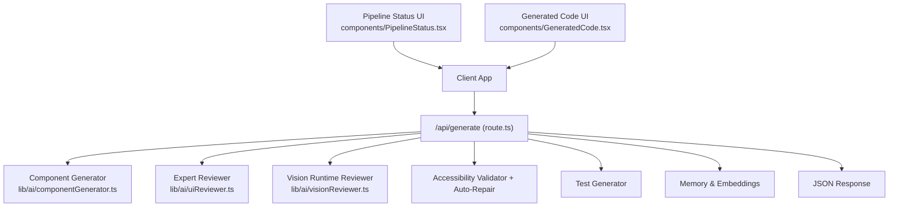
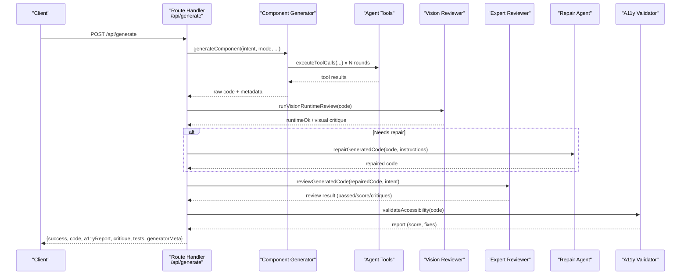
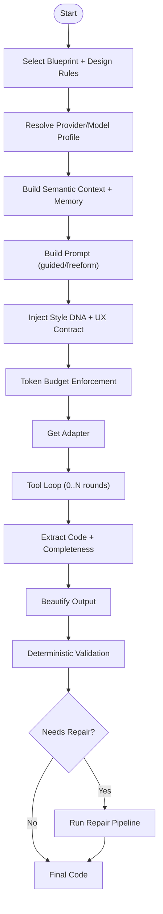
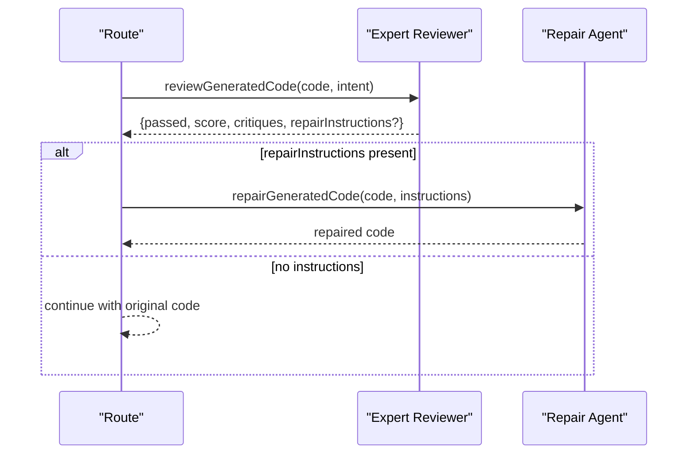
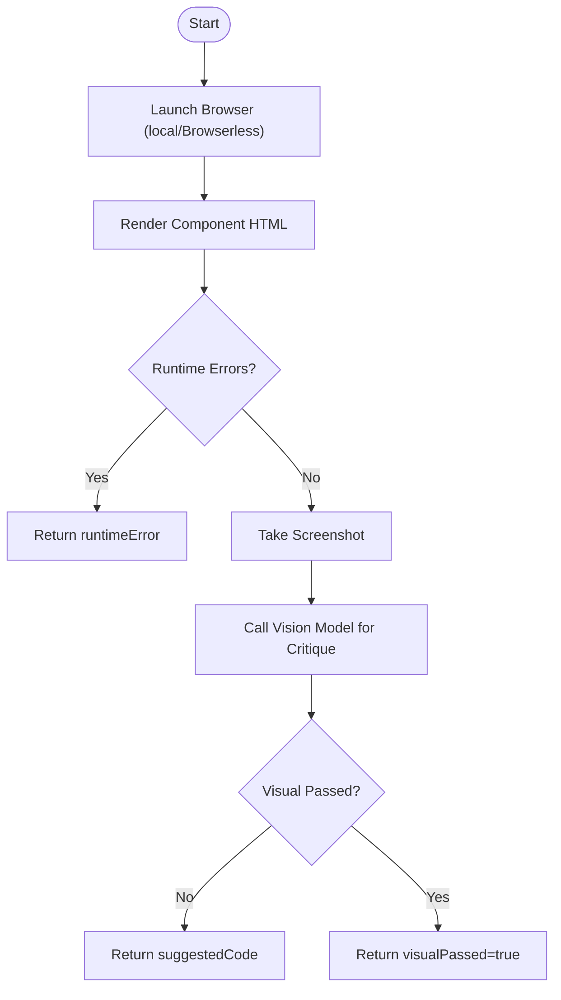
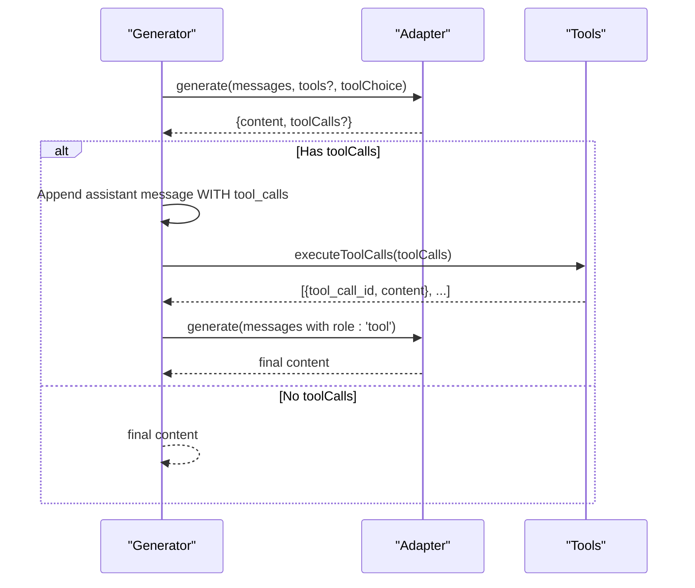
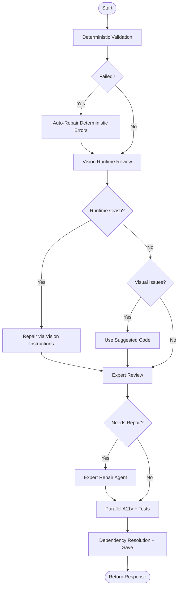
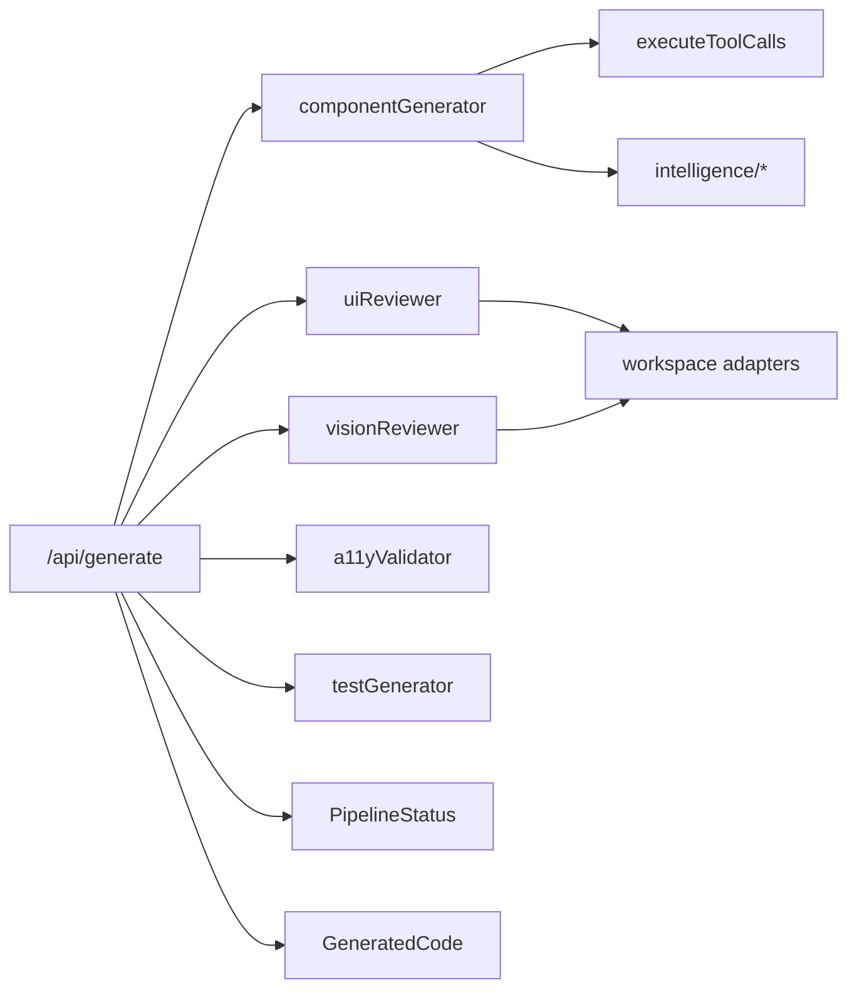

# Multi-Agent Orchestration

<cite>
**Referenced Files in This Document**
- [README.md](file://README.md)
- [AGENTS.md](file://AGENTS.md)
- [app/api/generate/route.ts](file://app/api/generate/route.ts)
- [lib/ai/componentGenerator.ts](file://lib/ai/componentGenerator.ts)
- [lib/ai/uiReviewer.ts](file://lib/ai/uiReviewer.ts)
- [lib/ai/visionReviewer.ts](file://lib/ai/visionReviewer.ts)
- [components/PipelineStatus.tsx](file://components/PipelineStatus.tsx)
- [components/GeneratedCode.tsx](file://components/GeneratedCode.tsx)
</cite>

## Table of Contents
1. [Introduction](#introduction)
2. [Project Structure](#project-structure)
3. [Core Components](#core-components)
4. [Architecture Overview](#architecture-overview)
5. [Detailed Component Analysis](#detailed-component-analysis)
6. [Dependency Analysis](#dependency-analysis)
7. [Performance Considerations](#performance-considerations)
8. [Troubleshooting Guide](#troubleshooting-guide)
9. [Conclusion](#conclusion)

## Introduction
This document explains the multi-agent generation orchestration system that coordinates intelligent agents to generate, validate, review, and repair UI components. It covers the agent workflow (component generator, expert reviewer, and AI repair agent), the tool execution system enabling external operations, the agentic tool loop protocol, and the end-to-end repair pipeline. It also documents expert review mechanisms, auto-repair coordination, and practical examples of agent interactions and troubleshooting.

## Project Structure
The generation pipeline is exposed as a serverless API endpoint and orchestrated by a central route handler. The UI rendering and status visualization are handled by frontend components.

**Diagram sources**
- [app/api/generate/route.ts:25-440](file://app/api/generate/route.ts#L25-L440)
- [lib/ai/componentGenerator.ts:60-402](file://lib/ai/componentGenerator.ts#L60-L402)
- [lib/ai/uiReviewer.ts:58-199](file://lib/ai/uiReviewer.ts#L58-L199)
- [lib/ai/visionReviewer.ts:30-181](file://lib/ai/visionReviewer.ts#L30-L181)
- [components/PipelineStatus.tsx:77-219](file://components/PipelineStatus.tsx#L77-L219)
- [components/GeneratedCode.tsx:14-149](file://components/GeneratedCode.tsx#L14-L149)

**Section sources**
- [README.md:1-37](file://README.md#L1-L37)
- [AGENTS.md:1-6](file://AGENTS.md#L1-L6)

## Core Components
- Component Generator: Orchestrates model selection, prompt building, tool-enabled agent loops, code extraction, beautification, and deterministic validation with optional AI repair.
- Expert Reviewer: Evaluates generated code against strict UI quality criteria and optionally instructs the repair agent.
- AI Repair Agent: Applies targeted fixes to improve layout, spacing, modularity, and Tailwind correctness.
- Vision Runtime Reviewer: Renders the component in a browser-like environment, detects runtime errors, and optionally suggests visual fixes.
- Pipeline Coordinator: Validates inputs, manages parallel steps, applies safety checks, and returns a unified response with metadata.

**Section sources**
- [lib/ai/componentGenerator.ts:60-402](file://lib/ai/componentGenerator.ts#L60-L402)
- [lib/ai/uiReviewer.ts:58-199](file://lib/ai/uiReviewer.ts#L58-L199)
- [lib/ai/visionReviewer.ts:30-181](file://lib/ai/visionReviewer.ts#L30-L181)
- [app/api/generate/route.ts:25-440](file://app/api/generate/route.ts#L25-L440)

## Architecture Overview
The system integrates a model-agnostic generation engine with a tool-enabled loop, followed by expert review and optional AI repair. Parallel validations (accessibility and tests) finalize the pipeline.

**Diagram sources**
- [app/api/generate/route.ts:25-440](file://app/api/generate/route.ts#L25-L440)
- [lib/ai/componentGenerator.ts:244-322](file://lib/ai/componentGenerator.ts#L244-L322)
- [lib/ai/uiReviewer.ts:58-126](file://lib/ai/uiReviewer.ts#L58-L126)
- [lib/ai/visionReviewer.ts:30-137](file://lib/ai/visionReviewer.ts#L30-L137)

## Detailed Component Analysis

### Component Generator
The generator builds a model-aware prompt, enforces token budgets, and executes an agentic tool loop with configurable rounds. It extracts and beautifies code, validates deterministically, and optionally repairs using a repair pipeline.

**Diagram sources**
- [lib/ai/componentGenerator.ts:77-391](file://lib/ai/componentGenerator.ts#L77-L391)

**Section sources**
- [lib/ai/componentGenerator.ts:60-402](file://lib/ai/componentGenerator.ts#L60-L402)

### Expert Reviewer and AI Repair Agent
The expert reviewer evaluates UI quality and returns structured JSON indicating pass/fail, score, critiques, and optional repair instructions. The repair agent then fixes the code according to the instructions.

**Diagram sources**
- [lib/ai/uiReviewer.ts:58-199](file://lib/ai/uiReviewer.ts#L58-L199)

**Section sources**
- [lib/ai/uiReviewer.ts:58-199](file://lib/ai/uiReviewer.ts#L58-L199)

### Vision Runtime Reviewer
The vision reviewer renders the component in a browser-like environment, captures screenshots, and requests a visual critique. It reports runtime errors and optional suggested code.

**Diagram sources**
- [lib/ai/visionReviewer.ts:30-181](file://lib/ai/visionReviewer.ts#L30-L181)

**Section sources**
- [lib/ai/visionReviewer.ts:30-181](file://lib/ai/visionReviewer.ts#L30-L181)

### Tool Execution System and Agentic Tool Loop Protocol
The generator conditionally enables tools based on model profiles and executes tool calls in parallel. It adheres to the OpenAI tool-call protocol by preserving assistant messages with tool_calls and appending role:'tool' results.

**Diagram sources**
- [lib/ai/componentGenerator.ts:244-322](file://lib/ai/componentGenerator.ts#L244-L322)

**Section sources**
- [lib/ai/componentGenerator.ts:244-322](file://lib/ai/componentGenerator.ts#L244-L322)

### Repair Pipeline Orchestration and Expert Review Coordination
The route coordinates expert review and repair, applying timeouts to avoid long-running operations and ensuring failures do not block valid code. It also sanitizes code for browser compatibility and performs parallel accessibility and test generation.

**Diagram sources**
- [app/api/generate/route.ts:214-412](file://app/api/generate/route.ts#L214-L412)

**Section sources**
- [app/api/generate/route.ts:214-412](file://app/api/generate/route.ts#L214-L412)

### UI Components for Pipeline Status and Generated Code
- PipelineStatus: Visualizes pipeline stages and error states, including unauthorized session handling.
- GeneratedCode: Provides copy/download actions and a code editor for the generated component.

**Section sources**
- [components/PipelineStatus.tsx:77-219](file://components/PipelineStatus.tsx#L77-L219)
- [components/GeneratedCode.tsx:14-149](file://components/GeneratedCode.tsx#L14-L149)

## Dependency Analysis
The route handler depends on the generator, reviewer, vision reviewer, validators, and test generator. The generator depends on adapters, tool execution, and intelligence modules. The reviewer and vision reviewer depend on workspace adapters and environment configuration.

**Diagram sources**
- [app/api/generate/route.ts:25-440](file://app/api/generate/route.ts#L25-L440)
- [lib/ai/componentGenerator.ts:16-42](file://lib/ai/componentGenerator.ts#L16-L42)
- [lib/ai/uiReviewer.ts:1-3](file://lib/ai/uiReviewer.ts#L1-L3)
- [lib/ai/visionReviewer.ts:1-2](file://lib/ai/visionReviewer.ts#L1-L2)

**Section sources**
- [app/api/generate/route.ts:25-440](file://app/api/generate/route.ts#L25-L440)
- [lib/ai/componentGenerator.ts:16-42](file://lib/ai/componentGenerator.ts#L16-L42)
- [lib/ai/uiReviewer.ts:1-3](file://lib/ai/uiReviewer.ts#L1-L3)
- [lib/ai/visionReviewer.ts:1-2](file://lib/ai/visionReviewer.ts#L1-L2)

## Performance Considerations
- Streaming generation is supported for immediate text chunks when requested.
- The expert review and repair phases are skipped for local/Ollama models to avoid expensive inference calls.
- A 60-second aggregate timeout bounds the review phase to prevent exceeding platform limits.
- Parallel execution of accessibility validation and test generation reduces total latency.
- Token budget enforcement and context trimming prevent prompt overflow on smaller models.

[No sources needed since this section provides general guidance]

## Troubleshooting Guide
Common issues and resolutions:
- Invalid JSON or missing intent in request body: The route returns a 400 error with details.
- Prompt or mode validation failures: The route returns a 400 error with suggestions.
- Generation failures: The route logs the error and returns a 422 with the error message.
- Expert reviewer unavailable (quota or provider errors): The route continues with a warning and passes the code.
- Vision reviewer unavai lable (missing Playwright or Browserless): The route logs a warning and continues without blocking.
- Browser safety validation fails: The route returns a 422 with unsafe patterns identified.
- Session expired during pipeline: The UI displays a sign-in prompt.

**Section sources**
- [app/api/generate/route.ts:29-47, 100-129, 196-208, 317-326, 296-301, 167-170:29-47](file://app/api/generate/route.ts#L29-L47)
- [lib/ai/uiReviewer.ts:115-125](file://lib/ai/uiReviewer.ts#L115-L125)
- [lib/ai/visionReviewer.ts:117-136](file://lib/ai/visionReviewer.ts#L117-L136)
- [components/PipelineStatus.tsx:166-215](file://components/PipelineStatus.tsx#L166-L215)

## Conclusion
The multi-agent orchestration system combines a model-agnostic generator with a tool-enabled loop, expert review, and AI repair to produce high-quality, accessible UI components. The route handler coordinates deterministic validation, parallel accessibility and testing, and safe code delivery, while the UI components provide clear feedback and actions. The design balances performance, reliability, and extensibility across providers and environments.