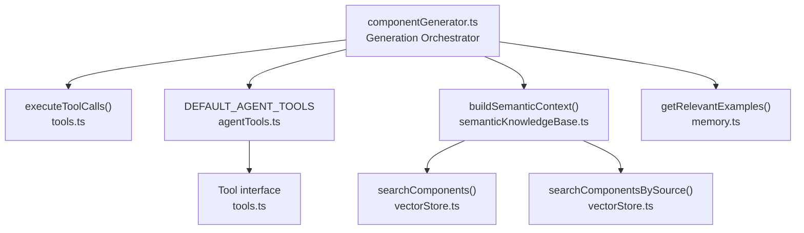
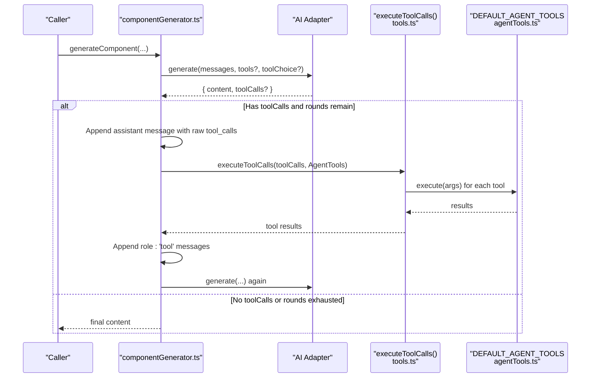
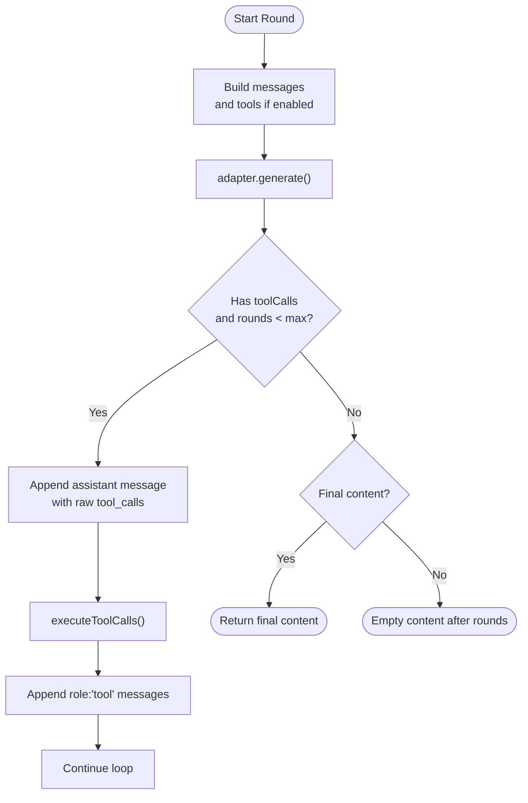
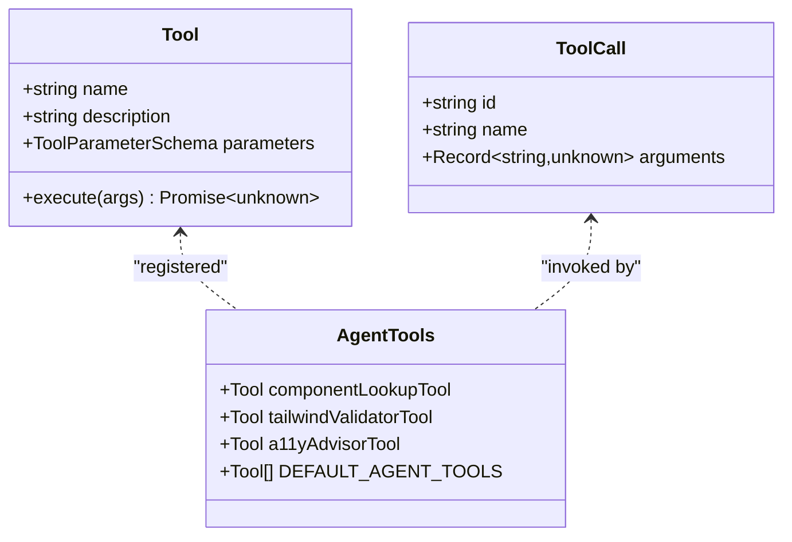
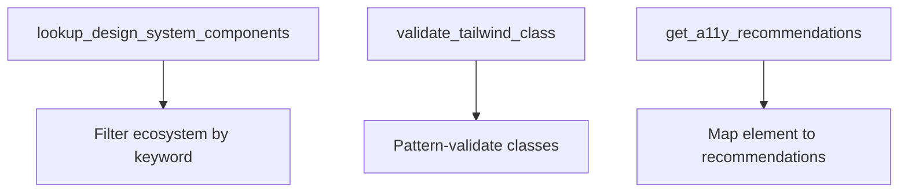
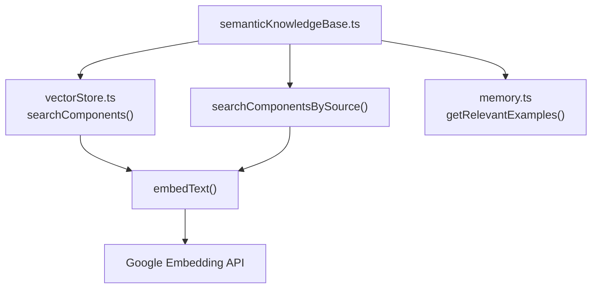
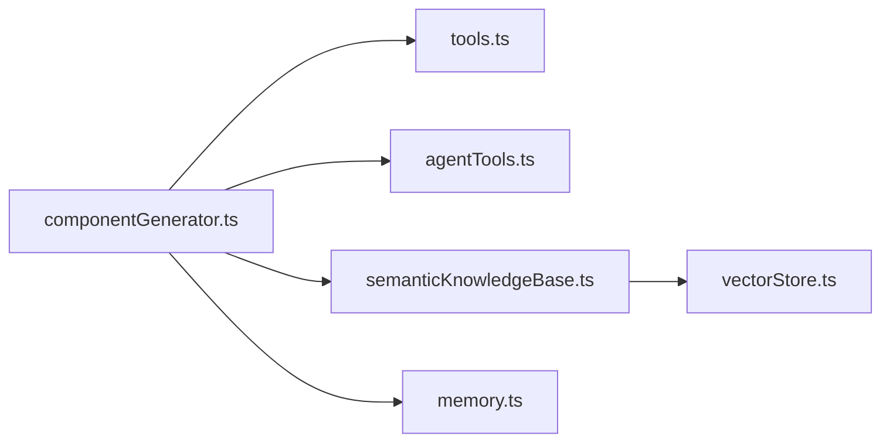

# Tool Execution System

<cite>
**Referenced Files in This Document**
- [agentTools.ts](file://lib/ai/agentTools.ts)
- [tools.ts](file://lib/ai/tools.ts)
- [componentGenerator.ts](file://lib/ai/componentGenerator.ts)
- [semanticKnowledgeBase.ts](file://lib/ai/semanticKnowledgeBase.ts)
- [vectorStore.ts](file://lib/ai/vectorStore.ts)
- [memory.ts](file://lib/ai/memory.ts)
</cite>

## Table of Contents
1. [Introduction](#introduction)
2. [Project Structure](#project-structure)
3. [Core Components](#core-components)
4. [Architecture Overview](#architecture-overview)
5. [Detailed Component Analysis](#detailed-component-analysis)
6. [Dependency Analysis](#dependency-analysis)
7. [Performance Considerations](#performance-considerations)
8. [Troubleshooting Guide](#troubleshooting-guide)
9. [Conclusion](#conclusion)

## Introduction
This document describes the tool execution system that enables agents to perform external operations and retrieve contextual information. It explains the tool call protocol, parameter serialization, result processing, and the agent tool loop that supports multiple tool rounds with proper state management. It also documents the available agent tools, tool registration, function signatures, error handling, timeouts, retries, and performance optimizations.

## Project Structure
The tool execution system spans several modules:
- Agent tools: pre-built tools for design system lookups, Tailwind validation, and accessibility recommendations.
- Tool orchestration: unified tool types, conversion helpers, and execution loop.
- Semantic knowledge base: vector-backed retrieval across multiple knowledge domains.
- Vector store: embedding generation and similarity search.
- Memory: retrieval of relevant examples for context.

**Diagram sources**
- [componentGenerator.ts:244-322](file://lib/ai/componentGenerator.ts#L244-L322)
- [tools.ts:144-174](file://lib/ai/tools.ts#L144-L174)
- [agentTools.ts:167-171](file://lib/ai/agentTools.ts#L167-L171)
- [semanticKnowledgeBase.ts:304-339](file://lib/ai/semanticKnowledgeBase.ts#L304-L339)
- [vectorStore.ts:174-262](file://lib/ai/vectorStore.ts#L174-L262)
- [memory.ts:175-210](file://lib/ai/memory.ts#L175-L210)

**Section sources**
- [componentGenerator.ts:1-402](file://lib/ai/componentGenerator.ts#L1-L402)
- [tools.ts:1-175](file://lib/ai/tools.ts#L1-L175)
- [agentTools.ts:1-174](file://lib/ai/agentTools.ts#L1-L174)
- [semanticKnowledgeBase.ts:1-340](file://lib/ai/semanticKnowledgeBase.ts#L1-L340)
- [vectorStore.ts:1-378](file://lib/ai/vectorStore.ts#L1-L378)
- [memory.ts:154-210](file://lib/ai/memory.ts#L154-L210)

## Core Components
- Tool interface and unified types define a canonical schema for tools and tool calls, enabling provider-agnostic function calling.
- Tool execution helper executes requested tool calls in parallel and returns standardized results.
- Agent tools provide practical capabilities: design system component lookup, Tailwind class validation, and accessibility recommendations.
- Semantic knowledge base integrates vector search across multiple knowledge domains and formats results for the prompt.
- Vector store manages embeddings and similarity search with configurable thresholds and fallbacks.
- Memory retrieves relevant examples to enrich the generation context.

**Section sources**
- [tools.ts:13-59](file://lib/ai/tools.ts#L13-L59)
- [tools.ts:66-79](file://lib/ai/tools.ts#L66-L79)
- [tools.ts:144-174](file://lib/ai/tools.ts#L144-L174)
- [agentTools.ts:26-61](file://lib/ai/agentTools.ts#L26-L61)
- [agentTools.ts:69-102](file://lib/ai/agentTools.ts#L69-L102)
- [agentTools.ts:109-162](file://lib/ai/agentTools.ts#L109-L162)
- [semanticKnowledgeBase.ts:72-86](file://lib/ai/semanticKnowledgeBase.ts#L72-L86)
- [semanticKnowledgeBase.ts:145-165](file://lib/ai/semanticKnowledgeBase.ts#L145-L165)
- [semanticKnowledgeBase.ts:178-203](file://lib/ai/semanticKnowledgeBase.ts#L178-L203)
- [semanticKnowledgeBase.ts:216-229](file://lib/ai/semanticKnowledgeBase.ts#L216-L229)
- [semanticKnowledgeBase.ts:242-270](file://lib/ai/semanticKnowledgeBase.ts#L242-L270)
- [semanticKnowledgeBase.ts:304-339](file://lib/ai/semanticKnowledgeBase.ts#L304-L339)
- [vectorStore.ts:174-212](file://lib/ai/vectorStore.ts#L174-L212)
- [vectorStore.ts:223-262](file://lib/ai/vectorStore.ts#L223-L262)
- [vectorStore.ts:337-377](file://lib/ai/vectorStore.ts#L337-L377)
- [memory.ts:175-210](file://lib/ai/memory.ts#L175-L210)

## Architecture Overview
The system implements a strict OpenAI-style tool-call protocol:
- The orchestrator builds a messages array and optionally passes tools to the adapter.
- The model responds with tool calls; the orchestrator appends the assistant message with the raw tool_calls array intact.
- The orchestrator executes all requested tools in parallel and posts one role:'tool' message per call.
- The loop repeats up to a configured maximum number of rounds.

**Diagram sources**
- [componentGenerator.ts:244-322](file://lib/ai/componentGenerator.ts#L244-L322)
- [tools.ts:144-174](file://lib/ai/tools.ts#L144-L174)
- [agentTools.ts:167-171](file://lib/ai/agentTools.ts#L167-L171)

## Detailed Component Analysis

### Tool Protocol and Execution Loop
- Message formatting: The orchestrator constructs a messages array and conditionally attaches tools and toolChoice. It respects model profiles to avoid sending tools to unregistered/unknown models.
- Parameter serialization: Tool arguments are parsed from provider-specific tool call objects and passed as a parsed object to tool.execute.
- Result processing: Results are serialized to JSON strings and posted as role:'tool' messages with the correct tool_call_id.
- Loop control: The loop enforces maxToolRounds and stops early if the model produces final output without tool calls.

**Diagram sources**
- [componentGenerator.ts:244-322](file://lib/ai/componentGenerator.ts#L244-L322)
- [tools.ts:144-174](file://lib/ai/tools.ts#L144-L174)

**Section sources**
- [componentGenerator.ts:244-322](file://lib/ai/componentGenerator.ts#L244-L322)
- [tools.ts:87-106](file://lib/ai/tools.ts#L87-L106)
- [tools.ts:144-174](file://lib/ai/tools.ts#L144-L174)

### Tool Registration and Function Signatures
- Tool definition: Each tool has a unique name, human-readable description, JSON-schema-like parameters, and an execute function that accepts a parsed args object and returns a serializable result.
- Registration: Tools are collected in DEFAULT_AGENT_TOOLS and passed to the adapter.generate call.
- Conversion helpers: fromOpenAIToolCall converts provider-specific tool call objects to the unified ToolCall type; toOpenAIToolDefinition converts Tool to provider-specific function definitions.

**Diagram sources**
- [tools.ts:47-59](file://lib/ai/tools.ts#L47-L59)
- [tools.ts:72-79](file://lib/ai/tools.ts#L72-L79)
- [agentTools.ts:26-61](file://lib/ai/agentTools.ts#L26-L61)
- [agentTools.ts:69-102](file://lib/ai/agentTools.ts#L69-L102)
- [agentTools.ts:109-162](file://lib/ai/agentTools.ts#L109-L162)
- [agentTools.ts:167-171](file://lib/ai/agentTools.ts#L167-L171)

**Section sources**
- [tools.ts:13-59](file://lib/ai/tools.ts#L13-L59)
- [tools.ts:87-106](file://lib/ai/tools.ts#L87-L106)
- [tools.ts:111-133](file://lib/ai/tools.ts#L111-L133)
- [agentTools.ts:167-171](file://lib/ai/agentTools.ts#L167-L171)

### Available Agent Tools
- Design system component lookup: Returns available components from the design system with optional filtering.
- Tailwind class validator: Validates Tailwind utility classes using a lightweight pattern-based approach.
- Accessibility advisor: Provides WCAG recommendations for specific element/component types.

**Diagram sources**
- [agentTools.ts:26-61](file://lib/ai/agentTools.ts#L26-L61)
- [agentTools.ts:69-102](file://lib/ai/agentTools.ts#L69-L102)
- [agentTools.ts:109-162](file://lib/ai/agentTools.ts#L109-L162)

**Section sources**
- [agentTools.ts:26-61](file://lib/ai/agentTools.ts#L26-L61)
- [agentTools.ts:69-102](file://lib/ai/agentTools.ts#L69-L102)
- [agentTools.ts:109-162](file://lib/ai/agentTools.ts#L109-L162)

### Semantic Search and Knowledge Retrieval
- Semantic knowledge base: Provides domain-specific retrieval across template, registry, blueprint, motion, feedback, and repair knowledge domains.
- Vector store: Implements embedding generation and cosine similarity search with source filtering and thresholds.
- Memory: Retrieves relevant examples to enrich the prompt with high-quality, approved code patterns.

**Diagram sources**
- [semanticKnowledgeBase.ts:72-86](file://lib/ai/semanticKnowledgeBase.ts#L72-L86)
- [semanticKnowledgeBase.ts:145-165](file://lib/ai/semanticKnowledgeBase.ts#L145-L165)
- [semanticKnowledgeBase.ts:178-203](file://lib/ai/semanticKnowledgeBase.ts#L178-L203)
- [semanticKnowledgeBase.ts:216-229](file://lib/ai/semanticKnowledgeBase.ts#L216-L229)
- [semanticKnowledgeBase.ts:242-270](file://lib/ai/semanticKnowledgeBase.ts#L242-L270)
- [semanticKnowledgeBase.ts:304-339](file://lib/ai/semanticKnowledgeBase.ts#L304-L339)
- [vectorStore.ts:174-212](file://lib/ai/vectorStore.ts#L174-L212)
- [vectorStore.ts:223-262](file://lib/ai/vectorStore.ts#L223-L262)
- [vectorStore.ts:337-377](file://lib/ai/vectorStore.ts#L337-L377)
- [memory.ts:175-210](file://lib/ai/memory.ts#L175-L210)

**Section sources**
- [semanticKnowledgeBase.ts:37-46](file://lib/ai/semanticKnowledgeBase.ts#L37-L46)
- [semanticKnowledgeBase.ts:49-62](file://lib/ai/semanticKnowledgeBase.ts#L49-L62)
- [semanticKnowledgeBase.ts:72-86](file://lib/ai/semanticKnowledgeBase.ts#L72-L86)
- [semanticKnowledgeBase.ts:95-109](file://lib/ai/semanticKnowledgeBase.ts#L95-L109)
- [semanticKnowledgeBase.ts:116-130](file://lib/ai/semanticKnowledgeBase.ts#L116-L130)
- [semanticKnowledgeBase.ts:145-165](file://lib/ai/semanticKnowledgeBase.ts#L145-L165)
- [semanticKnowledgeBase.ts:178-203](file://lib/ai/semanticKnowledgeBase.ts#L178-L203)
- [semanticKnowledgeBase.ts:216-229](file://lib/ai/semanticKnowledgeBase.ts#L216-L229)
- [semanticKnowledgeBase.ts:242-270](file://lib/ai/semanticKnowledgeBase.ts#L242-L270)
- [semanticKnowledgeBase.ts:304-339](file://lib/ai/semanticKnowledgeBase.ts#L304-L339)
- [vectorStore.ts:49-97](file://lib/ai/vectorStore.ts#L49-L97)
- [vectorStore.ts:174-212](file://lib/ai/vectorStore.ts#L174-L212)
- [vectorStore.ts:223-262](file://lib/ai/vectorStore.ts#L223-L262)
- [vectorStore.ts:337-377](file://lib/ai/vectorStore.ts#L337-L377)
- [memory.ts:175-210](file://lib/ai/memory.ts#L175-L210)

## Dependency Analysis
- The orchestrator depends on the tool execution helper and agent tools.
- The semantic knowledge base depends on vector store for embeddings and similarity search.
- Memory retrieval is independent but integrated into the orchestrator’s context building.

**Diagram sources**
- [componentGenerator.ts:16-31](file://lib/ai/componentGenerator.ts#L16-L31)
- [tools.ts:17-18](file://lib/ai/tools.ts#L17-L18)
- [agentTools.ts:17-18](file://lib/ai/agentTools.ts#L17-L18)
- [semanticKnowledgeBase.ts:22-33](file://lib/ai/semanticKnowledgeBase.ts#L22-L33)
- [vectorStore.ts:20-21](file://lib/ai/vectorStore.ts#L20-L21)
- [memory.ts:175-210](file://lib/ai/memory.ts#L175-L210)

**Section sources**
- [componentGenerator.ts:16-31](file://lib/ai/componentGenerator.ts#L16-L31)
- [tools.ts:17-18](file://lib/ai/tools.ts#L17-L18)
- [agentTools.ts:17-18](file://lib/ai/agentTools.ts#L17-L18)
- [semanticKnowledgeBase.ts:22-33](file://lib/ai/semanticKnowledgeBase.ts#L22-L33)
- [vectorStore.ts:20-21](file://lib/ai/vectorStore.ts#L20-L21)
- [memory.ts:175-210](file://lib/ai/memory.ts#L175-L210)

## Performance Considerations
- Parallel tool execution: Tool calls are executed in parallel using Promise.allSettled to maximize throughput.
- Vector search thresholds: Tunable thresholds reduce noise and improve relevance for semantic retrieval.
- Concurrency: Semantic context building runs multiple retrievals in parallel and aggregates results.
- Token budgeting: The orchestrator enforces token budgets and trims optional sections to prevent overflow.
- Fallbacks: Vector search gracefully falls back to keyword matching when embeddings are unavailable.

[No sources needed since this section provides general guidance]

## Troubleshooting Guide
- Tool not found: If a tool name is missing from the registry, the executor returns an error payload; ensure tools are registered in DEFAULT_AGENT_TOOLS.
- Malformed arguments: Arguments are parsed from JSON; malformed JSON results in empty arguments.
- Empty content after rounds: If the model does not produce content after all tool-call rounds, the orchestrator reports an error.
- Vector search failures: Embedding API errors or database issues are logged and retried gracefully; results may be empty.
- Rate limits and retries: While not part of the tool execution system itself, adapters may implement retry mechanisms with exponential backoff for transient errors.

**Section sources**
- [tools.ts:150-174](file://lib/ai/tools.ts#L150-L174)
- [tools.ts:87-106](file://lib/ai/tools.ts#L87-L106)
- [componentGenerator.ts:324-327](file://lib/ai/componentGenerator.ts#L324-L327)
- [vectorStore.ts:207-211](file://lib/ai/vectorStore.ts#L207-L211)
- [vectorStore.ts:92-96](file://lib/ai/vectorStore.ts#L92-L96)

## Conclusion
The tool execution system provides a robust, model-agnostic framework for agent-driven external operations. It adheres to a strict tool-call protocol, supports multiple tool rounds with careful state management, and integrates semantic knowledge retrieval and example memory to enhance generation quality. With parallel execution, tunable thresholds, and graceful fallbacks, it balances performance and reliability across diverse environments.