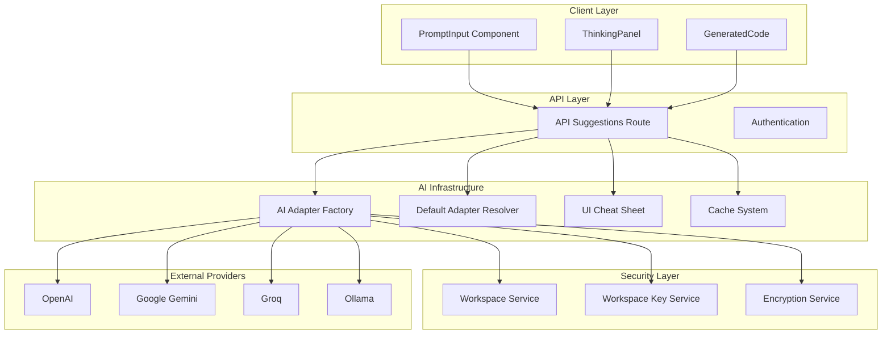
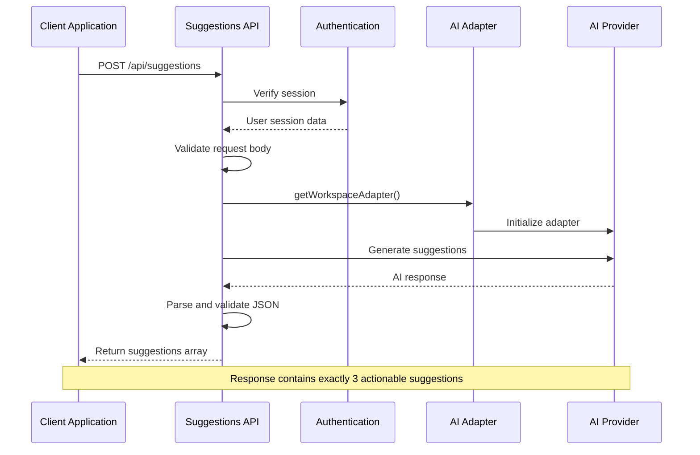
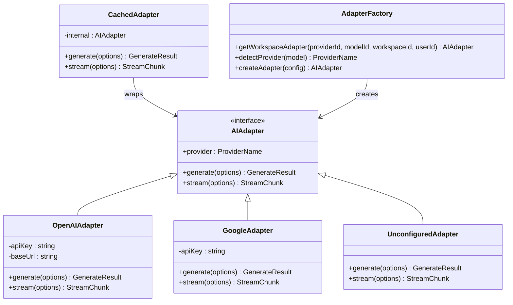
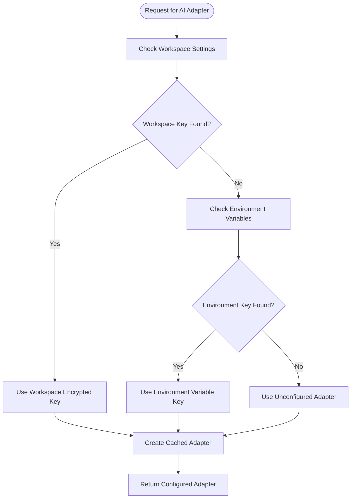
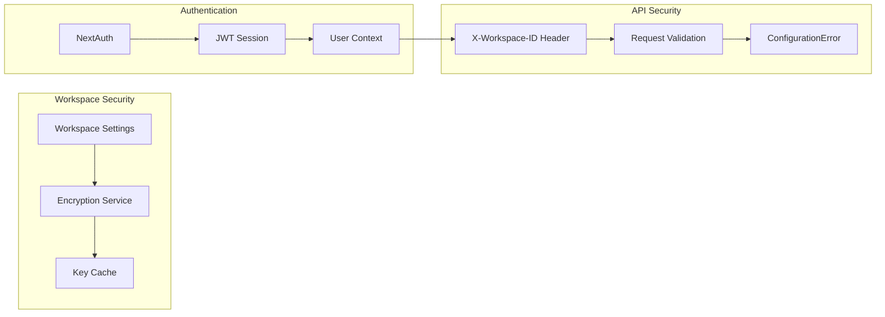
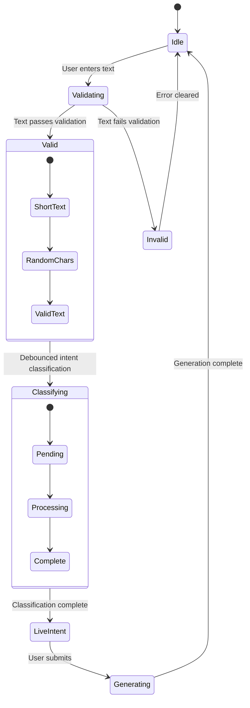
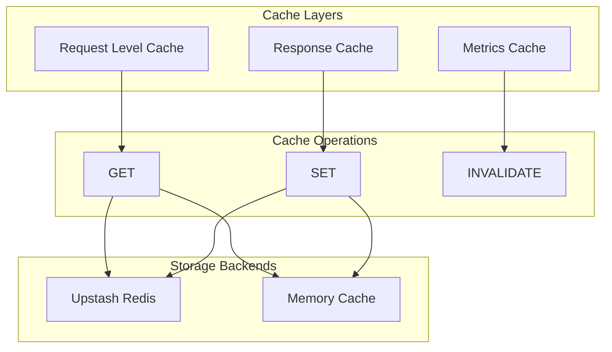
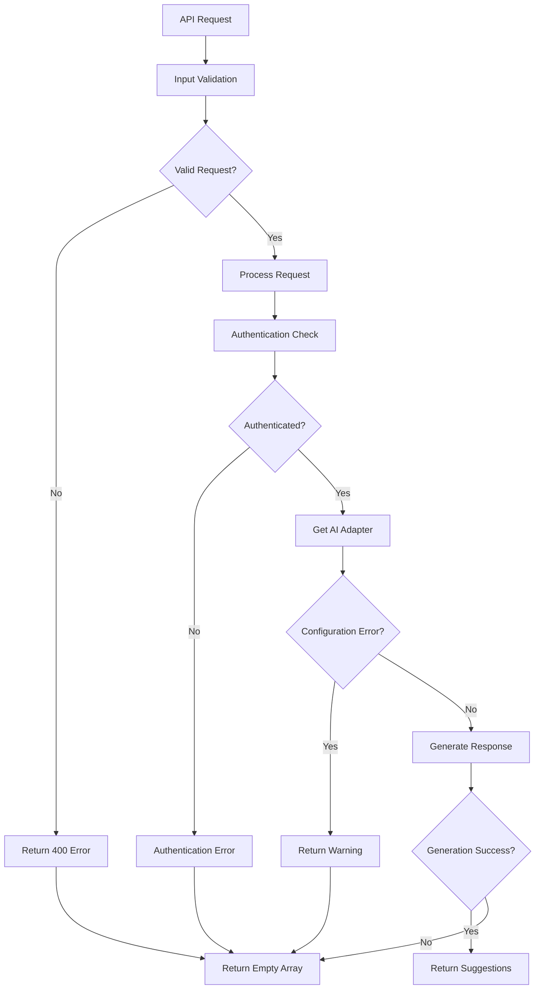
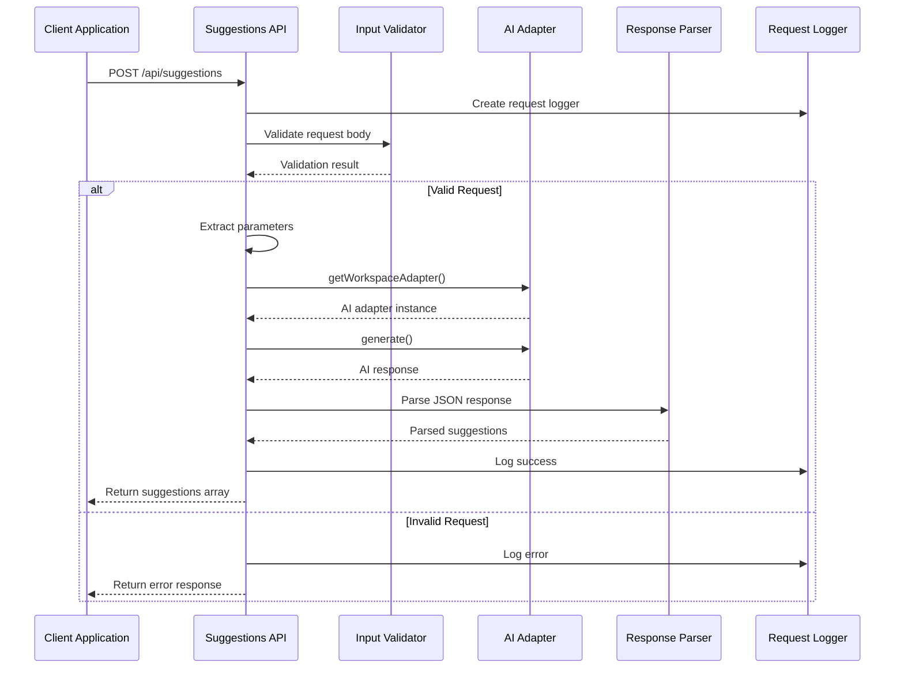

# AI Suggestions System

<cite>
**Referenced Files in This Document**
- [route.ts](file://app/api/suggestions/route.ts)
- [index.ts](file://lib/ai/adapters/index.ts)
- [resolveDefaultAdapter.ts](file://lib/ai/resolveDefaultAdapter.ts)
- [types.ts](file://lib/ai/types.ts)
- [uiCheatSheet.ts](file://lib/ai/uiCheatSheet.ts)
- [PromptInput.tsx](file://components/prompt-input/PromptInput.tsx)
- [types.ts](file://components/prompt-input/types.ts)
- [auth.ts](file://lib/auth.ts)
- [WorkspaceProvider.tsx](file://components/workspace/WorkspaceProvider.tsx)
- [workspaceKeyService.ts](file://lib/security/workspaceKeyService.ts)
- [cache.ts](file://lib/ai/cache.ts)
- [GeneratedCode.tsx](file://components/GeneratedCode.tsx)
- [ThinkingPanel.tsx](file://components/ThinkingPanel.tsx)
</cite>

## Table of Contents
1. [Introduction](#introduction)
2. [System Architecture](#system-architecture)
3. [Core Components](#core-components)
4. [AI Adapter System](#ai-adapter-system)
5. [Security and Authentication](#security-and-authentication)
6. [User Interface Integration](#user-interface-integration)
7. [Performance and Caching](#performance-and-caching)
8. [Error Handling and Resilience](#error-handling-and-resilience)
9. [API Workflow](#api-workflow)
10. [Conclusion](#conclusion)

## Introduction

The AI Suggestions System is a sophisticated component of an AI-powered accessibility-first UI engine designed to provide targeted, actionable aesthetic improvements for React components. This system leverages advanced AI models to analyze generated React code and suggest specific enhancements focused on visual aesthetics, micro-animations, spacing, color vibrancy, typography, and accessibility improvements.

The system operates within a comprehensive AI infrastructure that emphasizes security, performance, and user experience. It integrates seamlessly with the broader UI generation pipeline, providing developers with intelligent suggestions that align with the project's custom design system and accessibility requirements.

## System Architecture

The AI Suggestions System follows a layered architecture pattern that ensures separation of concerns while maintaining optimal performance and security:

**Diagram sources**
- [route.ts:1-135](file://app/api/suggestions/route.ts#L1-L135)
- [index.ts:1-296](file://lib/ai/adapters/index.ts#L1-L296)
- [resolveDefaultAdapter.ts:1-147](file://lib/ai/resolveDefaultAdapter.ts#L1-L147)

The architecture demonstrates a clear separation between client-side presentation components and server-side AI processing, with robust security measures and caching mechanisms integrated throughout the system.

## Core Components

### API Suggestions Endpoint

The heart of the AI Suggestions System is the `/api/suggestions` endpoint, which serves as the primary interface for generating aesthetic improvement suggestions for React components.

**Diagram sources**
- [route.ts:28-135](file://app/api/suggestions/route.ts#L28-L135)
- [auth.ts:1-87](file://lib/auth.ts#L1-L87)

The endpoint enforces strict input validation, requiring a minimum code snippet length of 50 characters and accepting only specific fields from the client to maintain security.

### AI Adapter Factory

The system employs a sophisticated adapter factory pattern that manages multiple AI providers while ensuring secure credential handling:

**Diagram sources**
- [index.ts:146-270](file://lib/ai/adapters/index.ts#L146-L270)
- [types.ts:1-120](file://lib/ai/types.ts#L1-L120)

The factory pattern enables seamless switching between providers while maintaining consistent interfaces and implementing automatic caching mechanisms.

**Section sources**
- [route.ts:1-135](file://app/api/suggestions/route.ts#L1-L135)
- [index.ts:1-296](file://lib/ai/adapters/index.ts#L1-L296)

## AI Adapter System

### Provider Resolution and Configuration

The system implements a hierarchical provider resolution mechanism that prioritizes workspace-specific configurations over global environment variables:

**Diagram sources**
- [index.ts:218-270](file://lib/ai/adapters/index.ts#L218-L270)
- [workspaceKeyService.ts:32-104](file://lib/security/workspaceKeyService.ts#L32-L104)

### Default Model Resolution

The system provides intelligent default model selection based on purpose and available resources:

| Purpose | Priority 1 | Priority 2 | Priority 3 |
|---------|------------|------------|------------|
| INTENT | Groq (Fast) | Google Gemini | OpenAI |
| CLASSIFIER | Groq (Fast) | Google Gemini | OpenAI |
| GENERATION | Groq (Cost-effective) | Google Gemini | OpenAI |
| THINKING | Groq (Fast) | Google Gemini | OpenAI |
| REVIEW | Groq (Fast) | Google Gemini | OpenAI |
| REPAIR | Groq (Fast) | Google Gemini | OpenAI |

**Section sources**
- [resolveDefaultAdapter.ts:1-147](file://lib/ai/resolveDefaultAdapter.ts#L1-L147)
- [index.ts:1-296](file://lib/ai/adapters/index.ts#L1-L296)

## Security and Authentication

### Workspace-Based Credential Management

The system implements a multi-layered security approach centered around workspace isolation and encrypted credential storage:

**Diagram sources**
- [workspaceKeyService.ts:1-147](file://lib/security/workspaceKeyService.ts#L1-L147)
- [auth.ts:1-87](file://lib/auth.ts#L1-L87)
- [route.ts:55-57](file://app/api/suggestions/route.ts#L55-L57)

The security model ensures that API keys are never exposed to clients and are resolved server-side using workspace membership verification.

**Section sources**
- [workspaceKeyService.ts:1-147](file://lib/security/workspaceKeyService.ts#L1-L147)
- [auth.ts:1-87](file://lib/auth.ts#L1-L87)
- [route.ts:1-135](file://app/api/suggestions/route.ts#L1-L135)

## User Interface Integration

### Prompt Input System

The AI Suggestions System integrates seamlessly with the broader UI generation pipeline through the PromptInput component, which provides intelligent input handling and validation:

**Diagram sources**
- [PromptInput.tsx:234-262](file://components/prompt-input/PromptInput.tsx#L234-L262)
- [types.ts:1-53](file://components/prompt-input/types.ts#L1-L53)

The component implements sophisticated validation logic, debounced intent classification, and real-time feedback mechanisms to enhance the user experience.

### Workspace Context Management

The system maintains workspace context through a centralized provider that manages user workspaces and active selections:

| Property | Type | Description |
|----------|------|-------------|
| workspaces | Workspace[] | Array of available workspaces |
| activeWorkspaceId | string \| null | Currently selected workspace ID |
| activeWorkspace | Workspace \| null | Active workspace object |
| isLoading | boolean | Loading state indicator |
| isCreating | boolean | Creation operation state |
| refreshWorkspaces | Function | Refresh workspace list |
| createWorkspace | Function | Create new workspace |
| deleteWorkspace | Function | Delete existing workspace |

**Section sources**
- [PromptInput.tsx:1-442](file://components/prompt-input/PromptInput.tsx#L1-L442)
- [WorkspaceProvider.tsx:1-155](file://components/workspace/WorkspaceProvider.tsx#L1-L155)

## Performance and Caching

### Intelligent Caching Strategy

The system implements a dual-layer caching strategy that optimizes performance while maintaining accuracy:

**Diagram sources**
- [cache.ts:1-141](file://lib/ai/cache.ts#L1-L141)

The caching system automatically falls back to memory storage in development environments while utilizing Redis in production for optimal scalability.

### Request Optimization

The system implements several optimization strategies:

- **Request Deduplication**: Identifies duplicate requests using SHA-256 hashing
- **Response Caching**: Stores generation results for identical prompts
- **TTL Management**: Implements intelligent expiration policies
- **Fallback Mechanisms**: Graceful degradation when caches are unavailable

**Section sources**
- [cache.ts:1-141](file://lib/ai/cache.ts#L1-L141)
- [route.ts:87-106](file://app/api/suggestions/route.ts#L87-L106)

## Error Handling and Resilience

### Comprehensive Error Management

The AI Suggestions System implements robust error handling mechanisms that ensure system stability and user-friendly experiences:

**Diagram sources**
- [route.ts:119-135](file://app/api/suggestions/route.ts#L119-L135)

The error handling strategy prioritizes user experience by returning empty suggestion arrays rather than failing requests, ensuring the system remains responsive under various failure conditions.

**Section sources**
- [route.ts:1-135](file://app/api/suggestions/route.ts#L1-L135)

## API Workflow

### End-to-End Request Processing

The AI Suggestions System follows a structured workflow for processing requests and generating actionable suggestions:

**Diagram sources**
- [route.ts:28-118](file://app/api/suggestions/route.ts#L28-L118)

The workflow ensures that all requests are properly validated, authenticated, and processed while maintaining comprehensive logging for debugging and monitoring purposes.

**Section sources**
- [route.ts:1-135](file://app/api/suggestions/route.ts#L1-L135)

## Conclusion

The AI Suggestions System represents a sophisticated integration of modern AI capabilities with robust security practices and user-centric design principles. The system's architecture demonstrates careful consideration of scalability, security, and user experience, making it suitable for production environments while maintaining flexibility for future enhancements.

Key strengths of the system include:

- **Security-First Design**: Multi-layered authentication and credential management
- **Performance Optimization**: Intelligent caching and request deduplication
- **Developer Experience**: Seamless integration with existing UI generation workflows
- **Resilience**: Comprehensive error handling and graceful degradation
- **Scalability**: Modular architecture supporting multiple AI providers

The system successfully bridges the gap between raw AI capabilities and practical development workflows, providing developers with actionable insights that enhance both the aesthetic quality and accessibility of their React components.

Future enhancements could include expanded provider support, additional suggestion categories, and integration with broader development toolchains to further streamline the UI development process.