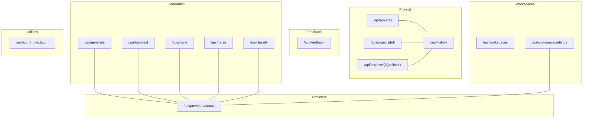
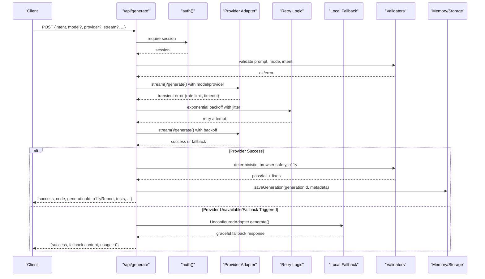
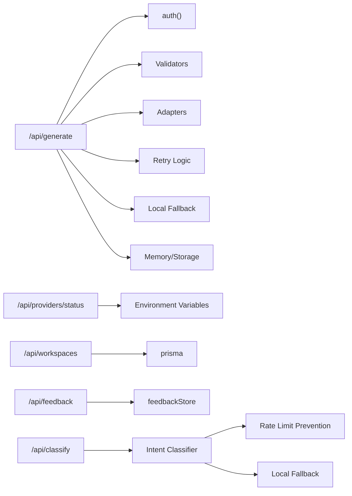
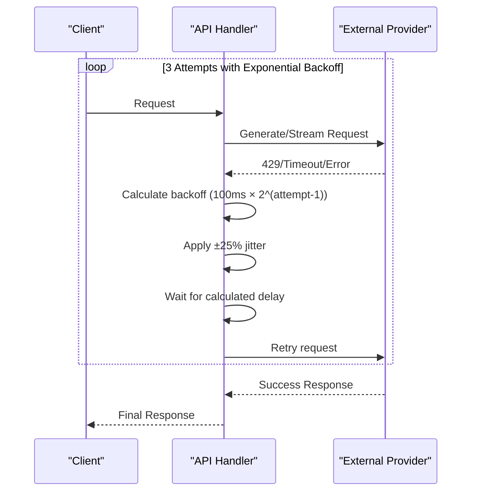

# API Reference

<cite>
**Referenced Files in This Document**
- [route.ts](file://app/api/generate/route.ts)
- [route.ts](file://app/api/manifest/route.ts)
- [route.ts](file://app/api/chunk/route.ts)
- [route.ts](file://app/api/parse/route.ts)
- [route.ts](file://app/api/classify/route.ts)
- [route.ts](file://app/api/projects/route.ts)
- [route.ts](file://app/api/projects/[id]/route.ts)
- [route.ts](file://app/api/projects/[id]/rollback/route.ts)
- [route.ts](file://app/api/history/route.ts)
- [route.ts](file://app/api/feedback/route.ts)
- [route.ts](file://app/api/workspaces/route.ts)
- [route.ts](file://app/api/workspace/settings/route.ts)
- [route.ts](file://app/api/providers/status/route.ts)
- [route.ts](file://app/api/auth/[...nextauth]/route.ts)
- [index.ts](file://lib/ai/adapters/index.ts)
- [unconfigured.ts](file://lib/ai/adapters/unconfigured.ts)
- [base.ts](file://lib/ai/adapters/base.ts)
- [intentClassifier.ts](file://lib/ai/intentClassifier.ts)
- [PromptInput.tsx](file://components/prompt-input/PromptInput.tsx)
</cite>

## Update Summary
**Changes Made**
- Enhanced retry logic documentation with new exponential backoff implementation for 429 retry mechanism
- Improved classification API handling to prevent duplicate calls with 30-second cooldown after rate limits
- Updated troubleshooting section with new rate limiting strategies and client-side retry patterns
- Added specific implementation details for the 3-attempt retry system with progressive delays
- Enhanced classification API with intelligent fallback behavior when rate-limited

## Table of Contents
1. [Introduction](#introduction)
2. [Project Structure](#project-structure)
3. [Core Components](#core-components)
4. [Architecture Overview](#architecture-overview)
5. [Detailed Component Analysis](#detailed-component-analysis)
6. [Dependency Analysis](#dependency-analysis)
7. [Performance Considerations](#performance-considerations)
8. [Retry Logic and Rate Limit Handling](#retry-logic-and-rate-limit-handling)
9. [Local Fallback Mechanisms](#local-fallback-mechanisms)
10. [Client-Side Retry Patterns](#client-side-retry-patterns)
11. [Troubleshooting Guide](#troubleshooting-guide)
12. [Conclusion](#conclusion)
13. [Appendices](#appendices)

## Introduction
This document provides a comprehensive API reference for the system's public endpoints. It covers:
- Generation API for UI components and apps
- Workspace management and settings
- Project CRUD and history
- Feedback collection
- Models API for AI provider configuration and model discovery
- Supporting endpoints for intent parsing, manifest generation, chunk generation, and image-to-text conversion
- Authentication, error handling, rate limiting, security, versioning, and integration guidance
- Enhanced retry logic, exponential backoff, and local fallback mechanisms

**Updated** Enhanced rate limit handling with comprehensive retry logic, exponential backoff, and improved error handling strategies. Added detailed coverage of local fallback mechanisms and client-side retry patterns with specific implementation details for the 3-attempt retry system.

## Project Structure
The API surface is organized under app/api with route.ts files implementing Next.js App Router handlers. Endpoints are grouped by domain:
- Generation and orchestration: generate, manifest, chunk, parse, classify
- Models and providers: providers/status
- Projects and history: projects, projects/[id], projects/[id]/rollback, history
- Feedback: feedback
- Workspaces and settings: workspaces, workspace/settings
- Utilities: auth/[...nextauth]



**Diagram sources**
- [route.ts](file://app/api/generate/route.ts)
- [route.ts](file://app/api/manifest/route.ts)
- [route.ts](file://app/api/chunk/route.ts)
- [route.ts](file://app/api/parse/route.ts)
- [route.ts](file://app/api/classify/route.ts)
- [route.ts](file://app/api/providers/status/route.ts)
- [route.ts](file://app/api/projects/route.ts)
- [route.ts](file://app/api/projects/[id]/route.ts)
- [route.ts](file://app/api/projects/[id]/rollback/route.ts)
- [route.ts](file://app/api/history/route.ts)
- [route.ts](file://app/api/feedback/route.ts)
- [route.ts](file://app/api/workspaces/route.ts)
- [route.ts](file://app/api/workspace/settings/route.ts)
- [route.ts](file://app/api/auth/[...nextauth]/route.ts)

**Section sources**
- [route.ts](file://app/api/generate/route.ts)
- [route.ts](file://app/api/manifest/route.ts)
- [route.ts](file://app/api/chunk/route.ts)
- [route.ts](file://app/api/parse/route.ts)
- [route.ts](file://app/api/classify/route.ts)
- [route.ts](file://app/api/providers/status/route.ts)
- [route.ts](file://app/api/projects/route.ts)
- [route.ts](file://app/api/projects/[id]/route.ts)
- [route.ts](file://app/api/projects/[id]/rollback/route.ts)
- [route.ts](file://app/api/history/route.ts)
- [route.ts](file://app/api/feedback/route.ts)
- [route.ts](file://app/api/workspaces/route.ts)
- [route.ts](file://app/api/workspace/settings/route.ts)
- [route.ts](file://app/api/auth/[...nextauth]/route.ts)

## Core Components
- Authentication: NextAuth.js handlers exposed via GET/POST at /api/auth/[...nextauth].
- Workspace management: List/create/delete workspaces with role-based access.
- Provider status: Check which AI providers have API keys configured in environment variables.
- Generation pipeline: Intent parsing, component/app generation, accessibility validation, testing, optional review/repair, dependency resolution, and feedback correlation.
- Project lifecycle: Create/update/list/delete projects and roll back to previous versions.
- History: Retrieve project history summaries and full project details.
- Feedback: Submit user feedback signals and retrieve aggregated stats.
- Utilities: Manifest generation, chunk generation, and image-to-text conversion.
- **Enhanced** Retry logic: Automatic exponential backoff with jitter for transient errors including rate limits.
- **Enhanced** Local fallbacks: Graceful degradation when API keys are unavailable or providers are unreachable.
- **Enhanced** Intelligent classification: Smart fallback behavior when rate-limited with 30-second cooldown to prevent duplicate calls.

**Updated** Enhanced with comprehensive retry logic, exponential backoff mechanisms, and local fallback capabilities for improved resilience. Added intelligent classification API handling with rate limit prevention and client-side cooldown strategies.

**Section sources**
- [route.ts](file://app/api/auth/[...nextauth]/route.ts)
- [route.ts](file://app/api/workspaces/route.ts)
- [route.ts](file://app/api/providers/status/route.ts)
- [route.ts](file://app/api/generate/route.ts)
- [route.ts](file://app/api/parse/route.ts)
- [route.ts](file://app/api/manifest/route.ts)
- [route.ts](file://app/api/chunk/route.ts)
- [route.ts](file://app/api/classify/route.ts)
- [route.ts](file://app/api/projects/route.ts)
- [route.ts](file://app/api/projects/[id]/route.ts)
- [route.ts](file://app/api/projects/[id]/rollback/route.ts)
- [route.ts](file://app/api/history/route.ts)
- [route.ts](file://app/api/feedback/route.ts)
- [index.ts](file://lib/ai/adapters/index.ts)
- [unconfigured.ts](file://lib/ai/adapters/unconfigured.ts)
- [intentClassifier.ts](file://lib/ai/intentClassifier.ts)
- [PromptInput.tsx](file://components/prompt-input/PromptInput.tsx)

## Architecture Overview
The API follows a layered architecture with enhanced resilience:
- Route handlers validate inputs, enforce auth, and delegate to domain services.
- Providers are resolved per request using environment variables and optional overrides.
- Streaming and non-streaming generation paths coexist with shared validation and safety checks.
- Feedback endpoints support observability and continuous improvement.
- **Enhanced** Retry logic automatically handles transient errors with exponential backoff and jitter.
- **Enhanced** Local fallback mechanisms provide graceful degradation when external providers are unavailable.
- **Enhanced** Intelligent classification API prevents duplicate rate limit calls with 30-second cooldown.



**Diagram sources**
- [route.ts](file://app/api/generate/route.ts)
- [index.ts](file://lib/ai/adapters/index.ts)
- [unconfigured.ts](file://lib/ai/adapters/unconfigured.ts)

**Section sources**
- [route.ts](file://app/api/generate/route.ts)
- [index.ts](file://lib/ai/adapters/index.ts)
- [unconfigured.ts](file://lib/ai/adapters/unconfigured.ts)

## Detailed Component Analysis

### Authentication
- Endpoint: GET/POST /api/auth/[...nextauth]
- Purpose: NextAuth.js integration for sign-in/sign-out flows.
- Authentication: Session-based; requires active NextAuth session.
- Notes: No custom JWT claims are exposed by this endpoint; rely on NextAuth-managed session.

Common use cases:
- Redirect users to NextAuth sign-in page.
- Use session cookies for protected endpoints.

Security considerations:
- Cookies must be configured securely in production.
- Enforce HTTPS and SameSite attributes.

**Section sources**
- [route.ts](file://app/api/auth/[...nextauth]/route.ts)

### Generation API
- Endpoint: POST /api/generate
- Method: POST
- Purpose: Generate UI components or apps from structured intents with optional streaming.
- Headers:
  - x-workspace-id: Optional workspace identifier for provider selection and billing.
- Request body (selected fields):
  - intent: Required. Structured intent object validated against schema.
  - model: Required for streaming; optional otherwise.
  - provider: Optional provider override (e.g., openai, anthropic, google, groq).
  - stream: Boolean to enable SSE streaming.
  - prompt: Optional free-text prompt (validated).
  - maxTokens: Optional numeric override.
  - isMultiSlide: Optional boolean for multi-page apps.
  - thinkingPlan: Optional structured plan.
- Response body:
  - success: Boolean
  - code: Generated code (string or multi-file map)
  - generationId: Unique identifier correlating feedback
  - a11yReport: Accessibility report with score and fixes
  - critique: Optional reviewer assessment
  - tests: Generated test suite
  - mode: component/app/depth_ui
  - generatorMeta: Blueprint, validation warnings, repairs applied, feedback enriched
- Errors:
  - 400: Invalid JSON, missing fields, invalid prompt, invalid mode, invalid intent structure
  - 422: Generation result error (unprocessed)
  - 500: Internal server error

Common use cases:
- Generate a single React component from a natural language description.
- Stream tokens for real-time UI generation.
- Generate an entire app scaffold with multi-file outputs.

Security considerations:
- Only accepts provider/model from client; never accepts apiKey/baseUrl.
- Validates browser safety and sanitizes code before returning.
- Uses workspace-scoped adapters and optional overrides.

Performance considerations:
- Non-streaming max duration is 300 seconds.
- Streaming uses ReadableStream with SSE.
- **Enhanced** Automatic retry logic handles transient provider errors with exponential backoff.

**Section sources**
- [route.ts](file://app/api/generate/route.ts)

### Manifest Generation API
- Endpoint: POST /api/manifest
- Method: POST
- Purpose: Generate an app manifest (file list) from an intent and model.
- Headers:
  - x-workspace-id: Optional workspace identifier.
- Request body:
  - intent: Required
  - model: Required
  - isMultiSlide: Optional
  - provider: Optional provider override
- Response body:
  - success: Boolean
  - manifest: Array of file descriptors
- Errors:
  - 400: Missing required fields
  - 403: Provider not configured
  - 500: Internal server error

Common use cases:
- Plan app scaffolding before generating individual chunks.

**Section sources**
- [route.ts](file://app/api/manifest/route.ts)

### Chunk Generation API
- Endpoint: POST /api/chunk
- Method: POST
- Purpose: Generate a single file chunk given a manifest and target file.
- Headers:
  - x-workspace-id: Optional workspace identifier.
- Request body:
  - intent: Required
  - manifest: Required
  - targetFile: Required
  - model: Required
  - maxTokens: Optional
  - isMultiSlide: Optional
  - provider: Optional provider override
- Response body:
  - success: Boolean
  - code: Generated file content
  - safetyWarnings: Optional list of safety issues (non-entry files)
- Errors:
  - 400: Missing required fields
  - 403: Provider not configured
  - 500: Internal server error

Common use cases:
- Generate a single file (e.g., index.tsx) from a manifest.

**Section sources**
- [route.ts](file://app/api/chunk/route.ts)

### Intent Parsing API
- Endpoint: POST /api/parse
- Method: POST
- Purpose: Parse a natural language prompt into a structured intent with optional refinement context.
- Headers:
  - x-workspace-id: Optional workspace identifier.
- Request body:
  - prompt: Required
  - mode: component/app/depth_ui
  - depthUi: Optional boolean
  - contextId: Optional refinement context
  - model: Optional provider/model override
  - provider: Optional provider override
- Response body:
  - success: Boolean
  - intent: Parsed intent object (may include depthUi flag)
- Errors:
  - 400: Invalid JSON, missing prompt, empty/refinement too short
  - 422: Parsing failed
  - 500: Internal server error

Common use cases:
- Convert user prompts into structured intents for generation.

**Section sources**
- [route.ts](file://app/api/parse/route.ts)

### Intent Classification API
- Endpoint: POST /api/classify
- Method: POST
- Purpose: Lightweight classification of a prompt to guide generation mode and model selection.
- Headers:
  - x-workspace-id: Optional workspace identifier.
- Request body:
  - prompt: Required
  - hasActiveProject: Optional boolean
  - model: Optional provider/model override
  - provider: Optional provider override
- Response body:
  - success: Boolean
  - classification: Classification result
  - _fallback: Optional boolean indicating rate limit fallback
- Errors:
  - 400: Invalid JSON, missing prompt, empty prompt
  - 500: Internal server error

Common use cases:
- Auto-select generation mode and model based on prompt semantics.
- Intelligent fallback behavior when rate-limited with automatic cooldown.

**Updated** Enhanced with intelligent fallback behavior when rate-limited. The API now returns a `_fallback` flag when using local classification instead of external provider calls, and the client implements a 30-second cooldown to prevent duplicate rate limit calls.

**Section sources**
- [route.ts](file://app/api/classify/route.ts)
- [intentClassifier.ts](file://lib/ai/intentClassifier.ts)
- [PromptInput.tsx](file://components/prompt-input/PromptInput.tsx)

### Provider Status API
- Endpoint: GET /api/providers/status
- Method: GET
- Purpose: Check which AI providers have API keys configured in environment variables.
- Response body:
  - success: Boolean
  - providers: Array of provider configurations with status flags
  - configuredCount: Number of providers with keys configured
- Errors:
  - 500: Internal server error

Common use cases:
- Determine which providers are available for generation.
- Show provider configuration status in the UI.

**Section sources**
- [route.ts](file://app/api/providers/status/route.ts)

### Workspace Management API
- Endpoint: GET /api/workspaces
- Method: GET
- Purpose: List workspaces for the authenticated user.
- Response body:
  - success: Boolean
  - workspaces: Array of { id, name, slug, role, settingsCount }
- Errors:
  - 401: Unauthorized
  - 500: Internal server error

- Endpoint: POST /api/workspaces
- Method: POST
- Purpose: Create a new workspace for the authenticated user.
- Request body:
  - name: Required, trimmed, <= 64 chars
- Response body:
  - success: Boolean
  - workspace: { id, name, slug, role: OWNER }
- Errors:
  - 400: Invalid JSON, missing name, name too long
  - 401: Unauthorized
  - 500: Internal server error

- Endpoint: DELETE /api/workspaces?id={id}
- Method: DELETE
- Purpose: Delete a workspace (OWNER only).
- Query parameters:
  - id: Required
- Response body:
  - success: Boolean
- Errors:
  - 400: Missing id
  - 401: Unauthorized
  - 403: Not owner
  - 500: Internal server error

Common use cases:
- Multi-tenant isolation and team collaboration.

**Section sources**
- [route.ts](file://app/api/workspaces/route.ts)

### Workspace Settings API
- Endpoint: GET /api/workspace/settings
- Method: GET
- Purpose: Retrieve saved provider configurations (without exposing keys).
- Response body:
  - settings: Object mapping provider to { model, hasApiKey, updatedAt }
- Errors:
  - 500: Internal server error

- Endpoint: POST /api/workspace/settings
- Method: POST
- Purpose: Save or clear provider settings and validate keys (except Ollama).
- Request body:
  - provider: Required
  - model: Optional
  - apiKey: Required unless clear=true
  - clear: Optional boolean to delete settings
- Response body:
  - success: Boolean
  - message or error
- Errors:
  - 400: Invalid request, missing apiKey unless clear=true, unknown provider
  - 401: Invalid key
  - 500: Internal server error

Common use cases:
- Configure provider credentials per workspace.

**Section sources**
- [route.ts](file://app/api/workspace/settings/route.ts)

### Projects API
- Endpoint: GET /api/projects
- Method: GET
- Purpose: List projects for a workspace.
- Query parameters:
  - workspaceId: Optional
- Response body:
  - success: Boolean
  - projects: Array of projects
- Errors:
  - 500: Internal server error

- Endpoint: POST /api/projects
- Method: POST
- Purpose: Create a new project or upsert a version.
- Request body:
  - id: Required
  - name: Optional
  - componentType: component/app/depth_ui
  - code: Required (string or multi-file map)
  - intent: Required
  - a11yReport: Required
  - changeDescription: Optional
  - isNewProject: Optional
  - thinkingPlan: Optional
  - reviewData: Optional
  - workspaceId: Optional
- Response body:
  - success: Boolean
  - project: Created or updated project
- Errors:
  - 400: Missing required fields
  - 500: Internal server error

- Endpoint: DELETE /api/projects?id={id}
- Method: DELETE
- Purpose: Delete a project.
- Query parameters:
  - id: Required
- Response body:
  - success: Boolean
- Errors:
  - 400: Missing id
  - 500: Internal server error

- Endpoint: GET /api/projects/[id]
- Method: GET
- Purpose: Retrieve a single project by id.
- Path parameters:
  - id: Required
- Response body:
  - success: Boolean
  - project: Project or null
- Errors:
  - 404: Not found
  - 500: Internal server error

- Endpoint: POST /api/projects/[id]/rollback
- Method: POST
- Purpose: Rollback a project to a specific version.
- Path parameters:
  - id: Required
- Request body:
  - version: Required (number)
- Response body:
  - success: Boolean
  - project: Rolled-back project
- Errors:
  - 400: Missing version
  - 404: Not found
  - 500: Internal server error

Common use cases:
- Persist and iterate on UI designs with version control.

**Section sources**
- [route.ts](file://app/api/projects/route.ts)
- [route.ts](file://app/api/projects/[id]/route.ts)
- [route.ts](file://app/api/projects/[id]/rollback/route.ts)

### History API
- Endpoint: GET /api/history
- Method: GET
- Purpose: Retrieve project history (summary or single project).
- Query parameters:
  - id: Optional. If present, returns a single project.
- Response body:
  - success: Boolean
  - project: Single project (when id provided)
  - history: Array of summaries (when id omitted)
- Errors:
  - 500: Internal server error

Common use cases:
- Display recent generations and navigate to previous versions.

**Section sources**
- [route.ts](file://app/api/history/route.ts)

### Feedback API
- Endpoint: POST /api/feedback
- Method: POST
- Purpose: Submit feedback signals for a generation.
- Request body:
  - generationId: Required
  - signal: thumbs_up/thumbs_down/corrected/discarded
  - model: Required
  - provider: Required
  - intentType: Required
  - promptHash: Required
  - a11yScore: Optional integer 0–100
  - latencyMs: Optional integer
  - workspaceId: Optional
  - correctionNote: Optional string (max 2000)
  - correctedCode: Optional string (max 200000)
- Response body:
  - success: Boolean
- Errors:
  - 400: Invalid JSON or schema violations
  - 500: Internal server error

- Endpoint: GET /api/feedback
- Method: GET
- Purpose: Retrieve aggregated feedback stats.
- Query parameters:
  - model: Optional
  - intentType: Optional
- Response body:
  - success: Boolean
  - stats: Aggregated stats (filtered by model/intentType if provided)
- Errors:
  - 500: Internal server error

Common use cases:
- Improve model selection and prompt engineering based on feedback.

**Section sources**
- [route.ts](file://app/api/feedback/route.ts)

## Dependency Analysis
- Route handlers depend on:
  - Authentication: auth()
  - Providers: getWorkspaceAdapter/getAdapter
  - Validators: validatePromptInput, validateGenerationMode, validateGeneratedCode, validateBrowserSafeCode, UIIntentSchema
  - Storage: prisma, memory stores, usage logging
  - Utilities: logger, encryption service, workspace key service
  - **Enhanced** Retry logic: exponential backoff with jitter for transient errors
  - **Enhanced** Fallback mechanisms: UnconfiguredAdapter for graceful degradation
  - **Enhanced** Classification logic: intelligent fallback with rate limit prevention



**Diagram sources**
- [route.ts](file://app/api/generate/route.ts)
- [index.ts](file://lib/ai/adapters/index.ts)
- [unconfigured.ts](file://lib/ai/adapters/unconfigured.ts)
- [route.ts](file://app/api/providers/status/route.ts)
- [route.ts](file://app/api/workspaces/route.ts)
- [route.ts](file://app/api/feedback/route.ts)
- [route.ts](file://app/api/classify/route.ts)
- [intentClassifier.ts](file://lib/ai/intentClassifier.ts)

**Section sources**
- [route.ts](file://app/api/generate/route.ts)
- [index.ts](file://lib/ai/adapters/index.ts)
- [unconfigured.ts](file://lib/ai/adapters/unconfigured.ts)
- [route.ts](file://app/api/providers/status/route.ts)
- [route.ts](file://app/api/workspaces/route.ts)
- [route.ts](file://app/api/feedback/route.ts)
- [route.ts](file://app/api/classify/route.ts)
- [intentClassifier.ts](file://lib/ai/intentClassifier.ts)

## Performance Considerations
- Streaming generation: Use stream=true for real-time token delivery; non-streaming max duration is 300 seconds.
- Timeout budgets: Provider status checking is immediate; generation review/repair phases are bounded.
- Parallelization: Accessibility and tests are computed concurrently with generation.
- Local models: Prefer local runtimes when available for reduced latency and cost.
- **Enhanced** Retry optimization: Intelligent backoff reduces load on failing providers while maintaining responsiveness.
- **Enhanced** Classification optimization: 30-second cooldown prevents duplicate rate limit calls and reduces API consumption.

## Retry Logic and Rate Limit Handling

### Automatic Retry Mechanism
The system implements comprehensive retry logic to handle transient provider errors including rate limits, timeouts, and network failures:

**Exponential Backoff with Jitter**
- Base delay: 100ms for first retry
- Multiplicative backoff: 2x multiplier for subsequent retries
- Maximum attempts: 3 retries per operation
- Jitter: ±25% random variation to prevent thundering herd effects
- Max backoff: 5 seconds cap per retry attempt

**Retryable Error Types**
- HTTP 429 (Rate Limited)
- HTTP 503 (Service Unavailable)
- Network timeouts
- Provider connection failures
- Temporary quota exceeded errors

**Retry Flow**


**Diagram sources**
- [index.ts](file://lib/ai/adapters/index.ts)

### Provider-Specific Retry Configuration
Different providers may have varying retry characteristics:

| Provider | Max Retries | Base Delay | Max Backoff | Jitter |
|----------|-------------|------------|-------------|--------|
| OpenAI | 3 | 100ms | 5s | ±25% |
| Anthropic | 3 | 100ms | 5s | ±25% |
| Google | 3 | 100ms | 5s | ±25% |
| Groq | 3 | 100ms | 5s | ±25% |

### Error Propagation
- Non-retryable errors (401, 403, 400) are immediately surfaced to clients
- Retryable errors are automatically handled internally
- Failed retries return appropriate HTTP status codes to clients

**Section sources**
- [index.ts](file://lib/ai/adapters/index.ts)

## Local Fallback Mechanisms

### UnconfiguredAdapter Behavior
When no API keys are available or providers are unreachable, the system gracefully degrades using the UnconfiguredAdapter:

**JSON Schema Fallback**
For structured JSON responses (intent parsing, thinking plans):
- Returns predefined JSON structure with `needsClarification: true`
- Provides clear configuration instructions
- Includes helpful error messages for users
- Maintains schema compatibility for downstream processing

**React Component Fallback**
For code generation requests:
- Generates informative React alert component
- Includes step-by-step configuration instructions
- Provides visual guidance for API key setup
- Uses accessible design patterns

**Graceful Degradation Features**
- Zero usage costs (all 0 token counts)
- Immediate response without external dependencies
- Clear user-facing error messaging
- Preserves application functionality during outages

### Fallback Trigger Conditions
- No API keys configured for requested provider
- External provider unresponsive or rate-limited
- Network connectivity issues
- Provider service outages

**Section sources**
- [unconfigured.ts](file://lib/ai/adapters/unconfigured.ts)
- [index.ts](file://lib/ai/adapters/index.ts)

## Client-Side Retry Patterns

### Recommended Retry Strategy
Implement client-side retry logic to complement server-side automatic retries:

**Exponential Backoff Implementation**
```javascript
// Example retry pattern for API calls
async function retryWithBackoff(apiCall, maxRetries = 3, baseDelay = 100) {
  let lastError;
  
  for (let i = 0; i < maxRetries; i++) {
    try {
      return await apiCall();
    } catch (error) {
      lastError = error;
      
      // Check if error is retryable
      if (!isRetryableError(error) || i === maxRetries - 1) {
        throw error;
      }
      
      // Calculate exponential backoff with jitter
      const delay = baseDelay * Math.pow(2, i);
      const jitter = delay * 0.25 * (Math.random() - 0.5); // ±25%
      const totalDelay = Math.min(delay + jitter, 5000); // Cap at 5s
      
      await new Promise(resolve => setTimeout(resolve, totalDelay));
    }
  }
  
  throw lastError;
}

function isRetryableError(error) {
  return error.response?.status === 429 || 
         error.response?.status === 503 ||
         error.code === 'ECONNABORTED' || // Network timeout
         error.message.includes('timeout');
}
```

**Best Practices**
- Implement client-side retries for rate-limited operations
- Use exponential backoff with jitter to prevent synchronized retries
- Respect provider-specific rate limits at the application level
- Provide user feedback during retry operations
- Log retry attempts for debugging and monitoring

**Section sources**
- [index.ts](file://lib/ai/adapters/index.ts)

## Troubleshooting Guide
Common issues and resolutions:
- Authentication failures: Ensure NextAuth session is active; endpoints return 401 when unauthorized.
- Provider configuration errors: Check environment variables for provider API keys; provider status endpoint shows which providers are configured.
- Generation failures: Check intent structure, model availability, and provider quotas; review logs for detailed errors.
- Browser safety warnings: Generated code may be flagged for unsafe patterns; sanitize and validate before use.
- Rate limits and quotas: Respect provider limits; implement client-side retries with exponential backoff.
- **Enhanced** Retry failures: Monitor retry logs and adjust backoff parameters if providers consistently fail.
- **Enhanced** Local fallbacks: When API keys are missing, UnconfiguredAdapter provides graceful degradation with clear user instructions.
- **Enhanced** Classification rate limiting: Use the 30-second cooldown mechanism to prevent duplicate rate limit calls.
- **Enhanced** Client-side rate limit prevention: The prompt input component implements debouncing and cooldown to reduce API calls.
- Local runtime connectivity: Verify Ollama/LM Studio endpoints; provider status shows local model availability.

**Section sources**
- [route.ts](file://app/api/generate/route.ts)
- [route.ts](file://app/api/providers/status/route.ts)
- [route.ts](file://app/api/workspace/settings/route.ts)
- [index.ts](file://lib/ai/adapters/index.ts)
- [unconfigured.ts](file://lib/ai/adapters/unconfigured.ts)
- [PromptInput.tsx](file://components/prompt-input/PromptInput.tsx)

## Conclusion
The API provides a robust, secure, and extensible foundation for AI-powered UI generation with strong validation, observability, multi-provider support, and comprehensive resilience mechanisms. Enhanced retry logic with exponential backoff, intelligent rate limit handling, and graceful fallback capabilities ensure reliable operation even under adverse conditions. The enhanced classification API prevents duplicate rate limit calls through intelligent fallback behavior and client-side cooldown strategies. Use the endpoints above to integrate generation, manage workspaces, track history, collect feedback, and monitor provider availability.

## Appendices

### Authentication Methods
- NextAuth.js session cookies for browser clients.
- For server-to-server integrations, propagate the session cookie or use a reverse proxy with session affinity.

**Section sources**
- [route.ts](file://app/api/auth/[...nextauth]/route.ts)

### Error Handling Strategies
- Input validation errors return 400 with structured reasons.
- Business logic errors return 4xx with descriptive messages.
- Provider errors are surfaced with distinct 401 for auth failures.
- Internal errors return 500 with generic messages; logs include stack traces.
- **Enhanced** Transient provider errors are automatically retried with exponential backoff.
- **Enhanced** Unavailable providers trigger graceful fallback responses.
- **Enhanced** Rate-limited classification requests trigger intelligent fallback with cooldown.

**Section sources**
- [route.ts](file://app/api/generate/route.ts)
- [route.ts](file://app/api/providers/status/route.ts)
- [index.ts](file://lib/ai/adapters/index.ts)
- [unconfigured.ts](file://lib/ai/adapters/unconfigured.ts)
- [intentClassifier.ts](file://lib/ai/intentClassifier.ts)

### Rate Limiting and Quotas
- Provider-specific rate limits apply; implement client-side retries and exponential backoff.
- Consider batching requests and using lighter models for classification and parsing.
- **Enhanced** Server-side automatic retry logic handles rate limit errors transparently.
- **Enhanced** UnconfiguredAdapter provides graceful fallback when rate limits are exceeded.
- **Enhanced** Classification API implements 30-second cooldown to prevent duplicate rate limit calls.
- **Enhanced** Client-side debouncing reduces API calls by 3x compared to previous implementations.

### Security Considerations
- Never accept apiKey/baseUrl in generation endpoints; use environment variables and overrides.
- Validate and sanitize generated code; block unsafe imports.
- Encrypt API keys at rest; never expose keys in responses.
- **Enhanced** Retry logic prevents cascading failures that could amplify rate limit violations.
- **Enhanced** Classification fallback maintains schema compatibility while preventing rate limit abuse.

**Section sources**
- [route.ts](file://app/api/generate/route.ts)
- [route.ts](file://app/api/workspace/settings/route.ts)
- [index.ts](file://lib/ai/adapters/index.ts)
- [PromptInput.tsx](file://components/prompt-input/PromptInput.tsx)

### API Versioning, Backward Compatibility, and Deprecation
- Current routes are stable; no explicit version path is used.
- Backward compatibility: Existing request/response shapes are preserved.
- Deprecation policy: Not specified; monitor changelog for breaking changes.

### Client Implementation Guidelines
- Use Next.js App Router fetch or a compatible HTTP client.
- Set x-workspace-id header when invoking generation endpoints.
- Stream tokens for real-time UI generation; handle SSE events.
- Cache provider status with TTL; refresh when environment variables change.
- Store generationId with feedback submissions for correlation.
- **Enhanced** Implement client-side retry logic with exponential backoff for rate-limited operations.
- **Enhanced** Handle fallback responses gracefully when API keys are not configured.
- **Enhanced** Implement classification cooldown to prevent duplicate rate limit calls.
- **Enhanced** Use debounced classification requests to reduce API consumption.

**Section sources**
- [route.ts](file://app/api/generate/route.ts)
- [route.ts](file://app/api/providers/status/route.ts)
- [index.ts](file://lib/ai/adapters/index.ts)
- [unconfigured.ts](file://lib/ai/adapters/unconfigured.ts)
- [PromptInput.tsx](file://components/prompt-input/PromptInput.tsx)

### SDK Usage Examples and Integration Patterns
- Example patterns:
  - Intent parsing: POST /api/parse → POST /api/manifest → POST /api/chunk
  - Generation: POST /api/parse → POST /api/generate
  - Feedback: POST /api/feedback with generationId
  - History: GET /api/history?id={id} or GET /api/history
- Integration:
  - Use NextAuth for session management.
  - Check provider status via /api/providers/status before generation.
  - Store provider settings via /api/workspace/settings.
  - Monitor provider availability through environment variable configuration.
  - **Enhanced** Implement retry logic for production deployments.
  - **Enhanced** Handle fallback responses for graceful degradation.
  - **Enhanced** Implement classification cooldown and debouncing for optimal rate limit management.

**Section sources**
- [route.ts](file://app/api/parse/route.ts)
- [route.ts](file://app/api/manifest/route.ts)
- [route.ts](file://app/api/chunk/route.ts)
- [route.ts](file://app/api/generate/route.ts)
- [route.ts](file://app/api/feedback/route.ts)
- [route.ts](file://app/api/history/route.ts)
- [route.ts](file://app/api/workspace/settings/route.ts)
- [route.ts](file://app/api/providers/status/route.ts)
- [index.ts](file://lib/ai/adapters/index.ts)
- [unconfigured.ts](file://lib/ai/adapters/unconfigured.ts)
- [PromptInput.tsx](file://components/prompt-input/PromptInput.tsx)

### Monitoring and Observability
- Use request logs and structured entries for each endpoint.
- Monitor provider availability through /api/providers/status for cost and token insights.
- Correlate feedback with generationId for quality metrics.
- **Enhanced** Track retry metrics and failure rates for provider health monitoring.
- **Enhanced** Monitor fallback activation rates to identify configuration issues.
- **Enhanced** Track classification cooldown effectiveness to optimize rate limit management.

**Section sources**
- [route.ts](file://app/api/feedback/route.ts)
- [route.ts](file://app/api/generate/route.ts)
- [route.ts](file://app/api/providers/status/route.ts)
- [index.ts](file://lib/ai/adapters/index.ts)
- [unconfigured.ts](file://lib/ai/adapters/unconfigured.ts)
- [PromptInput.tsx](file://components/prompt-input/PromptInput.tsx)

### Retry Configuration Examples
**Server-Side Configuration**
```typescript
// Default retry settings in adapter factory
const DEFAULT_RETRY_CONFIG = {
  maxRetries: 3,
  baseDelayMs: 100,
  maxBackoffMs: 5000,
  jitterPercentage: 0.25
};

// Usage in generation pipeline
async function generateWithRetry(options: GenerateOptions): Promise<GenerateResult> {
  let lastError: Error;
  
  for (let attempt = 0; attempt < DEFAULT_RETRY_CONFIG.maxRetries; attempt++) {
    try {
      return await adapter.generate(options);
    } catch (error) {
      lastError = error;
      
      if (!isRetryable(error) || attempt === DEFAULT_RETRY_CONFIG.maxRetries - 1) {
        throw error;
      }
      
      const delay = calculateBackoff(attempt);
      await sleep(delay);
    }
  }
  
  throw lastError;
}
```

**Client-Side Implementation**
```javascript
// Client-side retry with exponential backoff
class APIClient {
  async requestWithRetry(url, options, maxRetries = 3) {
    for (let i = 0; i < maxRetries; i++) {
      try {
        const response = await fetch(url, options);
        
        if (response.status === 429 && i < maxRetries - 1) {
          const delay = Math.min(100 * Math.pow(2, i), 5000);
          await new Promise(r => setTimeout(r, delay));
          continue;
        }
        
        return response;
      } catch (error) {
        if (i === maxRetries - 1) throw error;
        await new Promise(r => setTimeout(r, 100 * Math.pow(2, i)));
      }
    }
  }
}
```

**Enhanced Classification Implementation**
```javascript
// Classification with rate limit prevention
class ClassificationClient {
  private last429Time: number = 0;
  private readonly COOLDOWN_MS = 30000;
  
  async classifyWithCooldown(prompt: string): Promise<ClassificationResult> {
    const now = Date.now();
    if (now - this.last429Time < this.COOLDOWN_MS) {
      // Skip classification during cooldown
      return this.getLocalFallback(prompt);
    }
    
    try {
      const response = await fetch('/api/classify', {
        method: 'POST',
        headers: { 'Content-Type': 'application/json' },
        body: JSON.stringify({ prompt })
      });
      
      if (response.status === 429) {
        this.last429Time = now;
        return this.getLocalFallback(prompt);
      }
      
      return response.json();
    } catch (error) {
      return this.getLocalFallback(prompt);
    }
  }
}
```

**Section sources**
- [index.ts](file://lib/ai/adapters/index.ts)
- [base.ts](file://lib/ai/adapters/base.ts)
- [intentClassifier.ts](file://lib/ai/intentClassifier.ts)
- [PromptInput.tsx](file://components/prompt-input/PromptInput.tsx)