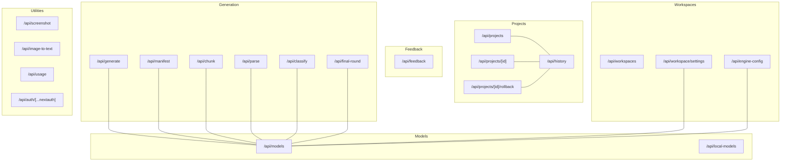
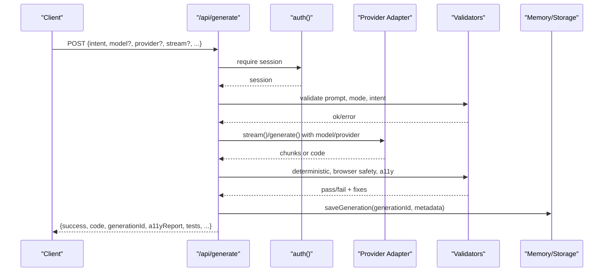
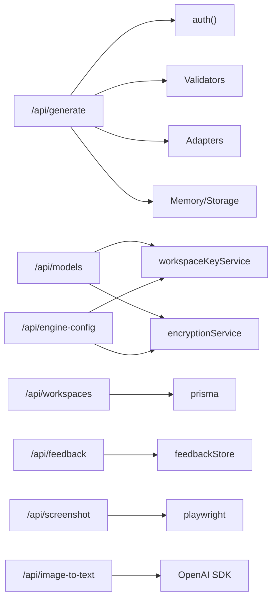

# API Reference

<cite>
**Referenced Files in This Document**
- [route.ts](file://app/api/generate/route.ts)
- [route.ts](file://app/api/models/route.ts)
- [route.ts](file://app/api/projects/route.ts)
- [route.ts](file://app/api/projects/[id]/route.ts)
- [route.ts](file://app/api/projects/[id]/rollback/route.ts)
- [route.ts](file://app/api/history/route.ts)
- [route.ts](file://app/api/feedback/route.ts)
- [route.ts](file://app/api/workspaces/route.ts)
- [route.ts](file://app/api/workspace/settings/route.ts)
- [route.ts](file://app/api/engine-config/route.ts)
- [route.ts](file://app/api/local-models/route.ts)
- [route.ts](file://app/api/manifest/route.ts)
- [route.ts](file://app/api/usage/route.ts)
- [route.ts](file://app/api/chunk/route.ts)
- [route.ts](file://app/api/classify/route.ts)
- [route.ts](file://app/api/final-round/route.ts)
- [route.ts](file://app/api/image-to-text/route.ts)
- [route.ts](file://app/api/parse/route.ts)
- [route.ts](file://app/api/screenshot/route.ts)
- [route.ts](file://app/api/auth/[...nextauth]/route.ts)
</cite>

## Table of Contents
1. [Introduction](#introduction)
2. [Project Structure](#project-structure)
3. [Core Components](#core-components)
4. [Architecture Overview](#architecture-overview)
5. [Detailed Component Analysis](#detailed-component-analysis)
6. [Dependency Analysis](#dependency-analysis)
7. [Performance Considerations](#performance-considerations)
8. [Troubleshooting Guide](#troubleshooting-guide)
9. [Conclusion](#conclusion)
10. [Appendices](#appendices)

## Introduction
This document provides a comprehensive API reference for the system’s public endpoints. It covers:
- Generation API for UI components and apps
- Workspace management and settings
- Project CRUD and history
- Feedback collection
- Models API for AI provider configuration and model discovery
- Supporting endpoints for intent parsing, manifest generation, chunk generation, final round critique, screenshot capture, image-to-text, and usage analytics
- Authentication, error handling, rate limiting, security, versioning, and integration guidance

## Project Structure
The API surface is organized under app/api with route.ts files implementing Next.js App Router handlers. Endpoints are grouped by domain:
- Generation and orchestration: generate, manifest, chunk, parse, classify, final-round
- Models and providers: models, local-models
- Projects and history: projects, projects/[id], projects/[id]/rollback, history
- Feedback: feedback
- Workspaces and settings: workspaces, workspace/settings, engine-config
- Utilities: screenshot, image-to-text, usage, auth/[...nextauth]

**Diagram sources**
- [route.ts](file://app/api/generate/route.ts)
- [route.ts](file://app/api/models/route.ts)
- [route.ts](file://app/api/projects/route.ts)
- [route.ts](file://app/api/projects/[id]/route.ts)
- [route.ts](file://app/api/projects/[id]/rollback/route.ts)
- [route.ts](file://app/api/history/route.ts)
- [route.ts](file://app/api/feedback/route.ts)
- [route.ts](file://app/api/workspaces/route.ts)
- [route.ts](file://app/api/workspace/settings/route.ts)
- [route.ts](file://app/api/engine-config/route.ts)
- [route.ts](file://app/api/local-models/route.ts)
- [route.ts](file://app/api/manifest/route.ts)
- [route.ts](file://app/api/chunk/route.ts)
- [route.ts](file://app/api/parse/route.ts)
- [route.ts](file://app/api/classify/route.ts)
- [route.ts](file://app/api/final-round/route.ts)
- [route.ts](file://app/api/screenshot/route.ts)
- [route.ts](file://app/api/image-to-text/route.ts)
- [route.ts](file://app/api/usage/route.ts)
- [route.ts](file://app/api/auth/[...nextauth]/route.ts)

**Section sources**
- [route.ts](file://app/api/generate/route.ts)
- [route.ts](file://app/api/models/route.ts)
- [route.ts](file://app/api/projects/route.ts)
- [route.ts](file://app/api/history/route.ts)
- [route.ts](file://app/api/feedback/route.ts)
- [route.ts](file://app/api/workspaces/route.ts)
- [route.ts](file://app/api/workspace/settings/route.ts)
- [route.ts](file://app/api/engine-config/route.ts)
- [route.ts](file://app/api/local-models/route.ts)
- [route.ts](file://app/api/manifest/route.ts)
- [route.ts](file://app/api/chunk/route.ts)
- [route.ts](file://app/api/parse/route.ts)
- [route.ts](file://app/api/classify/route.ts)
- [route.ts](file://app/api/final-round/route.ts)
- [route.ts](file://app/api/screenshot/route.ts)
- [route.ts](file://app/api/image-to-text/route.ts)
- [route.ts](file://app/api/usage/route.ts)
- [route.ts](file://app/api/projects/[id]/route.ts)
- [route.ts](file://app/api/projects/[id]/rollback/route.ts)
- [route.ts](file://app/api/auth/[...nextauth]/route.ts)

## Core Components
- Authentication: NextAuth.js handlers exposed via GET/POST at /api/auth/[...nextauth].
- Workspace management: List/create/delete workspaces with role-based access.
- Engine configuration: Store provider, model, and encrypted API keys per workspace.
- Models discovery: Fetch provider-specific models with fallbacks and timeouts.
- Generation pipeline: Intent parsing, component/app generation, accessibility validation, testing, optional review/repair, dependency resolution, and feedback correlation.
- Project lifecycle: Create/update/list/delete projects and roll back to previous versions.
- History: Retrieve project history summaries and full project details.
- Feedback: Submit user feedback signals and retrieve aggregated stats.
- Utilities: Manifest generation, chunk generation, final round critique, screenshot capture, image-to-text, and usage analytics.

**Section sources**
- [route.ts](file://app/api/auth/[...nextauth]/route.ts)
- [route.ts](file://app/api/workspaces/route.ts)
- [route.ts](file://app/api/engine-config/route.ts)
- [route.ts](file://app/api/workspace/settings/route.ts)
- [route.ts](file://app/api/models/route.ts)
- [route.ts](file://app/api/generate/route.ts)
- [route.ts](file://app/api/parse/route.ts)
- [route.ts](file://app/api/manifest/route.ts)
- [route.ts](file://app/api/chunk/route.ts)
- [route.ts](file://app/api/classify/route.ts)
- [route.ts](file://app/api/final-round/route.ts)
- [route.ts](file://app/api/projects/route.ts)
- [route.ts](file://app/api/projects/[id]/route.ts)
- [route.ts](file://app/api/projects/[id]/rollback/route.ts)
- [route.ts](file://app/api/history/route.ts)
- [route.ts](file://app/api/feedback/route.ts)
- [route.ts](file://app/api/screenshot/route.ts)
- [route.ts](file://app/api/image-to-text/route.ts)
- [route.ts](file://app/api/usage/route.ts)

## Architecture Overview
The API follows a layered architecture:
- Route handlers validate inputs, enforce auth, and delegate to domain services.
- Providers are resolved per request using workspace settings and optional overrides.
- Streaming and non-streaming generation paths coexist with shared validation and safety checks.
- Feedback and usage endpoints support observability and continuous improvement.

**Diagram sources**
- [route.ts](file://app/api/generate/route.ts)

**Section sources**
- [route.ts](file://app/api/generate/route.ts)

## Detailed Component Analysis

### Authentication
- Endpoint: GET/POST /api/auth/[...nextauth]
- Purpose: NextAuth.js integration for sign-in/sign-out flows.
- Authentication: Session-based; requires active NextAuth session.
- Notes: No custom JWT claims are exposed by this endpoint; rely on NextAuth-managed session.

Common use cases:
- Redirect users to NextAuth sign-in page.
- Use session cookies for protected endpoints.

Security considerations:
- Cookies must be configured securely in production.
- Enforce HTTPS and SameSite attributes.

**Section sources**
- [route.ts](file://app/api/auth/[...nextauth]/route.ts)

### Generation API
- Endpoint: POST /api/generate
- Method: POST
- Purpose: Generate UI components or apps from structured intents with optional streaming.
- Headers:
  - x-workspace-id: Optional workspace identifier for provider selection and billing.
- Request body (selected fields):
  - intent: Required. Structured intent object validated against schema.
  - model: Required for streaming; optional otherwise.
  - provider: Optional provider override (e.g., openai, anthropic, google, groq, together, deepseek, mistral, ollama, lmstudio).
  - stream: Boolean to enable SSE streaming.
  - prompt: Optional free-text prompt (validated).
  - maxTokens: Optional numeric override.
  - isMultiSlide: Optional boolean for multi-page apps.
  - thinkingPlan: Optional structured plan.
- Response body:
  - success: Boolean
  - code: Generated code (string or multi-file map)
  - generationId: Unique identifier correlating feedback
  - a11yReport: Accessibility report with score and fixes
  - critique: Optional reviewer assessment
  - tests: Generated test suite
  - mode: component/app/depth_ui
  - generatorMeta: Blueprint, validation warnings, repairs applied, feedback enriched
- Errors:
  - 400: Invalid JSON, missing fields, invalid prompt, invalid mode, invalid intent structure
  - 422: Generation result error (unprocessed)
  - 500: Internal server error

Common use cases:
- Generate a single React component from a natural language description.
- Stream tokens for real-time UI generation.
- Generate an entire app scaffold with multi-file outputs.

Security considerations:
- Only accepts provider/model from client; never apiKey/baseUrl.
- Validates browser safety and sanitizes code before returning.
- Uses workspace-scoped adapters and optional overrides.

Performance considerations:
- Non-streaming max duration is 300 seconds.
- Streaming uses ReadableStream with SSE.

**Section sources**
- [route.ts](file://app/api/generate/route.ts)

### Manifest Generation API
- Endpoint: POST /api/manifest
- Method: POST
- Purpose: Generate an app manifest (file list) from an intent and model.
- Headers:
  - x-workspace-id: Optional workspace identifier.
- Request body:
  - intent: Required
  - model: Required
  - isMultiSlide: Optional
  - provider: Optional provider override
- Response body:
  - success: Boolean
  - manifest: Array of file descriptors
- Errors:
  - 400: Missing required fields
  - 403: Provider not configured
  - 500: Internal server error

Common use cases:
- Plan app scaffolding before generating individual chunks.

**Section sources**
- [route.ts](file://app/api/manifest/route.ts)

### Chunk Generation API
- Endpoint: POST /api/chunk
- Method: POST
- Purpose: Generate a single file chunk given a manifest and target file.
- Headers:
  - x-workspace-id: Optional workspace identifier.
- Request body:
  - intent: Required
  - manifest: Required
  - targetFile: Required
  - model: Required
  - maxTokens: Optional
  - isMultiSlide: Optional
  - provider: Optional provider override
- Response body:
  - success: Boolean
  - code: Generated file content
  - safetyWarnings: Optional list of safety issues (non-entry files)
- Errors:
  - 400: Missing required fields
  - 403: Provider not configured
  - 500: Internal server error

Common use cases:
- Generate a single file (e.g., index.tsx) from a manifest.

**Section sources**
- [route.ts](file://app/api/chunk/route.ts)

### Intent Parsing API
- Endpoint: POST /api/parse
- Method: POST
- Purpose: Parse a natural language prompt into a structured intent with optional refinement context.
- Headers:
  - x-workspace-id: Optional workspace identifier.
- Request body:
  - prompt: Required
  - mode: component/app/depth_ui
  - depthUi: Optional boolean
  - contextId: Optional refinement context
  - model: Optional provider/model override
  - provider: Optional provider override
- Response body:
  - success: Boolean
  - intent: Parsed intent object (may include depthUi flag)
- Errors:
  - 400: Invalid JSON, missing prompt, empty/refinement too short
  - 422: Parsing failed
  - 500: Internal server error

Common use cases:
- Convert user prompts into structured intents for generation.

**Section sources**
- [route.ts](file://app/api/parse/route.ts)

### Intent Classification API
- Endpoint: POST /api/classify
- Method: POST
- Purpose: Lightweight classification of a prompt to guide generation mode and model selection.
- Headers:
  - x-workspace-id: Optional workspace identifier.
- Request body:
  - prompt: Required
  - hasActiveProject: Optional boolean
  - model: Optional provider/model override
  - provider: Optional provider override
- Response body:
  - success: Boolean
  - classification: Classification result
- Errors:
  - 400: Invalid JSON, missing prompt, empty prompt
  - 500: Internal server error

Common use cases:
- Auto-select generation mode and model based on prompt semantics.

**Section sources**
- [route.ts](file://app/api/classify/route.ts)

### Final Round Critique API
- Endpoint: POST /api/final-round
- Method: POST
- Purpose: Run a final visual critique using a screenshot and generated code.
- Request body:
  - imageDataUrl: Required (base64 data URL)
  - code: Required (string or multi-file object)
  - model: Required
  - provider: Optional
  - apiKey: Optional (masked values accepted)
  - baseUrl: Optional
- Response body:
  - success: Boolean
  - status: Result status
  - Other provider-specific fields
- Errors:
  - 400: Missing required fields
  - 500: Internal server error

Common use cases:
- Validate visual fidelity and accessibility after generation.

**Section sources**
- [route.ts](file://app/api/final-round/route.ts)

### Models Discovery API
- Endpoint: GET /api/models
- Method: GET
- Purpose: Discover available models for a given provider with fallbacks and timeouts.
- Query parameters:
  - provider: Required. Supported: openai, anthropic, google, groq, openrouter, together, deepseek, mistral, meta, qwen, gemma, ollama, lmstudio, or any generic OpenAI-compatible with baseUrl.
  - apiKey: Optional client-supplied key (masked values supported)
  - baseUrl: Optional provider base URL (required for custom providers)
- Response body:
  - success: Boolean
  - models: Array of model info (id, name, description, contextWindow, isFeatured)
  - count: Number of models
- Errors:
  - 400: Missing provider, missing baseUrl for custom providers
  - 401: Authentication error (provider-specific)
  - 500: Internal server error

Common use cases:
- Populate model dropdowns in the UI.

**Section sources**
- [route.ts](file://app/api/models/route.ts)

### Local Models Discovery API
- Endpoint: GET /api/local-models
- Method: GET
- Purpose: Probe local AI runtimes (Ollama/LM Studio) for available models.
- Response body:
  - anyRunning: Boolean indicating if any local runtime is reachable
  - sources: Array of detected sources with provider, base URLs, running status, and models
- Errors:
  - 500: Internal server error

Common use cases:
- Detect local models for offline or low-latency generation.

**Section sources**
- [route.ts](file://app/api/local-models/route.ts)

### Workspace Management API
- Endpoint: GET /api/workspaces
- Method: GET
- Purpose: List workspaces for the authenticated user.
- Response body:
  - success: Boolean
  - workspaces: Array of { id, name, slug, role, settingsCount }
- Errors:
  - 401: Unauthorized
  - 500: Internal server error

- Endpoint: POST /api/workspaces
- Method: POST
- Purpose: Create a new workspace for the authenticated user.
- Request body:
  - name: Required, trimmed, <= 64 chars
- Response body:
  - success: Boolean
  - workspace: { id, name, slug, role: OWNER }
- Errors:
  - 400: Invalid JSON, missing name, name too long
  - 401: Unauthorized
  - 500: Internal server error

- Endpoint: DELETE /api/workspaces?id={id}
- Method: DELETE
- Purpose: Delete a workspace (OWNER only).
- Query parameters:
  - id: Required
- Response body:
  - success: Boolean
- Errors:
  - 400: Missing id
  - 401: Unauthorized
  - 403: Not owner
  - 500: Internal server error

Common use cases:
- Multi-tenant isolation and team collaboration.

**Section sources**
- [route.ts](file://app/api/workspaces/route.ts)

### Workspace Settings API
- Endpoint: GET /api/workspace/settings
- Method: GET
- Purpose: Retrieve saved provider configurations (without exposing keys).
- Response body:
  - settings: Object mapping provider to { model, hasApiKey, updatedAt }
- Errors:
  - 500: Internal server error

- Endpoint: POST /api/workspace/settings
- Method: POST
- Purpose: Save or clear provider settings and validate keys (except Ollama).
- Request body:
  - provider: Required
  - model: Optional
  - apiKey: Required unless clear=true
  - clear: Optional boolean to delete settings
- Response body:
  - success: Boolean
  - message or error
- Errors:
  - 400: Invalid request, missing apiKey unless clear=true, unknown provider
  - 401: Invalid key
  - 500: Internal server error

Common use cases:
- Configure provider credentials per workspace.

**Section sources**
- [route.ts](file://app/api/workspace/settings/route.ts)

### Engine Configuration API
- Endpoint: GET /api/engine-config
- Method: GET
- Purpose: Get active engine configuration (provider, model, hasKey).
- Response body:
  - success: Boolean
  - config: { provider, model?, hasKey, updatedAt } or null
- Errors:
  - 500: Internal server error

- Endpoint: POST /api/engine-config
- Method: POST
- Purpose: Save provider, model, and optionally encrypt and store API key.
- Request body:
  - provider: Required
  - model: Optional
  - apiKey: Optional (masked values accepted)
  - temperature: Optional
  - fullAppMode: Optional
  - multiSlideMode: Optional
- Response body:
  - success: Boolean
- Errors:
  - 400: Missing provider
  - 500: Internal server error

- Endpoint: DELETE /api/engine-config
- Method: DELETE
- Purpose: Deactivate engine by removing all keys for the workspace.
- Response body:
  - success: Boolean
- Errors:
  - 500: Internal server error

Common use cases:
- Centralized engine configuration and key management.

**Section sources**
- [route.ts](file://app/api/engine-config/route.ts)

### Projects API
- Endpoint: GET /api/projects
- Method: GET
- Purpose: List projects for a workspace.
- Query parameters:
  - workspaceId: Optional
- Response body:
  - success: Boolean
  - projects: Array of projects
- Errors:
  - 500: Internal server error

- Endpoint: POST /api/projects
- Method: POST
- Purpose: Create a new project or upsert a version.
- Request body:
  - id: Required
  - name: Optional
  - componentType: component/app/depth_ui
  - code: Required (string or multi-file map)
  - intent: Required
  - a11yReport: Required
  - changeDescription: Optional
  - isNewProject: Optional
  - thinkingPlan: Optional
  - reviewData: Optional
  - workspaceId: Optional
- Response body:
  - success: Boolean
  - project: Created or updated project
- Errors:
  - 400: Missing required fields
  - 500: Internal server error

- Endpoint: DELETE /api/projects?id={id}
- Method: DELETE
- Purpose: Delete a project.
- Query parameters:
  - id: Required
- Response body:
  - success: Boolean
- Errors:
  - 400: Missing id
  - 500: Internal server error

- Endpoint: GET /api/projects/[id]
- Method: GET
- Purpose: Retrieve a single project by id.
- Path parameters:
  - id: Required
- Response body:
  - success: Boolean
  - project: Project or null
- Errors:
  - 404: Not found
  - 500: Internal server error

- Endpoint: POST /api/projects/[id]/rollback
- Method: POST
- Purpose: Rollback a project to a specific version.
- Path parameters:
  - id: Required
- Request body:
  - version: Required (number)
- Response body:
  - success: Boolean
  - project: Rolled-back project
- Errors:
  - 400: Missing version
  - 404: Not found
  - 500: Internal server error

Common use cases:
- Persist and iterate on UI designs with version control.

**Section sources**
- [route.ts](file://app/api/projects/route.ts)
- [route.ts](file://app/api/projects/[id]/route.ts)
- [route.ts](file://app/api/projects/[id]/rollback/route.ts)

### History API
- Endpoint: GET /api/history
- Method: GET
- Purpose: Retrieve project history (summary or single project).
- Query parameters:
  - id: Optional. If present, returns a single project.
- Response body:
  - success: Boolean
  - project: Single project (when id provided)
  - history: Array of summaries (when id omitted)
- Errors:
  - 500: Internal server error

Common use cases:
- Display recent generations and navigate to previous versions.

**Section sources**
- [route.ts](file://app/api/history/route.ts)

### Feedback API
- Endpoint: POST /api/feedback
- Method: POST
- Purpose: Submit feedback signals for a generation.
- Request body:
  - generationId: Required
  - signal: thumbs_up/thumbs_down/corrected/discarded
  - model: Required
  - provider: Required
  - intentType: Required
  - promptHash: Required
  - a11yScore: Optional integer 0–100
  - critiqueScore: Optional integer 0–100
  - latencyMs: Optional integer
  - workspaceId: Optional
  - correctionNote: Optional string (max 2000)
  - correctedCode: Optional string (max 200000)
- Response body:
  - success: Boolean
- Errors:
  - 400: Invalid JSON or schema violations
  - 500: Internal server error

- Endpoint: GET /api/feedback
- Method: GET
- Purpose: Retrieve aggregated feedback stats.
- Query parameters:
  - model: Optional
  - intentType: Optional
- Response body:
  - success: Boolean
  - stats: Aggregated stats (filtered by model/intentType if provided)
- Errors:
  - 500: Internal server error

Common use cases:
- Improve model selection and prompt engineering based on feedback.

**Section sources**
- [route.ts](file://app/api/feedback/route.ts)

### Utilities

#### Screenshot API
- Endpoint: POST /api/screenshot
- Method: POST
- Purpose: Capture a PNG screenshot of a URL using a headless Chromium instance.
- Request body:
  - url: Required
  - delayMs: Optional
  - viewportWidth: Optional
  - viewportHeight: Optional
- Response body:
  - success: Boolean
  - dataUrl: Base64 PNG data URL
- Errors:
  - 400: Invalid JSON or missing url
  - 403: Host not allowed
  - 500: Internal server error

Common use cases:
- Generate visual critiques and final round assessments.

**Section sources**
- [route.ts](file://app/api/screenshot/route.ts)

#### Image-to-Text API
- Endpoint: POST /api/image-to-text
- Method: POST
- Purpose: Describe UI screenshots using OpenAI Vision.
- Request body:
  - image: Required multipart file
- Response body:
  - caption: Descriptive text
- Errors:
  - 400: No image uploaded
  - 500: Provider not configured or processing error

Common use cases:
- Convert UI images to prompts for regeneration.

**Section sources**
- [route.ts](file://app/api/image-to-text/route.ts)

#### Usage Analytics API
- Endpoint: GET /api/usage
- Method: GET
- Purpose: Retrieve usage statistics and logs.
- Query parameters:
  - workspaceId: Optional
  - days: Optional number (default 30)
- Response body:
  - success: Boolean
  - timeframe: { days, sinceDate }
  - summary: { totalRequests, cachedRequests, totalTokens, totalCostUsd }
  - byProvider: Aggregated costs/tokens/requests by provider
  - byModel: Aggregated costs/tokens/requests by model
  - recentLogs: Up to 100 recent usage logs
- Errors:
  - 500: Internal server error

Common use cases:
- Monitor costs and token consumption.

**Section sources**
- [route.ts](file://app/api/usage/route.ts)

## Dependency Analysis
- Route handlers depend on:
  - Authentication: auth()
  - Providers: getWorkspaceAdapter/getAdapter
  - Validators: validatePromptInput, validateGenerationMode, validateGeneratedCode, validateBrowserSafeCode, UIIntentSchema
  - Storage: prisma, memory stores, usage logging
  - Utilities: logger, encryption service, workspace key service

**Diagram sources**
- [route.ts](file://app/api/generate/route.ts)
- [route.ts](file://app/api/models/route.ts)
- [route.ts](file://app/api/engine-config/route.ts)
- [route.ts](file://app/api/workspaces/route.ts)
- [route.ts](file://app/api/feedback/route.ts)
- [route.ts](file://app/api/screenshot/route.ts)
- [route.ts](file://app/api/image-to-text/route.ts)

**Section sources**
- [route.ts](file://app/api/generate/route.ts)
- [route.ts](file://app/api/models/route.ts)
- [route.ts](file://app/api/engine-config/route.ts)
- [route.ts](file://app/api/workspaces/route.ts)
- [route.ts](file://app/api/feedback/route.ts)
- [route.ts](file://app/api/screenshot/route.ts)
- [route.ts](file://app/api/image-to-text/route.ts)

## Performance Considerations
- Streaming generation: Use stream=true for real-time token delivery; non-streaming max duration is 300 seconds.
- Timeout budgets: Model discovery uses strict timeouts; generation review/repair phases are bounded.
- Parallelization: Accessibility and tests are computed concurrently with generation.
- Caching: Usage endpoint caches results for minutes; dynamic opt-out is explicit.
- Local models: Prefer local runtimes (Ollama/LM Studio) for reduced latency and cost.

[No sources needed since this section provides general guidance]

## Troubleshooting Guide
Common issues and resolutions:
- Authentication failures: Ensure NextAuth session is active; endpoints return 401 when unauthorized.
- Provider configuration errors: Engine settings must be saved; model discovery returns fallbacks when keys are missing.
- Generation failures: Check intent structure, model availability, and provider quotas; review logs for detailed errors.
- Browser safety warnings: Generated code may be flagged for unsafe patterns; sanitize and validate before use.
- Rate limits and quotas: Respect provider limits; consider switching providers or models.
- Local runtime connectivity: Verify Ollama/LM Studio endpoints; fallback lists are provided.

**Section sources**
- [route.ts](file://app/api/generate/route.ts)
- [route.ts](file://app/api/models/route.ts)
- [route.ts](file://app/api/engine-config/route.ts)
- [route.ts](file://app/api/workspace/settings/route.ts)
- [route.ts](file://app/api/screenshot/route.ts)

## Conclusion
The API provides a robust, secure, and extensible foundation for AI-powered UI generation with strong validation, observability, and multi-provider support. Use the endpoints above to integrate generation, manage workspaces, track history, collect feedback, and monitor usage.

[No sources needed since this section summarizes without analyzing specific files]

## Appendices

### Authentication Methods
- NextAuth.js session cookies for browser clients.
- For server-to-server integrations, propagate the session cookie or use a reverse proxy with session affinity.

**Section sources**
- [route.ts](file://app/api/auth/[...nextauth]/route.ts)

### Error Handling Strategies
- Input validation errors return 400 with structured reasons.
- Business logic errors return 4xx with descriptive messages.
- Provider errors are surfaced with distinct 401 for auth failures.
- Internal errors return 500 with generic messages; logs include stack traces.

**Section sources**
- [route.ts](file://app/api/models/route.ts)
- [route.ts](file://app/api/generate/route.ts)

### Rate Limiting and Quotas
- Provider-specific rate limits apply; implement client-side retries and exponential backoff.
- Consider batching requests and using lighter models for classification and parsing.

[No sources needed since this section provides general guidance]

### Security Considerations
- Never accept apiKey/baseUrl in generation endpoints; use workspace settings and overrides.
- Validate and sanitize generated code; block unsafe imports.
- Restrict screenshot hosts to localhost and trusted CDNs.
- Encrypt API keys at rest; never expose keys in responses.

**Section sources**
- [route.ts](file://app/api/generate/route.ts)
- [route.ts](file://app/api/workspace/settings/route.ts)
- [route.ts](file://app/api/screenshot/route.ts)

### API Versioning, Backward Compatibility, and Deprecation
- Current routes are stable; no explicit version path is used.
- Backward compatibility: Existing request/response shapes are preserved.
- Deprecation policy: Not specified; monitor changelog for breaking changes.

[No sources needed since this section provides general guidance]

### Client Implementation Guidelines
- Use Next.js App Router fetch or a compatible HTTP client.
- Set x-workspace-id header when invoking generation endpoints.
- Stream tokens for real-time UI generation; handle SSE events.
- Cache model lists per provider with TTL; refresh on key changes.
- Store generationId with feedback submissions for correlation.

**Section sources**
- [route.ts](file://app/api/generate/route.ts)
- [route.ts](file://app/api/models/route.ts)

### SDK Usage Examples and Integration Patterns
- Example patterns:
  - Intent parsing: POST /api/parse → POST /api/manifest → POST /api/chunk
  - Generation: POST /api/parse → POST /api/generate
  - Feedback: POST /api/feedback with generationId
  - History: GET /api/history?id={id} or GET /api/history
- Integration:
  - Use NextAuth for session management.
  - Store provider settings via /api/workspace/settings or /api/engine-config.
  - Monitor usage via /api/usage.

**Section sources**
- [route.ts](file://app/api/parse/route.ts)
- [route.ts](file://app/api/manifest/route.ts)
- [route.ts](file://app/api/chunk/route.ts)
- [route.ts](file://app/api/generate/route.ts)
- [route.ts](file://app/api/feedback/route.ts)
- [route.ts](file://app/api/history/route.ts)
- [route.ts](file://app/api/workspace/settings/route.ts)
- [route.ts](file://app/api/engine-config/route.ts)
- [route.ts](file://app/api/usage/route.ts)

### Monitoring and Observability
- Use request logs and structured entries for each endpoint.
- Track usage via /api/usage for cost and token insights.
- Correlate feedback with generationId for quality metrics.

**Section sources**
- [route.ts](file://app/api/usage/route.ts)
- [route.ts](file://app/api/feedback/route.ts)
- [route.ts](file://app/api/generate/route.ts)