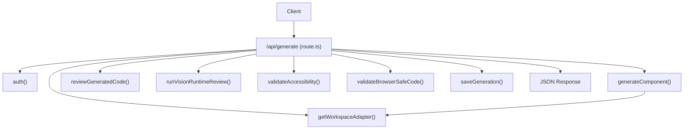
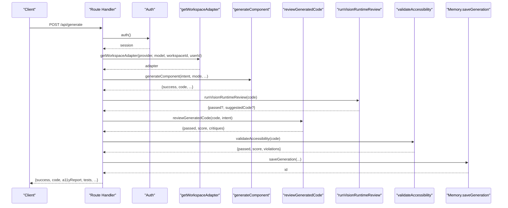
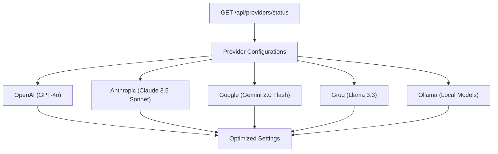
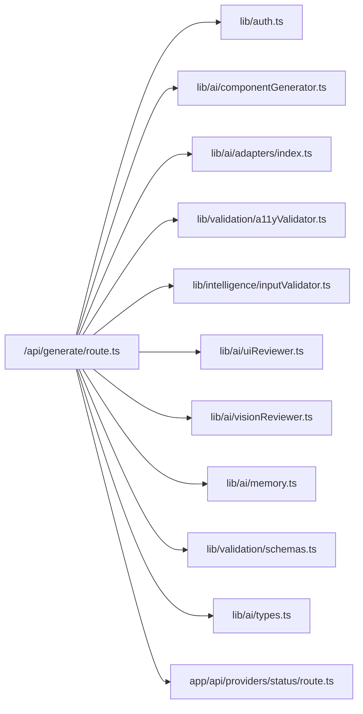

# Generation API

<cite>
**Referenced Files in This Document**
- [route.ts](file://app/api/generate/route.ts)
- [componentGenerator.ts](file://lib/ai/componentGenerator.ts)
- [adapters/index.ts](file://lib/ai/adapters/index.ts)
- [providers/status/route.ts](file://app/api/providers/status/route.ts)
- [schemas.ts](file://lib/validation/schemas.ts)
- [inputValidator.ts](file://lib/intelligence/inputValidator.ts)
- [uiReviewer.ts](file://lib/ai/uiReviewer.ts)
- [a11yValidator.ts](file://lib/validation/a11yValidator.ts)
- [visionReviewer.ts](file://lib/ai/visionReviewer.ts)
- [memory.ts](file://lib/ai/memory.ts)
- [types.ts](file://lib/ai/types.ts)
- [auth.ts](file://lib/auth.ts)
- [openai.ts](file://lib/ai/adapters/openai.ts)
- [anthropic.ts](file://lib/ai/adapters/anthropic.ts)
- [google.ts](file://lib/ai/adapters/google.ts)
- [ollama.ts](file://lib/ai/adapters/ollama.ts)
- [unconfigured.ts](file://lib/ai/adapters/unconfigured.ts)
</cite>

## Update Summary
**Changes Made**
- Enhanced provider status API with detailed comments explaining creative optimization rationale
- Updated PROVIDER_SETTINGS object documentation to reflect optimized settings for aesthetic UI generation with higher temperatures (0.7-0.9) and increased token limits (8k-16k)
- Added comprehensive provider configuration documentation with optimized settings for maximum creativity and aesthetic UI generation
- Updated provider ecosystem documentation to reflect current supported providers (openai, anthropic, google, groq, ollama)

## Table of Contents
1. [Introduction](#introduction)
2. [Project Structure](#project-structure)
3. [Core Components](#core-components)
4. [Architecture Overview](#architecture-overview)
5. [Detailed Component Analysis](#detailed-component-analysis)
6. [Dependency Analysis](#dependency-analysis)
7. [Performance Considerations](#performance-considerations)
8. [Troubleshooting Guide](#troubleshooting-guide)
9. [Conclusion](#conclusion)

## Introduction
This document provides comprehensive API documentation for the generation endpoint (/api/generate). It covers the POST method for generating React components and applications with detailed request/response schemas, authentication requirements, and streaming capabilities. It also documents the multi-stage generation pipeline, including validation, AI generation, expert review, accessibility repair, and safety validation, along with refinement workflows and workspace-specific AI adapter integration.

## Project Structure
The generation endpoint is implemented as a Next.js route handler that orchestrates a complex pipeline involving intent parsing, model selection, code generation, expert review, accessibility validation, and persistence.

**Diagram sources**
- [route.ts:25-438](file://app/api/generate/route.ts#L25-L438)
- [componentGenerator.ts:60-402](file://lib/ai/componentGenerator.ts#L60-L402)
- [adapters/index.ts:236-278](file://lib/ai/adapters/index.ts#L236-L278)

**Section sources**
- [route.ts:25-438](file://app/api/generate/route.ts#L25-L438)

## Core Components
- Endpoint: POST /api/generate
- Authentication: Required for non-streaming requests; validated via NextAuth.
- Streaming: Optional SSE streaming for raw model tokens when stream=true.
- Workspace Integration: Uses workspace-scoped AI adapters resolved server-side.
- Multi-stage Pipeline: Validation → Generation → Expert Review → Accessibility Repair → Safety Validation → Persistence.

**Section sources**
- [route.ts:25-438](file://app/api/generate/route.ts#L25-L438)
- [auth.ts:11-87](file://lib/auth.ts#L11-L87)

## Architecture Overview
The generation pipeline is orchestrated by the route handler. It validates inputs, selects a workspace-specific adapter, generates code, optionally reviews and repairs it, validates accessibility and safety, and persists results.

**Diagram sources**
- [route.ts:25-438](file://app/api/generate/route.ts#L25-L438)
- [componentGenerator.ts:60-402](file://lib/ai/componentGenerator.ts#L60-L402)
- [uiReviewer.ts:58-126](file://lib/ai/uiReviewer.ts#L58-L126)
- [visionReviewer.ts:30-137](file://lib/ai/visionReviewer.ts#L30-L137)
- [a11yValidator.ts:264-297](file://lib/validation/a11yValidator.ts#L264-L297)
- [memory.ts:55-124](file://lib/ai/memory.ts#L55-L124)

## Detailed Component Analysis

### Endpoint Definition
- Method: POST
- Path: /api/generate
- Purpose: Generate React components or apps with optional streaming.

**Section sources**
- [route.ts:25-438](file://app/api/generate/route.ts#L25-L438)

### Authentication and Authorization
- Non-streaming requests require authentication via NextAuth.
- The route obtains the current session and extracts user and workspace identifiers.
- Streaming requests do not require authentication but still use workspace-scoped adapters.

**Section sources**
- [route.ts:57-59](file://app/api/generate/route.ts#L57-L59)
- [auth.ts:11-87](file://lib/auth.ts#L11-L87)

### Request Body Schema
The request body is a JSON object with the following fields:
- intent (required): Object conforming to UIIntentSchema.
- mode (optional): One of component, app, depth_ui. Defaults to component.
- model (optional): Provider/model identifier. Required for streaming.
- maxTokens (optional): Number. Maximum tokens for generation.
- provider (optional): Provider name (openai, anthropic, google, groq, ollama).
- isMultiSlide (optional): Boolean. For multi-file outputs.
- prompt (optional): Text prompt to validate and augment generation.
- stream (optional): Boolean. Enables SSE streaming of raw tokens.
- thinkingPlan (optional): Arbitrary JSON structure for reasoning alignment.
- workspaceId (optional): String. Overrides x-workspace-id header.

Validation:
- Missing intent: 400 error.
- Invalid intent structure: 400 error with Zod issues.
- Invalid prompt: 400 error with suggestions.
- Invalid mode: 400 error.
- For streaming without model: 400 error.

**Section sources**
- [route.ts:41-129](file://app/api/generate/route.ts#L41-L129)
- [inputValidator.ts:53-125](file://lib/intelligence/inputValidator.ts#L53-L125)
- [schemas.ts:150-168](file://lib/validation/schemas.ts#L150-L168)

### Response Schema
Success response:
- success: Boolean
- code: String or Record<String,String> (TSX code or multi-file map)
- generationId: String (UUID)
- a11yReport: Object with fields passed, score, violations, suggestions, timestamp
- critique: Object from reviewGeneratedCode (when available)
- tests: Object with rtl and playwright test code
- mode: String (component, app, depth_ui)
- generatorMeta: Object with blueprint, validationWarnings, repairsApplied, feedbackEnriched

Error responses:
- 400: Invalid JSON, missing intent, invalid prompt/mode/intent, missing model for streaming
- 422: Generation result error or browser safety violation
- 500: Internal server error

**Section sources**
- [route.ts:414-431](file://app/api/generate/route.ts#L414-L431)
- [schemas.ts:330-339](file://lib/validation/schemas.ts#L330-L339)

### Streaming Mode (SSE)
When stream=true:
- Requires model to be provided.
- Uses getWorkspaceAdapter to resolve a workspace-scoped adapter.
- Streams raw token deltas via ReadableStream.
- Errors are sent as text chunks prefixed with [Stream Error: ...].

**Section sources**
- [route.ts:55-97](file://app/api/generate/route.ts#L55-L97)
- [adapters/index.ts:236-278](file://lib/ai/adapters/index.ts#L236-L278)

### Generation Modes
- component: Single-file React component.
- app: Multi-screen application with screens and navigation.
- depth_ui: Immersive depth UI with parallax and motion presets.

Mode selection influences blueprint, design rules, and downstream processing (e.g., multi-file outputs for app).

**Section sources**
- [route.ts:132-132](file://app/api/generate/route.ts#L132-L132)
- [componentGenerator.ts:43-58](file://lib/ai/componentGenerator.ts#L43-L58)

### Model Configuration and Adapter Resolution
- Provider and model are resolved server-side via getWorkspaceAdapter.
- Supports named providers (openai, anthropic, google, groq) and OpenAI-compatible providers (groq, lmstudio).
- Credentials are resolved from workspace settings or environment variables.
- For local models (ollama, lmstudio) or fast-compatible providers (groq), expert review is skipped to reduce cost and latency.

**Updated** Enhanced provider status API with detailed comments explaining creative optimization rationale. The PROVIDER_SETTINGS object now reflects optimized settings for aesthetic UI generation with higher temperatures (0.7-0.9) and increased token limits (8k-16k).

**Section sources**
- [route.ts:137-152](file://app/api/generate/route.ts#L137-L152)
- [adapters/index.ts:236-278](file://lib/ai/adapters/index.ts#L236-L278)

### Provider Status API and Optimized Settings

#### Enhanced Provider Status Endpoint
The `/api/providers/status` endpoint provides comprehensive provider configuration information with detailed optimization rationale:

**Diagram sources**
- [providers/status/route.ts:126-203](file://app/api/providers/status/route.ts#L126-L203)

#### Optimized Provider Settings for Creative UI Generation
The PROVIDER_SETTINGS object defines optimized parameters for maximum creativity and aesthetic UI generation:

**Creative Optimization Rationale:**
- Higher temperatures (0.7-0.9) for creative, visually stunning components
- Increased token limits (8k-16k) for full applications with depth UI
- Tailored settings for different provider strengths and capabilities

**Provider-Specific Settings:**
- **OpenAI**: Temperature 0.85, 16k maxTokens, topP 0.95, frequencyPenalty 0.2, presencePenalty 0.2
- **Anthropic**: Temperature 0.8, 8k maxTokens, topP 0.95  
- **Google**: Temperature 0.85, 16k maxTokens, topP 0.95
- **Groq**: Temperature 0.75, 8k maxTokens, topP 0.92
- **Ollama**: Temperature 0.9, 4k maxTokens, topP 0.95

**Section sources**
- [providers/status/route.ts:13-59](file://app/api/providers/status/route.ts#L13-L59)
- [providers/status/route.ts:126-203](file://app/api/providers/status/route.ts#L126-L203)

### Multi-Stage Generation Pipeline

#### Stage 1: Validation and Intent Parsing
- Validates prompt (if present).
- Validates generation mode.
- Parses and validates intent using UIIntentSchema.

**Section sources**
- [route.ts:100-129](file://app/api/generate/route.ts#L100-L129)

#### Stage 2: Generation
- Orchestrated by generateComponent.
- Selects blueprint and design rules.
- Resolves model profile and pipeline configuration.
- Builds model-aware prompt with knowledge/memory/context.
- Executes adapter.generate with optional tool-calls.
- Extracts and beautifies code; applies deterministic validation and repair.

**Section sources**
- [componentGenerator.ts:60-402](file://lib/ai/componentGenerator.ts#L60-L402)

#### Stage 3: Expert Review and Repair (Optional)
- Skipped for local models or when fast-compatible provider is detected.
- Vision runtime review: Renders code in headless browser, captures screenshots, and critiques visual quality.
- Text-based expert review: Scores and critiques code quality.
- Repair agent: Applies targeted fixes when review fails.

**Section sources**
- [route.ts:242-312](file://app/api/generate/route.ts#L242-L312)
- [visionReviewer.ts:30-137](file://lib/ai/visionReviewer.ts#L30-L137)
- [uiReviewer.ts:58-126](file://lib/ai/uiReviewer.ts#L58-L126)

#### Stage 4: Accessibility Repair and Safety Validation
- Static accessibility validation and auto-repair.
- Browser safety validation to block unsafe patterns.
- Parallel execution of accessibility and test generation.

**Section sources**
- [route.ts:328-352](file://app/api/generate/route.ts#L328-L352)
- [a11yValidator.ts:264-297](file://lib/validation/a11yValidator.ts#L264-L297)

#### Stage 5: Persistence and Dependency Resolution
- Saves generation to memory (Prisma) when appropriate.
- Resolves and patches dependencies for multi-file outputs.
- Returns final code (single or multi-file) with metadata.

**Section sources**
- [route.ts:358-406](file://app/api/generate/route.ts#L358-L406)
- [memory.ts:55-124](file://lib/ai/memory.ts#L55-L124)

### Refinement Workflow
- When intent.isRefinement is true and previousProjectId is provided, the system retrieves prior code and manifest.
- Uses the retrieved code as refinement context for generateComponent.
- Supports targeting specific files via intent.targetFiles.

**Section sources**
- [route.ts:156-175](file://app/api/generate/route.ts#L156-L175)
- [memory.ts:126-152](file://lib/ai/memory.ts#L126-L152)

### Security and Safety
- Browser safety validation rejects unsafe code patterns.
- Input sanitization removes injection attempts.
- Strict provider credential resolution prevents client-specified API keys or base URLs.

**Section sources**
- [route.ts:318-326](file://app/api/generate/route.ts#L318-L326)
- [inputValidator.ts:111-116](file://lib/intelligence/inputValidator.ts#L111-L116)
- [adapters/index.ts:4-8](file://lib/ai/adapters/index.ts#L4-L8)

### Examples

#### Example Request Payload (Non-streaming)
- mode: component
- model: gpt-4o
- provider: openai
- prompt: "Create a modern login form with email and password fields"
- intent: {
  "componentType": "component",
  "componentName": "LoginForm",
  "description": "Modern login form",
  "fields": [
    {"id": "email", "type": "email", "label": "Email", "required": true},
    {"id": "password", "type": "password", "label": "Password", "required": true}
  ],
  "layout": {"type": "single-column", "maxWidth": "md", "alignment": "left"},
  "interactions": [],
  "theme": {"variant": "primary", "size": "md"},
  "a11yRequired": []
}

#### Example Streaming Request
- stream: true
- model: gpt-4o
- prompt: "Generate a simple counter component"

#### Example Response (Success)
- success: true
- code: "<TSX code string>"
- generationId: "uuid"
- a11yReport: {passed: true, score: 95, violations: [], suggestions: []}
- tests: {rtl: "...", playwright: "..."}
- mode: "component"
- generatorMeta: {blueprint: {...}, validationWarnings: [], repairsApplied: [], feedbackEnriched: false

#### Example Error Responses
- 400: "Invalid JSON in request body"
- 400: "Missing required field: intent"
- 400: "Invalid generation mode ..."
- 422: "Generated code contains browser-unsafe patterns ..."
- 500: "Internal server error"

**Section sources**
- [route.ts:35-46](file://app/api/generate/route.ts#L35-L46)
- [route.ts:102-107](file://app/api/generate/route.ts#L102-L107)
- [route.ts:113-116](file://app/api/generate/route.ts#L113-L116)
- [route.ts:204-207](file://app/api/generate/route.ts#L204-L207)
- [route.ts:434-437](file://app/api/generate/route.ts#L434-L437)

## Dependency Analysis
The endpoint depends on several libraries for orchestration, validation, and persistence.

**Diagram sources**
- [route.ts:1-23](file://app/api/generate/route.ts#L1-L23)
- [componentGenerator.ts:1-42](file://lib/ai/componentGenerator.ts#L1-L42)
- [adapters/index.ts:1-306](file://lib/ai/adapters/index.ts#L1-L306)
- [a11yValidator.ts:1-376](file://lib/validation/a11yValidator.ts#L1-L376)
- [inputValidator.ts:1-137](file://lib/intelligence/inputValidator.ts#L1-L137)
- [uiReviewer.ts:1-199](file://lib/ai/uiReviewer.ts#L1-L199)
- [visionReviewer.ts:1-181](file://lib/ai/visionReviewer.ts#L1-L181)
- [memory.ts:1-211](file://lib/ai/memory.ts#L1-L211)
- [schemas.ts:1-340](file://lib/validation/schemas.ts#L1-L340)
- [types.ts:1-130](file://lib/ai/types.ts#L1-L130)
- [providers/status/route.ts:1-204](file://app/api/providers/status/route.ts#L1-L204)

**Section sources**
- [route.ts:1-23](file://app/api/generate/route.ts#L1-L23)

## Performance Considerations
- Streaming: Enables immediate token delivery for long generations.
- Local model detection: Skips expensive expert review for local/Groq/LM Studio to reduce latency and cost.
- Parallel processing: Accessibility validation and test generation run concurrently.
- Timeout guards: Review phase is bounded by a 60-second aggregate timeout to prevent exceeding platform limits.
- Caching: Adapters support caching for both generate and stream operations.

**Section sources**
- [route.ts:137-152](file://app/api/generate/route.ts#L137-L152)
- [route.ts:328-352](file://app/api/generate/route.ts#L328-L352)
- [route.ts:246-305](file://app/api/generate/route.ts#L246-L305)
- [adapters/index.ts:82-138](file://lib/ai/adapters/index.ts#L82-L138)

## Troubleshooting Guide
Common issues and resolutions:
- Missing or invalid intent: Ensure intent conforms to UIIntentSchema.
- Prompt validation failures: Improve specificity and avoid low-signal phrases.
- Generation errors: Check provider credentials and model availability.
- Browser safety violations: Remove unsafe patterns flagged in the error response.
- Reviewer unavailability: Confirm quota and provider configuration; pipeline continues without expert review if unavailable.
- Vision review limitations: Requires Browserless API key on Vercel; otherwise skipped.

**Section sources**
- [route.ts:100-129](file://app/api/generate/route.ts#L100-L129)
- [route.ts:196-207](file://app/api/generate/route.ts#L196-L207)
- [route.ts:318-326](file://app/api/generate/route.ts#L318-L326)
- [uiReviewer.ts:115-125](file://lib/ai/uiReviewer.ts#L115-L125)
- [visionReviewer.ts:117-131](file://lib/ai/visionReviewer.ts#L117-L131)

## Conclusion
The /api/generate endpoint provides a robust, secure, and extensible pipeline for generating high-quality, accessible React components and applications. It integrates workspace-specific AI adapters, performs multi-layer validation and repair, and offers both synchronous and streaming generation modes. The documented schemas and flows enable reliable client integration and predictable behavior across environments.

**Updated** The provider ecosystem has been enhanced with detailed creative optimization rationale and optimized settings for aesthetic UI generation. The PROVIDER_SETTINGS object now reflects higher temperatures (0.7-0.9) and increased token limits (8k-16k) for maximum creativity, while the provider status API provides comprehensive configuration information with detailed optimization explanations. The current supported providers include openai, anthropic, google, groq, and ollama, with simplified configuration and enhanced performance characteristics for UI generation workflows.