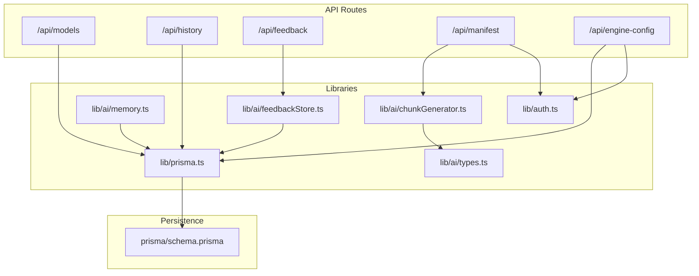
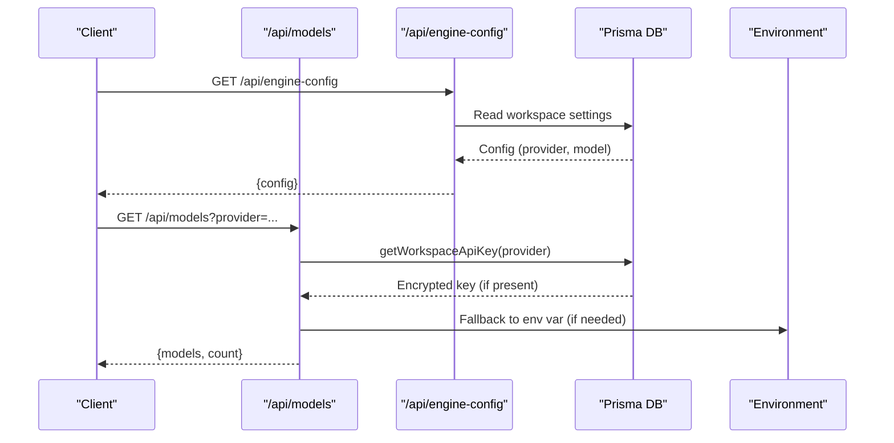
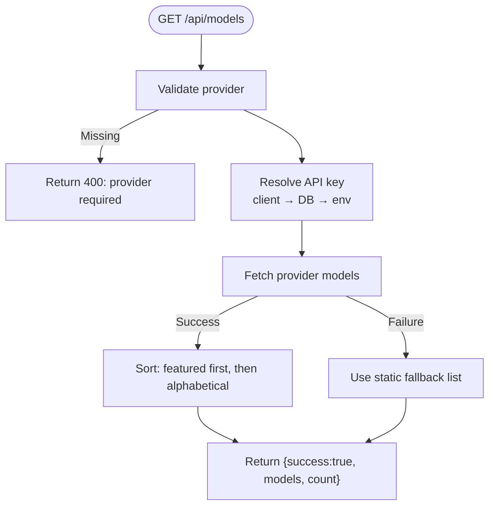
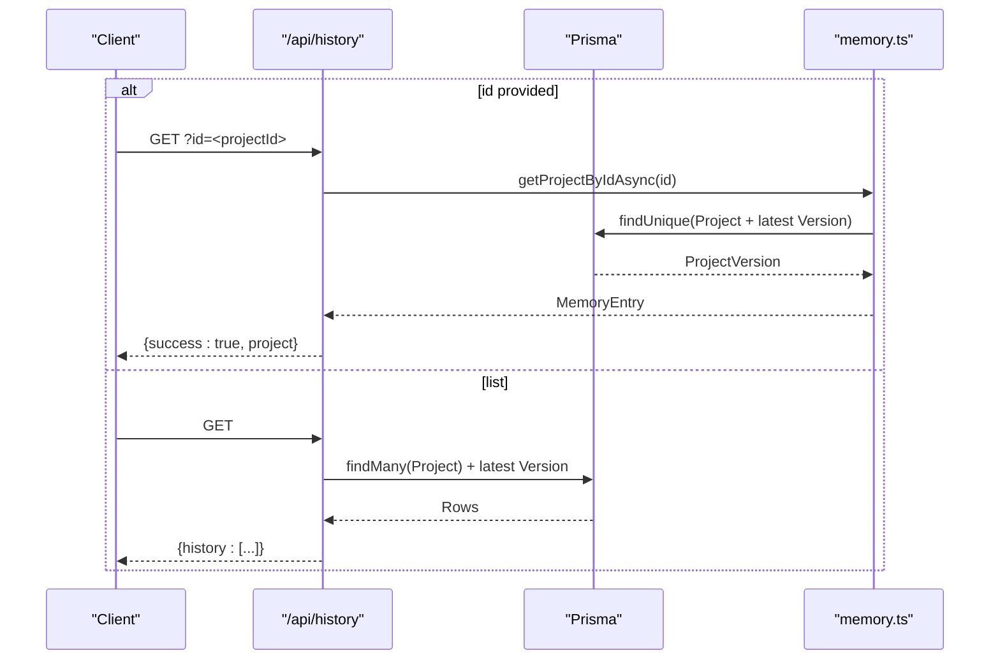
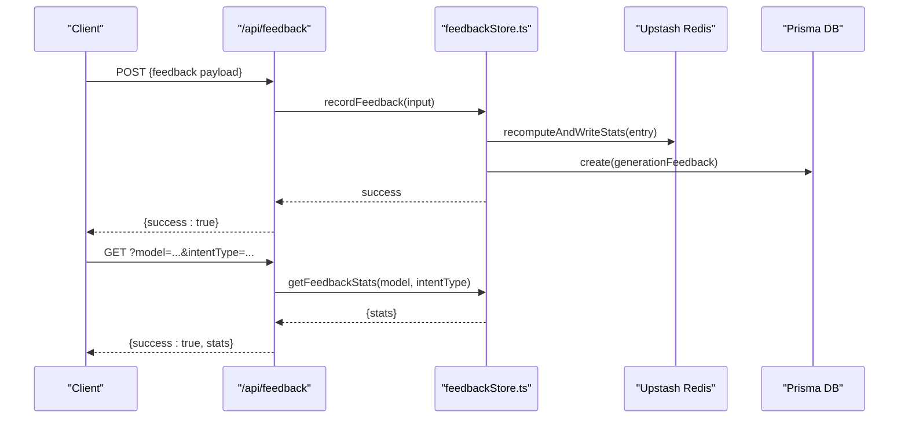
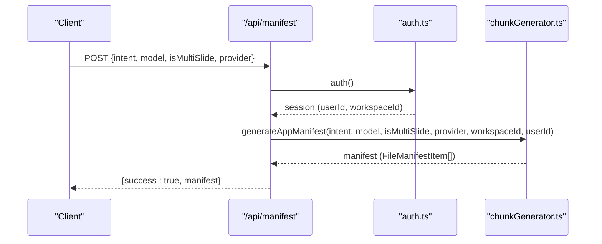
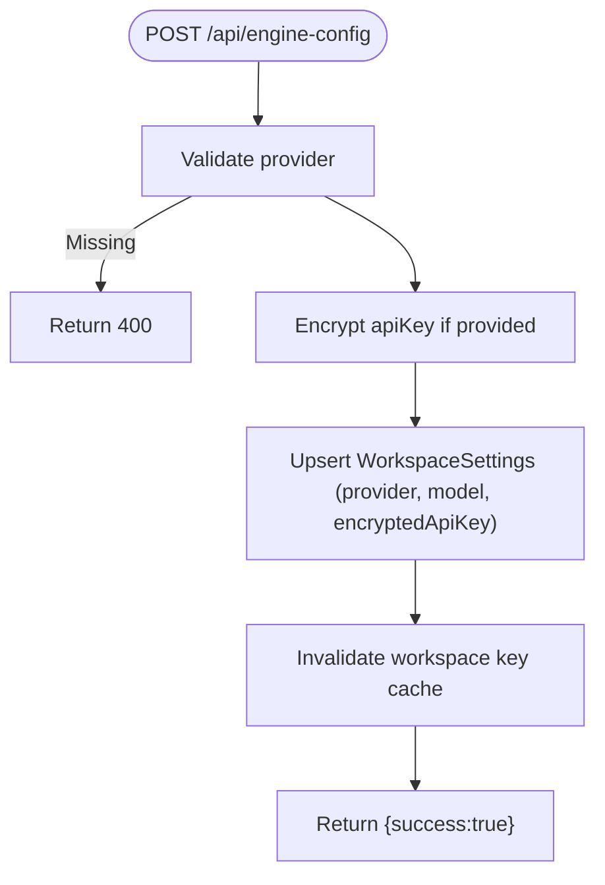
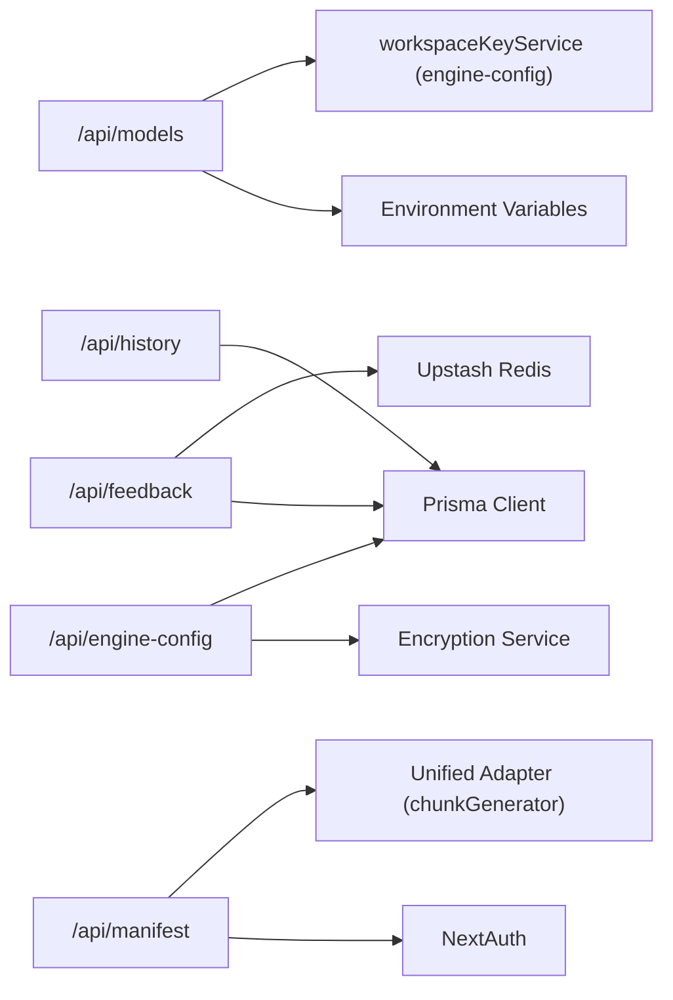

# Utility APIs

<cite>
**Referenced Files in This Document**
- [models/route.ts](file://app/api/models/route.ts)
- [history/route.ts](file://app/api/history/route.ts)
- [feedback/route.ts](file://app/api/feedback/route.ts)
- [feedbackStore.ts](file://lib/ai/feedbackStore.ts)
- [manifest/route.ts](file://app/api/manifest/route.ts)
- [chunkGenerator.ts](file://lib/ai/chunkGenerator.ts)
- [memory.ts](file://lib/ai/memory.ts)
- [prisma.ts](file://lib/prisma.ts)
- [schema.prisma](file://prisma/schema.prisma)
- [engine-config/route.ts](file://app/api/engine-config/route.ts)
- [auth.ts](file://lib/auth.ts)
- [types.ts](file://lib/ai/types.ts)
</cite>

## Table of Contents
1. [Introduction](#introduction)
2. [Project Structure](#project-structure)
3. [Core Components](#core-components)
4. [Architecture Overview](#architecture-overview)
5. [Detailed Component Analysis](#detailed-component-analysis)
6. [Dependency Analysis](#dependency-analysis)
7. [Performance Considerations](#performance-considerations)
8. [Troubleshooting Guide](#troubleshooting-guide)
9. [Conclusion](#conclusion)

## Introduction
This document describes the utility APIs that power model discovery, history tracking, feedback collection, and manifest generation. It covers request/response schemas, authentication requirements, integration patterns with the generation pipeline, and data persistence layers. These endpoints are essential for configuring AI providers, auditing generation history, collecting user insights for quality improvement, and generating component metadata for multi-file applications.

## Project Structure
The utility endpoints live under app/api and integrate with shared libraries for persistence, authentication, and AI adapters.

**Diagram sources**
- [models/route.ts:1-457](file://app/api/models/route.ts#L1-L457)
- [history/route.ts:1-60](file://app/api/history/route.ts#L1-L60)
- [feedback/route.ts:1-85](file://app/api/feedback/route.ts#L1-L85)
- [manifest/route.ts:1-57](file://app/api/manifest/route.ts#L1-L57)
- [engine-config/route.ts:1-154](file://app/api/engine-config/route.ts#L1-L154)
- [prisma.ts:1-70](file://lib/prisma.ts#L1-L70)
- [auth.ts:1-87](file://lib/auth.ts#L1-L87)
- [memory.ts:1-211](file://lib/ai/memory.ts#L1-L211)
- [feedbackStore.ts:1-356](file://lib/ai/feedbackStore.ts#L1-L356)
- [chunkGenerator.ts:1-220](file://lib/ai/chunkGenerator.ts#L1-L220)
- [types.ts:1-130](file://lib/ai/types.ts#L1-L130)
- [schema.prisma:1-222](file://prisma/schema.prisma#L1-L222)

**Section sources**
- [models/route.ts:1-457](file://app/api/models/route.ts#L1-L457)
- [history/route.ts:1-60](file://app/api/history/route.ts#L1-L60)
- [feedback/route.ts:1-85](file://app/api/feedback/route.ts#L1-L85)
- [manifest/route.ts:1-57](file://app/api/manifest/route.ts#L1-L57)
- [engine-config/route.ts:1-154](file://app/api/engine-config/route.ts#L1-L154)
- [prisma.ts:1-70](file://lib/prisma.ts#L1-L70)
- [auth.ts:1-87](file://lib/auth.ts#L1-L87)
- [memory.ts:1-211](file://lib/ai/memory.ts#L1-L211)
- [feedbackStore.ts:1-356](file://lib/ai/feedbackStore.ts#L1-L356)
- [chunkGenerator.ts:1-220](file://lib/ai/chunkGenerator.ts#L1-L220)
- [types.ts:1-130](file://lib/ai/types.ts#L1-L130)
- [schema.prisma:1-222](file://prisma/schema.prisma#L1-L222)

## Core Components
- Models endpoint: Lists available models for configured providers, with fallbacks and environment-based resolution.
- History endpoint: Retrieves generation summaries and detailed project records persisted in the database.
- Feedback endpoint: Accepts user signals and metrics, aggregates statistics, and persists structured feedback.
- Manifest endpoint: Generates a file manifest for multi-file application scaffolding using the configured provider and model.
- Engine config endpoint: Manages workspace-level provider/model selection and encrypted API key storage.

**Section sources**
- [models/route.ts:1-457](file://app/api/models/route.ts#L1-L457)
- [history/route.ts:1-60](file://app/api/history/route.ts#L1-L60)
- [feedback/route.ts:1-85](file://app/api/feedback/route.ts#L1-L85)
- [manifest/route.ts:1-57](file://app/api/manifest/route.ts#L1-L57)
- [engine-config/route.ts:1-154](file://app/api/engine-config/route.ts#L1-L154)

## Architecture Overview
The utility APIs integrate with authentication, persistence, and AI adapters. The models endpoint resolves keys from client input, database, or environment variables. The history endpoint uses Prisma-backed memory. The feedback endpoint writes to both Redis-backed stats and Prisma. The manifest endpoint uses the unified adapter layer to generate manifests securely.

**Diagram sources**
- [models/route.ts:206-456](file://app/api/models/route.ts#L206-L456)
- [engine-config/route.ts:36-65](file://app/api/engine-config/route.ts#L36-L65)
- [prisma.ts:1-70](file://lib/prisma.ts#L1-L70)

## Detailed Component Analysis

### Models Endpoint
Purpose: List available models for a given provider and optional API key/base URL. Supports cloud providers and local/compatible endpoints.

- Method: GET
- Path: /api/models
- Query parameters:
  - provider (required): Provider identifier (e.g., openai, anthropic, google, groq, openrouter, together, deepseek, mistral, meta, qwen, gemma, ollama, lmstudio).
  - apiKey (optional): Client-supplied API key (masked as "••••" in logs).
  - baseUrl (optional): Base URL for custom providers or local endpoints.
- Authentication: Not required by the endpoint itself; however, provider-specific keys are resolved via workspace settings or environment variables.
- Response:
  - success: boolean
  - models: array of ModelInfo
  - count: number
- Error responses:
  - 400: Missing provider or invalid custom provider without baseUrl.
  - 401: Authentication failure surfaced as a distinct error flag.
  - 500: General failure with sanitized message.

ModelInfo fields:
- id: string (provider model identifier)
- name: string (display name)
- description: string (optional)
- contextWindow: number (optional)
- isFeatured: boolean (recommended models pinned to the top)

Key behaviors:
- Resolves API key precedence: client-provided → DB-stored encrypted key → environment variable.
- Provides static fallback lists for major providers when keys are missing.
- Supports OpenRouter, Together, Mistral, Meta/Qwen/Gemma variants, and local Ollama/LM Studio.
- Sorts results: featured models first, then alphabetically.

**Diagram sources**
- [models/route.ts:206-456](file://app/api/models/route.ts#L206-L456)

**Section sources**
- [models/route.ts:1-457](file://app/api/models/route.ts#L1-L457)

### History Endpoint
Purpose: Retrieve generation history for audit and user activity. Supports single-project lookup and a paginated list of recent projects.

- Method: GET
- Path: /api/history
- Query parameters:
  - id (optional): Project identifier to fetch a single project with its latest version.
- Authentication: Not required by the endpoint; however, the UI typically requires authentication.
- Response:
  - For single project: { success: true, project }
  - For list: { history: Array of summarized entries }
- Summarized history fields:
  - id: string
  - timestamp: ISO string
  - componentType: string
  - componentName: string
  - promptSnippet: string (truncated description)

Data persistence:
- Uses Prisma to query Project and ProjectVersion tables.
- Applies withReconnect to handle transient Neon database errors.

**Diagram sources**
- [history/route.ts:5-59](file://app/api/history/route.ts#L5-L59)
- [memory.ts:126-152](file://lib/ai/memory.ts#L126-L152)
- [prisma.ts:58-69](file://lib/prisma.ts#L58-L69)

**Section sources**
- [history/route.ts:1-60](file://app/api/history/route.ts#L1-L60)
- [memory.ts:1-211](file://lib/ai/memory.ts#L1-L211)
- [prisma.ts:1-70](file://lib/prisma.ts#L1-L70)

### Feedback Endpoint
Purpose: Collect user feedback signals and metrics to improve quality and gain insights. Also exposes aggregated statistics.

- Methods:
  - POST /api/feedback: Record feedback
  - GET /api/feedback: Retrieve aggregated stats
- POST body schema:
  - generationId: string (non-empty)
  - signal: enum ["thumbs_up","thumbs_down","corrected","discarded"]
  - model: string (non-empty)
  - provider: string (non-empty)
  - intentType: string (non-empty)
  - promptHash: string (non-empty)
  - a11yScore: integer 0..100 (default 0)
  - critiqueScore: integer 0..100 (default 0)
  - latencyMs: integer ≥ 0 (default 0)
  - workspaceId: string (optional)
  - correctionNote: string ≤ 2000 chars (optional)
  - correctedCode: string ≤ 200000 chars (optional)
- GET query parameters:
  - model (optional)
  - intentType (optional)
- Authentication: Not required by the endpoint; however, the UI typically requires authentication.
- Response:
  - POST: { success: true } or error
  - GET: { success: true, stats } or { success: true, stats: all }

Storage and caching:
- Dual-write strategy:
  - Stats cache: Redis-backed with in-memory fallback (Upstash Redis).
  - Persistence: Prisma GenerationFeedback table.
- Quality-gated embedding: Only corrected generations meeting thresholds are embedded for semantic memory.

**Diagram sources**
- [feedback/route.ts:28-84](file://app/api/feedback/route.ts#L28-L84)
- [feedbackStore.ts:211-276](file://lib/ai/feedbackStore.ts#L211-L276)
- [schema.prisma:137-154](file://prisma/schema.prisma#L137-L154)

**Section sources**
- [feedback/route.ts:1-85](file://app/api/feedback/route.ts#L1-L85)
- [feedbackStore.ts:1-356](file://lib/ai/feedbackStore.ts#L1-L356)
- [schema.prisma:128-154](file://prisma/schema.prisma#L128-L154)

### Manifest Endpoint
Purpose: Generate a file manifest for multi-file application scaffolding using the configured provider and model. The endpoint validates inputs, authenticates via session, and delegates to the chunk generator.

- Method: POST
- Path: /api/manifest
- Request body:
  - intent: UIIntent (from validation schemas)
  - model: string (provider model identifier)
  - isMultiSlide: boolean (optional)
  - provider: string (provider name; validated)
- Headers:
  - x-workspace-id: string (workspace context; defaults to "default")
- Authentication: Required via NextAuth session.
- Response:
  - { success: true, manifest: FileManifestItem[] }
- Error responses:
  - 400: Missing intent or model
  - 403: Provider not configured (API key missing)
  - 500: General failure

Security:
- Never accepts apiKey or baseUrl from the client; resolves credentials server-side.

Integration:
- Uses generateAppManifest from chunkGenerator.ts with the unified adapter layer.
- Logs request lifecycle and returns file counts for observability.

**Diagram sources**
- [manifest/route.ts:7-56](file://app/api/manifest/route.ts#L7-L56)
- [chunkGenerator.ts:27-99](file://lib/ai/chunkGenerator.ts#L27-L99)
- [auth.ts:1-87](file://lib/auth.ts#L1-L87)

**Section sources**
- [manifest/route.ts:1-57](file://app/api/manifest/route.ts#L1-L57)
- [chunkGenerator.ts:1-220](file://lib/ai/chunkGenerator.ts#L1-L220)
- [types.ts:59-68](file://lib/ai/types.ts#L59-L68)

### Engine Config Endpoint
Purpose: Manage workspace-level AI engine configuration, including provider, model, and encrypted API key storage.

- Methods:
  - GET /api/engine-config: Retrieve active config (no keys)
  - POST /api/engine-config: Save provider, model, and optionally encrypted API key
  - DELETE /api/engine-config: Remove all workspace settings (deactivate engine)
- Authentication: Required via NextAuth session.
- Response:
  - GET: { success: true, config: { provider, model?, hasKey, updatedAt? } }
  - POST: { success: true }
  - DELETE: { success: true }

Behavior:
- Encrypts API keys at rest using encryptionService.
- Never returns keys to the client.
- Invalidates cached workspace keys after updates/deletes.

**Diagram sources**
- [engine-config/route.ts:69-127](file://app/api/engine-config/route.ts#L69-L127)

**Section sources**
- [engine-config/route.ts:1-154](file://app/api/engine-config/route.ts#L1-L154)

## Dependency Analysis
- Models endpoint depends on:
  - Provider-specific fetchers and environment variables.
  - Workspace key resolution via engine-config persistence.
- History endpoint depends on:
  - Prisma models for Project and ProjectVersion.
  - withReconnect for transient database errors.
- Feedback endpoint depends on:
  - Upstash Redis for stats caching (with in-memory fallback).
  - Prisma for persistent feedback storage.
- Manifest endpoint depends on:
  - Unified adapter layer via chunkGenerator.ts.
  - NextAuth session for workspace context.
- Engine config endpoint depends on:
  - Prisma for workspace settings.
  - Encryption service for secure key storage.

**Diagram sources**
- [models/route.ts:220-229](file://app/api/models/route.ts#L220-L229)
- [history/route.ts:22-28](file://app/api/history/route.ts#L22-L28)
- [feedback/route.ts:1-8](file://app/api/feedback/route.ts#L1-L8)
- [feedbackStore.ts:88-104](file://lib/ai/feedbackStore.ts#L88-L104)
- [manifest/route.ts:21-36](file://app/api/manifest/route.ts#L21-L36)
- [engine-config/route.ts:69-127](file://app/api/engine-config/route.ts#L69-L127)

**Section sources**
- [models/route.ts:1-457](file://app/api/models/route.ts#L1-L457)
- [history/route.ts:1-60](file://app/api/history/route.ts#L1-L60)
- [feedback/route.ts:1-85](file://app/api/feedback/route.ts#L1-L85)
- [feedbackStore.ts:1-356](file://lib/ai/feedbackStore.ts#L1-L356)
- [manifest/route.ts:1-57](file://app/api/manifest/route.ts#L1-L57)
- [engine-config/route.ts:1-154](file://app/api/engine-config/route.ts#L1-L154)

## Performance Considerations
- Models endpoint:
  - Enforces a strict maxDuration and timeouts for external provider calls.
  - Uses static fallbacks to avoid repeated network failures.
- History endpoint:
  - Limits results and uses efficient joins to latest versions.
  - withReconnect mitigates transient database connectivity issues.
- Feedback endpoint:
  - Fire-and-forget writes reduce latency; stats recomputation is incremental.
  - Redis caching reduces hot-path DB reads.
- Manifest endpoint:
  - Uses exponential backoff on rate limits and returns safe defaults on failure.
- Engine config endpoint:
  - Upserts minimize DB round trips; cache invalidation ensures freshness.

[No sources needed since this section provides general guidance]

## Troubleshooting Guide
Common issues and resolutions:
- Models endpoint returns 401:
  - Indicates an authentication failure with the provider. Verify the configured key and provider settings.
- Models endpoint returns static fallback list:
  - Occurs when no key is configured; configure the key via engine-config or provide a valid apiKey query parameter.
- History endpoint returns empty list:
  - Ensure projects exist and are accessible; check database connectivity and withReconnect behavior.
- Feedback endpoint fails to persist:
  - Redis unavailability triggers in-memory fallback; Prisma writes are fire-and-forget and non-fatal.
- Manifest endpoint returns 403:
  - Provider not configured; configure the API key in engine-config.
- Engine config endpoint returns 500:
  - Check encryption service availability and Prisma connectivity.

**Section sources**
- [models/route.ts:445-455](file://app/api/models/route.ts#L445-L455)
- [history/route.ts:55-58](file://app/api/history/route.ts#L55-L58)
- [feedbackStore.ts:106-139](file://lib/ai/feedbackStore.ts#L106-L139)
- [manifest/route.ts:42-55](file://app/api/manifest/route.ts#L42-L55)
- [engine-config/route.ts:123-126](file://app/api/engine-config/route.ts#L123-L126)

## Conclusion
The utility APIs provide a cohesive foundation for model discovery, history tracking, feedback-driven improvements, and manifest generation. They integrate securely with authentication, resilient persistence, and provider-agnostic adapters, enabling reliable operation across environments and robust data handling for analytics and quality assurance.