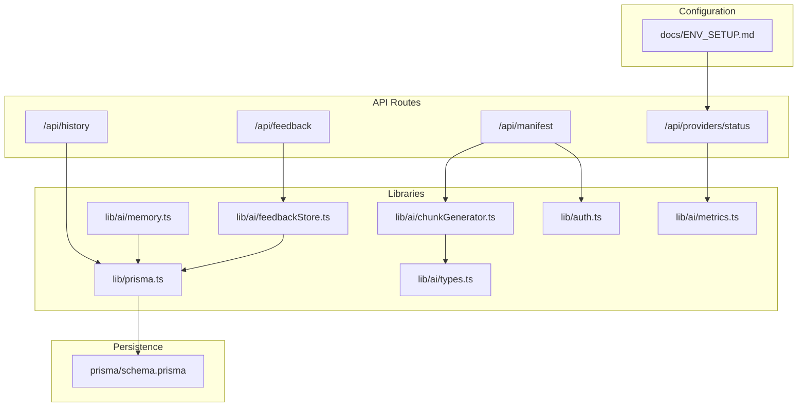
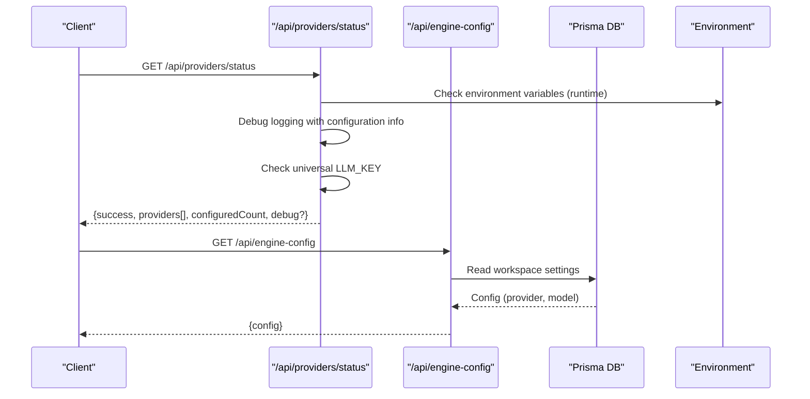
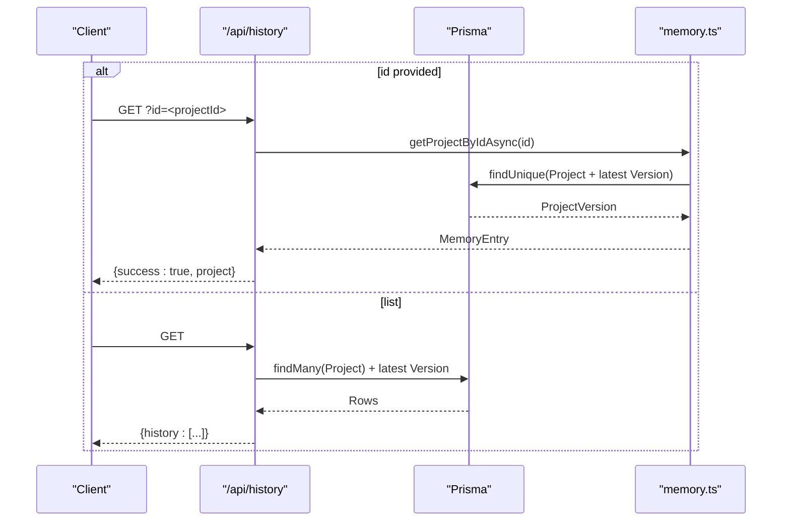
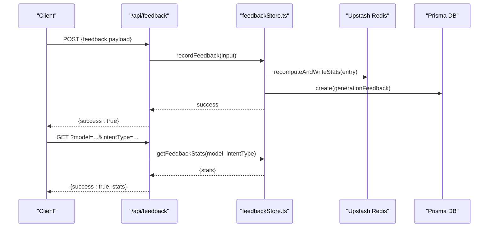
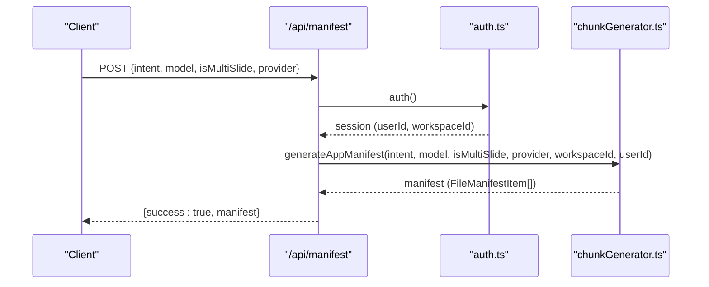
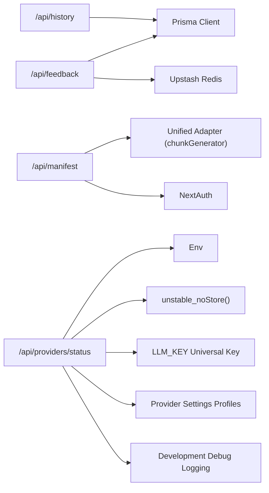

# Utility APIs

<cite>
**Referenced Files in This Document**
- [history/route.ts](file://app/api/history/route.ts)
- [feedback/route.ts](file://app/api/feedback/route.ts)
- [feedbackStore.ts](file://lib/ai/feedbackStore.ts)
- [manifest/route.ts](file://app/api/manifest/route.ts)
- [chunkGenerator.ts](file://lib/ai/chunkGenerator.ts)
- [memory.ts](file://lib/ai/memory.ts)
- [prisma.ts](file://lib/prisma.ts)
- [schema.prisma](file://prisma/schema.prisma)
- [providers/status/route.ts](file://app/api/providers/status/route.ts)
- [metrics.ts](file://lib/ai/metrics.ts)
- [auth.ts](file://lib/auth.ts)
- [types.ts](file://lib/ai/types.ts)
- [ENV_SETUP.md](file://docs/ENV_SETUP.md)
</cite>

## Update Summary
**Changes Made**
- Removed references to previously documented endpoints: /api/local-models, /api/models, /api/ollama/models, and /api/usage
- Updated provider status API documentation to reflect comprehensive runtime environment variable checking, debugging capabilities, caching prevention, universal LLM_KEY support, and optimized provider settings
- Enhanced provider configuration management with development environment debug information and immediate configuration reflection
- Updated ModelSelectionGate integration to leverage real-time provider status detection
- Improved troubleshooting capabilities with detailed logging and diagnostic information

## Table of Contents
1. [Introduction](#introduction)
2. [Project Structure](#project-structure)
3. [Core Components](#core-components)
4. [Architecture Overview](#architecture-overview)
5. [Detailed Component Analysis](#detailed-component-analysis)
6. [Dependency Analysis](#dependency-analysis)
7. [Performance Considerations](#performance-considerations)
8. [Troubleshooting Guide](#troubleshooting-guide)
9. [Conclusion](#conclusion)

## Introduction
This document describes the utility APIs that power history tracking, feedback collection, manifest generation, and provider configuration management. It covers request/response schemas, authentication requirements, integration patterns with the generation pipeline, and data persistence layers. These endpoints are essential for auditing generation history, collecting user insights for quality improvement, generating component metadata for multi-file applications, and managing provider credentials through a streamlined configuration approach.

**Updated** The provider status API now includes comprehensive runtime environment variable checking, debugging capabilities, caching prevention with `unstable_noStore()`, universal LLM_KEY support, and development environment debug information. These enhancements provide immediate reflection of dynamic configuration changes, comprehensive troubleshooting capabilities, and seamless integration with the ModelSelectionGate component for streamlined provider setup.

## Project Structure
The utility endpoints live under app/api and integrate with shared libraries for persistence, authentication, and AI adapters. The new providers/status endpoint centralizes provider detection from environment variables with enhanced debugging capabilities and optimized provider settings.



**Diagram sources**
- [history/route.ts:1-60](file://app/api/history/route.ts#L1-L60)
- [feedback/route.ts:1-85](file://app/api/feedback/route.ts#L1-L85)
- [manifest/route.ts:1-57](file://app/api/manifest/route.ts#L1-L57)
- [providers/status/route.ts:1-215](file://app/api/providers/status/route.ts#L1-L215)
- [prisma.ts:1-70](file://lib/prisma.ts#L1-L70)
- [auth.ts:1-87](file://lib/auth.ts#L1-L87)
- [memory.ts:1-211](file://lib/ai/memory.ts#L1-L211)
- [feedbackStore.ts:1-356](file://lib/ai/feedbackStore.ts#L1-L356)
- [chunkGenerator.ts:1-220](file://lib/ai/chunkGenerator.ts#L1-L220)
- [types.ts:1-130](file://lib/ai/types.ts#L1-L130)
- [schema.prisma:1-222](file://prisma/schema.prisma#L1-L222)
- [metrics.ts:1-88](file://lib/ai/metrics.ts#L1-L88)
- [ENV_SETUP.md:1-43](file://docs/ENV_SETUP.md#L1-L43)

**Section sources**
- [history/route.ts:1-60](file://app/api/history/route.ts#L1-L60)
- [feedback/route.ts:1-85](file://app/api/feedback/route.ts#L1-L85)
- [manifest/route.ts:1-57](file://app/api/manifest/route.ts#L1-L57)
- [providers/status/route.ts:1-215](file://app/api/providers/status/route.ts#L1-L215)
- [prisma.ts:1-70](file://lib/prisma.ts#L1-L70)
- [auth.ts:1-87](file://lib/auth.ts#L1-L87)
- [memory.ts:1-211](file://lib/ai/memory.ts#L1-L211)
- [feedbackStore.ts:1-356](file://lib/ai/feedbackStore.ts#L1-L356)
- [chunkGenerator.ts:1-220](file://lib/ai/chunkGenerator.ts#L1-L220)
- [types.ts:1-130](file://lib/ai/types.ts#L1-L130)
- [schema.prisma:1-222](file://prisma/schema.prisma#L1-L222)
- [metrics.ts:1-88](file://lib/ai/metrics.ts#L1-L88)
- [ENV_SETUP.md:1-43](file://docs/ENV_SETUP.md#L1-L43)

## Core Components
- History endpoint: Retrieves generation summaries and detailed project records persisted in the database.
- Feedback endpoint: Accepts user signals and metrics, aggregates statistics, and persists structured feedback.
- Manifest endpoint: Generates a file manifest for multi-file application scaffolding using the configured provider and model.
- **Providers status endpoint**: Centralized provider detection with runtime environment variable checking, comprehensive debugging, caching prevention, universal LLM_KEY support, and optimized provider settings.

**Updated** The providers status endpoint now provides real-time environment variable detection with detailed debugging information, caching prevention for immediate configuration updates, universal LLM_KEY support, and provider-specific optimized settings profiles.

**Section sources**
- [history/route.ts:1-60](file://app/api/history/route.ts#L1-L60)
- [feedback/route.ts:1-85](file://app/api/feedback/route.ts#L1-L85)
- [manifest/route.ts:1-57](file://app/api/manifest/route.ts#L1-L57)
- [providers/status/route.ts:1-215](file://app/api/providers/status/route.ts#L1-L215)

## Architecture Overview
The utility APIs integrate with authentication, persistence, and AI adapters. The history endpoint uses Prisma-backed memory. The feedback endpoint writes to both Redis-backed stats and Prisma. The manifest endpoint uses the unified adapter layer to generate manifests securely. The new providers/status endpoint centralizes provider configuration detection from environment variables with enhanced debugging capabilities, caching prevention, and universal LLM_KEY support.



**Diagram sources**
- [providers/status/route.ts:137-214](file://app/api/providers/status/route.ts#L137-L214)
- [prisma.ts:1-70](file://lib/prisma.ts#L1-L70)

## Detailed Component Analysis

### History Endpoint
Purpose: Retrieve generation history for audit and user activity. Supports single-project lookup and a paginated list of recent projects.

- Method: GET
- Path: /api/history
- Query parameters:
  - id (optional): Project identifier to fetch a single project with its latest version.
- Authentication: Not required by the endpoint; however, the UI typically requires authentication.
- Response:
  - For single project: { success: true, project }
  - For list: { history: Array of summarized entries }
- Summarized history fields:
  - id: string
  - timestamp: ISO string
  - componentType: string
  - componentName: string
  - promptSnippet: string (truncated description)

Data persistence:
- Uses Prisma to query Project and ProjectVersion tables.
- Applies withReconnect to handle transient Neon database errors.



**Diagram sources**
- [history/route.ts:5-59](file://app/api/history/route.ts#L5-L59)
- [memory.ts:126-152](file://lib/ai/memory.ts#L126-L152)
- [prisma.ts:58-69](file://lib/prisma.ts#L58-L69)

**Section sources**
- [history/route.ts:1-60](file://app/api/history/route.ts#L1-L60)
- [memory.ts:1-211](file://lib/ai/memory.ts#L1-L211)
- [prisma.ts:1-70](file://lib/prisma.ts#L1-L70)

### Feedback Endpoint
Purpose: Collect user feedback signals and metrics to improve quality and gain insights. Also exposes aggregated statistics.

- Methods:
  - POST /api/feedback: Record feedback
  - GET /api/feedback: Retrieve aggregated stats
- POST body schema:
  - generationId: string (non-empty)
  - signal: enum ["thumbs_up","thumbs_down","corrected","discarded"]
  - model: string (non-empty)
  - provider: string (non-empty)
  - intentType: string (non-empty)
  - promptHash: string (non-empty)
  - a11yScore: integer 0..100 (default 0)
  - critiqueScore: integer 0..100 (default 0)
  - latencyMs: integer ≥ 0 (default 0)
  - workspaceId: string (optional)
  - correctionNote: string ≤ 2000 chars (optional)
  - correctedCode: string ≤ 200000 chars (optional)
- GET query parameters:
  - model (optional)
  - intentType (optional)
- Authentication: Not required by the endpoint; however, the UI typically requires authentication.
- Response:
  - POST: { success: true } or error
  - GET: { success: true, stats } or { success: true, stats: all }

Storage and caching:
- Dual-write strategy:
  - Stats cache: Redis-backed with in-memory fallback (Upstash Redis).
  - Persistence: Prisma GenerationFeedback table.
- Quality-gated embedding: Only corrected generations meeting thresholds are embedded for semantic memory.



**Diagram sources**
- [feedback/route.ts:28-84](file://app/api/feedback/route.ts#L28-L84)
- [feedbackStore.ts:211-276](file://lib/ai/feedbackStore.ts#L211-L276)
- [schema.prisma:137-154](file://prisma/schema.prisma#L137-L154)

**Section sources**
- [feedback/route.ts:1-85](file://app/api/feedback/route.ts#L1-L85)
- [feedbackStore.ts:1-356](file://lib/ai/feedbackStore.ts#L1-L356)
- [schema.prisma:128-154](file://prisma/schema.prisma#L128-L154)

### Manifest Endpoint
Purpose: Generate a file manifest for multi-file application scaffolding using the configured provider and model. The endpoint validates inputs, authenticates via session, and delegates to the chunk generator.

- Method: POST
- Path: /api/manifest
- Request body:
  - intent: UIIntent (from validation schemas)
  - model: string (provider model identifier)
  - isMultiSlide: boolean (optional)
  - provider: string (provider name; validated)
- Headers:
  - x-workspace-id: string (workspace context; defaults to "default")
- Authentication: Required via NextAuth session.
- Response:
  - { success: true, manifest: FileManifestItem[] }
- Error responses:
  - 400: Missing intent or model
  - 403: Provider not configured (API key missing)
  - 500: General failure

Security:
- Never accepts apiKey or baseUrl from the client; resolves credentials server-side.

Integration:
- Uses generateAppManifest from chunkGenerator.ts with the unified adapter layer.
- Logs request lifecycle and returns file counts for observability.



**Diagram sources**
- [manifest/route.ts:7-56](file://app/api/manifest/route.ts#L7-L56)
- [chunkGenerator.ts:27-99](file://lib/ai/chunkGenerator.ts#L27-L99)
- [auth.ts:1-87](file://lib/auth.ts#L1-L87)

**Section sources**
- [manifest/route.ts:1-57](file://app/api/manifest/route.ts#L1-L57)
- [chunkGenerator.ts:1-220](file://lib/ai/chunkGenerator.ts#L1-L220)
- [types.ts:59-68](file://lib/ai/types.ts#L59-L68)

### Providers Status Endpoint
Purpose: Centralized provider detection that automatically identifies configured providers from environment variables with comprehensive debugging capabilities, caching prevention, universal LLM_KEY support, and optimized provider settings.

- Method: GET
- Path: /api/providers/status
- Query parameters: None
- Authentication: Not required
- Response:
  - success: boolean
  - providers: Array of ProviderStatus
  - configuredCount: number (count of configured providers)
  - debug: Development environment debug information (optional)
- ProviderStatus fields:
  - id: string (provider identifier)
  - name: string (display name)
  - description: string (provider features)
  - color: string (brand color class)
  - gradient: string (gradient class)
  - bgColor: string (background color class)
  - configured: boolean (environment variable detected)
  - models: string[] (available models)
  - recommended: boolean (featured provider)
  - settings: ProviderSettings (optimized settings profile)

**Enhanced** The provider status endpoint now includes comprehensive runtime environment variable checking, debugging capabilities, caching prevention, universal LLM_KEY support, and development environment diagnostics.

Key behaviors:
- **Runtime environment variable checking**: Uses `unstable_noStore()` to prevent caching and ensure immediate reflection of dynamic environment variable changes
- **Comprehensive debugging**: Logs detailed provider configuration status with debug information including environment variable availability and Vercel deployment detection
- **Development environment diagnostics**: Returns debug information only in development mode, including available environment variables, Node.js environment details, and configuration status
- **Universal LLM_KEY support**: Checks for universal LLM_KEY that works for all providers as a fallback option
- **Immediate configuration reflection**: Prevents caching so configuration changes are reflected immediately without requiring server restarts
- **Enhanced logging**: Provides detailed console logs for each provider's configuration status with debug information
- **Provider settings optimization**: Includes optimized settings profiles for each provider with temperature, maxTokens, and other parameters

Configuration detection logic:
- Checks primary environment variable for each provider
- Falls back to alternate environment variable when available (Google)
- Uses universal LLM_KEY as a fallback for all providers
- Returns boolean configured flag for each provider
- Logs detailed debug information for troubleshooting provider configuration issues
- Includes provider-specific optimized settings for UI/code generation

Debug information includes:
- Available environment variables for AI providers
- Node.js environment type (`NODE_ENV`)
- Per-provider configuration status with environment variable checks
- Universal LLM_KEY presence indicator

Provider settings profiles include:
- Temperature: Lower (0.1-0.3) for deterministic code, higher (0.7-0.8) for creative tasks
- Max tokens: Based on model context window and typical UI component size
- Additional parameters: topP, frequencyPenalty, presencePenalty for provider-specific optimization

```mermaid
flowchart TD
Start(["GET /api/providers/status"]) --> PreventCache["Call unstable_noStore()<br/>Prevent caching for immediate updates"]
PreventCache --> CheckUniversal["Check universal LLM_KEY<br/>Works for all providers"]
CheckUniversal --> LogEnvVars["Log available AI env vars<br/>for debugging"]
LogEnvVars --> MapProviders["Map PROVIDER_CONFIG array"]
MapProviders --> CheckUniversalKey{"Universal LLM_KEY exists?"}
CheckUniversalKey --> |Yes| SetAllConfigured["All providers configured"]
CheckUniversalKey --> |No| CheckLocal{"Local-only provider?"}
CheckLocal --> |Yes| CheckNotVercel["configured = !isVercel<br/>Ollama local-only"]
CheckLocal --> |No| CheckPrimary["Check primary env var"]
CheckPrimary --> HasPrimary{"Primary key exists?"}
HasPrimary --> |Yes| SetConfigured["configured = true"]
HasPrimary --> |No| CheckAlt["Check alternate env var"]
CheckAlt --> HasAlt{"Alternate key exists?"}
HasAlt --> |Yes| SetConfigured
HasAlt --> |No| SetUnconfigured["configured = false"]
SetConfigured --> LogProvider["Console log provider status<br/>with debug info"]
SetUnconfigured --> LogProvider
SetAllConfigured --> LogProvider
CheckNotVercel --> LogProvider
LogProvider --> BuildResponse["Build ProviderStatus[]<br/>Include settings profiles"]
BuildResponse --> CalcCount["Calculate configuredCount"]
CalcCount --> CheckDev{"Development mode?"}
CheckDev --> |Yes| AddDebug["Add debug info:<br/>availableEnvVars,<br/>nodeEnv"]
CheckDev --> |No| SkipDebug["Skip debug info"]
AddDebug --> Return["Return {success, providers, configuredCount, debug}"}
SkipDebug --> Return
```

**Diagram sources**
- [providers/status/route.ts:137-214](file://app/api/providers/status/route.ts#L137-L214)

**Section sources**
- [providers/status/route.ts:1-215](file://app/api/providers/status/route.ts#L1-L215)

## Dependency Analysis
- History endpoint depends on:
  - Prisma models for Project and ProjectVersion.
  - withReconnect for transient database errors.
- Feedback endpoint depends on:
  - Upstash Redis for stats caching (with in-memory fallback).
  - Prisma for persistent feedback storage.
- Manifest endpoint depends on:
  - Unified adapter layer via chunkGenerator.ts.
  - NextAuth session for workspace context.
- **Providers status endpoint depends on:**
  - Environment variables for provider configuration detection.
  - Runtime caching prevention via `unstable_noStore()`.
  - Static PROVIDER_CONFIG array for provider metadata.
  - Universal LLM_KEY support for simplified configuration.
  - Provider settings optimization profiles.
  - Development environment debug logging for troubleshooting.

**Updated** The providers status endpoint now includes runtime caching prevention, universal LLM_KEY support, provider settings optimization, and comprehensive debugging capabilities as dependencies.



**Diagram sources**
- [history/route.ts:22-28](file://app/api/history/route.ts#L22-L28)
- [feedback/route.ts:1-8](file://app/api/feedback/route.ts#L1-L8)
- [feedbackStore.ts:88-104](file://lib/ai/feedbackStore.ts#L88-L104)
- [manifest/route.ts:21-36](file://app/api/manifest/route.ts#L21-L36)
- [providers/status/route.ts:137-214](file://app/api/providers/status/route.ts#L137-L214)

**Section sources**
- [history/route.ts:1-60](file://app/api/history/route.ts#L1-L60)
- [feedback/route.ts:1-85](file://app/api/feedback/route.ts#L1-L85)
- [feedbackStore.ts:1-356](file://lib/ai/feedbackStore.ts#L1-L356)
- [manifest/route.ts:1-57](file://app/api/manifest/route.ts#L1-L57)
- [providers/status/route.ts:1-215](file://app/api/providers/status/route.ts#L1-L215)

## Performance Considerations
- History endpoint:
  - Limits results and uses efficient joins to latest versions.
  - withReconnect mitigates transient database connectivity issues.
- Feedback endpoint:
  - Fire-and-forget writes reduce latency; stats recomputation is incremental.
  - Redis caching reduces hot-path DB reads.
- Manifest endpoint:
  - Uses exponential backoff on rate limits and returns safe defaults on failure.
- **Providers status endpoint:**
  - **Enhanced** Uses `unstable_noStore()` to prevent caching and ensure immediate configuration reflection.
  - Single environment variable checks per provider (minimal overhead).
  - Static PROVIDER_CONFIG array provides predictable performance.
  - **Enhanced** Development-only debug logging minimizes production overhead.
  - **Enhanced** Universal LLM_KEY support adds minimal overhead with significant UX benefits.
  - **Enhanced** Provider settings profiles are pre-computed and cached in memory.
  - **Enhanced** Comprehensive logging for troubleshooting without affecting performance.

**Updated** The providers status endpoint now includes caching prevention, universal LLM_KEY support, provider settings optimization, and development-only debug logging for optimal performance.

## Troubleshooting Guide
Common issues and resolutions:
- History endpoint returns empty list:
  - Ensure projects exist and are accessible; check database connectivity and withReconnect behavior.
- Feedback endpoint fails to persist:
  - Redis unavailability triggers in-memory fallback; Prisma writes are fire-and-forget and non-fatal.
- Manifest endpoint returns 403:
  - Provider not configured; configure the API key in engine-config.
- **Providers status endpoint returns empty providers array:**
  - **Enhanced** Check environment variables are properly configured in Vercel settings.
  - **Enhanced** Verify that provider-specific environment variables match expected names (OPENAI_API_KEY, ANTHROPIC_API_KEY, etc.).
  - **Enhanced** Ensure Ollama is running locally when testing (not configured on Vercel).
  - **Enhanced** Check development console for debug information: `[providers/status] Available env vars:` and detailed provider configuration logs.
  - **Enhanced** Use browser developer tools to inspect network requests and verify caching is prevented with `unstable_noStore()`.
  - **Enhanced** Clear browser cache and reload to ensure immediate reflection of environment variable changes.
  - **Enhanced** Test universal LLM_KEY configuration by setting LLM_KEY environment variable for all providers.
  - **Enhanced** Verify provider settings optimization is working by checking the settings field in the response.

**Enhanced** The troubleshooting guide now includes comprehensive debugging information for provider configuration issues, development environment diagnostics, caching prevention verification, and universal LLM_KEY testing procedures.

**Section sources**
- [history/route.ts:55-58](file://app/api/history/route.ts#L55-L58)
- [feedbackStore.ts:106-139](file://lib/ai/feedbackStore.ts#L106-L139)
- [manifest/route.ts:42-55](file://app/api/manifest/route.ts#L42-L55)
- [providers/status/route.ts:137-214](file://app/api/providers/status/route.ts#L137-L214)

## Conclusion
The utility APIs provide a cohesive foundation for history tracking, feedback-driven improvements, and manifest generation. The new providers/status endpoint streamlines provider configuration by automatically detecting configured providers from environment variables, replacing the previous multi-step credential entry process with a streamlined approach.

**Enhanced** The provider status API now includes comprehensive runtime environment variable checking, debugging capabilities, caching prevention with `unstable_noStore()`, universal LLM_KEY support, development environment debug information, and provider-specific optimized settings profiles. These enhancements provide immediate reflection of dynamic environment variable changes, comprehensive troubleshooting capabilities, and seamless integration with the ModelSelectionGate component for streamlined provider setup. The API now offers robust debugging for provider configuration issues while maintaining optimal performance through development-only debug logging, caching prevention mechanisms, and universal key support. The addition of provider settings optimization ensures that each provider is configured with the best parameters for UI/code generation tasks.

**Updated** Removed references to AIEngineConfigPanel component and AIEngineConfig interface from this documentation section, as they are no longer part of the streamlined configuration approach described in this document. The focus has shifted to the enhanced provider status discovery mechanism with comprehensive debugging capabilities, universal LLM_KEY support, and optimized provider settings for simplified provider setup and immediate configuration reflection.