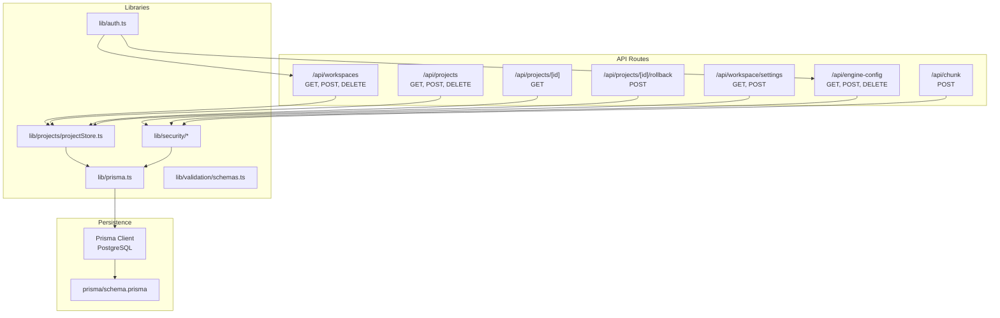
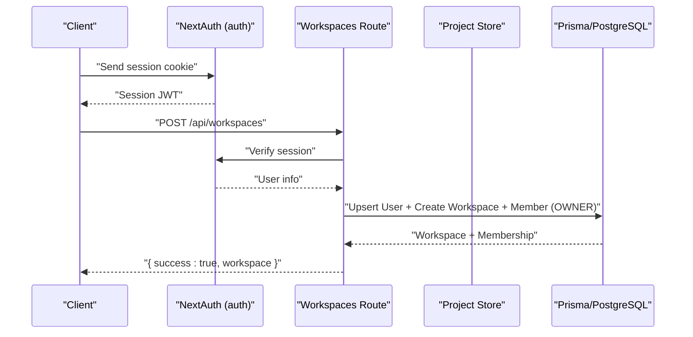
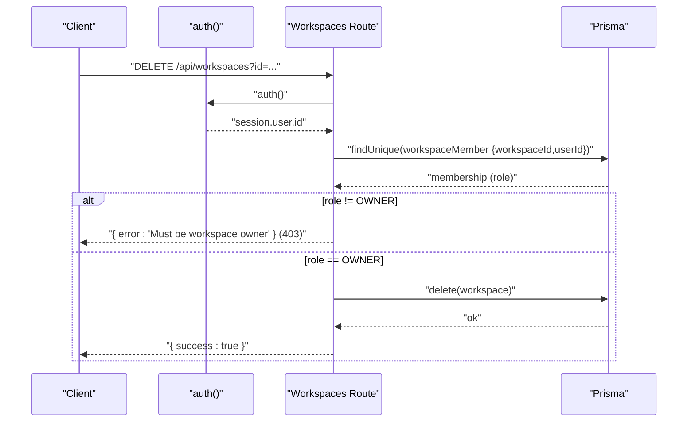
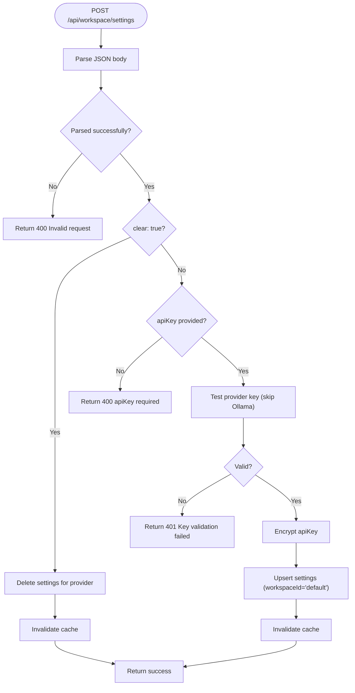
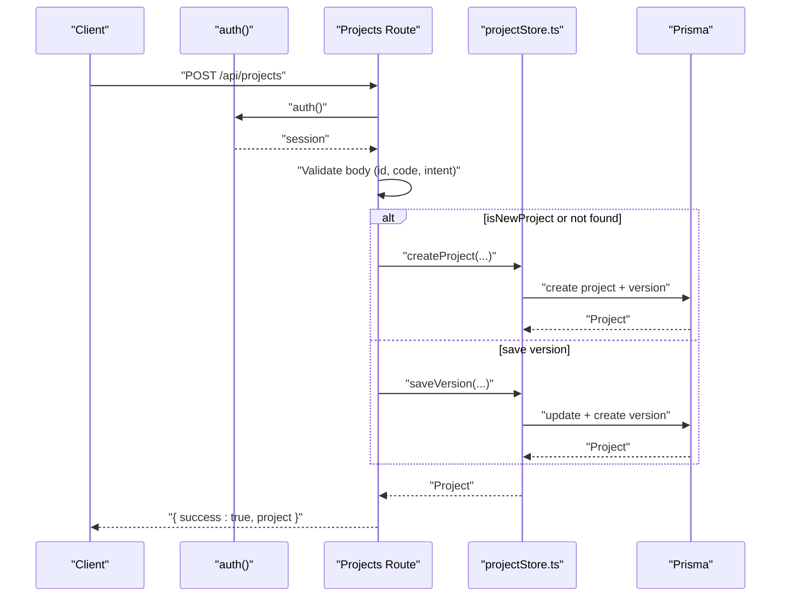
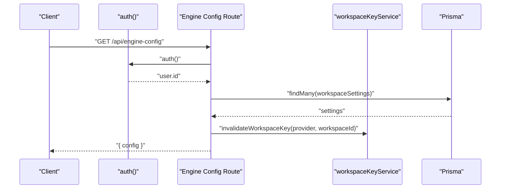
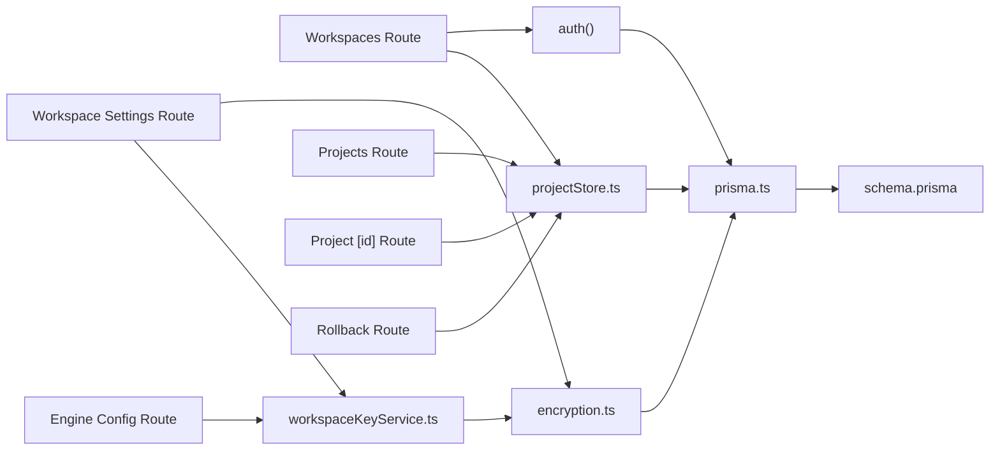
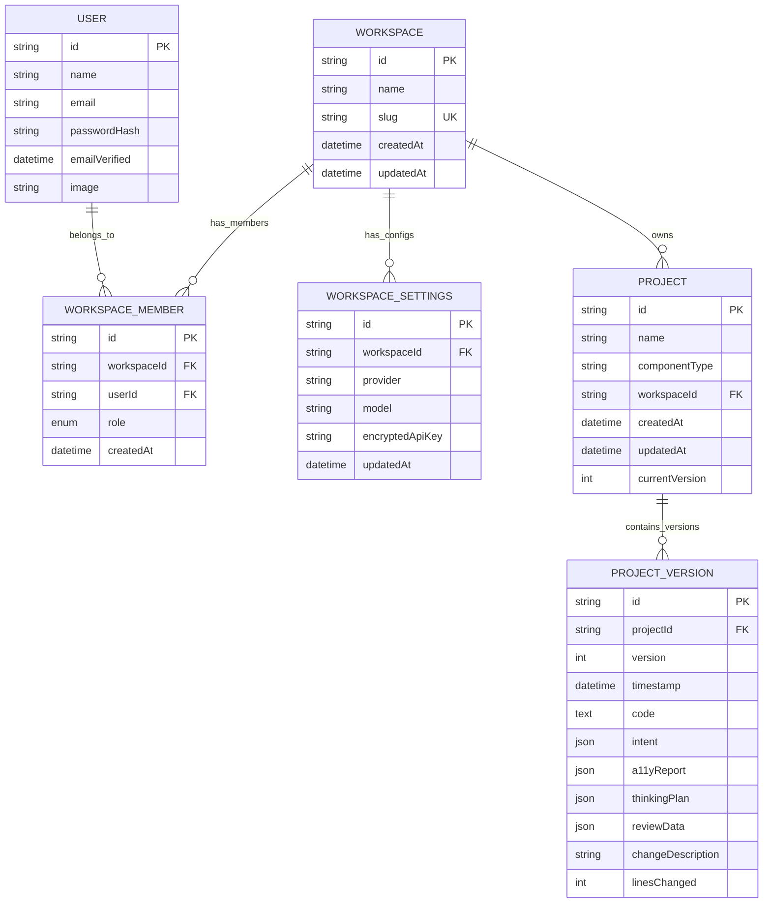

# Workspace & Project APIs

<cite>
**Referenced Files in This Document**
- [route.ts](file://app/api/workspaces/route.ts)
- [route.ts](file://app/api/workspace/settings/route.ts)
- [route.ts](file://app/api/projects/route.ts)
- [route.ts](file://app/api/projects/[id]/route.ts)
- [route.ts](file://app/api/projects/[id]/rollback/route.ts)
- [projectStore.ts](file://lib/projects/projectStore.ts)
- [auth.ts](file://lib/auth.ts)
- [workspaceKeyService.ts](file://lib/security/workspaceKeyService.ts)
- [encryption.ts](file://lib/security/encryption.ts)
- [schema.prisma](file://prisma/schema.prisma)
- [route.ts](file://app/api/engine-config/route.ts)
- [route.ts](file://app/api/chunk/route.ts)
- [prisma.ts](file://lib/prisma.ts)
- [schemas.ts](file://lib/validation/schemas.ts)
</cite>

## Table of Contents
1. [Introduction](#introduction)
2. [Project Structure](#project-structure)
3. [Core Components](#core-components)
4. [Architecture Overview](#architecture-overview)
5. [Detailed Component Analysis](#detailed-component-analysis)
6. [Dependency Analysis](#dependency-analysis)
7. [Performance Considerations](#performance-considerations)
8. [Troubleshooting Guide](#troubleshooting-guide)
9. [Conclusion](#conclusion)
10. [Appendices](#appendices)

## Introduction
This document provides comprehensive API documentation for workspace and project management endpoints. It covers workspace CRUD operations, configuration and settings, member management, and multi-tenant isolation. It also documents the project lifecycle APIs for creation, retrieval, updates, deletion, and version control, including the refinement workflow, rollback capabilities, and collaborative features. Authentication requirements, permission models, and workspace-scoped data isolation are explained, along with request/response examples, error handling patterns, and integration with the multi-tenant architecture.

## Project Structure
The workspace and project APIs are implemented as Next.js App Router API routes under app/api. The project persistence layer is backed by Prisma ORM and PostgreSQL, with explicit multi-tenancy enforced via workspace-scoped relations.

**Diagram sources**
- [route.ts:1-145](file://app/api/workspaces/route.ts#L1-L145)
- [route.ts:1-147](file://app/api/workspace/settings/route.ts#L1-L147)
- [route.ts:1-92](file://app/api/projects/route.ts#L1-L92)
- [route.ts:1-12](file://app/api/projects/[id]/route.ts#L1-L12)
- [route.ts:1-23](file://app/api/projects/[id]/rollback/route.ts#L1-L23)
- [route.ts:1-154](file://app/api/engine-config/route.ts#L1-L154)
- [route.ts:1-81](file://app/api/chunk/route.ts#L1-L81)
- [projectStore.ts:1-291](file://lib/projects/projectStore.ts#L1-L291)
- [auth.ts:1-87](file://lib/auth.ts#L1-L87)
- [workspaceKeyService.ts:1-138](file://lib/security/workspaceKeyService.ts#L1-L138)
- [encryption.ts:1-95](file://lib/security/encryption.ts#L1-L95)
- [prisma.ts:1-70](file://lib/prisma.ts#L1-L70)
- [schema.prisma:1-222](file://prisma/schema.prisma#L1-L222)

**Section sources**
- [route.ts:1-145](file://app/api/workspaces/route.ts#L1-L145)
- [route.ts:1-147](file://app/api/workspace/settings/route.ts#L1-L147)
- [route.ts:1-92](file://app/api/projects/route.ts#L1-L92)
- [route.ts:1-12](file://app/api/projects/[id]/route.ts#L1-L12)
- [route.ts:1-23](file://app/api/projects/[id]/rollback/route.ts#L1-L23)
- [route.ts:1-154](file://app/api/engine-config/route.ts#L1-L154)
- [route.ts:1-81](file://app/api/chunk/route.ts#L1-L81)
- [projectStore.ts:1-291](file://lib/projects/projectStore.ts#L1-L291)
- [auth.ts:1-87](file://lib/auth.ts#L1-L87)
- [workspaceKeyService.ts:1-138](file://lib/security/workspaceKeyService.ts#L1-L138)
- [encryption.ts:1-95](file://lib/security/encryption.ts#L1-L95)
- [prisma.ts:1-70](file://lib/prisma.ts#L1-L70)
- [schema.prisma:1-222](file://prisma/schema.prisma#L1-L222)

## Core Components
- Workspace API: Lists, creates, and deletes workspaces scoped to the authenticated user’s memberships. Ownership checks are enforced for deletions.
- Workspace Settings API: Manages provider/model configurations and encrypted API keys per workspace. Provides validation and caching.
- Project API: Creates projects, persists versions, lists summaries, retrieves individual projects, and supports rollback to prior versions.
- Engine Config API: Public endpoint to fetch active provider/model configuration for the current workspace; supports saving/updating/deactivating.
- Security and Encryption: Centralized encryption service and workspace key service with TTL cache for decrypted keys.
- Authentication: NextAuth.js with a custom credentials provider and JWT session strategy.

**Section sources**
- [route.ts:31-144](file://app/api/workspaces/route.ts#L31-L144)
- [route.ts:34-146](file://app/api/workspace/settings/route.ts#L34-L146)
- [route.ts:7-91](file://app/api/projects/route.ts#L7-L91)
- [route.ts:4-11](file://app/api/projects/[id]/route.ts#L4-L11)
- [route.ts:4-22](file://app/api/projects/[id]/rollback/route.ts#L4-L22)
- [route.ts:36-153](file://app/api/engine-config/route.ts#L36-L153)
- [workspaceKeyService.ts:32-137](file://lib/security/workspaceKeyService.ts#L32-L137)
- [encryption.ts:27-68](file://lib/security/encryption.ts#L27-L68)
- [auth.ts:11-86](file://lib/auth.ts#L11-L86)

## Architecture Overview
The system enforces multi-tenancy by scoping resources to workspaces. Users belong to workspaces via memberships with roles (OWNER, ADMIN, MEMBER). Projects are optionally linked to a workspace. API routes validate authentication and permissions, persist data via Prisma, and integrate with the encryption and caching layers for secure, efficient operations.

**Diagram sources**
- [route.ts:47-109](file://app/api/workspaces/route.ts#L47-L109)
- [auth.ts:11-86](file://lib/auth.ts#L11-L86)
- [prisma.ts:58-69](file://lib/prisma.ts#L58-L69)

**Section sources**
- [route.ts:31-109](file://app/api/workspaces/route.ts#L31-L109)
- [schema.prisma:64-95](file://prisma/schema.prisma#L64-L95)
- [prisma.ts:1-70](file://lib/prisma.ts#L1-L70)

## Detailed Component Analysis

### Workspace Management API
- Purpose: Manage workspaces for the authenticated user.
- Authentication: Requires a valid session.
- Endpoints:
  - GET /api/workspaces
    - Description: Lists workspaces the user belongs to, including role and settings count.
    - Response: Array of workspaces with id, name, slug, role, settingsCount.
    - Status codes: 200 on success; 401 unauthorized.
  - POST /api/workspaces
    - Description: Creates a new workspace and assigns the authenticated user as OWNER.
    - Request body: { name: string }.
    - Behavior: Validates name length, ensures user record exists, creates workspace and membership atomically.
    - Response: { success: true, workspace: { id, name, slug, role } }.
    - Status codes: 201 on success; 400 invalid input; 401 unauthorized; 500 internal error.
  - DELETE /api/workspaces?id={id}
    - Description: Deletes a workspace if the user is OWNER.
    - Query param: id (required).
    - Response: { success: true } on deletion.
    - Status codes: 200 on success; 400 missing id; 401 unauthorized; 403 not owner; 500 internal error.

**Diagram sources**
- [route.ts:111-144](file://app/api/workspaces/route.ts#L111-L144)

**Section sources**
- [route.ts:31-144](file://app/api/workspaces/route.ts#L31-L144)

### Workspace Settings API
- Purpose: Retrieve and manage provider/model configurations and encrypted API keys per workspace.
- Authentication: Requires a valid session.
- Endpoints:
  - GET /api/workspace/settings
    - Description: Returns provider configurations for the default workspace (provider, model, updatedAt). Never exposes raw keys.
    - Response: { settings: { [provider]: { model, hasApiKey, updatedAt } } }.
    - Status codes: 200 on success; 500 internal error.
  - POST /api/workspace/settings
    - Description: Validates and stores an API key. Supports clearing via { clear: true }.
    - Request body: { provider: string, model?: string, apiKey?: string, clear?: boolean }.
    - Behavior:
      - If clear: true, deletes the setting for the provider and invalidates cache.
      - If apiKey provided: validates with a lightweight test call (skips for Ollama), encrypts, and upserts.
      - Returns success and invalidates cache.
    - Response: { success: true, message: '...' }.
    - Status codes: 200 on success; 400 invalid request or missing key; 401 invalid key; 500 internal error.

**Diagram sources**
- [route.ts:59-146](file://app/api/workspace/settings/route.ts#L59-L146)

**Section sources**
- [route.ts:34-146](file://app/api/workspace/settings/route.ts#L34-L146)
- [workspaceKeyService.ts:32-95](file://lib/security/workspaceKeyService.ts#L32-L95)
- [encryption.ts:27-68](file://lib/security/encryption.ts#L27-L68)

### Project Lifecycle API
- Purpose: Full lifecycle management for projects and versions.
- Authentication: Requires a valid session.
- Endpoints:
  - GET /api/projects?workspaceId={id}
    - Description: Lists projects for a workspace (if provided).
    - Response: { success: true, projects: ProjectSummary[] }.
    - Status codes: 200 on success; 500 internal error.
  - POST /api/projects
    - Description: Creates a new project (isNewProject=true) or saves a new version (isNewProject=false or missing).
    - Request body: { id: string, name: string, componentType: 'component'|'app'|'depth_ui', code: string|object, intent: UIIntent, a11yReport: A11yReport, changeDescription?: string, isNewProject?: boolean, thinkingPlan?: unknown, reviewData?: unknown, workspaceId?: string }.
    - Behavior:
      - Validates required fields.
      - If isNewProject or project not found, creates project with initial version.
      - Otherwise saves a new version and computes linesChanged.
    - Response: { success: true, project: Project }.
    - Status codes: 200 on success; 400 invalid input; 500 internal error.
  - GET /api/projects/[id]
    - Description: Retrieves a project by id.
    - Response: { success: true, project: Project } or { success: false, error: 'Project not found' } (404).
    - Status codes: 200 on success; 404 not found.
  - POST /api/projects/[id]/rollback
    - Description: Rolls back to a specific version by creating a new version with the target code/intent/a11yReport.
    - Request body: { version: number }.
    - Response: { success: true, project: Project } or { success: false, error: 'Project or version not found' } (404).
    - Status codes: 200 on success; 400 invalid input; 404 not found; 500 internal error.
  - DELETE /api/projects?id={id}
    - Description: Deletes a project by id.
    - Response: { success: boolean }.
    - Status codes: 200 on success; 400 missing id; 500 internal error.

**Diagram sources**
- [route.ts:16-82](file://app/api/projects/route.ts#L16-L82)
- [projectStore.ts:105-160](file://lib/projects/projectStore.ts#L105-L160)
- [projectStore.ts:162-208](file://lib/projects/projectStore.ts#L162-L208)

**Section sources**
- [route.ts:7-91](file://app/api/projects/route.ts#L7-L91)
- [route.ts:4-11](file://app/api/projects/[id]/route.ts#L4-L11)
- [route.ts:4-22](file://app/api/projects/[id]/rollback/route.ts#L4-L22)
- [projectStore.ts:105-291](file://lib/projects/projectStore.ts#L105-L291)
- [schemas.ts:148-318](file://lib/validation/schemas.ts#L148-L318)

### Engine Configuration API
- Purpose: Public endpoint to fetch the active provider/model configuration for the current workspace; supports saving/updating/deactivating.
- Authentication: Requires a valid session.
- Endpoints:
  - GET /api/engine-config
    - Description: Returns the most recently updated provider/model for the workspace; indicates whether a key is configured.
    - Response: { success: true, config: { provider, model?, hasKey, updatedAt } }.
    - Status codes: 200 on success; 500 internal error.
  - POST /api/engine-config
    - Description: Saves provider, model, and encrypted API key. Updates existing or creates new.
    - Request body: { provider: string, model?: string, apiKey?: string, temperature?: number, fullAppMode?: boolean, multiSlideMode?: boolean }.
    - Behavior: Encrypts apiKey if provided; upserts settings; invalidates cache.
    - Response: { success: true }.
    - Status codes: 200 on success; 400 invalid provider; 500 internal error.
  - DELETE /api/engine-config
    - Description: Removes all workspace settings (deactivates engine).
    - Response: { success: true }.
    - Status codes: 200 on success; 500 internal error.

**Diagram sources**
- [route.ts:36-65](file://app/api/engine-config/route.ts#L36-L65)
- [workspaceKeyService.ts:100-106](file://lib/security/workspaceKeyService.ts#L100-L106)

**Section sources**
- [route.ts:36-153](file://app/api/engine-config/route.ts#L36-L153)
- [workspaceKeyService.ts:32-137](file://lib/security/workspaceKeyService.ts#L32-L137)

### Collaboration and Permission Model
- Roles: OWNER, ADMIN, MEMBER.
- Ownership enforcement: Deletion of a workspace requires OWNER role for the user and workspace.
- Workspace-scoped data: Projects may be associated with a workspaceId; queries filter by workspaceId where applicable.
- Multi-tenancy: Users can belong to multiple workspaces; routes resolve workspace context from session and/or headers.

**Section sources**
- [route.ts:126-133](file://app/api/workspaces/route.ts#L126-L133)
- [schema.prisma:64-95](file://prisma/schema.prisma#L64-L95)
- [route.ts:21-24](file://app/api/chunk/route.ts#L21-L24)

## Dependency Analysis
The APIs depend on shared libraries for authentication, encryption, and persistence. The projectStore encapsulates all Prisma operations for projects and handles migration-related fallbacks.

**Diagram sources**
- [route.ts:1-145](file://app/api/workspaces/route.ts#L1-L145)
- [route.ts:1-147](file://app/api/workspace/settings/route.ts#L1-L147)
- [route.ts:1-92](file://app/api/projects/route.ts#L1-L92)
- [route.ts:1-12](file://app/api/projects/[id]/route.ts#L1-L12)
- [route.ts:1-23](file://app/api/projects/[id]/rollback/route.ts#L1-L23)
- [route.ts:1-154](file://app/api/engine-config/route.ts#L1-L154)
- [projectStore.ts:1-291](file://lib/projects/projectStore.ts#L1-L291)
- [auth.ts:1-87](file://lib/auth.ts#L1-L87)
- [workspaceKeyService.ts:1-138](file://lib/security/workspaceKeyService.ts#L1-L138)
- [encryption.ts:1-95](file://lib/security/encryption.ts#L1-L95)
- [prisma.ts:1-70](file://lib/prisma.ts#L1-L70)
- [schema.prisma:1-222](file://prisma/schema.prisma#L1-L222)

**Section sources**
- [projectStore.ts:1-291](file://lib/projects/projectStore.ts#L1-L291)
- [prisma.ts:1-70](file://lib/prisma.ts#L1-L70)
- [schema.prisma:158-187](file://prisma/schema.prisma#L158-L187)

## Performance Considerations
- Connection pooling and reconnection: Prisma singleton with automatic reconnection for transient Neon errors reduces downtime and connection exhaustion.
- Caching: Workspace key service caches decrypted keys with TTL to minimize DB lookups and decryption overhead.
- Batch operations: Settings updates use upsert/deleteMany to reduce round-trips.
- Pagination and ordering: Project listing orders by updatedAt desc and limits version scans to improve response times.

**Section sources**
- [prisma.ts:20-70](file://lib/prisma.ts#L20-L70)
- [workspaceKeyService.ts:12-24](file://lib/security/workspaceKeyService.ts#L12-L24)
- [route.ts:74-81](file://app/api/workspace/settings/route.ts#L74-L81)
- [projectStore.ts:222-245](file://lib/projects/projectStore.ts#L222-L245)

## Troubleshooting Guide
- Authentication failures:
  - Symptom: 401 Unauthorized on protected endpoints.
  - Cause: Missing or invalid session cookie/token.
  - Resolution: Ensure the client sends the session cookie; verify NextAuth configuration and secret.
- Workspace deletion denied:
  - Symptom: 403 Must be workspace owner to delete.
  - Cause: Caller is not OWNER of the workspace.
  - Resolution: Verify membership role; only OWNER can delete.
- Project not found:
  - Symptom: 404 Project not found on GET or rollback.
  - Cause: Project id does not exist or mismatched workspace context.
  - Resolution: Confirm project id and workspaceId; ensure the project belongs to the caller’s workspace.
- Invalid JSON or missing fields:
  - Symptom: 400 Bad Request on POST /api/projects or /api/projects/[id]/rollback.
  - Cause: Malformed JSON or missing required fields.
  - Resolution: Validate request payload; ensure id, code, intent, and version are provided as required.
- API key validation failure:
  - Symptom: 401 Key validation failed on POST /api/workspace/settings.
  - Cause: Invalid or unreachable provider key.
  - Resolution: Re-enter a valid key; verify provider availability and model support.
- Engine not configured:
  - Symptom: 403 AI provider not configured on /api/chunk.
  - Cause: No workspace settings found for the requested provider.
  - Resolution: Configure provider/model and API key via workspace settings.

**Section sources**
- [route.ts:34-36](file://app/api/workspaces/route.ts#L34-L36)
- [route.ts:131-133](file://app/api/workspaces/route.ts#L131-L133)
- [route.ts:7-10](file://app/api/projects/[id]/route.ts#L7-L10)
- [route.ts:12-14](file://app/api/projects/[id]/rollback/route.ts#L12-L14)
- [route.ts:108-118](file://app/api/workspace/settings/route.ts#L108-L118)
- [route.ts:71-76](file://app/api/chunk/route.ts#L71-L76)

## Conclusion
The workspace and project APIs provide a robust, multi-tenant foundation for managing teams, configurations, and UI projects with strong security and performance characteristics. Workspaces isolate data, enforce role-based permissions, and integrate seamlessly with encrypted settings and versioned project storage. The APIs support iterative refinement, rollback, and collaboration while maintaining strict separation of concerns and predictable error handling.

## Appendices

### Data Models Overview

**Diagram sources**
- [schema.prisma:40-95](file://prisma/schema.prisma#L40-L95)
- [schema.prisma:99-187](file://prisma/schema.prisma#L99-L187)

### Request/Response Examples

- GET /api/workspaces
  - Request: Authorization: Bearer <JWT>
  - Response: 200 { success: true, workspaces: [{ id, name, slug, role, settingsCount }] }

- POST /api/workspaces
  - Request: Authorization: Bearer <JWT>; Body: { name: "My Workspace" }
  - Response: 201 { success: true, workspace: { id, name, slug, role: "OWNER" } }

- DELETE /api/workspaces?id=...
  - Request: Authorization: Bearer <JWT>; Query: id=...
  - Response: 200 { success: true }

- GET /api/workspace/settings
  - Request: Authorization: Bearer <JWT>
  - Response: 200 { settings: { openai: { model, hasApiKey, updatedAt }, ... } }

- POST /api/workspace/settings
  - Request: Authorization: Bearer <JWT>; Body: { provider: "openai", apiKey: "..." }
  - Response: 200 { success: true, message: "API key saved and validated." }

- GET /api/projects?workspaceId=...
  - Request: Authorization: Bearer <JWT>; Query: workspaceId=...
  - Response: 200 { success: true, projects: [...] }

- POST /api/projects
  - Request: Authorization: Bearer <JWT>; Body: { id, name, componentType, code, intent, a11yReport, isNewProject, workspaceId }
  - Response: 200 { success: true, project: Project }

- GET /api/projects/[id]
  - Request: Authorization: Bearer <JWT>
  - Response: 200 { success: true, project: Project } or 404 { success: false, error: "Project not found" }

- POST /api/projects/[id]/rollback
  - Request: Authorization: Bearer <JWT>; Body: { version: 2 }
  - Response: 200 { success: true, project: Project } or 404 { success: false, error: "Project or version not found" }

- DELETE /api/projects?id=...
  - Request: Authorization: Bearer <JWT>; Query: id=...
  - Response: 200 { success: boolean }

- GET /api/engine-config
  - Request: Authorization: Bearer <JWT>
  - Response: 200 { success: true, config: { provider, model?, hasKey, updatedAt } }

- POST /api/engine-config
  - Request: Authorization: Bearer <JWT>; Body: { provider, model?, apiKey? }
  - Response: 200 { success: true }

- DELETE /api/engine-config
  - Request: Authorization: Bearer <JWT>
  - Response: 200 { success: true }

**Section sources**
- [route.ts:31-144](file://app/api/workspaces/route.ts#L31-L144)
- [route.ts:34-146](file://app/api/workspace/settings/route.ts#L34-L146)
- [route.ts:7-91](file://app/api/projects/route.ts#L7-L91)
- [route.ts:4-11](file://app/api/projects/[id]/route.ts#L4-L11)
- [route.ts:4-22](file://app/api/projects/[id]/rollback/route.ts#L4-L22)
- [route.ts:36-153](file://app/api/engine-config/route.ts#L36-L153)