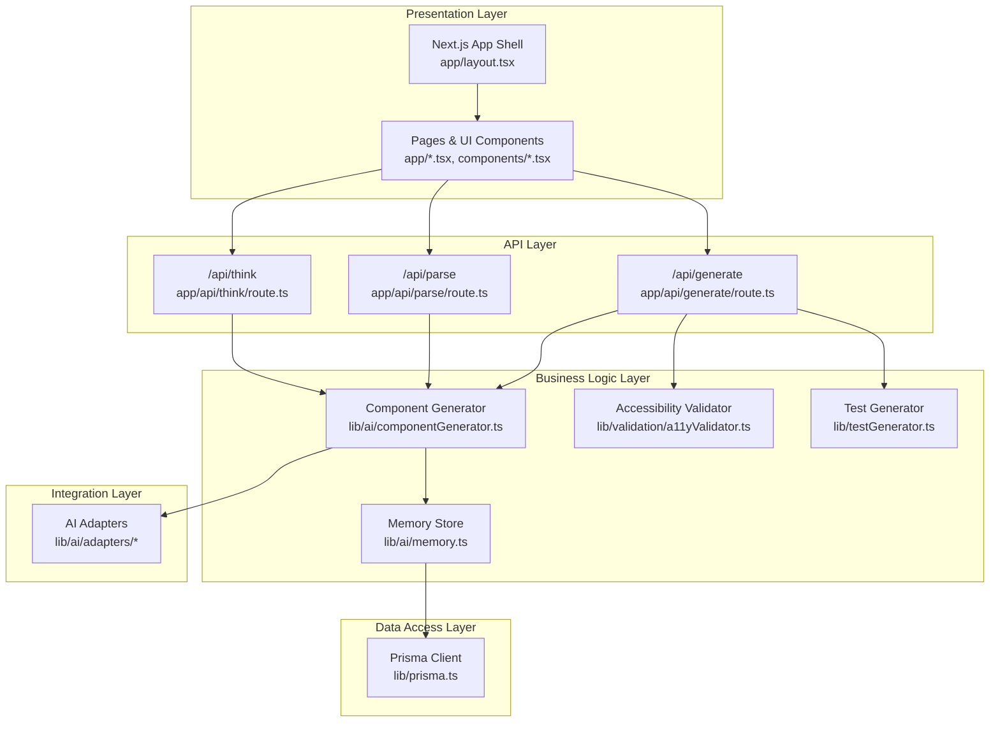
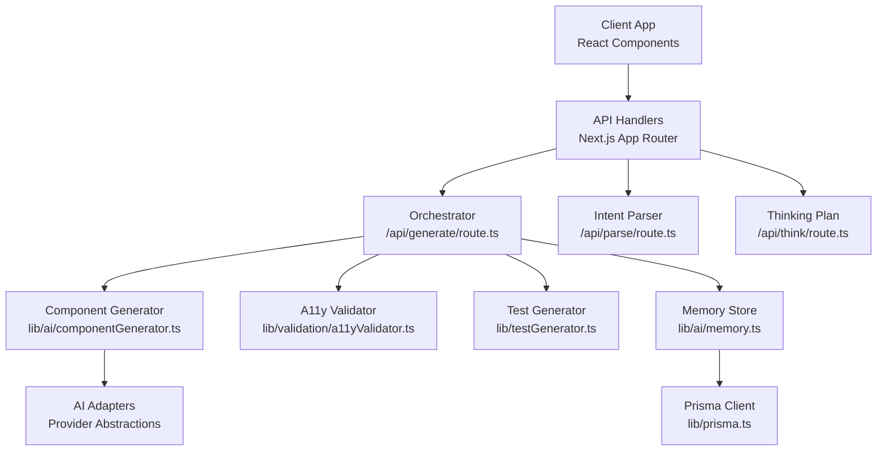
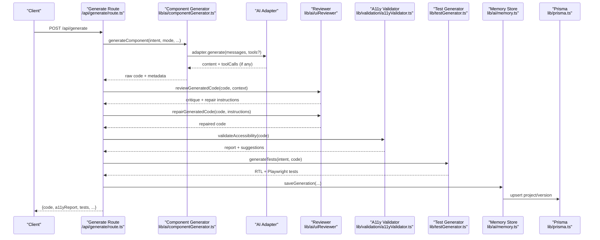
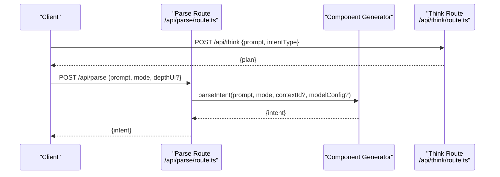
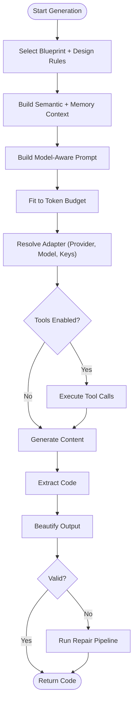
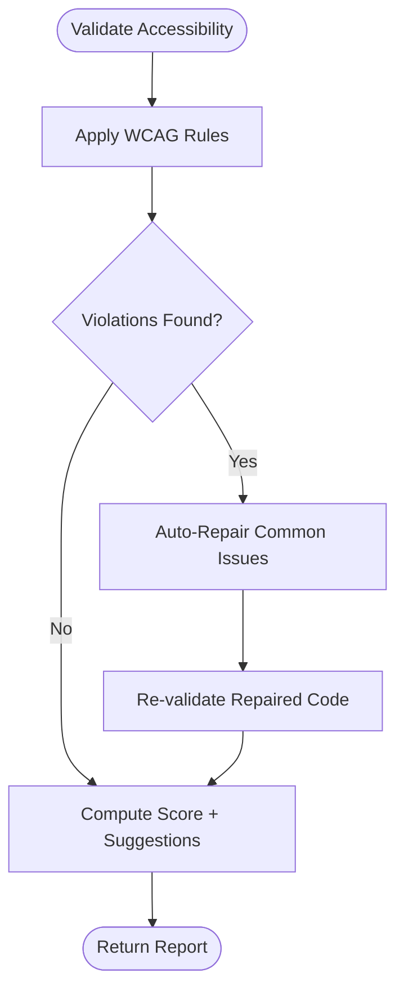
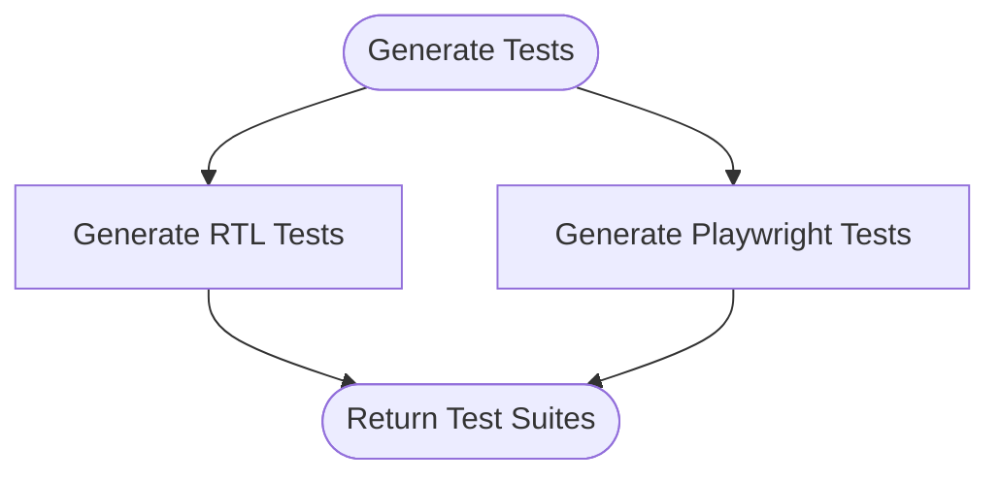
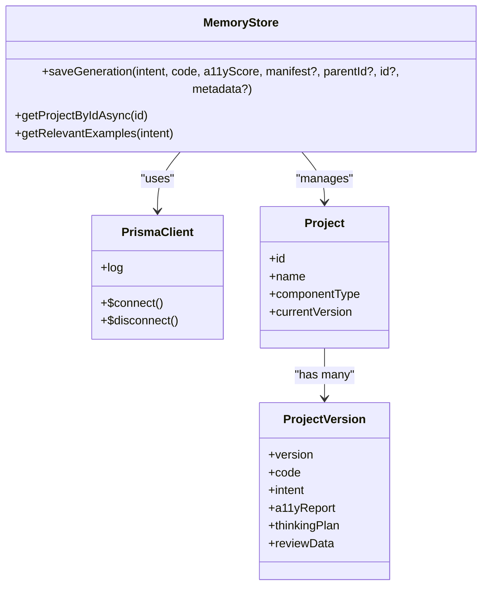
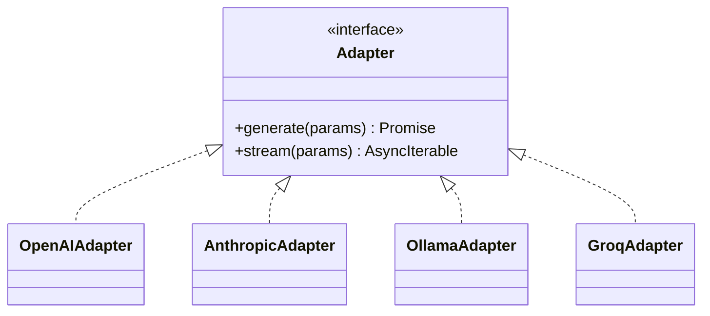
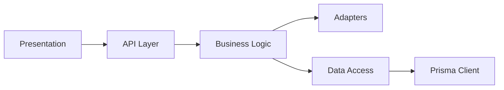

# Architecture & Design

<cite>
**Referenced Files in This Document**
- [README.md](file://README.md)
- [package.json](file://package.json)
- [next.config.ts](file://next.config.ts)
- [app/layout.tsx](file://app/layout.tsx)
- [lib/prisma.ts](file://lib/prisma.ts)
- [app/api/generate/route.ts](file://app/api/generate/route.ts)
- [app/api/parse/route.ts](file://app/api/parse/route.ts)
- [app/api/think/route.ts](file://app/api/think/route.ts)
- [lib/ai/componentGenerator.ts](file://lib/ai/componentGenerator.ts)
- [lib/validation/a11yValidator.ts](file://lib/validation/a11yValidator.ts)
- [lib/testGenerator.ts](file://lib/testGenerator.ts)
- [lib/ai/memory.ts](file://lib/ai/memory.ts)
</cite>

## Table of Contents
1. [Introduction](#introduction)
2. [Project Structure](#project-structure)
3. [Core Components](#core-components)
4. [Architecture Overview](#architecture-overview)
5. [Detailed Component Analysis](#detailed-component-analysis)
6. [Dependency Analysis](#dependency-analysis)
7. [Performance Considerations](#performance-considerations)
8. [Troubleshooting Guide](#troubleshooting-guide)
9. [Conclusion](#conclusion)
10. [Appendices](#appendices)

## Introduction
This document describes the architecture and design of an AI-powered, accessibility-first UI engine. The system converts natural language intents into accessible, production-ready React components with live preview, automated accessibility validation (WCAG 2.1 AA), and automated test generation. It emphasizes a layered architecture with clear separation of concerns: presentation, API, business logic, data access, and integration with AI providers. Architectural patterns include Adapter Pattern for AI providers, Pipeline Pattern for multi-stage generation, Factory Pattern for dynamic adapter instantiation, and Observer Pattern for real-time feedback.

## Project Structure
The project is a Next.js application organized by layers and features:
- Presentation Layer: Next.js app directory with pages, components, and providers.
- API Layer: Next.js App Router API handlers under app/api/.
- Business Logic Layer: Orchestrators and validators in lib/ai, lib/validation, and lib/intelligence.
- Data Access Layer: Prisma ORM client and persistence utilities.
- Integration Layer: AI adapters and provider integrations.

**Diagram sources**
- [app/layout.tsx:1-57](file://app/layout.tsx#L1-L57)
- [app/api/generate/route.ts:1-451](file://app/api/generate/route.ts#L1-L451)
- [app/api/parse/route.ts:1-124](file://app/api/parse/route.ts#L1-L124)
- [app/api/think/route.ts:1-59](file://app/api/think/route.ts#L1-L59)
- [lib/ai/componentGenerator.ts:1-408](file://lib/ai/componentGenerator.ts#L1-L408)
- [lib/validation/a11yValidator.ts:1-376](file://lib/validation/a11yValidator.ts#L1-L376)
- [lib/testGenerator.ts:1-265](file://lib/testGenerator.ts#L1-L265)
- [lib/ai/memory.ts:1-211](file://lib/ai/memory.ts#L1-L211)
- [lib/prisma.ts:1-70](file://lib/prisma.ts#L1-L70)

**Section sources**
- [README.md:1-37](file://README.md#L1-L37)
- [next.config.ts:1-38](file://next.config.ts#L1-L38)
- [app/layout.tsx:1-57](file://app/layout.tsx#L1-L57)

## Core Components
- Presentation Layer
  - Root layout initializes theme, fonts, and providers for sessions and workspaces.
  - UI components render the IDE workspace, panels, and preview.
- API Layer
  - Generation endpoint orchestrates the full pipeline: intent parsing, generation, review, validation, and test generation.
  - Parse endpoint extracts structured intent from natural language.
  - Think endpoint builds reasoning plans aligned with generation.
- Business Logic Layer
  - Component generator encapsulates model-agnostic generation with pipeline stages, tool loops, and extraction.
  - Accessibility validator enforces WCAG 2.1 AA rules and auto-repairs common issues.
  - Test generator produces RTL and Playwright tests based on intent.
  - Memory store persists generation history to the database.
- Data Access Layer
  - Prisma client with singleton and transient error handling for serverless environments.
- Integration Layer
  - AI adapters abstract provider differences and enable dynamic selection.

**Section sources**
- [app/layout.tsx:1-57](file://app/layout.tsx#L1-L57)
- [app/api/generate/route.ts:1-451](file://app/api/generate/route.ts#L1-L451)
- [app/api/parse/route.ts:1-124](file://app/api/parse/route.ts#L1-L124)
- [app/api/think/route.ts:1-59](file://app/api/think/route.ts#L1-L59)
- [lib/ai/componentGenerator.ts:1-408](file://lib/ai/componentGenerator.ts#L1-L408)
- [lib/validation/a11yValidator.ts:1-376](file://lib/validation/a11yValidator.ts#L1-L376)
- [lib/testGenerator.ts:1-265](file://lib/testGenerator.ts#L1-L265)
- [lib/ai/memory.ts:1-211](file://lib/ai/memory.ts#L1-L211)
- [lib/prisma.ts:1-70](file://lib/prisma.ts#L1-L70)

## Architecture Overview
The system follows a layered architecture with explicit boundaries:
- Presentation Layer: Next.js pages and components.
- API Layer: Request handlers implementing REST-like endpoints.
- Business Logic Layer: Orchestration, validation, and generation.
- Data Access Layer: Prisma for persistence.
- Integration Layer: AI adapters abstract provider APIs.

**Diagram sources**
- [app/api/generate/route.ts:1-451](file://app/api/generate/route.ts#L1-L451)
- [lib/ai/componentGenerator.ts:1-408](file://lib/ai/componentGenerator.ts#L1-L408)
- [lib/validation/a11yValidator.ts:1-376](file://lib/validation/a11yValidator.ts#L1-L376)
- [lib/testGenerator.ts:1-265](file://lib/testGenerator.ts#L1-L265)
- [lib/ai/memory.ts:1-211](file://lib/ai/memory.ts#L1-L211)
- [lib/prisma.ts:1-70](file://lib/prisma.ts#L1-L70)
- [app/api/parse/route.ts:1-124](file://app/api/parse/route.ts#L1-L124)
- [app/api/think/route.ts:1-59](file://app/api/think/route.ts#L1-L59)

## Detailed Component Analysis

### API Layer: Generation Pipeline
The generation endpoint coordinates a multi-stage pipeline:
- Input validation and authentication
- Intent parsing and thinking plan alignment
- Provider-agnostic generation with tool loops
- Review and repair (optional for local models)
- Accessibility validation and auto-repair
- Test generation
- Persistence and dependency resolution

**Diagram sources**
- [app/api/generate/route.ts:1-451](file://app/api/generate/route.ts#L1-L451)
- [lib/ai/componentGenerator.ts:1-408](file://lib/ai/componentGenerator.ts#L1-L408)
- [lib/validation/a11yValidator.ts:1-376](file://lib/validation/a11yValidator.ts#L1-L376)
- [lib/testGenerator.ts:1-265](file://lib/testGenerator.ts#L1-L265)
- [lib/ai/memory.ts:1-211](file://lib/ai/memory.ts#L1-L211)
- [lib/prisma.ts:1-70](file://lib/prisma.ts#L1-L70)

**Section sources**
- [app/api/generate/route.ts:1-451](file://app/api/generate/route.ts#L1-L451)

### API Layer: Intent Parsing and Thinking Plans
Intent parsing transforms natural language into structured intent with validation and optional depth UI mode. Thinking plan endpoint aligns generation with a curated plan.

**Diagram sources**
- [app/api/parse/route.ts:1-124](file://app/api/parse/route.ts#L1-L124)
- [app/api/think/route.ts:1-59](file://app/api/think/route.ts#L1-L59)
- [lib/ai/componentGenerator.ts:1-408](file://lib/ai/componentGenerator.ts#L1-L408)

**Section sources**
- [app/api/parse/route.ts:1-124](file://app/api/parse/route.ts#L1-L124)
- [app/api/think/route.ts:1-59](file://app/api/think/route.ts#L1-L59)

### Business Logic Layer: Component Generation
The generator is model-agnostic and pipeline-driven:
- Blueprint and design rules selection
- Semantic and memory context injection
- Prompt building and token budget enforcement
- Tool loop orchestration for advanced models
- Code extraction and beautification
- Deterministic validation and repair pipeline

**Diagram sources**
- [lib/ai/componentGenerator.ts:1-408](file://lib/ai/componentGenerator.ts#L1-L408)

**Section sources**
- [lib/ai/componentGenerator.ts:1-408](file://lib/ai/componentGenerator.ts#L1-L408)

### Business Logic Layer: Accessibility Validation and Auto-Repair
The validator statically analyzes generated code against WCAG 2.1 AA criteria and auto-applies safe fixes.

**Diagram sources**
- [lib/validation/a11yValidator.ts:1-376](file://lib/validation/a11yValidator.ts#L1-L376)

**Section sources**
- [lib/validation/a11yValidator.ts:1-376](file://lib/validation/a11yValidator.ts#L1-L376)

### Business Logic Layer: Test Generation
Automatically generates unit/integration tests using React Testing Library and Playwright based on intent fields and interactions.

**Diagram sources**
- [lib/testGenerator.ts:1-265](file://lib/testGenerator.ts#L1-L265)

**Section sources**
- [lib/testGenerator.ts:1-265](file://lib/testGenerator.ts#L1-L265)

### Data Access Layer: Prisma ORM and Memory Store
Prisma client is configured as a singleton with transient error handling for serverless environments. The memory store persists generation history to the database.

**Diagram sources**
- [lib/prisma.ts:1-70](file://lib/prisma.ts#L1-L70)
- [lib/ai/memory.ts:1-211](file://lib/ai/memory.ts#L1-L211)

**Section sources**
- [lib/prisma.ts:1-70](file://lib/prisma.ts#L1-L70)
- [lib/ai/memory.ts:1-211](file://lib/ai/memory.ts#L1-L211)

### Integration Layer: AI Providers and Adapters
The system employs an Adapter Pattern to abstract provider differences and a Factory Pattern to dynamically instantiate adapters based on workspace and user preferences. The generation orchestrator selects the appropriate adapter and executes generation with optional tool calls.

**Diagram sources**
- [lib/ai/componentGenerator.ts:16-20](file://lib/ai/componentGenerator.ts#L16-L20)

**Section sources**
- [lib/ai/componentGenerator.ts:16-20](file://lib/ai/componentGenerator.ts#L16-L20)

## Dependency Analysis
The system exhibits layered cohesion and controlled coupling:
- Presentation depends on API handlers.
- API handlers depend on business logic.
- Business logic depends on adapters and persistence.
- Persistence depends on Prisma client.
- Adapters depend on external provider SDKs.

**Diagram sources**
- [app/layout.tsx:1-57](file://app/layout.tsx#L1-L57)
- [app/api/generate/route.ts:1-451](file://app/api/generate/route.ts#L1-L451)
- [lib/ai/componentGenerator.ts:1-408](file://lib/ai/componentGenerator.ts#L1-L408)
- [lib/prisma.ts:1-70](file://lib/prisma.ts#L1-L70)

**Section sources**
- [package.json:13-44](file://package.json#L13-L44)

## Performance Considerations
- Streaming generation reduces latency for long-form outputs.
- Parallel execution of accessibility validation and test generation improves throughput.
- Token budget enforcement prevents prompt overflow and reduces cost.
- Singleton Prisma client minimizes connection churn in serverless environments.
- Transient error handling retries on connection drops for resilient DB access.

[No sources needed since this section provides general guidance]

## Troubleshooting Guide
Common issues and mitigations:
- Database connection drops: Automatic reconnect with transient error detection.
- Provider timeouts: Local model detection avoids expensive review calls; timeouts are handled gracefully.
- Invalid JSON or missing fields: Early validation returns structured errors.
- Browser safety violations: Strict validation blocks unsafe code patterns.
- Memory writes: Fire-and-forget persistence continues even if DB writes fail.

**Section sources**
- [lib/prisma.ts:36-70](file://lib/prisma.ts#L36-L70)
- [app/api/generate/route.ts:24-451](file://app/api/generate/route.ts#L24-L451)
- [lib/validation/a11yValidator.ts:1-376](file://lib/validation/a11yValidator.ts#L1-L376)
- [lib/ai/memory.ts:68-124](file://lib/ai/memory.ts#L68-L124)

## Conclusion
The system’s layered architecture, combined with well-defined patterns (Adapter, Pipeline, Factory, Observer), enables a scalable, maintainable, and accessibility-first UI generation pipeline. Clear boundaries and robust error handling support reliable operation in serverless environments, while Prisma and provider abstraction facilitate extensibility and multi-tenancy.

[No sources needed since this section summarizes without analyzing specific files]

## Appendices

### Technology Stack and Third-Party Dependencies
- Frontend: Next.js, React, Tailwind CSS, Radix UI, CodeMirror
- Backend: Next.js App Router API handlers
- AI/LLM: openai, @huggingface/inference, ai library
- Database: @neondatabase/serverless, @prisma/client
- Caching: @upstash/redis
- Authentication: next-auth with @auth/prisma-adapter
- Testing: @testing-library/react, jest, playwright
- Utilities: zod, lucide-react, lru-cache

**Section sources**
- [package.json:13-44](file://package.json#L13-L44)

### Infrastructure Requirements and Deployment Topology
- Runtime: Next.js on Vercel with standalone output for faster cold starts.
- Security: Strict security headers configured globally.
- Database: Neon serverless with Prisma; singleton client and transient error handling.
- Scalability: Serverless functions with process reuse; connection limits tuned for Neon.

**Section sources**
- [next.config.ts:1-38](file://next.config.ts#L1-L38)
- [lib/prisma.ts:1-70](file://lib/prisma.ts#L1-L70)

### Cross-Cutting Concerns
- Security: Input validation, browser safety checks, strict CSP headers, authentication middleware.
- Monitoring: Structured request logs with correlation IDs and error telemetry.
- Multi-tenancy: Workspace-scoped adapter resolution and memory persistence keyed by workspace.

**Section sources**
- [app/api/generate/route.ts:56-100](file://app/api/generate/route.ts#L56-L100)
- [lib/ai/memory.ts:55-124](file://lib/ai/memory.ts#L55-L124)
- [next.config.ts:20-34](file://next.config.ts#L20-L34)