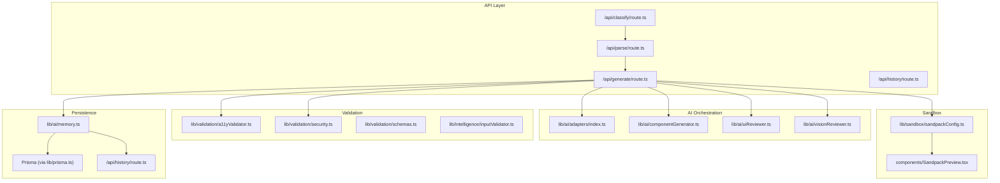
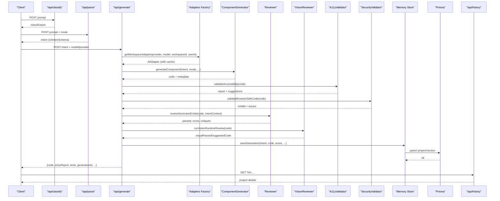
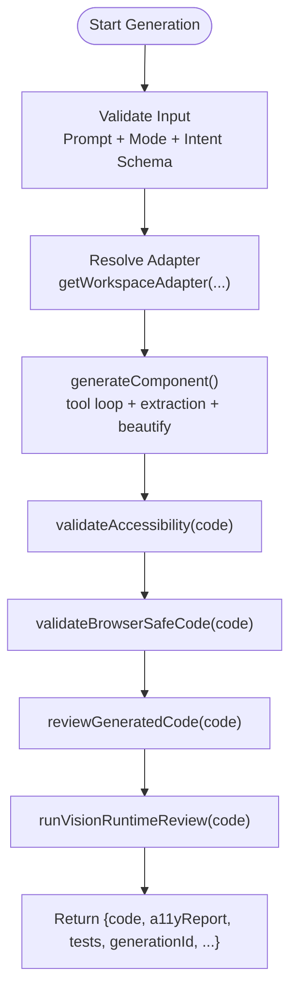
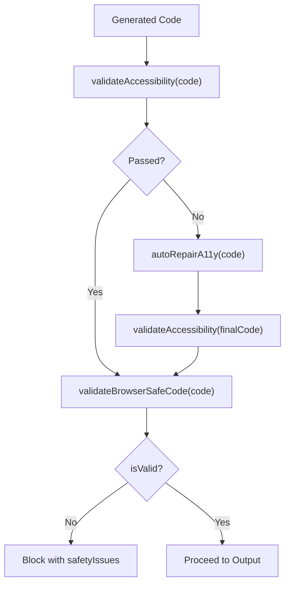
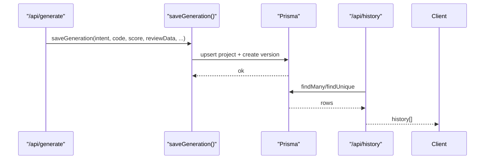
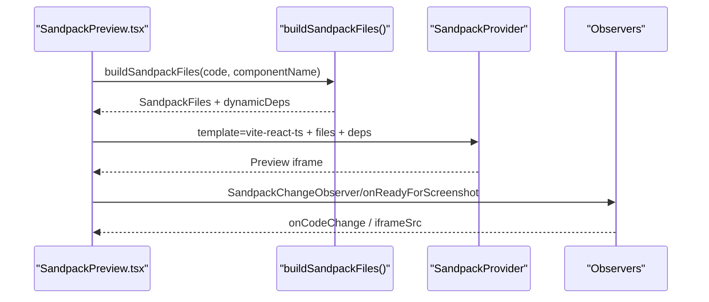
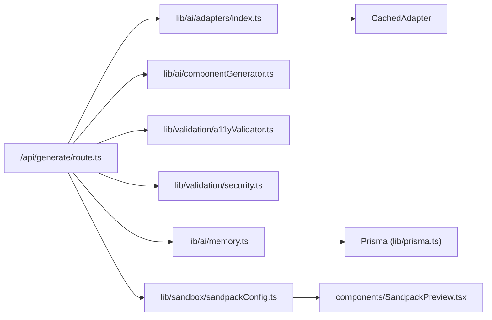

# Data Flow & Processing

<cite>
**Referenced Files in This Document**
- [app/api/generate/route.ts](file://app/api/generate/route.ts)
- [app/api/classify/route.ts](file://app/api/classify/route.ts)
- [app/api/parse/route.ts](file://app/api/parse/route.ts)
- [app/api/history/route.ts](file://app/api/history/route.ts)
- [lib/ai/componentGenerator.ts](file://lib/ai/componentGenerator.ts)
- [lib/ai/adapters/index.ts](file://lib/ai/adapters/index.ts)
- [lib/ai/uiReviewer.ts](file://lib/ai/uiReviewer.ts)
- [lib/ai/visionReviewer.ts](file://lib/ai/visionReviewer.ts)
- [lib/validation/a11yValidator.ts](file://lib/validation/a11yValidator.ts)
- [lib/validation/security.ts](file://lib/validation/security.ts)
- [lib/validation/schemas.ts](file://lib/validation/schemas.ts)
- [lib/ai/memory.ts](file://lib/ai/memory.ts)
- [lib/sandbox/sandpackConfig.ts](file://lib/sandbox/sandpackConfig.ts)
- [components/SandpackPreview.tsx](file://components/SandpackPreview.tsx)
- [lib/intelligence/inputValidator.ts](file://lib/intelligence/inputValidator.ts)
</cite>

## Table of Contents
1. [Introduction](#introduction)
2. [Project Structure](#project-structure)
3. [Core Components](#core-components)
4. [Architecture Overview](#architecture-overview)
5. [Detailed Component Analysis](#detailed-component-analysis)
6. [Dependency Analysis](#dependency-analysis)
7. [Performance Considerations](#performance-considerations)
8. [Troubleshooting Guide](#troubleshooting-guide)
9. [Conclusion](#conclusion)

## Introduction
This document explains the data flow and processing architecture of the AI-powered UI engine, focusing on four primary pathways:
- Generation flow: User Intent → Intent Classifier → AI Adapter → Code Generator → Validation → Output
- Validation flow: Generated Code → Accessibility Checker → Security Validator → Auto-Repair → Final Output
- Persistence flow: Generation Results → Memory Store → Database → History API
- Preview flow: Generated Code → Sandpack Config → Live Preview → User Feedback

It documents data transformations, validation points, caching mechanisms, and error handling across each stage, with precise source references to the codebase.

## Project Structure
The engine is organized around API routes, AI orchestration libraries, validation utilities, sandbox preview, and persistence. The key modules are:
- API routes: Intent classification, intent parsing, generation, history retrieval
- AI orchestration: Adapter factory, component generation, reviewer, vision reviewer
- Validation: Accessibility rules, security checks, schemas, input validators
- Sandbox: Sandpack file builder and dependency resolver
- Persistence: In-memory history shim backed by Prisma

**Diagram sources**
- [app/api/classify/route.ts:1-76](file://app/api/classify/route.ts#L1-L76)
- [app/api/parse/route.ts:1-130](file://app/api/parse/route.ts#L1-L130)
- [app/api/generate/route.ts:1-440](file://app/api/generate/route.ts#L1-L440)
- [lib/ai/adapters/index.ts:1-306](file://lib/ai/adapters/index.ts#L1-L306)
- [lib/ai/componentGenerator.ts:1-402](file://lib/ai/componentGenerator.ts#L1-L402)
- [lib/ai/uiReviewer.ts:1-199](file://lib/ai/uiReviewer.ts#L1-L199)
- [lib/ai/visionReviewer.ts:1-181](file://lib/ai/visionReviewer.ts#L1-L181)
- [lib/validation/a11yValidator.ts:1-376](file://lib/validation/a11yValidator.ts#L1-L376)
- [lib/validation/security.ts:1-129](file://lib/validation/security.ts#L1-L129)
- [lib/validation/schemas.ts:1-340](file://lib/validation/schemas.ts#L1-L340)
- [lib/ai/memory.ts:1-211](file://lib/ai/memory.ts#L1-L211)
- [lib/sandbox/sandpackConfig.ts:1-485](file://lib/sandbox/sandpackConfig.ts#L1-L485)
- [components/SandpackPreview.tsx:1-287](file://components/SandpackPreview.tsx#L1-L287)
- [app/api/history/route.ts:1-60](file://app/api/history/route.ts#L1-L60)

**Section sources**
- [app/api/generate/route.ts:25-439](file://app/api/generate/route.ts#L25-L439)
- [lib/ai/componentGenerator.ts:60-401](file://lib/ai/componentGenerator.ts#L60-L401)

## Core Components
- Intent Classifier: Parses user prompt into a structured intent classification for downstream routing.
- Intent Parser: Converts natural language into a formal UI Intent schema with component metadata.
- AI Adapter Factory: Securely resolves provider credentials and wraps adapters with caching.
- Component Generator: Orchestrates model selection, tool loops, extraction, beautification, and deterministic repair.
- Reviewer and Vision Reviewer: Second-pass quality checks and visual critique via headless browser.
- Accessibility Validator: Static analysis against WCAG rules with auto-repair suggestions.
- Security Validator: Ensures generated code is browser-safe and sanitizes problematic artifacts.
- Sandpack Config and Preview: Builds virtual file tree, resolves dependencies, and renders live previews.
- Memory Store and History API: Persists generation results and exposes lightweight summaries.

**Section sources**
- [app/api/classify/route.ts:8-75](file://app/api/classify/route.ts#L8-L75)
- [app/api/parse/route.ts:11-129](file://app/api/parse/route.ts#L11-L129)
- [lib/ai/adapters/index.ts:236-278](file://lib/ai/adapters/index.ts#L236-L278)
- [lib/ai/componentGenerator.ts:60-401](file://lib/ai/componentGenerator.ts#L60-L401)
- [lib/ai/uiReviewer.ts:58-126](file://lib/ai/uiReviewer.ts#L58-L126)
- [lib/ai/visionReviewer.ts:30-137](file://lib/ai/visionReviewer.ts#L30-L137)
- [lib/validation/a11yValidator.ts:264-297](file://lib/validation/a11yValidator.ts#L264-L297)
- [lib/validation/security.ts:6-34](file://lib/validation/security.ts#L6-L34)
- [lib/sandbox/sandpackConfig.ts:112-401](file://lib/sandbox/sandpackConfig.ts#L112-L401)
- [lib/ai/memory.ts:55-124](file://lib/ai/memory.ts#L55-L124)
- [app/api/history/route.ts:5-59](file://app/api/history/route.ts#L5-L59)

## Architecture Overview
The system is a serverless-first pipeline with secure credential resolution, deterministic validation, and optional expert review. It integrates a sandbox preview and persistent history.

**Diagram sources**
- [app/api/classify/route.ts:8-75](file://app/api/classify/route.ts#L8-L75)
- [app/api/parse/route.ts:11-129](file://app/api/parse/route.ts#L11-L129)
- [app/api/generate/route.ts:25-439](file://app/api/generate/route.ts#L25-L439)
- [lib/ai/adapters/index.ts:236-278](file://lib/ai/adapters/index.ts#L236-L278)
- [lib/ai/componentGenerator.ts:60-401](file://lib/ai/componentGenerator.ts#L60-L401)
- [lib/ai/uiReviewer.ts:58-126](file://lib/ai/uiReviewer.ts#L58-L126)
- [lib/ai/visionReviewer.ts:30-137](file://lib/ai/visionReviewer.ts#L30-L137)
- [lib/validation/a11yValidator.ts:264-297](file://lib/validation/a11yValidator.ts#L264-L297)
- [lib/validation/security.ts:6-34](file://lib/validation/security.ts#L6-L34)
- [lib/ai/memory.ts:55-124](file://lib/ai/memory.ts#L55-L124)
- [app/api/history/route.ts:5-59](file://app/api/history/route.ts#L5-L59)

## Detailed Component Analysis

### Generation Flow
End-to-end generation from intent to validated output:
- Input validation: Prompt and mode validated; intent shape enforced by Zod schema.
- Adapter resolution: Securely resolves provider credentials and wraps with cache.
- Generation: Orchestrated by component generator with tool loops, extraction, beautification, and deterministic repair.
- Validation: Accessibility and security checks; auto-repair for common issues.
- Output: Returns code, a11y report, tests, and generation metadata.

**Diagram sources**
- [app/api/generate/route.ts:99-208](file://app/api/generate/route.ts#L99-L208)
- [lib/ai/adapters/index.ts:236-278](file://lib/ai/adapters/index.ts#L236-L278)
- [lib/ai/componentGenerator.ts:60-401](file://lib/ai/componentGenerator.ts#L60-L401)
- [lib/validation/a11yValidator.ts:264-297](file://lib/validation/a11yValidator.ts#L264-L297)
- [lib/validation/security.ts:6-34](file://lib/validation/security.ts#L6-L34)
- [lib/ai/uiReviewer.ts:58-126](file://lib/ai/uiReviewer.ts#L58-L126)
- [lib/ai/visionReviewer.ts:30-137](file://lib/ai/visionReviewer.ts#L30-L137)

**Section sources**
- [app/api/generate/route.ts:99-208](file://app/api/generate/route.ts#L99-L208)
- [lib/ai/componentGenerator.ts:60-401](file://lib/ai/componentGenerator.ts#L60-L401)
- [lib/ai/adapters/index.ts:82-138](file://lib/ai/adapters/index.ts#L82-L138)

### Validation Flow
- Accessibility: Rule-based checker scoring against WCAG criteria; auto-repair for common issues.
- Security: Browser-safe validation and sanitizer for Sandpack compatibility.
- Deterministic repair: Pre-review validation and repair pipeline to fix syntax and structure.

**Diagram sources**
- [lib/validation/a11yValidator.ts:264-376](file://lib/validation/a11yValidator.ts#L264-L376)
- [lib/validation/security.ts:6-129](file://lib/validation/security.ts#L6-L129)

**Section sources**
- [lib/validation/a11yValidator.ts:264-376](file://lib/validation/a11yValidator.ts#L264-L376)
- [lib/validation/security.ts:6-129](file://lib/validation/security.ts#L6-L129)
- [app/api/generate/route.ts:214-327](file://app/api/generate/route.ts#L214-L327)

### Persistence Flow
- Memory Store: Upserts project/version records with intent, code, a11y report, and metadata.
- Database: Prisma-backed storage; history API returns lightweight summaries or single project.
- Generation ID: Returned immediately for correlation and feedback.

**Diagram sources**
- [lib/ai/memory.ts:55-124](file://lib/ai/memory.ts#L55-L124)
- [app/api/history/route.ts:5-59](file://app/api/history/route.ts#L5-L59)

**Section sources**
- [lib/ai/memory.ts:55-124](file://lib/ai/memory.ts#L55-L124)
- [app/api/history/route.ts:5-59](file://app/api/history/route.ts#L5-L59)

### Preview Flow
- Sandpack Config: Builds virtual files, injects UI ecosystem, resolves aliases, and stubs missing imports.
- Sandpack Preview: Renders live preview with error boundary, optional inline editor, and screenshot capture hook.

**Diagram sources**
- [lib/sandbox/sandpackConfig.ts:112-401](file://lib/sandbox/sandpackConfig.ts#L112-L401)
- [components/SandpackPreview.tsx:144-286](file://components/SandpackPreview.tsx#L144-L286)

**Section sources**
- [lib/sandbox/sandpackConfig.ts:112-401](file://lib/sandbox/sandpackConfig.ts#L112-L401)
- [components/SandpackPreview.tsx:144-286](file://components/SandpackPreview.tsx#L144-L286)

## Dependency Analysis
- Adapter caching: CachedAdapter wraps AIAdapter to cache generate() and stream() responses keyed by normalized options.
- Credential resolution: getWorkspaceAdapter resolves keys from workspace settings or environment variables; returns UnconfiguredAdapter gracefully when none found.
- Validation schemas: Zod schemas enforce intent structure and API response shapes.
- Sandpack ecosystem: Conditional injection of UI packages based on code references; dynamic dependency resolution.

**Diagram sources**
- [app/api/generate/route.ts:25-439](file://app/api/generate/route.ts#L25-L439)
- [lib/ai/adapters/index.ts:82-138](file://lib/ai/adapters/index.ts#L82-L138)
- [lib/ai/componentGenerator.ts:1-402](file://lib/ai/componentGenerator.ts#L1-L402)
- [lib/validation/a11yValidator.ts:1-376](file://lib/validation/a11yValidator.ts#L1-L376)
- [lib/validation/security.ts:1-129](file://lib/validation/security.ts#L1-L129)
- [lib/ai/memory.ts:1-211](file://lib/ai/memory.ts#L1-L211)
- [lib/sandbox/sandpackConfig.ts:1-485](file://lib/sandbox/sandpackConfig.ts#L1-L485)
- [components/SandpackPreview.tsx:1-287](file://components/SandpackPreview.tsx#L1-L287)

**Section sources**
- [lib/ai/adapters/index.ts:82-138](file://lib/ai/adapters/index.ts#L82-L138)
- [lib/validation/schemas.ts:148-168](file://lib/validation/schemas.ts#L148-L168)

## Performance Considerations
- Streaming generation: SSE stream path avoids heavy review/repair for real-time feedback.
- Parallelization: Accessibility and test generation run concurrently to reduce latency.
- Caching: Adapter cache reduces repeated compute for identical prompts; cache keys derived from normalized options.
- Timeout controls: Review phase bounded by a 60-second aggregate timeout; vision runtime review has a 10-second escape hatch to prevent cold-start stalls.
- Dependency injection: Sandpack only injects UI ecosystem packages when referenced, minimizing cold-start overhead.

[No sources needed since this section provides general guidance]

## Troubleshooting Guide
Common issues and handling:
- Invalid JSON or missing fields in requests: Early validation returns structured errors with suggestions.
- Prompt validation failures: Input validator rejects empty, too-short, low-signal, or non-UI prompts with actionable suggestions.
- Generation errors: Component generator logs original stack traces and returns user-friendly messages; empty outputs are rejected with confidence metrics.
- Reviewer/repair failures: Graceful fallbacks return original code; quota errors surfaced as warnings.
- Vision review unavailability: Missing Playwright or Browserless key leads to a warning and continues without blocking.
- Security violations: Browser safety checks block Node/TTY imports and missing exports; sanitizer repairs common parsing artifacts.
- Persistence failures: Memory writes are fire-and-forget with error logging; history API returns empty list on DB errors.

**Section sources**
- [app/api/generate/route.ts:30-46](file://app/api/generate/route.ts#L30-L46)
- [lib/intelligence/inputValidator.ts:53-117](file://lib/intelligence/inputValidator.ts#L53-L117)
- [lib/ai/componentGenerator.ts:392-401](file://lib/ai/componentGenerator.ts#L392-L401)
- [lib/ai/uiReviewer.ts:115-125](file://lib/ai/uiReviewer.ts#L115-L125)
- [lib/ai/visionReviewer.ts:117-136](file://lib/ai/visionReviewer.ts#L117-L136)
- [lib/validation/security.ts:6-34](file://lib/validation/security.ts#L6-L34)
- [lib/ai/memory.ts:118-121](file://lib/ai/memory.ts#L118-L121)
- [app/api/history/route.ts:55-58](file://app/api/history/route.ts#L55-L58)

## Conclusion
The AI-powered UI engine implements a robust, layered pipeline that prioritizes correctness, accessibility, and user feedback. Secure credential resolution, deterministic validation, optional expert review, and sandbox preview integrate tightly with a resilient persistence layer. The documented flows and safeguards enable predictable performance and maintainability across diverse deployment environments.