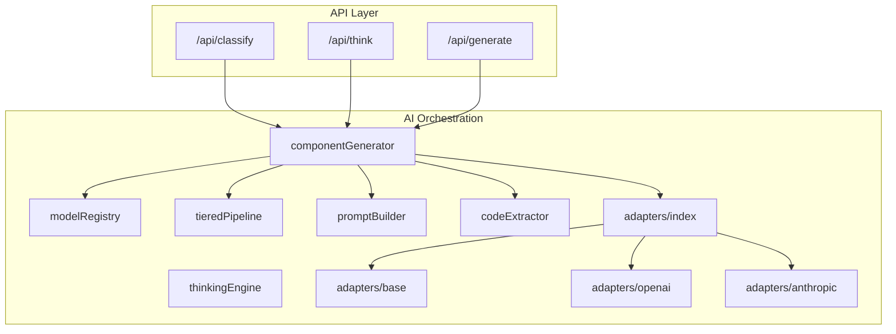
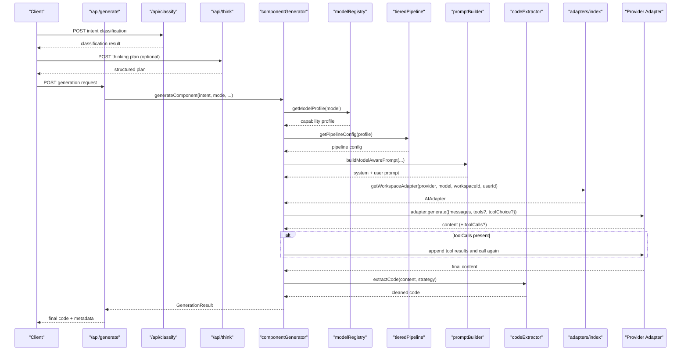
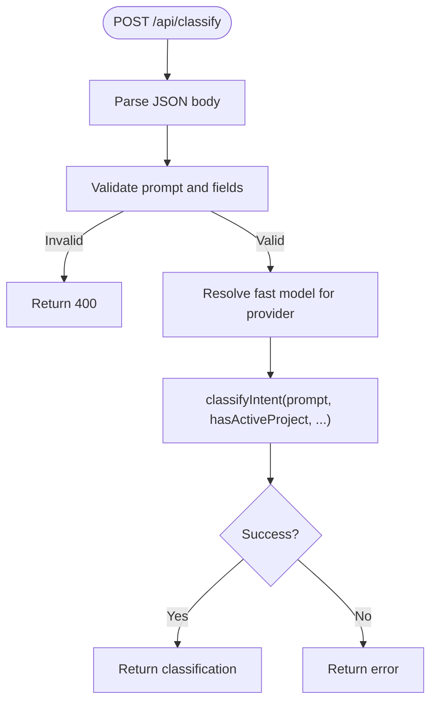
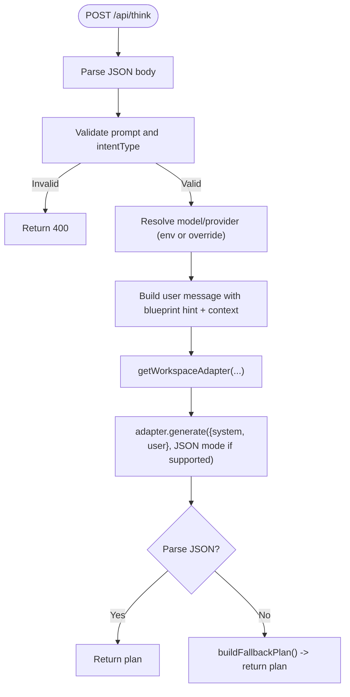
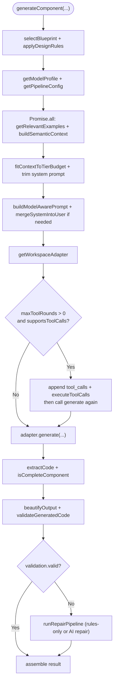
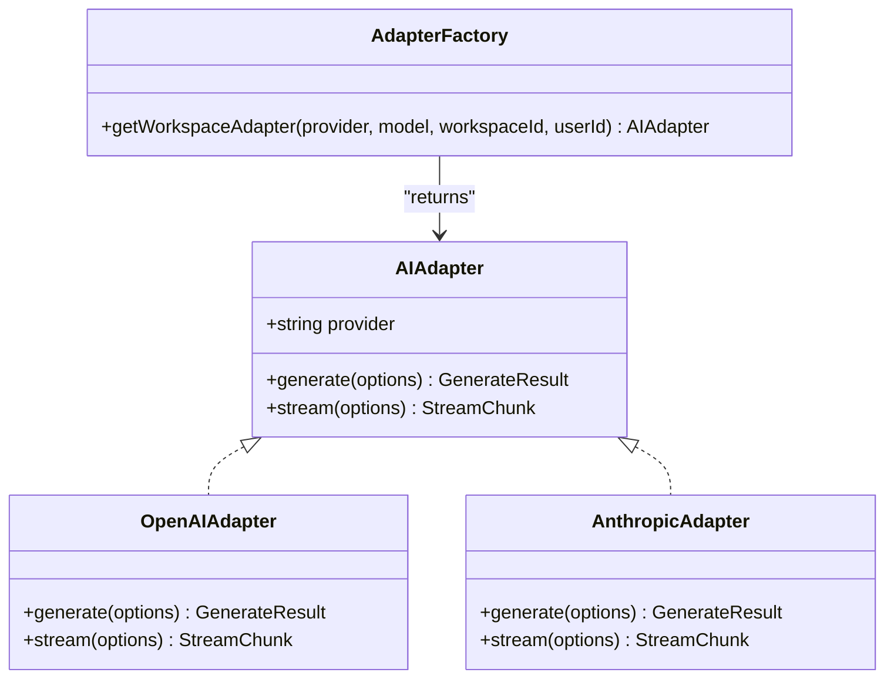
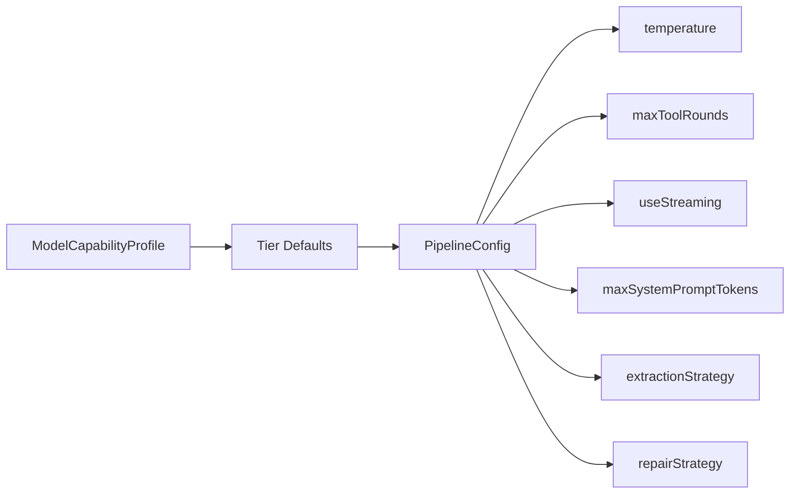
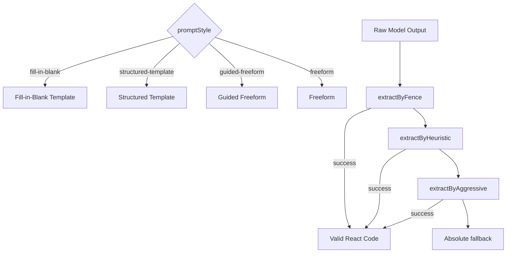
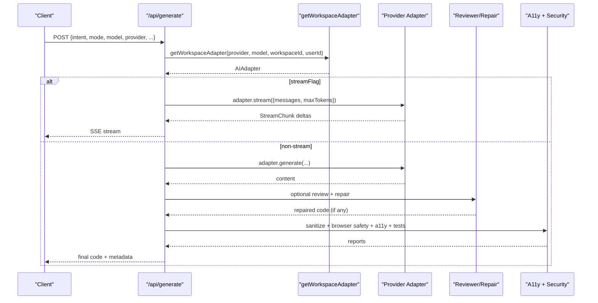
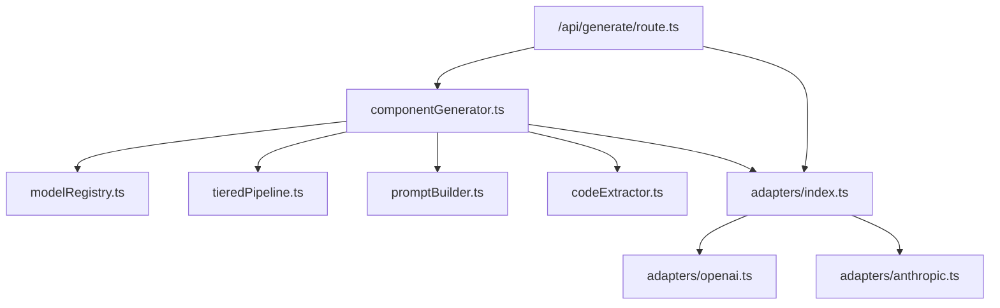

# Generation Flow

<cite>
**Referenced Files in This Document**
- [route.ts](file://app/api/generate/route.ts)
- [route.ts](file://app/api/think/route.ts)
- [route.ts](file://app/api/classify/route.ts)
- [componentGenerator.ts](file://lib/ai/componentGenerator.ts)
- [thinkingEngine.ts](file://lib/ai/thinkingEngine.ts)
- [index.ts](file://lib/ai/adapters/index.ts)
- [base.ts](file://lib/ai/adapters/base.ts)
- [openai.ts](file://lib/ai/adapters/openai.ts)
- [anthropic.ts](file://lib/ai/adapters/anthropic.ts)
- [modelRegistry.ts](file://lib/ai/modelRegistry.ts)
- [tieredPipeline.ts](file://lib/ai/tieredPipeline.ts)
- [promptBuilder.ts](file://lib/ai/promptBuilder.ts)
- [codeExtractor.ts](file://lib/ai/codeExtractor.ts)
- [types.ts](file://lib/ai/types.ts)
</cite>

## Table of Contents
1. [Introduction](#introduction)
2. [Project Structure](#project-structure)
3. [Core Components](#core-components)
4. [Architecture Overview](#architecture-overview)
5. [Detailed Component Analysis](#detailed-component-analysis)
6. [Dependency Analysis](#dependency-analysis)
7. [Performance Considerations](#performance-considerations)
8. [Troubleshooting Guide](#troubleshooting-guide)
9. [Conclusion](#conclusion)

## Introduction
This document explains the AI generation flow that transforms user intents into production-ready React components. It covers the full pipeline from intent classification and preprocessing, model profile resolution, concurrent memory and knowledge retrieval, token budget management, prompt construction with intelligence context, agentic tool loop execution, code extraction strategies, and final beautification. It also documents the model-agnostic architecture enabling seamless switching between providers while maintaining consistent output quality.

## Project Structure
The generation flow spans several API routes and internal AI orchestration modules:
- API entry points: classification, thinking plan, and generation routes
- Orchestrator: component generation pipeline
- Adapters: provider-agnostic AI adapters for OpenAI, Anthropic, Google, Ollama, and others
- Model registry and pipeline: capability profiles and pipeline configuration
- Prompt building, extraction, and tools: model-aware prompt construction, multi-strategy code extraction, and tool execution
- Types and pricing: shared types and cost estimation

**Diagram sources**
- [route.ts:25-440](file://app/api/generate/route.ts#L25-L440)
- [route.ts:8-79](file://app/api/think/route.ts#L8-L79)
- [route.ts:8-76](file://app/api/classify/route.ts#L8-L76)
- [componentGenerator.ts:60-402](file://lib/ai/componentGenerator.ts#L60-L402)
- [thinkingEngine.ts:167-297](file://lib/ai/thinkingEngine.ts#L167-L297)
- [modelRegistry.ts:132-800](file://lib/ai/modelRegistry.ts#L132-L800)
- [tieredPipeline.ts:191-235](file://lib/ai/tieredPipeline.ts#L191-L235)
- [promptBuilder.ts:244-298](file://lib/ai/promptBuilder.ts#L244-L298)
- [codeExtractor.ts:218-262](file://lib/ai/codeExtractor.ts#L218-L262)
- [index.ts:146-278](file://lib/ai/adapters/index.ts#L146-L278)
- [base.ts:50-72](file://lib/ai/adapters/base.ts#L50-L72)
- [openai.ts:36-223](file://lib/ai/adapters/openai.ts#L36-L223)
- [anthropic.ts:71-210](file://lib/ai/adapters/anthropic.ts#L71-L210)

**Section sources**
- [route.ts:25-440](file://app/api/generate/route.ts#L25-L440)
- [route.ts:8-79](file://app/api/think/route.ts#L8-L79)
- [route.ts:8-76](file://app/api/classify/route.ts#L8-L76)

## Core Components
- Intent classification and preprocessing: validates inputs, resolves a fast model for classification, and returns a structured classification result.
- Thinking plan: generates a structured plan aligned with the user’s intent and optionally enriched by blueprint and project context.
- Generation pipeline: orchestrates blueprint selection, design rules, semantic knowledge, memory retrieval, prompt construction, tool loops, code extraction, beautification, and validation.
- Model-agnostic adapters: resolve credentials securely, normalize provider differences, and expose a uniform generate/stream interface.
- Model registry and pipeline: define capability profiles and derive pipeline configurations per model tier.
- Prompt builder and extraction: construct model-aware prompts and extract valid React code using multiple strategies.

**Section sources**
- [route.ts:8-76](file://app/api/classify/route.ts#L8-L76)
- [thinkingEngine.ts:167-297](file://lib/ai/thinkingEngine.ts#L167-L297)
- [componentGenerator.ts:60-402](file://lib/ai/componentGenerator.ts#L60-L402)
- [index.ts:146-278](file://lib/ai/adapters/index.ts#L146-L278)
- [modelRegistry.ts:132-800](file://lib/ai/modelRegistry.ts#L132-L800)
- [tieredPipeline.ts:191-235](file://lib/ai/tieredPipeline.ts#L191-L235)
- [promptBuilder.ts:244-298](file://lib/ai/promptBuilder.ts#L244-L298)
- [codeExtractor.ts:218-262](file://lib/ai/codeExtractor.ts#L218-L262)

## Architecture Overview
The generation flow is model-agnostic and provider-agnostic. Providers are resolved server-side using workspace-scoped keys, ensuring no client credentials leak. The orchestrator selects a model profile, builds a pipeline configuration, constructs a model-aware prompt, executes optional tool loops, extracts code, and applies deterministic post-processing.

**Diagram sources**
- [route.ts:25-440](file://app/api/generate/route.ts#L25-L440)
- [route.ts:8-76](file://app/api/classify/route.ts#L8-L76)
- [route.ts:8-79](file://app/api/think/route.ts#L8-L79)
- [componentGenerator.ts:60-402](file://lib/ai/componentGenerator.ts#L60-L402)
- [modelRegistry.ts:132-800](file://lib/ai/modelRegistry.ts#L132-L800)
- [tieredPipeline.ts:191-235](file://lib/ai/tieredPipeline.ts#L191-L235)
- [promptBuilder.ts:244-298](file://lib/ai/promptBuilder.ts#L244-L298)
- [codeExtractor.ts:218-262](file://lib/ai/codeExtractor.ts#L218-L262)
- [index.ts:236-278](file://lib/ai/adapters/index.ts#L236-L278)

## Detailed Component Analysis

### Intent Classification and Preprocessing
- Validates presence of required fields and prompt length.
- Resolves a fast model for classification to minimize cost and latency.
- Returns a structured classification result for downstream use.

**Diagram sources**
- [route.ts:8-76](file://app/api/classify/route.ts#L8-L76)

**Section sources**
- [route.ts:8-76](file://app/api/classify/route.ts#L8-L76)

### Thinking Plan Generation
- Builds a structured plan aligned with the user’s intent and optional project context.
- Supports JSON mode when the model profile allows it; otherwise falls back to deterministic plan construction.

**Diagram sources**
- [route.ts:8-79](file://app/api/think/route.ts#L8-L79)
- [thinkingEngine.ts:167-297](file://lib/ai/thinkingEngine.ts#L167-L297)

**Section sources**
- [route.ts:8-79](file://app/api/think/route.ts#L8-L79)
- [thinkingEngine.ts:167-297](file://lib/ai/thinkingEngine.ts#L167-L297)

### Generation Pipeline Orchestration
- Blueprint and design rules: selects blueprint and applies design rules; formats context for prompts.
- Model profile resolution: retrieves capability profile and derives pipeline configuration.
- Concurrent memory and knowledge: retrieves relevant examples and semantic knowledge in parallel.
- Token budget management: trims knowledge and cheat sheet to fit model capacity; enforces system prompt caps.
- Prompt construction: builds model-aware prompt; merges system into user when required; injects style DNA and UX state contract for component/depth_ui modes.
- Tool loop: executes optional tool calls with strict protocol; appends tool results and continues until final output.
- Code extraction: multi-strategy extraction (fence/heuristic/aggressive) with confidence scoring.
- Beautification and validation: deterministic beautification and validation; applies repair pipeline when needed.
- Finalization: returns code, metadata, and generator info.

**Diagram sources**
- [componentGenerator.ts:60-402](file://lib/ai/componentGenerator.ts#L60-L402)
- [modelRegistry.ts:132-800](file://lib/ai/modelRegistry.ts#L132-L800)
- [tieredPipeline.ts:191-235](file://lib/ai/tieredPipeline.ts#L191-L235)
- [promptBuilder.ts:244-298](file://lib/ai/promptBuilder.ts#L244-L298)
- [codeExtractor.ts:218-262](file://lib/ai/codeExtractor.ts#L218-L262)

**Section sources**
- [componentGenerator.ts:60-402](file://lib/ai/componentGenerator.ts#L60-L402)

### Model-Agnostic Adapter Layer
- Secure credential resolution: resolves workspace-scoped keys or environment variables; never accepts client-provided keys.
- Provider normalization: supports OpenAI, Anthropic, Google, Ollama, and OpenAI-compatible providers (e.g., Groq, LM Studio).
- Unified interface: AIAdapter exposes generate and stream with consistent message and usage semantics.

**Diagram sources**
- [base.ts:50-72](file://lib/ai/adapters/base.ts#L50-L72)
- [openai.ts:36-223](file://lib/ai/adapters/openai.ts#L36-L223)
- [anthropic.ts:71-210](file://lib/ai/adapters/anthropic.ts#L71-L210)
- [index.ts:236-278](file://lib/ai/adapters/index.ts#L236-L278)

**Section sources**
- [index.ts:146-278](file://lib/ai/adapters/index.ts#L146-L278)
- [base.ts:50-72](file://lib/ai/adapters/base.ts#L50-L72)
- [openai.ts:36-223](file://lib/ai/adapters/openai.ts#L36-L223)
- [anthropic.ts:71-210](file://lib/ai/adapters/anthropic.ts#L71-L210)

### Model Registry and Pipeline Configuration
- Capability profiles: define model tiers, token budgets, prompt strategies, extraction strategies, tool support, and repair priorities.
- Pipeline derivation: maps profiles to concrete pipeline configs controlling temperature, tool rounds, streaming, timeouts, and system prompt caps.

**Diagram sources**
- [modelRegistry.ts:132-800](file://lib/ai/modelRegistry.ts#L132-L800)
- [tieredPipeline.ts:191-235](file://lib/ai/tieredPipeline.ts#L191-L235)

**Section sources**
- [modelRegistry.ts:132-800](file://lib/ai/modelRegistry.ts#L132-L800)
- [tieredPipeline.ts:191-235](file://lib/ai/tieredPipeline.ts#L191-L235)

### Prompt Construction and Extraction
- Prompt strategies: fill-in-blank (tiny), structured-template (small), guided-freeform (medium), freeform (large/cloud).
- Locked imports and output wrappers: injected for small/tiny models to reduce hallucinations.
- Extraction strategies: fenced code, heuristic parsing, and aggressive stripping; validated heuristically to avoid returning prose.

**Diagram sources**
- [promptBuilder.ts:244-298](file://lib/ai/promptBuilder.ts#L244-L298)
- [codeExtractor.ts:218-262](file://lib/ai/codeExtractor.ts#L218-L262)

**Section sources**
- [promptBuilder.ts:244-298](file://lib/ai/promptBuilder.ts#L244-L298)
- [codeExtractor.ts:218-262](file://lib/ai/codeExtractor.ts#L218-L262)

### API Workflows
- Generation endpoint: validates inputs, resolves adapter, streams or generates code, runs reviewer/repair when appropriate, sanitizes and validates browser safety, runs accessibility and tests in parallel, saves memory, and returns results.
- Streaming path: uses adapter.stream to return incremental deltas for live UI updates.

**Diagram sources**
- [route.ts:25-440](file://app/api/generate/route.ts#L25-L440)
- [index.ts:236-278](file://lib/ai/adapters/index.ts#L236-L278)

**Section sources**
- [route.ts:25-440](file://app/api/generate/route.ts#L25-L440)

## Dependency Analysis
- Component coupling:
  - componentGenerator depends on modelRegistry, tieredPipeline, promptBuilder, codeExtractor, adapters/index, and tools.
  - adapters/index depends on provider-specific adapters and caches metrics.
  - API routes depend on orchestrators and validators.
- Cohesion:
  - Each adapter encapsulates provider-specific quirks (e.g., system role merging, tool call constraints).
  - Prompt builder and extraction are cohesive modules with clear strategies.
- External dependencies:
  - Provider SDKs and native fetch implementations.
  - Environment variables and workspace key service for credentials.

**Diagram sources**
- [componentGenerator.ts:60-402](file://lib/ai/componentGenerator.ts#L60-L402)
- [modelRegistry.ts:132-800](file://lib/ai/modelRegistry.ts#L132-L800)
- [tieredPipeline.ts:191-235](file://lib/ai/tieredPipeline.ts#L191-L235)
- [promptBuilder.ts:244-298](file://lib/ai/promptBuilder.ts#L244-L298)
- [codeExtractor.ts:218-262](file://lib/ai/codeExtractor.ts#L218-L262)
- [index.ts:146-278](file://lib/ai/adapters/index.ts#L146-L278)
- [openai.ts:36-223](file://lib/ai/adapters/openai.ts#L36-L223)
- [anthropic.ts:71-210](file://lib/ai/adapters/anthropic.ts#L71-L210)
- [route.ts:25-440](file://app/api/generate/route.ts#L25-L440)

**Section sources**
- [componentGenerator.ts:60-402](file://lib/ai/componentGenerator.ts#L60-L402)
- [index.ts:146-278](file://lib/ai/adapters/index.ts#L146-L278)

## Performance Considerations
- Token budget enforcement: knowledge and cheat sheet are trimmed to fit model capacity; system prompt is capped to avoid overflow.
- Parallelism: memory and semantic knowledge retrieval run concurrently; accessibility and tests run concurrently after generation.
- Streaming: enabled for providers with reliable streaming; otherwise falls back to non-streaming generation.
- Tool calls: restricted to models that support them; enforced by capability profiles to avoid silent failures.
- Caching: adapter wrapper caches results and usage metrics to reduce latency and cost.

[No sources needed since this section provides general guidance]

## Troubleshooting Guide
- Configuration errors: missing provider keys surface as clear configuration errors; adapters return unconfigured gracefully on platforms where local daemons are unreachable.
- JSON parsing failures: thinking engine includes robust JSON extraction with truncation repair and fallback plans.
- Reviewer/repair failures: reviewer failures are non-fatal and do not block valid generated code; the pipeline continues with original output.
- Local model limitations: local/Ollama models skip expensive review/repair; adjust expectations accordingly.
- Browser safety: generated code is sanitized and validated to prevent unsafe patterns in the sandbox.

**Section sources**
- [index.ts:28-40](file://lib/ai/adapters/index.ts#L28-L40)
- [thinkingEngine.ts:260-275](file://lib/ai/thinkingEngine.ts#L260-L275)
- [route.ts:296-310](file://app/api/generate/route.ts#L296-L310)
- [route.ts:134-152](file://app/api/generate/route.ts#L134-L152)
- [route.ts:317-326](file://app/api/generate/route.ts#L317-L326)

## Conclusion
The generation flow is a model- and provider-agnostic orchestration that balances quality and cost across a wide range of models. By leveraging capability profiles, pipeline configurations, and multi-strategy extraction, it consistently produces production-ready React components. The secure adapter layer, token budgeting, and parallel validations ensure reliability and performance across diverse environments.