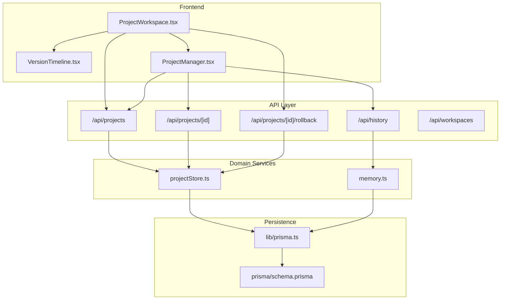
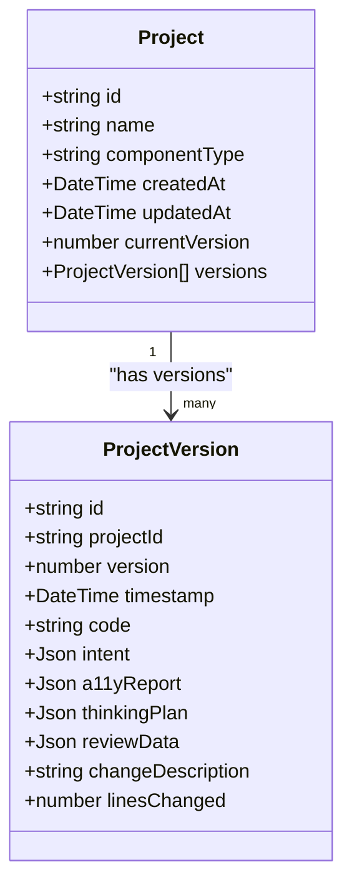
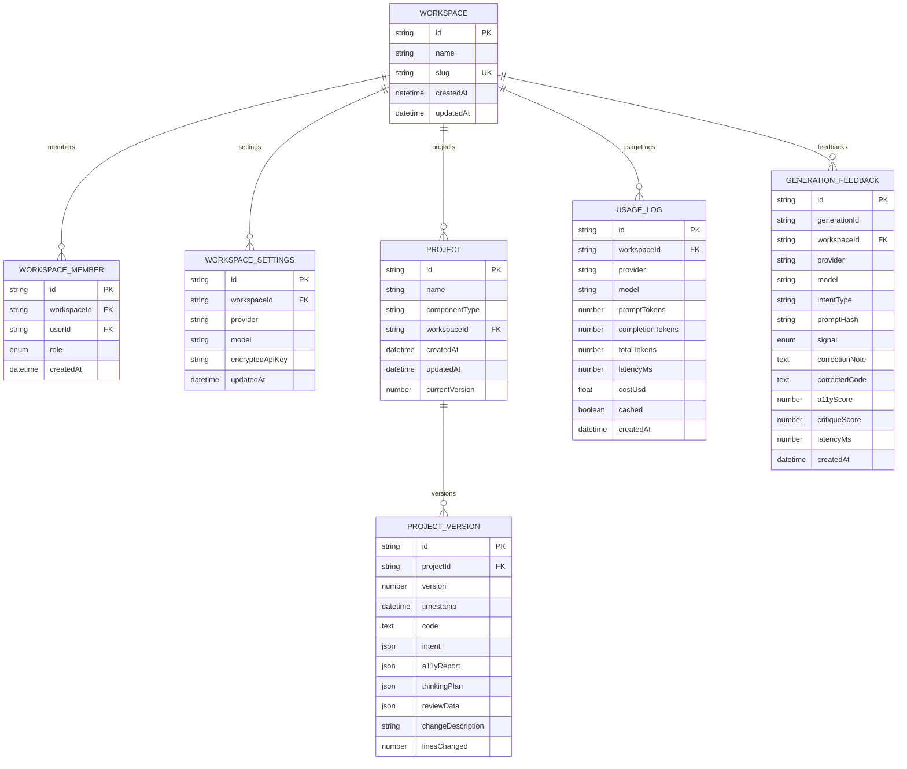
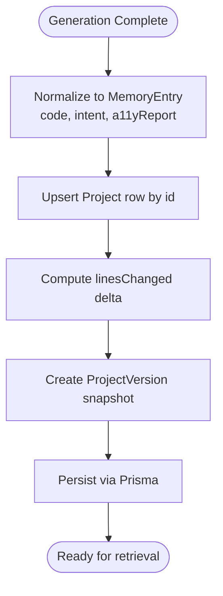
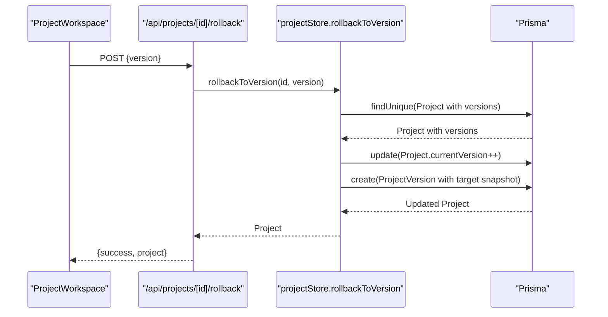
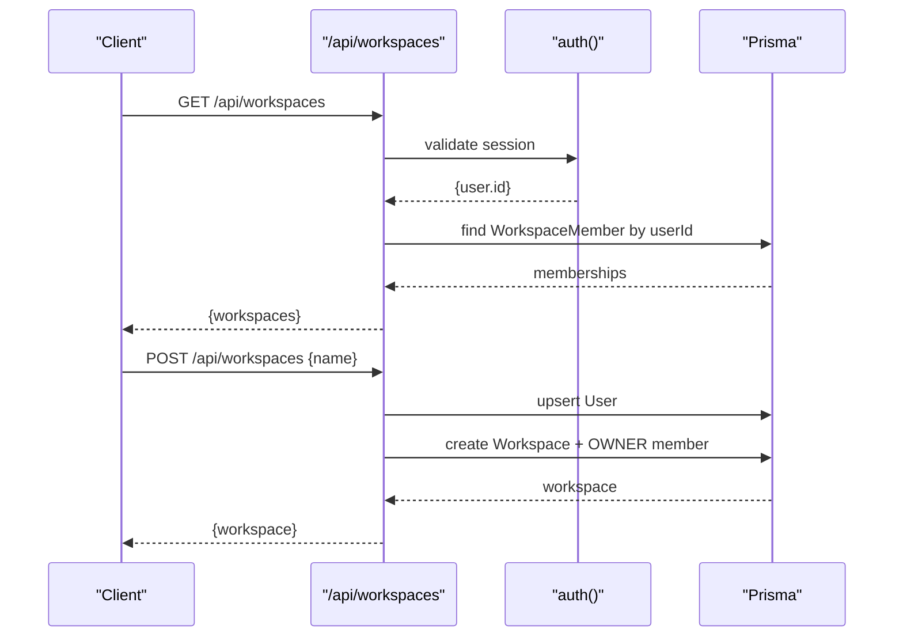
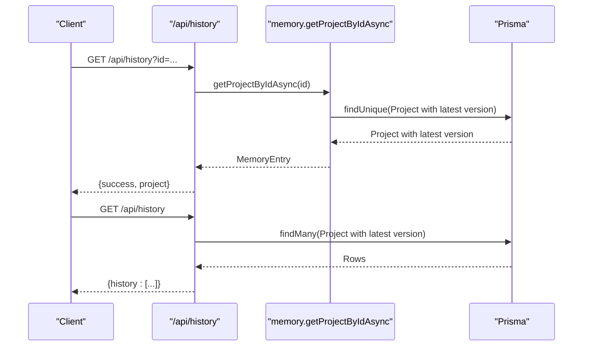
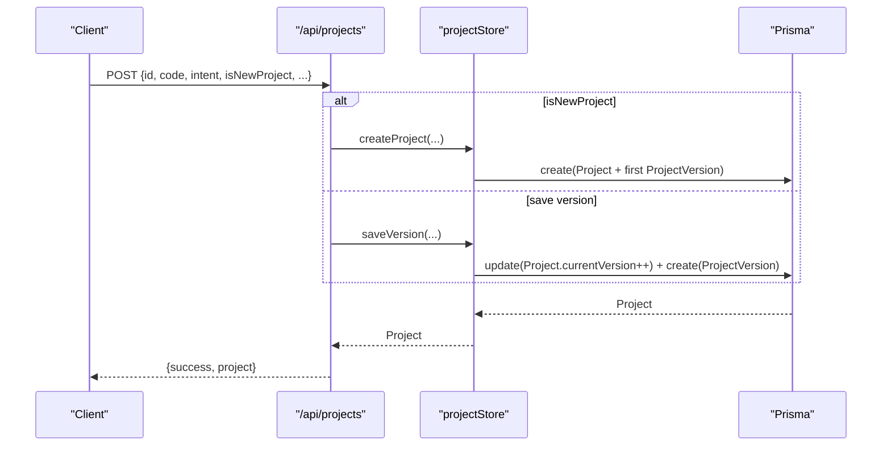
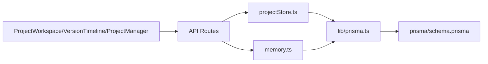

# Persistence Flow

<cite>
**Referenced Files in This Document**
- [schema.prisma](file://prisma/schema.prisma)
- [prisma.ts](file://lib/prisma.ts)
- [projectStore.ts](file://lib/projects/projectStore.ts)
- [memory.ts](file://lib/ai/memory.ts)
- [route.ts](file://app/api/projects/route.ts)
- [route.ts](file://app/api/projects/[id]/route.ts)
- [route.ts](file://app/api/projects/[id]/rollback/route.ts)
- [route.ts](file://app/api/history/route.ts)
- [route.ts](file://app/api/workspaces/route.ts)
- [ProjectWorkspace.tsx](file://components/ProjectWorkspace.tsx)
- [VersionTimeline.tsx](file://components/VersionTimeline.tsx)
- [ProjectManager.tsx](file://components/ProjectManager.tsx)
- [schemas.ts](file://lib/validation/schemas.ts)
</cite>

## Table of Contents
1. [Introduction](#introduction)
2. [Project Structure](#project-structure)
3. [Core Components](#core-components)
4. [Architecture Overview](#architecture-overview)
5. [Detailed Component Analysis](#detailed-component-analysis)
6. [Dependency Analysis](#dependency-analysis)
7. [Performance Considerations](#performance-considerations)
8. [Troubleshooting Guide](#troubleshooting-guide)
9. [Conclusion](#conclusion)

## Introduction
This document explains the complete data persistence flow for managing project lifecycle, version control, and historical tracking. It covers how generation results are transformed into database entities, how version control is implemented to track component evolution, and how collaborative workflows are supported through workspace scoping. It also documents the database schema design, relationships among projects, versions, and workspaces, and the API endpoints that handle CRUD operations for persistent data.

## Project Structure
The persistence pipeline spans several layers:
- Database schema defines entities and relationships (Prisma).
- Prisma client wrapper provides singleton access and transient error handling.
- API routes expose endpoints for project CRUD and history.
- Domain services encapsulate project creation, version saving, and rollback.
- Frontend components render version timelines, manage projects, and trigger persistence actions.

**Diagram sources**
- [ProjectWorkspace.tsx:1-313](file://components/ProjectWorkspace.tsx#L1-L313)
- [VersionTimeline.tsx:1-148](file://components/VersionTimeline.tsx#L1-L148)
- [ProjectManager.tsx:1-231](file://components/ProjectManager.tsx#L1-L231)
- [route.ts:1-92](file://app/api/projects/route.ts#L1-L92)
- [route.ts:1-12](file://app/api/projects/[id]/route.ts#L1-L12)
- [route.ts:1-23](file://app/api/projects/[id]/rollback/route.ts#L1-L23)
- [route.ts:1-60](file://app/api/history/route.ts#L1-L60)
- [route.ts:1-145](file://app/api/workspaces/route.ts#L1-L145)
- [projectStore.ts:1-291](file://lib/projects/projectStore.ts#L1-L291)
- [memory.ts:1-211](file://lib/ai/memory.ts#L1-L211)
- [prisma.ts:1-70](file://lib/prisma.ts#L1-L70)
- [schema.prisma:1-222](file://prisma/schema.prisma#L1-L222)

**Section sources**
- [route.ts:1-92](file://app/api/projects/route.ts#L1-L92)
- [route.ts:1-12](file://app/api/projects/[id]/route.ts#L1-L12)
- [route.ts:1-23](file://app/api/projects/[id]/rollback/route.ts#L1-L23)
- [route.ts:1-60](file://app/api/history/route.ts#L1-L60)
- [route.ts:1-145](file://app/api/workspaces/route.ts#L1-L145)
- [projectStore.ts:1-291](file://lib/projects/projectStore.ts#L1-L291)
- [memory.ts:1-211](file://lib/ai/memory.ts#L1-L211)
- [prisma.ts:1-70](file://lib/prisma.ts#L1-L70)
- [schema.prisma:1-222](file://prisma/schema.prisma#L1-L222)

## Core Components
- Prisma client singleton and transient error handling for Neon serverless reliability.
- Project domain service with create, save version, list, get, rollback, and delete operations.
- History/memory abstraction that persists generation results to Project/ProjectVersion.
- API routes for project CRUD, single project retrieval, rollback, and history listing.
- Frontend components for project management, version timeline, and workspace integration.

Key responsibilities:
- Transform generation results (code, intent, a11y report) into normalized entities.
- Enforce version ordering and compute deltas (lines changed).
- Provide rollback by recreating a new version from a target snapshot.
- Support workspace scoping for multi-tenant collaboration.

**Section sources**
- [prisma.ts:1-70](file://lib/prisma.ts#L1-L70)
- [projectStore.ts:105-291](file://lib/projects/projectStore.ts#L105-L291)
- [memory.ts:55-173](file://lib/ai/memory.ts#L55-L173)
- [route.ts:16-82](file://app/api/projects/route.ts#L16-L82)
- [route.ts:4-22](file://app/api/projects/[id]/rollback/route.ts#L4-L22)

## Architecture Overview
The persistence architecture centers on two core entities:
- Project: identifies a UI component/app or depth_ui artifact with a current version pointer.
- ProjectVersion: immutable snapshots of code, intent, a11y report, and metadata.

API endpoints delegate to domain services that wrap Prisma operations with a reconnect helper for transient database errors. History endpoints leverage the same Project/ProjectVersion tables to serve lightweight summaries and detailed entries.

**Diagram sources**
- [schema.prisma:158-187](file://prisma/schema.prisma#L158-L187)

**Section sources**
- [schema.prisma:158-187](file://prisma/schema.prisma#L158-L187)

## Detailed Component Analysis

### Database Schema and Relationships
- Entities: Project, ProjectVersion, Workspace, WorkspaceMember, WorkspaceSettings, UsageLog, GenerationFeedback, ComponentEmbedding, FeedbackEmbedding.
- Relationships:
  - Project belongs to Workspace (nullable) and contains multiple ProjectVersion snapshots.
  - ProjectVersion belongs to Project.
  - WorkspaceMember links User to Workspace with role.
  - WorkspaceSettings scoped to Workspace.
  - UsageLog and GenerationFeedback optionally scoped to Workspace.
  - Embeddings are separate entities for vector similarity.

**Diagram sources**
- [schema.prisma:64-126](file://prisma/schema.prisma#L64-L126)
- [schema.prisma:158-187](file://prisma/schema.prisma#L158-L187)
- [schema.prisma:194-221](file://prisma/schema.prisma#L194-L221)

**Section sources**
- [schema.prisma:64-126](file://prisma/schema.prisma#L64-L126)
- [schema.prisma:158-187](file://prisma/schema.prisma#L158-L187)
- [schema.prisma:194-221](file://prisma/schema.prisma#L194-L221)

### Data Transformation: From Generation Results to Database Entities
- Generation results include code (string or multi-file object), UI intent, and a11y report.
- The memory abstraction normalizes these into a MemoryEntry and persists to Project/ProjectVersion.
- ProjectStore converts MemoryEntry into domain Project/ProjectVersion and writes via Prisma.
- Code normalization handles both string and object formats; intent and a11yReport are stored as JSON.

**Diagram sources**
- [memory.ts:55-124](file://lib/ai/memory.ts#L55-L124)
- [projectStore.ts:105-160](file://lib/projects/projectStore.ts#L105-L160)
- [projectStore.ts:162-208](file://lib/projects/projectStore.ts#L162-L208)

**Section sources**
- [memory.ts:55-124](file://lib/ai/memory.ts#L55-L124)
- [projectStore.ts:105-160](file://lib/projects/projectStore.ts#L105-L160)
- [projectStore.ts:162-208](file://lib/projects/projectStore.ts#L162-L208)

### Version Management System
- Each ProjectVersion is uniquely identified by (projectId, version).
- Version numbering increments on each save; rollback creates a new version from a target snapshot.
- Frontend components render a timeline of versions and allow selecting or rolling back to a prior version.

**Diagram sources**
- [route.ts:4-22](file://app/api/projects/[id]/rollback/route.ts#L4-L22)
- [projectStore.ts:247-281](file://lib/projects/projectStore.ts#L247-L281)

**Section sources**
- [route.ts:4-22](file://app/api/projects/[id]/rollback/route.ts#L4-L22)
- [projectStore.ts:247-281](file://lib/projects/projectStore.ts#L247-L281)
- [VersionTimeline.tsx:17-147](file://components/VersionTimeline.tsx#L17-L147)

### Collaborative Editing Support
- Workspaces enable multi-tenancy; Projects can be scoped to a Workspace.
- WorkspaceMembers define roles (OWNER, ADMIN, MEMBER) for access control.
- Workspaces API supports listing and creating workspaces, enforcing ownership for deletion.
- Projects can be filtered by workspaceId in listing and creation flows.

**Diagram sources**
- [route.ts:31-109](file://app/api/workspaces/route.ts#L31-L109)
- [schema.prisma:64-95](file://prisma/schema.prisma#L64-L95)

**Section sources**
- [route.ts:31-109](file://app/api/workspaces/route.ts#L31-L109)
- [schema.prisma:64-95](file://prisma/schema.prisma#L64-L95)

### Historical Revision Tracking
- History endpoint returns either a single project with its latest version or a summarized list of recent projects.
- Summarized history excludes code blobs and focuses on metadata for efficient listing.
- Memory abstraction ensures generation results persist to Project/ProjectVersion for later retrieval.

**Diagram sources**
- [route.ts:5-59](file://app/api/history/route.ts#L5-L59)
- [memory.ts:126-152](file://lib/ai/memory.ts#L126-L152)

**Section sources**
- [route.ts:5-59](file://app/api/history/route.ts#L5-L59)
- [memory.ts:126-152](file://lib/ai/memory.ts#L126-L152)

### API Endpoints for CRUD Operations
- GET /api/projects: List projects, optionally filtered by workspaceId.
- POST /api/projects: Create a new project (isNewProject=true) or save a new version (isNewProject=false).
- GET /api/projects/[id]: Retrieve a single project with all versions.
- POST /api/projects/[id]/rollback: Roll back to a specific version by creating a new version snapshot.
- DELETE /api/projects: Delete a project by id.
- GET /api/history: Retrieve a single project or a summarized history list.

**Diagram sources**
- [route.ts:16-82](file://app/api/projects/route.ts#L16-L82)
- [projectStore.ts:105-160](file://lib/projects/projectStore.ts#L105-L160)
- [projectStore.ts:162-208](file://lib/projects/projectStore.ts#L162-L208)

**Section sources**
- [route.ts:16-82](file://app/api/projects/route.ts#L16-L82)
- [route.ts:4-11](file://app/api/projects/[id]/route.ts#L4-L11)
- [route.ts:4-22](file://app/api/projects/[id]/rollback/route.ts#L4-L22)
- [route.ts:5-59](file://app/api/history/route.ts#L5-L59)

## Dependency Analysis
- Frontend components depend on API routes for persistence and history.
- API routes depend on domain services (projectStore, memory) for business logic.
- Domain services depend on Prisma client wrapper for database access.
- Prisma client depends on schema.prisma for entity definitions and relationships.

**Diagram sources**
- [ProjectWorkspace.tsx:1-313](file://components/ProjectWorkspace.tsx#L1-L313)
- [VersionTimeline.tsx:1-148](file://components/VersionTimeline.tsx#L1-L148)
- [ProjectManager.tsx:1-231](file://components/ProjectManager.tsx#L1-L231)
- [route.ts:1-92](file://app/api/projects/route.ts#L1-L92)
- [projectStore.ts:1-291](file://lib/projects/projectStore.ts#L1-L291)
- [memory.ts:1-211](file://lib/ai/memory.ts#L1-L211)
- [prisma.ts:1-70](file://lib/prisma.ts#L1-L70)
- [schema.prisma:1-222](file://prisma/schema.prisma#L1-L222)

**Section sources**
- [ProjectWorkspace.tsx:1-313](file://components/ProjectWorkspace.tsx#L1-L313)
- [VersionTimeline.tsx:1-148](file://components/VersionTimeline.tsx#L1-L148)
- [ProjectManager.tsx:1-231](file://components/ProjectManager.tsx#L1-L231)
- [route.ts:1-92](file://app/api/projects/route.ts#L1-L92)
- [projectStore.ts:1-291](file://lib/projects/projectStore.ts#L1-L291)
- [memory.ts:1-211](file://lib/ai/memory.ts#L1-L211)
- [prisma.ts:1-70](file://lib/prisma.ts#L1-L70)
- [schema.prisma:1-222](file://prisma/schema.prisma#L1-L222)

## Performance Considerations
- Prisma singleton minimizes connection churn; reconnect helper mitigates transient Neon errors.
- History listing limits results and avoids heavy payloads by excluding code blobs.
- Version snapshots are immutable; rollbacks create new versions rather than mutating history.
- Frontend components debounce and avoid unnecessary re-renders during rapid refinements.

[No sources needed since this section provides general guidance]

## Troubleshooting Guide
Common issues and remedies:
- Transient database errors (e.g., connection closed): The reconnect helper attempts a brief delay and retry.
- Missing project table (pending migration): Domain services return in-memory stubs to keep UI responsive.
- Unauthorized or missing workspace operations: Workspaces API validates session and ownership before performing operations.
- Invalid JSON payloads: API routes validate request bodies and return structured error responses.

**Section sources**
- [prisma.ts:36-70](file://lib/prisma.ts#L36-L70)
- [projectStore.ts:6-8](file://lib/projects/projectStore.ts#L6-L8)
- [route.ts:34-52](file://app/api/workspaces/route.ts#L34-L52)
- [route.ts:19-22](file://app/api/projects/route.ts#L19-L22)

## Conclusion
The persistence flow integrates generation results into durable Project/ProjectVersion entities, enabling robust version control, historical tracking, and collaborative workflows through workspace scoping. The API layer cleanly exposes CRUD operations, while domain services encapsulate data transformation and error resilience. Together, these components form a scalable foundation for managing AI-generated UI artifacts across teams and iterations.