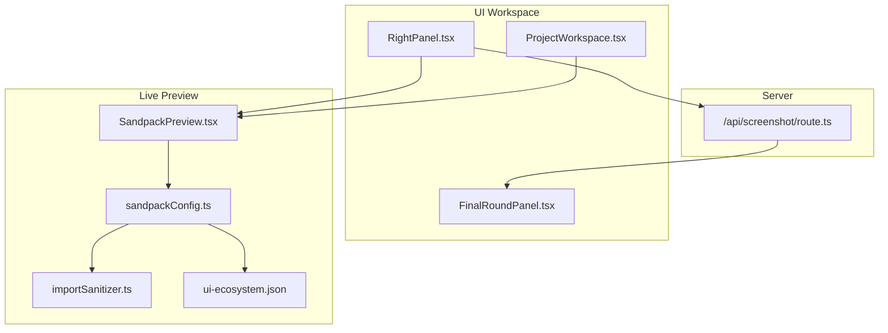
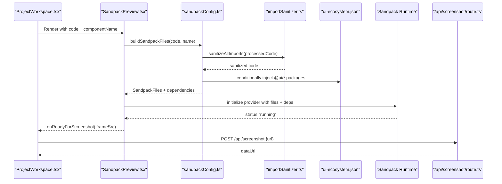
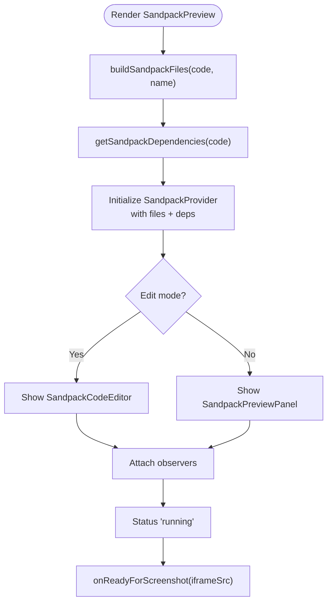
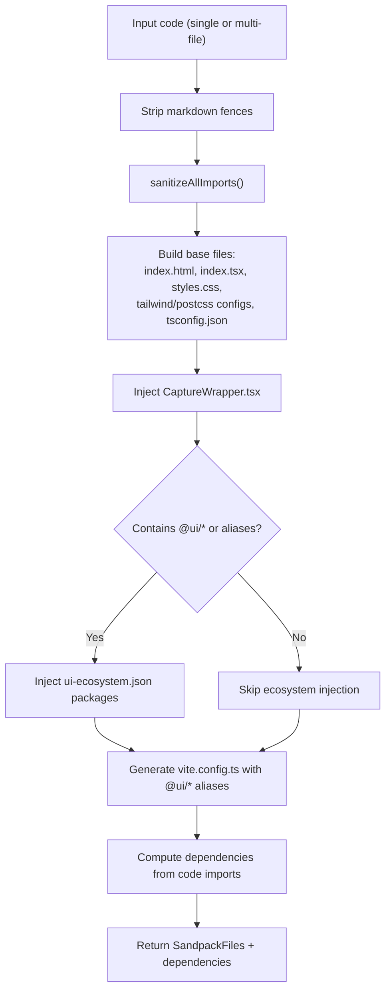
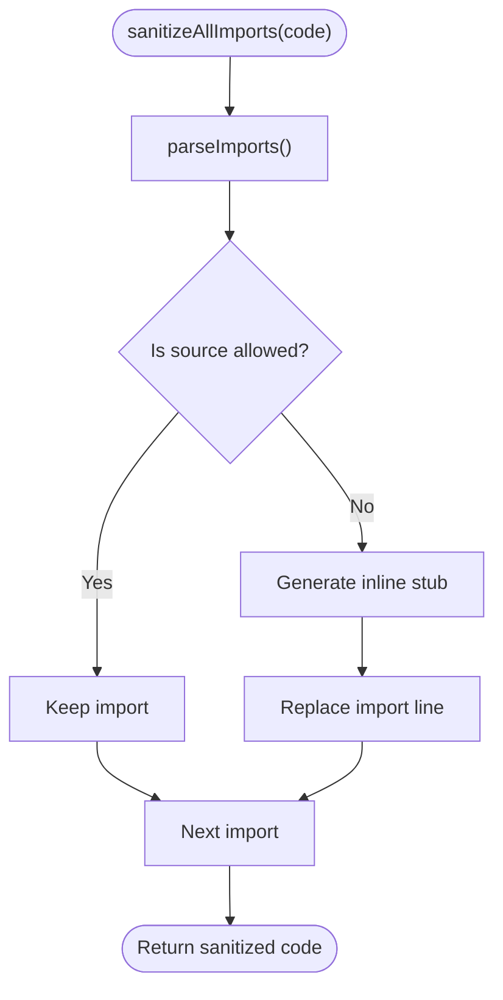
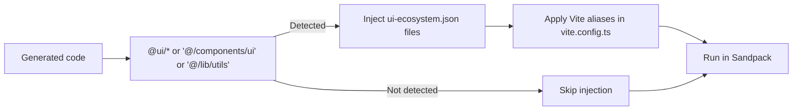
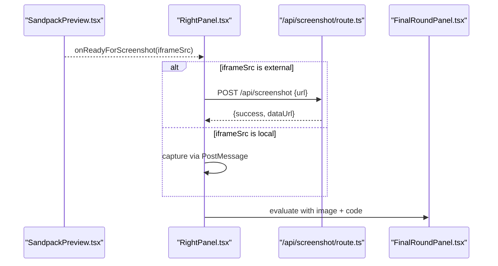
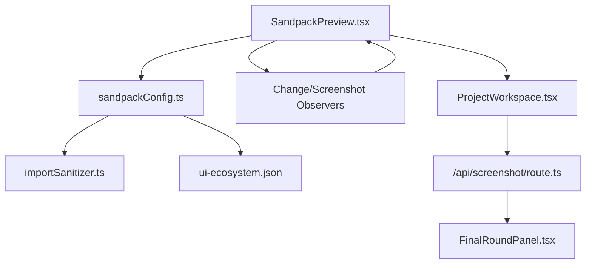

# Preview Flow

<cite>
**Referenced Files in This Document**
- [SandpackPreview.tsx](file://components/SandpackPreview.tsx)
- [sandpackConfig.ts](file://lib/sandbox/sandpackConfig.ts)
- [importSanitizer.ts](file://lib/sandbox/importSanitizer.ts)
- [ui-ecosystem.json](file://lib/sandbox/ui-ecosystem.json)
- [route.ts](file://app/api/screenshot/route.ts)
- [ProjectWorkspace.tsx](file://components/ProjectWorkspace.tsx)
- [RightPanel.tsx](file://components/ide/RightPanel.tsx)
- [FinalRoundPanel.tsx](file://components/FinalRoundPanel.tsx)
- [GeneratedCode.tsx](file://components/GeneratedCode.tsx)
</cite>

## Table of Contents
1. [Introduction](#introduction)
2. [Project Structure](#project-structure)
3. [Core Components](#core-components)
4. [Architecture Overview](#architecture-overview)
5. [Detailed Component Analysis](#detailed-component-analysis)
6. [Dependency Analysis](#dependency-analysis)
7. [Performance Considerations](#performance-considerations)
8. [Troubleshooting Guide](#troubleshooting-guide)
9. [Conclusion](#conclusion)

## Introduction
This document explains the live preview flow that powers real-time component rendering and interactive development. It covers the complete pipeline from generated code to live browser preview, including Sandpack configuration, UI ecosystem integration, dependency management, and state synchronization. It also documents the code transformation process that prepares generated components for the sandbox environment, the dependency resolution system that handles React, Tailwind, and UI library imports, and the real-time preview update mechanism that reflects changes instantly. Additional topics include UI ecosystem integration for internal component libraries, security sandboxing against malicious code, and performance optimization techniques for smooth preview rendering.

## Project Structure
The preview flow spans several layers:
- UI shell and orchestration in the IDE workspace
- Sandpack-based live preview component
- Sandpack configuration and code transformation
- Security sanitization and dependency resolution
- Screenshot capture and final round evaluation

**Diagram sources**
- [ProjectWorkspace.tsx:218-221](file://components/ProjectWorkspace.tsx#L218-L221)
- [SandpackPreview.tsx:144-286](file://components/SandpackPreview.tsx#L144-L286)
- [sandpackConfig.ts:112-401](file://lib/sandbox/sandpackConfig.ts#L112-L401)
- [importSanitizer.ts:16-224](file://lib/sandbox/importSanitizer.ts#L16-L224)
- [ui-ecosystem.json:1-49](file://lib/sandbox/ui-ecosystem.json#L1-L49)
- [RightPanel.tsx:367-447](file://components/ide/RightPanel.tsx#L367-L447)
- [route.ts:43-137](file://app/api/screenshot/route.ts#L43-L137)

**Section sources**
- [ProjectWorkspace.tsx:218-221](file://components/ProjectWorkspace.tsx#L218-L221)
- [SandpackPreview.tsx:144-286](file://components/SandpackPreview.tsx#L144-L286)
- [sandpackConfig.ts:112-401](file://lib/sandbox/sandpackConfig.ts#L112-L401)
- [importSanitizer.ts:16-224](file://lib/sandbox/importSanitizer.ts#L16-L224)
- [ui-ecosystem.json:1-49](file://lib/sandbox/ui-ecosystem.json#L1-L49)
- [RightPanel.tsx:367-447](file://components/ide/RightPanel.tsx#L367-L447)
- [route.ts:43-137](file://app/api/screenshot/route.ts#L43-L137)

## Core Components
- SandpackPreview: The main live preview component that hosts the Sandpack runtime, exposes an inline editor, and coordinates observers for code changes and screenshot readiness.
- Sandpack configuration: Builds the virtual file system, injects UI ecosystem packages, resolves dependencies, and configures Vite aliases.
- Import sanitizer: Strips or replaces unknown or hallucinated imports to prevent sandbox failures.
- UI ecosystem: A curated set of internal UI packages injected into the sandbox on demand.
- Screenshot API: Captures cross-origin iframe previews using a headless browser for final round evaluation.

**Section sources**
- [SandpackPreview.tsx:144-286](file://components/SandpackPreview.tsx#L144-L286)
- [sandpackConfig.ts:112-401](file://lib/sandbox/sandpackConfig.ts#L112-L401)
- [importSanitizer.ts:16-224](file://lib/sandbox/importSanitizer.ts#L16-L224)
- [ui-ecosystem.json:1-49](file://lib/sandbox/ui-ecosystem.json#L1-L49)
- [route.ts:43-137](file://app/api/screenshot/route.ts#L43-L137)

## Architecture Overview
The preview pipeline transforms generated code into a runnable preview with the following stages:
1. Code ingestion and normalization
2. Virtual file system construction
3. Dependency resolution and injection
4. UI ecosystem augmentation
5. Sandpack runtime initialization
6. Real-time updates and error handling
7. Screenshot capture for evaluation

**Diagram sources**
- [ProjectWorkspace.tsx:218-221](file://components/ProjectWorkspace.tsx#L218-L221)
- [SandpackPreview.tsx:144-286](file://components/SandpackPreview.tsx#L144-L286)
- [sandpackConfig.ts:112-401](file://lib/sandbox/sandpackConfig.ts#L112-L401)
- [importSanitizer.ts:210-223](file://lib/sandbox/importSanitizer.ts#L210-L223)
- [ui-ecosystem.json:1-49](file://lib/sandbox/ui-ecosystem.json#L1-L49)
- [route.ts:43-137](file://app/api/screenshot/route.ts#L43-L137)

## Detailed Component Analysis

### SandpackPreview: Live Preview Shell
SandpackPreview orchestrates the live preview experience:
- Builds the virtual file system and computes dynamic dependencies
- Exposes an inline editor and a toggle to switch between preview-only and edit modes
- Provides two observers:
  - Change observer: emits code changes from the active file when they differ from the initial state
  - Screenshot observer: detects when the preview has settled and reports the iframe URL for capture
- Wraps the preview in an error boundary to gracefully handle mount failures

**Diagram sources**
- [SandpackPreview.tsx:144-286](file://components/SandpackPreview.tsx#L144-L286)
- [sandpackConfig.ts:112-167](file://lib/sandbox/sandpackConfig.ts#L112-L167)

**Section sources**
- [SandpackPreview.tsx:144-286](file://components/SandpackPreview.tsx#L144-L286)

### Sandpack Configuration: Virtual File System and Dependencies
The configuration layer builds the virtual file system and resolves dependencies:
- Normalizes code by stripping markdown fences and sanitizing imports
- Injects stubs for missing relative imports to prevent Vite resolution errors
- Builds a Vite-compatible project scaffold (HTML, entry, Tailwind, TS config, vite.config.ts)
- Conditionally injects the UI ecosystem packages when detected in the code
- Computes a minimal dependency set based on import analysis

**Diagram sources**
- [sandpackConfig.ts:112-401](file://lib/sandbox/sandpackConfig.ts#L112-L401)
- [importSanitizer.ts:210-223](file://lib/sandbox/importSanitizer.ts#L210-L223)
- [ui-ecosystem.json:1-49](file://lib/sandbox/ui-ecosystem.json#L1-L49)

**Section sources**
- [sandpackConfig.ts:112-401](file://lib/sandbox/sandpackConfig.ts#L112-L401)

### Import Sanitization: Security and Stability
The sanitizer ensures the sandbox remains stable by:
- Maintaining an allow-list of known packages and aliases
- Detecting and replacing hallucinated design-system packages
- Generating inline stubs for named and default imports
- Removing side-effect imports from unknown packages

**Diagram sources**
- [importSanitizer.ts:169-205](file://lib/sandbox/importSanitizer.ts#L169-L205)
- [importSanitizer.ts:210-223](file://lib/sandbox/importSanitizer.ts#L210-L223)

**Section sources**
- [importSanitizer.ts:16-224](file://lib/sandbox/importSanitizer.ts#L16-L224)

### UI Ecosystem Integration
The UI ecosystem provides internal component libraries that are injected into the sandbox only when referenced:
- A curated set of components and utilities under @ui/*
- Vite aliases in vite.config.ts map @ui/* to the injected files
- Injection is gated by code analysis to avoid unnecessary overhead

**Diagram sources**
- [sandpackConfig.ts:386-398](file://lib/sandbox/sandpackConfig.ts#L386-L398)
- [sandpackConfig.ts:353-382](file://lib/sandbox/sandpackConfig.ts#L353-L382)
- [ui-ecosystem.json:1-49](file://lib/sandbox/ui-ecosystem.json#L1-L49)

**Section sources**
- [sandpackConfig.ts:386-398](file://lib/sandbox/sandpackConfig.ts#L386-L398)
- [sandpackConfig.ts:353-382](file://lib/sandbox/sandpackConfig.ts#L353-L382)
- [ui-ecosystem.json:1-49](file://lib/sandbox/ui-ecosystem.json#L1-L49)

### Screenshot Capture and Final Round Evaluation
The final round evaluates the preview using a screenshot:
- The preview notifies the parent when the iframe is ready
- The parent captures either via PostMessage (local preview) or via a server endpoint
- The server uses a headless browser to capture cross-origin iframes reliably
- The captured image is sent to the final round evaluator

**Diagram sources**
- [SandpackPreview.tsx:65-103](file://components/SandpackPreview.tsx#L65-L103)
- [RightPanel.tsx:367-447](file://components/ide/RightPanel.tsx#L367-L447)
- [route.ts:43-137](file://app/api/screenshot/route.ts#L43-L137)

**Section sources**
- [SandpackPreview.tsx:65-103](file://components/SandpackPreview.tsx#L65-L103)
- [RightPanel.tsx:367-447](file://components/ide/RightPanel.tsx#L367-L447)
- [route.ts:43-137](file://app/api/screenshot/route.ts#L43-L137)

## Dependency Analysis
The preview flow depends on:
- Sandpack provider and layout components for rendering
- Sandpack configuration for file system and dependency setup
- Import sanitizer for security and stability
- UI ecosystem for internal component libraries
- Screenshot API for evaluation

**Diagram sources**
- [SandpackPreview.tsx:144-286](file://components/SandpackPreview.tsx#L144-L286)
- [sandpackConfig.ts:112-401](file://lib/sandbox/sandpackConfig.ts#L112-L401)
- [importSanitizer.ts:16-224](file://lib/sandbox/importSanitizer.ts#L16-L224)
- [ui-ecosystem.json:1-49](file://lib/sandbox/ui-ecosystem.json#L1-L49)
- [ProjectWorkspace.tsx:218-221](file://components/ProjectWorkspace.tsx#L218-L221)
- [route.ts:43-137](file://app/api/screenshot/route.ts#L43-L137)
- [FinalRoundPanel.tsx:203-255](file://components/FinalRoundPanel.tsx#L203-L255)

**Section sources**
- [SandpackPreview.tsx:144-286](file://components/SandpackPreview.tsx#L144-L286)
- [sandpackConfig.ts:112-401](file://lib/sandbox/sandpackConfig.ts#L112-L401)
- [importSanitizer.ts:16-224](file://lib/sandbox/importSanitizer.ts#L16-L224)
- [ui-ecosystem.json:1-49](file://lib/sandbox/ui-ecosystem.json#L1-L49)
- [ProjectWorkspace.tsx:218-221](file://components/ProjectWorkspace.tsx#L218-L221)
- [route.ts:43-137](file://app/api/screenshot/route.ts#L43-L137)
- [FinalRoundPanel.tsx:203-255](file://components/FinalRoundPanel.tsx#L203-L255)

## Performance Considerations
- Conditional UI ecosystem injection: Only inject @ui/* packages when referenced to reduce cold-start time and avoid timeouts.
- Minimal dependency set: Compute dependencies from code imports to avoid bundling unused packages.
- Optimized Vite configuration: Use Vite aliases to resolve @ui/* without scanning the entire package graph.
- Lazy loading: The preview component is loaded dynamically in the workspace to avoid SSR overhead.
- Screenshot timing: Delayed capture and controlled viewport sizing balance quality and speed.

[No sources needed since this section provides general guidance]

## Troubleshooting Guide
Common issues and remedies:
- Preview crashes: The error boundary displays a concise message and a retry button. Inspect the error message and regenerate the component.
- Missing components or modules: Relative imports not present in the virtual file system are automatically stubbed. Verify that the generated code references files that are included.
- Unknown or hallucinated imports: Imports outside the allow-list are sanitized and replaced with inline stubs. Review the sanitized code to confirm replacements.
- Screenshot capture failures: For cross-origin iframes, ensure the server endpoint is reachable and the host is allowed. For local iframes, confirm the PostMessage handshake completes.

**Section sources**
- [SandpackPreview.tsx:109-140](file://components/SandpackPreview.tsx#L109-L140)
- [importSanitizer.ts:169-205](file://lib/sandbox/importSanitizer.ts#L169-L205)
- [route.ts:69-92](file://app/api/screenshot/route.ts#L69-L92)

## Conclusion
The live preview flow combines a robust Sandpack runtime, a security-first import sanitizer, and a carefully curated UI ecosystem to deliver a responsive, secure, and extensible preview experience. By normalizing code, injecting only necessary dependencies, and capturing screenshots reliably, the system supports iterative development and evaluation workflows. The modular design allows for incremental improvements in performance, security, and developer ergonomics.