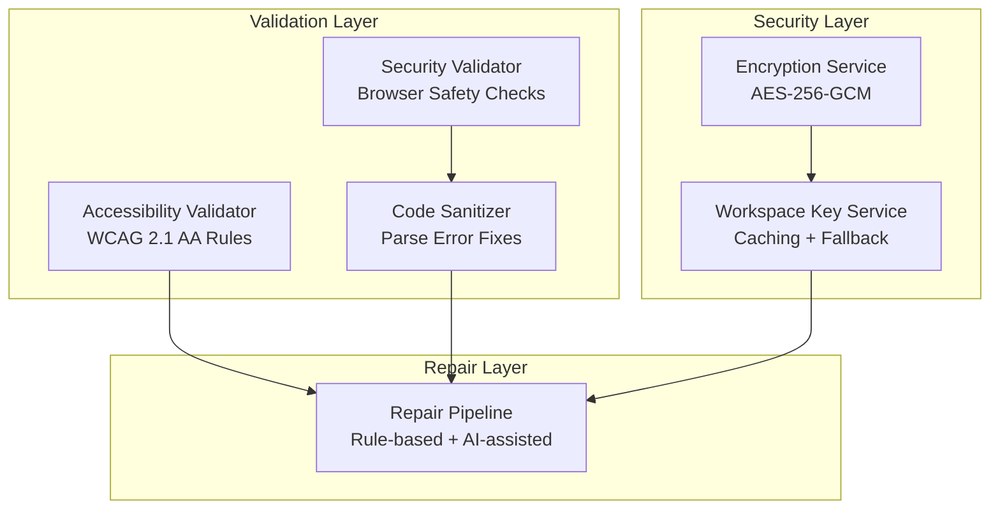
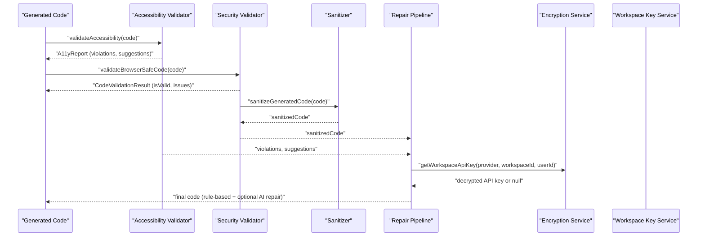
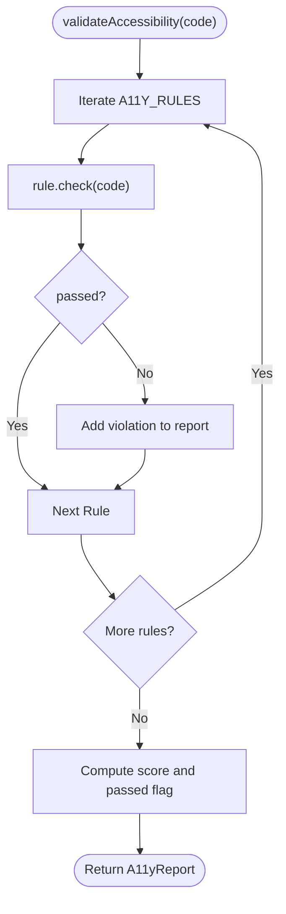
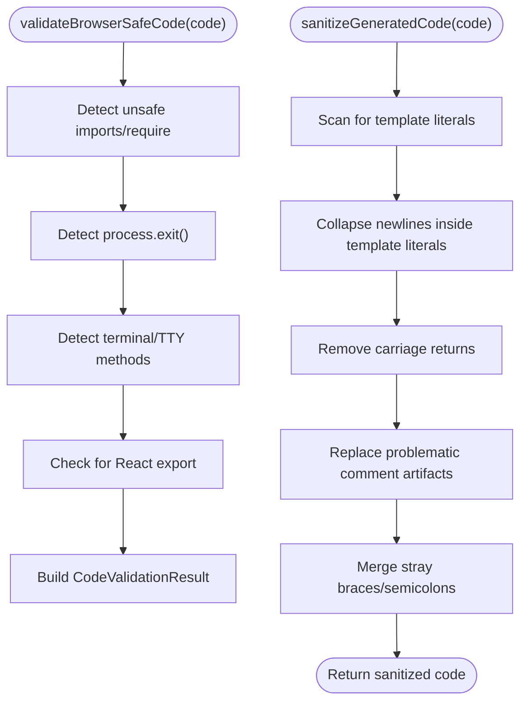
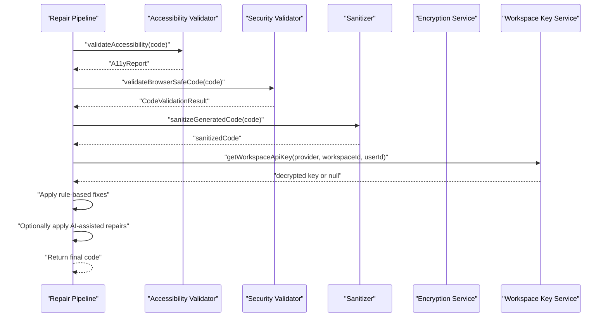
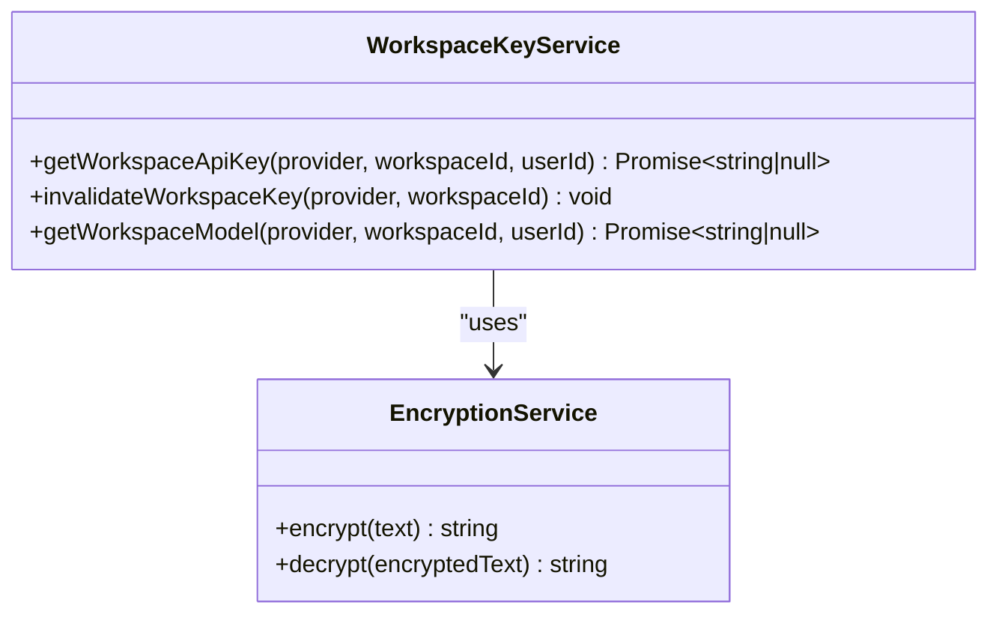
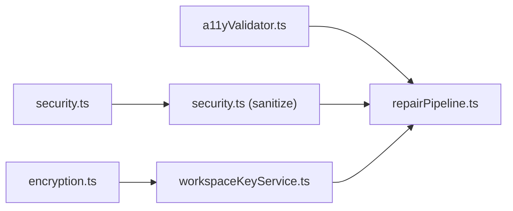

# Validation Flow

<cite>
**Referenced Files in This Document**
- [a11yValidator.ts](file://lib/validation/a11yValidator.ts)
- [security.ts](file://lib/validation/security.ts)
- [a11yValidator.test.ts](file://__tests__/a11yValidator.test.ts)
- [security.test.ts](file://__tests__/security.test.ts)
- [encryption.ts](file://lib/security/encryption.ts)
- [workspaceKeyService.ts](file://lib/security/workspaceKeyService.ts)
- [repairPipeline.ts](file://lib/intelligence/repairPipeline.ts)
</cite>

## Table of Contents
1. [Introduction](#introduction)
2. [Project Structure](#project-structure)
3. [Core Components](#core-components)
4. [Architecture Overview](#architecture-overview)
5. [Detailed Component Analysis](#detailed-component-analysis)
6. [Dependency Analysis](#dependency-analysis)
7. [Performance Considerations](#performance-considerations)
8. [Troubleshooting Guide](#troubleshooting-guide)
9. [Conclusion](#conclusion)

## Introduction
This document describes the validation and quality assurance flow that ensures generated code meets accessibility standards and security requirements. The system implements a multi-layered validation pipeline:
- Accessibility rule enforcement aligned with WCAG 2.1 AA criteria, with violation reporting and scoring
- Browser safety validation to prevent unsafe Node.js APIs and unsupported constructs
- Code quality checks focusing on determinism and correctness
- Intelligent repair mechanisms that can automatically fix common issues using rule-based transformations and AI-assisted repairs

The pipeline integrates rule-based validators, sanitization routines, and a repair pipeline that can leverage either deterministic fixes or AI-driven improvements depending on model capabilities and complexity.

## Project Structure
The validation and QA logic is primarily located under lib/validation and lib/security, with tests under __tests__. The repair pipeline resides under lib/intelligence.

**Diagram sources**
- [a11yValidator.ts:1-376](file://lib/validation/a11yValidator.ts#L1-L376)
- [security.ts:1-129](file://lib/validation/security.ts#L1-L129)
- [repairPipeline.ts:1-200](file://lib/intelligence/repairPipeline.ts#L1-L200)
- [encryption.ts:1-95](file://lib/security/encryption.ts#L1-L95)
- [workspaceKeyService.ts:1-138](file://lib/security/workspaceKeyService.ts#L1-L138)

**Section sources**
- [a11yValidator.ts:1-376](file://lib/validation/a11yValidator.ts#L1-L376)
- [security.ts:1-129](file://lib/validation/security.ts#L1-L129)
- [repairPipeline.ts:1-200](file://lib/intelligence/repairPipeline.ts#L1-L200)
- [encryption.ts:1-95](file://lib/security/encryption.ts#L1-L95)
- [workspaceKeyService.ts:1-138](file://lib/security/workspaceKeyService.ts#L1-L138)

## Core Components
- Accessibility Validator: Implements WCAG 2.1 AA–aligned rules for TSX code, generating a structured report with violations, severity, and suggestions. It also provides an auto-repair function to apply common fixes.
- Security Validator: Ensures generated code is safe for the browser by rejecting Node.js APIs and unsupported constructs, and performs sanitization to avoid parse errors in Sandpack/Babel.
- Repair Pipeline: Orchestrates deterministic rule-based repairs and can integrate AI-assisted repairs depending on model capabilities and complexity.
- Encryption and Workspace Key Service: Provides secure storage and retrieval of API keys with caching and fallback strategies.

**Section sources**
- [a11yValidator.ts:10-297](file://lib/validation/a11yValidator.ts#L10-L297)
- [security.ts:6-128](file://lib/validation/security.ts#L6-L128)
- [repairPipeline.ts:1-200](file://lib/intelligence/repairPipeline.ts#L1-L200)
- [encryption.ts:27-68](file://lib/security/encryption.ts#L27-L68)
- [workspaceKeyService.ts:32-95](file://lib/security/workspaceKeyService.ts#L32-L95)

## Architecture Overview
The validation pipeline operates in stages:
1. Accessibility validation: Applies WCAG-aligned rules to generated TSX code and produces a report with violations and suggestions.
2. Security validation: Verifies browser compatibility and sanitizes code to prevent parsing errors.
3. Repair stage: Applies rule-based fixes first, optionally followed by AI-assisted repairs for complex issues.
4. Security integration: Retrieves workspace-specific API keys securely, with caching and fallback behavior.

**Diagram sources**
- [a11yValidator.ts:264-297](file://lib/validation/a11yValidator.ts#L264-L297)
- [security.ts:6-34](file://lib/validation/security.ts#L6-L34)
- [security.ts:44-128](file://lib/validation/security.ts#L44-L128)
- [repairPipeline.ts:1-200](file://lib/intelligence/repairPipeline.ts#L1-L200)
- [encryption.ts:27-68](file://lib/security/encryption.ts#L27-L68)
- [workspaceKeyService.ts:32-95](file://lib/security/workspaceKeyService.ts#L32-L95)

## Detailed Component Analysis

### Accessibility Validator
The validator defines a set of WCAG 2.1 AA–aligned rules and evaluates generated TSX code against them. Each rule specifies:
- Rule identity and WCAG criteria
- Severity level
- Description and suggested remediation
- A check function that scans the code and reports violations
- A scoring mechanism that penalizes errors and warnings

Key behaviors:
- Violation reporting includes ruleId, severity, affected element, description, and WCAG criteria
- Suggestions are aggregated for each violation
- Scoring starts at 100 and subtracts points based on severity counts
- An auto-repair function applies deterministic fixes for common issues

**Diagram sources**
- [a11yValidator.ts:264-297](file://lib/validation/a11yValidator.ts#L264-L297)
- [a11yValidator.ts:19-260](file://lib/validation/a11yValidator.ts#L19-L260)

**Section sources**
- [a11yValidator.ts:10-297](file://lib/validation/a11yValidator.ts#L10-L297)
- [a11yValidator.test.ts:1-110](file://__tests__/a11yValidator.test.ts#L1-L110)

### Security Validator and Sanitizer
The security validator enforces browser safety by detecting unsupported Node.js APIs and terminal/TTY manipulation methods, and by ensuring a valid React export exists. The sanitizer performs targeted fixes to avoid Babel parse errors in Sandpack:
- Collapses multi-line template literals inside JSX attributes
- Removes carriage returns
- Replaces problematic comment artifacts in arrow function bodies and JSX attribute values
- Merges stray braces and semicolons that result from comment replacements

**Diagram sources**
- [security.ts:6-34](file://lib/validation/security.ts#L6-L34)
- [security.ts:44-128](file://lib/validation/security.ts#L44-L128)

**Section sources**
- [security.ts:6-128](file://lib/validation/security.ts#L6-L128)
- [security.test.ts:1-60](file://__tests__/security.test.ts#L1-L60)

### Repair Pipeline
The repair pipeline orchestrates validation outcomes and applies automated fixes. It supports:
- Rule-based repairs derived from accessibility and security validations
- AI-assisted repairs for complex or nuanced issues, selectable based on model capabilities and complexity

**Diagram sources**
- [repairPipeline.ts:1-200](file://lib/intelligence/repairPipeline.ts#L1-L200)
- [a11yValidator.ts:264-297](file://lib/validation/a11yValidator.ts#L264-L297)
- [security.ts:6-34](file://lib/validation/security.ts#L6-L34)
- [security.ts:44-128](file://lib/validation/security.ts#L44-L128)
- [encryption.ts:27-68](file://lib/security/encryption.ts#L27-L68)
- [workspaceKeyService.ts:32-95](file://lib/security/workspaceKeyService.ts#L32-L95)

**Section sources**
- [repairPipeline.ts:1-200](file://lib/intelligence/repairPipeline.ts#L1-L200)

### Security Integration: Encryption and Workspace Keys
The encryption service provides AES-256-GCM encryption and decryption with flexible key derivation and startup validation. The workspace key service retrieves and caches decrypted API keys per workspace/provider, with global fallback behavior for pipeline routes.

**Diagram sources**
- [encryption.ts:27-68](file://lib/security/encryption.ts#L27-L68)
- [workspaceKeyService.ts:32-95](file://lib/security/workspaceKeyService.ts#L32-L95)

**Section sources**
- [encryption.ts:1-95](file://lib/security/encryption.ts#L1-L95)
- [workspaceKeyService.ts:1-138](file://lib/security/workspaceKeyService.ts#L1-L138)

## Dependency Analysis
The validation pipeline exhibits clear separation of concerns:
- Accessibility and security validators operate independently and produce structured reports
- The sanitizer depends on the security validator’s output to normalize code for parsing
- The repair pipeline consumes outputs from both validators and optionally integrates AI-assisted repairs
- The workspace key service and encryption service support secure retrieval and caching of API keys used by the repair pipeline

**Diagram sources**
- [a11yValidator.ts:264-297](file://lib/validation/a11yValidator.ts#L264-L297)
- [security.ts:6-128](file://lib/validation/security.ts#L6-L128)
- [repairPipeline.ts:1-200](file://lib/intelligence/repairPipeline.ts#L1-L200)
- [encryption.ts:27-68](file://lib/security/encryption.ts#L27-L68)
- [workspaceKeyService.ts:32-95](file://lib/security/workspaceKeyService.ts#L32-L95)

**Section sources**
- [a11yValidator.ts:264-297](file://lib/validation/a11yValidator.ts#L264-L297)
- [security.ts:6-128](file://lib/validation/security.ts#L6-L128)
- [repairPipeline.ts:1-200](file://lib/intelligence/repairPipeline.ts#L1-L200)
- [encryption.ts:27-68](file://lib/security/encryption.ts#L27-L68)
- [workspaceKeyService.ts:32-95](file://lib/security/workspaceKeyService.ts#L32-L95)

## Performance Considerations
- Accessibility rules are implemented as regex-based checks over the entire code string. For very large TSX files, consider optimizing by limiting checks to relevant sections or using a proper AST-based analyzer.
- The sanitizer performs a single pass with character-by-character scanning and several regex replacements. Complexity is linear in code length; ensure early exits for trivial cases.
- Caching in the workspace key service reduces database lookups and improves latency for repeated requests within the TTL window.
- Scoring computation is O(n) over the number of violations, which is efficient for typical validation outputs.

## Troubleshooting Guide
Common issues and resolutions:
- Accessibility violations:
  - Missing alt attributes on images: Add descriptive alt text or aria-label equivalents.
  - Buttons without accessible names: Provide visible text content or aria-label.
  - Heading hierarchy violations: Ensure headings increment by one level at a time.
  - Low contrast text: Use darker text on light backgrounds or lighter text on dark backgrounds.
  - Focus indicators: Replace outline-none with explicit focus ring utilities.
- Security validation failures:
  - Unsupported Node.js imports: Remove or replace with browser-compatible alternatives.
  - process.exit(): Avoid process termination in the browser context.
  - Terminal/TTY methods: Remove console.clear and readline usage.
  - Missing React exports: Ensure a valid export default or named export exists.
- Sanitization artifacts:
  - Multi-line template literals: The sanitizer collapses newlines inside template literals; verify the resulting JSX remains semantically correct.
  - Comment artifacts: The sanitizer replaces problematic comment blocks; review the transformed code to ensure behavior is preserved.
- Repair pipeline decisions:
  - Rule-based vs AI-assisted: Prefer deterministic fixes for straightforward issues; enable AI-assisted repairs for complex scenarios requiring contextual understanding.

**Section sources**
- [a11yValidator.test.ts:1-110](file://__tests__/a11yValidator.test.ts#L1-L110)
- [security.test.ts:1-60](file://__tests__/security.test.ts#L1-L60)
- [a11yValidator.ts:264-297](file://lib/validation/a11yValidator.ts#L264-L297)
- [security.ts:6-34](file://lib/validation/security.ts#L6-L34)
- [security.ts:44-128](file://lib/validation/security.ts#L44-L128)

## Conclusion
The validation and quality assurance flow combines WCAG-aligned accessibility checks, browser safety validation, and code sanitization with a repair pipeline that blends deterministic fixes and AI-assisted improvements. The system emphasizes robustness through structured reporting, scoring, and secure key management, enabling generated UI code to meet accessibility standards and security requirements reliably.