# Adapter Pattern

<cite>
**Referenced Files in This Document**
- [base.ts](file://lib/ai/adapters/base.ts)
- [index.ts](file://lib/ai/adapters/index.ts)
- [openai.ts](file://lib/ai/adapters/openai.ts)
- [anthropic.ts](file://lib/ai/adapters/anthropic.ts)
- [google.ts](file://lib/ai/adapters/google.ts)
- [ollama.ts](file://lib/ai/adapters/ollama.ts)
- [unconfigured.ts](file://lib/ai/adapters/unconfigured.ts)
- [types.ts](file://lib/ai/types.ts)
- [cache.ts](file://lib/ai/cache.ts)
- [workspaceKeyService.ts](file://lib/security/workspaceKeyService.ts)
- [adapters.test.ts](file://__tests__/adapters.test.ts)
- [adapterIndex.test.ts](file://__tests__/adapterIndex.test.ts)
- [workspaceKeyService.test.ts](file://__tests__/workspaceKeyService.test.ts)
</cite>

## Table of Contents
1. [Introduction](#introduction)
2. [Project Structure](#project-structure)
3. [Core Components](#core-components)
4. [Architecture Overview](#architecture-overview)
5. [Detailed Component Analysis](#detailed-component-analysis)
6. [Dependency Analysis](#dependency-analysis)
7. [Performance Considerations](#performance-considerations)
8. [Troubleshooting Guide](#troubleshooting-guide)
9. [Conclusion](#conclusion)
10. [Appendices](#appendices)

## Introduction
This document explains the Adapter Pattern implementation in the AI Generation Engine. It demonstrates how a universal adapter interface abstracts multiple AI providers (OpenAI, Anthropic, Google, Ollama) behind a single contract. It documents the adapter factory pattern that dynamically selects and instantiates provider-specific adapters based on configuration and environment variables. It also details the security-conscious design that prevents client-side credential injection and ensures proper credential resolution through workspaceKeyService. The caching wrapper is explained, along with provider detection logic, fallback mechanisms, and error handling strategies. Finally, it provides concrete examples for integrating new AI providers and outlines the adapter lifecycle.

## Project Structure
The AI adapter system resides under lib/ai/adapters and is supported by shared types, caching, and security utilities:
- Universal adapter interface and options: base.ts
- Adapter registry and factory: index.ts
- Provider-specific adapters: openai.ts, anthropic.ts, google.ts, ollama.ts
- Fallback adapter for unconfigured environments: unconfigured.ts
- Shared types and pricing: types.ts
- Caching abstraction: cache.ts
- Secure credential resolution: workspaceKeyService.ts
- Tests validating behavior and integration: adapters.test.ts, adapterIndex.test.ts, workspaceKeyService.test.ts

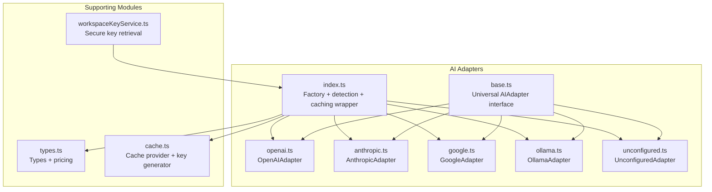

**Diagram sources**
- [base.ts:1-73](file://lib/ai/adapters/base.ts#L1-L73)
- [index.ts:1-306](file://lib/ai/adapters/index.ts#L1-L306)
- [openai.ts:1-223](file://lib/ai/adapters/openai.ts#L1-L223)
- [anthropic.ts:1-210](file://lib/ai/adapters/anthropic.ts#L1-L210)
- [google.ts:1-90](file://lib/ai/adapters/google.ts#L1-L90)
- [ollama.ts:1-87](file://lib/ai/adapters/ollama.ts#L1-L87)
- [unconfigured.ts:1-99](file://lib/ai/adapters/unconfigured.ts#L1-L99)
- [types.ts:1-130](file://lib/ai/types.ts#L1-L130)
- [cache.ts:1-141](file://lib/ai/cache.ts#L1-L141)
- [workspaceKeyService.ts:1-138](file://lib/security/workspaceKeyService.ts#L1-L138)

**Section sources**
- [base.ts:1-73](file://lib/ai/adapters/base.ts#L1-L73)
- [index.ts:1-306](file://lib/ai/adapters/index.ts#L1-L306)
- [types.ts:1-130](file://lib/ai/types.ts#L1-L130)
- [cache.ts:1-141](file://lib/ai/cache.ts#L1-L141)
- [workspaceKeyService.ts:1-138](file://lib/security/workspaceKeyService.ts#L1-L138)

## Core Components
- Universal AIAdapter interface: Defines provider identification and two capabilities—non-streaming generate and streaming stream—ensuring all providers adhere to a consistent contract.
- AdapterConfig and factory: Encapsulates provider selection, model resolution, and credential resolution. The factory enforces that credentials are never accepted from clients.
- Provider-specific adapters: OpenAIAdapter, AnthropicAdapter, GoogleAdapter, OllamaAdapter implement the interface and normalize provider-specific quirks.
- CachedAdapter wrapper: Adds deterministic caching for both generate and stream operations, with metrics dispatch.
- UnconfiguredAdapter: Graceful fallback when no credentials are available.
- Types and pricing: Client-safe types and cost estimation utilities.
- Caching provider: Pluggable cache with Upstash Redis in production and in-memory fallback in development.
- Security: workspaceKeyService resolves and caches decrypted keys from the database with optional user authorization checks.

**Section sources**
- [base.ts:48-72](file://lib/ai/adapters/base.ts#L48-L72)
- [index.ts:69-76](file://lib/ai/adapters/index.ts#L69-L76)
- [index.ts:140-215](file://lib/ai/adapters/index.ts#L140-L215)
- [openai.ts:36-222](file://lib/ai/adapters/openai.ts#L36-L222)
- [anthropic.ts:71-208](file://lib/ai/adapters/anthropic.ts#L71-L208)
- [google.ts:24-89](file://lib/ai/adapters/google.ts#L24-L89)
- [ollama.ts:21-86](file://lib/ai/adapters/ollama.ts#L21-L86)
- [unconfigured.ts:13-98](file://lib/ai/adapters/unconfigured.ts#L13-L98)
- [types.ts:19-55](file://lib/ai/types.ts#L19-L55)
- [cache.ts:18-141](file://lib/ai/cache.ts#L18-L141)
- [workspaceKeyService.ts:32-95](file://lib/security/workspaceKeyService.ts#L32-L95)

## Architecture Overview
The adapter architecture centers on a factory that selects the appropriate adapter based on configuration and environment variables, wraps it with a caching layer, and ensures credentials are resolved securely.

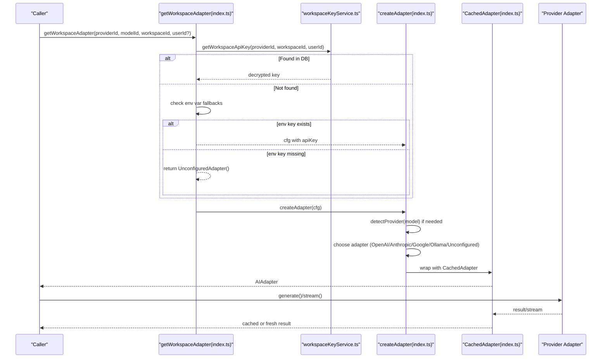

**Diagram sources**
- [index.ts:236-278](file://lib/ai/adapters/index.ts#L236-L278)
- [workspaceKeyService.ts:32-95](file://lib/security/workspaceKeyService.ts#L32-L95)
- [index.ts:146-215](file://lib/ai/adapters/index.ts#L146-L215)
- [openai.ts:36-222](file://lib/ai/adapters/openai.ts#L36-L222)
- [anthropic.ts:71-208](file://lib/ai/adapters/anthropic.ts#L71-L208)
- [google.ts:24-89](file://lib/ai/adapters/google.ts#L24-L89)
- [ollama.ts:21-86](file://lib/ai/adapters/ollama.ts#L21-L86)
- [unconfigured.ts:13-98](file://lib/ai/adapters/unconfigured.ts#L13-L98)

## Detailed Component Analysis

### Universal Adapter Interface (AIAdapter)
Defines the canonical contract that all providers must implement:
- provider: Canonical provider name
- generate(options): Non-streaming generation returning content, optional toolCalls, and usage
- stream(options): Async generator yielding StreamChunk deltas until done

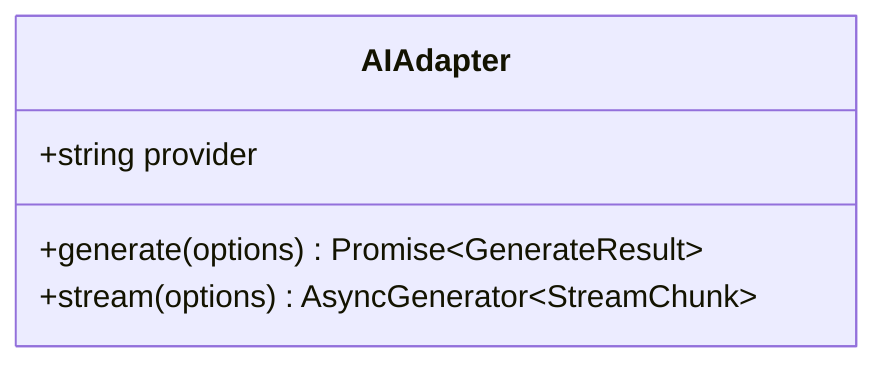

**Diagram sources**
- [base.ts:50-72](file://lib/ai/adapters/base.ts#L50-L72)

**Section sources**
- [base.ts:50-72](file://lib/ai/adapters/base.ts#L50-L72)

### Adapter Factory and Provider Detection
The factory enforces strict credential resolution and provider selection:
- getWorkspaceAdapter: Securely resolves keys via workspaceKeyService, then environment variables, and falls back to UnconfiguredAdapter
- detectProvider: Heuristic-based provider detection from model names as a fallback
- createAdapter: Builds the correct adapter instance, applies CachedAdapter wrapper, and enforces configuration errors for missing keys

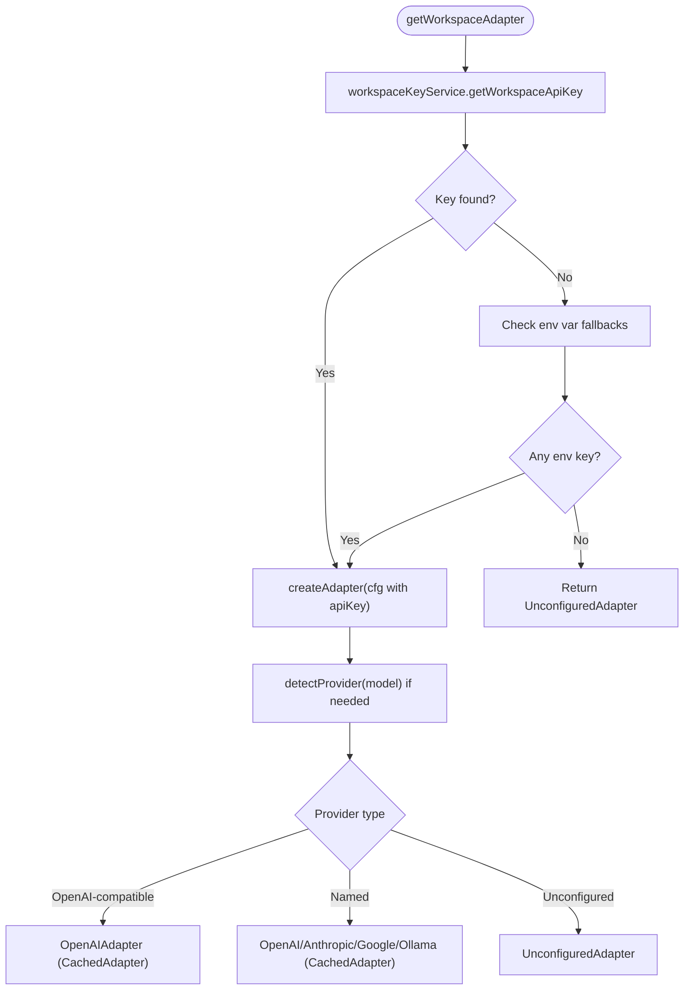

**Diagram sources**
- [index.ts:236-278](file://lib/ai/adapters/index.ts#L236-L278)
- [index.ts:146-215](file://lib/ai/adapters/index.ts#L146-L215)
- [index.ts:56-64](file://lib/ai/adapters/index.ts#L56-L64)

**Section sources**
- [index.ts:236-278](file://lib/ai/adapters/index.ts#L236-L278)
- [index.ts:146-215](file://lib/ai/adapters/index.ts#L146-L215)
- [index.ts:56-64](file://lib/ai/adapters/index.ts#L56-L64)

### Provider-Specific Adapters

#### OpenAIAdapter
- Handles reasoning models (o1/o3) with special parameter constraints
- Normalizes system messages for models that do not support the system role
- Applies provider-specific caps and tool-call restrictions
- Supports both generate and stream with usage reporting

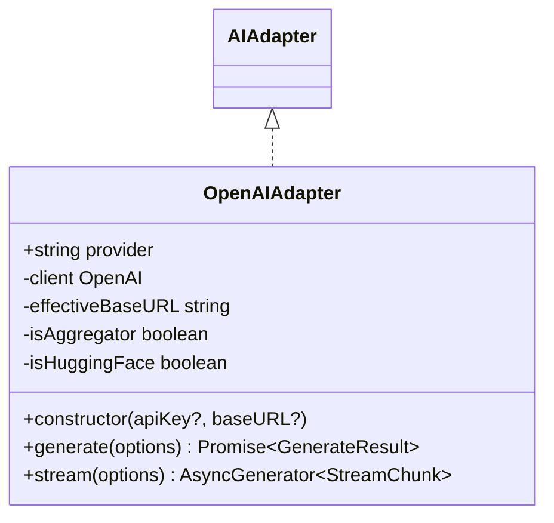

**Diagram sources**
- [openai.ts:36-222](file://lib/ai/adapters/openai.ts#L36-L222)
- [base.ts:50-72](file://lib/ai/adapters/base.ts#L50-L72)

**Section sources**
- [openai.ts:36-222](file://lib/ai/adapters/openai.ts#L36-L222)

#### AnthropicAdapter
- Uses the native REST API (/v1/messages) via fetch
- Converts messages and enforces model-specific token caps
- Streams using SSE-like parsing of streamed events

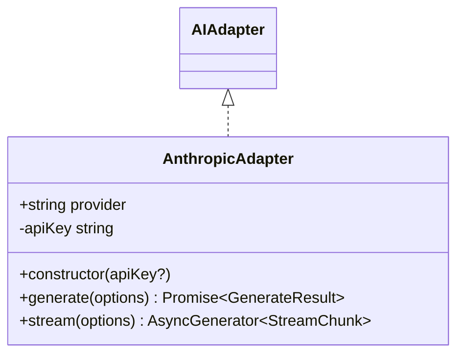

**Diagram sources**
- [anthropic.ts:71-208](file://lib/ai/adapters/anthropic.ts#L71-L208)
- [base.ts:50-72](file://lib/ai/adapters/base.ts#L50-L72)

**Section sources**
- [anthropic.ts:71-208](file://lib/ai/adapters/anthropic.ts#L71-L208)

#### GoogleAdapter
- Wraps Google’s OpenAI-compatible endpoint via the OpenAI SDK
- Applies provider-specific constraints (e.g., response_format not supported)

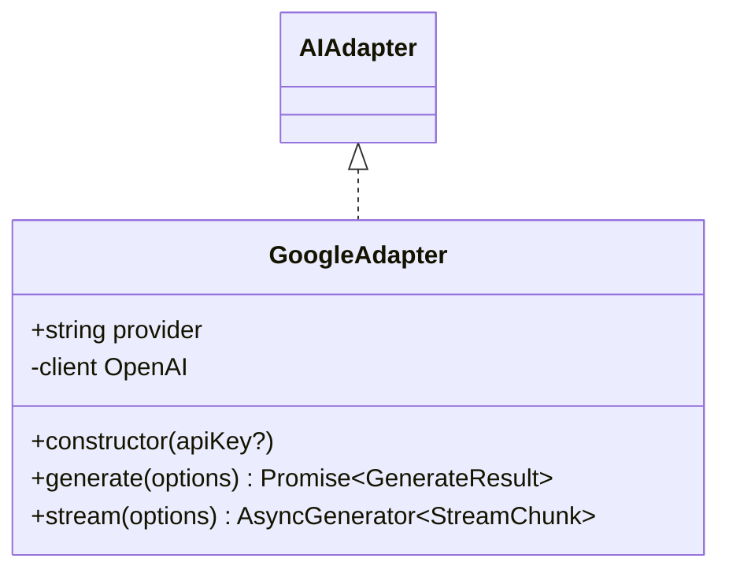

**Diagram sources**
- [google.ts:24-89](file://lib/ai/adapters/google.ts#L24-L89)
- [base.ts:50-72](file://lib/ai/adapters/base.ts#L50-L72)

**Section sources**
- [google.ts:24-89](file://lib/ai/adapters/google.ts#L24-L89)

#### OllamaAdapter
- Uses the OpenAI-compatible endpoint exposed by Ollama
- Supports tool-calling when the model allows it

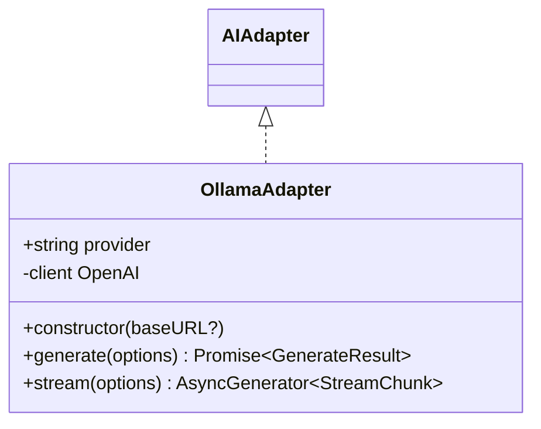

**Diagram sources**
- [ollama.ts:21-86](file://lib/ai/adapters/ollama.ts#L21-L86)
- [base.ts:50-72](file://lib/ai/adapters/base.ts#L50-L72)

**Section sources**
- [ollama.ts:21-86](file://lib/ai/adapters/ollama.ts#L21-L86)

### CachedAdapter Wrapper
The CachedAdapter adds deterministic caching for both generate and stream:
- generate: Computes a cache key from model, messages, temperature, and tools; serves cached results with zero usage; otherwise stores fresh results
- stream: Buffers chunks, yields them with minimal delays, and stores the array for future requests
- Metrics: Dispatches latency and usage metrics for both cached and fresh results

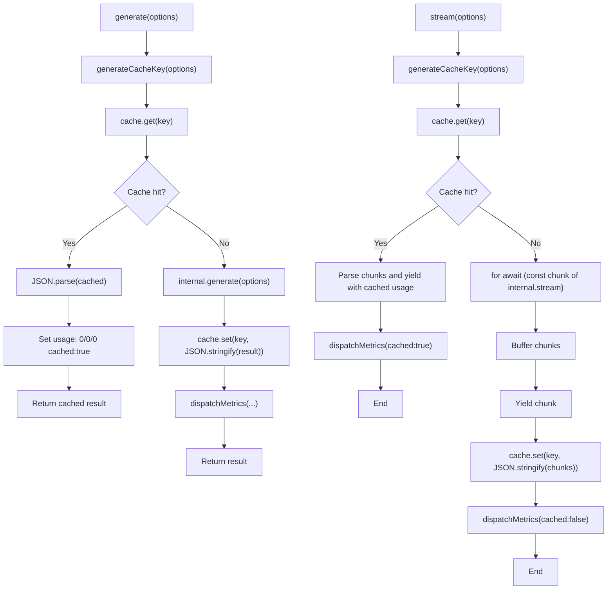

**Diagram sources**
- [index.ts:82-138](file://lib/ai/adapters/index.ts#L82-L138)
- [cache.ts:126-141](file://lib/ai/cache.ts#L126-L141)

**Section sources**
- [index.ts:82-138](file://lib/ai/adapters/index.ts#L82-L138)
- [cache.ts:126-141](file://lib/ai/cache.ts#L126-L141)

### UnconfiguredAdapter
When no credentials are available, this adapter returns:
- JSON content for JSON mode requests with a structured message
- A React component string for UI rendering
- Streamed chunks that render a friendly configuration prompt

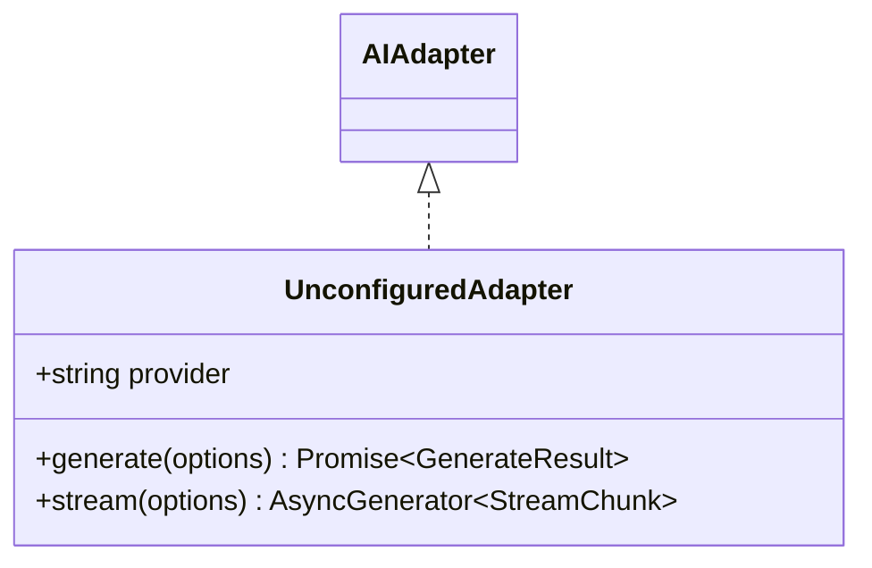

**Diagram sources**
- [unconfigured.ts:13-98](file://lib/ai/adapters/unconfigured.ts#L13-L98)
- [base.ts:50-72](file://lib/ai/adapters/base.ts#L50-L72)

**Section sources**
- [unconfigured.ts:13-98](file://lib/ai/adapters/unconfigured.ts#L13-L98)

### Types and Pricing
- GenerateOptions and GenerateResult define the cross-provider contract
- StreamChunk standardizes streaming deltas and final usage
- ProviderName enumerates supported providers
- costEstimateUsd estimates USD cost using a pricing table

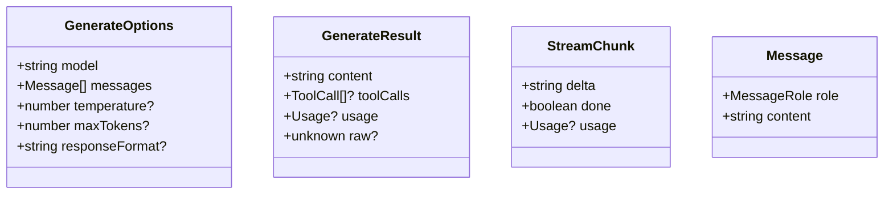

**Diagram sources**
- [types.ts:19-55](file://lib/ai/types.ts#L19-L55)

**Section sources**
- [types.ts:19-55](file://lib/ai/types.ts#L19-L55)
- [types.ts:59-130](file://lib/ai/types.ts#L59-L130)

### Security and Credential Resolution
- workspaceKeyService retrieves and caches decrypted keys per workspace/provider with a TTL
- Authorization checks can be enforced when a userId is provided
- getWorkspaceAdapter prioritizes DB-resolved keys, then environment variables, and finally returns UnconfiguredAdapter

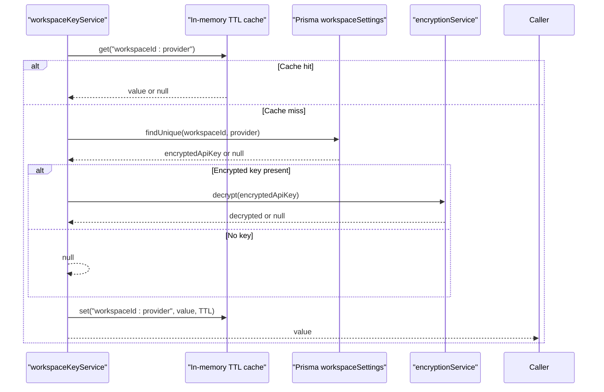

**Diagram sources**
- [workspaceKeyService.ts:32-95](file://lib/security/workspaceKeyService.ts#L32-L95)

**Section sources**
- [workspaceKeyService.ts:32-95](file://lib/security/workspaceKeyService.ts#L32-L95)

## Dependency Analysis
The adapter system exhibits low coupling and high cohesion:
- AIAdapter is the central dependency for all adapters
- index.ts orchestrates creation, detection, caching, and error handling
- Each provider adapter depends only on the shared types and tools
- workspaceKeyService is a pure function with no circular dependencies
- cache.ts is pluggable and isolated

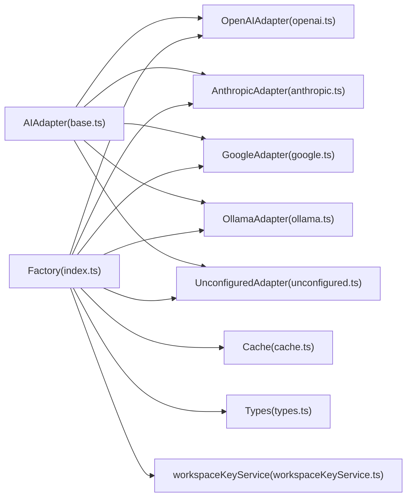

**Diagram sources**
- [base.ts:50-72](file://lib/ai/adapters/base.ts#L50-L72)
- [index.ts:19-306](file://lib/ai/adapters/index.ts#L19-L306)
- [openai.ts:16-222](file://lib/ai/adapters/openai.ts#L16-L222)
- [anthropic.ts:16-208](file://lib/ai/adapters/anthropic.ts#L16-L208)
- [google.ts:16-89](file://lib/ai/adapters/google.ts#L16-L89)
- [ollama.ts:13-86](file://lib/ai/adapters/ollama.ts#L13-L86)
- [unconfigured.ts:3-98](file://lib/ai/adapters/unconfigured.ts#L3-L98)
- [cache.ts:18-141](file://lib/ai/cache.ts#L18-L141)
- [types.ts:19-130](file://lib/ai/types.ts#L19-L130)
- [workspaceKeyService.ts:32-138](file://lib/security/workspaceKeyService.ts#L32-L138)

**Section sources**
- [index.ts:19-306](file://lib/ai/adapters/index.ts#L19-L306)

## Performance Considerations
- Deterministic cache keys minimize cache misses for identical requests
- Upstash Redis provides serverless-compatible caching in production; in-memory fallback avoids blocking in development
- CachedAdapter reduces latency and provider load by serving cached results immediately
- Streaming yields chunks with minimal delay to improve perceived responsiveness
- Provider-specific caps prevent excessive token usage and reduce cost

[No sources needed since this section provides general guidance]

## Troubleshooting Guide
Common issues and resolutions:
- Missing API key: getWorkspaceAdapter falls back to environment variables; if still missing, returns UnconfiguredAdapter with a helpful message
- Provider detection ambiguity: Prefer explicit provider configuration; detectProvider is a fallback heuristic
- Environment constraints: Some providers restrict parameters (e.g., reasoning models, aggregators, Google proxy); adapters adjust accordingly
- Local models unreachable on Vercel: Ollama/LM Studio adapters return UnconfiguredAdapter to avoid connection errors

**Section sources**
- [index.ts:236-278](file://lib/ai/adapters/index.ts#L236-L278)
- [index.ts:56-64](file://lib/ai/adapters/index.ts#L56-L64)
- [openai.ts:98-126](file://lib/ai/adapters/openai.ts#L98-L126)
- [google.ts:46-50](file://lib/ai/adapters/google.ts#L46-L50)
- [unconfigured.ts:16-74](file://lib/ai/adapters/unconfigured.ts#L16-L74)

## Conclusion
The Adapter Pattern implementation cleanly abstracts multiple AI providers behind a single, consistent interface. The factory pattern ensures secure, deterministic adapter selection and instantiation, while the caching wrapper improves performance and observability. Security is enforced by resolving credentials server-side and preventing client-side injection. Provider detection and fallback mechanisms ensure robust operation across diverse configurations.

[No sources needed since this section summarizes without analyzing specific files]

## Appendices

### How to Integrate a New AI Provider
Steps to add a new provider:
1. Create a new adapter class implementing AIAdapter in a new file under lib/ai/adapters
2. Normalize provider-specific message formats, constraints, and streaming behavior
3. Export the new adapter from lib/ai/adapters/index.ts and update the exports
4. Add provider detection logic in detectProvider if needed
5. Add environment variable fallbacks in getWorkspaceAdapter if applicable
6. Optionally add pricing entries in PROVIDER_PRICING in types.ts
7. Write tests similar to adapters.test.ts and adapterIndex.test.ts to validate behavior

Example references:
- Adapter class structure: [openai.ts:36-222](file://lib/ai/adapters/openai.ts#L36-L222)
- Factory exports: [index.ts:298-305](file://lib/ai/adapters/index.ts#L298-L305)
- Provider detection: [index.ts:56-64](file://lib/ai/adapters/index.ts#L56-L64)
- Credential resolution: [index.ts:236-278](file://lib/ai/adapters/index.ts#L236-L278)
- Pricing: [types.ts:83-129](file://lib/ai/types.ts#L83-L129)

**Section sources**
- [openai.ts:36-222](file://lib/ai/adapters/openai.ts#L36-L222)
- [index.ts:298-305](file://lib/ai/adapters/index.ts#L298-L305)
- [index.ts:56-64](file://lib/ai/adapters/index.ts#L56-L64)
- [index.ts:236-278](file://lib/ai/adapters/index.ts#L236-L278)
- [types.ts:83-129](file://lib/ai/types.ts#L83-L129)

### Adapter Lifecycle
- Initialization: getWorkspaceAdapter resolves credentials and constructs the adapter
- Execution: generate or stream is invoked; CachedAdapter checks cache; if miss, calls the underlying adapter
- Caching: results are stored with deterministic keys; metrics are dispatched
- Termination: generate returns a complete result; stream yields chunks until done

**Section sources**
- [index.ts:236-278](file://lib/ai/adapters/index.ts#L236-L278)
- [index.ts:82-138](file://lib/ai/adapters/index.ts#L82-L138)

### Security Best Practices
- Never accept apiKey or baseUrl from clients; always resolve server-side
- Use workspaceKeyService to retrieve encrypted keys from the database
- Validate environment variable fallbacks and surface clear errors
- Return UnconfiguredAdapter for graceful degradation when credentials are missing

**Section sources**
- [index.ts:236-278](file://lib/ai/adapters/index.ts#L236-L278)
- [workspaceKeyService.ts:32-95](file://lib/security/workspaceKeyService.ts#L32-L95)