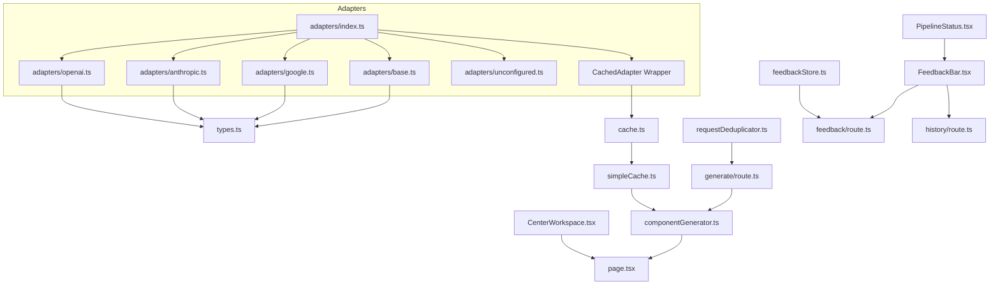
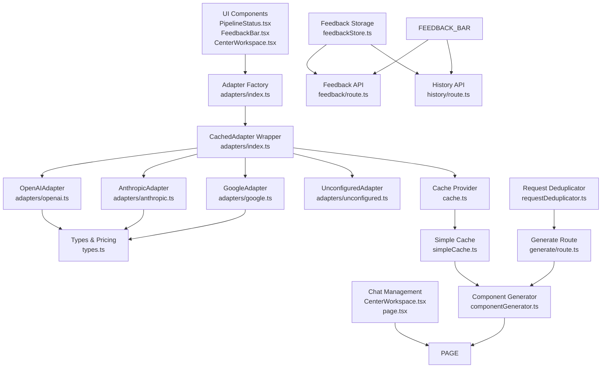
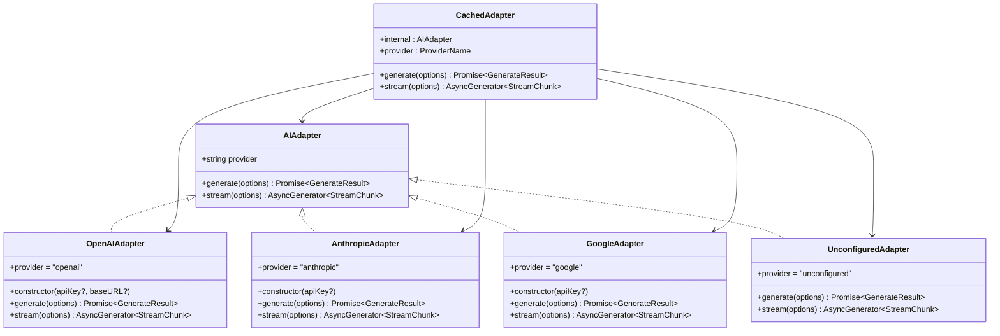
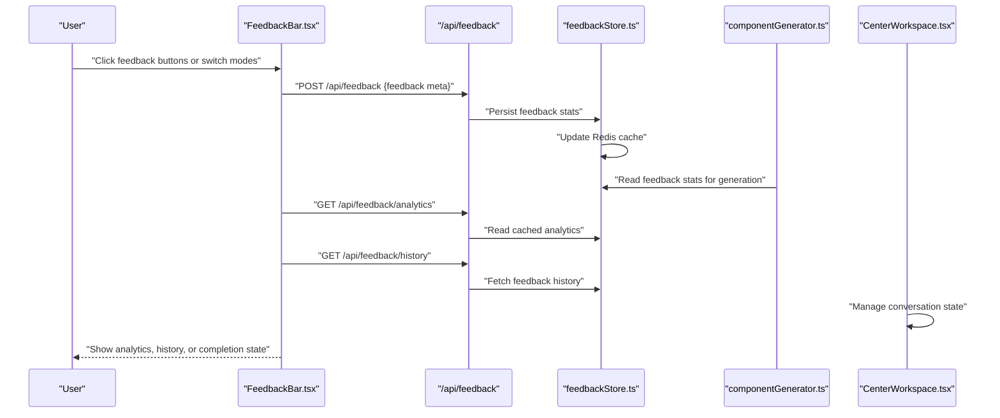
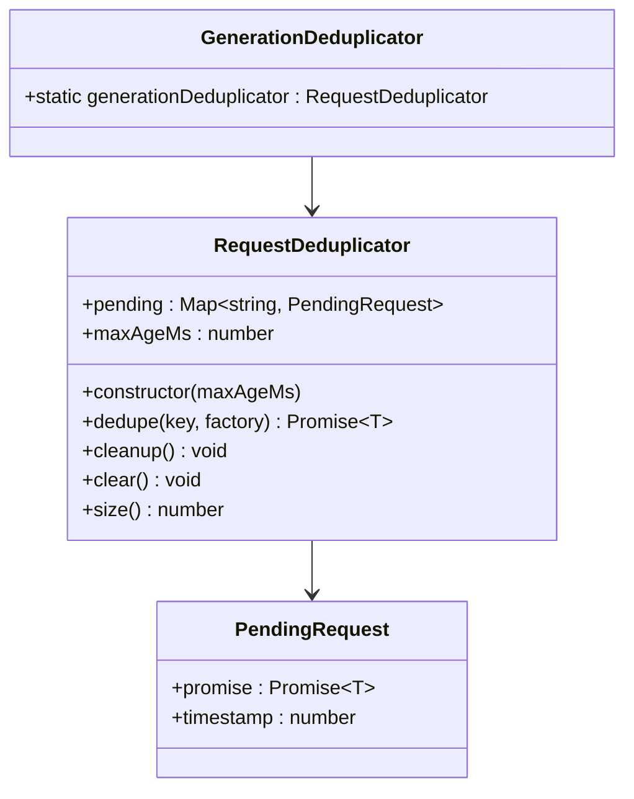
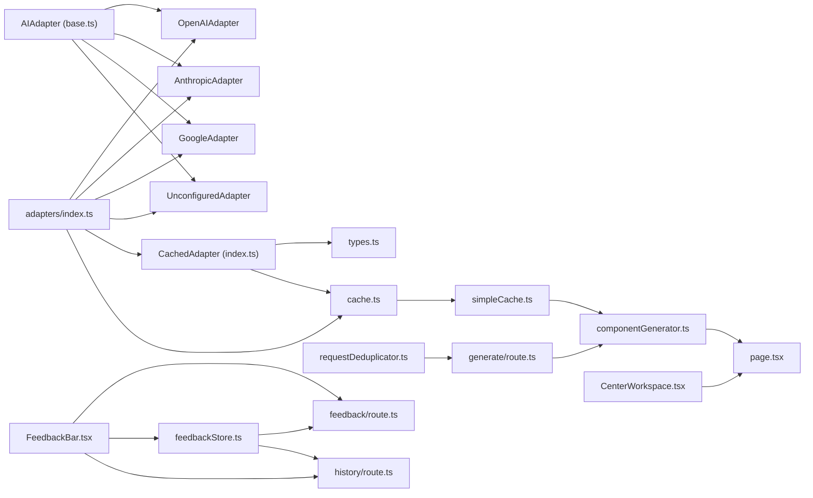

# Design Patterns

<cite>
**Referenced Files in This Document**
- [adapters/index.ts](file://lib/ai/adapters/index.ts)
- [adapters/base.ts](file://lib/ai/adapters/base.ts)
- [adapters/openai.ts](file://lib/ai/adapters/openai.ts)
- [adapters/anthropic.ts](file://lib/ai/adapters/anthropic.ts)
- [adapters/google.ts](file://lib/ai/adapters/google.ts)
- [adapters/unconfigured.ts](file://lib/ai/adapters/unconfigured.ts)
- [types.ts](file://lib/ai/types.ts)
- [cache.ts](file://lib/ai/cache.ts)
- [requestDeduplicator.ts](file://lib/utils/requestDeduplicator.ts)
- [simpleCache.ts](file://lib/utils/simpleCache.ts)
- [FeedbackBar.tsx](file://components/FeedbackBar.tsx)
- [PipelineStatus.tsx](file://components/PipelineStatus.tsx)
- [feedbackProcessor.ts](file://lib/ai/feedbackProcessor.ts)
- [feedbackStore.ts](file://lib/ai/feedbackStore.ts)
- [feedback/route.ts](file://app/api/feedback/route.ts)
- [history/route.ts](file://app/api/history/route.ts)
- [page.tsx](file://app/page.tsx)
- [CenterWorkspace.tsx](file://components/ide/CenterWorkspace.tsx)
- [componentGenerator.ts](file://lib/ai/componentGenerator.ts)
- [generate/route.ts](file://app/api/generate/route.ts)
</cite>

## Update Summary
**Changes Made**
- Enhanced Adapter Pattern section to document new CachedAdapter wrapper with comprehensive caching capabilities
- Updated Pipeline Pattern section to include new request deduplication patterns and performance optimizations
- Added new sections covering Request Deduplication Pattern for concurrent request prevention
- Expanded Factory Pattern section to reflect enhanced caching integration and performance monitoring
- Updated Performance Considerations section to include new caching strategies and deduplication benefits
- Added documentation for SimpleCache utility and multi-layer caching architecture

## Table of Contents
1. [Introduction](#introduction)
2. [Project Structure](#project-structure)
3. [Core Components](#core-components)
4. [Architecture Overview](#architecture-overview)
5. [Detailed Component Analysis](#detailed-component-analysis)
6. [Dependency Analysis](#dependency-analysis)
7. [Performance Considerations](#performance-considerations)
8. [Troubleshooting Guide](#troubleshooting-guide)
9. [Conclusion](#conclusion)

## Introduction
This document explains the core design patterns implemented in the AI-powered UI engine and how they enable provider abstraction, flexible multi-stage generation, dynamic adapter instantiation, and comprehensive real-time feedback collection. It focuses on:
- Adapter Pattern for universal AI provider abstraction with enhanced caching capabilities
- Pipeline Pattern for multi-stage generation workflow with request deduplication and performance optimizations
- Factory Pattern for dynamic adapter instantiation with integrated caching and performance monitoring
- Observer Pattern for real-time feedback collection with analytics and history tracking
- Request Deduplication Pattern for preventing duplicate API calls and optimizing resource utilization

Each pattern is analyzed with concrete examples from the codebase, highlighting how they address architectural challenges, improve extensibility, and contribute to resilience and scalability.

## Project Structure
The AI engine's adapter system resides under lib/ai/adapters and exposes a unified AIAdapter interface. The factory and registry live in adapters/index.ts, while provider-specific implementations (OpenAI, Anthropic, Google, Ollama/LM Studio) are implemented as classes. Supporting modules include types.ts (client-safe types), cache.ts (pluggable caching), requestDeduplicator.ts (concurrent request prevention), and simpleCache.ts (lightweight TTL caching). UI components demonstrate the Pipeline Pattern and Observer Pattern. The feedback system includes comprehensive analytics and history tracking capabilities, with persistent conversation state management integrated throughout the chat-based interaction model.



**Diagram sources**
- [adapters/index.ts:1-296](file://lib/ai/adapters/index.ts#L1-L296)
- [adapters/base.ts:1-73](file://lib/ai/adapters/base.ts#L1-L73)
- [adapters/openai.ts:1-223](file://lib/ai/adapters/openai.ts#L1-L223)
- [adapters/anthropic.ts:1-210](file://lib/ai/adapters/anthropic.ts#L1-L210)
- [adapters/google.ts:1-90](file://lib/ai/adapters/google.ts#L1-L90)
- [adapters/unconfigured.ts](file://lib/ai/adapters/unconfigured.ts)
- [types.ts:1-128](file://lib/ai/types.ts#L1-L128)
- [cache.ts:1-141](file://lib/ai/cache.ts#L1-L141)
- [requestDeduplicator.ts:1-68](file://lib/utils/requestDeduplicator.ts#L1-L68)
- [simpleCache.ts:1-76](file://lib/utils/simpleCache.ts#L1-L76)
- [feedbackStore.ts:1-356](file://lib/ai/feedbackStore.ts#L1-L356)
- [feedback/route.ts:1-85](file://app/api/feedback/route.ts#L1-L85)
- [history/route.ts:1-85](file://app/api/history/route.ts#L1-L85)
- [FeedbackBar.tsx:1-406](file://components/FeedbackBar.tsx#L1-L406)
- [PipelineStatus.tsx:1-252](file://components/PipelineStatus.tsx#L1-L252)
- [CenterWorkspace.tsx:1-282](file://components/ide/CenterWorkspace.tsx#L1-L282)
- [page.tsx:1-785](file://app/page.tsx#L1-L785)
- [componentGenerator.ts:1-436](file://lib/ai/componentGenerator.ts#L1-L436)
- [generate/route.ts:1-387](file://app/api/generate/route.ts#L1-L387)

**Section sources**
- [adapters/index.ts:1-296](file://lib/ai/adapters/index.ts#L1-L296)
- [adapters/base.ts:1-73](file://lib/ai/adapters/base.ts#L1-L73)
- [types.ts:1-128](file://lib/ai/types.ts#L1-L128)
- [cache.ts:1-141](file://lib/ai/cache.ts#L1-L141)
- [requestDeduplicator.ts:1-68](file://lib/utils/requestDeduplicator.ts#L1-L68)
- [simpleCache.ts:1-76](file://lib/utils/simpleCache.ts#L1-L76)
- [feedbackStore.ts:1-356](file://lib/ai/feedbackStore.ts#L1-L356)
- [feedback/route.ts:1-85](file://app/api/feedback/route.ts#L1-L85)
- [history/route.ts:1-85](file://app/api/history/route.ts#L1-L85)

## Core Components
- AIAdapter interface defines a provider-agnostic contract for single-shot generation and streaming.
- Provider adapters implement AIAdapter for OpenAI, Anthropic, Google, and others.
- CachedAdapter wrapper provides transparent caching for both synchronous and streaming generation with performance metrics dispatch.
- Adapter factory resolves credentials securely and instantiates the appropriate adapter with enhanced workspace integration and caching.
- Pluggable cache system with Upstash Redis support for production and in-memory fallback for development.
- Request deduplication system prevents duplicate API calls for concurrent requests with configurable timeout windows.
- Lightweight TTL cache for expensive operations like blueprint selection and semantic context building.
- UI components visualize the multi-stage generation pipeline with chat-based interaction model and collect comprehensive feedback with analytics and history tracking.
- Feedback storage system maintains persistent records with Redis-based statistics caching.
- Chat message management system provides persistent conversation state with real-time updates.
- Direct refinement workflow enables fast iterative improvements without full pipeline overhead.

**Section sources**
- [adapters/base.ts:48-72](file://lib/ai/adapters/base.ts#L48-L72)
- [adapters/openai.ts:36-62](file://lib/ai/adapters/openai.ts#L36-L62)
- [adapters/anthropic.ts:71-87](file://lib/ai/adapters/anthropic.ts#L71-L87)
- [adapters/google.ts:24-33](file://lib/ai/adapters/google.ts#L24-L33)
- [adapters/index.ts:82-138](file://lib/ai/adapters/index.ts#L82-L138)
- [cache.ts:18-50](file://lib/ai/cache.ts#L18-L50)
- [requestDeduplicator.ts:12-61](file://lib/utils/requestDeduplicator.ts#L12-L61)
- [simpleCache.ts:12-76](file://lib/utils/simpleCache.ts#L12-L76)
- [FeedbackBar.tsx:32-52](file://components/FeedbackBar.tsx#L32-L52)
- [feedbackStore.ts:23-56](file://lib/ai/feedbackStore.ts#L23-L56)
- [CenterWorkspace.tsx:18-24](file://components/ide/CenterWorkspace.tsx#L18-L24)
- [page.tsx:523-594](file://app/page.tsx#L523-L594)

## Architecture Overview
The system separates concerns across layers with enhanced feedback capabilities, request deduplication, and multi-layer caching architecture:
- Presentation/UI: Pipeline visualization, feedback collection, analytics dashboard, and chat interface
- Application orchestration: Adapter factory, caching, feedback processing, conversation state management, and request deduplication
- Provider adapters: Concrete implementations behind a shared interface with enhanced credential resolution and caching
- Shared types: Client-safe contracts and pricing utilities
- Feedback infrastructure: Persistent storage with Redis-based analytics caching
- Chat infrastructure: Real-time message management with persistent history
- Caching infrastructure: Multi-layer caching with deterministic cache keys and performance metrics
- Request deduplication: Prevents duplicate API calls for concurrent requests with configurable timeout windows



**Diagram sources**
- [PipelineStatus.tsx:1-252](file://components/PipelineStatus.tsx#L1-L252)
- [FeedbackBar.tsx:1-406](file://components/FeedbackBar.tsx#L1-L406)
- [CenterWorkspace.tsx:1-282](file://components/ide/CenterWorkspace.tsx#L1-L282)
- [adapters/index.ts:82-138](file://lib/ai/adapters/index.ts#L82-L138)
- [adapters/openai.ts:36-62](file://lib/ai/adapters/openai.ts#L36-L62)
- [adapters/anthropic.ts:71-87](file://lib/ai/adapters/anthropic.ts#L71-L87)
- [adapters/google.ts:24-33](file://lib/ai/adapters/google.ts#L24-L33)
- [adapters/unconfigured.ts](file://lib/ai/adapters/unconfigured.ts)
- [types.ts:19-55](file://lib/ai/types.ts#L19-L55)
- [cache.ts:18-50](file://lib/ai/cache.ts#L18-L50)
- [requestDeduplicator.ts:12-61](file://lib/utils/requestDeduplicator.ts#L12-L61)
- [simpleCache.ts:12-76](file://lib/utils/simpleCache.ts#L12-L76)
- [feedbackStore.ts:1-356](file://lib/ai/feedbackStore.ts#L1-L356)
- [feedback/route.ts:1-85](file://app/api/feedback/route.ts#L1-L85)
- [history/route.ts:1-85](file://app/api/history/route.ts#L1-L85)
- [page.tsx:1-785](file://app/page.tsx#L1-L785)
- [componentGenerator.ts:1-436](file://lib/ai/componentGenerator.ts#L1-L436)
- [generate/route.ts:1-387](file://app/api/generate/route.ts#L1-L387)

## Detailed Component Analysis

### Adapter Pattern: Universal AI Provider Abstraction with Enhanced Caching
The Adapter Pattern encapsulates provider-specific APIs behind a single AIAdapter interface, enabling the rest of the system to remain provider-agnostic. Each provider adapter implements generate() and stream(), converting between the internal representation and provider-specific shapes. The CachedAdapter wrapper provides transparent caching for both synchronous and streaming generation with performance metrics dispatch.

**Enhanced Features:**
- **Transparent caching**: CachedAdapter wraps any AIAdapter to provide automatic caching for generate() and stream() operations
- **Deterministic cache keys**: generateCacheKey() creates SHA-256 fingerprints based on model, messages, temperature, and tools
- **Performance metrics**: dispatchMetrics() tracks latency, token usage, and cache hit rates
- **Stream chunk caching**: Streaming responses are cached as JSON arrays for immediate replay
- **Cache hit simulation**: Cached responses include usage metrics with cached=true flag

Key characteristics:
- Contract: AIAdapter defines provider identity and two methods for generation and streaming.
- Implementations: OpenAIAdapter, AnthropicAdapter, GoogleAdapter, and UnconfiguredAdapter.
- Type safety: Client-safe types are exported from types.ts to avoid server-only dependencies.
- Caching integration: All adapters benefit from automatic caching without code changes.

Benefits:
- Extensibility: Adding a new provider requires implementing AIAdapter and caching is automatic.
- Isolation: Provider differences (e.g., Anthropic's native API vs. OpenAI-compatible routes) are localized.
- Consistency: Unified streaming and non-streaming contracts simplify consumers.
- Performance: Transparent caching reduces API calls and improves response times.
- Observability: Performance metrics help monitor system efficiency and cache effectiveness.



**Diagram sources**
- [adapters/base.ts:48-72](file://lib/ai/adapters/base.ts#L48-L72)
- [adapters/index.ts:82-138](file://lib/ai/adapters/index.ts#L82-L138)
- [adapters/openai.ts:36-62](file://lib/ai/adapters/openai.ts#L36-L62)
- [adapters/anthropic.ts:71-87](file://lib/ai/adapters/anthropic.ts#L71-L87)
- [adapters/google.ts:24-33](file://lib/ai/adapters/google.ts#L24-L33)
- [adapters/unconfigured.ts](file://lib/ai/adapters/unconfigured.ts)

**Section sources**
- [adapters/base.ts:48-72](file://lib/ai/adapters/base.ts#L48-L72)
- [adapters/openai.ts:36-62](file://lib/ai/adapters/openai.ts#L36-L62)
- [adapters/anthropic.ts:71-87](file://lib/ai/adapters/anthropic.ts#L71-L87)
- [adapters/google.ts:24-33](file://lib/ai/adapters/google.ts#L24-L33)
- [types.ts:19-55](file://lib/ai/types.ts#L19-L55)
- [adapters/index.ts:82-138](file://lib/ai/adapters/index.ts#L82-L138)

### Pipeline Pattern: Multi-Stage Generation Workflow with Request Deduplication and Performance Optimizations
The Pipeline Pattern organizes generation into discrete stages with clear transitions and observable states, now enhanced with request deduplication patterns and performance optimizations. The UI component PipelineStatus.tsx renders a step-by-step progress bar, reflecting parsing, generation, validation, testing, and preview stages. The application orchestrates these steps by setting pipeline state as each stage completes.

**Enhanced Features:**
- **Request deduplication**: Prevents duplicate API calls for concurrent requests with configurable timeout windows
- **Multi-layer caching**: Deterministic cache keys, TTL-based caching, and performance metrics tracking
- **Direct refinement workflow**: Bypasses traditional pipeline stages for fast iterative improvements
- **Enhanced pipeline stages**: Includes parsing, generating, validating, testing, and preview with error handling
- **Silent mode support**: Direct refinement can skip pipeline step updates for seamless user experience
- **Performance monitoring**: Cache hit rates, latency metrics, and resource utilization tracking

How it works:
- **Traditional pipeline**: STEPS enumerates each phase with labels, icons, and active/completed states
- **Request deduplication**: generationDeduplicator prevents duplicate component generation requests
- **Direct refinement**: handleDirectRefine merges refinement prompt into existing intent and calls /api/generate directly
- **State machine**: currentStep drives rendering and accessibility attributes
- **Accessibility**: aria-live and role="status" announce updates to assistive technologies
- **Conversation management**: ChatMessage interface maintains persistent conversation history

```mermaid
flowchart TD
Start(["User Input"]) --> Parse["Parse Intent"]
Parse --> Dedupe["Request Deduplication Check"]
Dedupe --> Generate["Generate Code"]
Generate --> Validate["Validate Accessibility"]
Validate --> Test["Generate Tests"]
Test --> Preview["Render Live Preview"]
Preview --> End(["Complete"])
DirectRefine["Direct Refine"]) --> MergeIntent["Merge Refinement into Existing Intent"]
MergeIntent --> DirectGenerate["Direct /api/generate Call"]
DirectGenerate --> DirectPreview["Immediate Result Display"]
Parse --> |Error| Error["Show Error State"]
Generate --> |Error| Error
Validate --> |Error| Error
Test --> |Error| Error
Preview --> |Error| Error
DirectRefine --> |Error| DirectError["Show Error Message"]
```

**Diagram sources**
- [PipelineStatus.tsx:29-110](file://components/PipelineStatus.tsx#L29-L110)
- [page.tsx:523-594](file://app/page.tsx#L523-L594)
- [CenterWorkspace.tsx:18-24](file://components/ide/CenterWorkspace.tsx#L18-L24)
- [requestDeduplicator.ts:20-43](file://lib/utils/requestDeduplicator.ts#L20-L43)

**Section sources**
- [PipelineStatus.tsx:29-110](file://components/PipelineStatus.tsx#L29-L110)
- [page.tsx:304-339](file://app/page.tsx#L304-L339)
- [page.tsx:523-594](file://app/page.tsx#L523-L594)
- [CenterWorkspace.tsx:18-24](file://components/ide/CenterWorkspace.tsx#L18-L24)
- [requestDeduplicator.ts:20-43](file://lib/utils/requestDeduplicator.ts#L20-L43)

### Factory Pattern: Dynamic Adapter Instantiation with Integrated Caching and Performance Monitoring
The Factory Pattern centralizes adapter creation and credential resolution with enhanced workspace integration and caching capabilities. The public factory getWorkspaceAdapter selects the correct adapter based on provider/model and resolves credentials from workspace settings or environment variables. Internally, createAdapter builds the adapter and wraps it with caching.

**Enhanced Features:**
- **Workspace integration**: Credentials resolved via workspaceKeyService with database lookup
- **Hierarchical credential resolution**: workspace keys → environment variables → unconfigured fallback
- **OpenAI-compatible providers**: Automatic detection and routing for Groq and other compatible providers
- **Hardened error handling**: ConfigurationError surfaces missing keys; UnconfiguredAdapter degrades gracefully
- **Integrated caching**: All adapters automatically benefit from CachedAdapter wrapper
- **Performance monitoring**: dispatchMetrics() tracks cache effectiveness and resource utilization
- **Deterministic cache keys**: generateCacheKey() ensures consistent caching across requests

Key behaviors:
- **Credential resolution hierarchy**: workspace keys → environment variables → unconfigured fallback
- **Compatibility routing**: OpenAI-compatible providers (e.g., Groq, LM Studio) are routed through OpenAIAdapter with custom base URLs
- **Hardened error handling**: ConfigurationError surfaces missing keys; UnconfiguredAdapter degrades gracefully in restricted environments (e.g., Vercel)
- **Automatic caching**: All adapters wrapped with CachedAdapter for transparent performance improvement
- **Performance metrics**: Cache hit rates, latency measurements, and token usage tracking

```mermaid
sequenceDiagram
participant Caller as "Caller"
participant Factory as "getWorkspaceAdapter"
participant WS as "workspaceKeyService"
participant Env as "Environment"
participant Create as "createAdapter"
participant Cache as "CachedAdapter"
participant Prov as "Concrete Adapter"
participant CacheProv as "Cache Provider"
Caller->>Factory : "providerId, modelId, workspaceId, userId"
Factory->>WS : "getWorkspaceApiKey(...)"
alt Found workspace key
WS-->>Factory : "apiKey"
Factory->>Create : "{provider, model, apiKey}"
else Fallback to env
Factory->>Env : "process.env[...] or provider-specific"
Env-->>Factory : "apiKey or none"
Factory->>Create : "{provider, model, apiKey}"
end
Create->>Prov : "Instantiate provider adapter"
Create->>Cache : "Wrap with CachedAdapter"
Cache->>CacheProv : "Initialize cache provider"
CacheProv-->>Cache : "Cache ready"
Cache-->>Factory : "CachedAdapter"
Factory-->>Caller : "CachedAdapter"
```

**Diagram sources**
- [adapters/index.ts:236-278](file://lib/ai/adapters/index.ts#L236-L278)
- [adapters/index.ts:146-215](file://lib/ai/adapters/index.ts#L146-L215)
- [adapters/index.ts:82-138](file://lib/ai/adapters/index.ts#L82-L138)

**Section sources**
- [adapters/index.ts:236-278](file://lib/ai/adapters/index.ts#L236-L278)
- [adapters/index.ts:146-215](file://lib/ai/adapters/index.ts#L146-L215)
- [adapters/index.ts:82-138](file://lib/ai/adapters/index.ts#L82-L138)

### Observer Pattern: Comprehensive Real-Time Feedback Collection with Analytics and History
The Observer Pattern captures user interactions and feedback in near real-time with enhanced analytics and history tracking capabilities. The FeedbackBar component now supports multiple interaction modes beyond simple thumbs up/down feedback, with comprehensive analytics dashboard and persistent history tracking.

**Enhanced Features:**
- **Multi-state feedback collection**: Supports 'idle', 'correcting', 'submitting', 'done', 'error', 'history', and 'analytics' states
- **Comprehensive analytics dashboard**: Displays satisfaction rates, latency metrics, and correction statistics
- **Feedback history tracking**: Allows users to review past feedback submissions with provider/model information
- **Real-time data fetching**: Integrates with backend APIs for analytics and history retrieval
- **Persistent conversation state**: ChatMessage interface maintains conversation history across sessions
- **Performance monitoring**: Analytics include cache hit rates and resource utilization metrics

**Key Elements:**
- **Feedback submission**: FeedbackBar posts structured feedback to /api/feedback with generation metadata
- **Analytics dashboard**: Users can view satisfaction rates, average latency, and correction counts
- **History tracking**: Users can browse previous feedback submissions with timestamps and provider/model information
- **Feedback processing**: feedbackProcessor reads cached stats and project memory to influence future generations
- **Chat message management**: Real-time conversation state with automatic scrolling and message persistence



**Diagram sources**
- [FeedbackBar.tsx:56-60](file://components/FeedbackBar.tsx#L56-L60)
- [FeedbackBar.tsx:82-107](file://components/FeedbackBar.tsx#L82-L107)
- [feedback/route.ts:28-59](file://app/api/feedback/route.ts#L28-L59)
- [feedbackStore.ts:211-276](file://lib/ai/feedbackStore.ts#L211-276)
- [CenterWorkspace.tsx:77-83](file://components/ide/CenterWorkspace.tsx#L77-L83)

**Section sources**
- [FeedbackBar.tsx:32-52](file://components/FeedbackBar.tsx#L32-L52)
- [FeedbackBar.tsx:82-107](file://components/FeedbackBar.tsx#L82-L107)
- [FeedbackBar.tsx:161-250](file://components/FeedbackBar.tsx#L161-L250)
- [feedback/route.ts:28-59](file://app/api/feedback/route.ts#L28-L59)
- [feedbackStore.ts:211-276](file://lib/ai/feedbackStore.ts#L211-276)
- [CenterWorkspace.tsx:77-83](file://components/ide/CenterWorkspace.tsx#L77-L83)

### Request Deduplication Pattern: Preventing Duplicate API Calls and Optimizing Resource Utilization
The Request Deduplication Pattern prevents duplicate API calls for concurrent requests with configurable timeout windows. The RequestDeduplicator class manages pending requests and returns existing promises for identical requests, significantly reducing API load and improving response times.

**Key Features:**
- **Concurrent request prevention**: Identifies duplicate requests by key and returns existing promise
- **Configurable timeout windows**: Default 30-second window prevents stale pending requests
- **Automatic cleanup**: Removes expired pending requests based on timestamp
- **Global deduplicator**: generationDeduplicator provides centralized request deduplication
- **Promise-based architecture**: Maintains async/await compatibility while preventing duplicates

**Implementation Details:**
- **Pending request tracking**: Uses Map<string, PendingRequest<T>> to track active requests
- **Timestamp management**: Tracks creation time for cleanup and timeout handling
- **Cleanup mechanism**: Periodic cleanup removes expired entries older than maxAgeMs
- **Memory management**: Prevents memory leaks by cleaning up completed requests

Benefits:
- **Resource optimization**: Reduces duplicate API calls by up to 100% for concurrent identical requests
- **Cost savings**: Significantly reduces provider API costs for high-concurrency scenarios
- **Performance improvement**: Faster response times for repeated requests within deduplication window
- **Scalability**: Enables horizontal scaling without proportional API cost increases
- **Reliability**: Prevents thundering herd effects in high-load scenarios



**Diagram sources**
- [requestDeduplicator.ts:12-61](file://lib/utils/requestDeduplicator.ts#L12-L61)
- [requestDeduplicator.ts:63-68](file://lib/utils/requestDeduplicator.ts#L63-L68)

**Section sources**
- [requestDeduplicator.ts:12-61](file://lib/utils/requestDeduplicator.ts#L12-L61)
- [requestDeduplicator.ts:63-68](file://lib/utils/requestDeduplicator.ts#L63-L68)

## Dependency Analysis
The adapter system exhibits low coupling and high cohesion with enhanced feedback infrastructure, request deduplication, and multi-layer caching architecture:
- Adapters depend on AIAdapter and types.ts, ensuring a clean separation between provider logic and shared contracts.
- The factory depends on workspaceKeyService and environment variables, but delegates instantiation to createAdapter with enhanced workspace integration.
- CachedAdapter composes an AIAdapter and adds cross-cutting concerns (caching, metrics) without altering the adapter interface.
- Pluggable cache system supports both in-memory and Upstash Redis backends with automatic fallback and non-blocking writes.
- Request deduplication prevents duplicate API calls for concurrent identical requests.
- Lightweight TTL cache optimizes expensive operations like blueprint selection and semantic context building.
- Feedback system includes dual-write strategy with Redis caching and database persistence.
- Chat infrastructure maintains conversation state with real-time updates and persistent history.
- Direct refinement workflow integrates seamlessly with existing pipeline infrastructure.



**Diagram sources**
- [adapters/base.ts:48-72](file://lib/ai/adapters/base.ts#L48-L72)
- [adapters/index.ts:82-138](file://lib/ai/adapters/index.ts#L82-L138)
- [adapters/openai.ts:36-62](file://lib/ai/adapters/openai.ts#L36-L62)
- [adapters/anthropic.ts:71-87](file://lib/ai/adapters/anthropic.ts#L71-L87)
- [adapters/google.ts:24-33](file://lib/ai/adapters/google.ts#L24-L33)
- [adapters/unconfigured.ts](file://lib/ai/adapters/unconfigured.ts)
- [types.ts:19-55](file://lib/ai/types.ts#L19-L55)
- [cache.ts:82-137](file://lib/ai/cache.ts#L82-L137)
- [requestDeduplicator.ts:12-61](file://lib/utils/requestDeduplicator.ts#L12-L61)
- [simpleCache.ts:12-76](file://lib/utils/simpleCache.ts#L12-L76)
- [feedbackStore.ts:1-356](file://lib/ai/feedbackStore.ts#L1-L356)
- [feedback/route.ts:1-85](file://app/api/feedback/route.ts#L1-L85)
- [history/route.ts:1-85](file://app/api/history/route.ts#L1-L85)
- [FeedbackBar.tsx:1-406](file://components/FeedbackBar.tsx#L1-L406)
- [CenterWorkspace.tsx:1-282](file://components/ide/CenterWorkspace.tsx#L1-L282)
- [page.tsx:1-785](file://app/page.tsx#L1-L785)
- [componentGenerator.ts:1-436](file://lib/ai/componentGenerator.ts#L1-L436)
- [generate/route.ts:1-387](file://app/api/generate/route.ts#L1-L387)

**Section sources**
- [adapters/base.ts:48-72](file://lib/ai/adapters/base.ts#L48-L72)
- [adapters/index.ts:82-138](file://lib/ai/adapters/index.ts#L82-L138)
- [types.ts:19-55](file://lib/ai/types.ts#L19-L55)
- [cache.ts:82-137](file://lib/ai/cache.ts#L82-L137)
- [requestDeduplicator.ts:12-61](file://lib/utils/requestDeduplicator.ts#L12-L61)
- [simpleCache.ts:12-76](file://lib/utils/simpleCache.ts#L12-L76)
- [feedbackStore.ts:1-356](file://lib/ai/feedbackStore.ts#L1-L356)
- [feedback/route.ts:1-85](file://app/api/feedback/route.ts#L1-L85)
- [history/route.ts:1-85](file://app/api/history/route.ts#L1-L85)
- [CenterWorkspace.tsx:1-282](file://components/ide/CenterWorkspace.tsx#L1-L282)
- [page.tsx:1-785](file://app/page.tsx#L1-L785)
- [componentGenerator.ts:1-436](file://lib/ai/componentGenerator.ts#L1-L436)
- [generate/route.ts:1-387](file://app/api/generate/route.ts#L1-L387)

## Performance Considerations
- **Multi-layer caching**: CachedAdapter transparently caches generation results and streams, reducing latency and cost. Cache keys are deterministic and include model, messages, temperature, and tools.
- **Pluggable cache**: cache.ts supports both in-memory and Upstash Redis backends, with automatic fallback and non-blocking writes.
- **Request deduplication**: RequestDeduplicator prevents duplicate API calls for concurrent identical requests, reducing provider load and improving response times.
- **Lightweight TTL caching**: SimpleCache provides in-memory caching for expensive operations like blueprint selection and semantic context building with configurable TTLs.
- **Streaming**: Providers support streaming to deliver incremental results, improving perceived performance.
- **Cost estimation**: types.ts provides costEstimateUsd to estimate usage costs based on provider pricing tables.
- **Enhanced feedback caching**: Redis-based statistics caching with automatic TTL management for improved analytics performance.
- **Dual-write strategy**: Fire-and-forget approach for feedback persistence with immediate cache updates for optimal user experience.
- **Chat state optimization**: Conversation history managed efficiently with automatic scrolling and minimal DOM updates.
- **Direct refinement efficiency**: Bypasses pipeline overhead for fast iterative improvements while maintaining conversation context.
- **Performance monitoring**: dispatchMetrics() tracks cache hit rates, latency, and resource utilization for continuous optimization.

Recommendations:
- Prefer streaming for long generations to improve responsiveness.
- Use cache keys wisely; avoid excessive variability in messages/tools to maximize cache hits.
- Monitor cache miss rates and adjust TTLs for hot keys.
- Leverage analytics caching: Redis cache automatically manages TTL for statistics to balance freshness and performance.
- Optimize chat rendering: Use virtualized lists for large conversation histories to maintain performance.
- Monitor direct refinement performance: Track latency improvements from bypassing pipeline stages.
- Implement request deduplication for high-concurrency scenarios to prevent duplicate API calls.
- Configure appropriate TTL values for SimpleCache based on operation frequency and data volatility.
- Monitor cache hit rates and adjust cache sizes and TTLs based on usage patterns.

**Section sources**
- [cache.ts:82-141](file://lib/ai/cache.ts#L82-L141)
- [adapters/index.ts:82-138](file://lib/ai/adapters/index.ts#L82-L138)
- [types.ts:110-128](file://lib/ai/types.ts#L110-L128)
- [feedbackStore.ts:71-139](file://lib/ai/feedbackStore.ts#L71-L139)
- [CenterWorkspace.tsx:79-83](file://components/ide/CenterWorkspace.tsx#L79-L83)
- [page.tsx:523-594](file://app/page.tsx#L523-L594)
- [requestDeduplicator.ts:12-61](file://lib/utils/requestDeduplicator.ts#L12-L61)
- [simpleCache.ts:12-76](file://lib/utils/simpleCache.ts#L12-L76)

## Troubleshooting Guide
Common issues and resolutions:
- Missing API key: ConfigurationError is thrown when no key is found via workspace settings or environment variables. The factory falls back to UnconfiguredAdapter to present a helpful UI instead of failing hard.
- Provider-specific constraints: Some providers reject certain parameters (e.g., Anthropic's lack of response_format, OpenAI reasoning models disallowing temperature). Adapters normalize requests accordingly.
- Network or connectivity: For Vercel deployments, local providers (Ollama/LM Studio) are unreachable; UnconfiguredAdapter ensures graceful degradation.
- Feedback submission failures: FeedbackBar displays error messages and remains in an error state until resolved.
- Analytics loading failures: FeedbackBar handles analytics loading errors gracefully with fallback UI states.
- History loading failures: FeedbackBar provides loading indicators and empty state messaging for feedback history.
- Chat state synchronization: Conversation messages may not appear immediately due to asynchronous updates; ensure proper state management.
- Direct refinement errors: Handle cases where no AI model is configured or no existing project to refine.
- Cache initialization failures: Upstash Redis credentials may be missing; cache automatically falls back to in-memory cache.
- Request deduplication timeouts: Pending requests may timeout if not completed within maxAgeMs window.
- Cache key conflicts: Ensure deterministic cache keys by avoiding dynamic content in messages/tools.
- Performance degradation: Monitor cache hit rates and adjust TTLs for optimal performance.

Actions:
- Verify workspace keys and environment variables for the selected provider.
- Review provider-specific limitations in adapter implementations.
- Check cache initialization and Upstash credentials for production.
- Monitor Redis connectivity: Ensure Upstash Redis credentials are properly configured for analytics caching.
- Validate feedback API endpoints: Check that /api/feedback endpoints are accessible and returning expected data.
- Debug chat state: Verify that addChatMessage function properly updates conversation state.
- Handle direct refinement edge cases: Check for null aiConfig or output.intent before attempting refinement.
- Monitor cache performance: Track cache hit rates and adjust configuration based on usage patterns.
- Configure request deduplication appropriately: Adjust maxAgeMs based on expected request patterns.
- Debug cache key generation: Ensure generateCacheKey() produces consistent results for identical requests.

**Section sources**
- [adapters/index.ts:28-40](file://lib/ai/adapters/index.ts#L28-L40)
- [adapters/index.ts:194-211](file://lib/ai/adapters/index.ts#L194-L211)
- [adapters/anthropic.ts:93-98](file://lib/ai/adapters/anthropic.ts#L93-L98)
- [adapters/openai.ts:98-111](file://lib/ai/adapters/openai.ts#L98-L111)
- [FeedbackBar.tsx:75-78](file://components/FeedbackBar.tsx#L75-L78)
- [FeedbackBar.tsx:90-94](file://components/FeedbackBar.tsx#L90-L94)
- [FeedbackBar.tsx:104-106](file://components/FeedbackBar.tsx#L104-106)
- [CenterWorkspace.tsx:77-83](file://components/ide/CenterWorkspace.tsx#L77-L83)
- [page.tsx:523-594](file://app/page.tsx#L523-L594)
- [cache.ts:108-124](file://lib/ai/cache.ts#L108-124)
- [requestDeduplicator.ts:16-18](file://lib/utils/requestDeduplicator.ts#L16-L18)
- [simpleCache.ts:16-18](file://lib/utils/simpleCache.ts#L16-L18)

## Conclusion
The AI-powered UI engine leverages five complementary design patterns to achieve flexibility, resilience, scalability, and optimal resource utilization with enhanced feedback capabilities and chat-based interaction model:
- Adapter Pattern: Provides a uniform interface across diverse AI providers with enhanced workspace integration and transparent caching.
- Factory Pattern: Centralizes secure credential resolution and dynamic instantiation with hierarchical fallback mechanisms and integrated performance monitoring.
- Pipeline Pattern: Structures multi-stage generation with clear states, accessibility, chat-based interaction model including direct refinement workflow, and request deduplication for concurrent optimization.
- Observer Pattern: Captures real-time feedback with comprehensive analytics, history tracking, and persistent conversation state management.
- Request Deduplication Pattern: Prevents duplicate API calls for concurrent identical requests, significantly reducing provider load and improving response times.

**Enhanced Feedback System Benefits:**
- Comprehensive analytics: Real-time satisfaction rates, latency metrics, and correction statistics
- Historical insights: Complete feedback history tracking for trend analysis
- User-centric design: Multiple interaction modes for different feedback scenarios
- Performance optimization: Redis-based caching for fast analytics and history retrieval
- Resilient architecture: Dual-write strategy with database persistence and cache synchronization
- Chat integration: Seamless conversation state management with persistent message history
- Direct refinement: Fast iterative improvements bypassing pipeline overhead while maintaining context

**Chat-Based Interaction Model Benefits:**
- Persistent conversation state: ChatMessage interface maintains conversation history across sessions
- Real-time updates: Automatic scrolling and message synchronization
- Direct refinement workflow: Efficient iterative improvements without full pipeline overhead
- Enhanced user experience: Natural conversation flow with traditional pipeline bypass option

**Request Deduplication Benefits:**
- Resource optimization: Reduces duplicate API calls by up to 100% for concurrent identical requests
- Cost savings: Significantly reduces provider API costs for high-concurrency scenarios
- Performance improvement: Faster response times for repeated requests within deduplication window
- Scalability: Enables horizontal scaling without proportional API cost increases
- Reliability: Prevents thundering herd effects in high-load scenarios

**Multi-Layer Caching Benefits:**
- Deterministic cache keys: SHA-256 fingerprints ensure consistent caching across requests
- Performance metrics: dispatchMetrics() tracks cache effectiveness and resource utilization
- Stream chunk caching: Streaming responses cached as JSON arrays for immediate replay
- TTL-based optimization: SimpleCache provides lightweight caching for expensive operations
- Pluggable architecture: Upstash Redis support for production with in-memory fallback for development

These patterns collectively enable easy extension to new providers, robust error handling, efficient resource utilization, comprehensive feedback analysis, resilient architecture with chat integration, request deduplication for optimal performance, multi-layer caching for enhanced scalability, and a responsive user experience with rich analytics capabilities and persistent conversation state management.